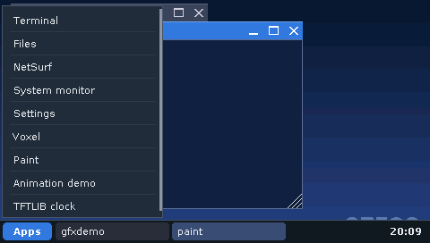

# CRTOS

System operacyjny dla płytki **NXP MIMXRT1050-EVKB** (i.MX RT1052, Cortex-M7 600 MHz).
Ma wielozadaniowe jądro z ochroną pamięci (MPU), sterowniki ładowane z karty SD, okna na
ekranie dotykowym z klawiaturą ekranową i wyglądem ustawianym jak w Windows (skala
interfejsu, czcionka, kolory, przezroczystość, zaokrąglenia, tapeta), powłokę przez port
szeregowy USB (albo klawiaturę i mysz USB), sieć TCP/IP, przeglądarkę internetową i zdalny pulpit (VNC) z przesyłaniem
plików (`crtos desktop`, `crtos scp`).

Rdzeń jądra jest też zwykłym RTOS-em: `crtos build --rtos` buduje go z jedną aplikacją
w obrazie flash, bez karty SD i sterowników ([RTOS bez systemu](docs/rtos.md)).



## Szybki start

**Potrzebujesz:** płytki MIMXRT1050-EVKB z ekranem dotykowym 4,3" (RK043FN66HS albo RK043FN02H), kabla micro-USB,
karty microSD sformatowanej jako FAT32 i komputera z Windows, Linuksem albo macOS.
Kabel sieciowy jest opcjonalny, ale bardzo przyspiesza wgrywanie plików.

Polecenia poniżej są w wersji dla Windows (PowerShell albo cmd). Na Linuksie i macOS pisz
`./crtos` zamiast `.\crtos`.

### 1. Przygotuj komputer

Zainstaluj [Pythona 3](https://www.python.org/downloads/) i [Gita](https://git-scm.com/downloads), a potem:

```
git clone https://github.com/aroesz98/CRTOS.git
cd CRTOS
.\crtos setup
```

`crtos setup` doinstaluje resztę: CMake, Ninja, kompilator Arm GCC i pakiety Pythona.
Pobierze też kod z zewnątrz (lwIP, TinyUSB, sterowniki NXP SDK, newlib, biblioteki GCC), którego nie ma w repozytorium.
Na końcu sam sprawdzi, czy niczego nie brakuje.

### 2. Zbuduj system

```
.\crtos build
```

Pierwsze budowanie trwa około minuty. Wynik trafia do katalogu `build/`. Kod z zewnątrz
build pobiera sam, jeśli go brakuje (git i sieć, około 40 MB, jednorazowo).

### 3. Wgraj system na płytkę

Włóż kartę microSD do płytki. Podłącz płytkę do komputera kablem USB (gniazdo **J28**,
opisane jako DEBUG/OpenSDA). Jeśli możesz, podłącz ją też kablem sieciowym do routera.
Potem wpisz:

```
.\crtos flash
.\crtos deploy
.\crtos reboot
```

- `flash` zapisuje jądro w pamięci flash płytki (około 10 s).
- `deploy` kopiuje pliki systemu na kartę SD, tylko do katalogu `/crtos`; reszty karty nie
  rusza. Za pierwszym razem pliki idą kablem USB, co trwa około 2,5 minuty. Następne
  wgrania wysyłają tylko zmiany i, gdy płytka jest w sieci, trwają sekundy.
- `reboot` uruchamia płytkę ponownie.

Po kilku sekundach na ekranie pojawi się pulpit. Programy otwierasz przyciskiem **Apps**.

Masz czytnik kart? Zamiast `crtos deploy` włóż kartę do komputera i wpisz
`.\crtos sdcard E:` (gdzie `E:` to litera karty), a potem przełóż kartę do płytki.

### 4. Twój pierwszy program

```
.\crtos new hello
.\crtos build
.\crtos deploy
.\crtos run hello
```

- `new` tworzy program z oknem w `apps/hello/hello.c` i dodaje go do menu **Apps**.
- `run` uruchamia go na płytce.

Zmień kod, a potem powtórz `build`, `deploy` i `run`.
Więcej w [docs/pierwszy-program.md](docs/pierwszy-program.md).

### 5. Opcjonalnie: toolchain

- `.\crtos toolchain`: `arm-crtos-gcc` i `arm-crtos-g++` na komputer, czyli kompilacja programów
  bez CMake.
- `.\crtos toolchain native` i `.\crtos toolchain install`: GCC działające na samej płytce
  (budowane w WSL albo Linuksie).

Instalacja obu: [docs/instalacja.md](docs/instalacja.md#toolchain-crtos-opcjonalnie).

## Najważniejsze polecenia

| Polecenie | Co robi |
|---|---|
| `crtos doctor` | sprawdza narzędzia, sondę i płytkę |
| `crtos build` | buduje cały system (albo `crtos build hello`, tylko jeden program; `--base`: bez dodatków; `--rtos`: sam RTOS z aplikacją) |
| `crtos flash` | zapisuje jądro w pamięci flash płytki |
| `crtos deploy` | wysyła na kartę SD płytki zmienione pliki (przez sieć albo kabel USB) |
| `crtos run NAZWA` | uruchamia program na płytce i pokazuje, co wypisuje |
| `crtos new NAZWA` | nowy program z szablonu (`--console`: konsolowy, `--service`: usługa) |
| `crtos serial` | terminal na płytce (powłoka `sh`) |
| `crtos kmon` | monitor jądra: procesy, pamięć, sterowniki, logi |
| `crtos shot` | zrzut ekranu płytki do pliku PNG |
| `crtos crash` | pokazuje ostatnią awarię programu z numerem linii w kodzie |
| `crtos desktop` | ekran płytki w oknie komputera (zdalny pulpit: mysz, klawiatura, schowek) |
| `crtos netbench` | przepustowość sieci płytki w obie strony (TCP, UDP) |
| `crtos scp PLIK board:/sd/crtos/` | kopiuje pliki na płytkę i z płytki przez sieć |
| `crtos wallpaper OBRAZ` | obraz z komputera jako tapeta płytki |
| `crtos reboot` | restart płytki |

Pełna lista: `crtos --help` i [docs/polecenie-crtos.md](docs/polecenie-crtos.md).

## Dokumentacja

1. [Instalacja](docs/instalacja.md): narzędzia, płytka, karta SD, rozwiązywanie problemów
2. [Budowanie i uruchamianie](docs/budowanie.md): co i jak się buduje, wgrywanie, sieć, MCUXpresso IDE
3. [Pierwszy program](docs/pierwszy-program.md): tworzenie, budowanie, uruchamianie i poprawianie programów
4. [API dla programów](docs/api.md): `crtos.h`, wątki, IPC, gniazda, okna i rysowanie (`gfx.h`)
5. [SDK](docs/sdk.md): programy budowane poza tym repozytorium
6. [Toolchain](docs/toolchain.md): `arm-crtos-gcc` i `arm-crtos-g++` – kompilacja programów bez CMake;
   programy wykonywane z flasha (XIP); GCC na samej płytce (`gcc`, `g++`, `make` w powłoce)
7. [Powłoka, edytor i make](docs/powloka.md): `sh` (potoki, zmienne, skrypty), `edit`, `make` na płytce
8. [Polecenie crtos](docs/polecenie-crtos.md): wszystkie polecenia i opcje
9. [Architektura](docs/architektura.md): warstwy systemu, start, pamięć, karta SD
10. [Sterowniki i drzewo urządzeń](docs/sterowniki.md): moduły jądra (`.ko`) i plik `.dts`
11. [Debugowanie](docs/debugowanie.md): monitor jądra, logi, awarie, debugger
12. [Wydajność](docs/wydajnosc.md): pomiary (`crtos bench`), wyniki, znane ograniczenia
13. [NetSurf](docs/netsurf.md): przeglądarka internetowa (opcjonalna)
14. [RTOS bez systemu](docs/rtos.md): sam rdzeń jądra z jedną aplikacją – zadania, kolejki,
    timery, przerwania
15. [Dokumentacja projektowa](docs/specyfikacja/README.md): jak działa system – architektura,
    każdy komponent (interfejs, implementacja, diagramy klas i sekwencji w PlantUML),
    analiza bezpieczeństwa, weryfikacja i ocena względem ISO 26262

## Katalogi

| Katalog | Zawartość |
|---|---|
| `kernel/` | jądro: `rtos/` (rdzeń RTOS), `os/` (procesy, pliki, moduły, start z karty), `subsys/` (frameworki sterowników), obsługa płytki (`platform/evkbimxrt1050`) |
| `drivers/` | sterowniki jako moduły jądra (`.ko`) |
| `system/` | system bazowy, budowany zawsze: biblioteki programów (`lib/`: `libcrtos`, `libgfx`, TFTLIB), usługi (`services/`), polecenia (`commands/`: `sh`, `edit`, `make`, `ping`, ...), programy z oknem (`apps/`: `wm`, `term`, `files`, `settings`, `sysmon`) |
| `apps/` | programy dodatkowe: `paint`, dema, NetSurf, gry; nowe programy z `crtos new` |
| `tests/` | testy i pomiary na płytce (`apptest`, `heaptest`, `bench`, ...) |
| `examples/` | przykłady: programy, moduł sterownika, aplikacja RTOS (`rtos/blinky`) |
| `rootfs/` | pliki kopiowane na kartę bez zmian (`etc/*.cfg`, certyfikaty, czcionki) |
| `dts/` | drzewo urządzeń płytki |
| `sdk/` | szablony programów i pliki SDK |
| `toolchain/` | reguły programu CRTOS dla GCC (`crtos.specs`, `crtos-xip.ld`), `arm-crtos-gcc`, `crtos-app`; `xiplibs/`: przepis bibliotek C i C++ programów XIP; `native/`: budowa GCC na płytkę |
| `tools/` | polecenie `crtos` i skrypty budowania |
| `third_party/` | kod z zewnątrz, pobierany przy budowaniu: `sources.txt` wymienia repozytoria i commity (lwIP, TinyUSB, pdpmake, sterowniki NXP SDK, newlib, biblioteki GCC; NetSurf po `crtos setup --netsurf`) |
| `patches/` | zmiany CRTOS w kodzie z zewnątrz i w GCC na płytkę ([opis](patches/README.md)) |
| `docs/` | dokumentacja użytkownika; `docs/specyfikacja/` – dokumentacja projektowa |

## Licencja

MIT: zobacz [LICENSE](LICENSE). Kod zewnętrzny w `third_party/` (pobierany) i
`kernel/platform/` ma własne licencje, opisane w nagłówkach plików i w pobranych
repozytoriach.
