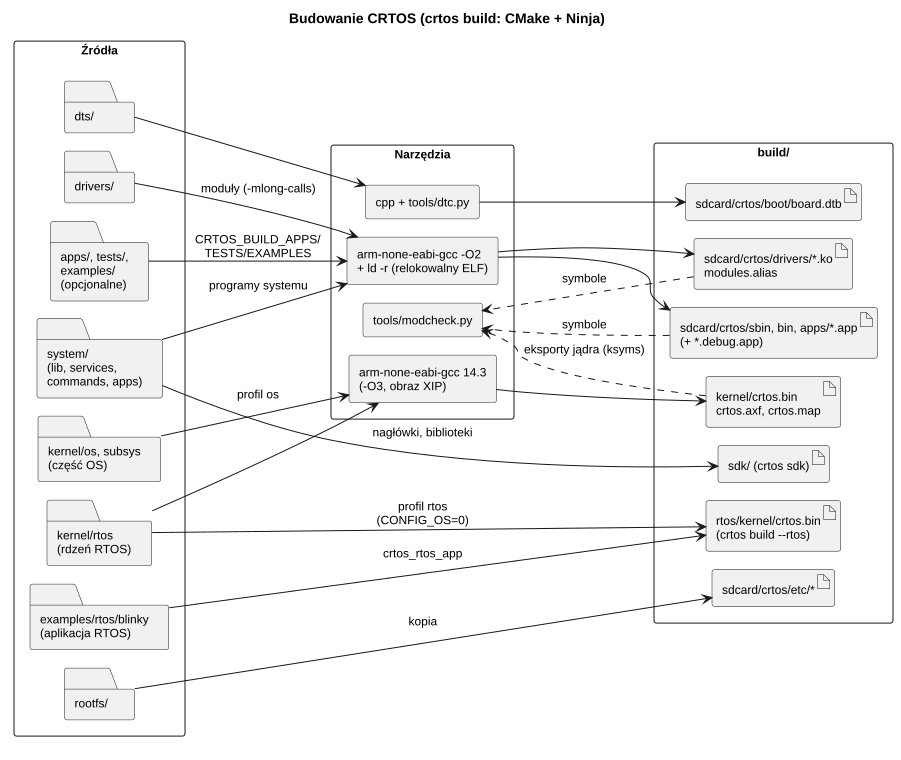
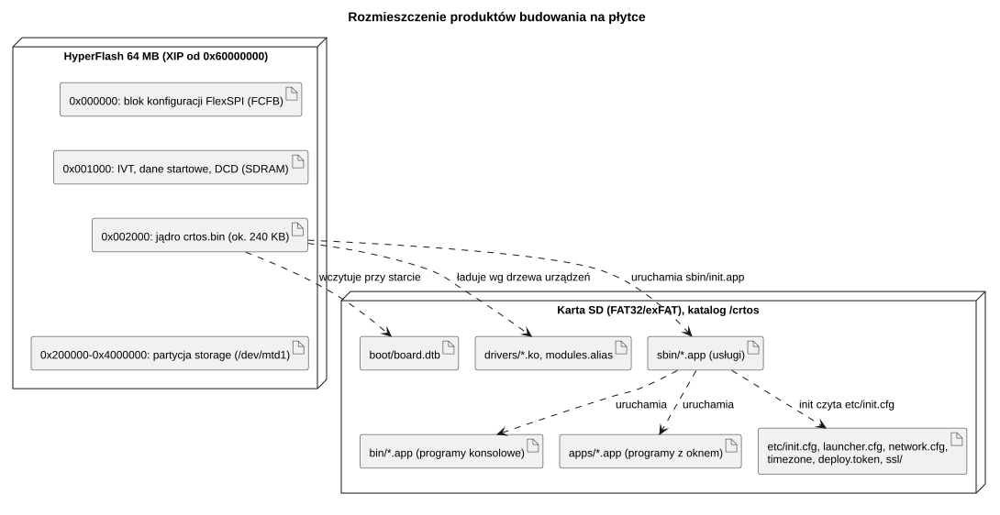
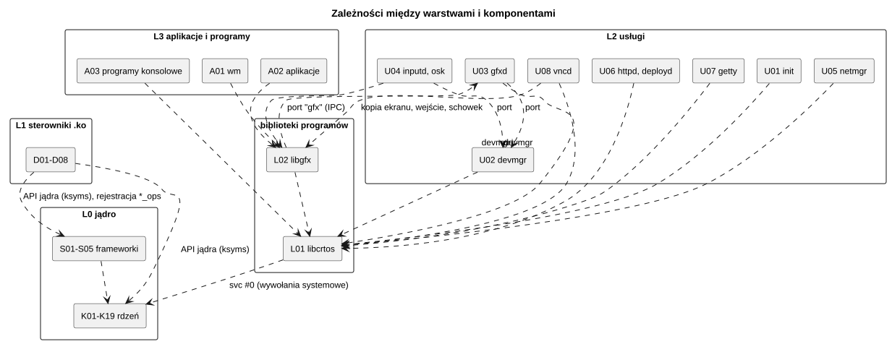

# 01 Struktura projektu

Dokument opisuje elementy konfiguracji CRTOS: katalogi źródeł i ich komponenty, sposób
budowania, produkty budowania, ich rozmieszczenie na płytce oraz komponenty zewnętrzne.
Odpowiada wymaganiom ISO 26262-8 dotyczącym zarządzania konfiguracją (rozdz. 7) i
kwalifikacji komponentów oprogramowania (rozdz. 12).

## 1. Drzewo katalogów

```
crtos/
├── CMakeLists.txt            budowanie całego systemu (jądro, moduły, programy, DTB, SDK);
│                             CRTOS_PROFILE=rtos: samo jądro RTOS z jedną aplikacją
├── crtos, crtos.cmd          polecenie "crtos" (Linux/macOS, Windows) -> tools/crtos.py
├── cmake/                    funkcje CMake: crtos_module, crtos_app, crtos_dtb, crtos_rtos_app, toolchain
├── kernel/                   L0: jądro (firmware w HyperFlash)
│   ├── main.cpp              start płytki (MPU, piny konsoli, zegary), potem kernel_main()
│   ├── rtos/                 rdzeń – kompletny RTOS: scheduler, synchronizacja, kolejki
│   │   │                     komunikatów, timery, konsola LPUART1 i printk, kmon (polecenia
│   │   │                     rdzenia), autotesty rdzenia, start (init.cpp)
│   │   ├── arch/             Cortex-M7: przełączanie kontekstu, SVC, przerwania, MPU, wyjątki
│   │   └── mm/               sterty jądra (TLSF)
│   ├── os/                   system operacyjny na rdzeniu (CONFIG_OS): procesy, wywołania
│   │   │                     systemowe, IPC, pamięć współdzielona, potoki, VFS, loader ELF,
│   │   │                     moduły, drzewo urządzeń, pamięć emulowana, kmon (polecenia OS)
│   │   └── boot/             start systemu: karta SD, FAT, drzewo urządzeń, moduły, init
│   ├── subsys/               frameworki podsystemów: clk, pinctrl, gpio, i2c, spi, fb, gpu2d, input, net
│   ├── lib/                  crc32, formatowanie printk, memcpy/memset (memops.c)
│   ├── include/crtos/        nagłówki interfejsów jądra (dla modułów, aplikacji RTOS i częściowo programów)
│   └── platform/evkbimxrt1050/  pakiet wsparcia płytki z NXP SDK: CMSIS, rejestry, startup,
│                             zegary, piny, nagłówek XIP i DCD, FatFs, skrypty linkera
├── drivers/                  L1: sterowniki jako moduły jądra (.ko)
├── system/                   system bazowy (przestrzeń użytkownika), budowany zawsze
│   ├── lib/                  biblioteki programów: libcrtos/, libgfx/, tftlib/
│   ├── services/             L2: usługi (init, devmgr, gfxd, inputd, osk, netmgr, httpd, deployd, vncd, getty)
│   ├── commands/             L3: programy konsolowe systemu (sh, where, edit, make, ping, ifconfig, ...)
│   └── apps/                 L3: programy z oknem systemu (wm, term, files, settings, sysmon)
├── apps/                     L3: programy dodatkowe (paint, gfxdemo, tftdemo, netsurf, gry) i nowe z "crtos new"
├── tests/                    testy i pomiary na płytce (apptest, heaptest, xiptest, bench, gfxtap, nettest,
│                             moduł touchpaint)
├── examples/                 przykłady: hello, hello_world, moduły drivers/hello, aplikacja RTOS rtos/blinky
├── dts/                      drzewo urządzeń: imxrt1052.dtsi (układ), evkbimxrt1050.dts (płytka)
├── rootfs/                   pliki kopiowane na kartę bez zmian (etc/*.cfg, certyfikaty, czcionki)
├── sdk/                      szablony programów ("crtos new") i pliki SDK
├── toolchain/                reguły programu CRTOS dla GCC (crtos.specs), arm-crtos-gcc, crtos-app
├── tools/                    polecenie crtos i narzędzia budowania/diagnostyki (Python)
├── third_party/              kod z zewnątrz, pobierany przy budowaniu: w gicie tylko sources.txt (repozytoria
│                             i commity: lwIP, TinyUSB, pdpmake, sterowniki NXP SDK; NetSurf po "crtos setup --netsurf")
├── patches/                  zmiany CRTOS w kodzie z zewnątrz (<katalog>.patch) i w GCC na płytkę (arm-gnu-toolchain/)
└── docs/                     dokumentacja użytkownika; docs/specyfikacja: ta dokumentacja
```

Jądro ma dwa profile budowania z tego samego rdzenia `kernel/rtos`:

| Profil | Zawartość obrazu | Start | Polecenie |
|---|---|---|---|
| `os` (domyślny) | `rtos/`, `os/`, `subsys/`, BSP | karta SD, drzewo urządzeń, moduły `.ko`, `init` i programy | `crtos build`, `crtos flash` |
| `rtos` | `rtos/`, BSP (bez FatFs i sterownika SD) i aplikacja (`crtos_rtos_app`) | zadanie `app` z `app_main()` aplikacji | `crtos build --rtos [KATALOG]`, `crtos flash --rtos` |

Przełącznik `CONFIG_OS` (`kernel/include/crtos/config.h`, w profilu `rtos` 0) wyłącza w rdzeniu
kilka miejsc styku z częścią OS: koniec wątku procesu (`sched.cpp`), błąd programu i pamięć
emulowana (`fault.cpp`), trampolina wywołań systemowych (`context.cpp`, w RTOS `-ENOSYS`),
terminal konsoli (`console_lpuart.cpp`), urządzenie `/dev/swdcon`, start (`init.cpp`), polecenia
kmon i autotesty części OS (dołączane tablicami z `os/kmon_os.cpp` i `os/tests_os.cpp`).

## 2. Katalogi i komponenty

| Katalog / pliki | Komponent |
|---|---|
| `kernel/rtos/arch/context.cpp` | [K01 Przełączanie kontekstu i wejście do jądra](komponenty/K01-kontekst-i-svc.md) |
| `kernel/rtos/arch/irq.cpp`, `include/crtos/irq.h` | [K02 Przerwania](komponenty/K02-przerwania.md) |
| `kernel/rtos/arch/mpu.cpp` | [K03 Ochrona pamięci (MPU)](komponenty/K03-mpu.md) |
| `kernel/rtos/arch/fault.cpp` | [K04 Wyjątki procesora](komponenty/K04-wyjatki.md) |
| `kernel/rtos/sched.cpp`, `kworker.cpp`, `include/crtos/sched.h` | [K05 Scheduler, czas i praca odroczona](komponenty/K05-scheduler.md) |
| `kernel/rtos/sync.cpp`, `include/crtos/sync.h` | [K06 Synchronizacja](komponenty/K06-synchronizacja.md) |
| `kernel/rtos/mm/`, `include/crtos/mm.h` | [K07 Pamięć jądra](komponenty/K07-pamiec-jadra.md) |
| `kernel/os/proc.cpp`, `handle.cpp` | [K08 Procesy, uchwyty i uprawnienia](komponenty/K08-procesy.md) |
| `kernel/os/syscall.cpp`, `sys_fs.cpp`, `sys_proc.cpp`, `include/crtos/syscall.h` | [K09 Wywołania systemowe](komponenty/K09-wywolania-systemowe.md) |
| `kernel/os/ipc.cpp` | [K10 IPC: porty i komunikaty](komponenty/K10-ipc.md) |
| `kernel/os/shm.cpp` | [K11 Pamięć współdzielona](komponenty/K11-pamiec-wspoldzielona.md) |
| `kernel/os/pipe.cpp`, `poll.cpp`, `include/crtos/poll.h` | [K12 Potoki i poll](komponenty/K12-potoki-i-poll.md) |
| `kernel/os/vfs.cpp`, `ramfs.cpp`, `include/crtos/vfs.h` | [K13 System plików (VFS)](komponenty/K13-vfs.md) |
| `kernel/os/boot/sdcard.cpp`, `fat.cpp` | [K14 Karta SD i FAT](komponenty/K14-karta-sd-fat.md) |
| `kernel/rtos/console_lpuart.cpp`, `rtos/printk.cpp`, `os/tty.cpp` | [K15 Konsola, log jądra i terminal](komponenty/K15-konsola-log.md) |
| `kernel/os/elf.cpp`, `module.cpp`, `app.cpp`, `ksyms.cpp` | [K16 Loader: moduły i programy](komponenty/K16-loader.md) |
| `kernel/os/of.cpp`, `device.cpp`, `uevent.cpp` | [K17 Drzewo urządzeń i model sterowników](komponenty/K17-drzewo-urzadzen.md) |
| `kernel/main.cpp`, `rtos/init.cpp`, `os/boot/boot.cpp` | [K18 Start systemu](komponenty/K18-start.md) |
| `kernel/rtos/kmon.cpp`, `swdcon.cpp`, `tests.cpp`, `kernel/os/kmon_os.cpp`, `kmon_cmds.cpp`, `kmon_dev.cpp`, `tests_os.cpp` | [K19 Monitor jądra i autotesty](komponenty/K19-kmon.md) |
| `kernel/os/vmem.cpp`, `os/emulate.cpp` | [K20 Pamięć emulowana](komponenty/K20-pamiec-emulowana.md) |
| `kernel/rtos/queue.cpp`, `timer.cpp`, `include/crtos/{queue,timer,rtos}.h`, `examples/rtos/` | [K21 API RTOS: kolejki, timery, aplikacja](komponenty/K21-api-rtos.md) |
| `kernel/subsys/clk.cpp`, `pinctrl.cpp`, `gpio.cpp` | [S01 Zegary, piny i GPIO](komponenty/S01-zegary-piny-gpio.md) |
| `kernel/subsys/i2c.cpp`, `spi.cpp` | [S02 Magistrale I2C i SPI](komponenty/S02-i2c-spi.md) |
| `kernel/subsys/fb.cpp`, `gpu2d.cpp` | [S03 Ekran i akcelerator 2D](komponenty/S03-fb-gpu2d.md) |
| `kernel/subsys/input.cpp` | [S04 Urządzenia wejścia](komponenty/S04-wejscie.md) |
| `kernel/subsys/net.cpp` | [S05 Sieć i gniazda](komponenty/S05-siec.md) |
| `drivers/imxrt/pinctrl-imxrt.c`, `clk-imxrt.c`, `gpio-imxrt.c` | [D01 Sterowniki platformy](komponenty/D01-platforma.md) |
| `drivers/imxrt/lpi2c-imxrt.c`, `drivers/spi/`, `drivers/tty/` | [D02 Sterowniki magistral i portów szeregowych](komponenty/D02-magistrale.md) |
| `drivers/display/` | [D03 Sterowniki ekranu i PXP](komponenty/D03-ekran.md) |
| `drivers/input/` | [D04 Sterowniki dotyku, przycisków i pada](komponenty/D04-wejscie.md) |
| `drivers/net/` | [D05 Ethernet i stos TCP/IP](komponenty/D05-siec.md) |
| `drivers/usb/` | [D06 USB](komponenty/D06-usb.md) |
| `drivers/mtd/` | [D07 Pamięć flash (MTD)](komponenty/D07-flash-mtd.md) |
| `drivers/misc/`, `drivers/rtc/` | [D08 Generator losowy i zegar RTC](komponenty/D08-trng-rtc.md) |
| `drivers/sound/` | [D09 Dźwięk: SAI i kodek WM8960](komponenty/D09-dzwiek.md) |
| `system/services/init/` | [U01 init](komponenty/U01-init.md) |
| `system/services/devmgr/` | [U02 devmgr](komponenty/U02-devmgr.md) |
| `system/services/gfxd/` | [U03 gfxd: serwer grafiki](komponenty/U03-gfxd.md) |
| `system/services/inputd/`, `system/services/osk/` | [U04 inputd i osk](komponenty/U04-inputd-osk.md) |
| `system/services/netmgr/` | [U05 netmgr](komponenty/U05-netmgr.md) |
| `system/services/httpd/`, `system/services/deployd/` | [U06 httpd i deployd](komponenty/U06-httpd-deployd.md) |
| `system/services/getty/` | [U07 getty](komponenty/U07-getty.md) |
| `system/services/vncd/` | [U08 vncd: zdalny pulpit](komponenty/U08-vncd.md) |
| `system/apps/wm/` | [A01 wm: menedżer okien](komponenty/A01-wm.md) |
| `system/apps/*` (poza `wm`), `apps/*` (bez gier `voxel`, `nes`, `snes` – programów użytkownika, nieopisanych), `examples/hello_world` | [A02 Aplikacje](komponenty/A02-aplikacje.md) |
| `system/commands/*`, `tests/*`, `examples/hello` | [A03 Programy konsolowe](komponenty/A03-programy-konsolowe.md) |
| `system/lib/libcrtos/` | [L01 libcrtos](komponenty/L01-libcrtos.md) |
| `system/lib/libgfx/`, `system/lib/tftlib/` | [L02 libgfx i TFTLIB](komponenty/L02-libgfx.md) |
| `tools/`, `cmake/`, `dts/` | [T01 Narzędzia i budowanie](komponenty/T01-narzedzia.md) |
| `toolchain/` | [T02 Toolchain](komponenty/T02-toolchain.md) |
| `examples/drivers/hello/`, `tests/drivers/touchpaint/` | moduły przykładowe i testowe (bez osobnego komponentu; mechanizm: K16, K17) |

## 3. Budowanie

Cały system buduje jedno drzewo CMake (`CMakeLists.txt`) z generatorem Ninja. Polecenie
`crtos build` (`tools/crtos.py`) konfiguruje je i uruchamia. Opcje `CRTOS_BUILD_APPS`,
`CRTOS_BUILD_TESTS` i `CRTOS_BUILD_EXAMPLES` (domyślnie włączone; `crtos build --base` je
wyłącza) dodają `apps/`, `tests/` i `examples/`; system bazowy (`kernel/`, `drivers/`,
`system/`, `rootfs/`) buduje się zawsze. Profil `rtos` (`crtos build --rtos`) konfiguruje osobny
katalog `build/rtos` i buduje tylko jądro z aplikacją.



*Źródło: [struktura/budowanie.puml](diagramy/struktura/budowanie.puml)*

| Cel | Funkcja CMake | Kompilacja | Wynik |
|---|---|---|---|
| jądro | `add_executable(kernel)` w `kernel/CMakeLists.txt` (źródła wg `CRTOS_PROFILE`) | `-O3 -funroll-loops -fno-builtin -fstack-usage`, sekcje funkcji, `--gc-sections` | `build/kernel/crtos.axf`, `crtos.bin` (obraz dla 0x60000000), `crtos.map` |
| aplikacja RTOS | `crtos_rtos_app(SOURCES ... [SDK_DRIVERS ...])` w `cmake/crtos.cmake` | jak jądro (`CONFIG_OS=0`), źródła dołączone do celu `kernel` | `build/rtos/kernel/crtos.axf`, `crtos.bin` |
| moduł jądra | `crtos_module(NAZWA SOURCES ... [SDK_DRIVERS ...] [ALIASES ...])` w `cmake/crtos.cmake` | `-O2 -mlong-calls`, bez wyjątków i RTTI, `ld -r` | `build/sdcard/crtos/drivers/NAZWA.ko`, wpisy w `modules.alias` |
| program | `crtos_app(NAZWA SOURCES ... [STACK n] [HEAP n] [LIBS ...] [DEST ...] [ICON icon.png])` w `cmake/crtos-app.cmake` | `-O2`, `-specs=toolchain/crtos.specs` (T02): `ld -r` z obiektami startowymi, `libcrtos`, newlib-nano, `libm`, `libgcc`; ikona: `tools/icon.py` (PNG → PAM) | `build/sdcard/crtos/{sbin,bin,apps}/NAZWA.app` (+ `NAZWA.debug.app` z symbolami), `build/sdcard/crtos/share/icons/NAZWA.pam` |
| katalog toolchainu | `crtos_toolchain()` w `cmake/crtos.cmake`, `crtos toolchain` | kopiowanie; biblioteki programów budowane wprost do `lib/`; launchery kompilatorem C komputera | `build/toolchain/arm-crtos/{bin,lib,include}` |
| drzewo urządzeń | `crtos_dtb(board dts/evkbimxrt1050.dts)` | preprocesor C + `tools/dtc.py` | `build/sdcard/crtos/boot/board.dtb` |
| pliki stałe | `crtos_rootfs(rootfs)` | kopiowanie | `build/sdcard/crtos/etc/...` |
| SDK | `add_subdirectory(sdk)`, `crtos sdk` | katalog toolchainu + CMake, szablony, narzędzia | `build/sdk/` |

Wspólne flagi procesora: `-mcpu=cortex-m7 -mthumb -mfpu=fpv5-d16 -mfloat-abi=hard`. Po
zbudowaniu modułów `tools/modcheck.py` sprawdza, że każdy nierozwiązany symbol modułu jest
eksportowany przez jądro (`KSYM` w `kernel/os/ksyms.cpp`) albo inny moduł
(`EXPORT_SYMBOL`), a program nie ma żadnego nierozwiązanego symbolu.

Jądro można też zbudować projektem MCUXpresso IDE (`crtos kbuild`, konfiguracja Release):
te same źródła i flagi.

## 4. Rozmieszczenie na płytce



*Źródło: [struktura/rozmieszczenie-na-plytce.puml](diagramy/struktura/rozmieszczenie-na-plytce.puml)*

Jądro zmienia na karcie tylko katalog `/crtos` (zasada projektu: pliki poza nim należą do
użytkownika).

## 5. Pamięć

| Pamięć | Adres | Rozmiar | Zawartość |
|---|---|---|---|
| ITCM | 0x00000100 | 128 KB − 256 B | gorący kod jądra (sekcje `.ramfunc` i pliki z `EXCLUDE_FILE` w `crtos.ld`, ok. 49 KB), mała sterta `itcm`, od granicy 8 KB do końca obszar szybkiego kodu jednego programu (`fastcode`, K07/K16); pierwsze 256 B to strażnik NULL |
| DTCM | 0x20000000 | 128 KB | dane jądra, stos MSP, sterta `dtcm` (tablica wektorów przerwań, struktury i stosy wątków) |
| OCRAM | 0x20200000 | 256 KB | log jądra (16 KB), kod i dane modułów `.ko`, sterta `ocram` |
| SDRAM | 0x80000000 | 30 MB | areny procesów, duże bufory (sterta `sdram`) |
| SDRAM bez cache | 0x81E00000 | 2 MB | bufory ekranu, deskryptory i bufory DMA (sterta `ncache`) |
| HyperFlash | 0x60000000 | 64 MB | obraz jądra (XIP) i partycja danych |

Szczegóły: [K07 Pamięć jądra](komponenty/K07-pamiec-jadra.md) i
[K03 Ochrona pamięci](komponenty/K03-mpu.md).

## 6. Elementy konfiguracji

| Element | Plik | Zmienia |
|---|---|---|
| konfiguracja jądra (czas kompilacji) | `kernel/include/crtos/config.h` | zegar, liczba priorytetów, kwant czasu, priorytety przerwań, rozmiary stosów, strażników, logu, uchwytów; `CONFIG_OS`, zadanie aplikacji i wątek timerów RTOS |
| profil i części drzewa | `CRTOS_PROFILE`, `CRTOS_RTOS_APP`, `CRTOS_BUILD_APPS/TESTS/EXAMPLES` (CMake) | obraz OS albo RTOS, dodatki, testy, przykłady |
| sprzęt | `dts/evkbimxrt1050.dts`, `dts/imxrt1052.dtsi` | urządzenia, piny, zegary, przerwania, partycje flash |
| usługi startowe | `rootfs/etc/init.cfg` | kolejność i uprawnienia usług |
| menu programów | `rootfs/etc/launcher.cfg` | programy w menu **Apps** |
| sieć | `rootfs/etc/network.cfg` | DHCP albo stały adres, DNS, NTP |
| rozmiary programu | `crtos_app(... STACK HEAP)` | stos głównego wątku i sterta (sekcja `.crtos_app`) |

## 7. Komponenty zewnętrzne

| Komponent | Wersja | Licencja | Katalog | Używa go |
|---|---|---|---|---|
| NXP MCUXpresso SDK (CMSIS, `fsl_*` sterowniki, startup, XIP) | 25.6.0 | BSD-3-Clause | `kernel/platform/evkbimxrt1050` (BSP z MCUXpresso IDE, w repozytorium), `third_party/nxp-sdk` (`core`, `devices-rt`, `components`: pobierane) | jądro, sterowniki `.ko` |
| FatFs | R0.15 | licencja FatFs (BSD-podobna) | `kernel/platform/evkbimxrt1050/fatfs` | K14 |
| lwIP | 2.2.1 (fork NXP) | BSD-3-Clause | `third_party/lwip` (pobierane, `patches/lwip.patch`) | D05 (`net-lwip.ko`) |
| TinyUSB | 0.21.0 | MIT | `third_party/tinyusb` (pobierane) | D06 (`usb-imxrt.ko`) |
| pdpmake | commit 02f03e2 (28.08.2026) | public domain | `third_party/pdpmake` (pobierane, `patches/pdpmake.patch`) | A03 (`make`) |
| newlib-nano, libgcc, libstdc++ | z Arm GNU Toolchain 14.3.Rel1 | licencje newlib / GPL z wyjątkiem bibliotek uruchomieniowych | toolchain | programy (`.app`) |
| newlib, libgcc, libstdc++ dla programów XIP | newlib 4.5.0, GCC 14.3.1 (commity źródeł Arm 14.3.Rel1) | jak wyżej | `third_party/newlib`, `third_party/gcc` (pobierane), budowane z przepisu `toolchain/xiplibs` do `lib/xip` | programy XIP (T02) |
| NetSurf i biblioteki (curl, Mbed TLS, libcss, libdom, ...) | wg `third_party/sources.txt` (grupa `netsurf`) | GPL-2.0 i inne | `third_party/netsurf*`, `third_party/nxp-sdk/middleware` (pobierane, `patches/netsurf*`) | A02 (przeglądarka, opcjonalna) |
| mostek Bluetooth pada DualSense (aplikacja Zephyr na ESP32, nie działa na płytce) | stan katalogu `esp32-s3-bt-mod/` | Apache-2.0 | `esp32-s3-bt-mod/` (bez zmian w CRTOS) | D04 (`esp32-pad.ko`: format ramek) |

Kodu z zewnątrz z katalogu `third_party/` nie ma w repozytorium. `third_party/sources.txt`
wymienia jego repozytoria i przypięte commity, `patches/` zmiany CRTOS (oznaczone komentarzem
`CRTOS`, opis w `patches/README.md`). `tools/thirdparty.py` (T01) pobiera je i nakłada łatki
przy każdej konfiguracji budowania. Wersja każdego komponentu jest więc zapisana w repozytorium,
a jego kod pochodzi wprost z repozytorium autora.

## 8. Zależności między komponentami



*Źródło: [struktura/zaleznosci-miedzy-komponentami.puml](diagramy/struktura/zaleznosci-miedzy-komponentami.puml)*

Zasady zależności:

- Programy (L2, L3) widzą jądro tylko przez wywołania systemowe (`svc #0`) i pliki `/dev`.
  Nie mogą wywołać funkcji jądra ani sterownika, bo nie mają ich symboli, a MPU blokuje
  dostęp do pamięci jądra.
- Sterowniki widzą tylko funkcje, które jądro eksportuje (`kernel/os/ksyms.cpp`), i
  eksporty innych modułów. Tę granicę sprawdza `tools/modcheck.py`.
- Usługi rozmawiają ze sobą przez porty IPC o ustalonych nazwach (`gfx`, `devmgr`, `osk`).
