# 02 Architektura oprogramowania

Specyfikacja architektury oprogramowania CRTOS w układzie ISO 26262-6, rozdz. 7:
kontekst, struktura statyczna (komponenty, warstwy, interfejsy), zachowanie dynamiczne
(sekwencje, współbieżność, czasy), zasoby oraz mechanizmy wykrywania i obsługi błędów.

## 1. Cel systemu

CRTOS to wielozadaniowy system operacyjny dla płytki NXP MIMXRT1050-EVKB (i.MX RT1052,
Cortex-M7 600 MHz, bez MMU). Cechy architektury:

- **izolacja programów**: każdy program jest procesem z własną areną pamięci chronioną
  przez MPU i działa w trybie nieuprzywilejowanym; błąd programu kończy tylko ten program,
- **mikrojądro w pamięci flash, reszta z karty SD**: w obrazie jądra są tylko sterowniki
  potrzebne do startu (konsola, karta SD, FAT); pozostałe sterowniki są modułami `.ko`
  ładowanymi według drzewa urządzeń,
- **warstwy wymienialne w działaniu**: usługi i aplikacje można zakończyć i uruchomić
  ponownie bez restartu systemu (także menedżer okien),
- **deterministyczny scheduler**: priorytety z wywłaszczaniem, wybór wątku w czasie stałym,
  dziedziczenie priorytetów w muteksach.

## 2. Kontekst

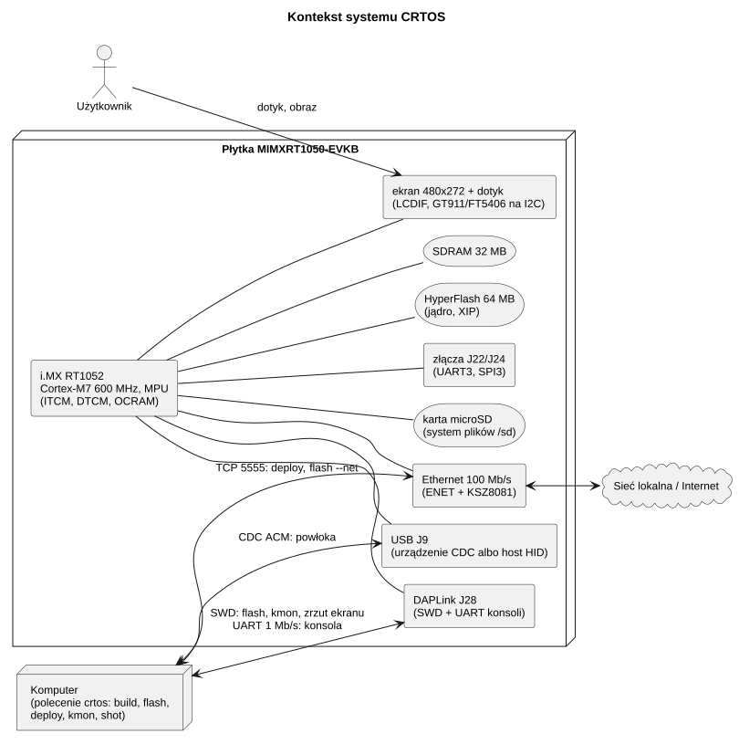

*Źródło: [architektura/kontekst.puml](diagramy/architektura/kontekst.puml)*

| Interfejs zewnętrzny | Komponent | Opis |
|---|---|---|
| UART konsoli (LPUART1, 1 Mb/s, przez DAPLink) | K15 | log jądra, powłoka, monitor jądra (Ctrl-]) |
| SWD (DAPLink) | K19, T01 | monitor jądra przez sondę, wgrywanie jądra i plików, zrzut ekranu |
| karta SD (USDHC1) | K14 | system plików, sterowniki, programy, konfiguracja |
| HyperFlash (FlexSPI) | K18, D07 | obraz jądra (XIP), partycja danych |
| Ethernet | D05, U05, U06, U08 | sieć, wgrywanie i pobieranie plików przez sieć, serwer WWW, zdalny pulpit (VNC) |
| USB J9 | D06, U07 | port szeregowy dla komputera albo klawiatura/mysz |
| ekran i dotyk | D03, D04, U03, U04 | interfejs graficzny |
| J22, J24 | D02 | port szeregowy `/dev/ttyS3`, magistrala SPI `/dev/spidev3.0` |
| gniazdo słuchawek J12, wyjścia głośnikowe (kodek WM8960) | D09 | dźwięk `/dev/audio` |

## 3. Warstwy

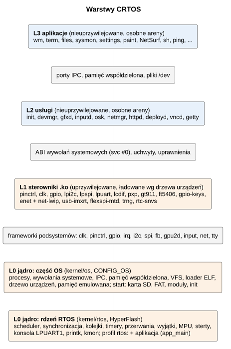

*Źródło: [architektura/warstwy.puml](diagramy/architektura/warstwy.puml)*

| Warstwa | Tryb procesora | Pamięć | Wymiana | Awaria |
|---|---|---|---|---|
| L3, L2 | nieuprzywilejowany (CONTROL.nPRIV = 1) | własna arena (region MPU 8) + do 3 okien pamięci współdzielonej (regiony 9–11) | wywołania systemowe, IPC, pliki | kończy proces, system działa dalej |
| L1 | uprzywilejowany | pamięć jądra (OCRAM na kod modułu) | API jądra (`ksyms`) | błąd w wątku: kończy wątek; w przerwaniu lub sekcji krytycznej: `panic` |
| L0 | uprzywilejowany | cała pamięć (regiony 1–7 tylko dla trybu uprzywilejowanego) | — | `panic` → restart po 10 s, raport zachowany |

Reguły:

1. Warstwa wyższa używa tylko interfejsu warstwy niższej: programy nie mają symboli jądra,
   sterowniki nie mają dostępu do wewnętrznych struktur jądra (tylko do eksportów
   `kernel/os/ksyms.cpp`, sprawdzanych przez `tools/modcheck.py`).
2. Jądro nie zależy od sterowników `.ko`: frameworki (`kernel/subsys`) definiują interfejsy
   (`*_ops`), a sterowniki się w nich rejestrują.
3. Każde przejście L2/L3 → L0 sprawdza argumenty: wskaźniki (`uaccess_ok`), uchwyty
   (`handle_ref` z typem) i uprawnienia (`caps`).

### 3.1 Rdzeń RTOS i system operacyjny

Warstwa L0 ma dwie części:

- **rdzeń** (`kernel/rtos`, K01–K07, K15 bez terminala, K19 bez poleceń OS, K21) – kompletny
  RTOS: zadania, scheduler, synchronizacja, kolejki komunikatów, timery, przerwania, wyjątki,
  MPU, sterty, konsola i monitor;
- **część OS** (`kernel/os`, `kernel/subsys`, K08–K14, K16–K18, K20, S01–S05) – procesy
  i wywołania systemowe, IPC, pliki, loader programów i modułów, drzewo urządzeń, start z karty.

Rdzeń nie zależy od części OS poza miejscami wyłączanymi przełącznikiem `CONFIG_OS`
([01 Struktura projektu](01-struktura-projektu.md#1-drzewo-katalogów)). Z tego samego rdzenia
powstają dwa obrazy: system (profil `os`, warstwy L0–L3) i sam RTOS z jedną aplikacją
wkompilowaną w obraz (profil `rtos`, `crtos build --rtos`). W profilu `rtos` nie ma warstw
L1–L3: aplikacja działa w zadaniach jądra (tryb uprzywilejowany, jak L0) i używa API rdzenia
(`crtos/rtos.h`, K21) oraz sterowników NXP SDK.

## 4. Komponenty

Pełne opisy: [komponenty/](komponenty/README.md).

| ID | Komponent | Warstwa | Odpowiedzialność |
|---|---|---|---|
| K01 | Przełączanie kontekstu i SVC | L0 | PendSV, wejście/wyjście wywołania systemowego, start schedulera |
| K02 | Przerwania | L0 | tablica wektorów w RAM, rejestracja obsługi, przerwania wirtualne (GPIO) |
| K03 | MPU | L0 | mapa regionów, areny i okna procesów, strażnicy stosów |
| K04 | Wyjątki procesora | L0 | raport błędu, zakończenie wątku/procesu albo `panic` |
| K05 | Scheduler, czas, praca odroczona | L0 | wątki, priorytety, kolejki, zegar systemowy, `kworker` |
| K06 | Synchronizacja | L0 | muteksy z dziedziczeniem priorytetu, semafory, flagi zdarzeń, kolejki oczekiwania |
| K07 | Pamięć jądra | L0 | pule TLSF w pięciu pamięciach |
| K08 | Procesy, uchwyty, uprawnienia | L0 | areny, wątki programów, tablice uchwytów, `uaccess_ok`, `capable` |
| K09 | Wywołania systemowe | L0 | ABI, rozdział wywołań, pliki, procesy, czas |
| K10 | IPC | L0 | porty, komunikaty, wywołania z odpowiedzią, przekazywanie uchwytów |
| K11 | Pamięć współdzielona | L0 | obiekty shm, mapowanie w oknach MPU |
| K12 | Potoki i poll | L0 | potoki bajtowe (także terminalowe), czekanie na wiele uchwytów |
| K13 | VFS | L0 | montowanie, ścieżki, pliki, devfs, ramfs |
| K14 | Karta SD i FAT | L0 | USDHC z ADMA2, UHS-I, pamięć podręczna bloków, FatFs |
| K15 | Konsola, log, terminal | L0 | LPUART1, pierścień logu, `/dev/console`, `panic` |
| K16 | Loader | L0 | relokowalny ELF: moduły `.ko` i programy `.app` |
| K17 | Drzewo urządzeń i model sterowników | L0 | parser FDT, urządzenia, dopasowanie sterowników, `probe`, `/dev/uevent` |
| K18 | Start systemu | L0 | `main`, `kernel_main`, wątek `boot` |
| K19 | Monitor jądra i autotesty | L0 | `kmon` na UART i SWD, testy jądra |
| K20 | Pamięć emulowana | L0 | region programu bez pamięci pod spodem: dostęp wykonany przez jądro na stronach z pliku swap na karcie |
| K21 | API RTOS: kolejki, timery, aplikacja | L0 (rdzeń) | kolejki komunikatów, timery programowe, zadanie aplikacji w profilu `rtos` |
| S01–S05 | Frameworki podsystemów | L0 | interfejsy dla sterowników i pliki `/dev` |
| D01–D09 | Sterowniki | L1 | obsługa sprzętu |
| U01–U08 | Usługi | L2 | init, urządzenia, grafika, wejście, sieć, wdrażanie, terminal, zdalny pulpit |
| A01–A03 | Aplikacje i programy | L3 | menedżer okien, programy z oknem, programy konsolowe |
| L01–L02 | Biblioteki | L2/L3 | libcrtos (C/POSIX nad SVC), libgfx (okna, rysowanie) |
| T01 | Narzędzia | komputer | budowanie, wgrywanie, diagnostyka |

## 5. Struktura statyczna jądra

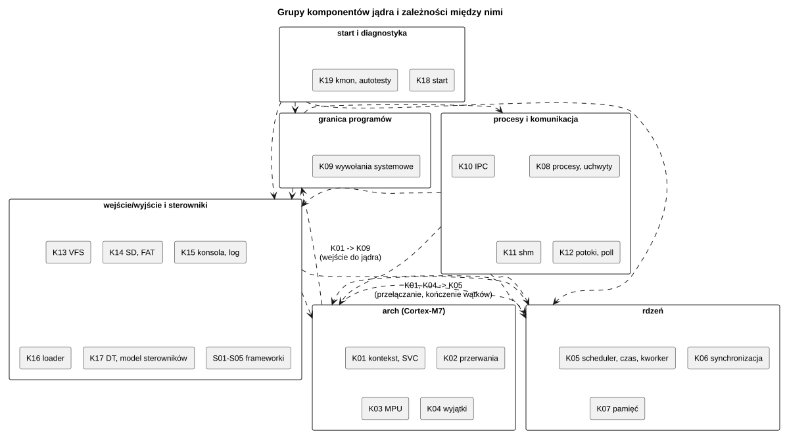

*Źródło: [architektura/struktura-statyczna-jadra.puml](diagramy/architektura/struktura-statyczna-jadra.puml)*

Zależności między komponentami (kto czego używa):

| Komponent | Używa |
|---|---|
| K01 kontekst, SVC | K05 (`sched_switch`, `g_current`), K03 (granica stosu), K09 (`syscall_dispatch`) |
| K02 przerwania | K05 (`sched_tick`), K07 (tablica wektorów) |
| K03 MPU | pola `task` i `proc` (K05, K08) |
| K04 wyjątki | K05 (przekierowanie do `task_exit`), K08 (`proc_kill`), K03, K15 (raport, `panic`) |
| K05 scheduler | K01 (PendSV), K03 (`mpu_switch`), K06 (muteksy kończącego się wątku), K07, K08 (`proc_thread_exited`, tylko `CONFIG_OS`), K21 (`timer_tick` w tyknięciu) |
| K06 synchronizacja | K05 (`sched_block`, `sched_wake`, `sched_set_prio`), K08 (`uaccess_ok` futeksów) |
| K07 pamięć | `irq_lock`, K15 (`panic`) |
| K08 procesy | K03, K05, K06, K07, K10, K11, K13 (obiekty uchwytów) |
| K09 wywołania systemowe | K05, K06, K08, K10, K11, K12, K13, K16, S05 |
| K10 IPC | K05, K07, K08, K12 (`poll_notify`) |
| K11 shm | K03, K07, K08 |
| K12 potoki, poll | K05, K06, K08, K10, K13 |
| K13 VFS | K06, K07, K16 (odwołania na moduły), K17 (`uevent`) |
| K14 SD, FAT | K02, K06, K07, K13 |
| K15 konsola, log | K02, K05, K08 (Ctrl-C), K13 |
| K16 loader | K06, K07, K08, K13, K17 |
| K17 drzewo urządzeń | K02 (domeny przerwań), K06, K07, K13, K16, S01 (piny przed `probe`) |
| K18 start | wszystkie (kolejność inicjalizacji) |
| K19 kmon | K05, K07, K08, K13, K14, K15, K16, K17, S01–S05 (polecenia diagnostyczne) |
| K20 pamięć emulowana | K01 (wejście do jądra), K03 (region 0), K04 (MemManage), K06, K07, K08, K14 (plik swap) |
| K21 API RTOS | K05 (`sched_block`, `sched_wake`, wątki), K06 (kolejki oczekiwania, semafor wątku timerów), K07 |
| S01–S05 frameworki | K02, K05, K06, K07, K08, K11, K12, K13, K17 |

## 6. Interfejsy

### 6.1 Interfejsy między warstwami

| Interfejs | Kto udostępnia | Kto używa | Definicja | Sprawdzanie |
|---|---|---|---|---|
| wywołania systemowe (62 numery) | K09 | L01 (libcrtos) | `kernel/include/crtos/syscall.h` | numer, wskaźniki, uchwyty, uprawnienia |
| pliki urządzeń `/dev` | K13 + S01–S05 + D* | programy | `read`/`write`/`ioctl`/`poll` | `CAP_DEV`, rozmiar argumentu `ioctl` (`_IOC_SIZE`) |
| API modułów jądra | K01–K21, S01–S05 | D01–D09 | `kernel/include/crtos/*.h`, lista `KSYM` w `ksyms.cpp` | przy budowaniu (`modcheck.py`) i ładowaniu (rozwiązywanie symboli) |
| interfejsy sterowników | S01–S05 (`*_ops`) | D01–D09 | `clk_ops`, `pinctrl_ops`, `gpio_chip_ops`, `irq_chip`, `i2c_adapter_ops`, `spi_controller_ops`, `fb_ops`, `gpu2d_ops`, `netdev_ops`, `net_stack_ops`, `rtc_ops`, `file_ops` | — |
| protokół grafiki | U03 | L02, U04, U08, A01 | `system/lib/libgfx/include/gfx_proto.h` (port `gfx`): okna, zdarzenia, schowek, kopia ekranu | typ i długość komunikatu, uchwyty, `CAP_SYS` dla kopii ekranu |
| protokół urządzeń | U02 | U03, U04 | `system/lib/libcrtos/include/devmgr_proto.h` (port `devmgr`) | jw. |
| klawiatura ekranowa | U04 | A01 | `system/lib/libgfx/include/osk_proto.h` (port `osk`) | jw. |
| wdrażanie | U06 (deployd) | T01 | protokół tekstowy TCP 5555, token | token, zapis w `/sd/crtos/`, `/flash0/`, `/ram/`, odczyt w `/sd`, `/flash0`, `/ram`, CRC-32 |
| zdalny pulpit | U08 (vncd) | T01 (`crtos desktop`), przeglądarki VNC | RFB 3.3/3.7/3.8 (RFC 6143), TCP 5900 | hasło VNC (DES, `/sd/crtos/etc/vnc.passwd`), jedna przeglądarka naraz |

### 6.2 Pliki urządzeń

| Plik | Komponent | Uprawnienie |
|---|---|---|
| `/dev/console`, `/dev/null`, `/dev/zero` | K15 | brak |
| `/dev/random`, `/dev/urandom` | D08 | brak |
| `/dev/audio` | D09 | brak |
| `/dev/uevent` | K17 | `dev` |
| `/dev/fb0` | S03 + D03 | `dev` |
| `/dev/gpu2d` | S03 + D03 | `dev` |
| `/dev/event0..N` | S04 + D04, D06 | `dev` |
| `/dev/ttyS3` | D02 | `dev` |
| `/dev/spidev3.0` | S02 + D02 | `dev` |
| `/dev/mtd0`, `/dev/mtd1` | D07 | `dev` (aktualizacja jądra: `sys`); `mtd1` zajęty przez D10 |
| `/dev/flashfs0` | D10 | `dev` (formatowanie: `sys`) |
| `/flash0` | D10 | system plików na flash; programy z niego mogą działać w miejscu (K16) |
| `/dev/ttyACM0` | D06 | `dev` |

### 6.3 Formaty plików

| Format | Definicja | Komponent |
|---|---|---|
| program `.app` | relokowalny ELF32 ARM, sekcja `.crtos_app` (`struct crtos_app_info`: stos, sterta, ABI 1) | K16 |
| moduł `.ko` | relokowalny ELF32 ARM, sekcje `.crtos_module` (`struct module_info`, ABI 2), `.crtos_ksymtab`, `.crtos_depends` | K16 |
| drzewo urządzeń | FDT v17 (`board.dtb`) | K17 |
| `modules.alias` | linie `<compatible> <moduł>` | K18 |
| `init.cfg` | `service <nazwa> <respawn|once|wait> [caps=...] <program> [arg...]`, `console ...` | U01 |
| obraz jądra | `crtos.bin`: FCFB (0x0), IVT + DCD (0x1000), kod | K18, D07 |

## 7. Zachowanie dynamiczne

### 7.1 Start systemu

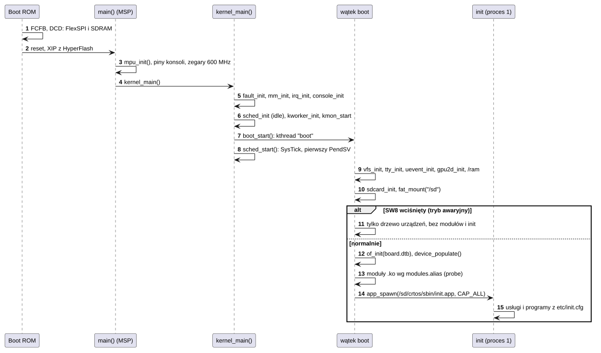

*Źródło: [architektura/start-systemu.puml](diagramy/architektura/start-systemu.puml)*

Szczegóły: [K18 Start systemu](komponenty/K18-start.md).

### 7.2 Wywołanie systemowe

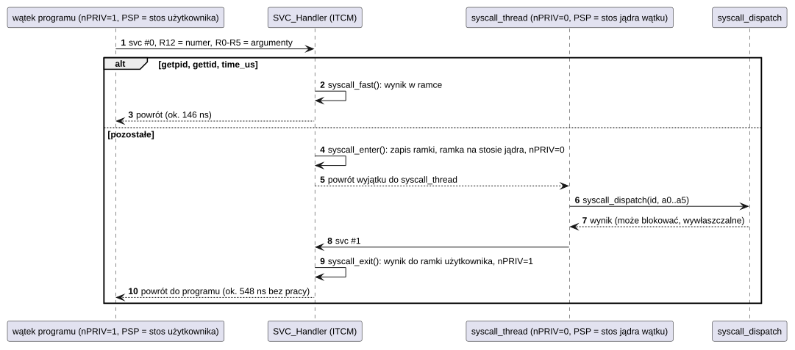

*Źródło: [architektura/wywolanie-systemowe.puml](diagramy/architektura/wywolanie-systemowe.puml)*

Wywołanie wykonuje się w wątku, który je zlecił, na jego stosie jądra. Dzięki temu może
blokować i być wywłaszczane jak zwykły kod jądra, a zakończenie procesu w trakcie
wywołania (`TF_KILLED`) kończy wątek przy wyjściu. Szczegóły:
[K01](komponenty/K01-kontekst-i-svc.md), [K09](komponenty/K09-wywolania-systemowe.md).

### 7.3 Przerwanie sprzętowe i wątek sterownika

Obsługa przerwania wykonuje minimum pracy: kasuje flagi urządzenia, zapisuje stan i budzi
wątek (semafor, flaga zdarzeń albo kolejka `kworker`). Przetwarzanie danych odbywa się
w wątku. Wzorzec stosują sterowniki sieci, dotyku, przycisków, USB i SPI.

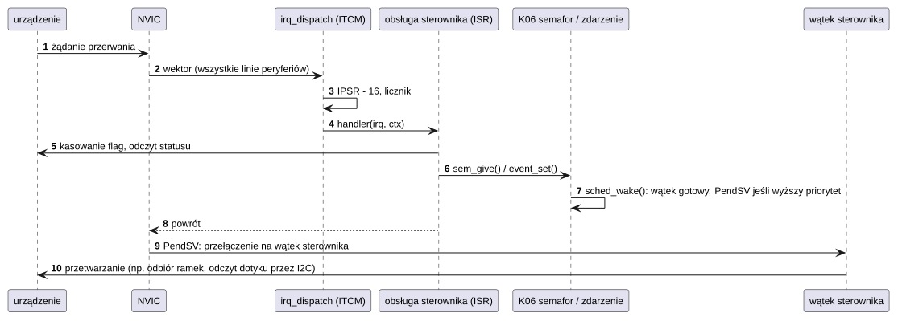

*Źródło: [architektura/przerwanie-sprzetowe-i-watek-sterownika.puml](diagramy/architektura/przerwanie-sprzetowe-i-watek-sterownika.puml)*

### 7.4 Przełączanie kontekstu

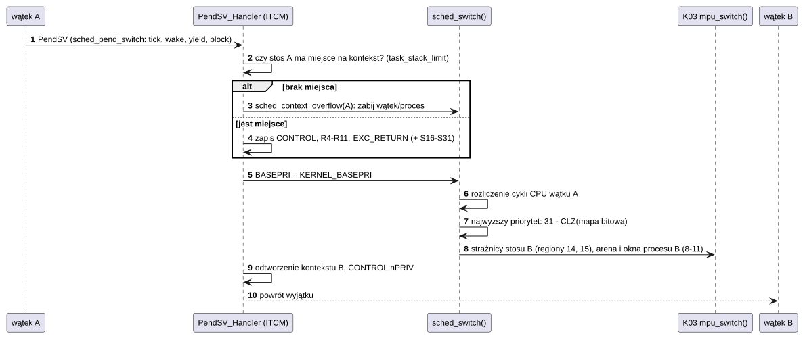

*Źródło: [architektura/przelaczanie-kontekstu.puml](diagramy/architektura/przelaczanie-kontekstu.puml)*

### 7.5 Uruchomienie programu

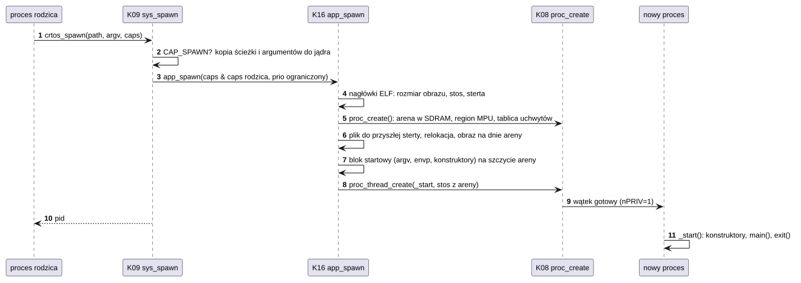

*Źródło: [architektura/uruchomienie-programu.puml](diagramy/architektura/uruchomienie-programu.puml)*

### 7.6 Awaria programu

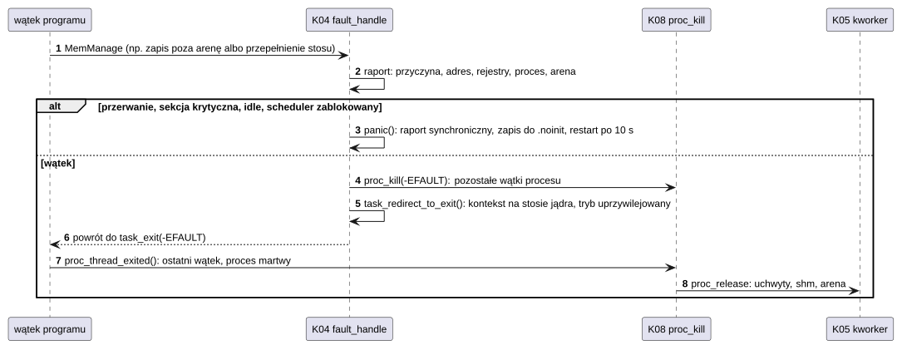

*Źródło: [architektura/awaria-programu.puml](diagramy/architektura/awaria-programu.puml)*

### 7.7 Klatka grafiki

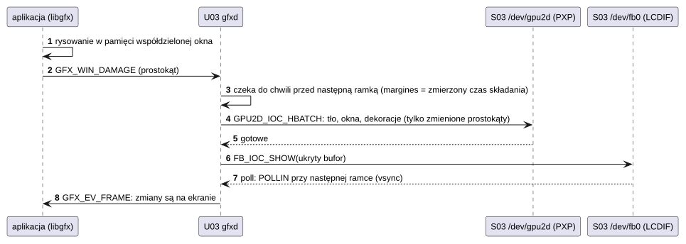

*Źródło: [architektura/klatka-grafiki.puml](diagramy/architektura/klatka-grafiki.puml)*

### 7.8 Dotyk

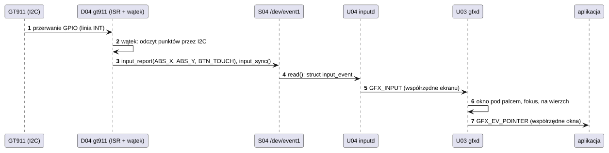

*Źródło: [architektura/dotyk.puml](diagramy/architektura/dotyk.puml)*

## 8. Współbieżność i priorytety

Priorytety wątków: 0 (idle) do 31 (najwyższy). Wątek o wyższym priorytecie zawsze
wywłaszcza niższy. Wątki o równym priorytecie dzielą procesor kwantem 5 ms. Wątki programów
mają domyślnie priorytet 10 i najwyżej 19 (`clamp_prio` w `sys_proc.cpp`). Program
z priorytetem 19 wyprzedza więc wątki `usb` (17) i `enet` (18), a z `tcpip` (19) dzieli
procesor; dotyk, monitor jądra i `kworker` (20–24) zawsze go wywłaszczają. Uprawnienie `sys` nie podnosi limitu
(`PRIO_HIGH - 1` = `SYS_PRIO_MAX_USER` = 19), choć komentarz w `syscall.h` tak sugeruje; zobacz
[K09](komponenty/K09-wywolania-systemowe.md#12-ograniczenia-i-znane-problemy).

| Priorytet | Wątek | Komponent | Rola |
|---|---|---|---|
| 24 | `kworker` | K05 | praca odroczona: zwalnianie wątków i procesów |
| 22 | `kmon` | K19 | monitor jądra na UART |
| 21 | `kmon-swd` | K19 | monitor jądra przez sondę SWD |
| 20 | `gt911`, `ft5406`, `gpio-keys` | D04 | odczyt dotyku i przycisków |
| 19 | `tcpip` | D05 | wątek lwIP: zegary TCP, ARP, DHCP, DNS |
| 18 | `boot` | K18 | drugi etap startu (kończy się po starcie `init`) |
| 18 | `enet` | D05 | odbiór ramek Ethernet, stan łącza |
| 17 | `usb` | D06 | stos TinyUSB |
| 11 | `init` | U01 | uruchamianie usług |
| 10 | usługi i programy | U*, A* | domyślny priorytet procesów |
| 0 | `idle` | K05 | `WFI` |

Priorytety przerwań (NVIC, 4 bity, 0 = najwyższy). Przerwania o priorytecie 0–1 byłyby
„bez opóźnień”, ale nie mogą używać API jądra, dlatego `irq_request` ich nie przyjmuje;
`irq_lock()` maskuje priorytety ≥ 2.

| Priorytet | Źródło | Komponent |
|---|---|---|
| 0 | MemManage, BusFault, UsageFault | K04 |
| 3 | SAI1 (FIFO nadajnika dźwięku) | D09 |
| 5 | LCDIF (koniec ramki) | D03 |
| 6 | USDHC1, ENET, LPI2C, USB | K14, D05, D02, D06 |
| 7 | PXP | D03 |
| 8 | konsola LPUART1, GPIO, LPUART3, LPSPI3, TRNG | K15, D01, D02, D08 |
| 8 | domyślny dla pozostałych | K02 |
| 15 | SVCall, PendSV, SysTick | K01, K05 |

Współdzielone zasoby są chronione tak:

| Mechanizm | Gdzie | Czas trwania |
|---|---|---|
| `irq_lock()` (BASEPRI) | kolejki schedulera, kolejki oczekiwania, sterty, liczniki odwołań, pierścienie przerwań | krótkie, ograniczone sekcje (bez pętli po danych użytkownika) |
| `sched_lock()` | przeglądanie list wątków i procesów | bez blokowania |
| `mutex` z dziedziczeniem priorytetu | VFS, moduły, magistrale I2C/SPI, sieć, RTC | może blokować |
| wyłączone przerwania (PRIMASK) | zapis HyperFlash (D07), `panic` | do ok. 0,8 s (kasowanie bloku flash) |

## 9. Zasoby

### 9.1 Pamięć

Stan zmierzony na płytce (`crtos kmon mem`, 27.09.2026) przy uruchomionych wszystkich
usługach, menedżerze okien i dwóch programach:

| Pula | Rozmiar | Wolne | Zużycie |
|---|---|---|---|
| `dtcm` | 91 KB | 12,6 KB | struktury i stosy wątków, tablica wektorów |
| `itcm` | 52 KB | 51,5 KB | rezerwa na szybki kod |
| `ocram` | 240 KB | 50,7 KB | moduły `.ko` (kod i dane) |
| `sdram` | 30 MB | 26,4 MB | areny procesów, bufory |
| `ncache` | 2 MB | 1,43 MB | bufory ekranu (2 × 255 KB), DMA sieci |

Obraz jądra: ok. 240 KB w HyperFlash (z czego ok. 49 KB kopiowane do ITCM; reszta ITCM to mała sterta i obszar szybkiego kodu programu, K07/K16).

Stosy: wątek jądra domyślnie 2 KB + 256 B strażnika; stos jądra wątku programu 3 KB +
256 B; stos główny programu z `crtos_app(STACK)`. Zużycie stosów pokazuje `crtos kmon ps`
(kolumny `KSTACK used`, `USTACK used`). Ramki funkcji jądra większe niż strażnik
(256 B) wykrywa `tools/stackcheck.py` z plików `-fstack-usage`.

### 9.2 Czas

Zmierzone programem `crtos bench` (szczegóły: [Wydajność](../wydajnosc.md)):

| Operacja | Czas |
|---|---|
| tyknięcie zegara | 1 ms (`CONFIG_TICK_HZ`) |
| kwant czasu | 5 ms (`CONFIG_TIMESLICE_TICKS`) |
| wywołanie systemowe szybkie (`getpid`) | 146 ns |
| pełne wywołanie systemowe | 548 ns |
| przełączenie wątków jądra (z semaforem) | 436 cykli (0,73 µs) |
| opóźnienie przerwania: średnie / maksymalne | 45 / 195 cykli (75 / 325 ns) |
| wywołanie IPC z odpowiedzią między procesami | 7,9 µs |
| potok, 1 bajt tam i z powrotem | 9,2 µs |
| uruchomienie programu (`spawn` + koniec) | 7,2 ms |
| start: od resetu do `init` | 443 ms |
| składanie klatki przez `gfxd` | 1,7 ms (ekran 58,7 Hz) |
| najdłuższa blokada przerwań: kasowanie bloku flash (D07) | ok. 0,8 s (tylko przy zapisie flash) |

Tyknięcia opóźnione przez zablokowane przerwania są nadrabiane z licznika cykli
(`sched_tick`), więc zegar systemowy nie zostaje w tyle. `crtos kmon uptime` pokazuje
liczbę takich zdarzeń i najdłuższą przerwę.

## 10. Zasady projektowe (ISO 26262-6, tabela 3)

| Zasada | Realizacja w CRTOS |
|---|---|
| hierarchiczna struktura | warstwy L0–L3, frameworki między jądrem a sterownikami |
| ograniczony rozmiar i złożoność komponentów | komponenty jądra po 100–700 linii na plik; największe pliki to sterownik karty SD (ok. 1150) i `gfxd` (ok. 1300) |
| ograniczony rozmiar interfejsów | interfejsy sterowników to tablice kilku funkcji (`*_ops`); ABI programów: 62 wywołania |
| silna spójność | jeden plik = jedna odpowiedzialność (np. `ipc.cpp`, `shm.cpp`, `pipe.cpp`) |
| luźne powiązania | sterowniki rejestrują się we frameworkach; programy znają tylko ABI i protokoły IPC |
| właściwości szeregowania | priorytety z wywłaszczaniem, O(1), dziedziczenie priorytetu, kwant czasu |
| ograniczone użycie przerwań | obsługa przerwań tylko budzi wątki; priorytety przerwań poniżej progu jądra są odrzucane |
| izolacja przestrzenna | MPU: areny procesów, strażnicy stosów, strażnik NULL, pamięć jądra niedostępna z L2/L3 |
| zarządzanie zasobami współdzielonymi | liczniki odwołań obiektów (`file`, `port`, `shm`, `proc`, `module`), muteksy, `irq_lock` |

## 11. Mechanizmy wykrywania i obsługi błędów

Wykrywanie (ISO 26262-6, tabela 4):

| Mechanizm | Komponent | Wykrywa |
|---|---|---|
| MPU: arena, regiony tylko uprzywilejowane | K03 | dostęp programu poza swoją pamięć |
| strażnicy stosów (regiony 13–15) | K03 | przepełnienie stosu MSP, stosu wątku, stosu jądra wątku programu |
| kontrola miejsca na kontekst w PendSV | K01 | stos zbyt pełny, by zapisać kontekst |
| strażnik NULL (0x0–0xFF) | K03 | dereferencja wskaźnika NULL (także w jądrze) |
| `uaccess_ok`, `strncpy_from_user` | K08 | wskaźniki programu spoza jego pamięci |
| typ i prawa uchwytu | K08 | uchwyt zły albo innego typu |
| uprawnienia `caps` | K08, K09 | operacje uprzywilejowane |
| `BUG_ON`, `panic` przy niespójności | K05, K06, K07 | naruszenie niezmienników (np. `mutex_unlock` przez nie-właściciela, zły wskaźnik w `kfree`) |
| `tlsf_check`, `mm_check` | K07 | uszkodzenie sterty |
| CRC-32 przy wgrywaniu plików i jądra | U06, D07, K19 | uszkodzenie danych w transmisji |
| sprawdzenie nagłówków ELF, ABI modułu/programu | K16 | zły lub niezgodny plik |
| sumy kontrolne rekordu `panic` | K15 | uszkodzony raport po restarcie |
| nadrabianie tyknięć z licznika cykli | K05 | utracone przerwania zegara |
| przekroczenia czasu (timeouty) we wszystkich blokujących wywołaniach | K06, K10, S02, D* | zawieszone urządzenie lub partner IPC |

Obsługa (ISO 26262-6, tabela 5):

| Mechanizm | Komponent | Reakcja |
|---|---|---|
| zakończenie tylko winnego wątku/procesu | K04, K08 | zwolnienie zasobów, system działa dalej |
| ponowne uruchomienie usługi | U01 | `respawn` z rosnącym opóźnieniem |
| degradacja | K18, U03 | tryb awaryjny (SW8), programowy akcelerator 2D gdy brak PXP, konsola bez `init` |
| ponowienie operacji | K14, D07 | karta SD: CMD12, ponowna inicjalizacja, niższy tryb; flash: 3 próby |
| `panic` z zachowaniem raportu i restartem | K15 | błąd jądra nie do naprawienia: stan bezpieczny = restart |
| zwolnienie muteksów kończącego się wątku | K06 | brak zakleszczenia czekających |

## 12. Ograniczenia architektury

- Brak MMU: pamięć współdzielona ma ten sam adres we wszystkich procesach; areny muszą być
  wyrównane do regionów MPU (potęga dwójki z podregionami).
- Proces może mieć zmapowane najwyżej 3 obiekty pamięci współdzielonej naraz.
- Sterowniki działają w trybie uprzywilejowanym bez izolacji: błąd sterownika w przerwaniu
  albo w sekcji krytycznej zatrzymuje system (`panic`).
- Brak nadzorcy (watchdog) sprzętowego i monitorowania przebiegu programu.