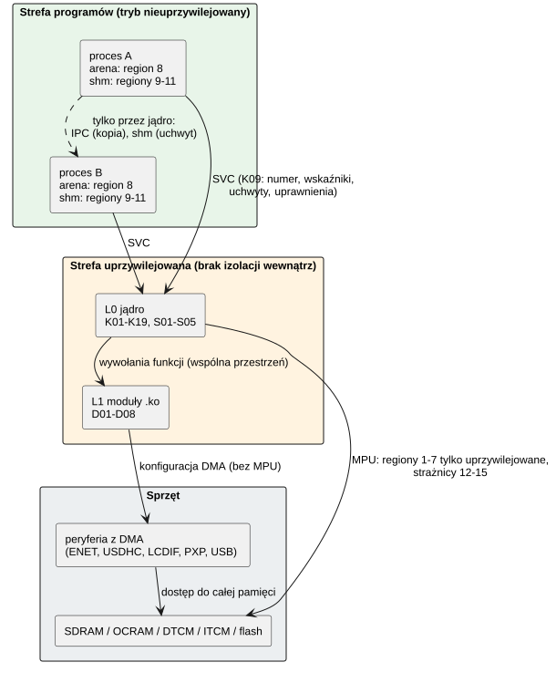

# 03 Analiza bezpieczeństwa

Analiza bezpieczeństwa na poziomie architektury oprogramowania: brak zakłóceń między
elementami (ISO 26262-6, załącznik D), analiza trybów awarii komponentów (ISO 26262-9,
rozdz. 8) i analiza awarii zależnych (ISO 26262-9, rozdz. 7), z listą znalezionych
problemów.

## 1. Cel, zakres i założenia

- CRTOS jest rozwijany jako **QM** (zob. [README](README.md#status-względem-iso-26262)):
  nie ma elementu (item), analizy zagrożeń (HARA) ani celów bezpieczeństwa. Analiza
  traktuje system jak element rozwijany poza kontekstem (SEooC, ISO 26262-10) i sprawdza
  go względem **założonych wymagań bezpieczeństwa** (rozdz. 2). Ma pokazać, co trzeba
  zmienić, zanim na CRTOS mogłaby działać funkcja z przypisanym ASIL.
- Zakres: jądro (K, S), sterowniki (D), usługi (U), biblioteki (L), aplikacje (A). Sprzęt
  (i.MX RT1052, zasilanie, zegary, pamięć) jest poza zakresem, poza tym, jak oprogramowanie
  z niego korzysta.
- Podstawa: przegląd kodu z 27.09.2026 (gałąź `m7`), dokumenty komponentów, wyniki testów
  ([04 Weryfikacja](04-weryfikacja.md)).

## 2. Założone wymagania bezpieczeństwa

| ID | Założenie (wymaganie dla CRTOS jako SEooC) | Stan | Podstawa / luka |
|---|---|---|---|
| ASR-01 | Błąd programu L2/L3 (zły wskaźnik, przepełnienie stosu, błędna instrukcja) nie zmienia pamięci jądra, sterowników ani innych procesów i kończy tylko ten program. | spełnione | K03, K04, K08 (`uaccess_ok`), apptest „memory protection” |
| ASR-02 | Program L2/L3 nie opóźnia wątków jądra i sterowników. | **częściowo** | wątki ≥ 20 chronione; wątki `enet` (18) i `usb` (17) nie – ISS-02; brak budżetów czasu – ISS-04 |
| ASR-03 | Komunikat IPC dociera w całości, w kolejności wysłania, z tożsamością nadawcy nadaną przez jądro – albo nadawca dostaje błąd. | spełnione | K10 (kopia przez jądro, FIFO, `msginfo.pid`, `-EPIPE`, `-ETIMEDOUT`) |
| ASR-04 | Usługa dostępna pod nazwą jest tą, której klient oczekuje. | **niespełnione** | rejestr nazw bez kontroli dostępu – ISS-06 |
| ASR-05 | Wykrycie błędu, którego nie da się ograniczyć do procesu, prowadzi do stanu bezpiecznego (restart) w ograniczonym czasie. | **częściowo** | `panic` → restart po 10 s (K04, K15); zawieszenie bez wyjątku nie jest wykrywane (brak watchdoga) – ISS-03 |
| ASR-06 | Zasoby wspólne (SDRAM, pamięć jądra) nie mogą zostać wyczerpane przez jeden proces. | **niespełnione** | `shm_create` do 16 MB bez uprawnień, 128 uchwytów – ISS-17 |
| ASR-07 | Tylko autoryzowany kod jest ładowany i wykonywany (jądro, moduły, programy). | **częściowo** | `CAP_MODULE`, token `deployd`, CRC obrazu jądra; brak podpisów – ISS-15, ISS-12 |
| ASR-08 | Dostęp do urządzeń i funkcji systemu wymaga uprawnień, a proces nie może zwiększyć swoich uprawnień. | spełnione | K08 (`caps` dziecka ⊆ rodzica), K09 (`CAP_DEV`, `CAP_SYS`, ...), apptest `noperm` |
| ASR-09 | Błąd sterownika (L1) nie narusza jądra ani innych sterowników. | **niespełnione (architektura)** | sterowniki działają uprzywilejowane we wspólnej przestrzeni – ISS-05 |

## 3. Partycje i strefy izolacji

*Źródło: [bezpieczenstwo/strefy-izolacji.puml](diagramy/bezpieczenstwo/strefy-izolacji.puml)*

| Partycja | Mechanizm | Granica | Co chroni | Czego nie chroni |
|---|---|---|---|---|
| proces L2/L3 | MPU: arena (region 8), okna shm (9–11), tło bez dostępu (0), regiony 1–5 i 7 tylko uprzywilejowane, flash (6) tylko do odczytu i wykonania; strażnik stosu (14) | SVC + `uaccess_ok` | pamięć jądra, sterowników, innych procesów | czas procesora (ISS-02, ISS-04), SDRAM (ISS-17), odczyt flasha (F-51) |
| jądro + sterowniki | brak (wspólna przestrzeń, tryb uprzywilejowany); strażnicy NULL (12), MSP (13), stosu wątku (14), stosu jądra w wywołaniu (15) | wywołania funkcji | wykrywa NULL i przepełnienia stosów | błędne zapisy sterownika, DMA (ISS-05) |
| przerwania | wątki obsługi przerwań (K02), priorytety NVIC | `irq_request` | krótka część w ISR, reszta w wątku | ISR sterownika z błędem → `panic` |

## 4. Brak zakłóceń (ISO 26262-6, załącznik D)

Ocena: **O** – opanowane mechanizmem, **C** – częściowo, **N** – nieopanowane.

### 4.1 Pamięć (zakłócenia przestrzenne)

| Zakłócenie | Źródło → ofiara | Mechanizm CRTOS | Ocena |
|---|---|---|---|
| zapis do pamięci innego elementu | program → jądro / inny proces | MPU (K03), tryb nieuprzywilejowany (K01) | O |
| odczyt pamięci innego elementu | program → jądro / inny proces | jw.; apptest `crash-kernel` (odczyt DTCM) → `-EFAULT`; wyjątek: HyperFlash (region 6) jest czytelny dla programów, bo wykonują z niego kod (F-51) | O (RAM), C (flash) |
| zły wskaźnik w wywołaniu systemowym | program → jądro | `uaccess_ok` przed każdym dostępem (K08, K09), `-EFAULT` | O |
| przepełnienie stosu | program, wątek jądra, przerwanie | strażnicy MPU 13–15 po 256 B (K03) | C – ramka > 256 B może przeskoczyć strażnika; dla jądra ostrzega `stackcheck.py`, dla programów brak kontroli (ISS-18) |
| dereferencja NULL | każdy | region 12 (0x0–0x1F) | O |
| wykonanie danych | program → shm, arena | okna shm z XN; arena programu RWX (kod i dane w jednym regionie) | C – program może wykonać dane z własnej areny |
| uszkodzenie pamięci przez sterownik | L1 → L0 / L1 / programy | brak (wspólna przestrzeń) | **N** (ISS-05) |
| uszkodzenie pamięci przez DMA | sterownik → dowolna pamięć | tylko sterowniki programują DMA; `gpu2d` sprawdza powierzchnie paczek (S03) | C (ISS-05) |
| pamięć po zwolnieniu | proces → obiekt | liczniki odwołań obiektów (K08, REQ-K08-08), zerowanie nowych aren i shm | O |
| wiszący wskaźnik do usuniętego modułu | `rmmod` dostawcy → odbiorcy | liczniki odwołań modułów – nie dla dostawców zegarów, pinów, GPIO | **N** (ISS-01) |
| spójność cache z DMA | sterownik ↔ DMA | bufory DMA w NCACHE (2 MB), operacje cache w sterownikach | O |

### 4.2 Czas i wykonanie (zakłócenia czasowe)

| Zakłócenie | Źródło → ofiara | Mechanizm CRTOS | Ocena |
|---|---|---|---|
| blokowanie wykonania przez wątek o wyższym priorytecie | program (priorytet do 19) → wątki `enet` (18), `usb` (17), usługi (10–11) | scheduler priorytetowy (K05); priorytet programów ograniczony do 19 | **N** – wątek programu w pętli na 19 głodzi `enet` i `usb` (ISS-02) |
| blokowanie wątków jądra ≥ 20 | program → dotyk, przyciski, `kworker`, `kmon` | te wątki mają priorytet powyżej maksimum programów | O |
| zakleszczenie | wątki jądra | muteksy z dziedziczeniem priorytetu (K06), limity czasu IPC i futeksów | C – brak wykrywania zakleszczeń w jądrze |
| odwrócenie priorytetów | wątki jądra | dziedziczenie priorytetu w muteksie jądra (K06) | O (jądro); C (muteksy programów bez PI, L01) |
| nieprzydzielenie czasu (wątek nie oddaje procesora) | dowolny | kwant 5 ms tylko dla równych priorytetów; brak budżetów czasu i watchdoga | **N** (ISS-03, ISS-04) |
| zbyt długie blokowanie przerwań | jądro, sterownik | sekcje krytyczne krótkie; brakujące tyknięcia doliczane (REQ-K05-06) | C – brak pomiaru czasu blokady |
| zapis flash zatrzymuje system | `mtd` (D07) | wykonywany z ITCM przy wyłączonych przerwaniach; tylko z `CAP_DEV` | C – system stoi ok. 0,8 s na kasowany blok, 0,8 ms na stronę (świadomie) |
| zawieszony sterownik magistrali | I2C/SPI → użytkownicy magistrali | mutex magistrali, limity czasu w sterownikach (D02) | C – brak limitu we frameworku, brak odzyskiwania I2C (ISS-20) |
| rywalizacja o magistralę pamięci | PXP/LCDIF → ENET RX | deskryptory ENET w DTCM, bufory odbiorcze w OCRAM (REQ-D05-07) | O – przy animacji 800×480 i pełnej prędkości 0 uszkodzonych ramek (02.10.2026); C, gdy DTCM zabraknie (`descriptors in SDRAM`) |

### 4.3 Wymiana informacji

| Zakłócenie (zał. D) | Kanał | Mechanizm CRTOS | Ocena |
|---|---|---|---|
| powtórzenie | IPC | każdy `send` to jeden komunikat w kolejce; brak ponowień w jądrze | O |
| utrata | IPC | pełna kolejka → nadawca czeka / `-ETIMEDOUT`; martwy port → `-EPIPE` | O (błąd zgłaszany) |
| opóźnienie | IPC | limity czasu po stronie klienta; serwer bez limitu na odpowiedź | C |
| wstawienie | IPC | każdy proces może połączyć się z każdym portem (np. `GFX_INPUT` do `gfxd`) | **N** (ISS-07) |
| podszycie się (masquerade) | IPC | `msginfo.pid` nadaje jądro (nadawca prawdziwy); ale nazwa portu nie jest chroniona – proces może zająć nazwę usługi | C (ISS-06) |
| zła kolejność | IPC | FIFO w porcie (REQ-K10-02) | O |
| uszkodzenie | IPC | kopia przez jądro, sprawdzenie rozmiaru (≤ 512 B); inny proces nie ma dostępu do bufora | O (bez CRC komunikatów) |
| zablokowanie kanału | IPC | kolejka 32; zalewający nadawca blokuje innych nadawców tego portu | C |
| niespójność (odpowiedź do złego nadawcy) | `msg_call` | żeton odpowiedzi jednorazowy; spóźniona odpowiedź → `-ENOENT` (REQ-K10-06) | O |
| współdzielenie pamięci | shm | tylko przez uchwyt; brak synchronizacji danych (odpowiedzialność protokołu) | C |
| potoki | pipe/tty | bufor jądra, `POLLHUP` przy końcu piszącego | O |

## 5. Analiza trybów awarii komponentów

Tryby awarii oprogramowania (wybrane, najważniejsze dla każdego komponentu). W – wykrywanie,
R – reakcja; ocena jak w rozdz. 4.

| ID | Komponent | Tryb awarii | Skutek | W / R | Ocena |
|---|---|---|---|---|---|
| F-01 | K01 | uszkodzony kontekst wątku (zły EXC_RETURN, stos) | wątek nie wznawia się poprawnie | wyjątek UsageFault/MemManage → K04 | O |
| F-02 | K02 | przerwanie bez obsługi / burza przerwań | procesor zajęty obsługą | przerwanie bez obsługi: linia wyłączona (`irq_unhandled`); obsługiwane przerwania nie mają ogranicznika częstotliwości | C |
| F-03 | K03 | błędna konfiguracja regionu przy przełączeniu | brak ochrony lub fałszywe błędy | `region_load` zeruje RASR przed zmianą; `kmon mpu`; testy `test usermem/userstack` | O |
| F-04 | K04 | błąd w przerwaniu / w jądrze | brak możliwości ograniczenia | `panic`, raport, restart po 10 s | O |
| F-05 | K05 | wątek o wysokim priorytecie nie blokuje się | głodzenie niższych | brak | N (ISS-02, ISS-04) |
| F-06 | K05 | zgubione tyknięcia | opóźnienie zegara | doliczanie z licznika cykli (REQ-K05-06) | O |
| F-07 | K06 | zakleszczenie muteksów jądra | zawieszenie wątków | brak (limit czasu tylko u wołającego) | N (ISS-03) |
| F-08 | K07 | wyczerpanie sterty jądra | błędy alokacji w jądrze | `-ENOMEM`, `kmon mem`; brak limitów na proces | C (ISS-17) |
| F-09 | K07 | uszkodzenie metadanych sterty | awaria jądra | `mm_check` (test, `kmon mem`), nie w czasie pracy | C |
| F-10 | K08 | wyciek zasobów przy końcu procesu | spadek wolnej pamięci | zwolnienie przez liczniki odwołań; test < 4 KB różnicy | O |
| F-11 | K09 | zły numer / argument wywołania | niezdefiniowane działanie jądra | `-ENOSYS`, `-EFAULT`, `-EBADF`, `-EPERM` | O |
| F-12 | K10 | martwy serwer | klient czeka | `-EPIPE`, limity czasu | O |
| F-13 | K10 | przejęcie nazwy usługi | klient rozmawia z fałszywym serwerem | brak | N (ISS-06) |
| F-14 | K11 | mapowanie ponad limit / po odwołaniu | – | `-ENOSPC`, `-EINVAL` | O |
| F-15 | K11 | `shm_revoke` przy zmapowanym obiekcie sterownika | dostęp po odwołaniu | brak odmapowania | C (ISS-09) |
| F-16 | K12 | koniec piszącego | czytelnik czeka | `POLLHUP`, `read` = 0 | O |
| F-17 | K13 | operacja nieobsługiwana przez system plików | – | `-EINVAL`, `-ESPIPE`, `-ENOTTY`, `-EXDEV` | O |
| F-18 | K14 | błąd karty / transmisji | błąd odczytu plików | ponowienia, odtwarzanie stanu, CRC magistrali SD | C – zapisy w buforze (do 256 KB) giną przy utracie zasilania (ISS-22) |
| F-19 | K15 | przepełnienie logu | utrata komunikatów | licznik utraconych | O |
| F-20 | K16 | uszkodzony / obcy moduł | awaria lub przejęcie systemu | kontrola ELF, symboli, relokacji; `CAP_MODULE` | C – brak podpisów (ISS-15) |
| F-21 | K17 | błąd drzewa urządzeń | brak lub zła konfiguracja urządzeń | komunikaty `probe`; brak kontroli konfliktów pinów | C (ISS-21) |
| F-22 | K18 | zły moduł psuje start | system nie wstaje | tryb awaryjny (SW8) | O (procedura ręczna) |
| F-23 | K19 | nieuprawniony dostęp do monitora | pełna kontrola | brak uwierzytelnienia (UART, SWD) | N (ISS-16) |
| F-24 | S01/D01 | `rmmod` dostawcy zegarów, pinów, GPIO | wywołanie kodu spod zwolnionego adresu | brak | N (ISS-01) |
| F-25 | S02/D02 | zawieszona magistrala I2C | czujnik dotyku przestaje działać | limit czasu sterownika, brak odzyskiwania | C (ISS-20) |
| F-26 | S03/D03 | błędna operacja w paczce `HBATCH` | reszta klatki nie jest składana | kontrola powierzchni, wynik = pierwszy błąd | C (ISS-08) |
| F-27 | S04/D04 | zakłócenia dotyku, drgania styków | fałszywe zdarzenia | filtr 40 ms dla palca brakującego w skanie (GT911), eliminacja drgań (`gpio-keys`); brak wyłączności urządzenia | C |
| F-28 | S05/D05 | przeciążenie odbioru Ethernet | utrata ramek | deskryptory w DTCM (REQ-D05-07), liczniki, retransmisja TCP; pula pbuf na okno jednego gniazda: kilka gniazd naraz gubi ramki (`rx_dropped`) | C |
| F-29 | D06 | błędny deskryptor USB (urządzenie) | awaria stosu USB | kontrole TinyUSB; sterownik uprzywilejowany | C |
| F-30 | D07 | przerwany / nieudany zapis jądra | płytka nie startuje | sprawdzenie obrazu i CRC przed zapisem, weryfikacja po zapisie (3 próby); brak drugiej kopii obrazu – naprawa sondą | C |
| F-31 | D08 | błąd TRNG | słabe liczby losowe (TLS) | sprzętowe testy statystyczne TRNG, błąd → `-EIO` | O |
| F-32 | U01 | koniec `init` | usługi nie są już restartowane | brak | N (ISS-10) |
| F-33 | U02 | brak obsługi nowych urządzeń | urządzenie bez sterownika | – (funkcja nie zaimplementowana) | C (ISS-11) |
| F-34 | U03 | koniec `gfxd` | brak obrazu; programy z oknami kończą się | restart przez `init`, programy trzeba uruchomić | C |
| F-35 | U03 | wstrzyknięte wejście | fałszywe dotknięcia i klawisze | brak | N (ISS-07) |
| F-36 | U04 | koniec `inputd` / zniknięcie urządzenia | brak wejścia | restart przez `init`, `-ENODEV` | O |
| F-37 | U05 | fałszywy czas NTP | zły zegar | kontrola znacznika i adresu; brak uwierzytelnienia | C |
| F-38 | U06 | przejęcie tokenu `deployd` | podmiana kodu systemu | token, porównanie w stałym czasie; brak szyfrowania | N (ISS-12) |
| F-39 | U07 | dostęp fizyczny do USB | powłoka z pełnymi uprawnieniami | brak logowania | N (ISS-16) |
| F-40 | A01 | koniec `wm` | okna bez ramek | restart przez `init`, przejęcie okien | O |
| F-41 | A02/A03 | błąd programu | koniec programu | K04 (izolacja) | O |
| F-42 | L01 | błąd biblioteki w programie | koniec programu | izolacja jak program | O |
| F-43 | L02 | utrata serwera grafiki | koniec programu (kod 1) | `EPIPE`/`POLLHUP` | O |
| F-44 | T01 | niewykryty błąd kompilatora / narzędzia | błędny kod na płytce | testy na płytce, `modcheck`; brak kwalifikacji narzędzi (04) | C |
| F-45 | D09 | przerwanie SAI za późno, brak danych od programu | cisza albo trzask w dźwięku | reset FIFO wyrównuje kanały, liczniki błędów; dźwięk nie wpływa na inne funkcje | O |
| F-46 | D04 | zapis konfiguracji GT911 (liczba punktów) przerwany albo odrzucony | dotyk tylko jednym palcem | zapis tylko przy liczbie punktów < 5 i zgodnej sumie kontrolnej, zmiana jednego pola, kontroler przyjmuje konfigurację dopiero z `Config_Fresh` i poprawną sumą; liczba punktów w `dmesg` | O |
| F-47 | D07, D10 | zapis na `/flash0` (programowanie, kasowanie bloku) zatrzymuje cały system | przerwa do ok. 0,5 s: dźwięk, dotyk i sieć stoją, UART i sieć mogą zgubić dane | zapisy tylko przy instalacji i kopiowaniu plików (nie przy uruchamianiu programów); TCP wysyła ponownie, tyknięcia są nadrabiane (K05); opisane w D10 i w dokumentacji użytkownika | O |
| F-48 | D10 | reset albo zanik zasilania w trakcie zapisu pliku, rekordu albo kompaktowania dziennika | niepełny plik, uszkodzony rekord, dwa bloki dziennika | rekord pliku dopiero po jego danych, CRC-32 nagłówka i rekordów, nagłówek nowego dziennika zapisywany na końcu, montowanie wybiera poprawny dziennik o wyższej generacji; test resetu w trakcie zapisu | O |
| F-49 | D10 | usunięcie albo podmiana pliku, z którego działa program (kod w miejscu) | wykonanie skasowanego albo nowego kodu, błąd programu | plik otwarty przez loader jest przypięty: jego bloki wracają do puli dopiero po ostatnim zamknięciu (REQ-D10-03) | O |
| F-50 | D10 | zużycie bloków dziennika (kasowane przy każdym kompaktowaniu) | błąd zapisu rekordu, system plików tylko do odczytu | kompaktowanie co ok. 1000 zmian, 100 000 cykli kasowania bloku daje ok. 10^8 zmian; błędy zapisu zgłaszane (`-EIO`) | O |
| F-51 | K03, K16 | program czyta HyperFlash poza swoim tekstem (region 6 jest R-X dla programów, żeby programy XIP działały bez okna MPU) | odczyt obrazu jądra i bloków po usuniętych plikach `/flash0` | zapis niemożliwy (region tylko do odczytu, także dla jądra; zmiany tylko przez D07); obraz jądra nie zawiera tajemnic; pliki nie mają uprawnień, więc przez VFS każdy program i tak czyta kartę i `/flash0` | C |
| F-52 | K16 | program XIP z uszkodzonymi relokacjami, GOT albo układem segmentów (inny linker, ręczna zmiana pliku) | złe adresy danych, wykonanie przypadkowego kodu programu | loader przyjmuje tylko dwa segmenty `crtos-xip.ld`, relokacje `R_ARM_RELATIVE` w danych wskazujące na tekst albo dane, GOT w danych (REQ-K16-11); tekst bez relokacji (`ld -z text`); `crtos-app check` na PC i płytce; skutki błędu programu ogranicza MPU do jego procesu | O |
| F-53 | L01, T02 | kompilator na płytce (`libcrtosheap`) bierze na czas kompilacji prawie całą wolną SDRAM | inne programy nie dostają pamięci (np. nowe okno pulpitu, bufor sieci) | zapas 1 MB zostawiany systemowi (`CRTOS_HEAP_RESERVE`, REQ-L01-11); pamięć wraca przy końcu `cc1`; pliki pośrednie kompilatora na karcie, nie na RAM-dysku (REQ-T02-12) | O |
| F-54 | K11, K08 | okno obiektu shm z kilku regionów albo obiekt leżący w środku regionu: zasięg wskaźnika programu liczony z kodowania MPU | `uaccess_ok` przepuszcza bufor poza obiektem (jądro pisze w cudzą pamięć) | zasięg z granic obiektu (`shm_window_span`, REQ-K11-08); test `write` o bajt za końcem → `EFAULT` (`heaptest`) | O |
| F-55 | K20 | błąd odczytu albo zapisu karty przy wymianie strony pamięci emulowanej | program dostałby złe dane | proces kończony z komunikatem (`vmem: page ... not read`), strona zmieniona trafia do pliku przed oddaniem ramki (REQ-K20-04) | O |
| F-56 | K20 | błąd w dekodowaniu instrukcji (emulacja daje inny wynik niż procesor) | cicho złe dane programu | instrukcje nieznane albo wątpliwe odrzucane (zwykły błąd pamięci, REQ-K20-03), `heaptest` sprawdza każdy rodzaj instrukcji; kompilacja na płytce daje ten sam kod co na komputerze | O |
| F-57 | K20, K14 | usunięcie albo zmiana pliku swap w trakcie pracy | zapis stron w klastry oddane innym plikom | plik zakładany na nowo przy pierwszym regionie; ograniczenie opisane (K20 sekcja 12) | C |
| F-58 | K20 | strony innych procesów w pliku swap czytelne przez VFS | ujawnienie danych programu | strona niezapisana wraca wyzerowana (REQ-K20-04); plik tylko w `/sd/crtos/var`; system bez wielu użytkowników | C |
| F-59 | U08 | hasło VNC podsłuchane (wyzwanie i odpowiedź DES) i odgadnięte poza płytką albo zgadywane przez sieć | obcy ma pulpit: obraz, klawisze, terminal z uprawnieniami powłoki okna | bez pliku hasła nikt nie wchodzi (REQ-U08-01); 1 s kary za złe hasło; hasło losowe (8 znaków, `crtos desktop`); usługa deweloperska (ISS-24) | C |
| F-60 | U03, U08 | proces bez uprawnień bierze kopię ekranu (podgląd cudzych okien) | ujawnienie treści okien | `GFX_SCREEN_WATCH` tylko z `CAP_SYS`, jeden klient naraz, koniec z klientem (REQ-U03-12) | O |
| F-61 | U03 | program czyta schowek (tekst skopiowany w innym programie, np. hasło) | ujawnienie danych | schowek jak w innych systemach okien – dostępny dla programów graficznych; ograniczenie opisane (U03 sekcja 12) | C |
| F-62 | U03, A01 | menedżer okien kończy się z włączonym przejmowaniem klawiszy (otwarte menu) | klawisze nie trafiają do programów | `gfxd` wyłącza przejmowanie przy końcu menedżera; puszczenie klawisza idzie do okna naciśnięcia (REQ-U03-09) | O |
| F-63 | D06 | urządzenie USB z błędnym albo złośliwym deskryptorem raportu myszy | złe pola (ruch, przyciski) albo odczyt poza raportem | parser sprawdza długość każdego elementu i liczbę pól, pola najwyżej 32-bitowe, odczyt bitów tylko w granicach raportu, najwyżej 8 identyfikatorów; mysz bez kółka zostaje w protokole boot (REQ-D06-07) | O |
| F-64 | U06, T01 | `deployd` z tokenem pozwala czytać całą kartę, `/flash0` i `/ram` (`crtos scp`) | ujawnienie plików użytkownika | token wymagany przed każdym poleceniem (REQ-U06-02), odczyt tylko w tych trzech drzewach bez `..` (REQ-U06-03); narzędzie deweloperskie (ISS-12) | C |
| F-65 | A03 | historia poleceń (`$HOME/.sh_history`) zapisuje wpisane na terminalu tajemnice (np. token w poleceniu) | ujawnienie danych z karty | plik w `/sd/crtos`, `history -c` go czyści; system bez wielu użytkowników | C |
| F-66 | L02, A01 | uszkodzony albo spreparowany plik ikony (`share/icons/*.pam`: zły nagłówek, obcięte piksele, ogromne wymiary) | `wm` czyta poza buforem albo zajmuje całą pamięć – bez paska zadań i ramek okien | `gfx_image_load` sprawdza nagłówek, 8 bitów, 1–4 kanały, najwyżej 1 M pikseli i pełną długość danych (REQ-L02-08); zły plik daje ikonę domyślną albo kafelek z literą (REQ-A01-07); `wm` restartowany przez `init` | O |
| F-67 | U03 | zdarzenia `GFX_PTR_HOVER` trafiają do programów, które ich nie znają (traktują każde zdarzenie wskaźnika jak dotknięcie) | fałszywe dotknięcia przy samym ruchu myszy | tylko okna z `GFX_WIN_HOVER` dostają `HOVER`/`LEAVE` (REQ-U03-13); pozostałe widzą wskaźnik jak dotąd | O |
| F-68 | A02 | skrypt strony się nie kończy (pętla, bardzo długie obliczenie) | przeglądarka nie odpowiada (JavaScript działa w jej jedynym wątku) | limit `script_timeout` (domyślnie 10 s) przerywa skrypt (REQ-A02-13); reszta systemu działa dalej (osobny proces, K05) | O |
| F-69 | A02 | strona podmienia obiekty wbudowane albo prototypy DOM, żeby przechwycić dane następnej strony w tym oknie (np. formularz logowania) | ujawnienie danych między stronami | każda strona ma własne środowisko JavaScript: obiekty wbudowane i prototypy DOM (REQ-A02-09) | O |
| F-70 | A02 | skrypty wielu odwiedzanych stron zajmują stertę przeglądarki | spowolnienie (GC), nieudane strony i obrazy | środowisko strony niszczone przy przejściu na inną (REQ-A02-12), nieużywane treści usuwane po 3 s, sterta TLSF w arenie 12 MB i jedno okno do 8 MB, miniatury tylko 8 ostatnich stron | O |
| F-71 | A02 | błąd w skrypcie przygotowującym (zmiana biblioteki polyfilli, `dom.js`) | strony bez części API; przedtem błąd `polyfill.js` wyłączał JavaScript na każdej stronie | każdy skrypt wykonywany osobno, błąd w logu (REQ-A02-10); biblioteka przypięta do commitu w `third_party/sources.txt`, sprawdzenia na PC (makieta DOM w Duktape) i na płytce | O |
| F-72 | A02, L01 | strona z dużymi skryptami zapełnia stertę przeglądarki (skrypty potrzebują bloków po pół megabajta) | komunikat o braku pamięci, strona niepełna; przed poprawkami zapis przez `NULL` w `framebuffer_schedule` albo `strcmp(NULL)` tekstu paska stanu kończył przeglądarkę | sterta rośnie w jedno okno do 8 MB, miniatury tylko 8 ostatnich stron (REQ-A02-12); `framebuffer_schedule`, pasek stanu i pola tekstowe sprawdzają przydział (REQ-A02-14); dwie strony wyczerpujące pamięć bez awarii; ścieżki błędów w bibliotekach NetSurf sprawdzone tylko tymi testami (ISS-28) | C |
| F-73 | K08, K09 | proces kończy się własnym `kill` (`abort()` programu) | do 01.10.2026 struktura procesu nie była zwalniana (wpis `ended` do restartu): wyciek pamięci jądra przy każdym `abort` | `sys_kill` oddaje odwołanie przed `proc_kill`, który nie wraca (REQ-K08-08, REQ-K09-05); `apptest` (`killself`) | O |
| F-74 | S03, D03 | zmiana trybu ekranu, gdy programy używają jego buforów | programy piszą do zwolnionej pamięci, obraz zniszczony | zmiana tylko, gdy ekran nie jest otwarty, a bufory nie są u programów; otwarcie w trakcie: `-EAGAIN` (REQ-S03-07) | O |
| F-75 | D03, D01 | eLCDIF nie kończy ramki albo nie potwierdza resetu przy zmianie trybu; zły zegar pikseli po zmianie | wątek wołający (kmon, priorytet 22) czeka bez końca i głodzi sieć; ekran bez obrazu albo z dwa razy szybszym odświeżaniem | ograniczone oczekiwanie, bramka zegara pikseli zamknięta na czas zmiany PLL (REQ-D03-07), kasowanie dzielnika post PLL (REQ-D01-06); 10 zmian bez błędu | O |
| F-76 | D04, D09, S02 | źle podłączony, niezasilony albo niezgodny kontroler dotyku na LPI2C1 (np. taśma panelu z innym rozkładem styków) | SCL trzymane: nie wykrywa się ani dotyk, ani kodek dźwięku; brak dźwięku do restartu | komunikaty `timed out`/`no answer` w logu; brak odzyskiwania magistrali (ISS-20); diagnoza: odczyt linii przez SWD, `kmon i2cdetect` | C |
| F-77 | U08, K05 | wątek `vncd` (priorytet 11, wyżej niż programy) przy obrazie zmieniającym się na całym ekranie pracuje ok. 50 ms na klatkę (porównanie, kodowanie Zlib, wysyłanie) | programy o priorytecie 10 zwalniają, dopóki przeglądarka ogląda (`voxel` 800×480: z 29 do 10 kl./s) | `vncd` pracuje tylko po nowej klatce `gfxd` i tylko wtedy, gdy przeglądarka czeka na aktualizację (REQ-U08-10), więc nie zajmuje procesora bez końca; sterowniki (17–20), `kmon` (22) i `kworker` (24) wyżej; zamknięcie przeglądarki kończy obciążenie; ograniczenie opisane w U08 | C |
| F-78 | U08 | koder deflate pisze poza bufor wyjścia (dane nie do skompresowania) albo tworzy dopasowanie do danych spoza prostokąta | zapis poza bufor w stercie `vncd`; błędny obraz w przeglądarce | bufor wyjścia `zdef_bound` (najgorszy przypadek 9 bitów na bajt i zapas), kandydaci tylko wstecz w bieżącym prostokącie, każdy sprawdzany bajt po bajcie (REQ-U08-08); test z `zlib` (szum: 105%); błąd zostaje w arenie `vncd` (MPU), `init` restartuje usługę | O |
| F-79 | D05 | kontroler wstawia złą sumę kontrolną (pole nie wyzerowane: suma programu w gnieździe surowym) albo nie wstawia jej we fragmencie IP | odbiorca odrzuca ramki: brak pingu z płytki, brak odpowiedzi na duży ping | `clear_csums` zeruje pola przed wysłaniem; ICMP liczy lwIP (fragmenty); UDP we fragmentach z sumą 0 („bez sumy”); testy: ping 32–8000 B w obie strony, echo UDP z fragmentami (REQ-D05-06) | O |
| F-80 | D05 | uszkodzony odebrany fragment IP (suma TCP/UDP fragmentów nie jest sprawdzana: sprzęt nie umie, lwIP wyłączony) | błędne dane UDP złożonego datagramu dochodzą do programu | CRC ramek Ethernet; TCP nie jest dzielony na fragmenty (MSS); ograniczenie opisane w D05 | C |
| F-81 | D05 | przerwanie nadawcze włączone bez obsługi w SDK (konfiguracja `ENET_Init` bez niego) | burza przerwań: system stoi, sieć nie działa (zdarzyło się 02.10.2026 w trakcie zmian) | przerwanie jest w konfiguracji `ENET_Init` i wyłączane zaraz po niej; włączane tylko na czas czekania na wolny deskryptor (REQ-D05-03) | O |
| F-82 | D06 | kontroler USB zostawiony w pracy przez poprzedni program (restart przez sondę) zgłasza przerwanie, zanim stos TinyUSB jest gotowy | burza przerwań: system stoi (ISS-29) | przerwania kontrolera wyłączane i kasowane przed włączeniem przerwania i w obsłudze przed startem stosu (REQ-D06-08) | O |
| F-83 | L02 | brak, uszkodzenie albo częściowy zapis `ui.cfg` (zapis przerwany zanikiem zasilania) | wygląd domyślny albo częściowo domyślny | nieznane klucze pomijane, brakujące domyślne, wartości przycinane (REQ-L02-10); Settings i `appearance` zapisują plik od nowa (bez kopii zapasowej) | O |
| F-84 | L02 | brak pliku czcionki, plik uszkodzony albo spreparowany (zły nagłówek, glif poza bitmapą), brak pamięci na czcionkę | odczyt poza buforem przy rysowaniu tekstu; tekst niewidoczny | `gfx_font_load` sprawdza nagłówek, liczbę glifów, rozmiar i granice każdego glifu (REQ-L02-11); zastępcza DejaVu, potem wbudowana | O |
| F-85 | U03, L02 | duży albo spreparowany plik tapety (ogromne wymiary, obcięte dane) | `gfxd` zajęty czytaniem: ekran stoi; odczyt poza buforem | szerokość źródła do 4096, wiersz po wierszu (stała pamięć), koniec pliku = błąd i tapeta wbudowana (REQ-L02-12, REQ-U03-14); czas czytania ograniczony tylko rozmiarem pliku (U03 sekcja 12) | C |
| F-86 | U03 | program wysyła `GFX_SETTINGS` bez przerwy (każdy klient może) | ciągłe przerysowanie tapety, ekranu i okien wszystkich programów: system zwalnia | brak (jak `GFX_INPUT`, ISS-07); każde ogłoszenie to jedno krótkie zdarzenie na klienta, wysyłane bez czekania (pełna kolejka gubi je, nie blokuje gfxd) | C |
| F-87 | K21, K18 | błąd w aplikacji obrazu RTOS (zapis poza swoje dane, przepełnienie bufora) | zniszczone dane jądra albo innych zadań: zachowanie nieokreślone (aplikacja działa uprzywilejowana, bez izolacji MPU, jak sterownik L1) | strażnicy stosów zadań (MPU), fault zadania kończy tylko to zadanie (K04), w przerwaniu `panic`; `kmon test all` sprawdza rdzeń; profil RTOS opisany jako bez izolacji (K21 sekcja 12) | C |
| F-88 | K21 | funkcja timera programowego trwa długo albo czeka | pozostałe timery spóźniają się (jeden wątek `ktimer`); okresowy spóźniony o okres pomija wywołania | funkcje w wątku (nie w przerwaniu), priorytet 21 nad sterownikami; pomijanie zaległych zamiast serii (REQ-K21-04); ograniczenie opisane (K21 sekcja 12) | C |
| F-89 | K21 | kolejka z przerwania wywołana z czasem oczekiwania (np. `WAIT_FOREVER`) | blokowanie w przerwaniu zatrzymałoby system | w przerwaniu każdy czas działa jak `NO_WAIT` (REQ-K21-02), `sched_block` w przerwaniu to `panic` | O |
| F-90 | T01, K18 | na płytce zostaje obraz RTOS (np. po teście aplikacji) | brak systemu: sieci, `deployd`, pulpitu, `crtos flash --net` nie działa | `crtos flash --rtos` tylko przez sondę, komunikat o powrocie (`crtos flash`); karta i `/flash0` nienaruszone (kasowanie sektorów obrazu) | C |
| F-91 | T01 | kod z zewnątrz inny niż zamierzony: katalog `third_party` na starym commicie albo z ręczną zmianą, łatka nałożona częściowo | budowanie z innym kodem niż w repozytorium (np. bez zmiany CRTOS w lwIP) | `thirdparty.py --build` przy każdej konfiguracji porównuje commit i nałożoną łatkę z `sources.txt` i `patches/`, przełącza katalog albo kończy budowanie błędem; `git apply` nakłada łatkę w całości albo wcale; commit przypięty skrótem (git sprawdza obiekty) | C |
| F-92 | T01 | repozytorium kodu z zewnątrz niedostępne (sieć, usunięty commit albo repozytorium) | pierwsze budowanie niemożliwe; istniejące checkouty działają dalej | błąd konfiguracji z nazwą katalogu; kopia źródeł: istniejący `third_party/` albo archiwum projektu | C |
| F-93 | T02 | biblioteka `lib/xip` zbudowana inaczej niż przez newlib i GCC (nieaktualny przepis, inna wersja kompilatora, brak opcji wpływającej na kod) | program XIP z innym kodem biblioteki C/C++ niż sprawdzony | przepis generowany z budowania newlib i GCC (polecenia `make -n`, opcje bez pominięć wpływających na kod, np. `-Wabi=2`); źródła z commitów źródeł Arm 14.3.Rel1; linia `version` w przepisie – przy innym GCC programy XIP pominięte; porównanie z bibliotekami etapu A przy zmianie przepisu | C |

## 6. Analiza awarii zależnych

Zasoby wspólne i przyczyny wspólne, które mogą jednocześnie zawieść wiele elementów
uważanych za niezależne.

| Zasób / przyczyna | Dotknięte elementy | Mechanizm | Ocena |
|---|---|---|---|
| jeden rdzeń i scheduler | wszystkie wątki | priorytety; brak budżetów i watchdoga | N (ISS-03, ISS-04) |
| jądro jako jedna przestrzeń z modułami | wszystko | brak izolacji sterowników | N (ISS-05) |
| SDRAM (areny, shm, sterta `sdram`) | wszystkie procesy | brak limitów na proces | N (ISS-17) |
| karta SD (DTB, moduły, usługi, programy) | wszystko poza jądrem | tryb awaryjny, `kmon` bez karty | C – pojedynczy punkt awarii treści systemu |
| flash XIP (kod jądra, programy XIP z `/flash0`) | całe jądro, kompilator na płytce i inne programy XIP | zapis tylko przez D07 z CRC; obraz jądra i `/flash0` w osobnych blokach (kasowanie sektorami, D10 nie pisze poza partycją); brak drugiej kopii obrazu | C |
| magistrala pamięci / DMA | ENET, LCDIF, PXP, USDHC | bez strojenia QoS magistrali; ENET omija SDRAM przy odbiorze (deskryptory w DTCM, bufory w OCRAM) | C |
| wspólne biblioteki (newlib, libcrtos, libgfx) | wszystkie programy | te same testy (apptest) | C – błąd biblioteki dotyczy wszystkich programów naraz |
| konfiguracja (`board.dtb`, `init.cfg`, `launcher.cfg`) | sterowniki, usługi, uprawnienia | kontrola składni przy ładowaniu; brak integralności plików | C |
| narzędzia (GCC, CMake, `dtc.py`) | cały kod | brak kwalifikacji (04) | C |
| interfejsy serwisowe (kmon, SWD, `deployd`, konsola) | cały system | brak uwierzytelnienia / jawny token | N (ISS-12, ISS-16) |
| zegar systemowy (SysTick) | czas, limity czasu | doliczanie tyknięć | O |

## 7. Znalezione problemy

Waga: **W** – wysoka (narusza założenie z rozdz. 2 albo może zatrzymać system), **Ś** –
średnia, **N** – niska. Wszystkie problemy są udokumentowane w rozdz. 12 odpowiednich
komponentów; nie zostały poprawione w ramach tej dokumentacji, chyba że wpis mówi
„rozwiązany”.

| ID | Problem | Komponent | Rodzaj | Waga | Proponowane działanie |
|---|---|---|---|---|---|
| ISS-01 | `rmmod clk-imxrt`, `pinctrl-imxrt`, `gpio-imxrt` udaje się przy aktywnych odbiorcach (licznik odwołań 0) – wiszące wskaźniki do tablic operacji | S01, D01 | pamięć | W | odwołanie na moduł dostawcy w `devm_clk_get`/`gpiod_get`/`pinctrl_get`; do tego czasu nie usuwać tych modułów |
| ISS-02 | Programy mogą ustawić priorytet 19 (`SYS_PRIO_MAX_USER`), wyższy niż wątki sterowników `enet` (18) i `usb` (17) i równy `tcpip` (19) | K05, K09, D05, D06 | czas | W | maksimum programów poniżej wątków sterowników (np. 15) albo wątki sterowników ≥ 20 |
| ISS-03 | Brak watchdoga: zawieszenie jądra albo sterownika bez wyjątku nie jest wykrywane | K05, K18 | czas | W | RTWDOG/WDOG1 odświeżany z `kworker` (dowód, że scheduler działa) z kontrolą życia kluczowych wątków |
| ISS-04 | Brak budżetów czasu procesora na proces | K05 | czas | Ś | budżety / okna czasowe dla procesów (np. rozliczanie w tyknięciu) |
| ISS-05 | Sterowniki `.ko` działają uprzywilejowane we wspólnej przestrzeni z jądrem; DMA bez ograniczeń | K16, D01–D09 | pamięć | W (architektura) | kwalifikacja sterowników jak jądra albo sterowniki w trybie nieuprzywilejowanym; ograniczenie DMA (nie ma IOMMU – tylko przegląd) |
| ISS-06 | Rejestr nazw portów bez kontroli dostępu (proces może zająć nazwę usługi przed nią) | K10 | komunikacja | Ś | nazwy usług zarezerwowane dla procesów z `init.cfg` albo z uprawnieniem |
| ISS-07 | `GFX_INPUT` przyjmowany od każdego procesu (wstrzykiwanie dotyku i klawiszy) | U03 | komunikacja | Ś | uprawnienie (np. `CAP_DEV`) albo lista nadawców (`inputd`, `osk`) |
| ISS-08 | Błąd operacji w `HBATCH` przerywa resztę paczki klatki | S03, U03 | czas / dostępność | N | kontynuacja po błędnej operacji albo walidacja przed wysłaniem |
| ISS-09 | `shm_revoke` nie odmapowuje okien, w których obiekt jest już zmapowany | K11 | pamięć | N | odmapowanie we wszystkich procesach przy odwołaniu |
| ISS-10 | Nikt nie restartuje `init`, jeśli się zakończy | U01, K08 | dostępność | Ś | jądro restartuje `init` albo `panic` (restart systemu) |
| ISS-11 | `devmgr`: ładowanie modułów dla nowych urządzeń (hot plug) nie jest zaimplementowane | U02 | funkcja | N | implementacja przez `modules.alias` |
| ISS-12 | `deployd`: token jawnym tekstem, szyfrowanie brak; kto ma token, podmienia sterowniki, programy i jądro | U06, T01 | bezpieczeństwo informacji | W | tylko w wersji deweloperskiej; w produkcie usunąć z `init.cfg`; uwierzytelnienie wzajemne i podpisy |
| ISS-13 | `CAP_SYS` miało pozwalać na wyższe priorytety, ale limit jest ten sam (19) | K09 | spójność | N | poprawić kod albo komentarz w `syscall.h` (razem z ISS-02) |
| ISS-14 | Nagłówek `mpu.cpp` opisuje region 15 jako „zapasowy”, a jest strażnikiem stosu jądra | K03 | dokumentacja | N | poprawić komentarz |
| ISS-15 | Brak podpisów i kontroli integralności modułów, programów i plików konfiguracji (poza CRC przy wgrywaniu) | K16, D07, U06 | bezpieczeństwo informacji | W | podpisy obrazów, zaufany start (HAB i.MX RT) |
| ISS-16 | `kmon` (UART, SWD) i powłoka na konsoli / USB (`caps=all`) bez uwierzytelnienia | K19, U07, A03 | bezpieczeństwo informacji | Ś | wyłączenie w produkcie albo uwierzytelnienie |
| ISS-17 | Każdy proces może tworzyć obiekty shm do 32 MB (128 uchwytów) bez uprawnień – wyczerpanie SDRAM dla innych; `libcrtosheap` (kompilator na płytce) robi to celowo, zostawiając 1 MB | K11, K08, L01 | zasoby | Ś | limity pamięci na proces |
| ISS-18 | Ramka stosu programu > 256 B może przeskoczyć strażnika; dla programów brak kontroli (`stackcheck.py` tylko dla jądra) | K03, L01 | pamięć | Ś | `-fstack-usage` + kontrola dla programów albo `-fstack-clash-protection`/sondowanie stosu |
| ISS-19 | Nieprecyzyjny błąd magistrali może zostać przypisany innemu wątkowi | K04 | diagnostyka | N | przy diagnozie bariery `DSB` po zapisach do peryferiów w podejrzanym kodzie |
| ISS-20 | Brak limitu czasu we frameworku magistral i odzyskiwania zawieszonej I2C | S02, D02 | czas | Ś | limit we frameworku, 9 impulsów SCL |
| ISS-21 | Brak kontroli konfliktów pinów między urządzeniami (np. SPI i `LCD_RST`) | S01, K17 | konfiguracja | Ś | rejestr zajętości padów w `pinctrl` |
| ISS-22 | Zapisy na kartę zbierane do 256 KB giną przy utracie zasilania przed `fsync`/`close` | K14 | dane | Ś | `fsync` w programach zapisujących dane krytyczne; opcja zapisu bez zbierania |
| ISS-23 | `deployd` usuwa stary plik przed `rename` – chwila bez pliku docelowego | U06 | dane | N | zamiana z kopią zapasową (`.old`) |
| ISS-24 | Zdalny pulpit: uwierzytelnianie VNC (DES, hasło 8 znaków) można złamać po podsłuchaniu jednej sesji; obraz, klawisze i schowek idą bez szyfrowania | U08, T01 | bezpieczeństwo informacji | Ś | tylko w zaufanej sieci; w produkcie usunąć z `init.cfg`; tunel (SSH/TLS, VeNCrypt) albo uwierzytelnianie tokenem `deployd` |
| ISS-25 | Silnik JavaScript NetSurf (Duktape 2.7) parsuje tylko ES5.1: skrypty ze składnią ES2015+ (funkcje strzałkowe, `class`, `let`/`const`) nie działają, np. jQuery 4 | A02 | funkcja | Ś | silnik z ES2020+ (np. QuickJS) – wymaga nowego generatora wiązań DOM (nsgenbind ma tylko Duktape) |
| ISS-26 | NetSurf ma statyczny układ strony (zmiany DOM po `load` nie są rysowane) i nie ma `XMLHttpRequest` (`fetch` kończy się błędem) | A02 | funkcja | Ś | przebudowa drzewa pudełek po zmianach DOM (w NetSurf), wiązanie XHR przez pobieranie NetSurf |
| ISS-27 | Wyszukiwarka Google po częstych albo automatycznych zapytaniach odsyła NetSurf do reCAPTCHA („nietypowy ruch”), której NetSurf nie przejdzie; pojedyncze wyszukiwania czasem się udają | A02 | funkcja (usługa zewnętrzna) | N | poza CRTOS; wyszukiwanie przez DuckDuckGo HTML |
| ISS-28 | NetSurf zakończył się raz przez `abort()` z komunikatem `heap: bad pointer` (blok zwolniony dwa razy albo nadpisany nagłówek), przy braku pamięci (30.09.2026, przed poprawkami z 01.10.2026); miejsca w NetSurf nie da się już ustalić | A02, L01 | pamięć | Ś | komunikat podaje teraz adres wywołującego i arenę (REQ-L01-14): przy następnym wystąpieniu `appsym.py` wskaże ścieżkę błędu; test przeglądarki z wyczerpaną pamięcią |
| ISS-29 | Po restarcie host USB (USB_OTG2, przerwanie 112) bywał w burzy przerwań: wszystkie próbki PC w obsłudze przerwania, kmon i sieć bez odpowiedzi. Przyczyna (03.10.2026): restart przez sondę nie resetuje kontrolera USB, a sterownik ignorował jego przerwanie, zanim TinyUSB był gotowy | D06 | czas / dostępność | Ś | **rozwiązany 03.10.2026**: przerwania kontrolera wyłączane i kasowane przed `irq_request` i w przerwaniu przed startem stosu (REQ-D06-08) |
| ISS-30 | Adres GT911 (0x5D albo 0x14) zależy od stanu INT przy końcu resetu, którego sterownik nie ustawia (decyduje podciągnięcie na panelu); DT ma dwa węzły, a reset dotyku wykonuje sterownik ekranu (`enable-gpios` panelu) | D04, D03 | konfiguracja | N | `reset-gpios` i `irq-gpios` w węźle dotyku, sekwencja resetu z INT w `gt911` |
| ISS-31 | Źródła NXP niezgodne co do J24 pin 9 i 10: etykiety `pin_mux.c` SDK podają GPIO_AD_B0_01/00 (SDO/SCK LPSPI3, ID i przeciążenie USB), a schemat i netlista EVKB B1 (SPF-30168) – I2C1 SDA/SCL przez R276/R277 (0 Ω); opis SPI (Sterowniki, D02) podaje SCK i MOSI na tych stykach | D02 | dokumentacja / sprzęt | Ś | sprawdzić płytkę miernikiem (ciągłość J24 pin 10 – J23 pin 6) i poprawić opis SPI; do tego czasu nie podłączać tam urządzeń SPI |

## 8. Wnioski

- Izolacja przestrzenna programów L2/L3 (ASR-01) jest zrealizowana i sprawdzana
  automatycznie; to najmocniejsza strona architektury.
- Do zastosowań z ASIL brakuje przede wszystkim: izolacji czasowej (ISS-02, ISS-03,
  ISS-04), ochrony zasobów (ISS-17), ochrony nazw usług (ISS-06) i izolacji sterowników
  (ISS-05). Bez nich system można traktować jako QM z izolacją pamięci programów.
- Problemy bezpieczeństwa informacji (ISS-12, ISS-15, ISS-16, ISS-24) dotyczą narzędzi
  deweloperskich; w produkcie trzeba je wyłączyć albo zabezpieczyć (ISO/SAE 21434 –
  poza zakresem tego dokumentu).