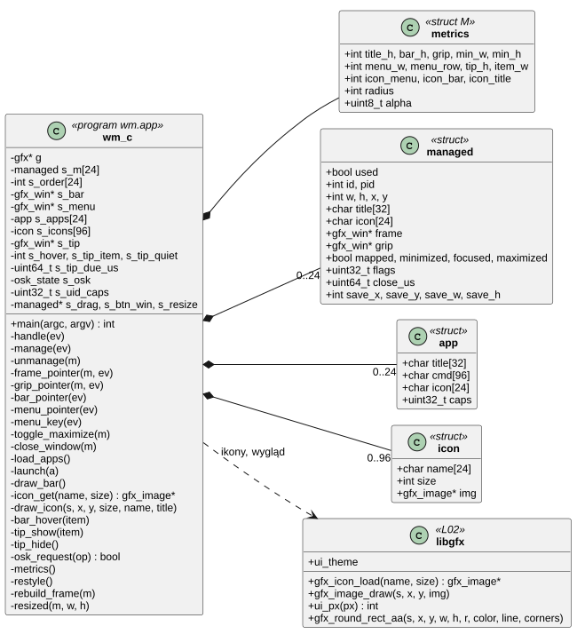
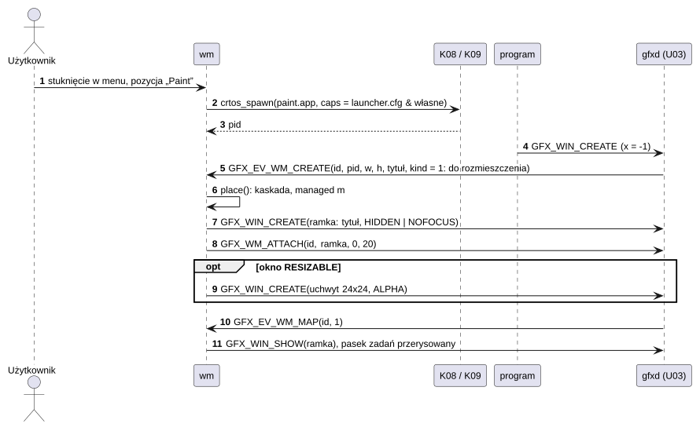
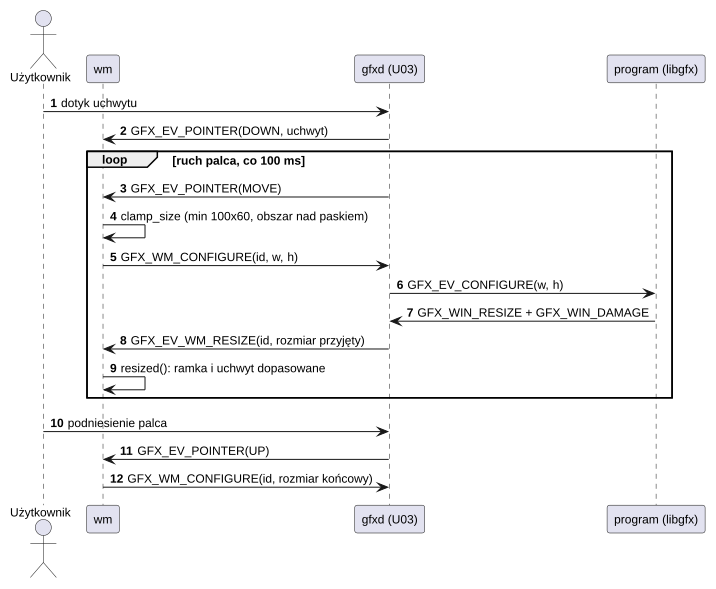
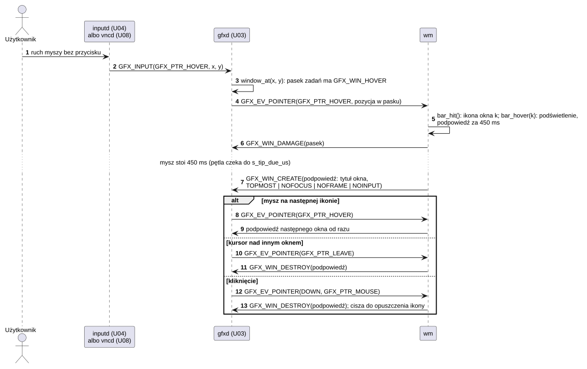
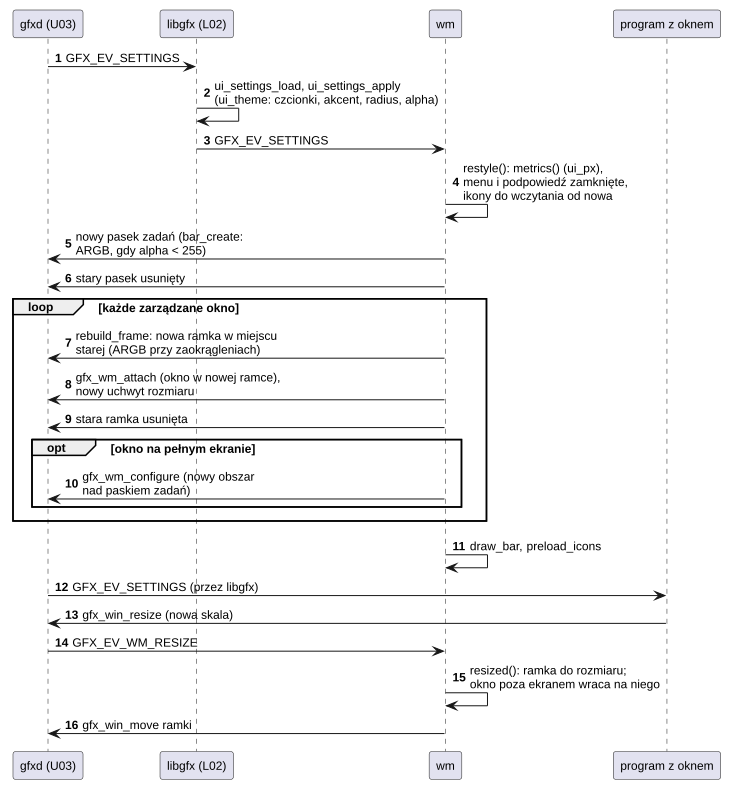

# A01 wm: menedżer okien

## 1. Identyfikacja

| | |
|---|---|
| Identyfikator | A01 |
| Warstwa | L3 (program, uprawnienia `spawn`, `kill`, `sys` z `init.cfg`) |
| Pliki | `system/apps/wm/wm.c`, `system/apps/wm/application.png` (ikona programów bez własnej), `system/apps/wm/apps.png` (ikona przycisku Apps); konfiguracja `rootfs/etc/launcher.cfg`, `/sd/crtos/etc/timezone`; ikony `/sd/crtos/share/icons/*.pam` |
| Uruchamiany | `service wm respawn` w `init.cfg` (restart po końcu); część systemu bazowego (`system/apps`) |

## 2. Odpowiedzialność

- Dekoracje okien innych programów: pasek tytułu (przeciąganie = przesuwanie),
  przyciski [_] (minimalizacja), [ ] (pełny ekran nad paskiem zadań, także podwójne
  stuknięcie w tytuł), [x] (prośba o zamknięcie; drugie [x] po 0,7–6 s kończy program).
- Zmiana rozmiaru okien z `GFX_WIN_RESIZABLE`: uchwyt w prawym dolnym rogu; prośby
  o rozmiar do programu 10 razy na sekundę w trakcie ruchu i raz po podniesieniu palca;
  ramka dostosowuje się do rozmiaru, który program faktycznie przyjął.
- Pasek zadań: przycisk menu programów (z `launcher.cfg`; ikona `wm-apps` w przycisku jak
  przycisk okna, bez niej napis „Apps”), ikona programu na każde okno (stuknięcie:
  na wierzch; stuknięcie aktywnego: minimalizacja; pod ikoną znacznik, dłuższy i jasny dla
  aktywnego okna), przycisk klawiatury ekranowej (gdy jest dostępna), zegar ze strefą czasową.
- Podpowiedzi jak w Windows: mysz zatrzymana nad pozycją paska zadań (albo palec
  przytrzymany na niej) pokazuje tytuł okna, nad zegarem – datę, nad przyciskami – ich opis.
- Ikony programów w menu, na pasku zadań i w paskach tytułu (`/sd/crtos/share/icons`,
  `gfx_icon_load` z L02).
- Menu z klawiatury i myszy: klawisz Windows je otwiera (z zaznaczonym pierwszym programem)
  i zamyka; w otwartym menu strzałki, Page Up/Down, Home/End, litera (następny tytuł na
  nią), Enter (uruchom) i Esc (zamknij); kółko myszy je przewija, a mysz nad pozycją ją
  zaznacza.
- Uruchamianie programów z menu z uprawnieniami z `launcher.cfg` ograniczonymi do
  własnych.
- Może zostać zakończony, uruchomiony ponownie albo zastąpiony innym menedżerem w czasie
  pracy programów: ich okna tracą ramki i dostają je od następnego menedżera (U03).
- Wygląd z ustawień (Settings > Appearance, L02): wszystkie wymiary w skali interfejsu
  (`ui_px`), czcionki i akcent z motywu; przy przezroczystości pasek zadań, menu i podpowiedzi
  są półprzezroczyste (okna ARGB mieszane przez gfxd), przy zaokrągleniach menu i podpowiedzi
  mają zaokrąglone rogi, a paski tytułu – górne. Po `GFX_EV_SETTINGS` pasek i wszystkie ramki
  powstają od nowa w nowym rozmiarze i wyglądzie, okna zostają na miejscu, a okno, które po
  zmianie skali wyszło poza ekran, wraca na niego.

## 3. Wymagania

| ID | Wymaganie | Weryfikacja |
|---|---|---|
| REQ-A01-01 | Program uruchomiony z menu dostaje co najwyżej uprawnienia `wm` (`caps z launcher.cfg & własne`). | przegląd kodu; jądro i tak przycina uprawnienia (K08) |
| REQ-A01-02 | Okno, dla którego zabrakło miejsca w tabeli (24) albo ramki, jest pokazywane bez ramki (nie ginie). | przegląd kodu |
| REQ-A01-03 | Po restarcie `wm` wszystkie istniejące okna dostają ramki ponownie (przy `GFX_WM_REGISTER` gfxd wysyła `GFX_EV_WM_CREATE` z `kind` = 0 dla każdego istniejącego okna). | restart z programu Settings (ręcznie) |
| REQ-A01-04 | Rozmiar okna nie spada poniżej 100 × 60 i nie wychodzi poza obszar nad paskiem zadań. | przegląd kodu, test ręczny |
| REQ-A01-05 | Program, który nie zamyka okna po [x], może być zakończony drugim [x] (0,7–6 s po pierwszym). | test ręczny |
| REQ-A01-06 | Naciśnięcie klawisza Windows przełącza menu programów; na czas otwartego menu `wm` bierze wszystkie klawisze (`gfx_wm_keys(true)`) i oddaje je przy każdym zamknięciu menu (wybór, Esc, stuknięcie obok, fokus innego okna). | `gfxtap key 125` (menu, zrzut), `gfxtap key 108/103/28` (wybór i uruchomienie `term`), Super_L i Esc przez VNC (30.09.2026) |
| REQ-A01-07 | Pozycja menu, przycisk okna na pasku zadań i pasek tytułu pokazują ikonę programu `/sd/crtos/share/icons/<nazwa>.pam`: dla pozycji menu nazwa z `icon=` albo z pliku programu (bez katalogu i `.app`), dla okna – nazwa procesu jego właściciela. Bez tej ikony pokazują ikonę `application`, a bez obu – kafelek z pierwszą literą tytułu. Przycisk menu pokazuje ikonę `wm-apps`, a bez niej napis „Apps”. Każdy plik ikony jest czytany najwyżej raz na rozmiar (także gdy go nie ma). | zrzuty menu (12 ikon), paska zadań i pasków tytułu (Files, System monitor), log `wm: managing windows (12 icons)` (30.09.2026), przegląd kodu |
| REQ-A01-08 | Podpowiedź pozycji paska zadań pojawia się po 450 ms spoczynku myszy nad nią albo po 550 ms przytrzymania palcem, a od razu, gdy mysz przechodzi na inną pozycję przy widocznej podpowiedzi. Znika, gdy kursor opuszcza pozycję albo pasek, przy naciśnięciu i po podniesieniu palca. Po kliknięciu nie wraca, dopóki kursor nie opuści pozycji. Przytrzymanie palcem, które pokazało podpowiedź, nie przełącza okna. | `gfxtap hover` (podpowiedź tytułu, data nad zegarem, zniknięcie), `gfxtap drag` w miejscu (przytrzymanie: podpowiedź, okno bez zmian), przez VNC najechanie, kliknięcie (brak podpowiedzi, minimalizacja) i powrót (30.09.2026) |
| REQ-A01-09 | Po `GFX_EV_SETTINGS` `wm` liczy wszystkie wymiary od nowa (`ui_px` wartości dla 100%), zamyka menu i podpowiedź, tworzy nowy pasek zadań i dla każdego okna nową ramkę w miejscu starej (stara znika dopiero po przyłączeniu okna do nowej; gdy nowej nie da się utworzyć, zostaje stara), a okno na pełnym ekranie dostaje nowy obszar nad paskiem zadań. Pasek zadań jest oknem ARGB tylko przy przezroczystości, menu i podpowiedzi przy przezroczystości albo zaokrągleniach, ramki przy zaokrągleniach; w pozostałych przypadkach RGB565. | `appearance` na płytce: 100/150/200%, przezroczystość i zaokrąglenia włączane i wyłączane, zrzuty paska, menu i ramek (03.10.2026) |
| REQ-A01-10 | Okno, którego program przyjął większy rozmiar (np. nowa skala) i które wychodzi poza ekran albo pod pasek zadań, jest przesuwane tak, żeby się zmieściło (najdalej do lewego górnego rogu); okien na pełnym ekranie i okna zmienianego właśnie uchwytem to nie dotyczy. | Settings przy 200% wraca na ekran (zrzut, 03.10.2026), przegląd kodu |
| REQ-A01-11 | Pozycja `launcher.cfg`, której programu (pierwsze słowo polecenia, ścieżka na karcie) nie ma, nie trafia do menu – system zbudowany bez programów dodatkowych (`crtos build --base`) nie pokazuje martwych pozycji. | przegląd kodu (`load_apps`: `stat` ścieżki programu); budowanie `--base` (03.10.2026) |

## 4. Interfejs udostępniany

Brak API dla programów – `wm` jest klientem U03 zarejestrowanym jako menedżer okien.
Dla użytkownika:

| Plik | Format |
|---|---|
| `/sd/crtos/etc/launcher.cfg` | `Tytuł: [caps=spawn,kill,sys,dev,module] [icon=NAZWA] /ścieżka/program.app [argumenty...]` (do 24 pozycji, czytany ponownie po 10 s; ikona domyślnie od nazwy programu) |
| `/sd/crtos/share/icons/NAZWA.pam` | ikona programu NAZWA (PAM RGBA, zwykle 64 × 64; buduje ją `crtos_app(... ICON)`, T01); `application.pam` dla programów bez własnej |
| `/sd/crtos/etc/timezone` | strefa czasowa POSIX TZ (domyślnie `CET-1CEST,M3.5.0,M10.5.0/3`), czytana co minutę |

`wm -t` loguje dotknięcia (diagnostyka).

## 5. Interfejsy wymagane

L02 (`gfx_open`, `gfx_wm_register/attach/close/focus/configure/keys`, okna, `ui_list`,
`ui_list_wheel`, `ui_key_char`, `gfx_icon_load`, `gfx_image_draw`, `ui_px`, `ui_theme`,
`gfx_round_rect_aa`, zdarzenie `GFX_EV_SETTINGS`), U03 (zdarzenia
`GFX_EV_WM_*`, `GFX_EV_KEY` z `win` 0, `GFX_EV_WHEEL`, `GFX_PTR_HOVER`/`GFX_PTR_LEAVE` dla
okien z `GFX_WIN_HOVER`: pasek zadań i menu), U04 (port `osk`: `OSK_STATE`, `OSK_TOGGLE`), L01
(`crtos_spawn`, `crtos_kill`, `crtos_wait`, `crtos_proc_info`, `crtos_wall_us`).

## 6. Struktura statyczna

*Źródło: [A01/struktura-statyczna.puml](../diagramy/A01/struktura-statyczna.puml)*

## 7. Zachowanie dynamiczne

### 7.1 Nowe okno i uruchomienie programu

*Źródło: [A01/nowe-okno.puml](../diagramy/A01/nowe-okno.puml)*

### 7.2 Zmiana rozmiaru uchwytem

*Źródło: [A01/zmiana-rozmiaru.puml](../diagramy/A01/zmiana-rozmiaru.puml)*

### 7.3 Podpowiedź na pasku zadań

*Źródło: [A01/podpowiedz.puml](../diagramy/A01/podpowiedz.puml)*

### 7.4 Nowy wygląd

*Źródło: [A01/nowy-wyglad.puml](../diagramy/A01/nowy-wyglad.puml)*

## 8. Implementacja

- Jeden wątek; pętla `gfx_next_event` z limitem do następnej minuty (zegar) albo 0,5 s /
  3 s (odpytywanie stanu klawiatury ekranowej: 0,5 s, gdy jest widoczna).
- Po każdym zdarzeniu `crtos_wait(-1, ..., 0)` odbiera zakończone programy uruchomione
  z menu (bez procesów-zombie).
- `gfx_pool_reserve(2 MB)`: ramki, uchwyty, pasek i menu są wycinane z jednej pamięci
  współdzielonej (proces mapuje najwyżej 3 obiekty naraz, K11); 2 MB, bo okna ARGB przy 200%
  są duże (pasek zadań 800 × 52 × 4 B).
- Wymiary: struktura `M` (`metrics()`: wartości dla 100% przez `ui_px`, promień rogów
  i krycie z `ui_theme`); dawne stałe `TITLE_H`, `BAR_H`, `GRIP`, `MENU_W`, `ICON_*` itd. to
  makra na jej pola. `popup_flags()`, `frame_flags()` i tworzenie paska wybierają ARGB albo
  RGB565; `over(rgb, more)` daje kolor o kryciu powierzchni (albo większym) na tle ARGB.
- Ramka przy zaokrągleniach: tło przezroczyste, pasek tytułu `gfx_round_rect_aa` z górnymi
  rogami (`GFX_CORNERS_TOP`); przyciski i ikona w rozmiarach skali.
- `restyle()` (`GFX_EV_SETTINGS`): `metrics()`, zamknięcie menu i podpowiedzi, pamięć ikon
  wyczyszczona (inne rozmiary), `bar_create()`, `rebuild_frame()` dla każdego okna,
  `draw_bar()`, `preload_icons()`, log `wm: new look: scale …`.
- `resized()` przesuwa ramkę okna, które wyszło poza obszar nad paskiem zadań.
- Pozycja nowego okna: kaskada od lewego górnego rogu; okna istniejące przed
  uruchomieniem `wm` zostają na miejscu (ramka nad nimi).
- Klawisze: `menu_key` dostaje wszystkie `GFX_EV_KEY` (od gfxd przychodzą tylko klawisze
  Windows i klawisze w czasie `gfx_wm_keys(true)`); `menu_open` i `menu_close` włączają
  i wyłączają przejmowanie klawiszy. Zaznaczenie to `sel` listy `ui_list` (`ui_list_show`
  przewija do niego); litera szuka następnego tytułu od zaznaczenia (`ui_key_char`).
- Ikony: pamięć podręczna `s_icons` (do 96 par nazwa–rozmiar, 20 px w menu, 18 px na pasku,
  16 px w pasku tytułu). `gfx_icon_load` czyta plik 64 × 64 i zmniejsza go średnią z obszaru.
  Zapisany jest też brak ikony, więc brakujący plik nie jest szukany przy każdym
  przerysowaniu. Ikony menu są wczytywane przy starcie, więc pierwsze otwarcie menu nie
  czeka na kartę. Nazwę programu okna daje `crtos_proc_info` (pid z `GFX_EV_WM_CREATE`).
- Pasek zadań: przycisk okna ma 34 px (mniej, gdy okien jest więcej, niż się mieści), ikonę
  18 px i znacznik pod nią (aktywne okno: 12 px w kolorze akcentu, pozostałe: 6 px, okno
  zminimalizowane: ciemniejszy). Pozycja pod myszą ma jaśniejsze tło.
- Podpowiedzi: pasek i menu mają `GFX_WIN_HOVER`. `bar_hover()` zapamiętuje pozycję pod
  kursorem i planuje podpowiedź (`s_tip_due_us`), a pętla główna skraca czekanie na zdarzenie
  do tego czasu. Podpowiedź to osobne okno (`TOPMOST | NOFOCUS | NOFRAME | NOINPUT`: kursor
  przechodzi przez nie do paska) tuż nad pozycją, tworzone przy każdym pokazaniu.
  `s_tip_quiet` wstrzymuje podpowiedź klikniętej pozycji. Zmiana listy okien ukrywa
  podpowiedź, bo pozycje się przesuwają, a zmiana tytułu pokazanego okna ją odświeża.

## 9. Obsługa błędów i mechanizmy bezpieczeństwa

| Sytuacja | Reakcja |
|---|---|
| `gfxd` nie odpowiada | `wm: no graphics server`, koniec (init restartuje) |
| inny menedżer działa | `another window manager runs`, koniec |
| koniec `gfxd` w trakcie | L02 kończy program (kod 1), init restartuje |
| brak `launcher.cfg` | log, puste menu |
| program nie startuje | log `cannot start` |
| brak miejsca na okno / ramkę | okno bez ramki |
| brak portu `osk` | przycisk klawiatury niewidoczny |
| brak ikony `wm-apps` | przycisk menu z napisem „Apps” (58 px) zamiast ikony (34 px) |
| brak ikony programu, plik uszkodzony albo za duży | ikona `application`, a bez niej kafelek z pierwszą literą tytułu (L02 odrzuca plik) |
| brak pamięci na okno podpowiedzi | podpowiedź się nie pokazuje |
| brak pamięci na nowy pasek / nową ramkę przy zmianie wyglądu | zostaje stary pasek / stara ramka (dawny rozmiar, działa dalej) |

## 10. Konfiguracja

Wymiary dla 100% (mnożone przez skalę): `TITLE_H` (20), `BAR_H` (26), `GRIP` (24),
`MIN_W`/`MIN_H` (100/60), `MENU_W` (180), `MENU_ROW` (26), `ICON_MENU`/`ICON_BAR`/`ICON_TITLE`
(20/18/16 px), `TIP_H` (20), `ITEM_W` (34); stałe: `MAXW` (24), `MAXAPPS` (24),
`DOUBLE_TAP_US` (400 ms), `RESIZE_EVERY_US` (100 ms), `MAXICONS` (96), `APPS_ICON`
(`wm-apps`), `TIP_DELAY_US` (450 ms), `TIP_HOLD_US` (550 ms), `POOL_BYTES` (2 MB); pliki
z rozdziału 4 i ustawienia wyglądu (L02).

## 11. Weryfikacja

- Testy ręczne na płytce: menu, przesuwanie, minimalizacja, pełny ekran, zmiana rozmiaru
  (term, sysmon, paint), [x] i wymuszone zakończenie, restart `wm` z Settings.
- `crtos run gfxtap tap X Y` / `drag` (zdalnie, bez dotyku), `crtos shot`.
- 30.09.2026: `gfxtap key 125` otwiera menu (zaznaczony „Terminal”), `gfxtap wheel` przewija
  je (11 pozycji w oknie na 9), strzałki przesuwają zaznaczenie, Enter uruchamia terminal;
  przez VNC Super_L otwiera menu, a Esc je zamyka.
- 30.09.2026, ikony i podpowiedzi:
  - zrzuty (`crtos desktop --shot`): menu z ikonami, pasek zadań z ikonami okien (Files,
    System monitor) i znacznikiem aktywnego, ikona w pasku tytułu;
  - `gfxtap hover` nad ikoną okna: podpowiedź z tytułem; przejście nad zegar: data od razu;
    zejście z paska: podpowiedź znika; najechanie na menu zaznacza pozycję;
  - `gfxtap drag X Y X Y 40` (palec przytrzymany): podpowiedź w trakcie, po puszczeniu jej
    nie ma, a okno nie zostało zminimalizowane;
  - przez VNC (jak `crtos desktop`): podpowiedź po najechaniu, po kliknięciu jej brak (okno
    zminimalizowane), brak przy dalszym spoczynku myszy, znowu po wyjechaniu i powrocie;
  - przycisk Apps z ikoną `wm-apps` (zrzuty): w spoczynku, z podpowiedzią „Apps (Windows
    key)” po najechaniu, z tłem akcentu przy otwartym menu.
- 03.10.2026, wygląd (`appearance` przez kmon, zrzuty `crtos desktop --shot`): skale 100,
  150 i 200% (pasek, ikony, ramki, menu), przezroczystość włączona i wyłączona, krycie 60
  i 88%, zaokrąglenia włączone i wyłączone, akcent; Settings powiększone do 200% wraca na
  ekran.

## 12. Ograniczenia i znane problemy

- Brak kafelkowania i przełączania okien z klawiatury (Alt+Tab); z klawiatury działa tylko
  menu programów.
- Okna jednego programu nie są grupowane na pasku zadań: każde ma własną ikonę. Przy więcej
  niż 9 oknach przyciski są węższe niż ikona i ikony na siebie zachodzą.
- Ikona okna wynika z nazwy programu; program nie może ustawić innej ikony dla swojego okna.
  Nazwa procesu ma najwyżej 15 znaków (K08), więc program o dłuższej nazwie pliku dostaje
  ikonę domyślną.
- Na ekranie dotykowym nie ma najechania: podpowiedź pokazuje dopiero przytrzymanie palca.
- Dolne rogi okien programów są kwadratowe: zaokrąglone są tylko paski tytułu, menu
  i podpowiedzi (PXP nie maskuje okien RGB565 programów).
- Zmiana wyglądu tworzy na chwilę drugą ramkę każdego okna, więc przy wielu oknach i 200%
  potrzebuje zapasu w puli 2 MB; bez niego okno zostaje ze starą ramką.
- Uprawnienia w `launcher.cfg` są zaufane (plik na karcie jest chroniony tylko tym, że
  zapis wymaga `deployd` albo dostępu do karty).
