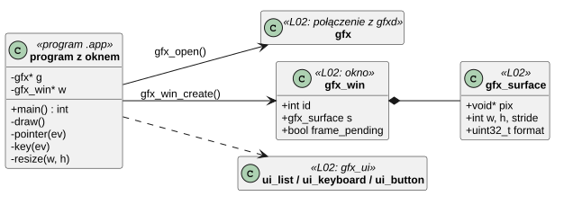
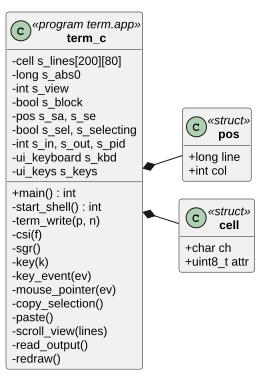
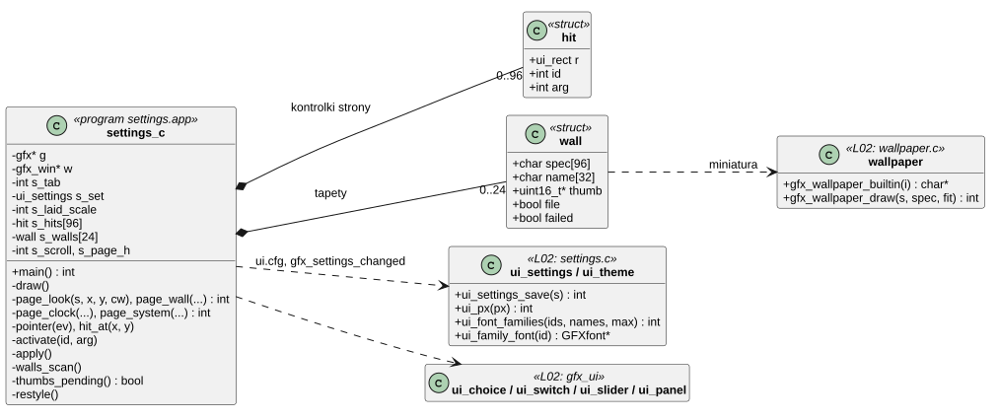
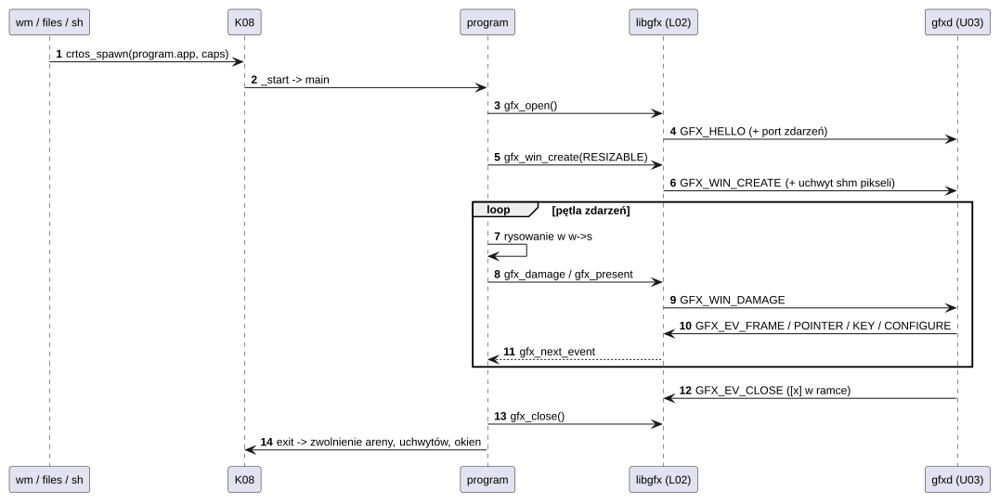
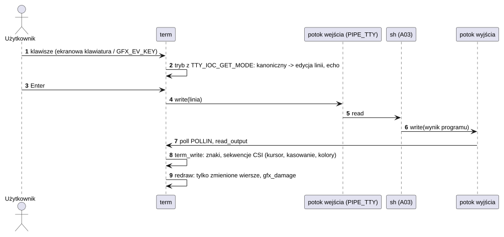
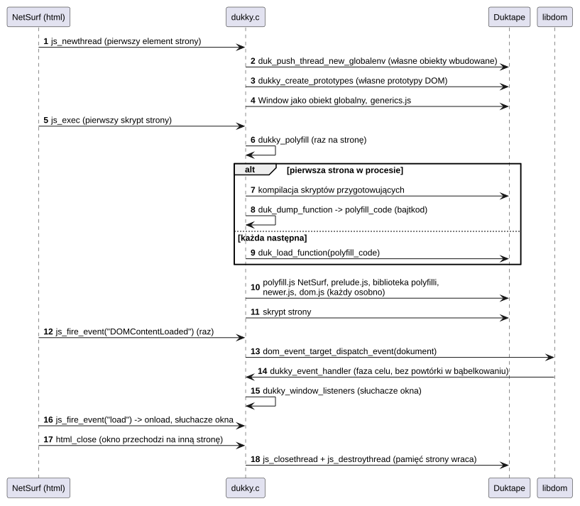

# A02 Aplikacje z oknem

## 1. Identyfikacja

| | |
|---|---|
| Identyfikator | A02 |
| Warstwa | L3 (programy `.app` w `/sd/crtos/apps/`) |
| Pliki | system bazowy: `system/apps/<nazwa>/` (`term`, `files`, `settings`, `sysmon`; `wm` opisuje A01); dodatki: `apps/<nazwa>/` (`paint`, `gfxdemo`, `tftdemo`, `netsurf`; gry są programami użytkownika, nieopisanymi); przykład `examples/hello_world/` |
| Uruchamiane | menu `wm` (`launcher.cfg`), `init.cfg` (`service ... once`), `files`, powłoka |

| Program | Katalog | Uprawnienia (`launcher.cfg`) | Opis |
|---|---|---|---|
| `term` | `system/apps/term/` | `spawn`, `kill` | terminal graficzny: powłoka na dwóch potokach `PIPE_TTY`, podzbiór VT100 (ruch kursora, kasowanie, także przewiniętej historii `ESC[3J`, kolory, odwrócenie `ESC[7m`, kształt kursora `ESC[n q`), klawiatura ekranowa, historia 200 linii (kółko myszy, przeciąganie palcem); zaznaczanie myszą (dwuklik: słowo), kopiowanie i wklejanie przez schowek systemu (Ctrl+C przy zaznaczeniu, Ctrl+V, Ctrl+Shift+C/V, Ctrl/Shift+Insert); w trybie surowym klawisze specjalne jako sekwencje (`ESC[A`…, `ESC[H`, `ESC[F`, `ESC[5~`, `ESC[6~`, `ESC[3~`, `ESC[2~`, Ctrl+strzałki `ESC[1;5D`/`C`) i Ctrl-C dla programu |
| `files` | `system/apps/files/` | `spawn` | przeglądarka plików tylko do odczytu: katalogi, podgląd tekstu i heksadecymalny (do 48 KB), uruchamianie `.app`; lista i podgląd przewijane także kółkiem |
| `settings` | `system/apps/settings/` | `sys`, `kill` | cztery strony: wygląd (skala interfejsu 100–200%, rodzina czcionek – przyciski pisane każdą z nich, kolor akcentu, przezroczystość i jej krycie, zaokrąglenia), tapeta (miniatury tapet wbudowanych, plików z `/sd/crtos/share/wallpapers` i kolorów, dopasowanie obrazu), zegar (data, czas, strefa: `settimeofday`, `/sd/crtos/etc/timezone`), system (informacje, restart `wm`, restart płytki); każda zmiana od razu w `ui.cfg` i na ekranie |
| `sysmon` | `system/apps/sysmon/` | `kill` | obciążenie procesora (wykres z 60 s), pamięć, sieć, procesy z udziałem CPU i pamięci (lista przewijana także kółkiem), kończenie procesu |
| `paint` | `apps/paint/` | – | rysowanie palcem, paleta, czyszczenie; wysyła tylko zmienione prostokąty |
| `gfxdemo` | `apps/gfxdemo/` | – | animacja w rytmie ekranu (`GFX_EV_FRAME`), fps i czasy kompozytora |
| `tftdemo` | `apps/tftdemo/` | – | zegar rysowany biblioteką TFTLIB (L02) na powierzchni XRGB8888 |
| `netsurf` | `apps/netsurf/` | – | przeglądarka WWW NetSurf (front end framebuffer na powierzchni okna, HTTPS przez Mbed TLS i TRNG; kółko myszy jako przyciski 4/5 – przewijanie; JavaScript w Duktape z polyfillami i uzupełnionym DOM, każda strona we własnym środowisku); budowana tylko, gdy źródła pobrano (`crtos setup --netsurf`) |

## 2. Odpowiedzialność

Każdy program: otwiera połączenie z `gfxd` (L02), tworzy okno (zwykle
`GFX_WIN_RESIZABLE`), rysuje we własnej pamięci pikseli i zgłasza zmienione prostokąty,
reaguje na zdarzenia (wskaźnik, klawisze, `CONFIGURE`, `CLOSE`, `FRAME`) i kończy się po
`GFX_EV_CLOSE`. Programy nie mają dostępu do sprzętu ani do pamięci innych procesów (K03,
K08); ekran widzą tylko przez swoje okna.

Wygląd (L02): `settings`, `files`, `sysmon` i `term` liczą wymiary przez `ui_px` i rysują
czcionkami motywu, więc idą za skalą interfejsu i czcionką z Settings; po `GFX_EV_SETTINGS`
układają okno od nowa (nowa skala: okno proporcjonalnie większe lub mniejsze). `paint`,
`gfxdemo`, `tftdemo` i `netsurf` mają stałe rozmiary.

## 3. Wymagania

| ID | Wymaganie | Weryfikacja |
|---|---|---|
| REQ-A02-01 | Każdy program kończy się po `GFX_EV_CLOSE` (programy z procesami potomnymi – `term` – kończą też je). | test ręczny ([x] w ramce) |
| REQ-A02-02 | Programy z `GFX_WIN_RESIZABLE` odpowiadają na `GFX_EV_CONFIGURE` przez `gfx_win_resize` i przerysowanie całego okna. | test ręczny (uchwyt, pełny ekran) |
| REQ-A02-03 | `files` niczego nie zmienia na karcie (tylko odczyt). | przegląd kodu |
| REQ-A02-04 | `sysmon` nie kończy procesu `init` (pid 1); kończenie cudzych procesów wymaga `CAP_KILL` (sprawdza jądro). | przegląd kodu, test ręczny |
| REQ-A02-05 | Błąd programu (np. dostęp poza arenę) kończy tylko ten program; jego okna znikają (U03). | apptest `crash-*` (K04), obserwacja |
| REQ-A02-06 | `term`: przeciągnięcie myszą (`GFX_PTR_MOUSE`) zaznacza tekst, a palcem przewija historię; Ctrl+C z zaznaczeniem (albo Ctrl+Shift+C, Ctrl+Insert) kopiuje zaznaczenie do schowka systemu (linie bez spacji na końcu, połączone `\n`) zamiast przerywać program; Ctrl+V (Ctrl+Shift+V, Shift+Insert) wkleja schowek jak pisany tekst (w trybie surowym koniec linii jako CR). | `gfxtap mdrag` + `key 29+46` + `key 29+47` (zrzuty 30.09.2026: zaznaczenie, wklejony tekst w wierszu poleceń) |
| REQ-A02-07 | `term`, `files`, `sysmon`, menu `wm` (A01) i `netsurf` przewijają się kółkiem myszy (`GFX_EV_WHEEL`) nad sobą: listy o 3 wiersze na ząbek (`ui_list_wheel`), terminal o 3 linie historii, NetSurf przyciskami 4/5. | `gfxtap wheel` (zrzuty: terminal „-4”, lista `sysmon`, menu); NetSurf – przegląd kodu |
| REQ-A02-08 | `netsurf`: tekst paska adresu ze spacją albo jedno słowo bez `.`, `:` i `/` (poza `localhost`) idzie jako wyszukiwanie do dostawcy wyszukiwania (DuckDuckGo HTML), reszta jako adres (`search_web_omni`). W pasku pierwsze kliknięcie i Ctrl+A zaznaczają cały tekst, który następny znak, Backspace albo Delete zastępuje lub usuwa. Ctrl+C/Ctrl+X/Ctrl+V w pasku i w polach strony używają schowka `gfxd`. | na płytce (`gfxtap`, zrzuty, 30.09.2026): zaznaczenie po kliknięciu i po Ctrl+A, zastąpienie tekstu, Ctrl+C w pasku i Ctrl+V w polu strony, „netsurf browser” z paska daje wyniki DuckDuckGo |
| REQ-A02-09 | `netsurf`: każda strona wykonuje skrypty we własnym środowisku JavaScript (wątek Duktape z nowym środowiskiem globalnym: własne obiekty wbudowane i prototypy DOM), więc zmiany jednej strony w `Array.prototype`, prototypach DOM czy obiekcie okna nie dotyczą następnej. | na płytce 30.09.2026: strona A podmienia `Array.prototype.join` i `Element.prototype.getAttribute`, strona B w tym samym oknie ma własne (`1-2`, `null`, bez zmiennej strony A) |
| REQ-A02-10 | `netsurf`: przed pierwszym kodem strony (skrypt, obsługa zdarzenia) wykonują się skrypty przygotowujące (`polyfill.js` NetSurf, `prelude.js`, biblioteka polyfilli, `newer.js`, `dom.js`), każdy osobno: błąd jednego trafia do logu, a pozostałe i skrypty strony działają. Pierwsza strona w procesie je kompiluje, następne ładują zachowany bajtkod; strona bez skryptów i obsługi zdarzeń ich nie uruchamia. | na płytce 30.09.2026 (`netsurf -v`): 1,08 s dla pierwszej strony, 0,22 s dla każdej następnej, brak wpisu dla wyników DuckDuckGo HTML |
| REQ-A02-11 | `netsurf`: `DOMContentLoaded` trafia raz do dokumentu i do okna po wykonaniu skryptów parsera, `load` do `onload` i słuchaczy okna; `document.readyState` przechodzi `loading`, `interactive`, `complete`; słuchacz na celu zdarzenia wykonuje się raz (libdom), a słuchacze fazy przechwytywania i bąbelkowania węzła – niezależnie od kolejności rejestracji. | strona testowa na płytce 30.09.2026: kolejność `doc-DCL:interactive, win-DCL, onload, win-load:complete`, ok. 50 sprawdzeń API bez błędu (selektory, `tagName`, `href`, formularze, `URL`, `Promise.all([])`, `postMessage`) |
| REQ-A02-12 | `netsurf`: środowisko JavaScript strony jest niszczone, gdy okno przechodzi na inną stronę (`html_close`), a nieużywane treści wypadają z pamięci podręcznej po 3 s; historia trzyma miniatury tylko 8 ostatnich stron. Sterta (8,25 MB, TLSF z `libcrtosheap`) mieści arenę w 12 MB, a gdy się zapełni, rośnie w jedno okno pamięci współdzielonej do 8 MB, które wraca do systemu przy wyjściu z programu. | na płytce 30.09.2026: 41 kolejnych przeładowań strony ze skryptem co 0,4 s bez spowolnienia (0,22 s przygotowania każdej) i bez braku pamięci; `crtos-app info`: arena 12288 KB. 01.10.2026: 30 przeładowań, zajęta sterta na początku strony stała (2,3–2,45 MB); skrypt z blokiem 10 MB (więcej niż sterta areny) wykonany w oknie sterty, okno programu zmaksymalizowane przy zajętym oknie sterty, po wyjściu SDRAM wolna jak przed startem (26,8 MB) |
| REQ-A02-13 | `netsurf`: skrypt działający dłużej niż `script_timeout` sekund (opcja `Choices`, domyślnie 10) zostaje przerwany (`RangeError: execution timeout`), a przeglądarka działa dalej. | na płytce 30.09.2026: test przeglądarki Google przerwany po 10 s, z `script_timeout:60` wykonany do końca |
| REQ-A02-14 | `netsurf`: gdy pamięci brak także w oknie sterty, nieudana alokacja kończy się komunikatem o braku pamięci („NetSurf is running out of memory”), pominięciem części strony (skrypt, obraz; wpis w logu) albo pustą stroną, a nie błędem programu, i następna strona może się wczytać; planowanie zadań frontendu (`framebuffer_schedule`) sprawdza wynik `calloc` i zwraca `NSERROR_NOMEM`, a tekst paska stanu i pola tekstowe przy nieudanym `strdup` zostają poprzednie. | przegląd kodu (`schedule.c`, `browser_window_set_status`, `fbtk_set_text`); przed poprawkami awarie zapisu przez `NULL` w `framebuffer_schedule` (30.09.2026, `crtos crash`: `_gettimeofday(tv=8)`) i `strcmp(NULL)` w `fbtk_set_text` (01.10.2026); na płytce 01.10.2026 z `CRTOS_HEAP_STATS=1`: strona tworząca elementy aż do zapełnienia sterty (16,7 MB: arena i okno 8 MB) – strona pusta, program działa, następna strona wczytana w 0,4 s; 16 skryptów po 865 KB – 4 wykonane, 12 pominiętych („Unable to allocate memory for file data buffer”), strona dokończona |
| REQ-A02-15 | `settings`: każda zmiana na stronach Wygląd i Tapeta jest od razu zapisywana w `ui.cfg` i ogłaszana (`gfx_settings_changed`); program pokazuje stan z pliku. Gdy zapis się nie uda, pokazuje komunikat i nie ogłasza zmiany. Strona, która nie mieści się w oknie, przewija się (przeciąganie palcem dalej niż 8 px, kółko myszy) zamiast naciskać kontrolkę. | na płytce 03.10.2026: zmiany skali, czcionki, akcentu, przezroczystości, krycia, zaokrągleń, tapety i dopasowania przez Settings (do czasu dotyku użytkownika) i `appearance`; plik `ui.cfg` po każdej zmianie |
| REQ-A02-16 | `settings`: tapety z plików pokazuje jako miniatury robione po jednej między zdarzeniami (okno odpowiada na dotyk w trakcie); plik, którego nie da się odczytać, ma kafelek z napisem zamiast obrazu i nie jest czytany ponownie. | na płytce: plik testowy z `crtos wallpaper` (miniatura), przegląd kodu |
| REQ-A02-17 | `settings`, `files`, `sysmon`, `term`: po `GFX_EV_SETTINGS` okno przyjmuje rozmiar dla nowej skali (Settings: domyślny rozmiar skali, mieszczący się na ekranie nad paskiem zadań; pozostałe: obecny rozmiar × nowa skala / stara), a układ, czcionki i kolory idą za motywem; `term` liczy komórkę znaku z czcionki `mono` motywu i zachowuje tekst (liczba kolumn i wierszy zmienia się z rozmiarem). | na płytce 03.10.2026: 100 → 150 → 200 → 150% z otwartymi programami (zrzuty) |

## 4. Interfejs udostępniany

Programy nie udostępniają interfejsów innym komponentom. Interfejs dla użytkownika:
okna, dotyk, klawiatura; `netsurf [-v | -V plik_logu] [url]`, `wm -t`.

Gry (`apps/voxel`, `apps/nes`) są programami użytkownika i ta dokumentacja ich nie opisuje.

## 5. Interfejsy wymagane

L02 (`libgfx`: okna, rysowanie, `gfx_ui` – przyciski, listy, klawiatura, przełączniki,
suwaki; ustawienia wyglądu, `ui_px`, tapety; TFTLIB dla `tftdemo`), L01 (`libcrtos` i newlib: pliki, czas, procesy, `crtos_pipe`, `poll`), U03
przez L02, S05 (gniazda – `netsurf`, `sysmon`: `NET_IOC_IFINFO`), D08 (`/dev/random` –
`netsurf` przez Mbed TLS). `netsurf` linkuje `libcrtosheap` (L01) z własnymi ustawieniami
domyślnymi (`crtos_heap_windows = 1`, `crtos_heap_window_kb = 8192`, `crtos_heap_swap = 0`:
sterta w arenie, potem jedno okno do 8 MB, bez pamięci emulowanej).

## 6. Struktura statyczna

Wspólny układ programu z oknem:

*Źródło: [A02/struktura-programu.puml](../diagramy/A02/struktura-programu.puml)*

Terminal:

*Źródło: [A02/term.puml](../diagramy/A02/term.puml)*

Ustawienia (Settings):

*Źródło: [A02/settings.puml](../diagramy/A02/settings.puml)*

Przebieg zmiany wyglądu pokazuje diagram sekwencji L02 „Zmiana wyglądu”.

## 7. Zachowanie dynamiczne

### 7.1 Cykl życia programu z oknem

*Źródło: [A02/cykl-zycia.puml](../diagramy/A02/cykl-zycia.puml)*

### 7.2 Polecenie w terminalu

*Źródło: [A02/polecenie-w-terminalu.puml](../diagramy/A02/polecenie-w-terminalu.puml)*

### 7.3 JavaScript strony w NetSurf

*Źródło: [A02/netsurf-javascript.puml](../diagramy/A02/netsurf-javascript.puml)*

## 8. Implementacja

- Wszystkie programy mają jeden wątek i pętlę `gfx_next_event` albo `poll` (term: wyjście
  powłoki i zdarzenia okna).
- `gfxdemo`, `tftdemo`: rysowanie kolejnej klatki po `GFX_EV_FRAME`
  (`gfx_wait_frame`), więc tempo = odświeżanie ekranu bez rozrywania obrazu.
- `netsurf`: front end framebuffer NetSurf z powierzchnią `crtos` (`nsfb_crtos.c`) w miejscu
  SDL; biblioteki (libcss, libdom, curl, Mbed TLS, ...) budowane z `third_party/` (grupa
  `netsurf` w `third_party/sources.txt`) z łatkami `patches/netsurf.patch` i
  `patches/netsurf-libs/`; zasoby w `/sd/crtos/share/netsurf`. Łatki CRTOS
  frontendu: pasek adresu (`fbtk/text.c`) z zaznaczeniem całości (`u.text.all`, rysowane na
  jasnoniebieskim tle), Ctrl+A/C/X/V, Delete i Ctrl+Backspace; `fb_url_enter` przez
  `search_web_omni`; schowek frontendu (`clipboard.c`) przez `crtos_clipboard_set/get`
  z `nsfb_crtos.c` (`gfx_clip_set/get`, lokalny bufor, gdy `gfxd` nie odpowiada); Home, End
  i Ctrl+Backspace w polach strony (`gui.c`).
- `netsurf`, JavaScript (Duktape 2.7; łatki `netsurf.patch`, `nsgenbind.patch`,
  `libdom.patch`):
  - wiązania DOM generuje nsgenbind (budowany przy konfiguracji przez
    `tools/netsurf_prepare.py`, parsery w `apps/netsurf/nsgenbind-gen/`); ich właściwości są
    `configurable`, a metody `writable`, jak w Web IDL, więc skrypty mogą zastąpić atrapy
    (metody i atrybuty, które wiązania tylko deklarują i które zwracają `undefined`);
  - `js_newthread`: `duk_push_thread_new_globalenv` i `dukky_create_prototypes` dla każdej
    strony; `dukky_polyfill` uruchamia skrypty przygotowujące (`polyfill.js.inc`, tablica
    `polyfill_scripts` z `netsurf_prepare.py`: `polyfill.js` NetSurf,
    `apps/netsurf/js/prelude.js`, biblioteka `third_party/netsurf-libs/polyfill`, `newer.js`,
    `dom.js`) przed pierwszym `js_exec`, obsługą zdarzenia albo `onload`; bajtkod
    (`duk_dump_function`) trzyma `polyfill_code`;
  - w C: `Document` (`readyState`, `title`, `URL`, `characterSet`, `compatMode`, `domain`,
    `referrer`, `defaultView`, `createComment`), `Element` (`tagName`, `localName`,
    `namespaceURI`, `prefix`, `remove`), `HTMLAnchorElement.href` (względem bazy dokumentu),
    `HTMLFormElement.submit` (`form_submit`), `Navigator` (`language`, `languages`, `onLine`,
    `platform`), `Window` (`innerWidth`, `innerHeight`, `screen` – rozmiar ekranu z `main.c`),
    `Location` (`protocol` z `:`, `search` z `?`, `hash` i `href` z fragmentem okna);
  - zdarzenia: `DOMContentLoaded` raz (`html_begin_conversion`), słuchacze okna
    (`dukky_window_listeners`: `load`, `DOMContentLoaded`, `window.dispatchEvent`), dwa
    słuchacze libdom na węzeł (przechwytywanie; cel i bąbelkowanie); libdom nie dodaje celu do
    listy przodków i bąbelkuje tylko zdarzenia z `bubbles`;
  - czas: `Date.now()` z `gettimeofday` (`duk_custom.h`), limit `script_timeout` w
    `dukky_check_timeout`;
  - pamięć: `libcrtosheap` zamiast listy wolnych bloków newlib (skrypty spędzały w `malloc`
    i `free` 63% czasu), wątek JS niszczony w `html_close`, `HL_CACHE_CLEAN_TIME` 3 s; arkusz
    domyślny ukrywa `[hidden]`;
  - brak pamięci (`netsurf.patch`): sterta rośnie w jedno okno do 8 MB (`main.c`:
    `crtos_heap_windows`, `crtos_heap_window_kb`), bo duże skrypty stron potrzebują bloków po
    pół megabajta, a zapełniona sterta areny ich już nie miała; `browser_window_history_add`
    usuwa miniatury wpisów starszych niż 8 ostatnich; miniatura renderuje się w szerokości
    232 px (`FB_THUMBNAIL_RENDER_WIDTH`, dwa razy szerokość miniatury, zamiast 480);
    `framebuffer_schedule` zwraca `NSERROR_NOMEM` zamiast pisać przez `NULL`;
    `browser_window_set_status` przy nieudanym `strdup` zostawia stary tekst (przedtem
    przekazywał frontendowi `NULL`), a `fbtk_set_text` przyjmuje `NULL` jako pusty tekst
    i przy braku pamięci zostawia poprzedni; `dukky_log_heap`
    wypisuje (poziom INFO, `netsurf -v`) zajętość sterty przy nowej stronie i po skryptach
    przygotowujących (`mallinfo`).
- `sysmon`: próbki co 500 ms (`crtos_sys_info`, `crtos_proc_info`), udział CPU z różnicy
  czasów procesów. Wysokość wiersza i drobny tekst z czcionki skali (`small()`: TomThumb przy
  100%, czcionka motywu powyżej).
- `settings`: każde rysowanie strony zapisuje prostokąty kontrolek (`hit_add`, do 96),
  a dotyk szuka w nich (`hit_at`); przeciągnięcie dalej niż `DRAG_PX` przewija stronę.
  Wygląd: przyciski skali (`ui_choice`), rodzin czcionek (`ui_font_families`, napis czcionką
  rodziny `ui_family_font`), próbki akcentu (8), przełączniki (`ui_switch`), suwak krycia
  30–100% (`ui_slider`, zapis po puszczeniu palca). Tapeta: lista z
  `gfx_wallpaper_builtin`, plików `*.ppm`/`*.pam` z `GFX_WALLPAPER_DIR` (posortowanych) i 4
  kolorów, razem do 24; miniatury ui_px(104) px szerokości w proporcjach ekranu, RGB565
  w stercie, robione `thumbs_pending()` po jednej, gdy nie czeka żadne zdarzenie; dopasowanie
  (`GFX_FIT_*`). `apply()`: `ui_settings_save` + `gfx_settings_changed`; nowy wygląd program
  dostaje jak wszyscy (`GFX_EV_SETTINGS` → `restyle()`: rozmiar dla skali, miniatury od
  nowa, gdy zmienił się ich rozmiar).
- `files`: wysokości nagłówka i wiersza, ikony i tekst ze skali (`head_h()`, `row_h()`,
  `layout()`), podgląd czcionką `mono` motywu.
- `term`: linie mają numery od początku (`s_abs0` – numer wiersza 0 ekranu), więc
  zaznaczenie (`s_sa`, `s_se`) zostaje na tekście przy przewijaniu; komórki zaznaczenia są
  rysowane w kolorach wyboru. Kopia: tekst z `line_abs`, najwyżej 64 KB, `gfx_clip_set`.
  Wklejanie: `gfx_clip_get` do bufora 64 KB, w trybie surowym jednym `write`, w
  kanonicznym przez edycję linii znak po znaku. Kursor: podkreślenie albo blok (`ESC[1 q`,
  `ESC[2 q` – tak powłoka pokazuje nadpisywanie).
  Komórka znaku (`cells()`): szerokość z przesunięcia znaku czcionki `mono` motywu, wysokość
  i linia bazowa z najniższego glifu; klawiatura ekranowa i róg okna w `ui_px`.

## 9. Obsługa błędów i mechanizmy bezpieczeństwa

| Sytuacja | Reakcja |
|---|---|
| `gfxd` niedostępny przy starcie | komunikat, koniec z kodem 1 |
| koniec `gfxd` w trakcie | L02 kończy program (kod 1) |
| brak pamięci na okno / zmianę rozmiaru | okno zostaje w starym rozmiarze |
| błąd w programie | wyjątek MPU → koniec tylko tego procesu (K04), okna usunięte (U03) |
| brak uprawnienia (`settime`, `kill`) | komunikat w oknie (`EPERM`) |
| `netsurf`: skrypt strony działa za długo | przerwany po `script_timeout` s (`RangeError: execution timeout` w logu), strona zostaje |
| `netsurf`: błąd w skrypcie przygotowującym | wpis w logu (`Unable to run …`), pozostałe skrypty i strona działają |
| `netsurf`: skrypt w składni ES2015+ | `SyntaxError` w logu, strona bez tego skryptu |
| `netsurf`: bajtkodu nie da się wczytać | skrypty kompilowane ze źródła, jak dla pierwszej strony |
| `netsurf`: sterta areny pełna | sterta bierze jedno okno do 8 MB (L01); gdy system nie ma tyle wolnej pamięci, mniejsze |
| `netsurf`: brak pamięci także w oknie | komunikat „NetSurf is running out of memory”, pominięty skrypt albo obraz (wpis w logu) albo pusta strona; program działa dalej (REQ-A02-14) |
| `netsurf`: blok zwolniony drugi raz | `abort()` z komunikatem `heap: bad pointer … called from …` w `dmesg` (L01; ISS-28) |

## 10. Konfiguracja

`launcher.cfg` (uprawnienia), ustawienia wyglądu (`ui.cfg`, L02), stałe w plikach
(`settings`: `BASE_W` × `BASE_H` 460 × 340 przy 100%, `MAXHITS` 96, `MAXWALL` 24, `DRAG_PX`
8, sterta 1,5 MB na miniatury i czcionki rodzin; np. `HISTORY` 200, `COLS_MAX` 80,
`WHEEL_LINES` 3, `DOUBLE_CLICK_MS` 400 w `term`;
`VIEW_MAX` 48 KB w `files`; `HIST` 120 próbek w `sysmon`). `netsurf`: `apps/netsurf/Choices`
(`enable_javascript`, `script_timeout`, `memory_cache_size`), `HEAP` 8,25 MB
i `FB_THUMBNAIL_RENDER_WIDTH` w `apps/netsurf/CMakeLists.txt`, okno sterty
(`crtos_heap_windows`, `crtos_heap_window_kb`) w `apps/netsurf/main.c`, wersja biblioteki
polyfilli w `third_party/sources.txt`.

## 11. Weryfikacja

- Testy ręczne na płytce (dotyk, klawiatura USB), `crtos shot` (zrzuty ekranu), `crtos run
  gfxinfo -b` (fps z `gfxdemo`).
- 30.09.2026 (`gfxtap` i zrzuty): w `term` zaznaczenie myszą, Ctrl+C, Ctrl+V, kółko
  (przewinięcie o 4 linie), `clear` (ekran i historia czyste), Insert (kursor blokowy);
  kółko nad listą `sysmon`.
- `tools/modcheck.py --apps` przy budowaniu: program nie może mieć niezdefiniowanych
  symboli.
- 03.10.2026, wygląd: `appearance` przez kmon (skale 100/150/200%, rodziny noto i liberation,
  przezroczystość, krycie, zaokrąglenia, akcent, tapety) z otwartymi `settings`, `sysmon`,
  `files` i `term` – zrzuty `crtos desktop --shot`; strony Settings (Wygląd, Tapeta, Zegar,
  System) przy 100 i 150%.
- 30.09.2026, JavaScript w `netsurf`: strona testowa (ok. 50 sprawdzeń API, kolejność zdarzeń),
  test izolacji stron, 41 przeładowań, wyniki DuckDuckGo HTML, profil PC przez SWD (przed
  zmianą sterty 63% czasu w `malloc`/`free`); na PC te same skrypty przygotowujące na makiecie
  DOM w Duktape (97 sprawdzeń).
- 01.10.2026, pamięć `netsurf`: raport `CRTOS_HEAP_STATS=1` przy nieudanym żądaniu (przed
  zmianą: zajęte 6,4 MB z 8,25, największy wolny blok 315–417 KB, żądanie 492 922 B), 30
  przeładowań z dziennikiem sterty, strona z blokiem 10 MB, zmiana rozmiaru okna przy oknie
  sterty; strona testowa JavaScript bez błędów po zmianach (także przy przeładowaniu
  z bajtkodu); dwie strony wyczerpujące pamięć (elementy DOM i układ strony: 16,7 MB
  sterty w 287 tys. bloków; 16 dużych skryptów) – bez awarii po poprawkach paska stanu.

## 12. Ograniczenia i znane problemy

- `files` tylko czyta (brak kopiowania i usuwania z GUI).
- Skala interfejsu nie dotyczy `paint`, `gfxdemo`, `tftdemo`, `netsurf` ani gier.
- `settings`: miniatura dużego pliku tapety czyta cały plik (ok. 1 s na 6 MB); w tym czasie
  okno nie odpowiada. Na liście mieści się 24 tapet (wbudowane, kolory i pliki razem).
- `term`: podzbiór VT100 (bez przewijania obszaru, bez znaków spoza ASCII); zaznaczanie
  tylko myszą (palec przewija), bez wklejania nawiasowego (program nie odróżni wklejenia od
  pisania).
- `netsurf`, JavaScript:
  - Duktape parsuje tylko składnię ES5.1: skrypty z funkcjami strzałkowymi, `class`,
    `let`/`const`, szablonami czy `async` kończą się `SyntaxError` (np. jQuery 4);
  - układ strony jest statyczny: zmiany DOM po jej ułożeniu (po `load`) nie są rysowane;
  - skrypty nie mają sieci (brak `XMLHttpRequest`, `fetch` kończy się błędem), `localStorage`
    trwa do końca strony, rozmiary elementów to 0;
  - strona pokazana znowu z pamięci podręcznej nie ma już działających skryptów;
  - wyszukiwarka Google: jej test przeglądarki („knitsail”) liczy się ok. 6 s i wyniki
    czasem się pokazują (01.10.2026: „facebook”), ale po częstych albo automatycznych
    zapytaniach Google odpowiada stroną reCAPTCHA („nietypowy ruch”), której NetSurf nie
    przejdzie; wyszukiwanie z paska adresu idzie przez DuckDuckGo w wersji HTML;
  - pierwsza strona ze skryptem w procesie czeka ok. 1,1 s na skrypty przygotowujące,
    a bajtkod zajmuje na stałe ok. 270 KB sterty.
- `netsurf`: duże strony zużywają dużo pamięci. Sterta ma najwyżej ok. 16 MB (8,25 MB
  w arenie i okno do 8 MB), a okno bierze tylko tyle, ile system ma wolnej pamięci. Przy
  innych dużych programach (np. SNES, kompilator) strona ze skryptami rzędu megabajtów może
  więc dalej skończyć się komunikatem o braku pamięci. Okno sterty zostaje zajęte do końca
  programu.
- `netsurf`: raz (30.09.2026, przy braku pamięci, przed poprawkami) przeglądarka skończyła
  się komunikatem `heap: bad pointer` (blok zwolniony dwa razy); przyczyna w NetSurf
  nieznana (ISS-28).
- `netsurf`: zaznaczenie w pasku adresu to tylko cały tekst (bez Shift+strzałek).
