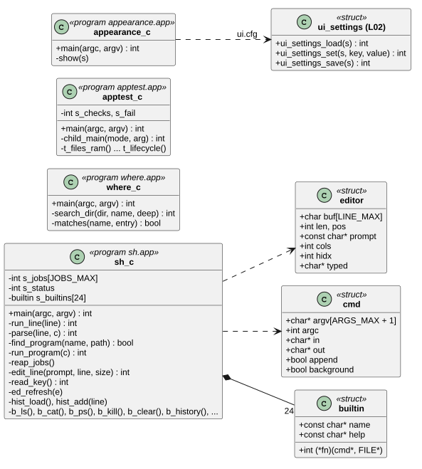
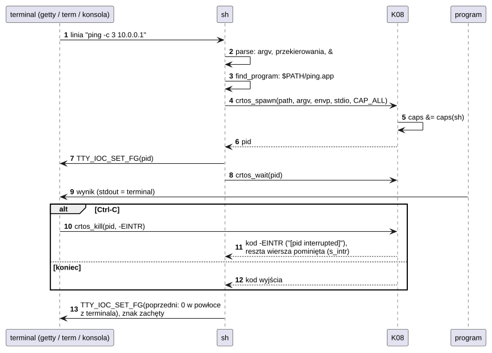
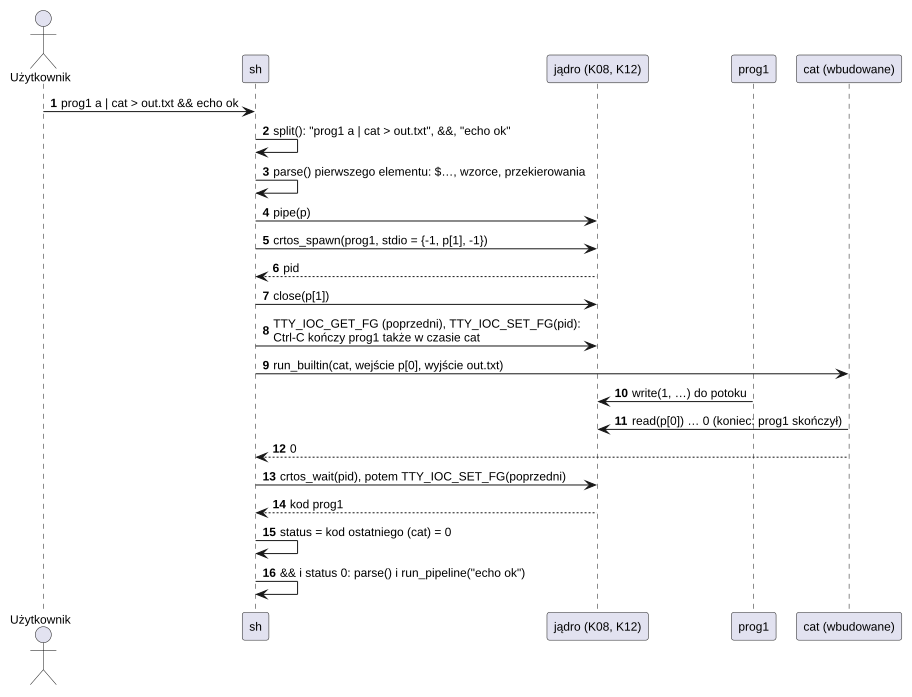
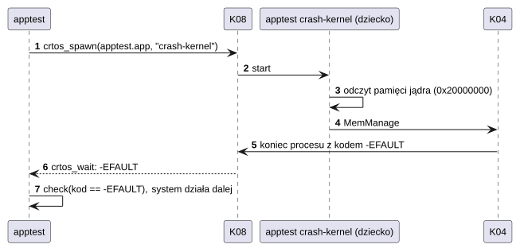
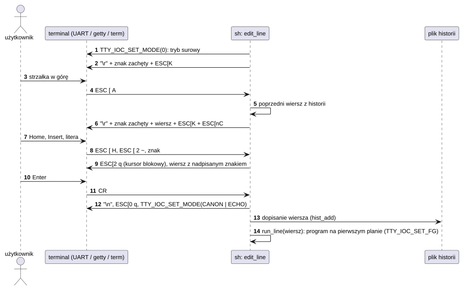
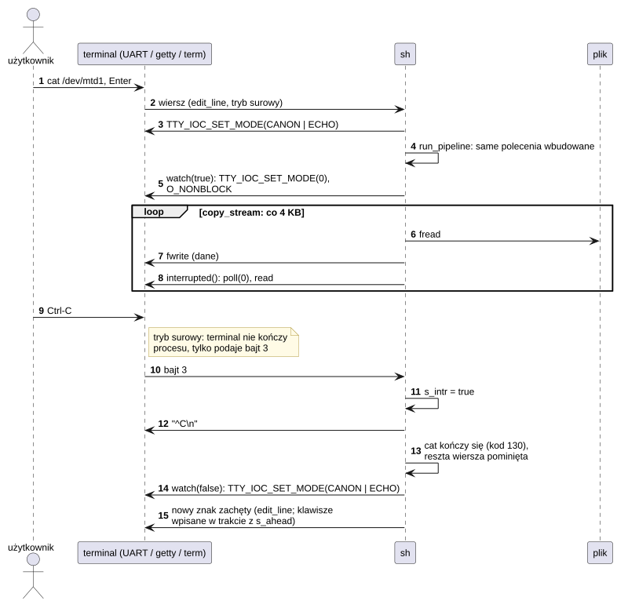

# A03 Programy konsolowe

## 1. Identyfikacja

| | |
|---|---|
| Identyfikator | A03 |
| Warstwa | L3 (programy `.app` w `/sd/crtos/bin/`, bez okna) |
| Pliki | system bazowy: `system/commands/<nazwa>/` (`sh`, `where`, `edit`, `make`, `crtos-app`, `ping`, `ifconfig`, `nc`, `appearance`, `audio`, `spi`, `uart`, `mtd`, `flashfs`, `evtest`, `gfxinfo`); testy: `tests/<nazwa>/` (`apptest`, `heaptest`, `xiptest`, `bench`, `gfxtap`, `nettest`); przykład `examples/hello/`; `make` ze źródeł pdpmake (`third_party/pdpmake`, domena publiczna) |
| Uruchamiane | powłoka `sh` (konsola szeregowa, `getty`, `term`), `crtos run` (T01), `sh -c` |

| Program | Opis | Uprawnienia potrzebne |
|---|---|---|
| `sh` | powłoka: polecenia wbudowane, programy, potoki `\|`, listy `;` `&&` `\|\|` `&`, zmienne, przekierowania, wzorce nazw plików, skrypty, Ctrl-C; na terminalu edycja wiersza (kursor, Insert, skróty) i historia poleceń (`$HOME/.sh_history`), `clear`, `history` | – (przekazuje swoje) |
| `where` | każde miejsce w `$PATH`, z którego może się uruchomić program o nazwie (także wzorzec `* ? [...]`, jak `where` Windows); `-r KATALOG`: pliki o tej nazwie w katalogu i niżej; `-t` rozmiar i czas, `-q` tylko kod wyjścia | – |
| `apptest` | testy interfejsu programów (13 grup, kod wyjścia = liczba błędów) | `spawn`, `kill` |
| `apptest_xip` | ten sam `apptest` zbudowany jako program XIP (`/flash0/bin`, kod z flasha, K16) | `spawn`, `kill` |
| `xiptest` | sprawdzenia programu XIP (`/flash0/bin`): adres kodu, konstruktory z priorytetem, tablice wskaźników, funkcje wirtualne, bss, sterta, `printf` z `%lld`, drugi wątek (r9); `xiptest crash` – zapis pod NULL | – |
| `heaptest` | sprawdzenia `libcrtosheap` (L01), programu XIP w `/flash0/bin` jak kompilator: interfejs `malloc`, 60 000 losowych operacji z weryfikacją zawartości i spójności sterty, wzrost ponad arenę w okna pamięci współdzielonej, obiekt shm z kilku regionów MPU (K11), pamięć emulowana (K20: instrukcje, przemiatanie, wywołania systemowe, dwa wątki, `malloc` ponad SDRAM; `heaptest vmem`: tylko to); kod wyjścia = liczba błędów | – |
| `appearance` | ustawienia wyglądu z linii poleceń (to, co zmieniają strony Wygląd i Tapeta w Settings): bez argumentów pokazuje, `KLUCZ WARTOŚĆ...` zmienia, zapisuje `ui.cfg` i ogłasza zmianę (`gfx_settings_changed`); używa go `crtos wallpaper` (T01) | – |
| `audio` | wyjście dźwięku `/dev/audio`: stan, głośność, ton próbny, pliki WAV (16-bit PCM) | – |
| `bench` | pomiary: wywołania systemowe, przełączanie wątków i procesów, IPC, pamięć, odczyt SD, start programu | `spawn` |
| `crtos-app` | nagłówek programu (stos, sterta), jego pamięć i kontrola według reguł loadera: `info`, `set`, `check` (to samo źródło co narzędzie toolchainu, T02) | – |
| `edit` | pełnoekranowy edytor tekstu dla terminali (VT100): zapis, szukanie, skok do linii, wycinanie i wklejanie linii | – |
| `make` | POSIX make (pdpmake): reguły, makra, reguły z przyrostkami i wzorcami, `include`; polecenia przez `system()` (`sh -c`) | `spawn` |
| `evtest` | zdarzenia urządzenia wejścia (`/dev/eventN`) | `dev` |
| `flashfs` | system plików `/flash0` (D10): `info`, `ls` (miejsce plików we flash), `check` (CRC danych), `format yes` | `dev` (`format`: także `sys`) |
| `gfxinfo` | stan grafiki (`devmgr`, klienci i okna `gfxd`, czasy składania), `-w` okno testowe, `-b` pomiar fps | – |
| `gfxtap` | syntetyczne dotknięcia, przeciągnięcia, dwa palce naraz (`hold`), mysz (`mclick`, `mdrag`, `wheel`, `hover`: ruch bez przycisku), klawisze i ich kombinacje (`key 29+46`), pisanie tekstu (`type`) i gałki pada (`GFX_INPUT`) | – |
| `hello` | najmniejszy program (argumenty, stdio, sterta, kod wyjścia) | – |
| `ifconfig` | interfejsy sieciowe i DNS; zmiany | `sys` (zmiany) |
| `mtd` | partycje flash: info, dump, read, erase, write, test, kernel | `dev` |
| `nc` | TCP/UDP z linii poleceń (klient i serwer, echo) | – |
| `nettest` | serwer testów przepustowości sieci dla `crtos netbench` (T01): TCP i UDP w obie strony | – |
| `ping` | ICMP echo (gniazdo surowe) | – |
| `spi` | jedna wiadomość SPI przez `/dev/spidev*`, pętla zwrotna, tryb polecenie + odczyt | `dev` |
| `uart` | port szeregowy `/dev/ttyS*`: wysłanie tekstu, nasłuch, pętla wewnętrzna | `dev` |

Po `crtos toolchain install` w `/flash0/bin` są też GCC i binutils na płytkę (`gcc`, `g++`,
`cpp`, `ar`, `nm`, …); to nie są programy tego komponentu, opisuje je T02.

## 2. Odpowiedzialność

- `sh`: interakcja z użytkownikiem na terminalu (szeregowym, USB, graficznym) z edycją
  wiersza i historią, jednakowo na każdym terminalu (edycję robi powłoka w trybie surowym
  terminala, nie terminal); skrypty;
  potoki i listy poleceń; zarządzanie zadaniami w tle; ustawianie procesu pierwszoplanowego
  terminala (`TTY_IOC_SET_FG`), żeby Ctrl-C trafiało do właściwego procesu, a w czasie
  polecenia wbudowanego – do samej powłoki (przerwanie polecenia i reszty wiersza); domyślne
  zmienne `PATH`, `HOME`, `TMPDIR`, `SHELL`, gdy powłoka dostała puste środowisko.
- `edit`: edycja plików tekstowych na płytce (źródła programów, konfiguracja) bez komputera.
- `make`: budowanie według pliku `Makefile` na płytce (z natywnym kompilatorem, T02).
- Pozostałe: narzędzia diagnostyczne i testowe dla każdego podsystemu (sieć, grafika,
  wejście, magistrale, flash) oraz testy i pomiary całego interfejsu programów
  (`apptest`, `bench`).

## 3. Wymagania

| ID | Wymaganie | Weryfikacja |
|---|---|---|
| REQ-A03-01 | `sh` uruchamia program z `$PATH` jako `<katalog>/<nazwa>.app`, potem `<katalog>/<nazwa>`; plik, który nie jest programem ELF, wykonuje jako skrypt powłoki; kod wyjścia 127 – nie znaleziono, 126 – nie uruchomiono. | `shtest.sh` (sprawdzenia 12, 16), test ręczny |
| REQ-A03-02 | Ostatni uruchomiony program potoku na pierwszym planie jest zgłaszany terminalowi (`TTY_IOC_SET_FG`) od chwili uruchomienia programów – także na czas poleceń wbudowanych tego potoku – do ich końca; potem terminal wraca do poprzedniego procesu pierwszoplanowego (w skrypcie: do powłoki skryptu, więc Ctrl-C kończy skrypt). | przegląd kodu, Ctrl-C w `getty` i `term`; test na rurach terminalowych 03.10.2026 (`cat /dev/zero \| sh -c …`, skrypt po programie) |
| REQ-A03-03 | `sh` prosi o `CAP_ALL` dla programów, a jądro przycina uprawnienia do uprawnień powłoki. | przegląd kodu (K08) |
| REQ-A03-04 | `apptest` zwraca liczbę nieudanych sprawdzeń (0 = wszystko działa). | `crtos run apptest` (1762 sprawdzenia, 0 błędów) |
| REQ-A03-05 | `mtd test` przywraca poprzednią zawartość sprawdzanego bloku; zapis na partycję tylko do odczytu odrzuca sterownik (`-EROFS`, D07). | przegląd kodu, test na partycji danych |
| REQ-A03-06 | `sh` rozwija słowa potoku (`$…`, wzorce nazw) dopiero przed jego uruchomieniem; potok po `&&` działa tylko po sukcesie ostatnio wykonanego, po `\|\|` tylko po błędzie; `set -e` kończy skrypt na pierwszym błędzie. | `shtest.sh` (20 sprawdzeń) |
| REQ-A03-07 | `edit` zapisuje do `PLIK.tmp` i dopiero po udanym zapisie zastępuje nim plik; błąd zapisu zostawia plik bez zmian; wyjście z niezapisanymi zmianami wymaga drugiego Ctrl-Q. | przegląd kodu, test przez konsolę szeregową |
| REQ-A03-08 | `make` przebudowuje cel, którego czas jest starszy niż czas którejś zależności (równe czasy: aktualny, bo FAT zapisuje czas co 2 s). | `maketest.sh` |
| REQ-A03-09 | `sh` na terminalu (wejście i wyjście terminalowe) edytuje wiersz poleceń w trybie surowym terminala i przed wykonaniem polecenia przywraca tryb kanoniczny z echem; Ctrl-C porzuca wiersz bez wykonania, Insert przełącza wstawianie i nadpisywanie (kursor blokowy `ESC[2 q`, na koniec `ESC[0 q`), strzałki w górę i w dół pokazują wcześniejsze wiersze; niepusty wiersz różny od poprzedniego trafia do historii (200 w pamięci) i jest dopisywany do `$HISTFILE` albo `$HOME/.sh_history`. Wejście, które nie jest terminalem (skrypt, potok), czyta się jak dotąd. | konsola szeregowa i USB (pyserial, 30.09.2026: historia, Home, Insert, Ctrl-C), `term` (zrzuty), `shtest.sh` 20/20 |
| REQ-A03-10 | `where` wypisuje wszystkie pasujące pliki w kolejności, w jakiej szuka ich powłoka (katalogi `$PATH`, w każdym `nazwa.app` przed `nazwa`), a z `-r` wszystkie pliki o pasującej nazwie w drzewie katalogu; kod wyjścia 0 – każda nazwa znaleziona, 1 – nie, 2 – złe użycie. | `where gcc g++ cc1`, `where -t 'ed*' g++`, `where -r /sd/crtos/etc '*.cfg'`, `where -q nothere` (kod 1) (30.09.2026) |
| REQ-A03-11 | `nettest` tylko liczy odebrane dane i wysyła stały bufor (test sieci i stosu, nie pamięci ani karty); czas liczy od pierwszego odebranego bajtu (przy wysyłaniu od startu) do ostatniego; z `-n N` kończy się po N testach (połączenie bez zapytania testu się nie liczy), z `-t S` po S sekundach bez klienta; połączenie zamyka dopiero po przeczytaniu wszystkiego, co przysłał klient (inaczej RST i utracona odpowiedź). | `crtos netbench` (02.10.2026) |
| REQ-A03-12 | `appearance` zmienia ustawienia tylko wtedy, gdy wszystkie pary `KLUCZ WARTOŚĆ` są poprawne (nieznany klucz albo dopasowanie: kod 2, plik bez zmian); wartości liczbowe przycina jak L02. Po zapisie ogłasza zmianę gfxd; gdy gfxd nie działa, zostawia zapisany plik i kończy się kodem 0 (zmiana obowiązuje od następnego startu gfxd). Nieudany zapis: kod 1. | na płytce przez `crtos kmon "run -w …"` (03.10.2026): skale, rodziny, przezroczystość, krycie, zaokrąglenia, akcent, tapety; `crtos wallpaper`; przegląd kodu |
| REQ-A03-13 | Na terminalu z edycją wiersza Ctrl-C przerywa także polecenie wbudowane (`cat`, `cp`, `ls`, `rm -r`, `sleep`, `wait`, `.`): na czas polecenia wbudowanego, gdy potok nie ma programów, terminal jest surowy, a polecenie sprawdza wejście co porcję pracy (najwyżej co 4 KB danych, wpis katalogu albo 50 ms). Przerwane polecenie kończy się kodem 130 i `^C`; reszta wiersza (`;`, `&&`, `\|\|`) i skryptu `.` jest pomijana, tak samo po programie zakończonym przez Ctrl-C. `cp` usuwa niedokończoną kopię, `wait` przestaje czekać, ale nie kończy programów w tle. Klawisze wpisane w trakcie trafiają do następnego wiersza poleceń. `cat` bez plików czyta terminal w trybie kanonicznym jak dotąd. | test na rurach terminalowych (jak `getty`) 03.10.2026: 17 sprawdzeń – `sleep 30` (40 ms do znaku zachęty), `cat /dev/zero` (9 ms), kod 130, `ls`, klawisze wpisane w trakcie `sleep`, program, wbudowane \| program, `wait`, `. skrypt`, `sh skrypt`; `shtest.sh` 20/20, `maketest.sh`, `apptest` 1762/0 |

## 4. Interfejs udostępniany

Linie poleceń: opis w komentarzu na początku każdego pliku, pomoc po uruchomieniu bez
argumentów; wybrane w [Debugowanie](../../debugowanie.md#inne-narzędzia),
[Sterowniki](../../sterowniki.md) i [Powłoka, edytor i make](../../powloka.md). Polecenia
wbudowane `sh`: `help cd pwd ls cat echo mkdir rm mv cp touch ps kill free df uptime sleep
date time jobs wait export unset env set test [ true false which clear history . source insmod
rmmod reboot exit` (`which` nazywa też polecenia wbudowane). Edycja wiersza: strzałki
(Ctrl-B/F), Ctrl+strzałki (słowo), Home/End (Ctrl-A/E), Backspace, Delete, Insert, strzałki
w górę/dół (Ctrl-P/N), PgUp/PgDn, Ctrl-K/U/W (wycinanie), Ctrl-L, Ctrl-C, Ctrl-D (pusty
wiersz: nowy znak zachęty).

`nettest [-p port] [-n testy] [-t sekundy]` (port 5001): klient wysyła 12 bajtów zapytania
(`NTST`, test, sekundy, port UDP); testy `R` (TCP do płytki; odpowiedź `rx 0 BAJTY US`), `S`
(TCP z płytki przez podane sekundy), `U` (datagramy UDP do płytki od `ready` do `end`;
odpowiedź `udp PAKIETY BAJTY US`), `V` (datagramy 1472 B z płytki na podany port klienta, z
portu testu – zapora klienta przepuszcza odpowiedź na jego datagram; `udp-sent …`).

`appearance [KLUCZ WARTOŚĆ]...`: klucze `scale` (100 125 150 175 200), `font` (rodzina
z `/sd/crtos/share/fonts/families.txt`), `accent` (RRGGBB), `transparency` (on/off),
`opacity` (30–100), `rounded` (on/off), `wallpaper` (nazwa wbudowanej, `color:RRGGBB` albo
plik), `fit` (fill fit stretch center tile); format pliku `ui.cfg` opisuje L02.

`bench` wypisuje wiersze `bench: NAZWA WARTOŚĆ JEDNOSTKA opis` (zbiera je `crtos bench`);
`apptest` – `[grupa]`, `-> ok|FAILED` i podsumowanie `apptest: N checks, M failed`.

## 5. Interfejsy wymagane

L01 (newlib, POSIX, gniazda, `crtos_*`), K13/S0x (urządzenia `/dev/*`), U02 (`gfxinfo`:
port `devmgr`), U03 (`gfxinfo`, `gfxtap`, `appearance`: port `gfx`), L02 (`appearance`:
`ui_settings_*`, `gfx_settings_changed`), K16 (`insmod`, `rmmod`).

## 6. Struktura statyczna

*Źródło: [A03/struktura-statyczna.puml](../diagramy/A03/struktura-statyczna.puml)*

## 7. Zachowanie dynamiczne

### 7.1 Uruchomienie programu z powłoki

*Źródło: [A03/uruchomienie-programu.puml](../diagramy/A03/uruchomienie-programu.puml)*

### 7.2 Potok i lista poleceń w sh

*Źródło: [A03/potok-i-lista.puml](../diagramy/A03/potok-i-lista.puml)*

### 7.3 apptest: sprawdzenie ochrony pamięci

*Źródło: [A03/apptest-ochrona.puml](../diagramy/A03/apptest-ochrona.puml)*

### 7.4 Edycja wiersza poleceń i historia

*Źródło: [A03/edycja-wiersza.puml](../diagramy/A03/edycja-wiersza.puml)*

### 7.5 Ctrl-C w czasie polecenia wbudowanego

*Źródło: [A03/ctrl-c-polecenia-wbudowanego.puml](../diagramy/A03/ctrl-c-polecenia-wbudowanego.puml)*

## 8. Implementacja

- `sh`: linia do `LINE_MAX` (1024) znaków, najwyżej 63 argumenty (limit jądra) i 16 poleceń
  w linii.
  - `run_line` dzieli linię na elementy list (`;` `&&` `||` `&` poza cudzysłowami).
  - Każdy element `parse` rozkłada dopiero przed wykonaniem: słowa, `$…` (bez cudzysłowu dzielone
    na spacjach), wzorce (`*` `?` `[…]` w ostatniej części ścieżki, posortowane), przypisania
    i przekierowania (`<` `>` `>>` `n>` `n>>` `n>&m`).
  - Potok: najpierw startują programy (`crtos_spawn` z końcami potoków jako 0/1/2), potem
    wbudowane polecenia wykonują się w powłoce (wejście i wyjście z końców potoku), na końcu
    powłoka czeka na programy. Kod wyjścia potoku to kod ostatniego polecenia.
  - Skrypty: `sh plik args`, `.`/`source`, uruchomienie pliku nie-ELF; `$0..$9 $# $@`;
    `set -e`, `set -x`; `sh -c` łączy słowa w jedną linię.
  - Zmienne powłoki są zmiennymi środowiska. `VAR=x polecenie` zmienia środowisko tylko
    tego polecenia.
  - Zakończone zadania w tle są odbierane przed każdym znakiem zachęty. Koniec pliku przy
    wejściu, które nie jest terminalem, kończy powłokę.
  - Edycja wiersza (`edit_line`, gdy wejście i wyjście to terminal): tryb surowy
    (`TTY_IOC_SET_MODE 0`), znaki czytane po jednym (`read`), sekwencje `ESC [ ...` i
    `ESC O ...` z parametrami (xterm: `;5` – Ctrl), samotny Esc rozpoznany po 50 ms ciszy.
    Po każdym klawiszu wiersz jest rysowany od nowa: `\r`, znak zachęty, widoczna część
    wiersza (przewinięta w bok tak, żeby kursor był widoczny), `ESC[K`, kursor na miejsce
    (`ESC[nC`); szerokość z `TTY_IOC_GET_SIZE`. Wynik zapisu do terminala jest sprawdzany:
    zamknięte okno kończy powłokę. Historia: 200 wierszy w pamięci, plik dopisywany po
    każdym poleceniu, przy wczytaniu ponad 400 wierszy przepisywany do ostatnich 200.
  - Ctrl-C w poleceniach wbudowanych: terminal kończy na Ctrl-C tylko proces z
    `TTY_IOC_SET_FG`, a polecenie wbudowane wykonuje sama powłoka. `run_builtin` włącza więc
    `watch(true)` (tryb surowy bez echa, `O_NONBLOCK` na wejściu, bo konsola może zgłaszać
    gotowość dla wiersza wpisanego wcześniej), gdy powłoka edytuje wiersze, potok nie ma
    programów, a polecenie nie czyta terminala (`cat` bez plików). Każdy terminal (konsola
    jądra, `getty`, `term`) w trybie surowym podaje Ctrl-C jako bajt 3. `interrupted()` czyta
    wtedy oczekujące bajty (`poll` z czasem 0): bajt 3 ustawia `s_intr` i wypisuje `^C`,
    inne trafiają do `s_ahead` (64 B), które `read_byte` oddaje edycji następnego wiersza.
    Sprawdzają `copy_stream` (po każdych 4 KB, `cat`, `cp`), pętle `ls`, `rm` (`remove_tree`)
    i plików `cat`/`cp`, `sleep` (`nap`: kawałki po 50 ms) i `wait` (`crtos_wait` po 100 ms).
  - `s_intr` zatrzymuje `run_line` (następne elementy listy) i `run_file`; ustawia go też
    `wait_for`, gdy program skończył się kodem `-EINTR` (Ctrl-C z terminala albo `kill`).
    Zerowany przed każdym wierszem z terminala.
  - Potok z programami: `watch(false)` przed ich uruchomieniem, `TTY_IOC_SET_FG` ostatniego
    programu przed poleceniami wbudowanymi potoku (Ctrl-C kończy program, a polecenie
    wbudowane dostaje koniec potoku albo `EPIPE`), po końcu poprzednia wartość
    (`TTY_IOC_GET_FG`) zamiast 0.
- `where`: dla zwykłej nazwy `stat` na `katalog/nazwa.app` i `katalog/nazwa` w kolejnych
  katalogach `$PATH`; dla wzorca albo `-r` odczyt katalogu, sortowanie i `fnmatch` (nazwa
  z `.app` i bez).
- `edit`: tryb surowy terminala (`TTY_IOC_SET_MODE 0`), rozmiar z `TTY_IOC_GET_SIZE`
  (albo `COLUMNS`/`LINES`, domyślnie 80×24), ekran rysowany sekwencjami VT100 (pozycja
  kursora, `ESC[K`, kolory). Tekst jako tablica linii w pamięci (sterta 1 MB). Klawisze
  specjalne z sekwencji `ESC[…`/`ESC O…` (resztę sekwencji czeka 60 ms).
- `make`: pdpmake bez zmian poza trzema oznaczonymi `CRTOS` (`patches/pdpmake.patch`, opis
  w `patches/README.md`): `CC=gcc`, powłoka z `$SHELL`, równe czasy plików oznaczają aktualny
  cel.
- `appearance`: `ui_settings_load`, `ui_settings_set` dla każdej pary (pierwszy błąd kończy
  bez zapisu), `ui_settings_save`, `gfx_open` + `gfx_settings_changed` + `gfx_close`.
  Linia kmon ma najwyżej 16 słów (`ARGS_MAX`, K19), a `run -w PROGRAM` zajmuje 3, więc
  wiele zmian przez kmon dzieli się na kilka wywołań.
- `apptest`: uruchamia swoje kopie w trybach `server`, `spin`, `exit <n>`,
  `crash-kernel`, `crash-null`, `crash-stack`, `noperm` do testów wieloprocesowych.
- `bench`: każdy wynik to czas wielu powtórzeń operacji (`crtos_time_us`) podzielony
  przez ich liczbę (ns na operację) albo przepustowość (MB/s); pamięć mierzona na
  blokach 16 KB (w pamięci podręcznej) i 256 KB (poza nią).

## 9. Obsługa błędów i mechanizmy bezpieczeństwa

| Sytuacja | Reakcja |
|---|---|
| nieznane polecenie | `not found` (na stderr), kod 127 |
| błąd składni (brak `'`, `"`, pliku przekierowania, polecenia po `\|`) | `sh: …`, kod 2, linia nie jest wykonywana |
| `edit`: brak pamięci | komunikat, koniec programu bez zapisu (plik bez zmian) |
| `edit`: nieudany zapis | komunikat, `PLIK.tmp` usunięty, plik bez zmian |
| błąd uruchomienia | komunikat z `strerror`, kod 126 |
| program zakończony błędem pamięci | `[pid ended by a memory fault]` |
| nikt nie czyta wyjścia (okno terminala zamknięte) | `sh` kończy się |
| koniec wejścia terminala w edycji wiersza (terminal zamknięty) | `sh` kończy się |
| brak pliku historii / nieudany zapis | historia tylko w pamięci |
| Ctrl-C w poleceniu wbudowanym | polecenie przerwane (kod 130, `^C`), reszta wiersza pominięta; `cp`: niedokończona kopia usunięta |
| brak uprawnień (`dev`, `sys`) | `EPERM` z jądra |

## 10. Konfiguracja

`$PATH` (domyślnie `/flash0/bin:/sd/crtos/bin:/sd/crtos/apps`), `HOME`, `HISTFILE`
(historia, domyślnie `$HOME/.sh_history`), `HIST_MAX` (200) w `sh.c`, `TMPDIR` (`/ram`),
`SHELL`, `TZ` (z `/sd/crtos/etc/timezone` – `date`, `ls -l`); `JOBS_MAX`, `WORDS_MAX`,
`LINE_MAX`, `CMDS_MAX` w `sh.c`; `edit`: `COLUMNS`, `LINES`; `make`: `MAKEFLAGS`, `SHELL`.

## 11. Weryfikacja

- `crtos run apptest` – 13 grup: pliki na `/ram` i `/sd`, katalogi, błędy i uprawnienia,
  sterta, wątki i muteksy, futex, wątki POSIX, IPC w procesie, IPC/shm/poll między
  procesami, ochrona pamięci, procesy POSIX, ścieżki i pliki tymczasowe, cykl życia procesu
  (wynik: [04 Weryfikacja](../04-weryfikacja.md)).
- `sh /sd/crtos/share/sh/shtest.sh` (20 sprawdzeń powłoki), `sh
  /sd/crtos/share/make/maketest.sh` (`make`: budowa, „nothing to be done”, przebudowa po
  `touch`, `clean`); `edit` przez konsolę szeregową: pisanie, strzałki, Home/End, wycinanie,
  wklejanie, PgUp, Del, zapis (29.09.2026).
- `crtos run /flash0/bin/heaptest.app` (72 216 sprawdzeń, 30.09.2026).
- Edycja wiersza i historia (30.09.2026): konsola szeregowa i USB CDC (skrypty pyserial:
  historia, Home, Insert z `ESC[2 q`/`ESC[0 q`, End, Ctrl-C porzuca wiersz), `term` przez
  `gfxtap` (zrzuty); `where` (wzorce, `-t`, `-r`, `-q`), `which` (polecenia wbudowane),
  `clear`, `history`.
- `gfxtap hover X Y [X1 Y1 [kroki]]` (30.09.2026): podpowiedzi paska zadań `wm` i zaznaczenie
  pozycji menu pod kursorem (zrzuty).
- `crtos bench` (porównanie z zapisanym wynikiem), testy sieci (`ping`, `nc`), `spi -l`,
  `uart -l`, `mtd test`.
- `nettest` przez `crtos netbench` (02.10.2026): cztery testy po 10 s, wyniki w D05.
- Ctrl-C w powłoce (03.10.2026): program testowy uruchamiał `sh` na dwóch rurach
  terminalowych jak `getty` i wysyłał Ctrl-C tak jak `getty` (tryb kanoniczny: koniec procesu
  pierwszoplanowego, surowy: bajt 3); 17 sprawdzeń bez błędu (REQ-A03-13); potem `shtest.sh`,
  `maketest.sh` i `apptest` bez błędów.
- `appearance` (03.10.2026): ponad 20 zmian przez `crtos kmon "run -w /sd/crtos/bin/appearance.app …"`
  z kontrolą zrzutami `crtos desktop --shot`, błędny klucz (kod 2, plik bez zmian), na koniec
  przywrócone ustawienia użytkownika.

## 12. Ograniczenia i znane problemy

- `sh` nie ma instrukcji sterujących (`if`, `for`, `while`, `case`), funkcji ani podstawiania
  poleceń (`$(…)`, `` `…` ``); wzorce nazw działają tylko w ostatniej części ścieżki.
- Edycja wiersza: bez uzupełniania tabulatorem i bez wyszukiwania w historii (Ctrl-R);
  wiersz rysowany jest od nowa po każdym klawiszu (ok. 40 bajtów – na 1 Mbit/s bez
  znaczenia); wiele powłok dopisuje do jednego pliku historii (kolejność jak wpisywano).
- Dwa polecenia wbudowane połączone potokiem wykonują się po kolei w powłoce: więcej niż 4 KB
  (bufor potoku) między nimi zablokowałoby powłokę.
- Ctrl-C przerywa polecenie wbudowane tylko na terminalu z edycją wiersza i tylko między
  porcjami pracy: zapis, który czeka na terminal (np. `cat` dużego pliku na konsolę 1 Mbit/s),
  kończy najpierw bieżące 4 KB, a dane już przekazane terminalowi wypisują się do końca.
  Polecenia wbudowane w skrypcie `sh plik` przerywa koniec procesu skryptu (jest na pierwszym
  planie), nie samo polecenie. Klawisze wpisane w czasie polecenia wbudowanego nie mają echa
  aż do następnego znaku zachęty (ponad 64 znaki przepadają).
- `edit`: bez cofania zmian i bez UTF-8 (bajty spoza ASCII są pokazywane tak, jak wypisze je
  terminal); cały plik w pamięci (sterta 1 MB).
- `make`: czas pliku co 2 s (FAT) – zmiana źródła w ciągu ok. 2 s po zbudowaniu celu może
  zostać przeoczona (pomaga `touch` źródła).
- `sh` na konsoli szeregowej jest uruchamiany z `caps=all` – dostęp do konsoli oznacza
  pełne uprawnienia.
