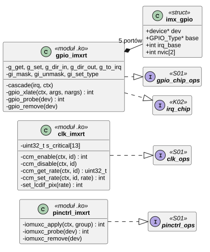
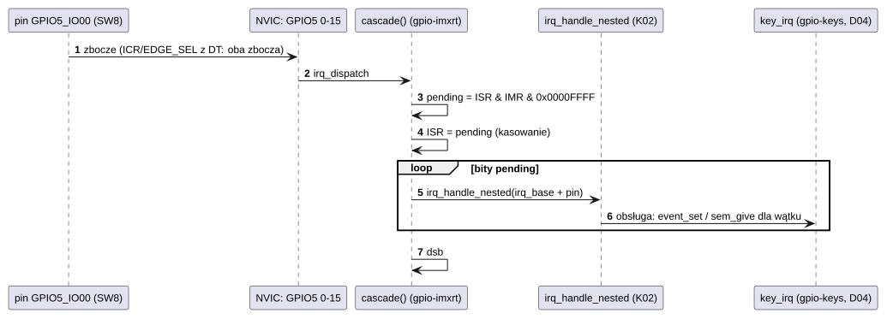

# D01 Sterowniki platformy: piny, zegary, GPIO

## 1. Identyfikacja

| | |
|---|---|
| Identyfikator | D01 |
| Warstwa | L1 (moduły `.ko`) |
| Moduły | `pinctrl-imxrt.ko` (`fsl,imxrt1050-iomuxc`), `clk-imxrt.ko` (`fsl,imxrt1050-ccm`), `gpio-imxrt.ko` (`fsl,imxrt1050-gpio`) |
| Pliki | `drivers/imxrt/pinctrl-imxrt.c`, `clk-imxrt.c`, `gpio-imxrt.c`; stałe DT: `dts/include/dt-bindings/clock/imxrt1050-clock.h`, `dts/include/imxrt1050-pinfunc.h` |
| Interfejsy realizowane | `pinctrl_ops`, `clk_ops`, `gpio_chip_ops`, `irq_chip`, domena przerwań (S01, K02) |

## 2. Odpowiedzialność

- **pinctrl-imxrt**: konfiguracja padów IOMUXC z grup `fsl,pins` (multiplekser, wybór
  wejścia „daisy”, konfiguracja padu).
- **clk-imxrt**: bramki zegarów CCGR i korzenie zegarów (UART, LPI2C, LPSPI, USDHC, LCDIF,
  ENET, SAI1), obliczanie częstotliwości, ustawianie wybranych korzeni (np. zegar pikseli LCD
  z PLL wideo), ochrona zegarów, z których korzysta jądro.
- **gpio-imxrt**: porty GPIO1–GPIO5 (32 piny każdy), odczyt/zapis/kierunek, przerwania
  pinów jako drugorzędny kontroler przerwań (dwie linie NVIC na port → 32 numery
  wirtualne), tłumaczenie `<&gpioN pin typ>` z DT.

## 3. Wymagania

| ID | Wymaganie | Weryfikacja |
|---|---|---|
| REQ-D01-01 | Bramki zegarów urządzeń używanych przez jądro (konsola LPUART1, USDHC1, IOMUXC, GPIO1–5, SEMC, OCRAM, FlexSPI, DMA) nigdy nie są wyłączane przez `clk_disable`. | przegląd kodu |
| REQ-D01-02 | Zmiana korzenia zegara UART (wspólnego z konsolą) jest odrzucana (`-EBUSY`), chyba że nie zmienia częstotliwości. | przegląd kodu |
| REQ-D01-03 | Grupa pinów z `fsl,pins` o długości niepodzielnej przez 24 B jest odrzucana (`-EINVAL`), zanim cokolwiek zostanie zapisane. | przegląd kodu |
| REQ-D01-04 | Zbocze przerwania pinu zapamiętane, gdy linia była zamaskowana, jest kasowane przy odmaskowaniu. | przegląd kodu, SW8 (`evtest`) |
| REQ-D01-05 | Obsługa kaskady kasuje flagi przed wywołaniem obsług pinów (nowe zbocza w trakcie nie giną). | przegląd kodu |
| REQ-D01-06 | Zegar pikseli ma zadaną częstotliwość także przy kolejnych zmianach: przed nowym dzielnikiem post PLL wideo stary jest kasowany (przy obejściu PLL), bo `CLOCK_InitVideoPll` z SDK nakłada nowy na stary. | `kmon fb` + `fbtest` (02.10.2026): 10 zmian 480×272 ↔ 800×480, 58,7 i 59,1 Hz; przed poprawką druga zmiana dała 18,6 MHz zamiast 9,3 MHz (117 Hz) |

## 4. Interfejs udostępniany

Brak funkcji wołanych bezpośrednio; moduły rejestrują się we frameworkach S01 i K02:

| Moduł | Rejestracja | Operacje |
|---|---|---|
| `pinctrl-imxrt` | `pinctrl_register(węzeł IOMUXC)` | `apply(grupa)`: dla każdego 6-komórkowego wpisu: `MUX = tryb (+ SION z bitu 30 konfiguracji)`, `daisy = wartość` (jeśli jest rejestr), `PAD = konfiguracja` (chyba że bit 31 „nie zmieniaj”) |
| `clk-imxrt` | `clk_provider_register(węzeł CCM)` | `enable`: bramka `CLOCK_EnableClock` (id < `0x1000`) albo PLL ENET 50 MHz; `disable`: bramka poza listą krytycznych; `get_rate`: CPU, AHB, IPG, PER, SEMC, UART, LPI2C, LPSPI, USDHC1, LCDIF, ENET; `set_rate`: LCDIF (pełne przeszukanie PLL wideo), LPI2C, LPSPI, UART (tylko bez zmiany) |
| `gpio-imxrt` | `gpiochip_register`, `irq_alloc_descs(32)`, `irq_domain_add`, `irq_request` × 2 (priorytet 8) | `get` (DR dla wyjść, PSR dla wejść), `set` (DR_SET/DR_CLEAR), kierunek (GDIR pod `irq_lock`), `to_irq`, `mask`/`unmask` (IMR), `set_type` (ICR1/2, EDGE_SEL) |

## 5. Interfejsy wymagane

S01, K02 (`irq_request`, `irq_alloc_descs`, `irq_handle_nested`, `irq_domain_add`), K17
(`device_map`, `device_get_irq`, `devm_*`), NXP SDK `fsl_clock` (w obrazie jądra,
eksportowany przez `ksyms`).

## 6. Struktura statyczna

*Źródło: [D01/struktura-statyczna.puml](../diagramy/D01/struktura-statyczna.puml)*

## 7. Zachowanie dynamiczne

*Źródło: [D01/przerwanie-pinu-gpio.puml](../diagramy/D01/przerwanie-pinu-gpio.puml)*

## 8. Implementacja

- Wszystkie trzy moduły wiążą się z węzłami `dts/imxrt1052.dtsi`; drzewo płytki
  (`evkbimxrt1050.dts`) opisuje grupy pinów urządzeń.
- `pinctrl-imxrt` zapisuje adresy rejestrów wprost z DT (tak jak makra SDK `IOMUXC_*`),
  generowane do `dts/include/imxrt1050-pinfunc.h` narzędziem `tools/gen_pinfunc.py`.
- `clk-imxrt`: identyfikatory < `0x1000` to bramki w kodowaniu `clock_ip_name_t` SDK;
  ≥ `0x1000` to korzenie (tylko częstotliwość, włączenie nic nie robi, poza ENET_REF).
  Zegar pikseli: przegląd pętli PLL wideo 27–54, dzielników post (1–16), pre (1–8)
  i LCDIF (1–8) – najmniejszy błąd. Przed `CLOCK_InitVideoPll` PLL jest obchodzony,
  a pole `POST_DIV_SELECT` kasowane: SDK łączy nowy dzielnik ze starym bitowym OR (z /1 na /2
  dawało wartość 3, czyli /1, i dwa razy szybszy zegar). Zegar dźwięku (`SAI1_ROOT`, D09): PLL audio na 64-krotność
  żądanej częstotliwości (10–20 MHz), podzielona przez 4 i 16.
- `gpio-imxrt`: kierunek zmieniany pod `irq_lock` (odczyt-modyfikacja-zapis GDIR),
  wartości przez rejestry ustaw/kasuj (atomowe).

## 9. Obsługa błędów i mechanizmy bezpieczeństwa

| Sytuacja | Reakcja |
|---|---|
| zła długość `fsl,pins` | `-EINVAL` |
| zegar CCM niedostępny przy `probe` pinów/GPIO | `-EPROBE_DEFER` |
| wyłączenie zegara krytycznego | pominięte |
| zmiana zegara UART | `-EBUSY` |
| ponowna zmiana zegara pikseli | stary dzielnik post skasowany przed nowym (REQ-D01-06) |
| brak linii przerwania portu | `-EBUSY`, zwolnienie numerów wirtualnych |

## 10. Konfiguracja

Węzły `iomuxc`, `ccm`, `gpio1..gpio5` w `dts/imxrt1052.dtsi`; lista zegarów krytycznych
`s_critical` w `clk-imxrt.c`.

## 11. Weryfikacja

- Każdy start: `clock controller: cpu 600 MHz, ahb 600 MHz, ipg 150 MHz`, `32 GPIOs, IRQs ...`
  (`crtos kmon dmesg`), wszystkie urządzenia dołączone (`devices`).
- SW8 i przerwanie dotyku przez GPIO (`evtest`, ręcznie).

## 12. Ograniczenia i znane problemy

- `rmmod` tych modułów jest możliwy mimo aktywnych odbiorców (licznik odwołań 0) i zostawia
  wiszące uchwyty (S01, [03 Analiza bezpieczeństwa](../03-analiza-bezpieczenstwa.md)).
- Brak kontroli konfliktów pinów między grupami różnych urządzeń.
