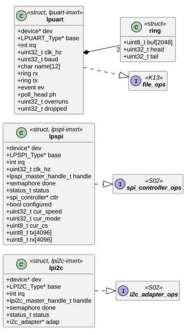
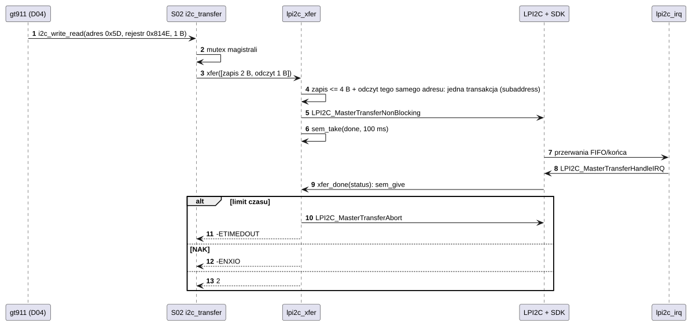
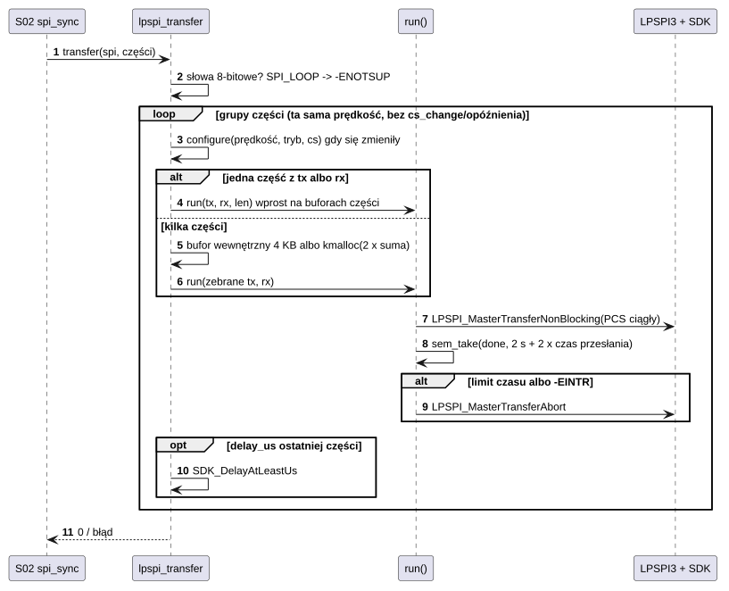
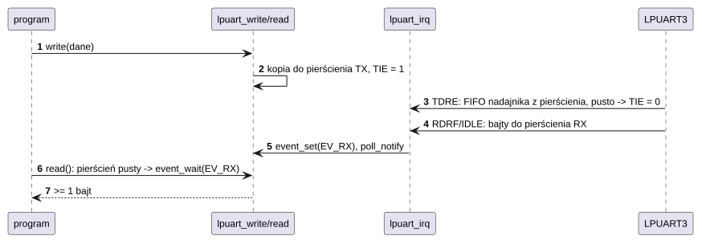

# D02 Sterowniki magistral i portów szeregowych

## 1. Identyfikacja

| | |
|---|---|
| Identyfikator | D02 |
| Warstwa | L1 (moduły `.ko`) |
| Moduły | `lpi2c-imxrt.ko` (`fsl,imxrt1050-lpi2c`), `lpspi-imxrt.ko` (`fsl,imxrt1050-lpspi`), `lpuart-imxrt.ko` (`fsl,imxrt1050-lpuart`) |
| Pliki | `drivers/imxrt/lpi2c-imxrt.c`, `drivers/spi/lpspi-imxrt.c`, `drivers/tty/lpuart-imxrt.c`; SDK: `fsl_lpi2c.c`, `fsl_lpspi.c`, `fsl_lpuart.c` (dołączane do modułów) |
| Interfejsy realizowane | `i2c_adapter_ops`, `spi_controller_ops` (S02), `file_ops` `/dev/ttyS*` (K13), polecenia `TTY_IOC_*` (`crtos/tty.h`) |

## 2. Odpowiedzialność

- **lpi2c-imxrt**: kontroler I2C w trybie master, transfery warstwą transakcyjną SDK
  z przerwaniem; zapis ≤ 4 B + odczyt z tego samego adresu jako jedna transakcja (adres
  rejestru + powtórzony start).
- **lpspi-imxrt**: kontroler SPI master (LPSPI3 na J24), słowa 8-bitowe, chip select
  sprzętowy (PCS0..3) aktywny przez cały komunikat, zegar do 32 MHz (korzeń 65 MHz).
- **lpuart-imxrt**: porty szeregowe inne niż konsola jądra (`/dev/ttyS3` na J22),
  surowe bajty 8N1, pierścienie 2 KB, przerwania, `poll`, prędkość, pętla wewnętrzna.

## 3. Wymagania

| ID | Wymaganie | Weryfikacja |
|---|---|---|
| REQ-D02-01 | Każdy transfer ma limit czasu (I2C 100 ms na transakcję, SPI 2 s + dwukrotny czas przesłania); po jego upływie transfer jest przerywany sprzętowo i zwracany jest błąd. | przegląd kodu |
| REQ-D02-02 | Brak potwierdzenia adresu I2C (NAK) zwraca `-ENXIO` (skanowanie `i2cdetect`). | `kmon i2cdetect 1` |
| REQ-D02-03 | Części komunikatu SPI o tej samej prędkości, bez `cs_change` i opóźnień, są wysyłane jako jeden transfer (chip select aktywny między nimi) niezależnie od długości. | `crtos run spi -c -r 10000 9f` |
| REQ-D02-04 | SDO kontrolera SPI jest w stanie wysokiej impedancji, gdy chip select jest nieaktywny (na EVKB to także pin ID gniazda J9). | `CFGR1.OUTCFG` = 1 (odczyt przez SWD, 27.09.2026) |
| REQ-D02-05 | `lpuart-imxrt` nie przejmuje UART wskazanego jako konsola jądra (`/chosen/stdout-path`). | przegląd kodu, start |
| REQ-D02-06 | Przerwany (zabity) wątek czekający na transfer SPI przerywa transfer, zanim bufory przestaną istnieć. | przegląd kodu |

## 4. Interfejs udostępniany

| Moduł | Dla kogo | Operacje |
|---|---|---|
| `lpi2c-imxrt` | S02 (magistrala `i2c1` z aliasu) | `xfer(msgs, num)`: `num` albo `-ETIMEDOUT`, `-ENXIO` (NAK), `-EIO`, `-EBUSY` |
| `lpspi-imxrt` | S02 (magistrala `spi3`) | `transfer(spi, xfers, num)`: 0, `-EINVAL` (słowo ≠ 8 bitów, zegar 0), `-ENOTSUP` (`SPI_LOOP`), `-ENOMEM`, `-EIO`, `-EINTR` |
| `lpuart-imxrt` | programy (`/dev/ttyS<n>`, `n` z aliasu `serial<n>`) | `read` (≥ 1 bajt, `O_NONBLOCK` → `-EAGAIN`), `write` (czeka na miejsce), `poll`, `ioctl`: `TTY_IOC_GET_MODE` (0 = surowy), `TTY_IOC_GET/SET_SPEED`, `TTY_IOC_SET_LOOPBACK`, `TTY_IOC_GET_SIZE` |

Parametry DT: `clock-frequency` (I2C, domyślnie 100 kHz), `clocks` `ipg` + `per`,
`interrupts`, `pinctrl-0`, `current-speed` (UART, domyślnie 115200), dzieci magistral
(S02).

## 5. Interfejsy wymagane

S01 (zegary, piny), S02, K02 (`irq_request`: I2C 6, SPI 8, UART 8), K06 (semafor końca
transferu, flagi zdarzeń UART), K13 (`devfs_register`), K12 (`poll_notify`), K07
(bufory > 4 KB dla SPI).

## 6. Struktura statyczna

*Źródło: [D02/struktura-statyczna.puml](../diagramy/D02/struktura-statyczna.puml)*

## 7. Zachowanie dynamiczne

### 7.1 Transfer I2C (odczyt rejestru)

*Źródło: [D02/transfer-i2c.puml](../diagramy/D02/transfer-i2c.puml)*

### 7.2 Komunikat SPI

*Źródło: [D02/komunikat-spi.puml](../diagramy/D02/komunikat-spi.puml)*

### 7.3 Port szeregowy

*Źródło: [D02/port-szeregowy.puml](../diagramy/D02/port-szeregowy.puml)*

## 8. Implementacja

- Wszystkie trzy korzystają z warstwy transakcyjnej / rejestrów SDK NXP; przerwanie woła
  obsługę SDK, która po zakończeniu wywołuje funkcję zwrotną sterownika (`sem_give`).
- **SPI**: `configure()` wywołuje `LPSPI_MasterInit` tylko przy zmianie prędkości, trybu
  albo chip select; opóźnienia PCS↔SCK i między transferami = pół okresu zegara. Zegar
  korzenia LPSPI ustawiany na 66 MHz (z PFD0 PLL3 = 261,8 MHz / 4 = 65 MHz).
- **UART**: pierścienie 2 KB w każdą stronę (potęga dwójki, liczniki), przerwanie „linia
  bezczynna” (IDLE) dostarcza końcówki pakietów; pętla wewnętrzna = `CTRL.LOOPS` bez
  `RSRC`; zegar korzenia UART 80 MHz wspólny z konsolą (nie zmieniany).
- **I2C**: korzeń LPI2C ustawiany na 10 MHz, gdy przekracza 60 MHz.

## 9. Obsługa błędów i mechanizmy bezpieczeństwa

| Sytuacja | Reakcja |
|---|---|
| urządzenie I2C nie odpowiada | `-ENXIO` |
| magistrala zawieszona | limit czasu, przerwanie transferu, `-ETIMEDOUT`/`-EIO` |
| wątek zabity w trakcie transferu SPI | przerwanie transferu, `configured = false`, `-EINTR` |
| błąd ramki / przepełnienie UART | flagi kasowane w przerwaniu (dane mogą zginąć) |
| pełny pierścień RX | bajty odrzucane |

## 10. Konfiguracja

Stałe: `XFER_TIMEOUT_MS` (100), `LPI2C_ROOT_HZ` (10 MHz), `ROOT_HZ` (66 MHz), `BOUNCE`
(4096), `TIMEOUT_MS` (2000), `NUM_CS` (4), `RING` (2048). Piny i węzły w
`dts/evkbimxrt1050.dts` (`&lpi2c1`, `&lpspi3`, `&lpuart3`); podział pinów płytki
opisuje [Sterowniki](../../sterowniki.md#spi-j24).

## 11. Weryfikacja

- I2C: dotyk GT911 przy każdym starcie; `crtos kmon i2cdetect 1`.
- SPI: `crtos run spi ...` (A03) – komunikaty do 16 KB, 100 kHz–20 MHz, tryb „polecenie,
  potem odczyt”; stan pinów sprawdzony przez SWD (27.09.2026).
- UART: `crtos run uart -l test` (pętla wewnętrzna), `uart -b 9600 ...`.

## 12. Ograniczenia i znane problemy

- SPI: tylko słowa 8-bitowe; brak pętli wewnętrznej (`SPI_LOOP`); na EVKB bez odbioru
  (MISO): jedyny wolny pad wejścia, GPIO_AD_B1_13 (złącze kamery J35 pin 3), to dane
  kodeka dźwięku (D09), a J24 pin 2 to `LCD_RST` (reset kontrolera dotyku). Odbiór wymaga wyłączenia `&sai1`
  i dopisania padu do grupy `pinctrl_lpspi3`.
- UART: tylko 8N1, bez sterowania przepływem.
- I2C: brak odzyskiwania zawieszonej magistrali (9 impulsów SCL).
- SPI: etykiety SDK i schemat EVKB B1 różnią się co do J24 pin 9 i 10 (SDO/SCK LPSPI3 wobec
  SDA/SCL I2C1, ISS-31); opis wyprowadzeń SPI nie jest sprawdzony na płytce.
