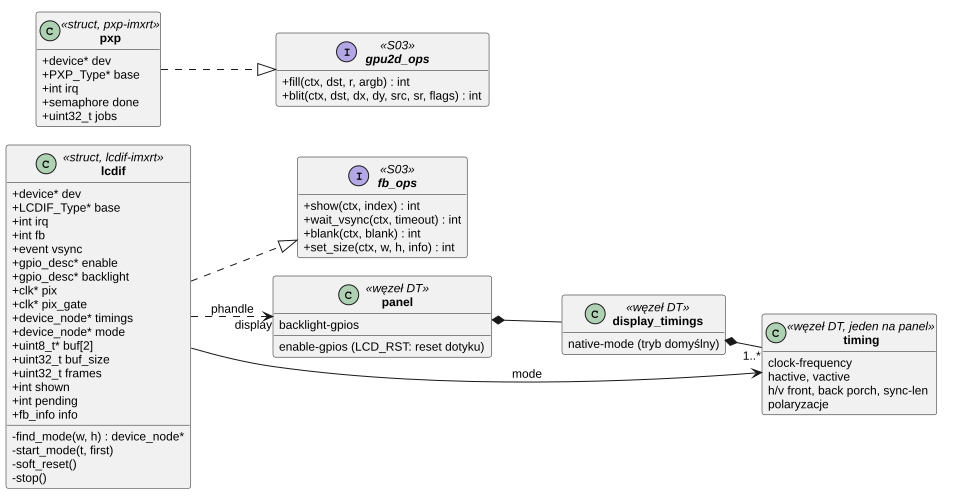
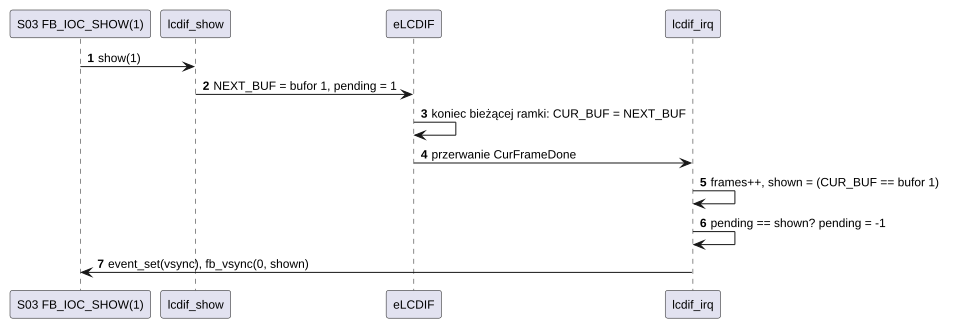
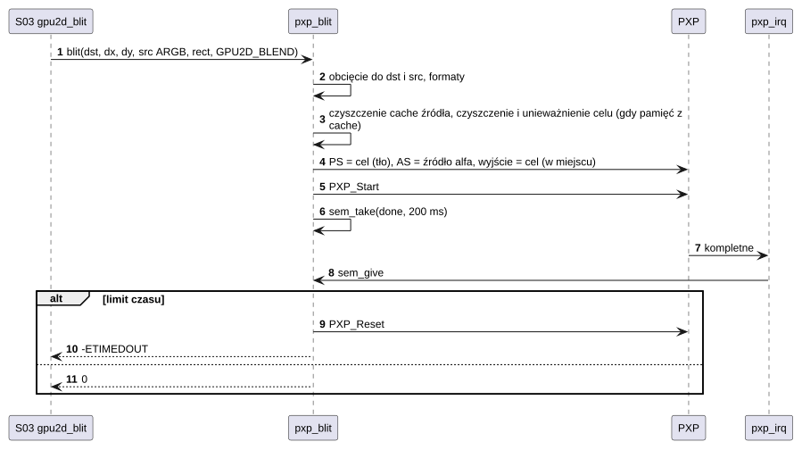
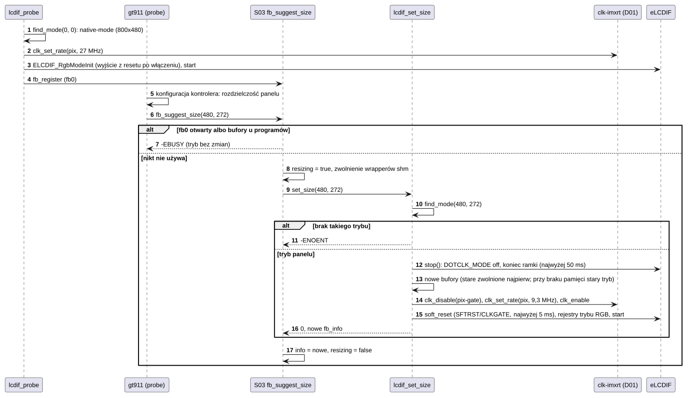

# D03 Sterowniki ekranu i akceleratora 2D

## 1. Identyfikacja

| | |
|---|---|
| Identyfikator | D03 |
| Warstwa | L1 (moduły `.ko`) |
| Moduły | `lcdif-imxrt.ko` (`fsl,imxrt1050-lcdif`), `pxp-imxrt.ko` (`fsl,imxrt1050-pxp`) |
| Pliki | `drivers/display/lcdif-imxrt.c`, `drivers/display/pxp-imxrt.c`; SDK: `fsl_elcdif.c`, `fsl_pxp.c` |
| Interfejsy realizowane | `fb_ops`, `gpu2d_ops` (S03) |

## 2. Odpowiedzialność

- **lcdif-imxrt**: kontroler eLCDIF z panelem RGB na 40-pinowym złączu (J8). Obsługuje
  kilka paneli, po jednym trybie na panel w węźle `display-timings`:
  - 480×272: RK043FN66HS, RK043FN02H;
  - 800×480: np. panel 4,3" IPS z modułu Waveshare 16249.

  Do tego:
  - start w trybie domyślnym (`native-mode`) i zmiana trybu na prośbę frameworka (S03,
    `set_size`), gdy kontroler dotyku zgłosi rozmiar swojego panelu;
  - dwa bufory RGB565 w pamięci bez cache, przełączane na początku ramki;
  - przerwanie końca ramki (`fb_vsync`);
  - zegar pikseli z PLL wideo;
  - wygaszanie (podświetlenie).
- **pxp-imxrt**: PXP jako akcelerator 2D:
  - wypełnienie prostokąta (kolor tła PXP);
  - kopia z konwersją formatu (RGB565, XRGB8888, ARGB8888);
  - mieszanie ARGB z powierzchnią docelową;
  - obcinanie do powierzchni i utrzymanie spójności pamięci podręcznej.

## 3. Wymagania

| ID | Wymaganie | Weryfikacja |
|---|---|---|
| REQ-D03-01 | Bufor ramki pokazywany na ekranie zmienia się tylko na granicy ramek; sterownik zgłasza bufor faktycznie pobrany przez kontroler (`CUR_BUF`). | obserwacja (brak rozrywania), `gfxinfo` |
| REQ-D03-02 | Każde zakończenie ramki wywołuje `fb_vsync` (licznik ramek, `poll`). | `gfxinfo` (58 fps) |
| REQ-D03-03 | Operacja PXP kończy się w 200 ms albo PXP jest resetowany i zwracany jest `-ETIMEDOUT`. | przegląd kodu |
| REQ-D03-04 | Obszar docelowy operacji PXP (wypełnienie, kopia, mieszanie) w pamięci z cache jest czyszczony i unieważniany przed operacją i unieważniany ponownie po niej (brak nieaktualnych danych dla procesora, także linii wczytanych w czasie operacji). | przegląd kodu, `kmon gpu2dtest`, kopia ekranu `vncd` w pamięci z cache = `crtos shot` (02.10.2026) |
| REQ-D03-05 | Przed startem kontrolera linia `LCD_RST` (`enable-gpios` panelu: reset kontrolera dotyku; DISP panelu podciąga na płytce R67) jest przez 5 ms niska, potem wysoka; podświetlenie włącza się po starcie. | start płytki |
| REQ-D03-06 | Ekran startuje w trybie `native-mode` z `display-timings` panelu (bez tej właściwości: w pierwszym). `set_size` zmienia tryb tylko na tryb opisany w DT o tym rozmiarze (inaczej `-ENOENT`). Gdy na bufory nowego trybu brak pamięci, wraca stary tryb z buforami i zwracane jest `-ENOMEM`. | `kmon fb` (02.10.2026): 10 zmian 480×272 ↔ 800×480 z pomiarem `fbtest` (58,7 i 59,1 Hz), `fb 1024x600`: brak trybu, pula `ncache` po zmianach bez ubytku |
| REQ-D03-07 | Zmiana trybu nie czeka na sprzęt bez końca: koniec ramki przy zatrzymaniu najwyżej 50 ms, potwierdzenie programowego resetu najwyżej 5 ms (potem ostrzeżenie i dalej). PLL wideo zmienia się przy zamkniętej bramce zegara pikseli, a kontroler startuje po resecie. | przegląd kodu; na płytce przed poprawką trzecia zmiana z rzędu zawiesiła wątek kmon w `ELCDIF_Reset`, a bez resetu kontroler w 4 z 5 zmian nie generował ramek; po poprawce 10 zmian bez błędu |

## 4. Interfejs udostępniany

| Moduł | Rejestracja | Operacje |
|---|---|---|
| `lcdif-imxrt` | `fb_register` → `/dev/fb0` | `show(i)`: `ELCDIF_SetNextBufferAddr`; `wait_vsync(timeout)`; `blank(on)`: podświetlenie; `set_size(w, h, info)`: zmiana trybu panelu (S03, `fb_suggest_size`) |
| `pxp-imxrt` | `gpu2d_register` | `fill(dst, r, argb)`, `blit(dst, dx, dy, src, sr, flags)` (`GPU2D_BLEND`: mieszanie alfa) |

## 5. Interfejsy wymagane

- S03: `fb_register`, `fb_vsync`, `gpu2d_register`.
- S01: zegary `axi`, `pix-gate` (wyłączany na czas zmiany PLL), `pix`; GPIO panelu.
- D01: zegar pikseli z PLL wideo.
- K02: przerwania LCDIF 5, PXP 7.
- K06: flagi zdarzeń, semafor.
- K07: `KM_NOCACHE` na bufory.
- SDK: `fsl_elcdif`, `fsl_pxp`, `DCACHE_*`.

## 6. Struktura statyczna

*Źródło: [D03/struktura-statyczna.puml](../diagramy/D03/struktura-statyczna.puml)*

## 7. Zachowanie dynamiczne

### 7.1 Przełączenie bufora

*Źródło: [D03/przelaczenie-bufora.puml](../diagramy/D03/przelaczenie-bufora.puml)*

### 7.2 Kopia z mieszaniem (PXP)

*Źródło: [D03/kopia-z-mieszaniem.puml](../diagramy/D03/kopia-z-mieszaniem.puml)*

### 7.3 Wybór trybu panelu

*Źródło: [D03/zmiana-trybu.puml](../diagramy/D03/zmiana-trybu.puml)*

## 8. Implementacja

- Tryby to węzły w `display-timings` panelu: `hactive`, `vactive`, `clock-frequency`,
  przedsionki, synchronizacje i polaryzacje jak w Linuksie. `find_mode(0, 0)` daje tryb
  domyślny (`native-mode`), `find_mode(w, h)` tryb o tym rozmiarze.
- Bufory: 2 × szerokość × wysokość × 2 B w `ncache` (wyrównanie 64 B), zerowane:
  - 480×272: 2 × 255 KB;
  - 800×480: 2 × 750 KB (z 2 MB puli bez cache zostaje ok. 475 KB).

  Zwalniane akcją `devm` przy odłączeniu i przy zmianie trybu: stare przed alokacją
  nowych, bo obu naraz pula nie mieści.
- Zegar pikseli z DT ustawiany przez `clk_set_rate(pix)`:
  - 480×272: 9,3 MHz, 58,7 Hz;
  - 800×480: 27 MHz (24 MHz × 45 / 5 / 8 dokładnie), 59,2 Hz.

  Częstotliwość odświeżania = zegar / (htotal × vtotal).
- Start przy `probe`: `ELCDIF_RgbModeInit` z SDK. Blok jest jeszcze w resecie po
  włączeniu zasilania, który SDK tylko zwalnia.
- Zmiana trybu (`lcdif_set_size`):
  1. `stop`: wyłączenie `DOTCLK_MODE` i czekanie na koniec ramki, najwyżej 50 ms (funkcja
     SDK czekała bez końca).
  2. Nowe bufory.
  3. `clk_disable(pix-gate)`, ustawienie PLL i dzielników, `clk_enable`.
  4. `soft_reset`: SFTRST, czekanie na CLKGATE najwyżej 5 ms.
  5. `rgb_mode_regs`: rejestry trybu RGB z `ELCDIF_RgbModeInit`, bez resetu z SDK.
  6. Start i nowe `fb_info`.

  Reset z SDK (`ELCDIF_Reset`) czeka bez końca na CLKGATE: trzecia zmiana z rzędu zawiesiła
  w nim wątek kmon. Bez resetu, przy zegarze zmienianym pod pracującą bramką, kontroler
  często nie ruszał.
- PXP:
  - wypełnienie: powierzchnia procesu przesunięta poza obszar wyjściowy, więc PXP zapisuje
    kolor tła;
  - kopia: źródło jako powierzchnia procesu;
  - mieszanie: cel czytany jako powierzchnia procesu, źródło jako powierzchnia alfa, wynik
    w miejscu celu.
- Obszar docelowy w OCRAM i SDRAM z cache jest czyszczony i unieważniany
  (`DCACHE_CleanInvalidateByRange`) przed operacją PXP – zapisy procesora trafiają do pamięci
  i nie nadpiszą potem wyniku – i unieważniany ponownie po niej: program mógł w tym czasie
  wczytać linie tego obszaru (zdalny pulpit czyta swoją kopię ekranu, gdy `gfxd` kopiuje do
  niej następną klatkę), a bez tego widziałby stare piksele. Dzięki temu kopia ekranu dla
  `vncd` (U03, U08) może być w pamięci z cache.

## 9. Obsługa błędów i mechanizmy bezpieczeństwa

| Sytuacja | Reakcja |
|---|---|
| brak parametrów panelu | `E: no panel timings`, `-EINVAL` |
| brak pamięci na bufory | `-ENOMEM`, zwolnienie |
| zmiana na tryb, którego panel nie ma | `-ENOENT`, tryb bez zmian |
| brak pamięci na bufory nowego trybu | stary tryb z nowymi buforami, `-ENOMEM` |
| kontroler nie kończy ramki przy zatrzymaniu | po 50 ms ostrzeżenie `W:`, `RUN` kasowany |
| kontroler nie potwierdza resetu | po 5 ms ostrzeżenie `W:`, programowanie dalej |
| PXP nie kończy operacji | reset PXP, `-ETIMEDOUT` |
| nieobsługiwany format | `-EINVAL` |
| prostokąt poza powierzchnią | obcięcie (pusty: 0 bez uruchamiania PXP) |

## 10. Konfiguracja

- `dts/evkbimxrt1050.dts`:
  - węzeł `panel`: `enable-gpios` (`LCD_RST`), `backlight-gpios` i `display-timings`
    z trybami `timing-480x272` i `timing-800x480`;
  - `native-mode` (dziś 800×480, bo jego dotyk sterownik rozpoznaje dopiero po rozmiarze,
    a panel RK043 przełącza się sam);
  - węzły `&lcdif` (phandle `display`) i `&pxp`.
- `NBUF` (2).
- Nowy panel: kolejny węzeł w `display-timings` z czasami z noty panelu; jego dotyk wybierze
  go sam, jeśli zgłosi swój rozmiar (D04).

## 11. Weryfikacja

- `crtos kmon fbtest`, `gpu2dtest`; `crtos run gfxinfo -b` (czas składania, liczba klatek);
  `crtos shot`.
- `crtos kmon fb [WxH]` (K19), przy zatrzymanym `gfxd`. 02.10.2026, panel 800×480 z modułu
  Waveshare 16249:
  - 10 zmian 480×272 ↔ 800×480, każda z pomiarem `fbtest` (58,7 i 59,1 Hz);
  - przy działającym `gfxd` odmowa;
  - tryb 1024×600 odrzucony.
- `crtos bench` przy 800×480 wobec 480×272 (02.10.2026):
  - `memcpy`/`memset` 256 KB w SDRAM o 12–13% wolniejsze (odczyt ekranu zajmuje ok. 45 MB/s
    zamiast 16 MB/s);
  - składanie klatki w `gfxd` 290–359 µs zamiast 252–281 µs;
  - reszta bez zmian.
- Codzienne działanie interfejsu graficznego (U03, A01, A02); VNC (U08) przy 800×480.

## 12. Ograniczenia i znane problemy

- Tylko RGB565 (16 linii danych: panele 24-bitowe dostają starsze bity kolorów).
- Panelu nie da się rozpoznać elektrycznie. Panel bez dotyku albo z dotykiem, który nie
  zgłasza rozmiaru (FT5406), dostaje tryb `native-mode`; inny panel wymaga wtedy zmiany DT.
- Tryb zmienia się tylko przed startem `gfxd` (S03); na działającym pulpicie nie.
- Przy 800×480 bufory ekranu zajmują 1,5 MB z 2 MB pamięci bez cache, a odczyt ekranu
  ok. 45 MB/s przepustowości SDRAM (pomiar w sekcji 11).
- Ruch PXP i LCDIF na magistrali powoduje przepełnienia FIFO odbiornika Ethernet przy pełnej
  prędkości sieci (D05).
- Pad `LCD_RST` (GPIO_AD_B0_02) jest też pinem J24 pin 2: nie może służyć jako MISO SPI
  (D02, [Sterowniki](../../sterowniki.md#spi-j24)).
