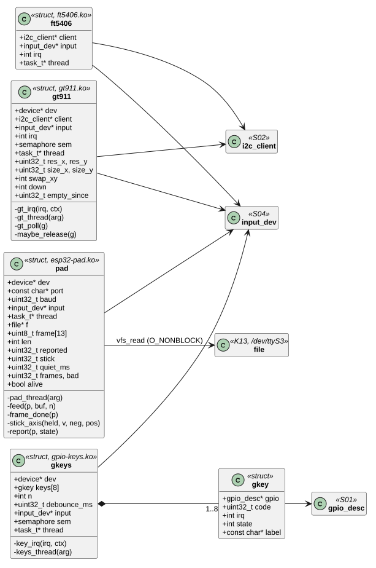
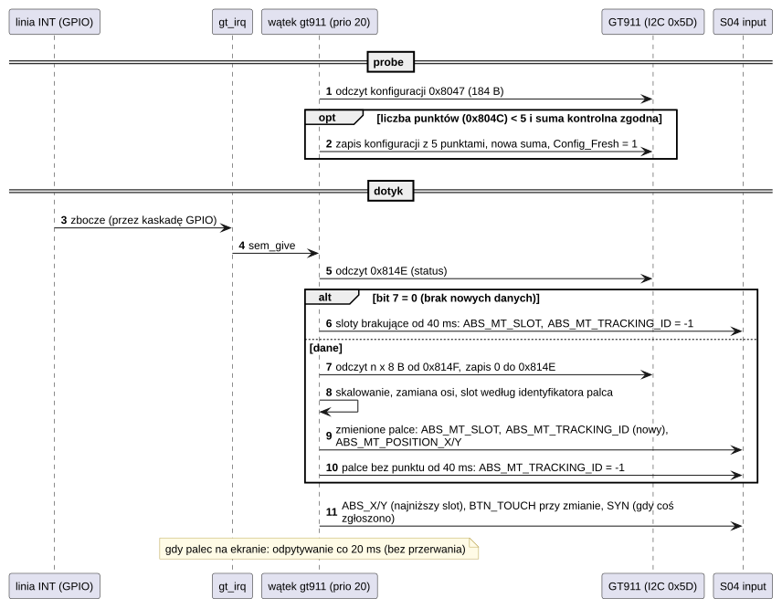
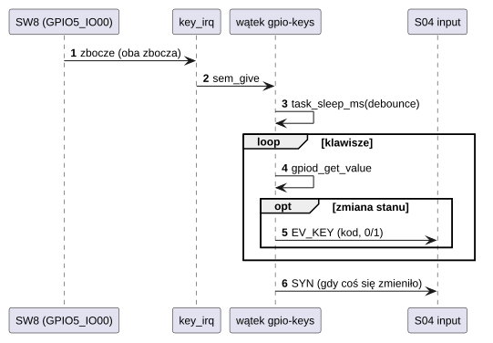
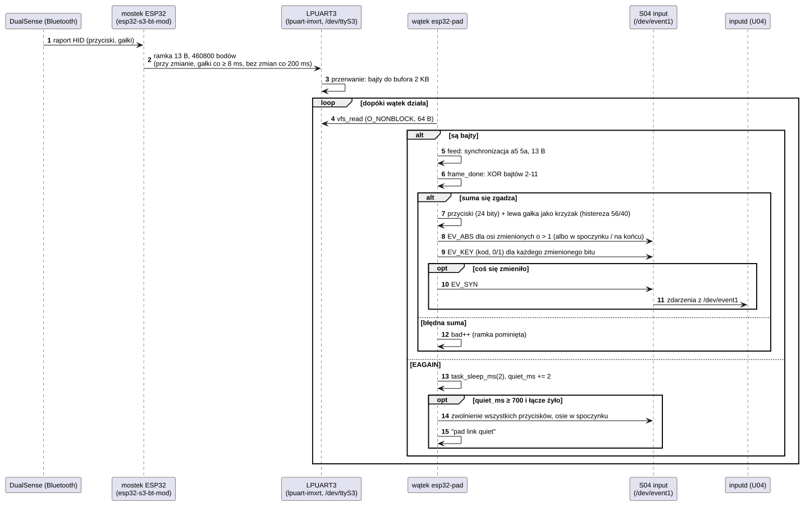

# D04 Sterowniki dotyku, przycisków i pada

## 1. Identyfikacja

| | |
|---|---|
| Identyfikator | D04 |
| Warstwa | L1 (moduły `.ko`) |
| Moduły | `gt911.ko` (`goodix,gt911`), `ft5406.ko` (`focaltech,ft5406`), `gpio-keys.ko` (`gpio-keys`), `esp32-pad.ko` (`crtos,esp32-pad`) |
| Pliki | `drivers/input/gt911.c`, `drivers/input/ft5406.c`, `drivers/input/gpio-keys.c`, `drivers/input/esp32-pad.c` |
| Interfejsy realizowane | urządzenia wejścia (S04); klienci I2C (S02); przerwania GPIO (K02, D01); czytelnik portu szeregowego (K13, D02) |

## 2. Odpowiedzialność

- **gt911**: kontroler dotyku Goodix GT911 pod adresem I2C 0x5D (panel RK043FN66HS-CTG)
  albo 0x14 (np. panel 800×480 z modułu Waveshare 16249): odczyt konfiguracji
  (rozdzielczość, przekazywana ekranowi jako rozmiar panelu: `fb_suggest_size`, S03),
  podniesienie w niej liczby punktów do 5 (panel przychodzi ustawiony na 1 punkt), odczyt do 5 punktów po przerwaniu, skalowanie do rozmiaru ekranu,
  zamiana osi, zgłaszanie jedno- i wielodotyku (każdy palec w swoim slocie), wykrywanie
  podniesienia każdego palca z filtrem 40 ms (kontroler czasem gubi palec w pojedynczym
  skanie, najczęściej przy krawędziach).
- **ft5406**: kontroler FocalTech FT5406 (panel RK043FN02H-CT): jak wyżej, bez zmiany
  konfiguracji i bez filtra; bez linii przerwania odpytywanie co 20 ms.
- **gpio-keys**: przyciski na liniach GPIO (SW8 na EVKB): przerwanie na obu zboczach,
  eliminacja drgań (`debounce-interval`), kody klawiszy z DT (`linux,code`).
- **esp32-pad**: pad Sony DualSense / DualSense Edge przez Bluetooth. Z padem rozmawia
  mostek na ESP32 (`esp32-s3-bt-mod/`, aplikacja Zephyr, komponent zewnętrzny – tu
  niezmieniany). Mostek wysyła stan pada ramkami na swoim UART2, podłączonym do LPUART3
  płytki. Sterownik czyta port `/dev/ttyS3`, sprawdza ramki i zgłasza przyciski jako
  urządzenie wejścia z kodami padów Linuksa (`BTN_SOUTH`, `BTN_DPAD_UP`, ...), a gałki
  i spusty jako osie (`ABS_X/Y`, `ABS_RX/RY`, `ABS_Z/RZ`). Lewa gałka działa też jak
  krzyżak (dla menu i gier bez sterowania analogowego).

## 3. Wymagania

| ID | Wymaganie | Weryfikacja |
|---|---|---|
| REQ-D04-01 | Obsługa przerwania dotyku/przycisku tylko budzi wątek sterownika (semafor); odczyt I2C i zgłaszanie zdarzeń odbywa się w wątku. | przegląd kodu |
| REQ-D04-02 | Podniesienie palca jest zgłaszane dopiero po 40 ms, w których nie było go w żadnym raporcie kontrolera (GT911); nieudany odczyt I2C nie jest traktowany jako podniesienie. | `evtest` (ręcznie) |
| REQ-D04-03 | Współrzędne są przeskalowane do rozmiaru ekranu i ograniczone do `[0, rozmiar − 1]`. | `evtest` |
| REQ-D04-04 | Stan przycisku jest zgłaszany po czasie eliminacji drgań i tylko przy zmianie. | `evtest` z SW8 |
| REQ-D04-05 | Sterownik GT911 zmienia w konfiguracji kontrolera tylko liczbę punktów dotyku (gdy jest mniejsza niż 5): zapisuje całą konfigurację z tym polem, nową sumą kontrolną i `Config_Fresh`. Konfiguracji, której suma kontrolna się nie zgadza, nie zmienia. | przegląd kodu, `dmesg` („5 points”) |
| REQ-D04-06 | `esp32-pad` przyjmuje ramkę tylko z bajtami synchronizacji `a5 5a` i zgodną sumą XOR bajtów 2–11; błędną liczy (`bad`) i pomija. | przegląd kodu, `dmesg` („pad link up (…, 0 bad)”) |
| REQ-D04-07 | Gdy przez 700 ms nie przyjdzie żaden bajt, `esp32-pad` zwalnia wszystkie przyciski (nic nie zostaje wciśnięte po zerwaniu łącza). | przegląd kodu |
| REQ-D04-08 | `esp32-pad` zgłasza tylko zmiany: po jednym `EV_KEY` na zmieniony przycisk i jedno `EV_SYN` na ramkę. | przegląd kodu, `evtest /dev/event1` |
| REQ-D04-09 | Lewa gałka wychylona o co najmniej 56 od środka (z 128) wciska kierunek krzyżaka, a zwalnia go poniżej 40 (histereza). | przegląd kodu, `evtest /dev/event1` |
| REQ-D04-10 | `esp32-pad` zgłasza gałki (−128…127, 0 w spoczynku, w prawo i w dół dodatnio) i spusty (0…255) jako osie; zmiana o 1 (szum gałki w spoczynku) nie jest zgłaszana, powrót do spoczynku i skrajne położenia zawsze. W jednym raporcie osie są przed przyciskami. | przegląd kodu, `kmon evtest event1` (z padem) |
| REQ-D04-11 | Przy zerwaniu łącza (REQ-D04-07) `esp32-pad` ustawia też wszystkie osie w spoczynku. | przegląd kodu |
| REQ-D04-12 | Dotyk (GT911, FT5406) zgłasza wielodotyk według protokołu B Linuksa: palec zachowuje swój slot `ABS_MT_SLOT` od dotknięcia do podniesienia (slot wybiera identyfikator palca z kontrolera), jego podniesienie to `ABS_MT_TRACKING_ID = −1` w tym slocie; pozycja idzie tylko przy zmianie. `ABS_X/ABS_Y` podążają za palcem w najniższym zajętym slocie, `BTN_TOUCH` mówi, czy jakikolwiek palec jest na ekranie. | przegląd kodu, `evtest` (ręcznie, dwa palce) |
| REQ-D04-13 | GT911 odpowiadający pod 0x5D albo 0x14 (dwa węzły DT, przypisuje się ten, który odpowie) zgłasza po odczycie konfiguracji jej niezerową rozdzielczość ekranowi (`fb_suggest_size`, z zamianą osi, jeśli jest ustawiona); zakres współrzędnych bez `touchscreen-size-x/y` to ta rozdzielczość. | `dmesg` (02.10.2026): `touchscreen@14: GT911 touch, config v67, 800x480 -> 800x480, 5 points`; zmiana trybu ekranu przez `fb_suggest_size` sprawdzona `kmon fb` (S03); z panelem RK043 (0x5D, 480×272) nie sprawdzano po zmianie |

## 4. Interfejs udostępniany

Dla programów: `/dev/eventN` (S04) ze zdarzeniami:

| Sterownik | Zdarzenia | Opis urządzenia |
|---|---|---|
| `gt911`, `ft5406` | `EV_ABS` `ABS_MT_SLOT`, `ABS_MT_TRACKING_ID` (−1: palec podniesiony), `ABS_MT_POSITION_X/Y` (REQ-D04-12), `ABS_X/ABS_Y` (palec w najniższym slocie); `EV_KEY` `BTN_TOUCH`; `EV_SYN` | nazwa `gt911`/`ft5406`, zakres osi = rozmiar ekranu |
| `gpio-keys` | `EV_KEY` z kodem z DT (SW8), wartość 1/0; `EV_SYN` | nazwa `gpio-keys`, mapa klawiszy |
| `esp32-pad` | `EV_ABS` osie (tabela niżej); `EV_KEY` z kodami padów (tabela niżej), wartość 1/0; `EV_SYN` | nazwa `DualSense (ESP32 link)`, mapa klawiszy, zakresy osi (`INPUT_IOC_GET_ABS`) |

Kody `esp32-pad` (`kernel/include/crtos/keys.h`):

| Przycisk pada | Kod | Przycisk pada | Kod |
|---|---|---|---|
| krzyżyk | `BTN_SOUTH` | L1, R1 | `BTN_TL`, `BTN_TR` |
| kółko | `BTN_EAST` | L2, R2 (wciśnięte) | `BTN_TL2`, `BTN_TR2` |
| trójkąt | `BTN_NORTH` | L3, R3 | `BTN_THUMBL`, `BTN_THUMBR` |
| kwadrat | `BTN_WEST` | Create, Options | `BTN_SELECT`, `BTN_START` |
| krzyżak i lewa gałka | `BTN_DPAD_UP/DOWN/LEFT/RIGHT` | PS | `BTN_MODE` |
| kliknięcie panelu dotykowego, Mute | `BTN_TRIGGER_HAPPY1`, `…2` | Edge: Fn lewy/prawy, tylne lewy/prawy | `BTN_TRIGGER_HAPPY3`–`6` |

Osie `esp32-pad`:

| Oś | Kod | Zakres |
|---|---|---|
| lewa gałka | `ABS_X`, `ABS_Y` | −128…127, 0 w spoczynku, w prawo / w dół dodatnio |
| prawa gałka | `ABS_RX`, `ABS_RY` | jak lewa |
| L2, R2 (analogowo) | `ABS_Z`, `ABS_RZ` | 0 (puszczony) … 255 |

Ramka mostka (460800 bodów, 8N1): `a5 5a b0 b1 b2 lx ly rx ry l2 r2 seq xor`, gdzie
`b0..b2` to 24 bity przycisków (numeracja `enum ds_button` mostka), `lx..r2` wartości
0–255, `seq` licznik, `xor` suma XOR bajtów 2–11. Mostek wysyła ramkę przy każdej zmianie
przycisku, ruch gałek najwyżej co 8 ms, stan bez zmian co 200 ms, a po rozłączeniu pada
ramkę „nic nie wciśnięte”.

Parametry DT: węzeł dotyku jako dziecko `&lpi2c1` (`reg`, `interrupt-parent = <&gpio1>`,
`interrupts = <11 zbocze>`, `touchscreen-size-x/y`, `touchscreen-swapped-x-y`); GT911 ma dwa
węzły, `touchscreen@5d` i `touchscreen@14`, bo adres wybiera stan linii INT przy końcu
resetu (INT niski: 0x5D, wysoki: 0x14), a ustala go podciągnięcie na panelu; `gpio-keys`
z węzłami dzieci (`gpios`, `linux,code`, `label`, `debounce-interval`); `esp32-pad`:
węzeł główny `gamepad` z `compatible = "crtos,esp32-pad"`, `port` (domyślnie
`"/dev/ttyS3"`) i `current-speed` (domyślnie 460800).

## 5. Interfejsy wymagane

S02 (`i2c_client_get`, `i2c_write_read`, `i2c_write`), S04 (`input_register`,
`input_report`, `input_sync`, `input_set_abs`, `input_set_key`), S01 (`gpiod_*`), K02
(`irq_request`, `irq_set_type`), K05 (`kthread_create`, `task_should_stop`,
`task_sleep_ms`), K06 (semafor); `esp32-pad`: K13 (`vfs_open`, `vfs_read`, `vfs_ioctl`)
i port `lpuart-imxrt` (D02, S03: `TTY_IOC_SET_SPEED`).

## 6. Struktura statyczna

*Źródło: [D04/struktura-statyczna.puml](../diagramy/D04/struktura-statyczna.puml)*

## 7. Zachowanie dynamiczne

### 7.1 Dotyk GT911

*Źródło: [D04/dotyk-gt911.puml](../diagramy/D04/dotyk-gt911.puml)*

### 7.2 Przycisk

*Źródło: [D04/przycisk.puml](../diagramy/D04/przycisk.puml)*

### 7.3 Pad DualSense przez mostek ESP32

*Źródło: [D04/pad-esp32.puml](../diagramy/D04/pad-esp32.puml)*

## 8. Implementacja

- Wszystkie trzy sterowniki: przerwanie → `sem_give` → wątek o priorytecie 20
  (`PRIO_HIGH`) → magistrala / GPIO → S04. Wątek kończy się przy `kthread_stop`
  (usuwanie modułu).
- GT911: rejestry 0x8140 (ID), 0x8047–0x80FE (konfiguracja, 184 B: wersja, rozdzielczość,
  0x804C liczba punktów w bitach 3–0, …), 0x80FF (suma kontrolna: dopełnienie sumy bajtów
  konfiguracji), 0x8100 (`Config_Fresh`), 0x814E (status: bit 7 dane gotowe, bity 3–0
  liczba punktów), 0x814F (8 B na punkt, pierwszy bajt to identyfikator palca); zapis 0 do
  statusu zwalnia bufor kontrolera. Przy `probe` sterownik czyta konfigurację; gdy liczba
  punktów jest mniejsza niż 5, sprawdza sumę, zapisuje konfigurację z liczbą 5 (jednym
  zapisem I2C, z tą samą wersją) i po 100 ms czyta ją ponownie.
- GT911 i FT5406: tablica slotów (identyfikator palca na slot, ostatnia pozycja). Punkt
  z raportu trafia do slotu ze swoim identyfikatorem albo do pierwszego wolnego. Sloty bez
  punktu w raporcie: FT5406 zwalnia je od razu, GT911 zapamiętuje czas pierwszego braku
  i zwalnia slot po 40 ms (także przy odpytywaniu bez nowych danych). Po raporcie
  `ABS_X/ABS_Y` najniższego zajętego slotu, `BTN_TOUCH` przy zmianie i `EV_SYN`, jeśli coś
  zgłoszono.
- `gpio-keys`: czas eliminacji drgań = największy `debounce-interval` (min. 5 ms);
  klawisze bez przerwania są sprawdzane przy każdym obudzeniu.
- `esp32-pad`: wątek o priorytecie 20 (stos 1,5 KB) otwiera port z `O_NONBLOCK`, ustawia
  prędkość, odrzuca bajty odebrane wcześniej (przy innej prędkości), potem czyta po 64 B;
  gdy nic nie ma, śpi 2 ms (opóźnienie do 2 ms). Parser to automat: `a5`, `5a`, 11 bajtów
  (po `a5 a5` drugi `a5` może zaczynać ramkę). Stan to 24 bity przycisków z ramki
  połączone z 4 bitami krzyżaka od lewej gałki. `report` najpierw zgłasza osie, które
  zmieniły się o więcej niż 1 (albo wróciły do spoczynku lub doszły do końca), potem
  zmienione przyciski i jedno `EV_SYN`, jeśli coś się zmieniło. Osie przed przyciskami
  pozwalają programowi rozpoznać krzyżak zrobiony z lewej gałki. Port należy do
  sterownika: inny czytelnik zabrałby mu bajty.

## 9. Obsługa błędów i mechanizmy bezpieczeństwa

| Sytuacja | Reakcja |
|---|---|
| błąd odczytu I2C | pomiar pominięty (bez podniesienia palca) |
| brak linii przerwania | odpytywanie co 20 ms |
| kontroler GPIO jeszcze niegotowy | `-EPROBE_DEFER` |
| brak klawiszy w DT | `-ENODEV` |
| więcej niż 5 punktów | obcięcie do 5 |
| GT911: suma kontrolna konfiguracji się nie zgadza | konfiguracja bez zmian (`W:`), dotyk jednym palcem |
| GT911: zapis konfiguracji nieudany | ostrzeżenie `W:`, dalej z tym, co kontroler ma |
| `esp32-pad`: błędna suma ramki | ramka pominięta, licznik `bad` |
| `esp32-pad`: brak portu (moduł `lpuart-imxrt` jeszcze się ładuje) | ponowna próba co 500 ms |
| `esp32-pad`: błąd odczytu portu | zamknięcie, ponowne otwarcie po 500 ms |
| `esp32-pad`: cisza na łączu ≥ 700 ms | zwolnienie wszystkich przycisków, „pad link quiet” |

## 10. Konfiguracja

`MAX_POINTS` (5), `POLL_MS` (20), `RELEASE_MS` (40), `MAX_KEYS` (8); węzły w
`dts/evkbimxrt1050.dts` (oba kontrolery dotyku opisane, dołącza się ten, który odpowiada).
`esp32-pad`: `POLL_MS` (2), `QUIET_MS` (700), `STICK_ON`/`STICK_OFF` (56/40), `NAXES` (6); węzeł
`gamepad` i `current-speed = <460800>` portu `&lpuart3` w `dts/evkbimxrt1050.dts`.

## 11. Weryfikacja

- `crtos run evtest` / `crtos kmon evtest`: dotyk i SW8 (ręcznie).
- `crtos run gfxtap` (A03) testuje ścieżkę od `gfxd` w górę bez sprzętu; `gfxtap hold`
  trzyma dwa palce naraz.
- `dmesg`: „GT911 touch, … 5 points” po starcie (liczba punktów w konfiguracji).
- 02.10.2026, panel 800×480 z modułu Waveshare 16249 (taśma dotyku przez przewody):
  `touchscreen@14` przypisany, `inputd` przyjmuje `/dev/event2` jako ekran dotykowy. Wcześniej
  źle podłączona taśma trzymała SCL i blokowała też kodek (D09).
- `esp32-pad`: `uart -x -D /dev/ttyS3 -b 460800` (A03; najpierw `rmmod esp32-pad`, bo port należy do sterownika)
  pokazuje surowe ramki mostka; `dmesg` – „listening on /dev/ttyS3 at 460800 baud” i „pad
  link up (…, 0 bad)” po pierwszej poprawnej ramce; `evtest /dev/event1` – przyciski
  (ręcznie, z padem).

## 12. Ograniczenia i znane problemy

- Brak automatycznych testów sprzętowej ścieżki dotyku (wymaga fizycznego dotknięcia).
- Sterownik GT911 nie ustawia INT podczas resetu, więc adres zależy od panelu (ISS-30). Reset
  (`LCD_RST`) wykonuje sterownik ekranu (D03), nie dotyku.
- Kontroler dotyku dzieli LPI2C1 z kodekiem WM8960 (D09) i czujnikiem ruchu płytki: źle
  podłączony albo niezasilony kontroler trzyma SCL i zatrzymuje całą magistralę, a brak
  odzyskiwania magistrali (ISS-20) sprawia, że pomaga dopiero restart.
- FT5406 nie zna rozdzielczości panelu: nie zgłasza rozmiaru ekranowi, a zakres współrzędnych
  bierze z DT.
- Zmieniona konfiguracja zostaje w kontrolerze GT911 do wyłączenia zasilania (reset
  procesora go nie resetuje). Czy zapisuje ją też na stałe, nie sprawdzano; sterownik i tak
  sprawdza liczbę punktów przy każdym starcie.
- `esp32-pad`: jeden pad; bez wibracji, diody, głośnika i czujników ruchu pada; łącze
  działa w jedną stronę (mostek → płytka). Czy pad jest połączony, widać tylko po ramkach:
  pad uśpiony daje ramki „nic nie wciśnięte”, więc łącze i tak wygląda na żywe.
