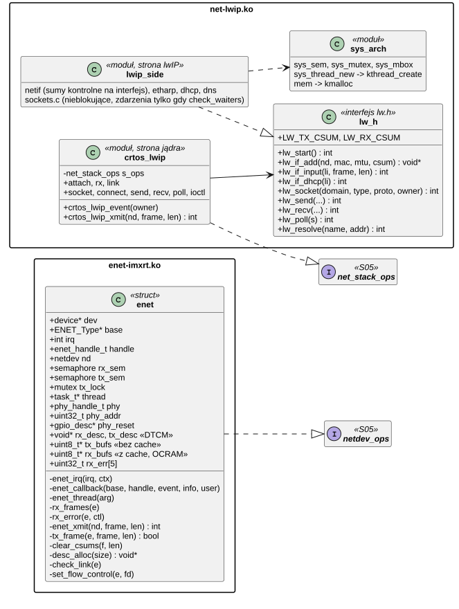
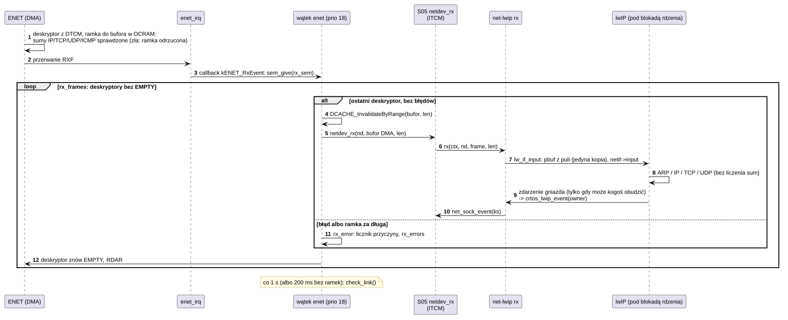
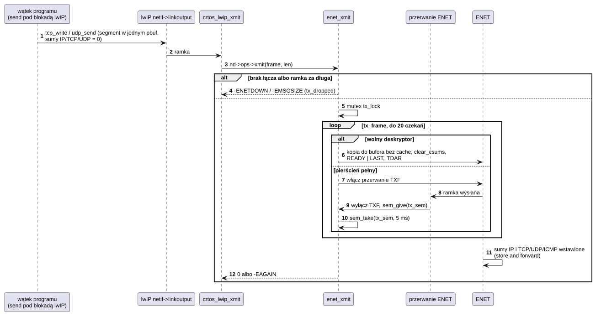

# D05 Ethernet i stos TCP/IP

## 1. Identyfikacja

| | |
|---|---|
| Identyfikator | D05 |
| Warstwa | L1 (moduły `.ko`) |
| Moduły | `enet-imxrt.ko` (`fsl,imxrt1050-enet`), `net-lwip.ko` (`crtos,lwip`) |
| Pliki | `drivers/net/enet-imxrt.c` (+ SDK `fsl_enet.c`, `fsl_phyksz8081.c`); `drivers/net/lwip/crtos_lwip.c` (strona jądra), `lwip_side.c` (strona lwIP), `lw.h` (wąski interfejs między nimi), `sys_arch.c` (warstwa systemu dla lwIP), `lwipopts.h`; `third_party/lwip` (lwIP 2.2.1) |
| Interfejsy realizowane | `netdev_ops`, `net_stack_ops` (S05) |

## 2. Odpowiedzialność

- **enet-imxrt**: MAC ENET 10/100 z PHY KSZ8081 (RMII): pierścienie deskryptorów
  (RX 32, TX 16) obsługiwane przez sterownik (SDK tylko konfiguruje kontroler), odbiór
  w wątku po przerwaniu wprost z buforów DMA, wysyłanie pod mutexem z czekaniem na
  przerwanie przy pełnym pierścieniu, sumy kontrolne IPv4/TCP/UDP/ICMP liczone i sprawdzane
  przez kontroler, reset PHY przez GPIO, sprawdzanie łącza co 1 s i ustawianie
  prędkości/dupleksu MAC, sterowanie przepływem 802.3x (gdy partner je ogłasza), adres MAC
  z unikalnego ID układu (albo z DT).
- **net-lwip**: stos TCP/IP lwIP (IPv4: ARP, IP, ICMP, UDP, TCP, DHCP, DNS) za
  interfejsem `net_stack_ops`: interfejsy (`netif`), adresy (DHCP, statyczne), DNS,
  gniazda lwIP używane tylko w trybie nieblokującym; zdarzenia gniazd lwIP budzą gniazda
  jądra (`net_sock_event`). Okna TCP 91 KB ze skalowaniem (RFC 7323): pełna prędkość łącza
  także przy czasie obiegu kilku ms (komputer przez Wi-Fi).

## 3. Wymagania

| ID | Wymaganie | Weryfikacja |
|---|---|---|
| REQ-D05-01 | Przerwanie ENET tylko budzi wątek odbioru (albo czekającego nadawcę); ramki są przekazywane stosowi w wątku `enet` wprost z bufora DMA, po unieważnieniu jego linii w pamięci podręcznej; stos kopiuje ramkę raz (do pbuf), zanim deskryptor wróci do kontrolera. | przegląd kodu, `crtos netbench` |
| REQ-D05-02 | Ramka uszkodzona albo za długa zwraca deskryptory i jest liczona jako błąd (pierwsze 8 z przyczyną w logu). | `kmon net` (`errors`) |
| REQ-D05-03 | Wysyłanie przy pełnym pierścieniu czeka na przerwanie wysłania ramki (włączone tylko na czas czekania) do 20 razy po najwyżej 5 ms, potem ramka jest odrzucana (`-EAGAIN`, `tx_dropped`); bez łącza od razu `-ENETDOWN`, ramka dłuższa niż bufor – `-EMSGSIZE`. | przegląd kodu, `crtos netbench` (TCP z płytki 94,7 Mbit/s, 0 odrzuconych) |
| REQ-D05-04 | Wszystkie wywołania lwIP odbywają się pod blokadą rdzenia lwIP (`LWIP_TCPIP_CORE_LOCKING`); gniazda lwIP nigdy nie blokują wątku programu (czeka S05). | przegląd kodu |
| REQ-D05-05 | Moduł `net-lwip` jest przypięty (`module_pin`), bo lwIP nie da się zatrzymać. | `kmon lsmod` (USED 1) |
| REQ-D05-06 | Interfejs ENET ma `NETDEV_F_TX_CSUM` i `NETDEV_F_RX_CSUM`: kontroler wstawia sumę nagłówka IPv4 i sumę TCP/UDP/ICMP w wysyłanych ramkach (sterownik zeruje te pola w kopii ramki; sumy protokołu we fragmencie IP nie rusza) i odrzuca odebrane ramki ze złą sumą; lwIP nie liczy ich dla tego interfejsu, poza ICMP (odpowiedź na duży ping to fragmenty). | ping z komputera 32–8000 B, ping z płytki (gniazdo surowe, suma liczona przez program), echo UDP 32–2047 B (fragmenty) – odpowiedzi identyczne (02.10.2026) |
| REQ-D05-07 | Deskryptory leżą w DTCM (gdy jest w niej miejsce, inaczej w SDRAM bez cache), bufory odbiorcze w pamięci z cache (w OCRAM, gdy jest miejsce): przy animacji na ekranie 800×480 odbiór z pełną prędkością nie gubi ramek w FIFO kontrolera. | `crtos netbench` z `gfxdemo` (02.10.2026: TCP do płytki 94,8 Mbit/s, 0 uszkodzonych ramek; wcześniej 65,8 Mbit/s i 347) |
| REQ-D05-08 | Na łączu 100 Mbit/s: TCP w każdą stronę co najmniej 90 Mbit/s, UDP co najmniej 94 Mbit/s bez strat ponad 0,1%, także przy czasie obiegu kilku ms (okna TCP 64 segmenty ze skalowaniem, RFC 7323; pula pbuf na całe okno). | `crtos netbench --time 10` (02.10.2026, komputer przez Wi-Fi: TCP 93,7 i 89,9–94,7, UDP 94,5–95,7 Mbit/s) |
| REQ-D05-09 | Stos zgłasza jądru zdarzenie gniazda (`net_sock_event`) tylko wtedy, gdy może ono odblokować czekające wywołanie: dane albo miejsce na wysłanie po ich braku, błąd (te same, przy których lwIP budzi czekających w `select`). | `crtos run apptest` (gniazda, `poll`; 1762 sprawdzenia), `crtos netbench` |

## 4. Interfejs udostępniany

| Moduł | Dla kogo | Operacje |
|---|---|---|
| `enet-imxrt` | S05 (`netdev_register` → `eth0`) | `open`, `stop`, `xmit(frame, len)`; `features` = `NETDEV_F_TX_CSUM` \| `NETDEV_F_RX_CSUM`; `netdev_rx`, `netdev_set_link` z wątku |
| `net-lwip` | S05 (`net_stack_register`) | `attach/detach/rx/link`, gniazda (`socket` … `getname`, `poll`), `ioctl`: `NET_IOC_IFCOUNT/IFINFO/IFCONF/DNS_GET/DNS_SET/RESOLVE/FIONREAD` |

Parametry DT (`&enet`): `reg`, `interrupts`, `clocks` `ipg` + `ref` (50 MHz z PLL ENET),
`phy-reset-gpios`, `phy-reset-duration`, `phy-handle` (adres MDIO z `reg` PHY), opcjonalnie
`local-mac-address`.

## 5. Interfejsy wymagane

S05, S01 (zegary, GPIO resetu PHY, piny RMII), K02 (przerwanie ENET, priorytet 6), K05
(wątki: `enet` 18, `tcpip` 19), K06 (semafory RX i TX, mutex TX; semafory/muteksy/skrzynki
lwIP w `sys_arch.c`), K07 (`KM_FAST` na deskryptory w DTCM, `KM_NOCACHE` na bufory
nadawcze, `KM_DMA` na bufory odbiorcze, sterta lwIP przez `crtos_lwip_malloc`), SDK
`fsl_cache` (`DCACHE_InvalidateByRange`, eksport jądra), K16 (`module_pin`).

## 6. Struktura statyczna

*Źródło: [D05/struktura-statyczna.puml](../diagramy/D05/struktura-statyczna.puml)*

## 7. Zachowanie dynamiczne

### 7.1 Odbiór ramki

*Źródło: [D05/odbior-ramki.puml](../diagramy/D05/odbior-ramki.puml)*

### 7.2 Wysłanie ramki

*Źródło: [D05/wyslanie-ramki.puml](../diagramy/D05/wyslanie-ramki.puml)*

## 8. Implementacja

- **Pamięć** (`dmesg`: `descriptors in DTCM, receive buffers in OCRAM`):
  - deskryptory (RX 32, TX 16, po 8 B) w DTCM (`desc_alloc`: `KM_FAST`, adres sprawdzany,
    inaczej `ncache`). DTCM nie ma pamięci podręcznej, a kontroler sięga do niej przez port
    AHBS rdzenia od razu. W SDRAM odczyt deskryptora przed każdą ramką czekał za LCDIF i PXP,
    a FIFO odbiornika w tym czasie się przepełniało;
  - bufory odbiorcze (32 × 1536 B) w pamięci z cache (`KM_DMA`: OCRAM, gdy jest miejsce –
    sterownik ładuje się przed USB i dźwiękiem). Procesor ich nie pisze, więc wystarczy
    unieważnić linie ramki przed odczytem (a cały obszar raz przy starcie). Odczyt pamięci bez
    cache był najwolniejszą częścią obsługi ramki;
  - bufory nadawcze (16 × 1536 B) w `ncache`: kopia ramki z pbuf, potem `clear_csums`.
- **Pierścienie** obsługuje sterownik (`rx_frames`, `tx_frame`); SDK (`ENET_Init`) tylko
  konfiguruje kontroler i obsługuje przerwanie. Odbiór: deskryptor bez `EMPTY` → ramka
  (ostatni deskryptor bez błędów) do `netdev_rx` → `EMPTY` z powrotem, `RDAR`. Wysyłanie:
  deskryptor bez `READY` → kopia, długość, `READY | LAST`, `__DSB`, `TDAR`. Przerwanie TXF
  jest włączane tylko przy pełnym pierścieniu; obsługa SDK jest zarejestrowana, bo przerwanie
  jest w konfiguracji `ENET_Init` (bez tego włączone przerwanie nie było kasowane: burza
  przerwań).
- **Sumy kontrolne** (`TACC`: IPCHK, PROCHK – wymusza store and forward; `RACC`: IPDIS,
  PRODIS, PADREM). Kontroler dodaje wartość pola do sumy, więc `clear_csums` zeruje pole
  nagłówka IP i pole TCP/UDP/ICMP (to drugie nie we fragmentach, których kontroler nie
  zmienia). lwIP (`LWIP_CHECKSUM_CTRL_PER_NETIF`) nie liczy ani nie sprawdza sum IP, TCP i UDP
  dla tego interfejsu. ICMP liczy sam, bo odpowiedź na duży ping to fragmenty. UDP we
  fragmentach wychodzi z sumą 0 (bez sumy, dozwolone w IPv4).
- **PHY**: reset przez GPIO (`phy-reset-duration` ms), autonegocjacja z ogłoszeniem ramek
  PAUSE; wątek co sekundę pyta PHY o łącze i ustawia MAC (`ENET_SetMII`); sterowanie
  przepływem (`RCR.FCE`, progi FIFO) włączone tylko, gdy partner je ogłasza.
- **lwIP**: `NO_SYS = 0`, blokada rdzenia (`LWIP_TCPIP_CORE_LOCKING`, także dla wejścia),
  wątek `tcpip` (priorytet 19, stos 3 KB) obsługuje zegary TCP/ARP/DHCP/DNS; ramki
  przetwarzane w wątku `enet`, gniazda w wątku wołającym. Pule: 16 PCB TCP, 12 UDP,
  128 pbufów (pełne okno jednego gniazda i pierścień), 320 segmentów TCP, skrzynka
  odbiorcza gniazda TCP na 128 segmentów; sterta lwIP z `kmalloc`.
- **Okna TCP**: `TCP_WND` i `TCP_SND_BUF` po 64 segmenty (93 440 B), skalowanie okna
  (`LWIP_WND_SCALE`, `TCP_RCV_SCALE` 2). Okno musi pokryć czas obiegu: przez punkt dostępowy
  Wi-Fi 2–4 ms, przy 100 Mbit/s 25–50 KB. Okna 16 segmentów (23 KB) dawały 50 Mbit/s,
  a 32 segmentów 55–80 Mbit/s. Bez skalowania okno ma najwyżej 64 KB. Segment TCP jest
  w jednym pbuf (`LWIP_NETIF_TX_SINGLE_PBUF`): bez kopii, która skleja kawałki.
- **Zdarzenia gniazd** (poprawka CRTOS w `sockets.c`): haczyk `LWIP_HOOK_CRTOS_SOCKET_EVENT`
  działa tylko przy `check_waiters`. Wcześniej działał przy każdym zdarzeniu, czyli przy każdym
  segmencie (także `RCVMINUS`/`SENDMINUS`), i budził nadawcę, który dopisywał po kilka KB.
  Zajmowało to około 10% procesora przy wysyłaniu.
- **Dwie połowy modułu** (`crtos_lwip.c` i `lwip_side.c`) nie mogą widzieć nawzajem swoich
  nagłówków (kolizja definicji gniazd), stąd wąski interfejs `lw.h` z typami prostymi.
- Moduł `net-lwip` zajmuje ok. 300 KB (ładowany do SDRAM; większość to pula pbuf).

## 9. Obsługa błędów i mechanizmy bezpieczeństwa

| Sytuacja | Reakcja |
|---|---|
| ramka uszkodzona (CRC, przepełnienie, wyrównanie, za długa) | odrzucona, `rx_errors`, pierwsze 8 w logu z przyczyną |
| pełny pierścień TX | czekanie na przerwanie wysłania (do 20 × 5 ms), potem `-EAGAIN`, `tx_dropped` |
| zła suma kontrolna w odebranej ramce | ramka odrzucona przez kontroler (`RACC`), nie dochodzi do stosu; TCP wysyła ją ponownie |
| brak łącza | `-ENETDOWN`, `link down` w logu |
| brak pamięci w lwIP | ramka odrzucona (`-ENOMEM` z `lw_if_input`), TCP retransmituje |
| czekanie w lwIP (blokada rdzenia, DNS) | nieprzerywalne, ale krótkie; długie czekanie jest w S05 (przerywalne) |

## 10. Konfiguracja

`RX_RING` (32), `TX_RING` (16), `TX_WAITS` (20), `TX_WAIT_MS` (5), `LINK_CHECK_MS` (1000)
w `enet-imxrt.c`; `lwipopts.h` (wątki, pule, okna TCP, sumy kontrolne na interfejs, opcje
protokołów); `rootfs/etc/network.cfg` (U05).

## 11. Weryfikacja

- `crtos run ping`, `ifconfig`, `nc` (A03), `crtos kmon net`.
- `crtos deploy` przez sieć, `crtos flash --net`, serwer WWW (U06), `crtos desktop` (U08).
- 02.10.2026, `crtos netbench` (T01, `nettest` na płytce; komputer przez Wi-Fi, czas obiegu
  1,8 ms):

  | Test | Przedtem | Po zmianach | Przy animacji `gfxdemo` |
  |---|---|---|---|
  | TCP do płytki | 37,9–51,7 Mbit/s | 93,7 Mbit/s | 94,8 Mbit/s |
  | TCP z płytki | 58,8–65,2 Mbit/s (`nettest` 96% CPU) | 89,9–94,7 Mbit/s (37% CPU) | 94,7 Mbit/s |
  | UDP do płytki (95 Mbit/s) | 94,9 Mbit/s | 94,5 Mbit/s | 95,0 Mbit/s |
  | UDP z płytki | 94,1 Mbit/s | 95,7 Mbit/s | 95,7 Mbit/s |

  Uszkodzone ramki przy animacji: 0 (z deskryptorami w SDRAM: 347 w 10 s). Profil PC przez
  DWT_PCSR przed zmianami (wysyłanie TCP): `memcpy` 13%, zdarzenia gniazd ok. 25%, `time_us`
  i dzielenie 64-bitowe 9%, sumy kontrolne 6%. Kod z flasha i z SDRAM (lwIP) tracił czas na
  chybieniach pamięci podręcznej instrukcji. Po zmianach (TCP z płytki, 93,7 Mbit/s):
  bezczynność 60%, `memcpy` 29%, kod z flasha 0,1% próbek.
- `crtos scp` pliku 8 MB: na `/ram` 9,4 MB/s (do płytki) i 9,7 MB/s (z płytki), na kartę
  8,5 i 7,4 MB/s; plik po powrocie identyczny.
- Sumy kontrolne: ping z komputera 32, 1400, 3000 i 8000 B; ping z płytki (gniazdo surowe);
  echo UDP 32–2047 B; DHCP i DNS. `crtos kmon "test all"` (13/13), `crtos run apptest`
  (1762/0).

## 12. Ograniczenia i znane problemy

- Gubienie ramek w FIFO odbiornika przy animacji ekranu (dawniej ok. 0,4%) zniknęło po
  przeniesieniu deskryptorów do DTCM. Gdy DTCM zabraknie (`dmesg`: `descriptors in SDRAM`),
  problem wraca.
- Bufory odbiorcze (48 KB) zajmują OCRAM, więc moduły ładowane po sterowniku, które się tam
  nie mieszczą (`gt911`, `ft5406`, `esp32-pad`, `hello`), trafiają do SDRAM. To kod
  uruchamiany rzadko.
- UDP we fragmentach IP wychodzi bez sumy kontrolnej (0, dozwolone w IPv4), a odebrane
  fragmenty TCP/UDP nie są sprawdzane (sprzęt sprawdza tylko całe datagramy, lwIP nie
  sprawdza). Chroni je tylko CRC ramek Ethernet.
- Pula 128 pbuf mieści okno jednego gniazda. Kilka gniazd odbierających naraz z pełną
  prędkością gubi ramki (`rx_dropped`), a TCP wysyła je ponownie. Każde gniazdo może
  trzymać do 91 KB danych do wysłania w stercie jądra.
- Wysyłanie kopiuje dane dwa razy: z programu do pbuf, a z pbuf do bufora bez cache. Przy
  pełnej prędkości `memcpy` zajmuje ok. 29% procesora. Wysyłanie bez kopii (DMA wprost
  z pbuf w pamięci z cache, zwalnianego po wysłaniu) by to zmniejszyło.
- Tylko IPv4.
- Router użytkownika nie ogłasza ramek PAUSE, więc sterowanie przepływem zwykle jest
  wyłączone.
