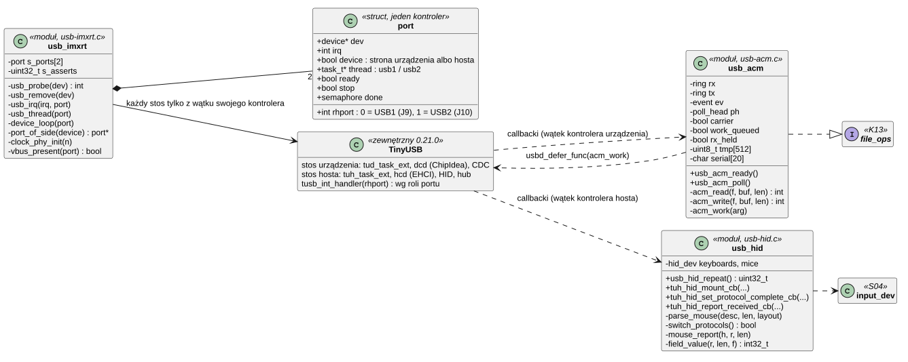
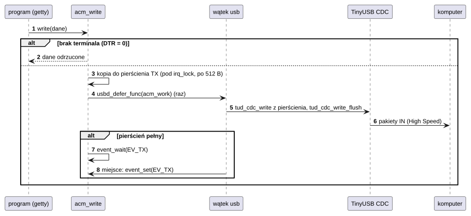
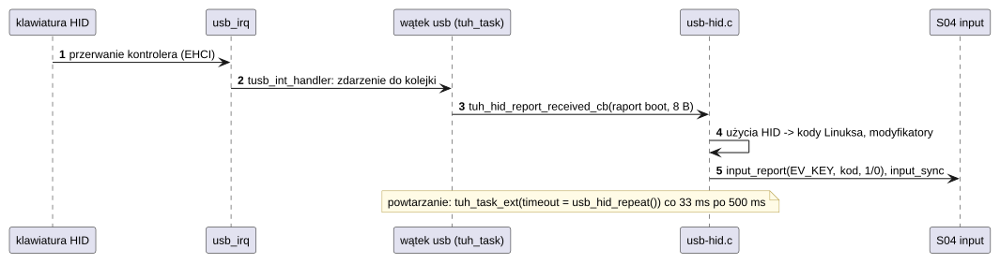
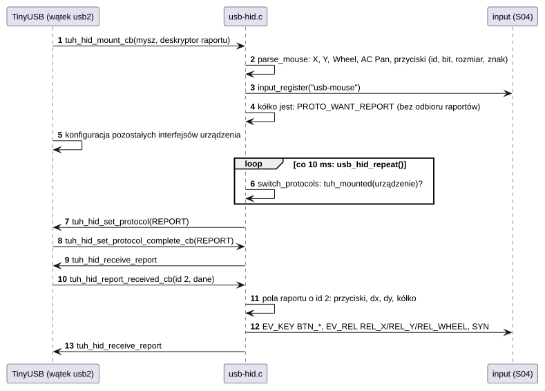

# D06 USB

## 1. Identyfikacja

| | |
|---|---|
| Identyfikator | D06 |
| Warstwa | L1 (moduł `.ko`) |
| Moduł | `usb-imxrt.ko` (`fsl,imxrt1050-usb`) |
| Pliki | `drivers/usb/usb-imxrt.c` (kontrolery, rola, wątki), `usb-acm.c` (urządzenie: port szeregowy CDC ACM, `/dev/ttyACM0`), `usb-hid.c` (host: klawiatury, myszy, huby), `usb.h`, `tusb_config.h`, `tusb_os_custom.h` (warstwa systemu dla TinyUSB); `third_party/tinyusb` (TinyUSB 0.21.0, porty ChipIdea/EHCI) |
| Interfejsy realizowane | `file_ops` `/dev/ttyACM0` (K13, `crtos/tty.h`), urządzenia wejścia (S04) |

## 2. Odpowiedzialność

- Kontrolery USB OTG1 (gniazdo J9) i OTG2 (gniazdo J10) z PLL USB 480 MHz i PHY; rola
  każdego z DT (`dr_mode`): **urządzenie** (domyślnie) albo **host**. Oba mogą pracować
  naraz, jeden jako urządzenie i jeden jako host (na EVKB: J9 – port szeregowy dla
  komputera, J10 – klawiatury i myszy).
- **Urządzenie**: komputer widzi port szeregowy („CRTOS console”, VID 0x1209, PID 0x0001,
  numer seryjny = unikalny ID układu); na płytce `/dev/ttyACM0` z pierścieniami 2 KB,
  sygnałem „terminal podłączony” (DTR) i czekaniem na niego (`TTY_IOC_WAIT_CARRIER`);
  wykrywanie odłączenia kabla (VBUS).
- **Host**: klawiatury HID w protokole boot, myszy HID (protokół boot albo raportów – ta
  z kółkiem w deskryptorze raportu), huby; klawiatura → urządzenie wejścia z kodami Linuksa
  i powtarzaniem klawiszy, mysz → ruch względny, kółka (pionowe i poziome) i przyciski.
- Każdy kontroler ma swój wątek (`usb1`, `usb2`), który obsługuje jego stos TinyUSB
  (urządzenia albo hosta); przerwanie kontrolera tylko kolejkuje zdarzenia jego stosu.

## 3. Wymagania

| ID | Wymaganie | Weryfikacja |
|---|---|---|
| REQ-D06-01 | Stos urządzenia TinyUSB wywołuje tylko wątek kontrolera urządzenia, a stos hosta – tylko wątek kontrolera hosta; funkcje pliku przekazują dane przez pierścienie i zlecają pracę wątkowi, więc przerwanie albo zabicie czytającego/piszącego nie zostawia stosu w połowie operacji. | przegląd kodu |
| REQ-D06-02 | Bez podłączonego terminala `read` zwraca 0, `poll` `POLLHUP`, a zapis jest odrzucany. | test z komputerem (getty, U07) |
| REQ-D06-03 | Odłączenie kabla (VBUS) jest zgłaszane stosowi, nawet gdy port ChipIdea sam go nie wykrywa. | test ręczny (`usb: cable unplugged`) |
| REQ-D06-04 | Nieudane asercje TinyUSB są liczone, nigdy nie zatrzymują procesora (`BKPT`). | przegląd kodu (`tusb_breakpoint`) |
| REQ-D06-05 | Klawiatura USB deklaruje wszystkie swoje klawisze (klawiatura ekranowa się chowa); przytrzymany klawisz powtarza się (500 ms, potem co 33 ms). | test ręczny (tryb host) |
| REQ-D06-06 | Oba kontrolery pracują naraz, najwyżej jeden jako urządzenie i jeden jako host; drugi kontroler o tej samej roli nie startuje (`-EBUSY`), a przerwanie kontrolera trafia tylko do stosu jego roli. | `dmesg` po starcie (29.09.2026: USB1 urządzenie, USB2 host), przegląd kodu |
| REQ-D06-07 | Mysz, której deskryptor raportu (do 512 B) opisuje kółko (Generic Desktop Wheel albo Consumer AC Pan) oraz osie X i Y, jest przełączana na protokół raportów dopiero po skonfigurowaniu całego urządzenia (`tuh_mounted`) i dopiero wtedy zaczyna się odbiór raportów; jej raporty są czytane według deskryptora (identyfikator raportu, położenie i rozmiar pola, znak z minimum logicznego). Mysz bez kółka albo odmowa przełączenia zostawia protokół boot. | parser na komputerze (typowy deskryptor bez identyfikatora i Logitech z identyfikatorem 2 i osiami 12-bitowymi: pola i wartości zgodne), odbiornik 046d:c534 na J10 (30.09.2026: „wheel: report protocol”, kursor się rusza) |
| REQ-D06-08 | Przed włączeniem przerwania kontrolera (`probe`) i w każdym przerwaniu, które przychodzi, zanim stos TinyUSB jest gotowy, sterownik wyłącza przerwania kontrolera (`USBINTR = 0`) i kasuje zgłoszone (`USBSTS`). Kontroler zostawiony w pracy przez poprzedni program (restart przez sondę nie resetuje USB) nie zalewa więc procesora przerwaniami. | burza po restarcie sondą odtworzona i zatrzymana zapisem rejestrów przez SWD, po poprawce kilka restartów bez burzy, oba kontrolery działają (03.10.2026) |

## 4. Interfejs udostępniany

| Rola | Dla kogo | Interfejs |
|---|---|---|
| urządzenie | programy (`getty`, U07) | `/dev/ttyACM0`: `read`, `write`, `poll`, `ioctl` `TTY_IOC_WAIT_CARRIER` (czekaj na DTR), `TTY_IOC_GET_MODE` |
| host | `inputd` (U04) | `/dev/eventN` „usb-keyboard” (`EV_KEY`), „usb-mouse” (`EV_REL` `REL_X`/`REL_Y`/`REL_WHEEL`/`REL_HWHEEL`, `BTN_*`) |

Parametry DT (`&usb1`, `&usb2`): `reg` (0x402E0000 = USB1/J9, 0x402E0200 = USB2/J10),
`interrupts` (113, 112), `dr_mode` (`"peripheral"` albo `"host"`). Na EVKB: `&usb1`
urządzenie, `&usb2` host (włączone też `&usbphy2`).

## 5. Interfejsy wymagane

K02 (przerwania USB, priorytet 6), K05 (wątki `usb1`/`usb2`, priorytet 17, stos 3 KB), K06
(semafory, muteksy dla TinyUSB – `tusb_os_custom.h`), K13 (`devfs_register`), S04,
K12 (`poll`), SDK (`fsl_clock`: PLL USB).

## 6. Struktura statyczna

*Źródło: [D06/struktura-statyczna.puml](../diagramy/D06/struktura-statyczna.puml)*

## 7. Zachowanie dynamiczne

### 7.1 Zapis programu na `/dev/ttyACM0`

*Źródło: [D06/zapis-na-ttyacm0.puml](../diagramy/D06/zapis-na-ttyacm0.puml)*

### 7.2 Klawiatura w trybie host

*Źródło: [D06/klawiatura-w-trybie-host.puml](../diagramy/D06/klawiatura-w-trybie-host.puml)*

### 7.3 Mysz z kółkiem

*Źródło: [D06/mysz-z-kolkiem.puml](../diagramy/D06/mysz-z-kolkiem.puml)*

## 8. Implementacja

- Stan każdego kontrolera w `struct port` (`s_ports[2]`, indeks = `rhport`: 0 USB1,
  1 USB2). Rola wybierana w `probe` z `dr_mode`; kontroler o roli już zajętej przez drugi
  → `-EBUSY` (TinyUSB ma jeden stos urządzenia i jeden stos hosta).
- Restart przez sondę (reset rdzenia) nie resetuje kontrolerów USB: zostają włączone
  przerwania (`USBINTR`) i zgłoszone zdarzenia (`USBSTS`) poprzedniego programu. `quiet()`
  wyłącza je i kasuje przed `irq_request`, a `usb_irq`, dopóki stos nie jest gotowy, robi to
  samo zamiast ignorować przerwanie (przerwanie poziomowe wracałoby bez końca). TinyUSB
  włącza swoje przerwania przy starcie stosu.
- Wątek kontrolera wykonuje `tud_task_ext`/`tuh_task_ext` z limitem 100 ms (sprawdza
  zatrzymanie i VBUS); przerwanie woła `tusb_int_handler(rhport)`, który według roli portu
  (`_tusb_rhport_role`) trafia do sterownika urządzenia (ChipIdea) albo hosta (EHCI).
- Stosy urządzenia i hosta TinyUSB nie dzielą danych ani kolejek, więc dwa wątki pracują
  niezależnie; `tusb_os_custom.h` trzyma stan w obiektach każdego stosu.
- Host sprawdza przy starcie VBUS złącza (na EVKB J10 zasila płytka) i tylko zgłasza jego
  brak.
- Warstwa systemu TinyUSB (`tusb_os_custom.h`): semafory i muteksy jądra, sekcje
  krytyczne `irq_lock`, kolejka pierścieniowa; pamięć modułu jest w pamięci z cache
  (`CFG_TUH_MEM_DCACHE_ENABLE`).
- Detektor ładowarki jest wyłączony (obciążałby linie D+/D−), kalibracja nadajnika PHY jak
  w płytkach NXP.
- Mysz z kółkiem: `parse_mouse` czyta krótkie elementy deskryptora (strona użycia, minimum
  logiczne, rozmiar i liczba pól, identyfikator raportu; użycia lokalne jako lista albo
  zakres) i dla każdego elementu Input zapisuje położenie pól X, Y, Wheel, AC Pan i
  przycisków 1–3 w raporcie jego identyfikatora (do 8 identyfikatorów). Callback montowania
  ustawia wtedy stan `PROTO_WANT_REPORT`; wątek hosta (`usb_hid_repeat`, co 10 ms, dopóki
  któraś mysz czeka) wysyła `SET_PROTOCOL(REPORT)`, gdy `tuh_mounted` – wcześniej potok
  sterujący jest zajęty konfiguracją pozostałych interfejsów. Po potwierdzeniu
  (`tuh_hid_set_protocol_complete_cb`) zaczyna się odbiór; raport jest dekodowany polami
  swojego identyfikatora (bit po bicie, znak z minimum logicznego).

## 9. Obsługa błędów i mechanizmy bezpieczeństwa

| Sytuacja | Reakcja |
|---|---|
| TinyUSB nie wystartował | `E: TinyUSB did not start`, wątek kończy się |
| nieudana asercja TinyUSB | licznik `asserts`, praca trwa dalej |
| odłączenie kabla | zdarzenie `DCD_EVENT_UNPLUGGED`, `carrier = 0` |
| zamknięcie terminala na komputerze | `POLLHUP`, `read` = 0 (getty kończy powłokę) |
| drugi kontroler o tej samej roli | `-EBUSY`, komunikat `one USB device/host at a time` |
| brak 5 V na złączu hosta | komunikat przy starcie (`no 5 V on the connector yet`), host działa dalej |
| kontroler zostawiony w pracy (restart przez sondę), przerwanie przed startem stosu | przerwania kontrolera wyłączone i skasowane (REQ-D06-08) |

## 10. Konfiguracja

`dr_mode` w `dts/evkbimxrt1050.dts`; `tusb_config.h` (klasy, bufory,
`CFG_TUH_ENUMERATION_BUFSIZE` 512 – mieści deskryptor raportu); `RING_SIZE` (2048),
`CHUNK` (512), `IDLE_WAIT_MS` (100), `PENDING_WAIT_MS` (10), `REPORT_IDS` (8).

## 11. Weryfikacja

- Tryb urządzenia (27.09.2026): wyliczenie High Speed, port COM6 na Windows, powłoka,
  Ctrl-C, Backspace, ok. 280 KB/s płytka→komputer ([Debugowanie](../../debugowanie.md)).
- Tryb host: kontroler startuje (USBMODE = host, zasilanie portu); pełne wyliczenie wymaga
  klawiatury/myszy z przejściówką OTG (test ręczny).
- Dwa kontrolery naraz (29.09.2026): po starcie USB1 (J9) jako urządzenie – połączenie
  z komputerem High Speed, `/dev/ttyACM0` – i USB2 (J10) jako host (USBMODE = 3, PHY
  włączony, zasilanie portu, VBUS J10 = 5 V z płytki).
- Mysz z kółkiem (30.09.2026): `parse_mouse` skompilowany na komputerze dla dwóch
  deskryptorów (typowy bez identyfikatorów, Logitech z identyfikatorem 2, osiami 12-bitowymi
  i AC Pan) – pola i wartości przykładowych raportów zgodne; odbiornik Logitech 046d:c534 na
  J10 (klawiatura i mysz) – mysz w protokole raportów, kursor się porusza.

- Burza przerwań po restarcie (ISS-29, 03.10.2026): przy zawieszonym systemie odczyt przez
  SWD pokazał zgłoszone i włączone przerwania obu kontrolerów przed startem TinyUSB; zapis
  `USBINTR = 0` i skasowanie `USBSTS` przez SWD przywróciły system; po poprawce kolejne
  restarty bez burzy, `/dev/ttyACM0` i mysz na J10 działają.

## 12. Ograniczenia i znane problemy

- Najwyżej jeden kontroler urządzenia i jeden kontroler hosta; host obsługuje klawiatury
  (protokół boot), myszy (boot albo raportów) i huby – żadnych innych klas.
- Parser deskryptora nie zna elementów długich, `Push`/`Pop` ani tablicowych pól myszy;
  deskryptor dłuższy niż 512 B jest pomijany (mysz zostaje w protokole boot).
- Moduł jest duży (ok. 63 KB w OCRAM) i nie jest przypięty – `rmmod` zatrzymuje wątek
  (`kthread_stop`) i stos TinyUSB.
