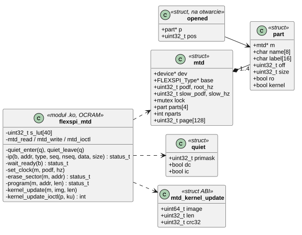
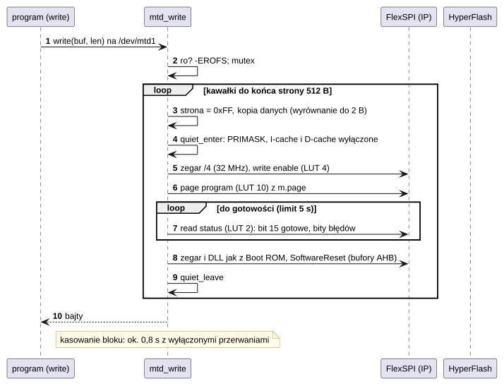
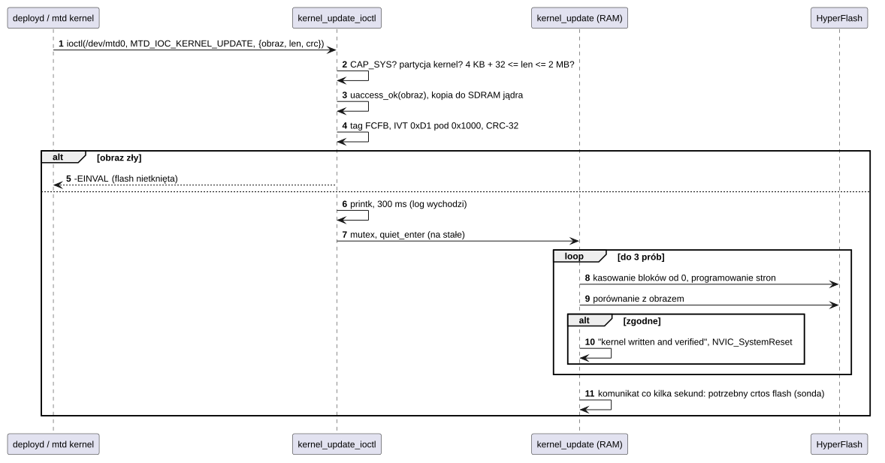

# D07 Pamięć flash (MTD) i aktualizacja jądra

## 1. Identyfikacja

| | |
|---|---|
| Identyfikator | D07 |
| Warstwa | L1 (moduł `.ko`) |
| Moduł | `flexspi-mtd.ko` (`fsl,imxrt1050-flexspi`) |
| Pliki | `drivers/mtd/flexspi-mtd.c`; SDK `fsl_flexspi.c`; sekwencje LUT z przykładu NXP `flexspi/hyper_flash` (BSD-3-Clause) |
| Interfejs | `kernel/include/crtos/mtd.h` (`/dev/mtdN`: `MEMGETINFO`, `MEMERASE`, `MTD_IOC_KERNEL_UPDATE`; dla modułów: `mtd_part_*`) |

## 2. Odpowiedzialność

- HyperFlash S26KS512S (64 MB) na FlexSPI – ta sama pamięć, z której działa jądro (XIP).
- Partycje z DT jako pliki `/dev/mtd0` (`kernel`, 2 MB, tylko odczyt) i `/dev/mtd1`
  (`flash0`, 62 MB, system plików `/flash0`, D10): odczyt przez okno pamięci, kasowanie
  bloków 256 KB, programowanie (stron 512 B, dowolna długość i wyrównanie).
- Dostęp dla innych modułów (`mtd_part_*`, eksportowane): partycja po węźle DT, geometria
  i okno pamięci, zajęcie (`claim`), programowanie, kasowanie.
- Kasowanie i programowanie z kodu w RAM przy wyłączonych przerwaniach i pamięciach
  podręcznych (żadna instrukcja nie może być w tym czasie pobierana z flash).
- **Aktualizacja jądra** (`MTD_IOC_KERNEL_UPDATE`): sprawdzenie obrazu, zapis, weryfikacja
  i restart – bez powrotu do starego jądra.

## 3. Wymagania

| ID | Wymaganie | Weryfikacja |
|---|---|---|
| REQ-D07-01 | Partycja `kernel` i każda partycja zaczynająca się w pierwszym bloku (nagłówek startowy) są tylko do odczytu (`-EROFS`), niezależnie od DT. | `mtd info`, przegląd kodu |
| REQ-D07-02 | W czasie kasowania/programowania wszystkie przerwania są zamaskowane, I-cache i D-cache wyłączone, a kod działa z RAM (OCRAM). | przegląd kodu, `mtd test` |
| REQ-D07-03 | Programowanie odbywa się przy zegarze FlexSPI ¼ (32 MHz, limit HyperFlash dla danych programowania); zegar i DLL wracają dokładnie do wartości z Boot ROM. | `mtd test` (0 różnic), start po aktualizacji |
| REQ-D07-04 | Aktualizacja jądra wymaga `CAP_SYS` i jest odrzucana (`-EINVAL`, flash nietknięta), jeśli obraz nie ma nagłówka FCFB i IVT albo suma CRC-32 się nie zgadza. | `crtos flash --net` ze złym plikiem (27.09.2026: `ERR Invalid argument`) |
| REQ-D07-05 | Zapisane jądro jest porównywane z obrazem; przy niezgodności zapis jest powtarzany (3 próby); po sukcesie następuje restart. | `crtos flash --net` (27.09.2026: nowe jądro wystartowało) |
| REQ-D07-06 | Kasowanie przyjmuje tylko całe bloki w granicach partycji (`-EINVAL`). | przegląd kodu |
| REQ-D07-07 | Partycja zajęta przez moduł (`mtd_part_claim`) odrzuca zapis i kasowanie przez `/dev/mtdN` (`-EBUSY`); `mtd_part_program`/`erase` działają tylko w granicach partycji, nie na partycji tylko do odczytu. | `mtd write mtd1` przy zamontowanym `/flash0` → `EBUSY` |
| REQ-D07-08 | Po każdym programowaniu i kasowaniu bufory AHB FlexSPI są resetowane, a pamięci podręczne unieważnione: odczyt przez okno (także kod wykonywany z flash) widzi nowe dane. | `flashtest.sh` (odczyt po zapisie, `flashfs check`), programy XIP (K16) |

## 4. Interfejs udostępniany

| Operacja | Opis | Wynik |
|---|---|---|
| `open`/`close` `/dev/mtdN` | pozycja na otwarcie (`CAP_DEV`) | |
| `read(buf, len)` | kopia z okna 0x60000000 + przesunięcie partycji (pod mutexem) | bajty, 0 na końcu |
| `write(buf, len)` | programowanie od pozycji: bity 1 → 0 (miejsce musi być skasowane) | bajty, `-EROFS`, `-ENOSPC`, `-EIO`, `-ETIMEDOUT` |
| `lseek`, `fstat` | pozycja, rozmiar partycji | |
| `MEMGETINFO` | `struct mtd_info_user`: typ NOR, flagi zapisu, rozmiar, blok 256 KB, `writesize` 1 | 0 |
| `MEMERASE {start, length}` | kasowanie bloków (wielokrotności 256 KB) | 0, `-EINVAL`, `-EROFS`, `-EIO` |
| `MTD_IOC_KERNEL_UPDATE {image, len, crc32}` (na `/dev/mtd0`) | nowe jądro i restart; wraca tylko przy odmowie | `-EPERM`, `-EINVAL`, `-EFAULT`, `-ENOMEM` |
| `mtd_part_of_node(np)` | partycja o węźle DT `np` (dla modułów) | wskaźnik albo `NULL` |
| `mtd_part_geometry(p, g)` | rozmiar, blok kasowania, adres okna | 0 |
| `mtd_part_claim(p, owner)`, `mtd_part_release(p)` | zajęcie partycji: `/dev/mtdN` nie zapisze | 0, `-EBUSY`, `-EROFS` |
| `mtd_part_program(p, off, buf, len)` | programowanie (bity 1 → 0) | 0, `-EINVAL`, `-EROFS`, `-EIO` |
| `mtd_part_erase(p, off, len)` | kasowanie całych bloków | 0, `-EINVAL`, `-EROFS`, `-EIO` |

Parametry DT: węzeł `&flexspi` z dzieckiem `flash@0` i `partitions` (`label`, `reg`,
`read-only`).

## 5. Interfejsy wymagane

K08 (`capable`, `uaccess_ok`), K13 (`devfs_register`), K07 (kopia obrazu w SDRAM), K05
(`task_sleep_ms` przed aktualizacją), K06 (mutex), SDK (`fsl_flexspi`, `fsl_clock`, CMSIS
cache), `crc32` jądra. Użytkownicy: `mtd` (A03), `deployd` (U06) → `crtos flash --net`
(T01).

## 6. Struktura statyczna

*Źródło: [D07/struktura-statyczna.puml](../diagramy/D07/struktura-statyczna.puml)*

## 7. Zachowanie dynamiczne

### 7.1 Zapis strony

*Źródło: [D07/zapis-strony.puml](../diagramy/D07/zapis-strony.puml)*

### 7.2 Aktualizacja jądra

*Źródło: [D07/aktualizacja-jadra.puml](../diagramy/D07/aktualizacja-jadra.puml)*

## 8. Implementacja

- Moduł leży w OCRAM (kod `KM_EXEC`), więc działa bez flash. Sekwencje LUT FlexSPI 2..11
  (odczyt statusu, write enable, kasowanie sektora, programowanie strony) są instalowane
  w `probe` w sekcji „cichej”; sekwencja 0 (odczyt XIP z Boot ROM) nie jest zmieniana.
- Zegar FlexSPI: korzeń 261,8 MHz (PFD0 PLL3), `PODF` 0 → 130 MHz DDR; przy programowaniu
  `PODF` 3 → 32 MHz; `FLEXSPI_UpdateDllValue` odtwarza DLL (0x79).
- Po kasowaniu i programowaniu `FLEXSPI_SoftwareReset` czyści bufory AHB (stare dane
  z okna XIP).
- `kernel_update` nie wraca: stary kod jądra (XIP) nie może się już wykonać, bo flash jest
  kasowana.
- Czasy: strona 512 B ok. 0,8 ms, 256 KB zapisu ok. 0,4 s, kasowanie bloku z danymi ok.
  0,8 s (pusty ok. 11 ms); aktualizacja 240 KB ok. 2 s + restart.

## 9. Obsługa błędów i mechanizmy bezpieczeństwa

| Sytuacja | Reakcja |
|---|---|
| zapis/kasowanie partycji tylko do odczytu | `-EROFS` |
| błąd programowania/kasowania (bity statusu 0x3200) | `-EIO` |
| brak gotowości w 5 s | `-ETIMEDOUT` |
| obraz jądra zły, brak `CAP_SYS` | odmowa bez zmian we flash |
| weryfikacja nieudana 3 razy | komunikat na UART co kilka sekund; naprawa sondą (`crtos flash`) |
| odcięcie zasilania w trakcie aktualizacji | płytka nie startuje; naprawa sondą (tryb awaryjny SW8 nie pomaga) |

## 10. Konfiguracja

`SECTOR` (256 KB), `PAGE` (512 B), `MAX_PARTS` (4), `BUSY_TIMEOUT_S` (5); partycje w
`dts/evkbimxrt1050.dts`.

## 11. Weryfikacja

- `crtos run mtd info`, `mtd test mtd1 0x100000` (kasowanie, wzór, porównanie,
  przywrócenie danych; 27.09.2026: 0 różnic).
- `crtos flash --net` z poprawnym i z uszkodzonym obrazem (27.09.2026).

## 12. Ograniczenia i znane problemy

- W czasie kasowania/programowania **cały system stoi** (do ok. 0,8 s): sieć i UART mogą
  gubić dane, tyknięcia są nadrabiane (K05).
- Brak obrazu zapasowego jądra (A/B): nieudana aktualizacja wymaga sondy.
- Surowy dostęp do `/dev/mtd1` jest zablokowany, gdy działa `flashfs` (D10). Bez modułu
  `flashfs` partycja jest zwykłym obszarem na dane.
