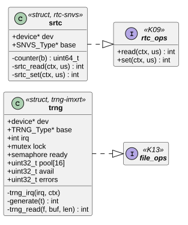
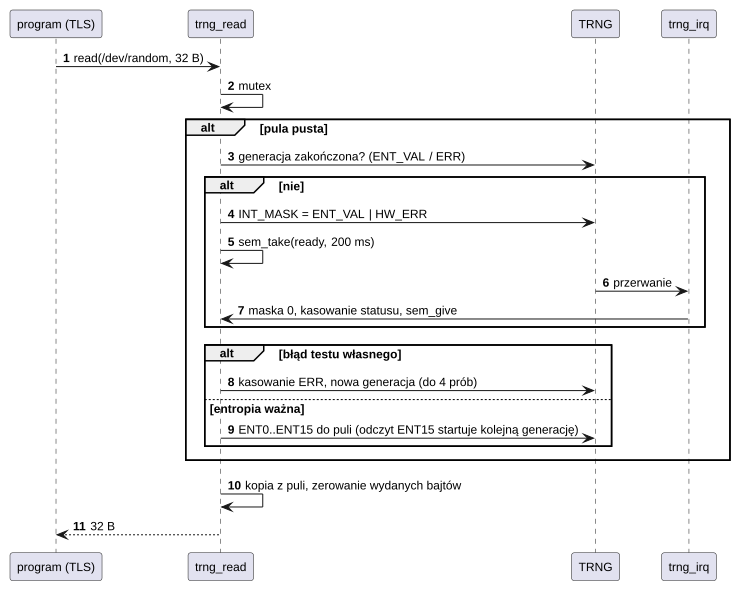
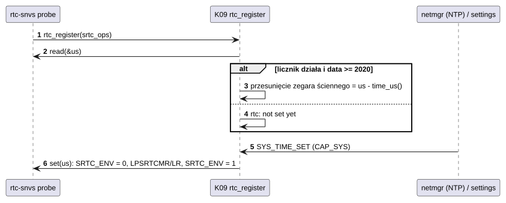

# D08 Generator liczb losowych i zegar RTC

## 1. Identyfikacja

| | |
|---|---|
| Identyfikator | D08 |
| Warstwa | L1 (moduły `.ko`) |
| Moduły | `trng-imxrt.ko` (`fsl,imxrt1050-trng`), `rtc-snvs.ko` (`fsl,imxrt1050-snvs-rtc`) |
| Pliki | `drivers/misc/trng-imxrt.c` (+ SDK `fsl_trng.c`), `drivers/rtc/rtc-snvs.c` |
| Interfejsy realizowane | `file_ops` `/dev/random`, `/dev/urandom` (K13); `rtc_ops` (K09, `crtos/rtc.h`) |

## 2. Odpowiedzialność

- **trng-imxrt**: sprzętowy generator liczb prawdziwie losowych (oscylator pierścieniowy
  z testami statystycznymi): 512 bitów entropii na generację, każdy bit wydawany raz,
  bez programowej puli, którą dałoby się przewidzieć; źródło kluczy TLS przeglądarki
  (A02) i losowości programów.
- **rtc-snvs**: licznik SRTC domeny SNVS_LP (32,768 kHz, 47 bitów), który nie jest
  zerowany resetem (a z baterią na VDD_SNVS także wyłączeniem zasilania); źródło daty
  zegara ściennego po starcie i miejsce zapisu daty ustawionej przez NTP albo program
  Settings.

## 3. Wymagania

| ID | Wymaganie | Weryfikacja |
|---|---|---|
| REQ-D08-01 | Odczyt `/dev/random` zwraca wyłącznie bity z generacji, której testy własne się powiodły; bity są zerowane po wydaniu. | przegląd kodu |
| REQ-D08-02 | Nieudany test własny TRNG jest kasowany i generacja powtarzana (do 4 razy), potem odczyt kończy się `-EIO`. | przegląd kodu |
| REQ-D08-03 | Jeden czytelnik naraz; odczyt ≤ 4096 B na wywołanie; limit czasu generacji 200 ms. | przegląd kodu |
| REQ-D08-04 | Licznik SRTC jest odczytywany do dwóch zgodnych odczytów (spójność połówek 47-bitowej wartości). | przegląd kodu |
| REQ-D08-05 | Nieustawiony licznik (SRTC wyłączony) nie podaje daty (`-EAGAIN`); data sprzed 2020 r. jest ignorowana przez jądro. | przegląd kodu, start po wyjęciu baterii |

## 4. Interfejs udostępniany

| Moduł | Interfejs | Opis |
|---|---|---|
| `trng-imxrt` | `/dev/random`, `/dev/urandom` (bez `CAP_DEV`) | `read(buf, len)`: bajty entropii (czeka na generację), `-EIO`, `-EINTR` |
| `rtc-snvs` | `rtc_register(ops)` (K09) | `read(&us)`: µs od 1970 albo `-EAGAIN`; `set(us)`: zatrzymanie licznika, zapis, start |

Zegar ścienny (`SYS_TIME_GET`/`SYS_TIME_SET`, `settimeofday`) obsługuje K09; `rtc-snvs`
jest tylko jego trwałym zapisem.

## 5. Interfejsy wymagane

K02 (przerwanie TRNG, priorytet 8), K06 (mutex, semafor), K13 (`devfs_register`), K09
(`rtc_register`), S01 (zegar TRNG), SDK (`fsl_trng`).

## 6. Struktura statyczna

*Źródło: [D08/struktura-statyczna.puml](../diagramy/D08/struktura-statyczna.puml)*

## 7. Zachowanie dynamiczne

### 7.1 Odczyt entropii

*Źródło: [D08/odczyt-entropii.puml](../diagramy/D08/odczyt-entropii.puml)*

### 7.2 Data przy starcie i jej ustawienie

*Źródło: [D08/data-przy-starcie.puml](../diagramy/D08/data-przy-starcie.puml)*

## 8. Implementacja

- TRNG: po każdej generacji 16 słów (512 bitów); odczyt `ENT15` uruchamia następną
  generację, więc kolejne odczyty zwykle czekają kilka milisekund. Przerwanie jest
  odmaskowywane tylko na czas czekania.
- SRTC: licznik w jednostkach 1/32768 s od 1970; zapis wymaga zatrzymania licznika
  (`LPCR.SRTC_ENV`) i trwa kilka cykli zegara 32 kHz (aktywne czekanie, bez timera).

## 9. Obsługa błędów i mechanizmy bezpieczeństwa

| Sytuacja | Reakcja |
|---|---|
| testy statystyczne TRNG zawodzą | 4 próby, potem `-EIO` i `E: no entropy` |
| brak przerwania TRNG w 200 ms | kolejna próba |
| SRTC nie zmienia stanu (włączenie/wyłączenie) | `-ETIMEDOUT` |
| drugi zegar RTC | `rtc_register` zwraca `-EBUSY` |

## 10. Konfiguracja

`ENT_WORDS` (16), `WAIT_MS` (200), `ATTEMPTS` (4), `READ_MAX` (4096); domyślna
konfiguracja SDK TRNG.

## 11. Weryfikacja

- HTTPS w przeglądarce NetSurf (klucze z `/dev/random`); `crtos kmon cat /dev/random`
  (podgląd), log startu `rtc: ... the date comes from it`.
- Data zachowana po `crtos reboot` (bez NTP).

## 12. Ograniczenia i znane problemy

- Brak testów statystycznych po stronie oprogramowania (poleganie na testach sprzętowych
  TRNG).
- EVKB nie ma baterii zegara w konfiguracji użytkownika: po odcięciu zasilania data ginie
  do pierwszej synchronizacji NTP.
