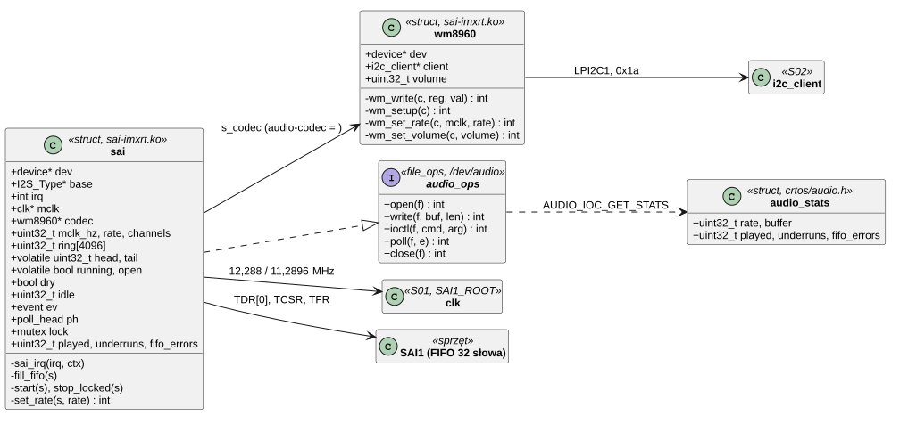
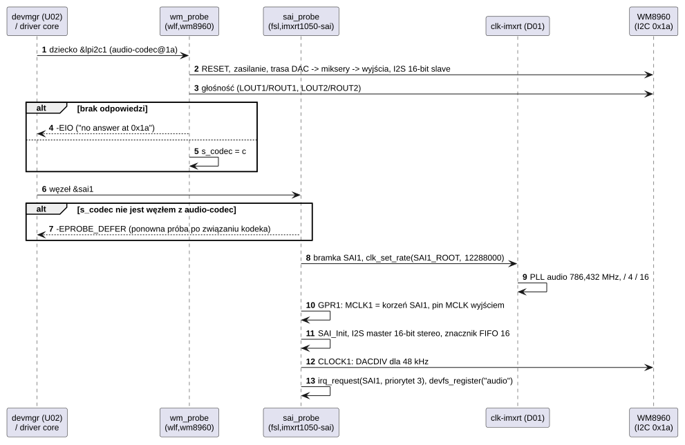
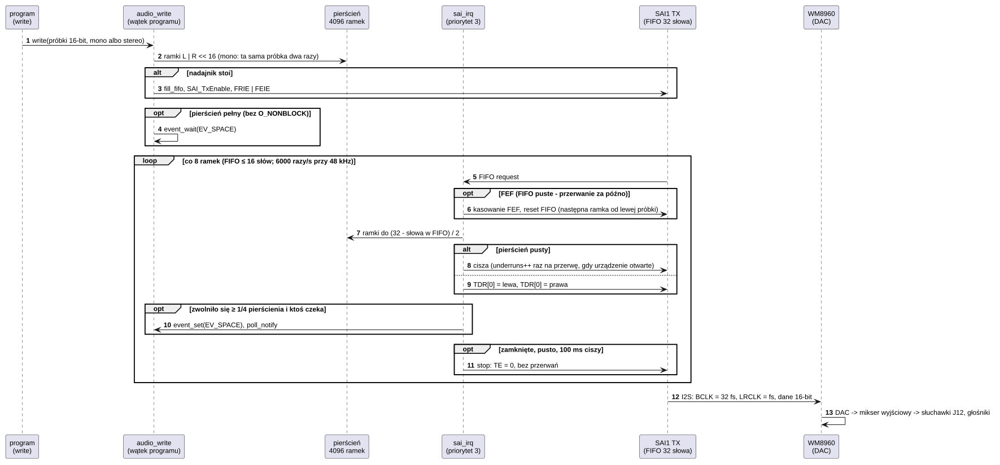

# D09 Dźwięk: SAI i kodek WM8960

## 1. Identyfikacja

| | |
|---|---|
| Identyfikator | D09 |
| Warstwa | L1 (moduł `.ko`) |
| Moduł | `sai-imxrt.ko` (`fsl,imxrt1050-sai`, `wlf,wm8960`) |
| Pliki | `drivers/sound/sai-imxrt.c` (+ SDK `fsl_sai.c`), `kernel/include/crtos/audio.h` |
| Interfejsy realizowane | `file_ops` `/dev/audio` (K13); klient I2C (S02) |

## 2. Odpowiedzialność

Wyjście dźwięku płytki. W module są dwa sterowniki:

- **wm8960**: kodek Cirrus Logic (Wolfson) WM8960 na LPI2C1 (adres 0x1a). Ustawia tylko
  odtwarzanie: DAC przez miksery wyjściowe do gniazda słuchawek J12 i wyjść głośnikowych
  (klasa D). Kodek jest podrzędny I2S, a zegar systemowy dostaje z pinu MCLK procesora.
  Rejestry kodeka są tylko do zapisu (9 bitów danych).
- **sai-imxrt**: nadajnik SAI1 jako nadrzędny I2S (zegar bitowy i ramki z zegara MCLK),
  16-bitowe próbki stereo. Programy piszą próbki do `/dev/audio`; sterownik przenosi je
  przez pierścień do kolejki FIFO nadajnika w przerwaniu.

Nagrywania (ADC, mikrofon) sterownik nie obsługuje.

## 3. Wymagania

| ID | Wymaganie | Weryfikacja |
|---|---|---|
| REQ-D09-01 | Przerwanie SAI tylko uzupełnia FIFO całymi ramkami (lewa, prawa próbka) z pierścienia albo ciszą; nie blokuje i nie używa I2C. | przegląd kodu |
| REQ-D09-02 | Po błędzie FIFO (FIFO puste, bo przerwanie przyszło za późno) nadajnik zaczyna następną ramkę od lewej próbki (reset FIFO), więc kanały nie zamieniają się stronami; błąd jest liczony. | przegląd kodu, `audio` (licznik „FIFO errors”) |
| REQ-D09-03 | Do `/dev/audio` pisze jeden proces naraz: kolejne otwarcie do zapisu kończy się `-EBUSY`. Otwarcie tylko do odczytu daje stan i głośność, a zapis przez nie kończy się `-EBADF`. | `audio` w trakcie gry (27.09.2026) |
| REQ-D09-04 | Gdy pierścień jest pusty, nadajnik wysyła ciszę. 100 ms po zamknięciu urządzenia i odtworzeniu wszystkiego nadajnik i jego przerwania są wyłączone. | przegląd kodu |
| REQ-D09-05 | Częstotliwość próbkowania to jedna z 8000, 11025, 12000, 16000, 22050, 24000, 32000, 44100, 48000 Hz; zegar MCLK (12,288 albo 11,2896 MHz) i dzielnik DAC kodeka muszą ją dawać dokładnie, inaczej `-EINVAL`. | przegląd kodu, `audio tone 440 2000` (96000 ramek w 2 s) |
| REQ-D09-06 | `write` przyjmuje tylko całe ramki i nie więcej, niż mieści pierścień; z `O_NONBLOCK` zwraca liczbę przyjętych bajtów albo `-EAGAIN`. | przegląd kodu |

## 4. Interfejs udostępniany

`/dev/audio` (`crtos/audio.h`), bez uprawnienia `CAP_DEV` (K09):

| Operacja | Działanie | Błędy |
|---|---|---|
| `open` do zapisu | jeden proces naraz; 48000 Hz, 2 kanały | `-EBUSY` |
| `open` tylko do odczytu | stan i głośność obok programu, który gra | — |
| `write(próbki, len)` | 16-bit ze znakiem, little endian, kanały na przemian; czeka na miejsce | `-EAGAIN` (`O_NONBLOCK`), `-EBADF` (tylko do odczytu), `-EINTR` |
| `AUDIO_IOC_SET_RATE` / `GET_RATE` | częstotliwość (odrzuca to, co w kolejce) | `-EINVAL` |
| `AUDIO_IOC_SET_CHANNELS` | 1 (mono na obie strony) albo 2 | `-EINVAL` |
| `AUDIO_IOC_GET_QUEUED` / `GET_SPACE` | ramki w kolejce (pierścień + FIFO) / wolne miejsce | — |
| `AUDIO_IOC_SET_VOLUME` / `GET_VOLUME` | 0–100 dla słuchawek i głośników, zostaje po zamknięciu | `-EIO` (I2C) |
| `AUDIO_IOC_DRAIN` / `FLUSH` | czeka na odtworzenie wszystkiego / odrzuca kolejkę | `-EINTR` |
| `AUDIO_IOC_GET_STATS` | `struct audio_stats`: częstotliwość, pojemność, odtworzone ramki, przerwy, błędy FIFO | — |
| `poll` | `POLLOUT`, gdy w pierścieniu jest miejsce | — |

Parametry DT: węzeł `sai1` w `dts/imxrt1052.dtsi` (`reg`, `interrupts = <56>`, `clocks` –
bramka `SAI1` i korzeń `SAI1_ROOT`, `clock-names = "bus", "mclk"`); na płytce `&sai1` z grupą
pinów (MCLK, TX_BCLK, TX_SYNC, TX_DATA00) i `audio-codec = <&wm8960>`; kodek jako dziecko
`&lpi2c1` (`compatible = "wlf,wm8960"`, `reg = <0x1a>`).

## 5. Interfejsy wymagane

S02 (`i2c_client_get`, `i2c_write`), S01 i D01 (bramka `IMXRT1050_CLK_SAI1`, korzeń
`IMXRT1050_CLK_SAI1_ROOT` z `clk_set_rate`: PLL audio), K02 (`irq_request`, priorytet 3), K06
(zdarzenie, mutex), K12 (`poll_head`), K13 (`devfs_register`), K17 (`of_parse_phandle`),
SDK (`fsl_sai`: konfiguracja I2S i dzielnika zegara bitowego).

## 6. Struktura statyczna

*Źródło: [D09/struktura-statyczna.puml](../diagramy/D09/struktura-statyczna.puml)*

## 7. Zachowanie dynamiczne

### 7.1 Start sterownika

*Źródło: [D09/start-sterownika.puml](../diagramy/D09/start-sterownika.puml)*

### 7.2 Odtwarzanie

*Źródło: [D09/odtwarzanie.puml](../diagramy/D09/odtwarzanie.puml)*

## 8. Implementacja

- Zegar: korzeń SAI1 = PLL audio / 4 / 16. `clk-imxrt` ustawia PLL audio na 64-krotność
  żądanej częstotliwości (786,432 MHz dla 12,288 MHz, 722,5344 MHz dla 11,2896 MHz;
  licznik ułamka w milionowych częściach 24 MHz, więc wartości są dokładne). Pin MCLK
  (GPIO_AD_B1_09) dostaje ten zegar przez `IOMUXC_GPR->GPR1` (`SAI1_MCLK1_SEL = 0`,
  `SAI1_MCLK_DIR = 1`). MCLK płynie stale; nadajnik włącza się tylko na czas odtwarzania.
- SAI: I2S (ramka 2 × 16 bitów, synchronizacja o bit wcześniej), zegar bitowy 32 · fs
  z MCLK (`SAI_TxSetBitClockRate`), znacznik FIFO 16 słów: przerwanie „FIFO request”
  dopisuje 8 ramek. Przy 48 kHz to 6000 przerwań na sekundę; zapas do opróżnienia FIFO
  to 167 µs.
- Kodek: `R15` reset; `R25` VMID 2 × 50 kΩ i VREF; `R26` DAC L/P, wyjście słuchawkowe 1,
  głośniki; `R47` miksery wyjściowe; `R7` I2S 16 bitów, podrzędny; `R34`/`R37` DAC do
  mikserów; `R10`/`R11` głośność cyfrowa 0 dB; `R49` oba wyjścia klasy D; `R5` DAC bez
  wyciszenia. `R4` (CLOCK1): DACDIV = MCLK / 256 / fs (1; 1,5; 2; 3; 4; 5,5; 6).
  Głośność 0–100 → `R2`/`R3`/`R40`/`R41` 0x30–0x7F (1 dB na krok, 0 wyłącza), zmiana przy
  przejściu przez zero.
- Pierścień: 4096 ramek (32 bity: lewa | prawa << 16; mono jest powielane przy `write`),
  jeden piszący (wątek programu) i jeden czytający (przerwanie), bez blokady na dane;
  `head` jest publikowany po zapisaniu próbek.
- Liczniki: `played` (ramki z pierścienia), `underruns` (przerwy w danych przy otwartym
  urządzeniu, raz na przerwę), `fifo_errors` (FEF).

Pomiary (27.09.2026): `audio tone 440 2000` – 96000 ramek, 0 przerw, 0 błędów FIFO; gry
w emulatorze NES przez ok. 110 s – 0 przerw, 0 błędów FIFO.

## 9. Obsługa błędów i mechanizmy bezpieczeństwa

| Sytuacja | Reakcja |
|---|---|
| kodek nie odpowiada na I2C | sterownik kodeka się nie wiąże („no answer at 0x1a”), `/dev/audio` nie powstaje |
| kodek jeszcze niezwiązany | `-EPROBE_DEFER` dla SAI |
| FIFO puste (przerwanie za późno) | reset FIFO, następna ramka od lewej próbki, `fifo_errors++` |
| brak danych w pierścieniu | cisza, `underruns++` |
| nieobsługiwana częstotliwość / liczba kanałów | `-EINVAL` |
| drugi piszący | `-EBUSY` |
| usunięcie modułu | kodek wyciszony i wyłączony, nadajnik zatrzymany |

## 10. Konfiguracja

`RING` (4096 ramek), `WATERMARK` (16 słów), priorytet przerwania 3, głośność początkowa 80;
węzły DT jak w rozdz. 4.

## 11. Weryfikacja

- `audio tone [Hz [ms]]` (A03): sinus 48 kHz, potem `audio` – liczba odtworzonych ramek
  musi odpowiadać długości tonu, przerwy i błędy FIFO 0.
- `audio -v N`, `audio play plik.wav`, słuchawki w J12 (ręcznie).
- Emulator NES (program użytkownika) jako długi test ciągłego strumienia.

## 12. Ograniczenia i znane problemy

- Tylko odtwarzanie, jeden strumień naraz (brak miksowania programów), tylko 16 bitów.
- Bez DMA: przerwanie co 8 ramek (ok. 1 % CPU przy 48 kHz); sekcje `irq_lock()` dłuższe niż
  ~160 µs dają błąd FIFO (krótka cisza).
- Pad GPIO_AD_B1_13 (dane do kodeka, SAI1_TX_DATA00) to jedyny dostępny pad wejścia SPI
  (LPSPI3 SDI, złącze kamery J35): przy włączonym dźwięku SPI na J24 tylko nadaje (D02).
- Bez wykrywania wtyczki słuchawek: grają jednocześnie słuchawki i wyjścia głośnikowe.
- Przy starcie kodeka (reset, VMID) może być słychać trzask.
