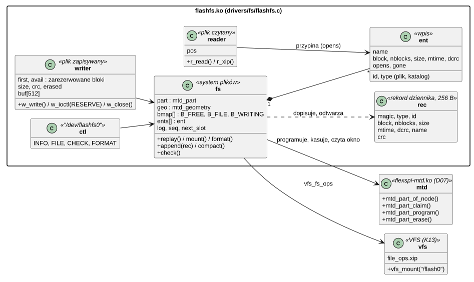
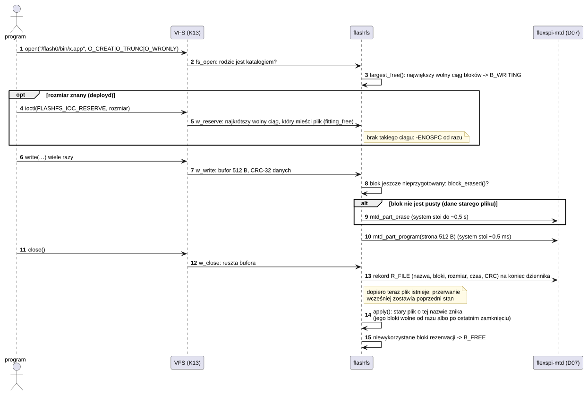
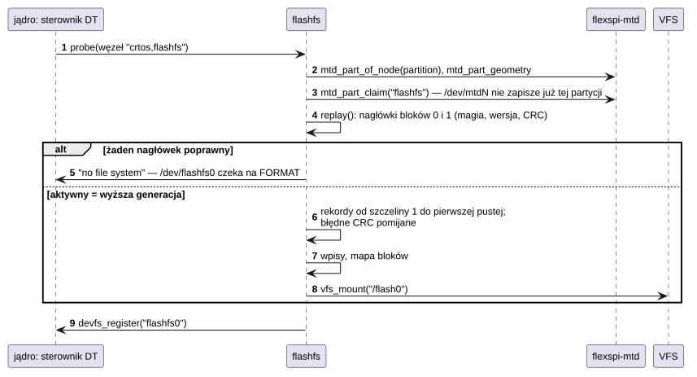

# D10 System plików flash: /flash0

## 1. Identyfikacja

| | |
|---|---|
| Identyfikator | D10 |
| Warstwa | L1 (moduł `.ko`) |
| Moduł | `flashfs.ko` (`crtos,flashfs`), zależy od `flexspi-mtd.ko` (D07, `MODULE_DEPENDS`) |
| Pliki | `drivers/fs/flashfs.c`; ABI `kernel/include/crtos/flashfs.h`; polecenie `system/commands/flashfs`; test `drivers/fs/test/flashtest.sh` |
| Interfejs | montowanie `/flash0` (`vfs_fs_ops`, K13), `file_ops.xip`, urządzenie `/dev/flashfs0` |

Opis dla użytkownika: [Sterowniki: /flash0](../../sterowniki.md#dysk-flash0).

## 2. Odpowiedzialność

- **System plików na partycji** `flash0` HyperFlash (62 MB za jądrem):
  - katalogi, pliki, czas zapisu, `stat`, `readdir`, `rename`, `unlink`, `statfs`.
- **Pliki ciągłe** (całe bloki kasowania 256 KB), widoczne w przestrzeni adresowej. Program
  z `/flash0` może wykonywać kod w miejscu (`file_ops.xip`, K16).
- **Odporność na przerwanie zapisu**:
  - dziennik rekordów z CRC-32;
  - rekord pliku dopiero po jego danych;
  - dwa bloki dziennika na zmianę (kompaktowanie).
- **Przypięcie otwartych plików**: plik usunięty albo zastąpiony w czasie, gdy jest otwarty
  (działający program), zachowuje swoje bloki do ostatniego zamknięcia.
- **Kontrola danych** (CRC-32 każdego pliku), informacje i formatowanie przez `/dev/flashfs0`.

## 3. Wymagania

| ID | Wymaganie | Weryfikacja |
|---|---|---|
| REQ-D10-01 | Plik pojawia się w systemie plików dopiero po zapisaniu wszystkich jego danych (rekord dziennika na końcu); zapis przerwany resetem zostawia poprzedni stan: bez nowego pliku, stary plik o tej nazwie nietknięty. | reset w trakcie kopiowania 4,4 MB (29.09.2026) |
| REQ-D10-02 | Nagłówek i każdy rekord dziennika mają CRC-32; montowanie odtwarza tylko poprawne rekordy aktywnego dziennika (wyższa generacja), uszkodzone pomija. | przegląd kodu, reset w trakcie zapisu |
| REQ-D10-03 | Dane pliku są jednym ciągiem bloków w oknie pamięci flash; plik otwarty nie jest przenoszony ani kasowany, a bloki pliku usuniętego lub zastąpionego w czasie otwarcia wracają do puli dopiero po ostatnim zamknięciu. | przegląd kodu, program XIP z `/flash0` (K16) |
| REQ-D10-04 | Blok jest kasowany przed pierwszym programowaniem, jeśli nie jest pusty; zwolnionego bloku nie kasuje się aż do ponownego użycia. | `flashtest.sh`, zapis na blokach po przerwanym pliku (`flashfs check`: 0 uszkodzeń) |
| REQ-D10-05 | Partycja jest zajęta przez system plików: zapis i kasowanie przez `/dev/mtdN` zwracają `-EBUSY`. | `mtd write mtd1 …` → `Device or resource busy` |
| REQ-D10-06 | Formatowanie tylko przez `FLASHFS_IOC_FORMAT` z `CAP_SYS`, gdy żaden plik nie jest otwarty; moduł nigdy nie formatuje sam (bez systemu plików tylko komunikat). | przegląd kodu, `flashfs format yes` |
| REQ-D10-07 | `FLASHFS_IOC_CHECK` porównuje dane każdego pliku z CRC-32 zapisanym razem z nim i zwraca liczbę uszkodzonych. | `flashtest.sh` (`flashfs check`) |
| REQ-D10-08 | Plik zapisuje się raz, od początku: otwarcie istniejącego do zapisu bez `O_TRUNC` → `-EINVAL`; `lseek` pisanego pliku tylko na bieżącą pozycję (`-ESPIPE`). | `flashtest.sh` (dopisanie `>>` odrzucone) |
| REQ-D10-09 | Pisany plik bez podanego rozmiaru rezerwuje najdłuższy wolny ciąg bloków; z rozmiarem podanym przed pierwszym zapisem (`FLASHFS_IOC_RESERVE`) najkrótszy ciąg, który go mieści, a gdy takiego nie ma, `-ENOSPC` od razu (rezerwacja bez zmian). Po pierwszym zapisie rezerwacja się nie zmienia (`-EBUSY`). | instalacja kompilatora (`crtos toolchain install`: `cc1` 60 bloków, `cc1plus` 66 bloków obok siebie), przegląd kodu |

## 4. Interfejs udostępniany

| Element | Opis |
|---|---|
| `/flash0` (VFS) | `open` (odczyt; zapis z `O_CREAT`/`O_TRUNC`), `read`, `write`, `lseek`, `fstat`, `close`, `opendir`/`readdir`, `stat`, `mkdir`, `unlink` (pliki i puste katalogi), `rename` (plik, także na istniejącą nazwę; katalog tylko pusty), `statfs` |
| `file_ops.xip` | adres i rozmiar danych otwartego pliku (dla loadera, K16) |
| `/dev/flashfs0` | `FLASHFS_IOC_INFO` (`struct flashfs_info`), `FLASHFS_IOC_FILE` (miejsce pliku), `FLASHFS_IOC_CHECK`, `FLASHFS_IOC_FORMAT` |
| plik pisany na `/flash0` | `FLASHFS_IOC_RESERVE` (`uint32_t` rozmiar w bajtach): rezerwacja najkrótszego mieszczącego ciągu (używa jej `deployd`, U06) |
| `flashfs` (A03) | `info`, `ls`, `check`, `format yes` |

Węzeł DT:

```
flashfs {
	compatible = "crtos,flashfs";
	partition = <&flash0_part>;   /* partycja z &flexspi (D07) */
	mountpoint = "/flash0";
};
```

## 5. Interfejsy wymagane

- D07: `mtd_part_of_node`, `mtd_part_geometry`, `mtd_part_claim`, `mtd_part_release`,
  `mtd_part_program`, `mtd_part_erase`.
- K13: `vfs_mount`, `vfs_umount`, `devfs_register`.
- K17: `of_parse_phandle`, `of_property_read_string`, model sterowników.
- K07 (`kmalloc`), K06 (mutex), `crc32`, `fat_time_now` (zegar ścienny, K09), `capable` (K08).

## 6. Struktura statyczna



*Źródło: [D10/struktura-statyczna.puml](../diagramy/D10/struktura-statyczna.puml)*

## 7. Zachowanie dynamiczne

### 7.1 Zapis pliku



*Źródło: [D10/zapis-pliku.puml](../diagramy/D10/zapis-pliku.puml)*

### 7.2 Montowanie



*Źródło: [D10/montowanie.puml](../diagramy/D10/montowanie.puml)*

## 8. Implementacja

- **Układ**:
  - bloki 0 i 1 to dziennik (1024 szczeliny po 256 B);
  - bloki 2–247 to dane.
- **Nagłówek dziennika** (szczelina 0): `magic "FFS0"`, wersja, generacja, rozmiar bloku, liczba
  bloków, CRC.
- **Rekordy**:
  - `R_FILE` (nazwa → pierwszy blok, liczba bloków, rozmiar, czas FAT, CRC danych);
  - `R_DIR`;
  - `R_DEL` (identyfikator);
  - `R_RENAME` (identyfikator → nowa nazwa; istniejący plik o tej nazwie znika).
- **Montowanie**:
  - aktywny dziennik to ten z poprawnym nagłówkiem i wyższą generacją;
  - rekordy są odtwarzane od szczeliny 1 do pierwszej całkiem pustej (0xFF);
  - szczelina z błędnym CRC (przerwany zapis rekordu) jest pomijana;
  - nowe rekordy trafiają za ostatnią zajętą.
- **Kompaktowanie**, gdy dziennik jest pełny:
  1. kasuje drugi blok;
  2. zapisuje żywe wpisy, najpierw katalogi;
  3. na końcu zapisuje nagłówek o generacji +1 i przełącza się na ten blok.

  Limit to 1000 wpisów.
- **Zapis**:
  - przy otwarciu pisarz rezerwuje największy wolny ciąg bloków (`B_WRITING`), bo nie zna
    rozmiaru pliku;
  - `FLASHFS_IOC_RESERVE` przed pierwszym zapisem oddaje tę rezerwację i bierze najkrótszy
    wolny ciąg, który mieści podany rozmiar (`fitting_free`). Pliki nie mogą się przesuwać,
    więc tak zostają długie ciągi dla długich plików (kompilator na płytce: `cc1` 15 MB,
    `cc1plus` 16 MB);
  - dane zbiera w stronach 512 B i liczy CRC;
  - każdy blok przed pierwszym programowaniem sprawdza (cały 0xFF?) i w razie potrzeby kasuje;
  - przy zamknięciu dopisuje rekord `R_FILE` i zwalnia niewykorzystaną część rezerwacji.
- **Odczyt**: `memcpy` z okna 0x60000000 + przesunięcie partycji. D07 po każdym programowaniu
  i kasowaniu resetuje bufory AHB FlexSPI i unieważnia pamięci podręczne, więc odczyt widzi
  nowe dane.
- **Przypięcie**: licznik `opens` wpisu. `drop_ent` przy otwartym wpisie tylko oznacza go
  `gone`, a ostatni `close` go zwalnia.
- **Czas**: `fat_time_now()` przy każdym rekordzie (format FAT, jak `vfs_stat.mtime`).

## 9. Obsługa błędów i mechanizmy bezpieczeństwa

| Sytuacja | Reakcja |
|---|---|
| brak systemu plików na partycji | komunikat, `/dev/flashfs0` dostępne, `/flash0` niezamontowany |
| reset w czasie zapisu pliku | brak rekordu → brak pliku; zajęte bloki wolne po montowaniu (skasowane przy następnym użyciu) |
| reset w czasie zapisu rekordu | szczelina z błędnym CRC pomijana |
| reset w czasie kompaktowania | nowy dziennik bez nagłówka jest nieważny, stary działa dalej |
| brak miejsca w ciągu bloków | `write` → `-ENOSPC`, plik nie powstaje; z `FLASHFS_IOC_RESERVE` już przed zapisem |
| `FLASHFS_IOC_RESERVE` po pierwszym zapisie | `-EBUSY`, rezerwacja bez zmian |
| dziennik nie mieści żywych wpisów | `-ENOSPC` (limit 1000 wpisów) |
| błąd flash (`-EIO`, `-ETIMEDOUT`) | operacja zwraca błąd; plik niezapisany |
| zapis przez `/dev/mtdN` na zajętą partycję | `-EBUSY` (D07) |
| `rmmod flashfs` przy otwartych plikach | odmowa VFS (moduł w użyciu) |

## 10. Konfiguracja

- **DT**: `partition`, `mountpoint` (domyślnie `/flash0`).
- **Stałe w `flashfs.c`**:
  - `SLOT` 256 B, `PAGE` 512 B;
  - `LOG_BLOCKS` 2;
  - `MAX_ENTRIES` 1000;
  - `NAME_LEN` 220 (ścieżka w systemie plików).

## 11. Weryfikacja

- **`sh /sd/crtos/share/flashfs/flashtest.sh`**: katalogi, zapis i odczyt, program z `/flash0`,
  kopia 4,4 MB, `crtos-app check`, `rename`, zastąpienie, odmowa dopisania, niepusty katalog,
  `ls -l`, `df`, `flashfs info/ls/check`, `rm`.
- **Reset w trakcie kopiowania 4,4 MB**: po starcie nie ma przerwanego pliku, pozostałe pliki
  są całe, a `flashfs check` daje 0.
- **`crtos flash` (sonda, kasowanie sektorów)**: `/flash0` bez zmian.
- **`mtd write mtd1`**: `EBUSY`.
- **Pomiary** (29.09.2026):

  | Zapis 4,4 MB | Czas | Szybkość |
  |---|---|---|
  | na skasowane bloki | 7,2 s | ok. 600 KB/s |
  | z kasowaniem 17 bloków | 15,5 s | ok. 0,5 s na blok |

## 12. Ograniczenia i znane problemy

- **Zapis zatrzymuje cały system**: ok. 0,5 ms na stronę 512 B i ok. 0,5 s na skasowany blok,
  bo jądro działa z tej samej pamięci flash. Zawieszanie kasowania (Erase Suspend), które
  skróciłoby przestoje, nie jest zrobione.
- **Plik zawsze zajmuje całe bloki 256 KB**: średnio 128 KB straty na plik. Nie nadaje się do
  wielu małych plików.
- **Zapis jest jednorazowy**: nie ma dopisywania, zmiany w środku pliku ani `ftruncate`.
- **Katalog z zawartością** nie może zmienić nazwy.
- **Brak defragmentacji**: plik większy niż najdłuższy wolny ciąg się nie zmieści, choć suma
  wolnego miejsca by wystarczyła. Łagodzą to rezerwacja z rozmiarem (REQ-D10-09) i to, że
  `deployd` usuwa starą wersję pliku `/flash0` przed zapisem nowej (U06). Nowa wersja pliku
  zapisana wprost (bez `deployd`) potrzebuje miejsca obok starej, bo stara znika dopiero przy
  zamknięciu nowej.
- **Równoległe zapisy**: dwa pliki pisane naraz dostają osobne ciągi, więc drugi pisarz
  dostaje mniejszy.
