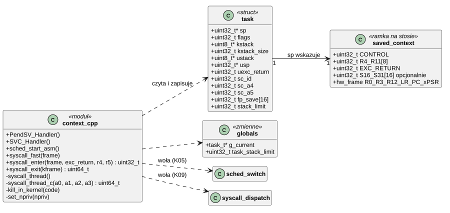
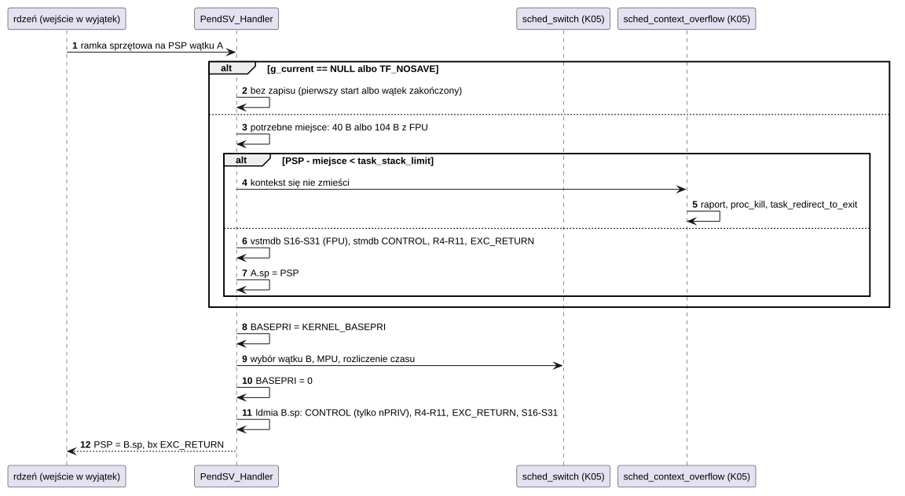
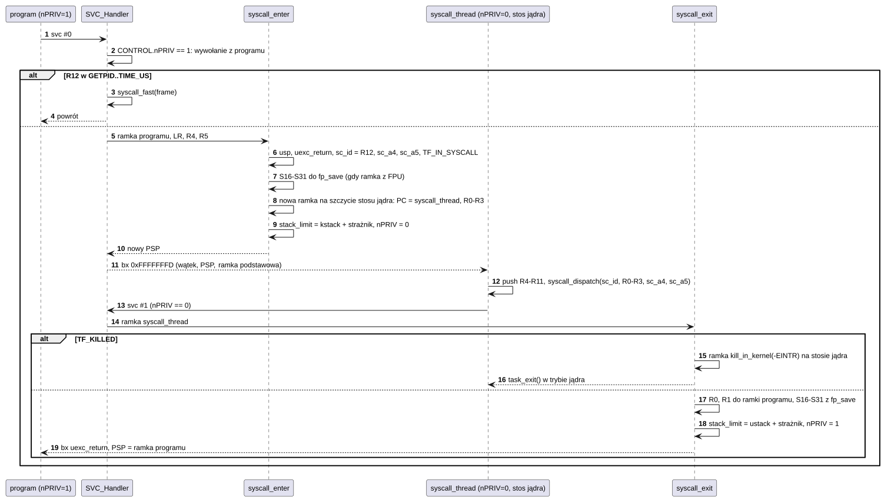
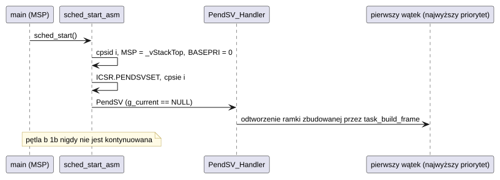

# K01 Przełączanie kontekstu i wejście do jądra

## 1. Identyfikacja

| | |
|---|---|
| Identyfikator | K01 |
| Warstwa | L0, część zależna od architektury (Cortex-M7) |
| Pliki | `kernel/rtos/arch/context.cpp` |
| Interfejs | wewnętrzny jądra: `kernel/rtos/kernel.h` (`struct task`, `task_stack_limit`), `kernel/include/crtos/syscall.h` (konwencja SVC) |
| Umiejscowienie w pamięci | `PendSV_Handler`, `SVC_Handler`, `syscall_*` w ITCM (`KERNEL_FAST`) |

## 2. Odpowiedzialność

- Zapis i odtworzenie kontekstu wątku w wyjątku PendSV (jedyne miejsce zmiany wątku).
- Kontrola, czy na stosie wątku jest miejsce na kontekst, zanim zostanie zapisany.
- Wejście do jądra z programu (`svc #0`) i powrót (`svc #1`): przełączenie na stos jądra
  wątku i do trybu uprzywilejowanego, tak aby wywołanie systemowe było zwykłym,
  wywłaszczalnym kodem wątku.
- Szybka ścieżka dla `getpid`, `gettid` i `time_us`.
- Start pierwszego wątku (`sched_start_asm`).

Komponent nie decyduje, **który** wątek ma działać (to K05 `sched_switch`), ani nie
programuje MPU (to K03 `mpu_switch`).

## 3. Wymagania

| ID | Wymaganie | Weryfikacja |
|---|---|---|
| REQ-K01-01 | Przełączenie zachowuje cały stan wątku: R0–R12, LR, PC, xPSR (ramka sprzętowa), R4–R11, CONTROL.nPRIV, EXC_RETURN oraz S16–S31, jeśli wątek używał FPU. | `kmon test fpu`, `kmon test userregs` |
| REQ-K01-02 | Jeśli poniżej bieżącego wskaźnika stosu nie ma miejsca na kontekst (granica `task_stack_limit`), kontekst nie jest zapisywany, a wątek (i jego proces) zostaje zakończony. | `kmon test kstack`, `kmon test userstack` |
| REQ-K01-03 | `svc #0` z wątku programu wykonuje wywołanie systemowe w trybie uprzywilejowanym na stosie jądra tego wątku; w tym czasie wątek może być wywłaszczony i blokować. | `kmon test syscall`, `apptest` |
| REQ-K01-04 | Po wywołaniu program wraca w trybie nieuprzywilejowanym; wynik jest w R0 (R0:R1 dla 64 bitów), pozostałe rejestry, w tym S0–S31, są niezmienione. | `kmon test userregs` |
| REQ-K01-05 | Wątek zakończony w trakcie wywołania systemowego (`TF_KILLED`) nie wraca do kodu programu, tylko kończy się w trybie jądra. | `apptest` (cykl życia procesu) |
| REQ-K01-06 | `svc #0` spoza wątku programu oraz `svc #1` poza wywołaniem systemowym zatrzymują system (`panic`). | przegląd kodu |

## 4. Interfejs udostępniany

| Funkcja / symbol | Kontekst | Opis | Warunki |
|---|---|---|---|
| `PendSV_Handler()` | wyjątek (priorytet 15) | zapis kontekstu `g_current`, wywołanie `sched_switch()`, odtworzenie kontekstu nowego `g_current` | przed: wyjątek zgłoszony przez `sched_pend_switch()`; po: działa wątek wybrany przez K05 |
| `SVC_Handler()` | wyjątek (priorytet 15) | rozróżnia `svc #0` (program, CONTROL.nPRIV = 1) i `svc #1` (koniec wywołania, nPRIV = 0) | przed: program na PSP; R12 = numer wywołania |
| `syscall_fast(frame)` | wyjątek SVC | wynik `getpid`/`gettid`/`time_us` do R0:R1 ramki | numer w zakresie `SYS_GETPID..SYS_TIME_US` (sprawdzone `static_assert`em ciągłości) |
| `syscall_enter(frame, exc_return, r4, r5)` | wyjątek SVC | zapamiętuje ramkę programu, buduje ramkę `syscall_thread` na stosie jądra, nPRIV = 0; zwraca nowy PSP | przed: `TF_USER` i nie `TF_IN_SYSCALL`, inaczej `panic`; po: `TF_IN_SYSCALL` |
| `syscall_enter_fault(frame, exc_return, id, arg)` | wyjątek MemManage (K20) | jak `syscall_enter`, z flagą `TF_PAGEIN`: wątek programu idzie do jądra po stronę pamięci emulowanej i wraca do tej samej instrukcji z R0/R1 bez zmian (`syscall_thread_c` woła wtedy `vmem_pagein_call`, nie rozdział wywołań) | przed: `TF_USER` i nie `TF_IN_SYSCALL`; zwraca PSP stosu jądra |
| `syscall_exit(kframe)` | wyjątek SVC | wynik do ramki programu, nPRIV = 1; zwraca PSP i EXC_RETURN; dla `TF_KILLED` buduje ramkę `task_exit(-EINTR)` | przed: `TF_IN_SYSCALL`, inaczej `panic` |
| `sched_start_asm()` | `main` na MSP | zeruje MSP, zgłasza PendSV, włącza przerwania | wołana raz z `sched_start()` |
| `task_stack_limit` | zmienna | najniższy adres, pod który PendSV może zapisać kontekst | ustawia K03 (`mpu_switch`, `mpu_set_*guard`) i `syscall_enter/exit` |

## 5. Interfejsy wymagane

| Od | Co |
|---|---|
| K05 | `g_current`, `sched_switch()`, `sched_context_overflow()`, `task_exit()` |
| K09 | `syscall_dispatch()` |
| K03 | pola `stack_limit`, strażnicy stosu w `struct task` |
| CMSIS | rejestry `SCB->ICSR`, `FPU->FPCCR` |

## 6. Struktura statyczna

*Źródło: [K01/struktura-statyczna.puml](../diagramy/K01/struktura-statyczna.puml)*

Pola `sp` (offset 0) i `flags` (offset 4) struktury `task` są czytane przez kod
asemblerowy; ich położenie pilnują `static_assert` w `kernel.h`.

## 7. Zachowanie dynamiczne

### 7.1 PendSV

*Źródło: [K01/pendsv.puml](../diagramy/K01/pendsv.puml)*

### 7.2 Wywołanie systemowe

*Źródło: [K01/wywolanie-systemowe.puml](../diagramy/K01/wywolanie-systemowe.puml)*

### 7.3 Start pierwszego wątku

*Źródło: [K01/start-pierwszego-watku.puml](../diagramy/K01/start-pierwszego-watku.puml)*

## 8. Implementacja

**Układ zapisanego kontekstu** (od najniższego adresu): `CONTROL`, `R4`–`R11`,
`EXC_RETURN`, [`S16`–`S31`, gdy bit 4 EXC_RETURN = 0], ramka sprzętowa (`R0`–`R3`, `R12`,
`LR`, `PC`, `xPSR`, [`S0`–`S15`, `FPSCR`]). Ten sam układ tworzy `task_build_frame()`
(K05) dla nowych wątków, dlatego nowy i wywłaszczony wątek startują tą samą ścieżką.

**Tryb uprzywilejowania** jest częścią kontekstu: PendSV odtwarza tylko bit nPRIV rejestru
CONTROL (pozostałe bity CONTROL, np. FPCA, ustala sprzęt).

**Stos jądra wątku programu.** Każdy wątek programu ma dwa stosy: użytkownika (w arenie)
i jądra (3 KB + strażnik, w DTCM). `syscall_enter()` buduje ramkę zawsze na szczycie stosu
jądra, bo w chwili `svc #0` wątek nie może być w jądrze (wywołania nie są zagnieżdżane).

**FPU.** Rdzeń odkłada S0–S15 leniwie (lazy stacking). S16–S31 zapisuje PendSV (przy
przełączeniu) i `syscall_enter()` (do `fp_save`, bo kod jądra może ich użyć, a wątek
może zostać przełączony). `syscall_exit()` kasuje `FPCCR.LSPACT`: odłożony leniwie stan
FPU kodu jądra jest już nieważny.

**Rozróżnienie SVC** po `CONTROL.nPRIV` wątku zamiast odczytu instrukcji `svc` z pamięci
programu: szybsze i nie wymaga dostępu do pamięci programu z obsługi wyjątku.

**Czas.** Pełne wejście i wyjście z wywołania: ok. 548 ns; szybka ścieżka: 146 ns;
przełączenie wątków jądra z semaforem: 436 cykli (pomiar `crtos bench`).

## 9. Obsługa błędów i mechanizmy bezpieczeństwa

| Sytuacja | Reakcja |
|---|---|
| brak miejsca na kontekst na stosie | kontekst niezapisany, `sched_context_overflow()`: raport w logu, proces zakończony, wątek wraca w `task_exit(-EFAULT)` na stosie jądra |
| `svc #0` z wątku jądra albo zagnieżdżone | `panic("SVC #0 from non-user context")` |
| `svc #1` poza wywołaniem | `panic("SVC from kernel code")` |
| wątek zabity w wywołaniu | nie wraca do programu, kończy się w jądrze (zasoby zwalnia `task_exit`) |
| przepełnienie stosu jądra podczas wywołania | strażnik (region MPU 15) → MemManage → K04 |

## 10. Konfiguracja

`CONFIG_KSTACK_SIZE` (3072), `CONFIG_STACK_GUARD` (256), `KERNEL_BASEPRI` (z
`CONFIG_IRQ_KERNEL_PRIO` = 2) w `kernel/include/crtos/config.h` i `arch.h`.

## 11. Weryfikacja

- `crtos kmon "test fpu"`: dwa wątki jądra z różnymi wartościami w rejestrach FPU.
- `crtos kmon "test userregs"`: rejestry R4–R11 i S0–S31 programu po wywołaniach i
  przełączeniach.
- `crtos kmon "test syscall"`: koszt wywołania.
- `crtos kmon "test kstack"`, `"test userstack"`: przepełnienie stosu kończy tylko winnego.
- `crtos run apptest`: grupy „threads”, „process lifecycle”.

## 12. Ograniczenia i znane problemy

- Kod w asemblerze wbudowanym (`__asm volatile`) wymaga przeglądu przy każdej zmianie
  struktury `task` lub kompilatora.
- Wywołania systemowe nie mogą się zagnieżdżać (z założenia).
