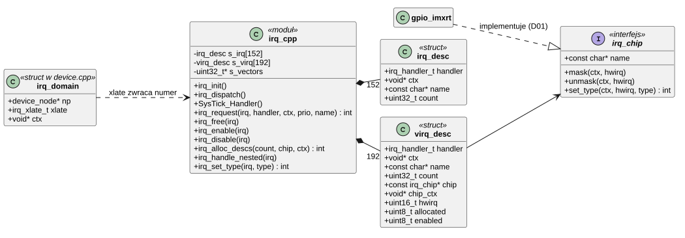
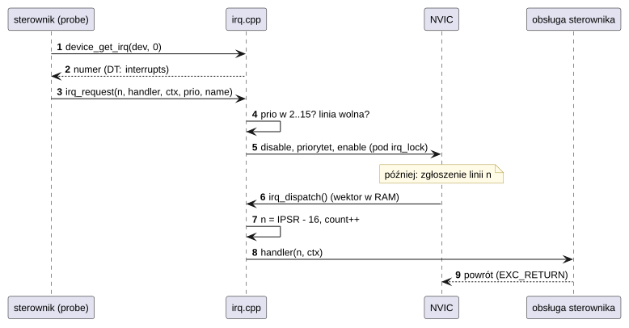
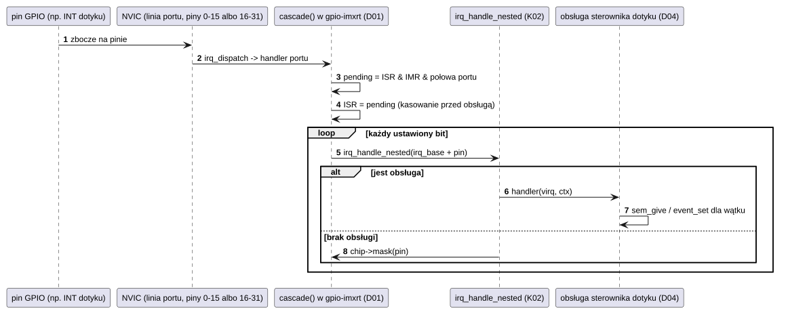
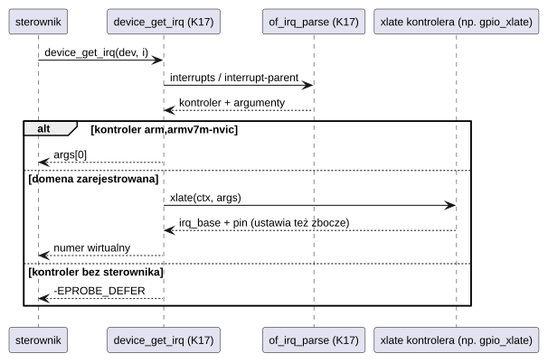

# K02 Przerwania

## 1. Identyfikacja

| | |
|---|---|
| Identyfikator | K02 |
| Warstwa | L0, część zależna od architektury |
| Pliki | `kernel/rtos/arch/irq.cpp`; domeny przerwań w `kernel/os/device.cpp` |
| Interfejs | `kernel/include/crtos/irq.h`, `kernel/include/crtos/arch.h` (`irq_lock`, `irq_unlock`, `in_interrupt`), `kernel/include/crtos/device.h` (`irq_domain_add`, `device_get_irq`) |

## 2. Odpowiedzialność

- Kopia tablicy wektorów w RAM; wszystkie wektory peryferiów wskazują na jeden dyspozytor.
- Rejestracja obsługi przerwania z priorytetem i nazwą, włączanie i wyłączanie linii.
- Przerwania wirtualne: numery powyżej linii NVIC dla kontrolerów pomocniczych (porty
  GPIO), z maskowaniem i wyborem zbocza przez `struct irq_chip`.
- Tłumaczenie specyfikatorów przerwań z drzewa urządzeń na numery (domeny przerwań).
- Sekcja krytyczna jądra (`irq_lock`/`irq_unlock`) przez BASEPRI.

## 3. Wymagania

| ID | Wymaganie | Weryfikacja |
|---|---|---|
| REQ-K02-01 | Przerwanie linii NVIC wywołuje obsługę zarejestrowaną dla tego numeru z jej kontekstem; przerwanie bez obsługi zostaje wyłączone i zgłoszone w logu. | `kmon test irq`, `kmon irq` |
| REQ-K02-02 | `irq_request` przyjmuje tylko priorytety `CONFIG_IRQ_KERNEL_PRIO`..15 (liczbowo), tak aby każde zarejestrowane przerwanie było maskowane przez `irq_lock()`; drugi wpis dla tej samej linii kończy się `-EBUSY`. | przegląd kodu |
| REQ-K02-03 | `irq_lock()` maskuje wszystkie przerwania, które mogą używać API jądra, oraz PendSV i SysTick; wywołania mogą się zagnieżdżać (`basepri_max`), `irq_unlock(key)` przywraca poprzedni stan. | testy K05/K06 (`kmon test sched`, `mutex`, `sem`) |
| REQ-K02-04 | Linia przerwania wirtualnego bez obsługi jest maskowana w kontrolerze pomocniczym przy pierwszym zgłoszeniu. | przegląd kodu |
| REQ-K02-05 | Opóźnienie od zgłoszenia przerwania do wejścia w obsługę: średnio ≤ 100 cykli (zmierzone 45, maks. 195). | `kmon test irq`, `crtos bench` |

## 4. Interfejs udostępniany

| Funkcja | Kontekst | Opis | Błędy |
|---|---|---|---|
| `irq_request(irq, handler, ctx, prio, name)` | wątek | rejestruje obsługę i włącza linię (NVIC) albo odmaskowuje (wirtualne; `prio` ignorowane); `prio < 0`: domyślny 8 | `-EINVAL` (numer, brak obsługi, priorytet), `-EBUSY` |
| `irq_free(irq)` | wątek | wyłącza linię, przywraca obsługę domyślną | — |
| `irq_enable(irq)`, `irq_disable(irq)` | wątek, ISR | włącza / wyłącza linię (wirtualne: maska w kontrolerze) | — |
| `irq_set_priority(irq, prio)` | wątek | zmienia priorytet w dozwolonym zakresie | ignoruje złe wartości |
| `irq_pend(irq)` | wątek, ISR | programowe zgłoszenie linii NVIC | — |
| `irq_info(irq, &info)` | wątek | nazwa, licznik, priorytet, stan | `-EINVAL`, `-ENOENT` |
| `irq_alloc_descs(count, chip, ctx)` | wątek | przydziela `count` kolejnych numerów wirtualnych dla kontrolera | `-EINVAL`, `-ENOSPC` |
| `irq_free_descs(base, count)` | wątek | zwalnia numery wirtualne | — |
| `irq_set_type(irq, type)` | wątek | zbocze/poziom (`IRQ_TYPE_*`) przez `chip->set_type` | `-EINVAL`, `-ENOTSUP` |
| `irq_handle_nested(irq)` | ISR (kaskada) | wywołuje obsługę linii wirtualnej | — |
| `irq_domain_add(np, xlate, ctx)` | wątek | rejestruje tłumacza specyfikatorów DT kontrolera `np` | `-ENOSPC` |
| `device_get_irq(dev, index)` | wątek | numer przerwania `index`-tego wpisu `interrupts` urządzenia | `-EPROBE_DEFER` (kontroler bez sterownika), `-EINVAL` |
| `irq_lock()` → `key`, `irq_unlock(key)` | wątek, ISR | sekcja krytyczna jądra (BASEPRI = `KERNEL_BASEPRI`) | — |
| `in_interrupt()` | wszędzie | czy kod działa w trybie obsługi (IPSR ≠ 0) | — |

Warunek wstępny obsługi przerwania: działa krótko, nie blokuje (nie woła `mutex_lock`,
`sem_take` z czekaniem, `task_sleep_ms`), dozwolone są `sem_give`, `event_set`,
`poll_notify`, `input_report`, `kworker_queue`, `printk`.

## 5. Interfejsy wymagane

K07 (`kmalloc_aligned` na tablicę wektorów), K05 (`sched_tick` z `SysTick_Handler`),
CMSIS NVIC/SCB.

## 6. Struktura statyczna

*Źródło: [K02/struktura-statyczna.puml](../diagramy/K02/struktura-statyczna.puml)*

## 7. Zachowanie dynamiczne

### 7.1 Rejestracja i obsługa linii NVIC

*Źródło: [K02/rejestracja-i-obsluga-linii-nvic.puml](../diagramy/K02/rejestracja-i-obsluga-linii-nvic.puml)*

### 7.2 Przerwanie GPIO (kaskada)

*Źródło: [K02/przerwanie-gpio-kaskada.puml](../diagramy/K02/przerwanie-gpio-kaskada.puml)*

### 7.3 Tłumaczenie numeru z drzewa urządzeń

*Źródło: [K02/tlumaczenie-numeru-z-drzewa-urzadzen.puml](../diagramy/K02/tlumaczenie-numeru-z-drzewa-urzadzen.puml)*

## 8. Implementacja

- **Tablica wektorów**: `irq_init()` kopiuje 16 wektorów wyjątków z `g_pfnVectors`,
  wszystkie 152 wektory peryferiów ustawia na `irq_dispatch()` i przełącza `VTOR` na kopię
  (wyrównanie 1024 B, pamięć szybka – DTCM). Wszystkie linie są wyłączone i mają priorytet
  domyślny 8.
- **Dyspozytor** (`irq_dispatch`, ITCM) ma stały koszt: odczyt IPSR, indeks w tablicy,
  licznik, wywołanie. Nie ma kolejki ani priorytetyzacji programowej; kolejność ustala NVIC.
- **Przerwania wirtualne**: numery `CONFIG_NUM_IRQS + i` (152..343). `irq_alloc_descs()`
  szuka ciągłego wolnego zakresu (first fit).
- **Sekcja krytyczna**: `irq_lock()` wykonuje `mrs basepri` + `msr basepri_max`, więc
  zagnieżdżenie nigdy nie obniża maski; `irq_unlock(key)` przywraca zapamiętaną wartość.
  Przerwania o priorytecie 0–1 (liczbowo) nie są maskowane – są zarezerwowane dla obsługi
  bez API jądra; obecnie używają ich tylko wyjątki błędów (priorytet 0).
- **Priorytety wyjątków systemowych** ustawia K05: SVCall, PendSV, SysTick = 15
  (najniższy), błędy = 0 (K04).

## 9. Obsługa błędów i mechanizmy bezpieczeństwa

| Sytuacja | Reakcja |
|---|---|
| przerwanie bez obsługi (linia NVIC) | `irq_unhandled()`: wyłączenie linii, `W: unexpected IRQ n - disabled` |
| przerwanie wirtualne bez obsługi | maskowanie pinu w kontrolerze |
| priorytet spoza zakresu jądra | `irq_request` zwraca `-EINVAL` (ochrona przed obsługą, której nie maskuje `irq_lock`) |
| podwójna rejestracja | `-EBUSY` |
| błąd procesora w obsłudze przerwania | `panic` (K04) |

## 10. Konfiguracja

`CONFIG_NUM_IRQS` (152), `CONFIG_NUM_VIRQS` (192), `CONFIG_IRQ_KERNEL_PRIO` (2),
`CONFIG_IRQ_DEFAULT_PRIO` (8), `CONFIG_NVIC_PRIO_BITS` (4); `MAX_IRQ_DOMAINS` w
`device.cpp`.

## 11. Weryfikacja

- `crtos kmon "test irq"`: 1000 programowych zgłoszeń linii testowej, min/śr./maks. cykli.
- `crtos kmon irq`: lista zarejestrowanych przerwań i liczników (przegląd po starcie).
- Przerwania GPIO: `crtos run evtest` z przyciskiem SW8 i dotykiem (test ręczny).

## 12. Ograniczenia i znane problemy

- Jeden handler na linię (brak współdzielenia linii).
- Brak pomiaru czasu trwania obsługi przerwań; najdłuższą przerwę w tyknięciach pokazuje
  `kmon uptime` (K05).
