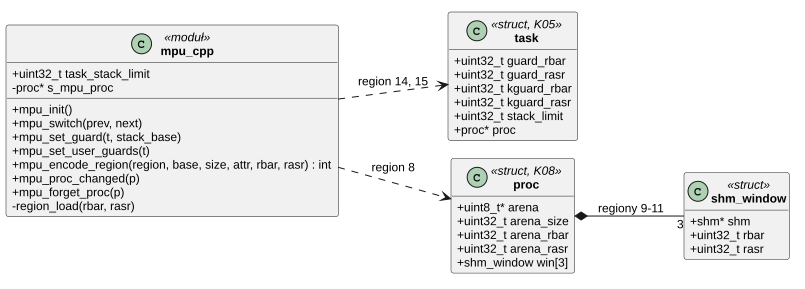
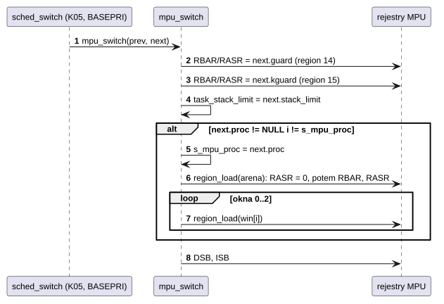
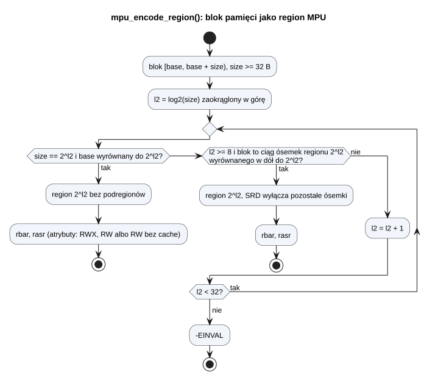

# K03 Ochrona pamięci (MPU)

## 1. Identyfikacja

| | |
|---|---|
| Identyfikator | K03 |
| Warstwa | L0, część zależna od architektury |
| Pliki | `kernel/rtos/arch/mpu.cpp` |
| Interfejs | wewnętrzny: `kernel/rtos/kernel.h` (sekcja „MPU”) |

## 2. Odpowiedzialność

- Mapa pamięci MPU ustawiana przy starcie (`mpu_init`, przed włączeniem pamięci
  podręcznych i zegarów), zastępuje `BOARD_ConfigMPU()` z SDK.
- Regiony zależne od działającego wątku: arena i okna pamięci współdzielonej jego procesu,
  strażnicy stosów.
- Kodowanie dowolnego bloku (areny, okna) jako regionu MPU z podregionami.
- Granica stosu (`task_stack_limit`) dla kontroli w PendSV (K01).

MPU jest jedynym mechanizmem izolacji przestrzennej: procesy nie mają osobnych przestrzeni
adresowych (brak MMU).

## 3. Wymagania

| ID | Wymaganie | Weryfikacja |
|---|---|---|
| REQ-K03-01 | Kod nieuprzywilejowany ma dostęp tylko do areny swojego procesu (RWX), jego zmapowanych okien pamięci współdzielonej (RW, bez wykonywania) i HyperFlash (tylko odczyt i wykonanie, REQ-K03-07); pamięć jądra w RAM, peryferia i areny innych procesów są dla niego niedostępne. | `kmon test usermem`, `apptest` (ochrona pamięci) |
| REQ-K03-02 | Adresy 0x0–0xFF są niedostępne także dla jądra (strażnik NULL). | `kmon test null` |
| REQ-K03-03 | Poniżej stosu MSP, stosu każdego wątku jądra, stosu użytkownika i stosu jądra każdego wątku programu leży region 256 B bez dostępu, włączony przez cały czas działania wątku (także w wywołaniu systemowym). | `kmon test kstack`, `kmon test userstack` |
| REQ-K03-04 | Przed wznowieniem wątku MPU zawiera jego strażników; jeśli wątek należy do innego procesu niż ostatnio zaprogramowany, także arenę i okna tego procesu. | `apptest` (IPC i shm między procesami), `kmon test usermem` |
| REQ-K03-05 | Przeprogramowanie regionu programu nie tworzy stanu pośredniego, w którym region obejmowałby pamięć w użyciu z innymi prawami (region jest najpierw wyłączany). | przegląd kodu |
| REQ-K03-06 | Pamięć spoza zdefiniowanych regionów jest niedostępna także dla jądra (`PRIVDEFENA` = 0). | przegląd kodu, `kmon test null` |
| REQ-K03-07 | HyperFlash (obraz jądra i dysk `/flash0`) jest przez MPU tylko do odczytu dla jądra i programów; programy mogą z niego wykonywać kod (programy XIP, K16). Zmienia go tylko sterownik `flexspi-mtd` (D07) poleceniami kontrolera FlexSPI. | przegląd kodu (`kmon mpu`), `xiptest` z `/flash0` |
| REQ-K03-08 | Blok szybkiego kodu programu (K16) jest dla programu tylko do odczytu i wykonania (`MPU_ATTR_USER_RX`), dla jądra do zapisu, i zajmuje jedno z okien procesu, które `shm_map` pomija. | przegląd kodu, `snes` z `FAST` (`crtos kmon mem`) |

## 4. Interfejs udostępniany

| Funkcja | Kontekst | Opis | Warunki |
|---|---|---|---|
| `mpu_init()` | `main`, przed zegarami | wyłącza cache, programuje regiony 0–7, 12, 13, włącza MPU i cache | raz |
| `mpu_switch(prev, next)` | PendSV, obsługa błędu (BASEPRI) | strażnicy 14/15 i `task_stack_limit` dla `next`; regiony 8–11, jeśli zmienia się proces | wywołuje K05 `sched_switch` |
| `mpu_set_guard(t, stack_base)` | wątek | strażnik 14 poniżej jedynego stosu (wątek jądra), 15 wyłączony | `stack_base` wyrównany do 256 B (`BUG_ON`) |
| `mpu_set_user_guards(t)` | wątek | strażnik 14 pod stosem użytkownika, 15 pod stosem jądra | oba wyrównane do 256 B |
| `mpu_encode_region(region, base, size, attr, &rbar, &rasr)` | wątek | najmniejszy region (potęga dwójki albo ciąg ósemek podregionów) pokrywający dokładnie `[base, base+size)` | `-EINVAL`, gdy blok nie da się wyrazić |
| `mpu_empty_region(region, &rbar, &rasr)` | wątek | opis wyłączonego regionu | — |
| `mpu_proc_changed(p)` | wątek | ponowne załadowanie regionów 8–11, jeśli są aktywne dla `p` | po mapowaniu/odmapowaniu shm |
| `mpu_forget_proc(p)` | wątek | wyłącza regiony 8–11, jeśli należały do `p` | przed zwolnieniem areny |
| `mpu_dump()` | wątek | wypis regionów (kmon `mpu`) | — |

Atrybuty dla `mpu_encode_region`: `MPU_ATTR_USER_RWX` (arena), `MPU_ATTR_USER_RW` (okno
shm, pamięć cache), `MPU_ATTR_USER_RW_NC` (okno shm bez cache).

## 5. Interfejsy wymagane

CMSIS (`MPU`, `SCB_Enable/DisableICache/DCache`), symbole linkera `_vStackBase` (dno
stosu MSP), pola `struct task` i `struct proc` (K05, K08).

## 6. Struktura statyczna

*Źródło: [K03/struktura-statyczna.puml](../diagramy/K03/struktura-statyczna.puml)*

## 7. Mapa regionów

Wyższy numer regionu wygrywa, gdy regiony się nakładają.

| Nr | Obszar | Rozmiar | Dostęp jądro / program | Pamięć | Kiedy się zmienia |
|---|---|---|---|---|---|
| 0 | 0x00000000 (tło) | 4 GB | brak / brak | strongly ordered, XN | nigdy |
| 1 | ITCM 0x00000000 | 128 KB | RW / brak | normal WB | nigdy |
| 2 | DTCM 0x20000000 | 128 KB | RW / brak, XN | normal WB | nigdy |
| 3 | OCRAM 0x20200000 | 256 KB | RW / brak | normal WBWA | nigdy |
| 4 | SDRAM 0x80000000 | 32 MB | RW / brak | normal WBWA | nigdy |
| 5 | SDRAM bez cache 0x81E00000 | 2 MB | RW / brak, XN | normal non-cacheable | nigdy |
| 6 | HyperFlash 0x60000000 (jądro, `/flash0`) | 64 MB | R-X / R-X (`AP_RO`) | normal WB | nigdy |
| 7 | peryferia 0x40000000 | 4 MB | RW / brak, XN | device | nigdy |
| 8 | arena procesu | ≥ 4 KB | RWX / RWX | normal WBWA | zmiana procesu |
| 9–11 | okna pamięci współdzielonej; jedno z nich może być blokiem szybkiego kodu programu (ITCM albo OCRAM, K16) | wg obiektu | RW / RW, XN; blok szybkiego kodu: RW / R-X | WBWA albo non-cacheable | zmiana procesu, `shm_map`/`unmap`, start i koniec programu |
| 12 | strażnik NULL 0x0 | 256 B | brak / brak | XN | nigdy |
| 13 | strażnik stosu MSP (`_vStackBase`) | 256 B | brak / brak | XN | nigdy |
| 14 | strażnik stosu wątku (użytkownika w wątku programu, jedynego stosu w wątku jądra) | 256 B | brak / brak | XN | każda zmiana wątku |
| 15 | strażnik stosu jądra wątku programu | 256 B | brak / brak | XN | każda zmiana wątku (wyłączony dla wątków jądra) |

Uwaga: komentarz na początku `mpu.cpp` opisuje region 15 jako „spare”; od etapu M9 jest to
strażnik stosu jądra (`MPU_REGION_KGUARD` w `kernel.h`), jak w tabeli.

## 8. Zachowanie dynamiczne

### 8.1 Zmiana wątku

*Źródło: [K03/zmiana-watku.puml](../diagramy/K03/zmiana-watku.puml)*

Wątki jądra nie zmieniają regionów 8–11: działają w trybie uprzywilejowanym, dla którego
regiony procesu nie są potrzebne. Dzięki temu przejście program → wątek jądra → ten sam
program nie przeprogramowuje areny.

### 8.2 Kodowanie areny

*Źródło: [K03/kodowanie-areny.puml](../diagramy/K03/kodowanie-areny.puml)*

K08 przydziela areny już w tej postaci (`arena_alloc`: rozmiar zaokrąglony do ósemki
regionu, wyrównanie do ósemki, bez przekraczania granicy regionu), więc kodowanie zawsze
się udaje.

## 9. Implementacja

- `mpu_init()` wyłącza I-cache i D-cache, zeruje 16 regionów, programuje regiony stałe,
  włącza MPU bez `PRIVDEFENA` i bez `HFNMIENA`, potem włącza cache.
- `region_load()` najpierw zeruje `RASR` wybranego slotu: bez tego między zapisem `RBAR`
  i `RASR` slot miałby nowy adres ze starym rozmiarem i prawami. Taki stan pośredni raz
  uczynił ITCM (kod wykonywany w tej chwili) niewykonywalnym.
- Strażnicy mają zawsze ten sam rozmiar i prawa, więc ich slotów nie trzeba wyłączać przed
  zmianą.
- `task_stack_limit` = dno aktywnego stosu + 256 B: PendSV (K01) nie zapisze kontekstu
  poniżej tej granicy.

## 10. Obsługa błędów i mechanizmy bezpieczeństwa

| Sytuacja | Mechanizm | Reakcja (K04) |
|---|---|---|
| program pisze/czyta poza arenę | region 0 (tło) albo regiony 1–7 (tylko uprzywilejowane) | MemManage → proces zakończony |
| program wykonuje kod z danych shm | XN okien | MemManage → proces zakończony |
| przepełnienie stosu programu | region 14 | MemManage, raport „stack overflow (user stack)” |
| przepełnienie stosu jądra w wywołaniu | region 15 | MemManage, raport „stack overflow (kernel stack)”, proces zakończony |
| przepełnienie stosu wątku jądra | region 14 | wątek zakończony |
| przepełnienie stosu MSP (przerwania) | region 13 | błąd w trybie obsługi → `panic` |
| dereferencja NULL (jądro albo program) | region 12 | zakończenie wątku/procesu albo `panic` (w przerwaniu) |
| zapis do flasha (obraz jądra, pliki `/flash0`, także z programu XIP) | region 6 tylko do odczytu dla wszystkich | MemManage (program: proces zakończony) |

## 11. Konfiguracja

`CONFIG_STACK_GUARD` (256) i `CONFIG_STACK_GUARD_LOG2` (8); numery regionów
`MPU_REGION_*` w `kernel.h`; adresy pamięci w `mpu_init()` (muszą odpowiadać
`kernel/platform/evkbimxrt1050/linker/memory.ld`).

## 12. Weryfikacja

- `crtos kmon "test null"`, `"test kstack"`, `"test usermem"`, `"test userstack"`.
- `crtos run apptest`: grupa „memory protection” (proces potomny odwołuje się do pamięci
  jądra, NULL i przepełnia stos; rodzic sprawdza, że potomek zakończył się z `-EFAULT`,
  a system działa).
- `xiptest` z `/flash0`: kod programu wykonuje się z flasha (region 6), zapis pod NULL
  (`xiptest crash`) kończy tylko ten proces.
- `crtos kmon mpu`: przegląd zaprogramowanych regionów.
- `tools/stackcheck.py`: funkcje jądra z ramką stosu większą niż strażnik (256 B), które
  mogłyby go „przeskoczyć”.

## 13. Ograniczenia i znane problemy

- Ramka stosu większa niż 256 B może przeskoczyć strażnika; dla jądra pilnuje tego
  `stackcheck.py`, dla programów nie ma takiej kontroli (duże tablice na stosie programu
  powinny trafiać na stertę).
- Tylko 3 okna pamięci współdzielonej na proces; obiekt z kilku regionów (K11) zajmuje po
  oknie na każdy.
- Sterowniki (tryb uprzywilejowany) mają dostęp do całej pamięci jądra i wszystkich aren.
- Region 6 jest wspólny: każdy program może czytać cały HyperFlash, także obraz jądra
  i pliki `/flash0`. W zamian programy XIP nie potrzebują osobnego okna MPU, może ich działać
  dowolnie wiele naraz, a pliki nie muszą mieć wyrównania do potęgi dwójki. Nowe dla programu
  jest tylko to, czego nie da się przeczytać przez VFS: obraz jądra (kod jest publiczny)
  i bloki po usuniętych plikach `/flash0`. Pliki i tak nie mają uprawnień, więc każdy program
  może przez VFS czytać kartę i `/flash0` (analiza: F-51 w
  [03](../03-analiza-bezpieczenstwa.md)).
