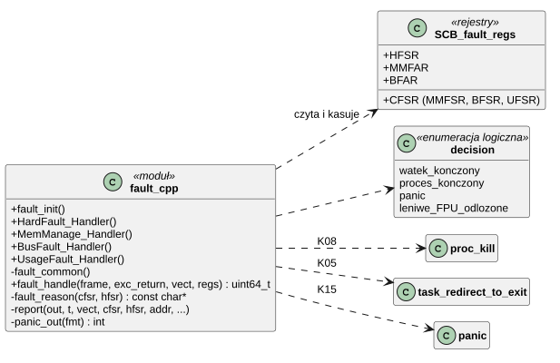
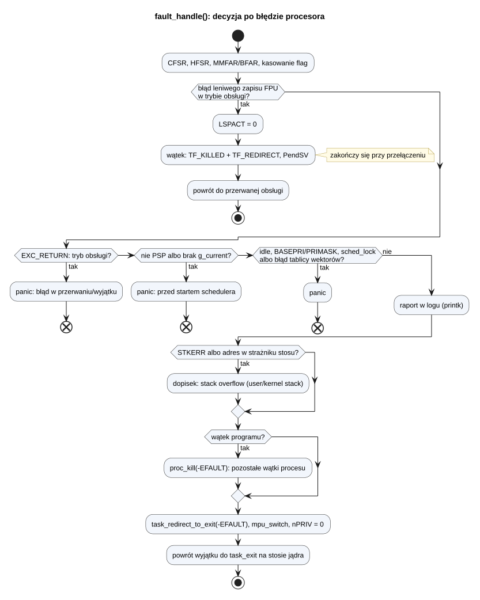
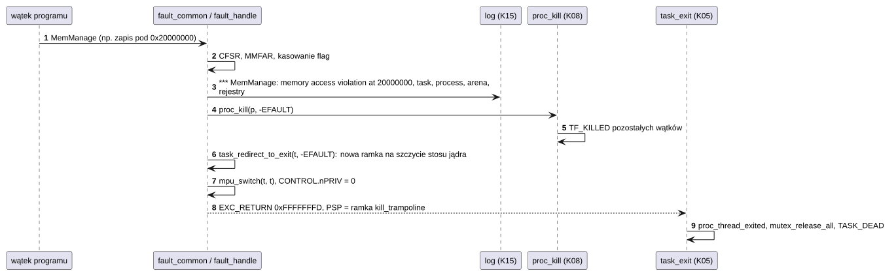

# K04 Wyjątki procesora

## 1. Identyfikacja

| | |
|---|---|
| Identyfikator | K04 |
| Warstwa | L0, część zależna od architektury |
| Pliki | `kernel/rtos/arch/fault.cpp` |
| Interfejs | wewnętrzny: `fault_init()` w `kernel.h`; wektory `HardFault_Handler`, `MemManage_Handler`, `BusFault_Handler`, `UsageFault_Handler` |

## 2. Odpowiedzialność

- Włączenie osobnych wyjątków MemManage, BusFault, UsageFault (priorytet 0) i pułapki
  dzielenia przez zero.
- Ustalenie przyczyny błędu (CFSR, HFSR, MMFAR, BFAR) i raport w logu.
- **Ograniczenie skutków**: błąd w wątku kończy tylko ten wątek (w wątku programu – cały
  proces), a system działa dalej. Błąd, którego skutków nie da się ograniczyć, kończy się
  `panic` (K15), czyli restartem.

## 3. Wymagania

| ID | Wymaganie | Weryfikacja |
|---|---|---|
| REQ-K04-01 | Błąd procesora w wątku jądra albo programu, poza sekcją krytyczną jądra, kończy tylko ten wątek; w wątku programu kończy cały proces z kodem `-EFAULT`. Pozostałe wątki i procesy działają dalej. | `kmon test null`, `kstack`, `usermem`, `userstack`; `apptest` (ochrona pamięci) |
| REQ-K04-02 | Błąd w obsłudze przerwania lub wyjątku, przed startem schedulera, w wątku `idle`, przy BASEPRI ≠ 0 lub PRIMASK = 1, przy zablokowanym schedulerze albo błąd odczytu tablicy wektorów powoduje `panic`. | przegląd kodu |
| REQ-K04-03 | Raport zawiera rodzaj wyjątku, przyczynę, adres błędu (jeśli ważny), wątek, proces i adres jego areny (dla programu XIP: adres tekstu i GOT, K16), rejestry R0–R12, LR, PC, SP, xPSR oraz wskazanie przepełnienia stosu. | `apptest` (raporty w logu), `crtos crash`, `xiptest crash` |
| REQ-K04-04 | Ramka wyjątku jest odczytywana tylko wtedy, gdy została zapisana w całości i nie leży w strażniku stosu. | przegląd kodu |
| REQ-K04-06 | Błąd MemManage wątku programu (nie w wywołaniu systemowym) przy dostępie do jego pamięci emulowanej nie jest błędem: obsługuje go K20 (wykonanie instrukcji albo wczytanie strony), a rejestry R4–R11 wracają do wątku takie, jakie zostawiła emulacja. | `heaptest` (instrukcje na pamięci emulowanej), przegląd kodu |
| REQ-K04-05 | Zakończony wątek zwalnia zasoby zwykłą drogą (`task_exit` na jego stosie jądra: muteksy, proces, stos). | `apptest` (pamięć wraca po zakończeniu procesów) |

## 4. Interfejs udostępniany

| Funkcja | Kontekst | Opis |
|---|---|---|
| `fault_init()` | start jądra | priorytety 0 dla MemManage/BusFault/UsageFault, `SHCSR` (włączenie), `CCR.DIV_0_TRP` |
| `HardFault_Handler` … `UsageFault_Handler` | wyjątek | przekazują numer wektora (3–6) do `fault_common` |
| `fault_handle(frame, exc_return, vect, regs)` | wyjątek | decyzja i raport; zwraca PSP i EXC_RETURN do wznowienia |

## 5. Interfejsy wymagane

| Od | Co |
|---|---|
| K05 | `g_current`, `sched_idle_task()`, `sched_is_locked()`, `task_redirect_to_exit()`, `sched_pend_switch()` |
| K03 | `mpu_switch()`, `stack_limit` wątku |
| K08 | `proc_kill()` |
| K15 | `printk()`, `panic()`, `log_panic_flush()`, `log_panic_write()` |

## 6. Struktura statyczna

*Źródło: [K04/struktura-statyczna.puml](../diagramy/K04/struktura-statyczna.puml)*

## 7. Zachowanie dynamiczne

### 7.1 Decyzja

*Źródło: [K04/decyzja.puml](../diagramy/K04/decyzja.puml)*

### 7.2 Błąd w wątku programu

*Źródło: [K04/blad-w-watku-programu.puml](../diagramy/K04/blad-w-watku-programu.puml)*

## 8. Implementacja

- `fault_common` (asembler): wybiera stos ramki (MSP albo PSP wg EXC_RETURN bit 2),
  odkłada R4–R11 na potrzeby raportu i emulacji, woła `fault_handle`, odtwarza R4–R11
  (`pop`: emulacja instrukcji mogła je zmienić), a potem wraca do wątku z PSP
  i EXC_RETURN zwróconymi przez `fault_handle`.
- Najpierw `fault_handle` sprawdza dostęp programu do jego pamięci emulowanej (MemManage,
  `DACCVIOL` z ważnym adresem, wątek programu poza wywołaniem, bez BASEPRI/PRIMASK):
  `vmem_fault` (K20) wykonuje instrukcję albo przenosi wątek do jądra po stronę; dopiero gdy
  to nie jest taki dostęp, następuje raport i koniec procesu.
- Rejestry błędów są kasowane zapisem jedynek na początku obsługi.
- Raport zwykły idzie przez `printk` (nieblokujący). Raport przed `panic` idzie
  synchronicznie (`panic_out` → `log_panic_write`) i trafia do rekordu w DTCM, który
  przetrwa restart (K15).
- Wątek do zakończenia nie wraca do swojego kodu: `task_redirect_to_exit` buduje na
  szczycie jego stosu jądra ramkę `kill_trampoline(-EFAULT)`, więc kończy się w trybie
  jądra, na nieuszkodzonym stosie, zwykłą ścieżką `task_exit` (K05).
- Leniwy zapis FPU (lazy stacking) może zawieść w przerwaniu, gdy zarezerwowane miejsce
  w ramce wątku leży w strażniku. Wtedy obsługa jest kontynuowana, a wątek zostaje
  oznaczony do zakończenia przy najbliższym przełączeniu (`TF_REDIRECT`, K05).

## 9. Obsługa błędów i mechanizmy bezpieczeństwa

Rozpoznawane przyczyny (`fault_reason`): przepełnienie stosu przy wejściu w wyjątek, zły
stos przy powrocie, błąd leniwego zapisu FPU, pobranie instrukcji z niedozwolonego adresu,
naruszenie dostępu do pamięci, błędy magistrali (precyzyjne i nieprecyzyjne, przy
odkładaniu i zdejmowaniu ramki), niezdefiniowana instrukcja, zły stan (tryb ARM, zły
wskaźnik funkcji), zły EXC_RETURN, koprocesor, niewyrównany dostęp, dzielenie przez zero,
błąd tablicy wektorów.

Stan bezpieczny systemu przy błędzie nie do ograniczenia to restart (`panic` → reset po
10 s, K15), z raportem zachowanym dla następnego startu.

## 10. Konfiguracja

Priorytet wyjątków błędów (0) i `DIV_0_TRP` w `fault_init()`. Niewyrównany dostęp nie
jest pułapką (`UNALIGN_TRP` wyłączone): Cortex-M7 obsługuje go sprzętowo w zwykłej pamięci.

## 11. Weryfikacja

- `crtos kmon "test null"` (NULL w wątku jądra), `"test kstack"` (przepełnienie stosu
  wątku jądra), `"test usermem"`, `"test userstack"`.
- `crtos run apptest`, grupa „memory protection”: trzy procesy potomne z błędami, kod
  wyjścia `-EFAULT`, system działa dalej.
- `crtos kmon panic`: ręczny test ścieżki `panic`, zapisu raportu i restartu.
- `crtos crash`: tłumaczenie adresów raportu na linie kodu (T01).

## 12. Ograniczenia i znane problemy

- Błąd sterownika w obsłudze przerwania zatrzymuje cały system (brak izolacji sterowników).
- Nieprecyzyjny błąd magistrali (`IMPRECISERR`) może zostać przypisany wątkowi, który
  działał chwilę po błędnym zapisie.
