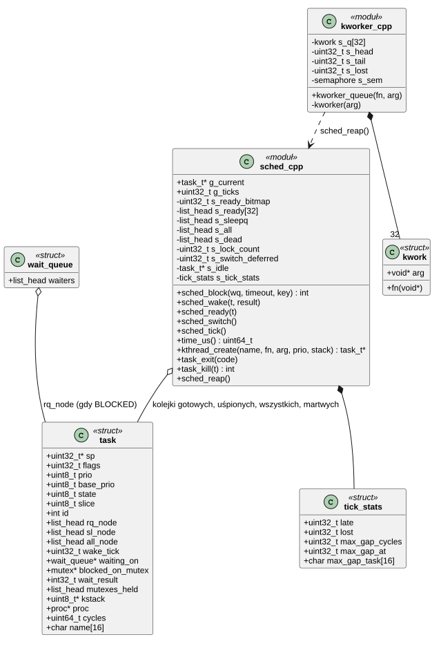
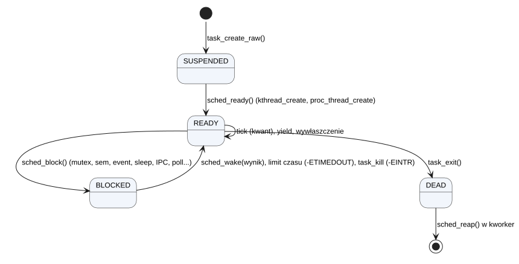
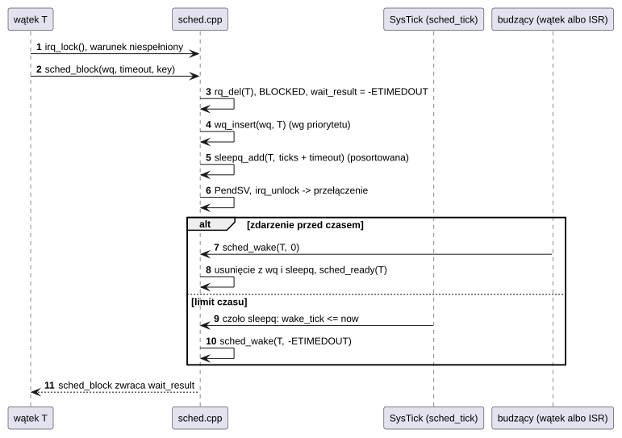
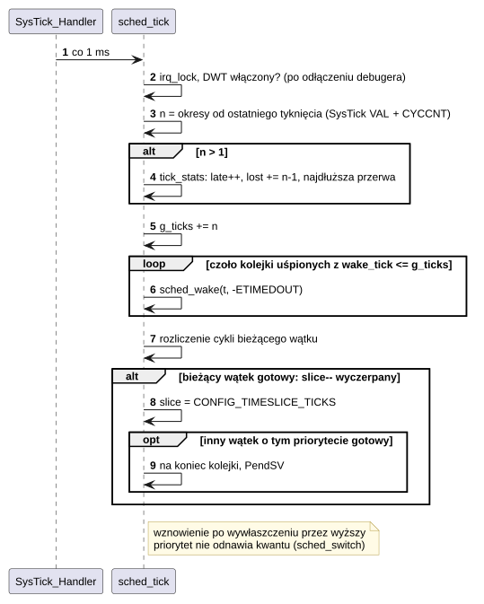
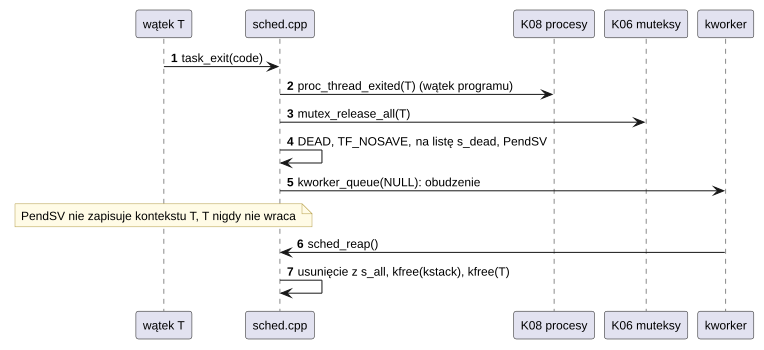

# K05 Scheduler, czas i praca odroczona

## 1. Identyfikacja

| | |
|---|---|
| Identyfikator | K05 |
| Warstwa | L0 |
| Pliki | `kernel/rtos/sched.cpp`, `kernel/rtos/kworker.cpp` |
| Interfejs | `kernel/include/crtos/sched.h` (dla modułów), `kernel/rtos/kernel.h` (wewnętrzny: `struct task`, `sched_*`) |

## 2. Odpowiedzialność

- Wątki: tworzenie (wątki jądra), stany, zakończenie, zwalnianie, zabijanie.
- Wybór wątku: priorytety 0–31 z wywłaszczaniem, FIFO i kwant czasu wśród równych
  priorytetów, O(1).
- Blokowanie z limitem czasu i budzenie (podstawa K06, K10, K12 i reszty jądra).
- Zegar systemowy: tyknięcie 1 ms, czas w mikrosekundach, nadrabianie opóźnionych tyknięć.
- Rozliczanie czasu procesora wątków (licznik cykli DWT).
- `kworker`: wykonywanie krótkich zadań odroczonych w wątku (z przerwań, z obsługi błędów,
  z kończących się wątków).
- Tyknięcie sprawdza też termin najbliższego timera programowego (`timer_tick`, K21).
- Należy do rdzenia (`kernel/rtos`): ten sam scheduler działa w obrazie OS i RTOS; koniec
  wątku programu (`proc_thread_exited`) i zabicie procesu są tylko z `CONFIG_OS`.

Samą zmianę kontekstu wykonuje K01 (PendSV), regiony MPU programuje K03.

## 3. Wymagania

| ID | Wymaganie | Weryfikacja |
|---|---|---|
| REQ-K05-01 | Zawsze działa gotowy wątek o najwyższym priorytecie; wątek o niższym priorytecie nie dostaje procesora, dopóki gotowy jest wątek o wyższym. | `kmon test sched` (część „priority”) |
| REQ-K05-02 | Gotowe wątki o tym samym priorytecie dzielą procesor po równo, kwantem `CONFIG_TIMESLICE_TICKS` (5 ms), także gdy wątki o wyższym priorytecie często je wywłaszczają: wątek wywłaszczony zachowuje resztę kwantu, nowy kwant dostaje dopiero wtedy, gdy staje się gotowy albo przechodzi na koniec kolejki. | `kmon test sched` (różnica < 10%; z wywłaszczaniem co tyknięcie < 20%) |
| REQ-K05-03 | Wybór następnego wątku i obsługa tyknięcia mają czas stały względem liczby wątków gotowych (mapa bitowa + CLZ; kolejka uśpionych posortowana). | przegląd kodu, `crtos bench` (`k-switch`) |
| REQ-K05-04 | Blokujące oczekiwanie z limitem czasu kończy się najpóźniej w tyknięciu `now + timeout` wynikiem `-ETIMEDOUT`. | `kmon test sem`, `apptest` (futex, IPC z limitem czasu) |
| REQ-K05-05 | Zabity wątek zablokowany w jądrze budzi się z `-EINTR`; wątek programu wywłaszczony w kodzie programu kończy się przy najbliższym wznowieniu; wątek w wywołaniu systemowym – przy jego końcu. | `apptest` (cykl życia), `kmon test user` |
| REQ-K05-06 | Tyknięcia, których przerwanie SysTick nie obsłużyło na czas (przerwania zablokowane > 1 ms), są doliczane z licznika cykli; zegar nie opóźnia się względem czasu rzeczywistego. | `kmon uptime` (statystyka `late/lost`), test ręczny z zapisem flash (D07) |
| REQ-K05-07 | Pamięć zakończonego wątku (struktura, stos jądra) jest zwalniana poza tym wątkiem (w `kworker`). | `apptest` (pamięć po zakończeniu procesów), `kmon mem` |
| REQ-K05-08 | `sched_block` wywołane z przerwania, z zagnieżdżonej sekcji krytycznej albo przy `sched_lock` kończy się `panic`. | przegląd kodu |

## 4. Interfejs udostępniany

### 4.1 Dla modułów (`crtos/sched.h`)

| Funkcja | Kontekst | Opis | Wynik / błędy |
|---|---|---|---|
| `kthread_create(name, fn, arg, prio, stack)` | wątek | wątek jądra (uprzywilejowany), stos + strażnik 256 B w pamięci szybkiej, od razu gotowy | `task_t*` albo `NULL` (brak pamięci) |
| `task_exit(code)` | wątek | kończy bieżący wątek (nie wraca) | — |
| `kthread_stop(t)` | wątek | zabija wątek i czeka do 4 s, aż zniknie | 0, `-ETIMEDOUT` |
| `task_should_stop()` | wątek | czy bieżący wątek ma się zakończyć (`TF_KILLED`) | 0/1 |
| `task_kill(t)` | wątek, ISR | żądanie zakończenia (zob. REQ-K05-05) | 0, `-EINVAL` (idle, NULL) |
| `task_current()`, `task_name()`, `task_id()`, `task_priority()` | wszędzie | informacje | — |
| `task_set_priority(t, prio)` | wątek | priorytet bazowy 1..31; odziedziczony (wyższy) zostaje do zwolnienia muteksów | 0, `-EINVAL` |
| `task_yield()` | wątek | przejście na koniec kolejki swojego priorytetu | — |
| `task_sleep_ms(ms)`, `task_sleep_ticks(t)` | wątek | uśpienie (min. 1 tyknięcie) | 0, `-EINTR` |
| `tick_get()`, `tick_get64()` | wszędzie | liczba tyknięć (ms) od startu | — |
| `time_us()` | wszędzie | mikrosekundy od startu (tyknięcia + ułamek z SysTick) | — |
| `sched_lock()`, `sched_unlock()` | wątek | wyłączenie wywłaszczania (przerwania działają); przełączenie odłożone do `sched_unlock` | — |
| `task_errno_ptr()` | wątek | `errno` wątku dla bibliotek w jądrze (lwIP) | — |

### 4.2 Wewnętrzne (`kernel.h`)

| Funkcja | Kontekst | Opis |
|---|---|---|
| `sched_block(wq, timeout, key)` | wątek, sekcja krytyczna (`key` z `irq_lock`, musi być 0) | blokuje bieżący wątek na kolejce `wq` (albo tylko na czas); zwalnia blokadę; zwraca wynik ustawiony przez budzącego, `-ETIMEDOUT` albo `-EINTR` |
| `sched_wake(t, result)` | sekcja krytyczna | budzi zablokowany wątek z wynikiem |
| `sched_ready(t)` | sekcja krytyczna | wstawia do kolejki gotowych; PendSV, jeśli ma wyższy priorytet |
| `sched_set_prio(t, prio)` | sekcja krytyczna | zmiana priorytetu efektywnego (dziedziczenie, K06) |
| `wq_insert(wq, t)`, `wq_wake_one/all(wq, r)` | sekcja krytyczna / wszędzie | kolejki oczekiwania uporządkowane priorytetem |
| `sched_tick()` | SysTick | tyknięcie (uśpione wątki, kwant, `timer_tick` K21) |
| `sched_switch()` | PendSV | wybór wątku (K01) |
| `task_create_raw()`, `task_build_frame()`, `task_start_kernel()`, `task_redirect_to_exit()` | wątek / wyjątek | budowa wątków i ich kontekstu (K08, K04) |
| `kworker_queue(fn, arg)` | wszędzie (też ISR) | zadanie do wykonania w wątku `kworker` |
| `sched_tick_stats(&st)` | wątek | statystyka opóźnionych tyknięć |

## 5. Interfejsy wymagane

K01 (PendSV, `sched_start_asm`), K03 (`mpu_switch`, `mpu_set_guard`), K06 (`mutex_release_all`,
`mutex_waiter_changed`), K07 (`kmalloc`), K08 (`proc_thread_exited`, `proc_kill`), rejestry
SysTick, DWT (`CYCCNT`), SCB (`ICSR`).

## 6. Struktura statyczna

*Źródło: [K05/struktura-statyczna.puml](../diagramy/K05/struktura-statyczna.puml)*

`rq_node` wątku jest w dokładnie jednej liście: kolejce gotowych swojego priorytetu (stan
READY, także wątek działający – na czele), kolejce oczekiwania obiektu (BLOCKED) albo
liście martwych (DEAD). `sl_node` jest w kolejce uśpionych, gdy wątek czeka z limitem
czasu (`TF_SLEEPQ`).

## 7. Zachowanie dynamiczne

### 7.1 Stany wątku

*Źródło: [K05/stany-watku.puml](../diagramy/K05/stany-watku.puml)*

### 7.2 Blokowanie z limitem czasu

*Źródło: [K05/blokowanie-z-limitem-czasu.puml](../diagramy/K05/blokowanie-z-limitem-czasu.puml)*

### 7.3 Tyknięcie

*Źródło: [K05/tykniecie.puml](../diagramy/K05/tykniecie.puml)*

### 7.4 Zakończenie i zwolnienie wątku

*Źródło: [K05/zakonczenie-i-zwolnienie-watku.puml](../diagramy/K05/zakonczenie-i-zwolnienie-watku.puml)*

## 8. Implementacja

- **Kolejki gotowych**: 32 listy FIFO i 32-bitowa mapa niepustych list; wybór:
  `31 - __builtin_clz(mapa)` (instrukcja CLZ). Wątek `idle` (priorytet 0) jest zawsze
  gotowy, więc mapa nigdy nie jest pusta.
- **Kolejka uśpionych**: lista posortowana po `wake_tick` (porównanie z przeniesieniem:
  `(int32_t)(a - b)`). Wstawienie O(n) w liczbie uśpionych, obsługa tyknięcia O(1) na
  obudzony wątek.
- **Kolejki oczekiwania** (`wait_queue`): uporządkowane malejąco po priorytecie, FIFO wśród
  równych; `wq_wake_one` budzi wątek o najwyższym priorytecie.
- **Przekazanie wyniku**: budzący ustawia `wait_result` (np. semafor przekazuje jednostkę,
  mutex – własność), więc obudzony nie musi ponownie sprawdzać warunku.
- **Czas**: `time_us()` = (tyknięcia + nieobsłużone okresy) × 1000 + ułamek z `SysTick->VAL`;
  64-bitowy licznik tyknięć (`s_ticks_hi`). `periods_since_tick()` czyta `VAL` i `CYCCNT`
  spójnie (powtórzenie przy przeładowaniu SysTick).
- **Rozliczanie CPU**: przy każdym przełączeniu i tyknięciu `cycles += CYCCNT - switch_in`;
  różnica ≥ 2³¹ (licznik zatrzymany przez debuger) jest pomijana.
- **Kwant**: `slice` ustawiają na `CONFIG_TIMESLICE_TICKS` tylko `sched_ready` (wątek staje
  się gotowy), `task_yield` i `sched_tick` (przeniesienie na koniec kolejki). `sched_switch`
  go nie odnawia: wcześniej każde wznowienie po wywłaszczeniu dawało nowy kwant, więc wątek
  bez wywołań systemowych, wywłaszczany częściej niż co 5 ms (np. przez `esp32-pad`), nigdy
  nie oddawał procesora wątkom o tym samym priorytecie (`gfxd`, okna) – naprawione
  27.09.2026, test w `kmon test sched`.
- **`sched_lock`**: licznik; `sched_switch` przy liczniku > 0 pozostawia bieżący gotowy wątek
  i zapamiętuje przełączenie (`s_switch_deferred`), które wykonuje `sched_unlock`.
- **`kworker`**: pierścień 32 zadań bez alokacji (bezpieczny w przerwaniu); przepełnienie jest
  liczone i zgłaszane. Priorytet 24 (najwyższy wątek systemu), żeby zwalnianie pamięci nie
  czekało na zajęte wątki.
- **Zabijanie**: `task_kill` ustawia `TF_KILLED`; wątek zablokowany budzi `-EINTR`; wątek
  programu wywłaszczony w kodzie programu dostaje nowy kontekst `task_exit` (tylko gdy nie
  działa i nie jest w wywołaniu); wątek w wywołaniu kończy się w `syscall_exit` (K01).

## 9. Obsługa błędów i mechanizmy bezpieczeństwa

| Sytuacja | Reakcja |
|---|---|
| `sched_block` z przerwania / zagnieżdżonej sekcji / przy `sched_lock` | `panic` |
| brak pamięci na wątek lub stos | `kthread_create` zwraca `NULL` |
| brak wątku `idle` albo `kworker` przy starcie | `panic` |
| przepełnienie kolejki `kworker` | zadanie pominięte, komunikat `E: kworker queue overflow` |
| wątek kończący się z muteksami | `mutex_release_all`: muteksy przekazane czekającym |
| debuger wyłączył licznik cykli | włączenie w `sched_tick` i `cpu_cycles()` |

## 10. Konfiguracja

`CONFIG_TICK_HZ` (1000), `CONFIG_NUM_PRIO` (32), `CONFIG_TIMESLICE_TICKS` (5),
`CONFIG_KTHREAD_STACK` (2048), `CONFIG_STACK_GUARD` (256); `KWORK_SLOTS` (32) w
`kworker.cpp`. Stałe priorytetów: `PRIO_IDLE` 0, `PRIO_LOW` 4, `PRIO_NORMAL` 10,
`PRIO_HIGH` 20, `PRIO_MAX` 31.

## 11. Weryfikacja

- `crtos kmon "test sched"`: trzy wątki o równym priorytecie (równy podział, różnica < 10%),
  para wątków o różnych priorytetach (niższy nie działa przed końcem wyższego) oraz dwa
  wątki o równym priorytecie wywłaszczane w każdym tyknięciu przez wątek o wyższym (równy
  podział, różnica < 20%).
- `crtos kmon "test sem"`: przełączanie przez semafor, koszt przełączenia.
- `crtos kmon uptime`: czas, bezczynność, opóźnione tyknięcia.
- `crtos kmon ps`: stany, priorytety, obciążenie, zużycie stosów.
- `crtos bench`: `k-switch`, `thread`.

## 12. Ograniczenia i znane problemy

- Wstawienie do kolejki uśpionych i do kolejki oczekiwania jest liniowe względem liczby
  czekających na tym obiekcie / uśpionych.
- Kwant czasu dotyczy tylko wątków o równym priorytecie; brak ochrony przed wątkiem
  o wysokim priorytecie, który nie blokuje (brak budżetów czasu).
- `kthread_stop` czeka najwyżej ok. 4 s.
