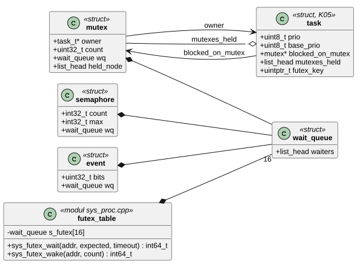
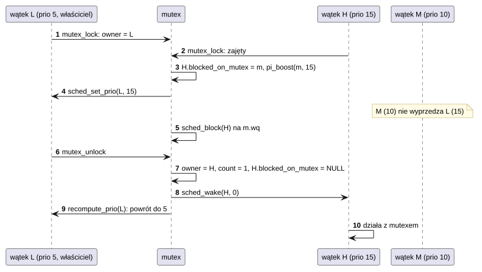
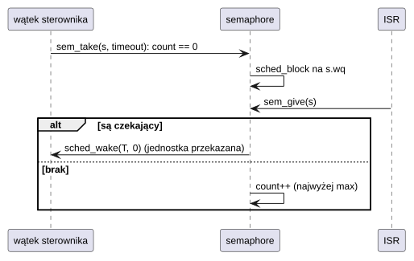
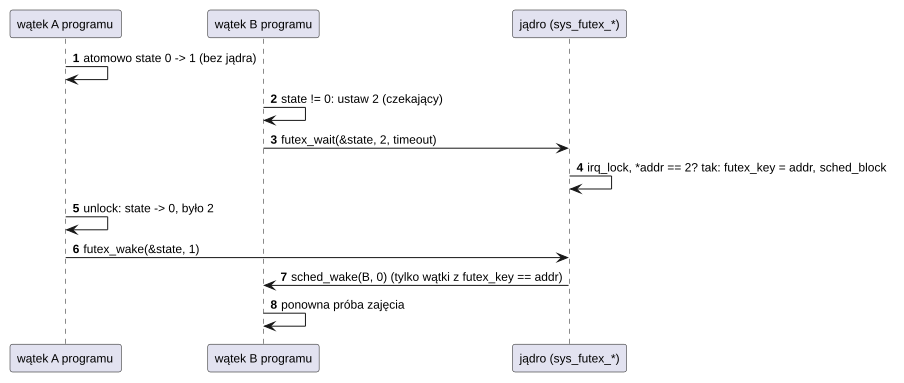

# K06 Synchronizacja

## 1. Identyfikacja

| | |
|---|---|
| Identyfikator | K06 |
| Warstwa | L0 |
| Pliki | `kernel/rtos/sync.cpp`; futeksy w `kernel/os/sys_proc.cpp`; kolejki oczekiwania w `kernel/rtos/sched.cpp` |
| Interfejs | `kernel/include/crtos/sync.h`; futeksy: `SYS_FUTEX_WAIT`, `SYS_FUTEX_WAKE` (`crtos/syscall.h`) |

## 2. Odpowiedzialność

- Mutex jądra: rekurencyjny dla właściciela, z dziedziczeniem priorytetu (także
  łańcuchowym), z przekazaniem własności przy zwolnieniu.
- Semafor zliczający z limitem.
- Flagi zdarzeń (32 bity) z czekaniem na dowolną lub wszystkie flagi.
- Futeksy dla programów: czekanie na zmianę słowa w pamięci programu (podstawa
  `crtos_mutex_t`, `pthread_mutex`, `pthread_cond`, `crtos_thread_join` w L01).
- Zwolnienie wszystkich muteksów wątku, który się kończy.
- Kolejki komunikatów i timery programowe zbudowane na tych mechanizmach opisuje K21.

## 3. Wymagania

| ID | Wymaganie | Weryfikacja |
|---|---|---|
| REQ-K06-01 | Właściciel mutexu, na który czeka wątek o wyższym priorytecie, działa z priorytetem tego wątku (także w łańcuchu do 8 muteksów), dopóki go nie zwolni; potem wraca do priorytetu wynikającego z pozostałych muteksów. | `kmon test mutex` (wątek o średnim priorytecie nie wyprzedza, właściciel działa z priorytetem 15) |
| REQ-K06-02 | `mutex_unlock` przekazuje mutex czekającemu o najwyższym priorytecie; nikt inny nie może go przejąć w międzyczasie. | przegląd kodu, `kmon test mutex` |
| REQ-K06-03 | `mutex_unlock` przez wątek niebędący właścicielem zatrzymuje system (`panic`). | przegląd kodu |
| REQ-K06-04 | Muteksy trzymane przez kończący się wątek przechodzą na czekających (brak zakleszczenia). | przegląd kodu (`mutex_release_all` w `task_exit`) |
| REQ-K06-05 | `sem_give` jest bezpieczny w przerwaniu; jednostka trafia bezpośrednio do obudzonego wątku; licznik nie przekracza `max`. | `kmon test sem`, sterowniki (D02–D06) |
| REQ-K06-06 | Każde blokujące czekanie ma limit czasu (`WAIT_FOREVER`, `NO_WAIT` albo tyknięcia) i przerywa się `-EINTR`, gdy wątek jest zabijany. | `kmon test sem`, `apptest` (futex) |
| REQ-K06-07 | `futex_wait` blokuje tylko wtedy, gdy słowo ma wartość oczekiwaną (sprawdzenie i zaśnięcie atomowo względem `futex_wake`); słowo musi być wyrównane i leżeć w pamięci programu. | `apptest` (futex, wątki POSIX) |

## 4. Interfejs udostępniany

| Funkcja | Kontekst | Warunki i wynik |
|---|---|---|
| `mutex_init(m)` / `MUTEX_INIT(m)` | wszędzie | mutex wolny |
| `mutex_lock(m, timeout)` | wątek | 0 (własność; rekurencyjnie: licznik+1), `-ETIMEDOUT`, `-EINTR` |
| `mutex_trylock(m)` | wątek | 1: wołający ma mutex (był wolny albo już był jego), 0: należy do innego wątku; nigdy nie czeka |
| `mutex_unlock(m)` | wątek (właściciel) | przy liczniku 0: przekazanie czekającemu albo zwolnienie; nie-właściciel: `panic` |
| `sem_init(s, initial, max)` | wszędzie | `max` ≤ 0 oznacza 1 |
| `sem_take(s, timeout)` | wątek (`NO_WAIT` także ISR) | 0, `-ETIMEDOUT`, `-EINTR` |
| `sem_give(s)` | wątek, ISR | budzi najwyższy priorytet albo zwiększa licznik (do `max`) |
| `event_init(e)` | wszędzie | flagi 0 |
| `event_set(e, bits)` | wątek, ISR | ustawia flagi, budzi wszystkich czekających (sprawdzą warunek) |
| `event_clear(e, bits)` | wątek, ISR | kasuje flagi |
| `event_wait(e, bits, mode, timeout)` | wątek | `EVENT_ANY`/`EVENT_ALL`, opcjonalnie `EVENT_CLEAR`; wynik: dopasowane flagi (> 0), `-ETIMEDOUT`, `-EINTR` |
| `wq_init`, `wq_wake_one`, `wq_wake_all` | wszędzie | kolejka oczekiwania dla własnych obiektów (K05) |
| `SYS_FUTEX_WAIT(addr, expected, timeout_ms)` | program | 0 (obudzony), `-EAGAIN` (wartość inna), `-ETIMEDOUT`, `-EINTR`, `-EFAULT` |
| `SYS_FUTEX_WAKE(addr, count)` | program | liczba obudzonych, `-EFAULT` |

## 5. Interfejsy wymagane

K05: `irq_lock`, `sched_block`, `sched_wake`, `sched_set_prio`, `wq_insert`, `g_current`;
K08: `uaccess_ok` (futeksy).

## 6. Struktura statyczna

*Źródło: [K06/struktura-statyczna.puml](../diagramy/K06/struktura-statyczna.puml)*

## 7. Zachowanie dynamiczne

### 7.1 Dziedziczenie priorytetu

*Źródło: [K06/dziedziczenie-priorytetu.puml](../diagramy/K06/dziedziczenie-priorytetu.puml)*

### 7.2 Semafor z przerwania

*Źródło: [K06/semafor-z-przerwania.puml](../diagramy/K06/semafor-z-przerwania.puml)*

### 7.3 Futex (mutex programu)

*Źródło: [K06/futex-mutex-programu.puml](../diagramy/K06/futex-mutex-programu.puml)*

## 8. Implementacja

- Wszystkie operacje na strukturach wykonują się pod `irq_lock()`; czekanie przez
  `sched_block()`, który zwalnia blokadę w chwili przełączenia.
- **Mutex**: `pi_boost()` podnosi priorytet właściciela i dalej, jeśli ten sam czeka na
  mutex, do głębokości 8. `recompute_prio()` wylicza priorytet efektywny jako maksimum
  priorytetu bazowego i najwyższego czekającego na każdym trzymanym mutexie. Czekający, który
  zrezygnował (limit czasu, `-EINTR`), wywołuje przez `sched_wake` → `mutex_waiter_changed`
  ponowne wyliczenie priorytetu właściciela.
- **Semafor**: `sem_give` przy czekających nie zwiększa licznika, tylko budzi z wynikiem 0
  (jednostka przekazana), co wyklucza „kradzież” przez trzeci wątek.
- **Zdarzenia**: `event_set` budzi wszystkich czekających; każdy sprawdza swój warunek
  w pętli z pozostałym czasem (`deadline`). Wynik jest zawsze dodatni (bit 31 nie jest
  używany).
- **Futeksy**: 16 kubełków (kolejek) wg adresu; wątek zapamiętuje adres w `futex_key`, a
  `futex_wake` budzi tylko wątki z tym adresem. Kolejki uporządkowane priorytetem.

## 9. Obsługa błędów i mechanizmy bezpieczeństwa

| Sytuacja | Reakcja |
|---|---|
| odblokowanie cudzego mutexu | `panic("mutex_unlock by non-owner")` |
| czekanie w przerwaniu | `panic` w `sched_block` (K05) |
| kończący się właściciel | `mutex_release_all` |
| zły adres futeksu (niewyrównany, poza pamięcią programu) | `-EFAULT` |
| wątek zabijany w czasie czekania | `-EINTR` |

## 10. Konfiguracja

Głębokość łańcucha dziedziczenia (8) w `pi_boost()`; `FUTEX_BUCKETS` (16) w `sys_proc.cpp`.

## 11. Weryfikacja

- `crtos kmon "test mutex"`: wątki o priorytetach 5, 10, 15; sprawdza priorytet właściciela
  (15) i czas czekania wątku 15 (< 80 ms mimo wątku 10 zajmującego procesor przez 150 ms).
- `crtos kmon "test sem"`: 20 000 wymian semaforami między dwoma wątkami.
- `crtos run apptest`: grupy „threads and mutexes”, „futex”, „POSIX threads”.

## 12. Ograniczenia i znane problemy

- Wstawienie do kolejki oczekiwania jest liniowe względem liczby czekających.
- Mutex jądra nie wykrywa zakleszczeń (poza limitem czasu wołającego).
- Kubełki futeksów są współdzielone przez wszystkie procesy; wątki różnych procesów
  z tym samym adresem (pamięć współdzielona) są budzone razem – zgodnie z intencją.
