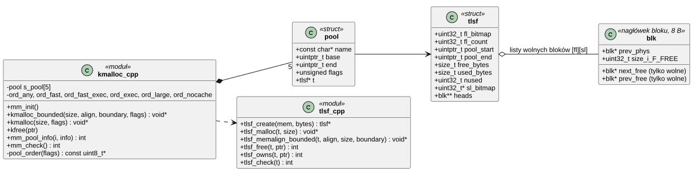
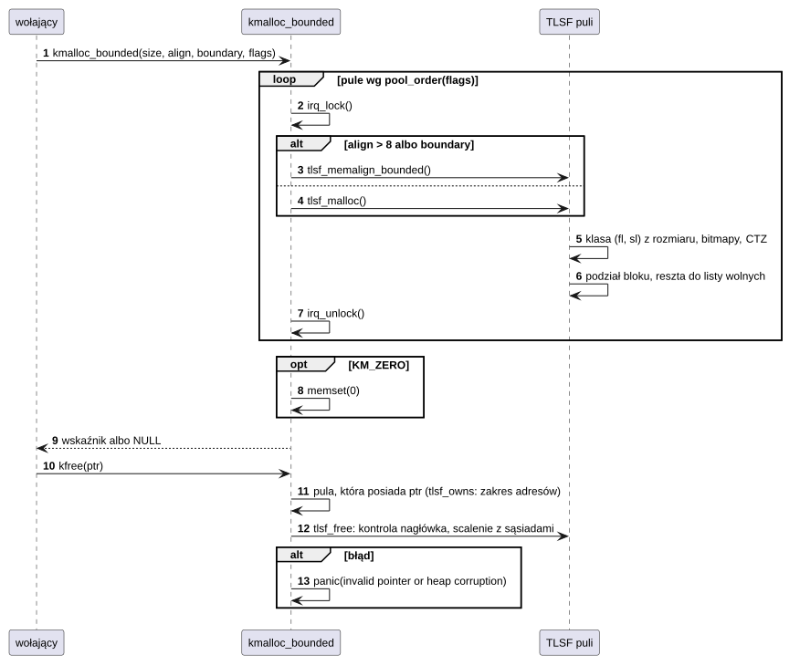

# K07 Pamięć jądra

## 1. Identyfikacja

| | |
|---|---|
| Identyfikator | K07 |
| Warstwa | L0 |
| Pliki | `kernel/rtos/mm/kmalloc.cpp`, `kernel/rtos/mm/tlsf.cpp`, `tlsf.h`; pomocniczo `kernel/lib/memops.c` (`memcpy`/`memmove`/`memset`), `kernel/lib/syscalls.c` (sterta newlib w jądrze) |
| Interfejs | `kernel/include/crtos/mm.h` |

## 2. Odpowiedzialność

- Przydział i zwalnianie pamięci jądra w pięciu pulach: DTCM, ITCM, OCRAM, SDRAM,
  SDRAM bez pamięci podręcznej. Każda pula to osobna sterta TLSF.
- Wybór puli według flag (szybka, wykonywalna, duża, bez cache, dla DMA).
- Przydziały wyrównane oraz takie, które nie przekraczają granicy (areny procesów, bufory
  DMA).
- Statystyka i kontrola spójności stert.

Pamięć programów (sterta w arenie, `sbrk`) nie jest częścią tego komponentu (K08, K09);
arena jako całość jest jednak przydzielana stąd (`kmalloc_bounded`, pula SDRAM).

## 3. Wymagania

| ID | Wymaganie | Weryfikacja |
|---|---|---|
| REQ-K07-01 | `kmalloc`, `kfree` i odmiany mają czas wykonania ograniczony niezależnie od stanu sterty (TLSF: O(1) na pulę, najwyżej 5 pul). | przegląd kodu, `kmon test heap` (średni koszt) |
| REQ-K07-02 | Zwrócony blok ma żądane wyrównanie (co najmniej 8 B) i, gdy podano granicę, nie przekracza wielokrotności tej granicy. | `kmon test heap` (wyrównanie), start procesów (areny) |
| REQ-K07-03 | Blok z flagą `KM_NOCACHE` pochodzi wyłącznie z SDRAM bez cache; `KM_FAST` z DTCM/ITCM (a gdy zabraknie: OCRAM, SDRAM); `KM_DMA` nigdy z TCM. | przegląd kodu |
| REQ-K07-04 | `kfree` wskaźnika, który nie jest początkiem bloku żadnej puli, albo przy uszkodzonej stercie zatrzymuje system (`panic`). | przegląd kodu |
| REQ-K07-05 | Funkcje są bezpieczne w przerwaniach (operacje na puli pod `irq_lock`). | przegląd kodu |
| REQ-K07-06 | Sąsiednie wolne bloki są zawsze scalane; `mm_check` wykrywa naruszenie struktury sterty. | `kmon test heap`, `kmon mem` |
| REQ-K07-07 | Obszar szybkiego kodu (koniec ITCM za kodem jądra i 2 KB jego sterty, od granicy 8 KB) ma jednego właściciela naraz; blok z niego leży na szczycie ITCM i ma rozmiar dający się opisać jednym regionem MPU (co 8 KB do 64 KB, co 16 KB powyżej). | przegląd kodu, `crtos kmon mem` (`fastcode`) |
| REQ-K07-08 | Z flagami `KM_FAST`, `KM_EXEC` i `KM_ONCHIP` blok pochodzi wyłącznie z pamięci w układzie (ITCM, OCRAM), nigdy z SDRAM. | przegląd kodu |
| REQ-K07-09 | Blok z granicą leży w wybranym wolnym bloku w najniższym albo najwyższym możliwym miejscu – w tym, po którym zostaje większy ciągły kawałek wolnej pamięci. | przegląd kodu, `heaptest` (arena `cc1` na górze, okno sterty 21,5 MB z reszty) |

## 4. Interfejs udostępniany

| Funkcja | Kontekst | Opis | Wynik |
|---|---|---|---|
| `kmalloc(size, flags)` | wątek, ISR | blok wyrównany do 8 B | wskaźnik albo `NULL` |
| `kzalloc(size, flags)` | wątek, ISR | jw., wyzerowany | jw. |
| `kmalloc_aligned(size, align, flags)` | wątek, ISR | wyrównanie `align` (potęga dwójki) | jw. |
| `kmalloc_bounded(size, align, boundary, flags)` | wątek, ISR | jw., blok nie przekracza wielokrotności `boundary` | jw. |
| `kfree(ptr)` | wątek, ISR | zwolnienie; `NULL` ignorowany | `panic` przy złym wskaźniku |
| `ksize(ptr)` | wątek, ISR | użyteczny rozmiar bloku | bajty |
| `mm_pool_count()`, `mm_pool_info(i, &info)` | wątek | nazwa, adres, rozmiar, wolne, największy wolny blok | 0, `-EINVAL` |
| `mm_check()` | wątek | przegląd wszystkich bloków (wolne!) | 0 albo kod błędu |
| `kmalloc_fastcode(size, &got)` | wątek, ISR | blok obszaru szybkiego kodu na szczycie ITCM (zaokrąglony do 8 KB, powyżej 64 KB do 16 KB) dla jednego programu (K16); `kfree` go oddaje | wskaźnik albo `NULL` (zajęty, za mały) |

Flagi: `KM_ANY` (0), `KM_FAST`, `KM_EXEC`, `KM_LARGE`, `KM_NOCACHE`, `KM_DMA`, `KM_ONCHIP`,
`KM_ZERO`. `mm_pool_info` podaje po pulach TLSF jeszcze obszar szybkiego kodu (`fastcode`).

## 5. Interfejsy wymagane

K02/arch (`irq_lock`), symbole linkera końców sekcji w każdej pamięci
(`__end_noinit_*`, `__top_*`, `_pvHeapLimit`, `_vStackBase`), K15 (`panic`, `printk`).

## 6. Struktura statyczna

*Źródło: [K07/struktura-statyczna.puml](../diagramy/K07/struktura-statyczna.puml)*

## 7. Pule

| Pula | Pamięć | Flagi puli | Zakres |
|---|---|---|---|
| `dtcm` | DTCM | `KM_FAST` | od `_pvHeapLimit` do dna stosu MSP |
| `itcm` | ITCM | `KM_FAST`, `KM_EXEC` | za kodem jądra w ITCM, do obszaru szybkiego kodu (co najmniej 2 KB) |
| `fastcode` | ITCM | – (nie TLSF) | od granicy 8 KB za pulą `itcm` do końca ITCM (ok. 80 KB): szybki kod jednego programu |
| `ocram` | OCRAM | `KM_EXEC`, `KM_DMA` | za logiem jądra |
| `sdram` | SDRAM | `KM_EXEC`, `KM_DMA`, `KM_LARGE` | cała SDRAM poza sekcjami `.noinit` |
| `ncache` | SDRAM bez cache | `KM_NOCACHE`, `KM_DMA` | 2 MB |

Kolejność prób (pierwsza pula, która ma miejsce):

| Flagi | Kolejność |
|---|---|
| `KM_NOCACHE` | ncache |
| `KM_FAST` | dtcm, itcm, ocram, sdram |
| `KM_FAST` + `KM_EXEC` | itcm, ocram, sdram |
| `KM_FAST` + `KM_EXEC` + `KM_ONCHIP` | itcm, ocram |
| `KM_LARGE` | sdram, ocram |
| `KM_EXEC` albo `KM_DMA` | ocram, sdram |
| `KM_ANY` | ocram, sdram, dtcm |

## 8. Zachowanie dynamiczne

*Źródło: [K07/zachowanie-dynamiczne.puml](../diagramy/K07/zachowanie-dynamiczne.puml)*

## 9. Implementacja

- **TLSF** (Two-Level Segregated Fit): pierwszy poziom dzieli rozmiary potęgami dwójki,
  drugi każdą potęgę na 16 przedziałów liniowych. Mapy bitowe niepustych klas pozwalają
  znaleźć blok instrukcjami CLZ/CTZ w czasie stałym. `mapping_search()` zaokrągla rozmiar
  w górę do granicy klasy, więc każdy blok znalezionej klasy jest wystarczający.
- Blok ma 8-bajtowy nagłówek (wskaźnik na fizycznie poprzedni blok i rozmiar z bitem
  „wolny”). Wolne bloki trzymają wskaźniki list w swojej zawartości. Wolne bloki nigdy nie
  sąsiadują (scalanie przy zwalnianiu), koniec puli oznacza blok-strażnik.
- `tlsf_memalign_bounded()` szuka bloku z zapasem na wyrównanie i granicę, a nadmiar przed
  i za blokiem oddaje do list wolnych. Przy granicy (areny procesów, obiekty pamięci
  współdzielonej, K08, K11) w znalezionym wolnym bloku są dwa kandydackie miejsca, najniższe
  i najwyższe, i wygrywa to, które zostawia większą wolną resztę: arena postawiona na
  pierwszej granicy regionu w środku dużego wolnego bloku dzieliłaby go na dwie części,
  z których każda pomieści mniejszy następny obiekt wyrównany do regionu MPU.
- `kfree()` znajduje pulę po zakresie adresów (`tlsf_owns`), więc nie trzeba podawać
  flag przy zwalnianiu.
- Pamięć podręczna: pule nie wykonują operacji na cache; bloki `KM_NOCACHE` leżą w regionie
  MPU bez cache (K03).
- `kernel/lib/memops.c`: `memcpy`, `memmove`, `memset` kopiujące słowami po 32 B na obrót
  (jądro i programy); `NO_LIBCALL` zapobiega zamianie pętli przez kompilator na wywołanie
  tych samych funkcji. Źródło może być niewyrównane (dozwolone tylko w zwykłej pamięci).
- `kernel/lib/syscalls.c`: mała sterta dla wewnętrznych potrzeb newlib w jądrze
  (`_sbrk` między `_pvHeapStart` i `_pvHeapLimit`); jądro samo z niej nie korzysta.

## 10. Obsługa błędów i mechanizmy bezpieczeństwa

| Sytuacja | Reakcja |
|---|---|
| brak pamięci w żadnej dozwolonej puli | `NULL`; wołający zwraca `-ENOMEM` |
| zły wskaźnik lub uszkodzony nagłówek w `kfree` | `panic` z adresem i nazwą puli |
| wskaźnik spoza wszystkich pul | `panic("not a kernel heap pointer")` |
| uszkodzenie wykryte przez `mm_check` | kod błędu i komunikat `E: heap ... corrupted` |

## 11. Konfiguracja

Granice pul wynikają ze skryptu linkera (`kernel/platform/evkbimxrt1050/linker/`). Stałe
TLSF: `ALIGN` 8, `SL_LOG2` 4 (16 przedziałów), `MAX_REQUEST` ok. 2 GB.

## 12. Weryfikacja

- `crtos kmon "test heap"`: 4000 losowych operacji na 48 blokach, rozmiary do 16 KB,
  wyrównania do 1 KB, wszystkie rodzaje flag; kontrola zawartości, wyrównania i
  `mm_check` na końcu; średni koszt (ok. 700 cykli przy tej mieszance).
- `crtos kmon mem`: stan pul i kontrola spójności.
- `crtos run apptest` (cykl życia): wolna pamięć SDRAM przed i po uruchomieniu i zakończeniu
  8 procesów różni się o mniej niż 4 KB.

## 13. Ograniczenia i znane problemy

- Fragmentacja jest możliwa (TLSF ogranicza ją, ale nie eliminuje); duże areny wymagają
  ciągłego, wyrównanego bloku w SDRAM.
- `mm_check` przegląda całe sterty z maskowanymi przerwaniami (na pulę) – tylko do
  diagnostyki.
- Pule nie mają limitów per podsystem: wyczerpanie pamięci przez jeden podsystem dotyka
  wszystkich.
- Pula `itcm` ma tylko kilka KB; bloki `KM_FAST`, które nie zmieszczą się w DTCM, trafiają
  zwykle od razu do OCRAM albo SDRAM (np. stosy jądra przy wielu wątkach).
- Obszar szybkiego kodu obsługuje jeden program naraz (brak podziału między procesy).
