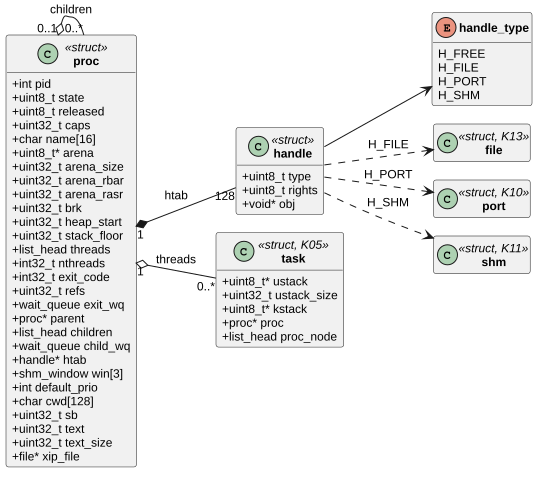
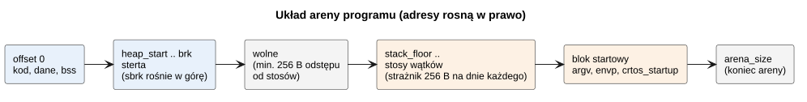
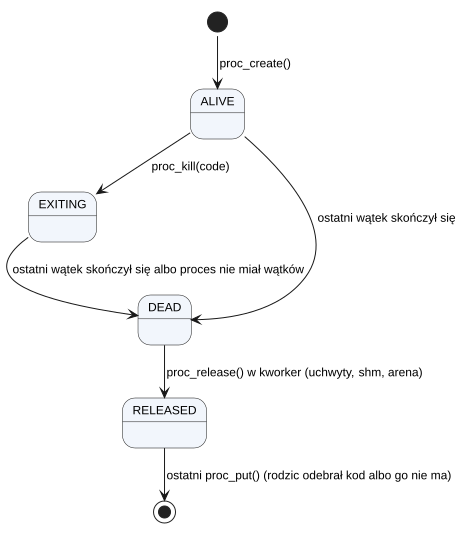
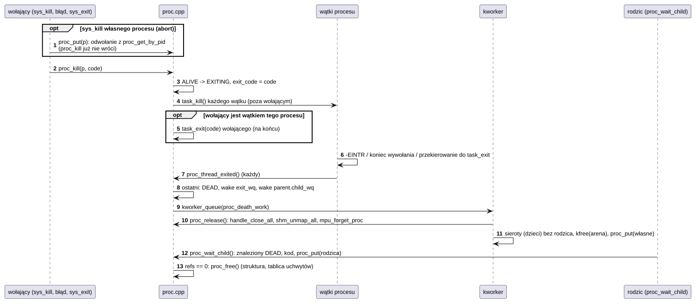
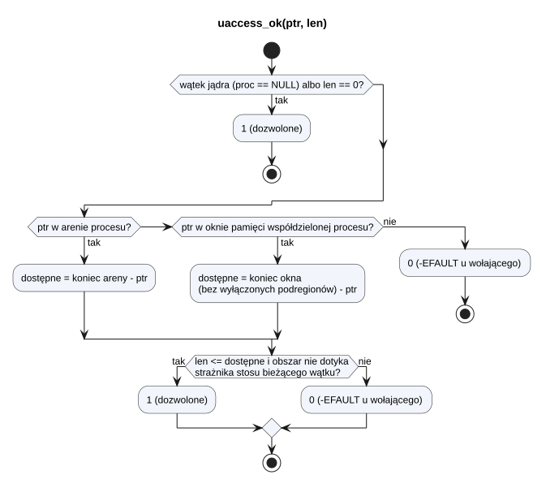

# K08 Procesy, uchwyty i uprawnienia

## 1. Identyfikacja

| | |
|---|---|
| Identyfikator | K08 |
| Warstwa | L0 |
| Pliki | `kernel/os/proc.cpp`, `kernel/os/handle.cpp`; wywołania w `kernel/os/sys_proc.cpp` (K09) |
| Interfejs | wewnętrzny: `kernel/rtos/kernel.h` (sekcje „processes”, „handles”); dla modułów: `kernel/include/crtos/uaccess.h` (`uaccess_ok`, `copy_from_user`, `copy_to_user`, `capable`) |

## 2. Odpowiedzialność

- Proces: arena (przydział w kształcie regionu MPU), wątki programu (stos w arenie + stos
  jądra), stan, kod wyjścia, rodzic i dzieci, katalog bieżący, domyślny priorytet; dla
  programu XIP (K16) adres GOT (`sb`, wpisywany do r9 każdego nowego wątku) i tekst
  wykonywany w miejscu (`text`, `text_size`, przypięty plik `xip_file`).
- Cykl życia: tworzenie, zakończenie (własne, przez innego, przez błąd), zwolnienie zasobów
  w `kworker`, czekanie rodzica na dziecko.
- Tablica uchwytów procesu (128) z typem i prawami; liczniki odwołań obiektów.
- Sprawdzanie wskaźników programu (`uaccess_ok`) i uprawnień (`capable`).

## 3. Wymagania

| ID | Wymaganie | Weryfikacja |
|---|---|---|
| REQ-K08-01 | Arena nowego procesu jest wyzerowana i ma kształt dający się wyrazić jednym regionem MPU. | przegląd kodu, `apptest` |
| REQ-K08-02 | Proces kończy się, gdy skończy się jego ostatni wątek; wtedy jego uchwyty są zamykane, pamięć współdzielona odmapowywana, a arena i blok szybkiego kodu (K16) zwalniane (w `kworker`). | `apptest` (cykl życia: brak wycieku pamięci), `crtos kmon mem` (`fastcode` po końcu programu) |
| REQ-K08-03 | `proc_kill` kończy wszystkie wątki procesu; kodem wyjścia jest pierwszy podany kod (proces kończący się nie zmienia kodu). | `apptest` (`kill` z kodem 77) |
| REQ-K08-04 | Rodzic otrzymuje kod wyjścia dziecka dokładnie raz (`proc_wait_child`); dziecko bez rodzica (rodzic zakończony) nie jest przez nikogo oczekiwane i jest zwalniane samo. | `apptest` (`ECHILD` po odebraniu) |
| REQ-K08-05 | `uaccess_ok(ptr, len, write)` przyjmuje obszar tylko wtedy, gdy w całości leży w arenie procesu albo w jednym z jego zmapowanych okien pamięci współdzielonej i nie dotyka strażnika stosu bieżącego wątku, a do odczytu także w tekście programu XIP wykonywanym w miejscu (K16); dla wątku jądra przyjmuje każdy obszar. | `apptest` (błędy i uprawnienia, `EFAULT`), `apptest_xip` (napisy we flashu w wywołaniach) |
| REQ-K08-09 | Każdy wątek procesu z adresem GOT (`sb`, program XIP) zaczyna z tym adresem w r9; tekst wykonywany w miejscu (`xip_file`) pozostaje otwarty do zwolnienia procesu. | `xiptest` (wątek), `apptest_xip`, przegląd kodu |
| REQ-K08-06 | Uchwyt jest używany tylko jako obiekt swojego typu (`handle_ref` z typem); zły numer lub typ daje `-EBADF`. | `apptest` (błędy) |
| REQ-K08-07 | Uprawnienia dziecka są podzbiorem uprawnień rodzica; `capable(caps)` jest prawdziwe tylko, gdy proces ma wszystkie wymagane bity. | `apptest` (`noperm`) |
| REQ-K08-08 | Obiekt (plik, port, shm, proces) jest zwalniany dopiero po ostatnim odwołaniu, a każde odwołanie wzięte przez jądro wraca także wtedy, gdy wołający wątek się kończy (proces kończący się własnym `kill`, jak `abort`, znika z listy procesów). | `apptest` (IPC, shm między procesami; `killself`: proces zwolniony po `crtos_kill` samego siebie, 01.10.2026) |

## 4. Interfejs udostępniany

### 4.1 Procesy (wewnętrzny)

| Funkcja | Kontekst | Opis | Wynik |
|---|---|---|---|
| `proc_create(name, arena_size, parent)` | wątek | proces z areną ≥ `arena_size`, wyzerowaną; 2 odwołania (własne + wołającego), +1 od rodzica | `proc*` / `NULL` |
| `proc_thread_create(p, entry, arg, ustack, prio)` | wątek | wątek ze stosem wyciętym ze szczytu areny (nad stertą) | `task_t*` / `NULL` |
| `proc_thread_create_at(p, entry, arg, stack, size, prio)` | wątek | wątek na stosie wskazanym przez program (w arenie, wyrównanym do 256 B, ≥ 768 B) | `task_t*` / `NULL` |
| `proc_kill(p, code)` | wątek, ISR | kończy wszystkie wątki; wołający wątek tego procesu kończy się na końcu | — |
| `proc_thread_exited(t, code)` | `task_exit` | ostatni wątek: proces martwy, budzi czekających, zwolnienie w `kworker` | — |
| `proc_get(p)`, `proc_put(p)` | wszędzie | liczniki odwołań; ostatni `put` zwalnia strukturę | — |
| `proc_detach(p)` | wątek | odłącza od rodzica (nikt nie będzie czekał) | — |
| `proc_wait(p, timeout, &code)` | wątek | czeka na śmierć procesu | 0, `-ETIMEDOUT`, `-EINTR` |
| `proc_wait_child(parent, pid, timeout, &code)` | wątek | czeka na dziecko (`pid` albo -1) i je odbiera | pid, `-ECHILD`, `-ETIMEDOUT`, `-EINTR` |
| `proc_find(pid)` / `proc_get_by_pid(pid)` | `sched_lock` / wątek | wyszukanie (drugie z odwołaniem) | `proc*` / `NULL` |
| `proc_foreach(fn, ctx)`, `proc_count()` | wątek | przegląd | — |

### 4.2 Pamięć programu i uprawnienia (`crtos/uaccess.h`)

| Funkcja | Kontekst | Opis | Wynik |
|---|---|---|---|
| `uaccess_ok(ptr, len, write)` | wątek | zob. REQ-K08-05 | 1/0 |
| `copy_from_user(dst, src, len)`, `copy_to_user(dst, src, len)` | wątek | kopia po sprawdzeniu; w pamięci emulowanej programu przez pamięć podręczną stron (K20, może czekać na kartę) | 0, `-EFAULT` |
| `strncpy_from_user(dst, src, size)` | wątek | napis programu; kopiuje do granicy pamięci programu albo strażnika stosu (w pamięci emulowanej: K20) | długość, `-EFAULT`, `-ENAMETOOLONG` |
| `capable(caps)` | wątek | czy proces ma wszystkie `caps` (wątki jądra: zawsze) | 1/0 |

### 4.3 Uchwyty (wewnętrzny)

| Funkcja | Opis | Wynik |
|---|---|---|
| `handle_install(p, type, rights, obj, min)` | najniższy wolny numer ≥ `min`; odwołanie wołającego przechodzi do tablicy | numer, `-EMFILE`, `-EBADF` |
| `handle_install_at(p, h, type, rights, obj)` | pod numerem `h`, zamyka poprzedni obiekt (`dup2`) | `h`, `-EBADF` |
| `handle_ref(p, h, &type, &rights)` | obiekt z nowym odwołaniem, jeśli typ się zgadza (`H_FREE`: dowolny) | obiekt / `NULL` |
| `handle_close(p, h)` | zwalnia wpis i odwołanie (port odbiorczy: port martwy) | 0, `-EBADF` |
| `handle_close_all(p)`, `handle_count(p)` | przy zakończeniu procesu; statystyka | — |
| `obj_get`, `obj_put`, `obj_poll` | operacje zależne od typu (`H_FILE`, `H_PORT`, `H_SHM`) | — |

## 5. Interfejsy wymagane

K05 (wątki, kolejki oczekiwania, `kworker_queue`), K03 (`mpu_encode_region`,
`mpu_set_user_guards`, `mpu_forget_proc`), K07 (`kmalloc_bounded`), K10 (`port_*`), K11
(`shm_*`, `shm_window_span`), K13 (`vfs_close`, `vfs_poll`).

## 6. Struktura statyczna

*Źródło: [K08/struktura-statyczna.puml](../diagramy/K08/struktura-statyczna.puml)*

### Układ areny programu

K16 ustawia `brk`, `heap_start` i `stack_floor` przy uruchomieniu programu.

*Źródło: [K08/uklad-areny-programu.puml](../diagramy/K08/uklad-areny-programu.puml)*

## 7. Zachowanie dynamiczne

### 7.1 Stany procesu

*Źródło: [K08/stany-procesu.puml](../diagramy/K08/stany-procesu.puml)*

### 7.2 Zakończenie procesu

*Źródło: [K08/zakonczenie-procesu.puml](../diagramy/K08/zakonczenie-procesu.puml)*

### 7.3 Sprawdzenie wskaźnika programu

*Źródło: [K08/sprawdzenie-wskaznika-programu.puml](../diagramy/K08/sprawdzenie-wskaznika-programu.puml)*

## 8. Implementacja

- **Arena**: `arena_alloc()` bierze najmniejszą potęgę dwójki ≥ rozmiaru, dzieli ją na ósemki
  (podregiony MPU) i przydziela blok będący wielokrotnością ósemki, wyrównany do ósemki
  i nieprzekraczający granicy regionu (`kmalloc_bounded(..., KM_LARGE)`). Gdy się nie uda,
  próbuje regionu dwa razy większego (grubsze ósemki, więcej możliwych miejsc).
- **Stosy wątków** są wycinane od szczytu areny w dół (`stack_floor`), wyrównane do 256 B
  (strażnik MPU). Sterta rośnie od dołu (`sbrk`, K09) i nie może zbliżyć się do stosów na
  mniej niż 256 B.
- **Stos jądra** każdego wątku programu: 3 KB + 256 B strażnika w pamięci szybkiej (DTCM);
  oba strażniki ustawia `mpu_set_user_guards()`.
- **Liczniki odwołań** procesu: własne (do zwolnienia zasobów), rodzica (do odebrania
  kodu), jądra (`proc_get`). Struktura przeżywa zasoby, żeby rodzic mógł odczytać kod.
  `proc_kill` procesu wołającego nie wraca (kończy wołający wątek), więc wołający oddaje
  swoje odwołanie przed nim (`sys_kill` samego siebie: `abort()` programu). Do 01.10.2026
  `sys_kill` oddawał je po `proc_kill` i proces, który zabił sam siebie, zostawał na liście
  jako zakończony (`kmon procs`: `ended`) do restartu systemu.
- **Zwalnianie w `kworker`**: zamykanie plików może blokować (zapis na kartę), a arena może
  być jeszcze zmapowana dla kończącego się wątku.
- **Tablica uchwytów**: zmiany wpisów pod `irq_lock`; zwalnianie obiektów poza blokadą.
  Prawo `HR_RECV` oznacza odbiorczy koniec portu (nigdy nie jest przekazywane dalej).

## 9. Obsługa błędów i mechanizmy bezpieczeństwa

| Sytuacja | Reakcja |
|---|---|
| brak pamięci na arenę, tablicę, stos | `NULL` → `-ENOMEM` w wywołaniu |
| wskaźnik programu poza jego pamięcią | `uaccess_ok` = 0 → `-EFAULT` |
| wskaźnik w strażniku stosu wątku | odrzucony (inaczej jądro dostałoby błąd MPU) |
| uchwyt zły albo innego typu | `-EBADF` |
| brak uprawnienia | `-EPERM` (w wywołaniach, K09) |
| zakończenie w trakcie tworzenia (`app_spawn` nieudany) | `proc_detach` + `proc_kill` + `proc_put`: zasoby wracają |
| licznik odwołań 0 przy `proc_put` | `BUG_ON` → `panic` |

## 10. Konfiguracja

`CONFIG_MAX_HANDLES` (128), `CONFIG_KSTACK_SIZE` (3072), `CONFIG_STACK_GUARD` (256),
domyślny stos wątku programu `USTACK_DEFAULT` (4096), minimalna arena 4 KB.

## 11. Weryfikacja

- `crtos run apptest`: „errors and permissions”, „threads and mutexes”, „IPC, shm, poll
  between processes”, „memory protection”, „process lifecycle” (kod wyjścia, `kill`,
  `ECHILD`, proces zabijający sam siebie zwolniony, 8 procesów naraz, brak wycieku
  pamięci).
- `crtos kmon "test user"`, `"test usermem"`, `"test userstack"`.
- `crtos kmon procs`: procesy, pamięć, uchwyty, uprawnienia.

## 12. Ograniczenia i znane problemy

- Brak limitów zasobów na proces (pamięć SDRAM, liczba wątków) poza rozmiarem areny
  i liczbą uchwytów.
- `uaccess_ok` rozróżnia odczyt i zapis tylko dla tekstu programu XIP (tylko odczyt):
  obszary areny i okien są i tak w całości zapisywalne dla programu.
