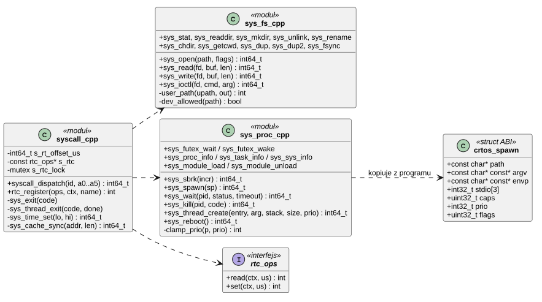
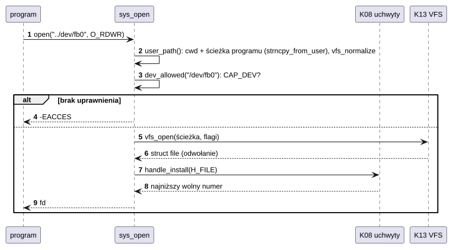
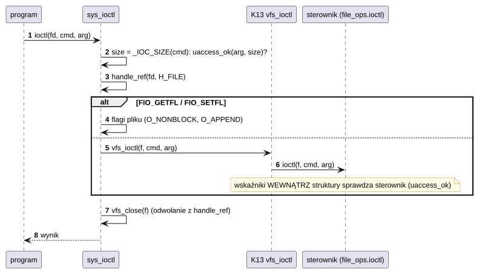

# K09 Wywołania systemowe

## 1. Identyfikacja

| | |
|---|---|
| Identyfikator | K09 |
| Warstwa | L0 (granica L0 ↔ L2/L3) |
| Pliki | `kernel/os/syscall.cpp` (rozdział, czas ścienny, RTC), `kernel/os/sys_fs.cpp` (pliki), `kernel/os/sys_proc.cpp` (procesy, wątki, futeksy, informacje, moduły, restart); pozostałe wywołania w K10, K11, K12, S05 |
| Interfejs | `kernel/include/crtos/syscall.h` (ABI, wspólny z programami), `kernel/include/crtos/rtc.h` (dla sterowników zegarów) |

## 2. Odpowiedzialność

- ABI: numery, argumenty, wyniki, struktury wymieniane z programami.
- Rozdział wywołania do implementacji (`syscall_dispatch`).
- Walidacja na granicy: wskaźniki (`uaccess_ok`, `copy_*_user`, `strncpy_from_user`),
  uchwyty (`handle_ref` z typem), uprawnienia (`caps`), ścieżki (normalizacja przed
  kontrolą), priorytety (`clamp_prio`).
- Wywołania plikowe (nad K13), procesowe (nad K08, K16), informacyjne, moduły, restart.
- Zegar ścienny: przesunięcie względem `time_us()` i rejestracja zegara RTC.

## 3. Wymagania

| ID | Wymaganie | Weryfikacja |
|---|---|---|
| REQ-K09-01 | Każdy wskaźnik przekazany przez program jest sprawdzony przed użyciem (obszar w pamięci programu); inaczej wynik `-EFAULT`. Dla `ioctl` jądro sprawdza obszar o rozmiarze zakodowanym w numerze polecenia. | `apptest` (błędy: `write` ze wskaźnikiem jądra → `EFAULT`) |
| REQ-K09-02 | Ścieżki są sprowadzane do postaci kanonicznej (bez `.`, `..`, `//`) przed kontrolą dostępu. | przegląd kodu, `apptest` (pliki, katalogi) |
| REQ-K09-03 | Proces bez `CAP_DEV` może otworzyć z `/dev` tylko `console`, `null`, `zero`, `random`, `urandom` i `audio` (`-EACCES`). | `apptest` (proces `noperm`) |
| REQ-K09-04 | `spawn` wymaga `CAP_SPAWN`; dziecko dostaje co najwyżej uprawnienia rodzica i priorytet ≤ 19. | przegląd kodu, `apptest` |
| REQ-K09-05 | `kill` innego procesu niż własny lub dziecko wymaga `CAP_KILL`; ładowanie modułów `CAP_MODULE`; restart i ustawienie zegara `CAP_SYS` (`-EPERM`). `kill` własnego procesu nie wraca i nie zostawia odwołania do procesu (REQ-K08-08). | przegląd kodu, `apptest` (`killself`) |
| REQ-K09-06 | Nieznany numer wywołania daje `-ENOSYS`. | przegląd kodu |
| REQ-K09-07 | Wynik ujemny w zakresie −4095..−1 oznacza błąd (`-Exxx`, wartości newlib). | `apptest` |

## 4. Interfejs udostępniany: ABI

Konwencja: `svc #0`, numer w R12, argumenty w R0–R5, wynik w R0 (R0:R1 dla 64 bitów),
pozostałe rejestry zachowane (K01).

| Nr | Wywołanie | Argumenty → wynik | Kontrole |
|---|---|---|---|
| 0 | `SYS_EXIT` | kod | kończy cały proces |
| 1 | `SYS_THREAD_EXIT` | kod, `*done` | `done` wyrównany i w pamięci programu; ustawiany na 1 i budzony (futex) |
| 2 | `SYS_WRITE` | fd, buf, len → bajty | uchwyt pliku, bufor |
| 3 | `SYS_SLEEP_MS` | ms | przerwanie przy zabiciu (`-EINTR`) |
| 4 | `SYS_YIELD` | — | — |
| 5–7 | `SYS_GETPID`, `SYS_GETTID`, `SYS_TIME_US` | → wartość | szybka ścieżka w SVC (K01) |
| 8 | `SYS_READ` | fd, buf, len → bajty | uchwyt, bufor |
| 9 | `SYS_OPEN` | ścieżka, flagi → fd | ścieżka, `CAP_DEV` dla `/dev` |
| 10 | `SYS_CLOSE` | uchwyt | dowolny typ |
| 11 | `SYS_LSEEK` | fd, lo, hi, whence → int64 | uchwyt |
| 12 | `SYS_IOCTL` | fd, cmd, arg | obszar `_IOC_SIZE(cmd)`; `FIO_GETFL/SETFL` obsługuje VFS |
| 13, 14 | `SYS_FSTAT`, `SYS_STAT` | fd/ścieżka, `crtos_stat*` | wskaźniki |
| 15 | `SYS_READDIR` | fd katalogu, `crtos_dirent*` → 1/0 | wskaźnik |
| 16–18 | `SYS_MKDIR`, `SYS_UNLINK`, `SYS_RENAME` | ścieżki | normalizacja |
| 19, 20 | `SYS_CHDIR`, `SYS_GETCWD` | ścieżka / bufor | katalog musi istnieć |
| 21, 22 | `SYS_DUP`, `SYS_DUP2` | uchwyt(y) | prawo odbioru portu nie jest kopiowane |
| 23 | `SYS_FSYNC` | fd | — |
| 24 | `SYS_SBRK` | przyrost → poprzedni koniec sterty | sterta w arenie, 256 B od stosów |
| 25 | `SYS_SPAWN` | `crtos_spawn*` → pid | `CAP_SPAWN`, kopia ścieżki, argv, envp (≤ 64, ≤ 4 KB) |
| 26 | `SYS_WAIT` | pid albo −1, `*status`, timeout → pid | tylko własne dzieci |
| 27 | `SYS_KILL` | pid, kod | własny, dziecko albo `CAP_KILL` |
| 28 | `SYS_THREAD_CREATE` | entry, arg, stos, rozmiar, prio → tid | stos w arenie, Thumb, `clamp_prio` |
| 29, 30 | `SYS_FUTEX_WAIT`, `SYS_FUTEX_WAKE` | adres, … | zob. K06 |
| 31 | `SYS_POLL` | `crtos_pollfd*`, n ≤ 32, timeout → gotowe | zob. K12 |
| 32–37 | `SYS_PORT_*`, `SYS_MSG_*` | … | zob. K10 |
| 38–40 | `SYS_SHM_*` | … | zob. K11 |
| 41–43 | `SYS_PROC_INFO`, `SYS_TASK_INFO`, `SYS_SYS_INFO` | indeks, struktura | wskaźniki |
| 44, 45 | `SYS_MODULE_LOAD`, `SYS_MODULE_UNLOAD` | ścieżka / nazwa | `CAP_MODULE` |
| 46 | `SYS_REBOOT` | — | `CAP_SYS` |
| 47 | `SYS_PIPE` | `fds[2]`, flagi (`PIPE_TTY`) | zob. K12 |
| 48, 49 | `SYS_TIME_GET`, `SYS_TIME_SET` | µs od 1970 | ustawienie: `CAP_SYS` |
| 50–61 | gniazda: `SOCKET`, `BIND`, `CONNECT`, `LISTEN`, `ACCEPT`, `SENDTO`, `RECVFROM`, `SHUTDOWN`, `SET/GETSOCKOPT`, `GETSOCKNAME`, `GETPEERNAME` | … | zob. S05 |
| 62 | `SYS_CACHE_SYNC` | adres, długość → 0 | obszar w pamięci programu, najwyżej 1 MB; czyści D-cache i unieważnia I-cache tego obszaru, żeby wykonać kod zapisany przez program (kompilator JIT) |
| 63 | `SYS_STATFS` | ścieżka, `struct crtos_statfs *` → 0 | rozmiar i wolne miejsce systemu plików ścieżki w bajtach (`vfs_statfs`, K13); `df`, `statvfs()` (L01) |
| 64 | `SYS_VMEM` | operacja (`VMEM_MAP` rozmiar → adres, `VMEM_UNMAP` adres, `VMEM_INFO` `struct crtos_vmeminfo *`) | pamięć emulowana (K20); `read`/`write` z buforem w niej idą przez bufor jądra po stronie, a ścieżki, argumenty i wyniki przez `copy_*_user` |

Struktury ABI (`crtos/syscall.h`): `crtos_stat`, `crtos_dirent`, `crtos_spawn`,
`crtos_startup`, `crtos_app_info`, `crtos_pollfd`, `crtos_msginfo`, `crtos_call`,
`crtos_procinfo`, `crtos_taskinfo`, `crtos_sysinfo`. Uprawnienia: `CAP_SPAWN`,
`CAP_KILL`, `CAP_MODULE`, `CAP_SYS`, `CAP_DEV`.

### Zegar czasu rzeczywistego (dla sterowników)

| Funkcja | Opis | Wynik |
|---|---|---|
| `rtc_register(ops, ctx, name)` | jeden zegar; data z niego ustawia zegar ścienny, jeśli jest późniejsza niż 2020-01-01 | 0, `-EBUSY` |
| `rtc_unregister(ctx)` | wyrejestrowanie | — |

## 5. Interfejsy wymagane

K01 (wejście), K08 (procesy, uchwyty, `uaccess`), K13 (VFS), K16 (`app_spawn`,
`module_load/unload`), K06 (futeksy), K10, K11, K12, S05, K05 (czas, `task_sleep_ms`).

## 6. Struktura statyczna

*Źródło: [K09/struktura-statyczna.puml](../diagramy/K09/struktura-statyczna.puml)*

## 7. Zachowanie dynamiczne

### 7.1 `open`

*Źródło: [K09/open.puml](../diagramy/K09/open.puml)*

### 7.2 `ioctl`

*Źródło: [K09/ioctl.puml](../diagramy/K09/ioctl.puml)*

## 8. Implementacja

- `syscall_dispatch` to `switch` po numerze (ITCM); każda gałąź woła jedną funkcję
  `sys_*` z argumentami rzutowanymi z `uint32_t`.
- Każde użycie uchwytu bierze odwołanie (`handle_ref`) i oddaje je na końcu, więc
  równoległe `close` z innego wątku nie zwolni obiektu w trakcie operacji.
- Ścieżki kopiowane są do bufora jądra (`VFS_PATH_MAX` = 128 B) i normalizowane; dopiero
  potem sprawdzane są uprawnienia (`/sd/../dev/fb0` → `/dev/fb0`).
- `sys_spawn`: kopia `crtos_spawn`, ścieżki (względna → z `cwd`), `argv` i `envp` (do 64
  wpisów, 4 KB tekstu) do bufora jądra; `caps & caps rodzica`; `clamp_prio`.
- `sys_sbrk`: sterta w arenie od `heap_start` do `stack_floor - 256`.
- Zegar ścienny: `SYS_TIME_GET` = `time_us()` + `s_rt_offset_us`; `SYS_TIME_SET` zmienia
  przesunięcie i zapisuje datę do zarejestrowanego RTC (D08).
- `sys_reboot`: log, 50 ms na wysłanie logu, `NVIC_SystemReset()`.
- `sys_cache_sync`: obszar wyrównany do linii 32 B, `SCB_CleanDCache_by_Addr`, potem
  `SCB_InvalidateICache_by_Addr` (bez tego procesor mógłby wykonać stare instrukcje z I-cache
  albo nie zobaczyć nowych, które są jeszcze w D-cache).

## 9. Obsługa błędów i mechanizmy bezpieczeństwa

| Błąd | Kod |
|---|---|
| zły wskaźnik | `-EFAULT` |
| zły uchwyt / zły typ uchwytu | `-EBADF` |
| brak uprawnienia | `-EPERM`, dla `/dev`: `-EACCES` |
| za długa ścieżka / argumenty | `-ENAMETOOLONG`, `-E2BIG` |
| brak pamięci jądra | `-ENOMEM` |
| nieznane wywołanie | `-ENOSYS` |
| brak dziecka | `-ECHILD` |
| wątek zabity w trakcie | `-EINTR` (i koniec wątku przy wyjściu z wywołania) |

## 10. Konfiguracja

`VFS_PATH_MAX` (128), `SPAWN_ARGS_MAX` (64), `SPAWN_STR_MAX` (4096), `SYS_PRIO_DEFAULT`
(10), `SYS_PRIO_MAX_USER` (19), `SYS_NR` (65).

## 11. Weryfikacja

- `crtos run apptest`: 1720 sprawdzeń przez libcrtos (wszystkie grupy).
- `crtos kmon "test syscall"`, `crtos bench` (`syscall`, `sysfull`).

## 12. Ograniczenia i znane problemy

- Uprawnienie `CAP_SYS` miało pozwalać na priorytety powyżej `SYS_PRIO_MAX_USER`
  (komentarz w `syscall.h`), ale `clamp_prio` ogranicza je do `PRIO_HIGH - 1` = 19, czyli
  do tej samej wartości.
- `sys_time_set` i `sys_reboot` odwołują się do `g_current->proc` bez sprawdzenia `NULL`;
  jest to poprawne, bo wywołania systemowe przychodzą tylko z wątków programów (K01
  odrzuca SVC z wątków jądra).
- Numery wywołań są stałe (ABI 1 programów); zmiana wymaga przebudowania wszystkich `.app`.
