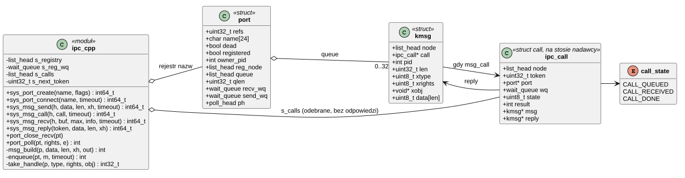
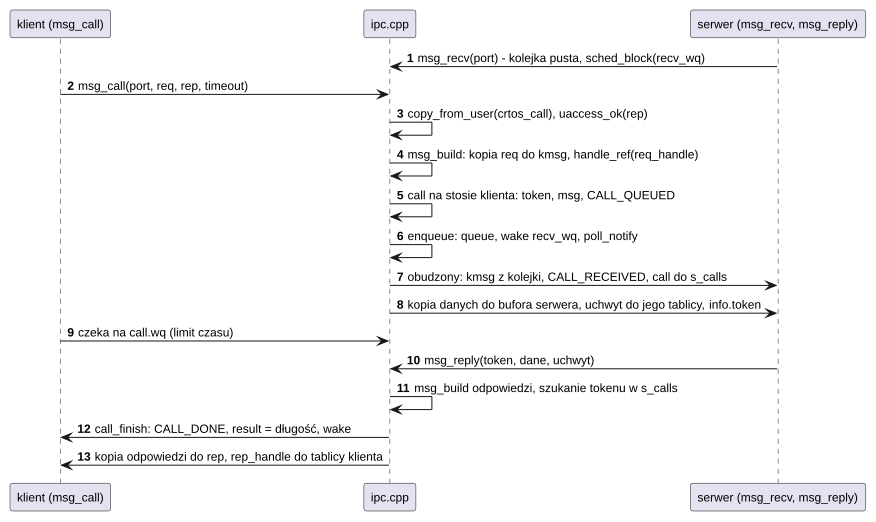
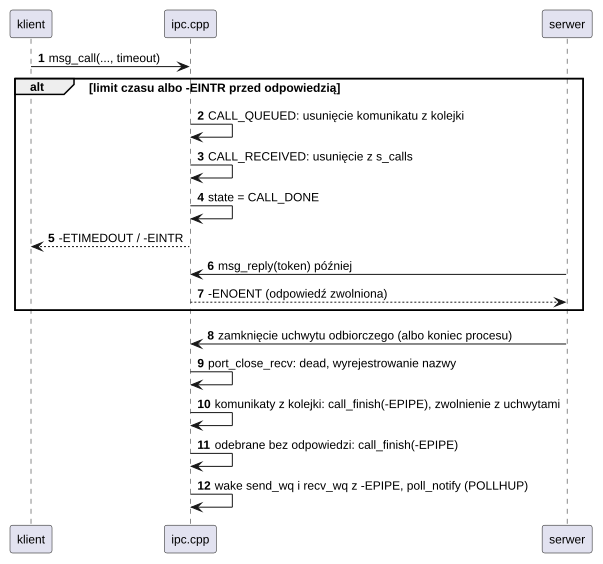

# K10 IPC: porty i komunikaty

## 1. Identyfikacja

| | |
|---|---|
| Identyfikator | K10 |
| Warstwa | L0 |
| Pliki | `kernel/os/ipc.cpp` |
| Interfejs | wywołania `SYS_PORT_CREATE`, `SYS_PORT_CONNECT`, `SYS_MSG_SEND`, `SYS_MSG_CALL`, `SYS_MSG_RECV`, `SYS_MSG_REPLY` (`crtos/syscall.h`); w programach: `crtos_port_*`, `crtos_msg_*` (L01); wewnętrznie `port_get/put`, `port_close_recv`, `port_poll` |

## 2. Odpowiedzialność

- Porty: kolejki komunikatów z jednym końcem odbiorczym i dowolną liczbą końców nadawczych;
  rejestr nazw (np. `gfx`, `devmgr`, `osk`).
- Komunikaty do 512 B, kopiowane do jądra przy wysłaniu i z jądra przy odbiorze (procesy nie
  dotykają nawzajem swojej pamięci).
- Wywołanie z odpowiedzią (`msg_call` / `msg_reply(token)`).
- Przekazywanie jednego uchwytu z komunikatem (plik, koniec nadawczy portu, pamięć
  współdzielona).
- Śmierć portu, gdy zamknięto koniec odbiorczy: oczekujący dostają `-EPIPE`.

## 3. Wymagania

| ID | Wymaganie | Weryfikacja |
|---|---|---|
| REQ-K10-01 | Dane komunikatu są kopiowane z pamięci nadawcy (po sprawdzeniu) do bufora jądra i z niego do pamięci odbiorcy (po sprawdzeniu); żaden proces nie ma dostępu do pamięci drugiego. | `apptest` (IPC między procesami, przekazanie uchwytu portu i pamięci współdzielonej) |
| REQ-K10-02 | Komunikaty jednego portu są odbierane w kolejności wysłania (FIFO). | przegląd kodu |
| REQ-K10-03 | Kolejka portu ma najwyżej 32 komunikaty; nadawca czeka na miejsce do upływu swojego limitu czasu (`-ETIMEDOUT`). | przegląd kodu |
| REQ-K10-04 | Koniec odbiorczy portu nigdy nie jest przekazywany dalej (ani w komunikacie, ani przez `dup`). | przegląd kodu |
| REQ-K10-05 | Po zamknięciu końca odbiorczego (także przez zakończenie procesu) wszystkie oczekujące i przyszłe operacje na porcie kończą się `-EPIPE`, a komunikaty w kolejce są zwalniane razem z przekazywanymi uchwytami. | `apptest` (`EPIPE` po zakończeniu procesu serwera) |
| REQ-K10-06 | Nadawca `msg_call`, który zrezygnował (limit czasu, zabicie), nie otrzyma odpowiedzi; spóźnione `msg_reply` zwraca `-ENOENT` i nie zapisuje pamięci nadawcy. | przegląd kodu |
| REQ-K10-07 | Nazwa portu jest unikalna (`-EEXIST`); `port_connect` czeka na pojawienie się nazwy do limitu czasu (`-ENOENT`). | `apptest` (`EEXIST`, `ENOENT` po zamknięciu portu) |

## 4. Interfejs udostępniany

| Wywołanie | Argumenty | Wynik | Błędy |
|---|---|---|---|
| `SYS_PORT_CREATE` | nazwa (albo NULL: port anonimowy), flagi | uchwyt odbiorczy (`HR_RECV`) | `-EEXIST`, `-ENOMEM`, `-EINVAL`, `-EMFILE` |
| `SYS_PORT_CONNECT` | nazwa, timeout | uchwyt nadawczy | `-ENOENT` (nie powstał w czasie), `-EINTR` |
| `SYS_MSG_SEND` | port, dane, długość ≤ 512, uchwyt do przekazania albo −1, timeout | 0 | `-EMSGSIZE`, `-EFAULT`, `-EBADF`, `-ETIMEDOUT`, `-EPIPE`, `-EINTR` |
| `SYS_MSG_CALL` | port, `crtos_call*` (zapytanie, uchwyt, bufor odpowiedzi), timeout | długość odpowiedzi; `rep_handle` = przekazany uchwyt albo −1 | jw. + wynik ujemny odpowiedzi |
| `SYS_MSG_RECV` | port odbiorczy, bufor, max, `crtos_msginfo*`, timeout | długość (przycięta do `max`); `info`: pid nadawcy, pełna długość, token (≠0 = czeka na odpowiedź), uchwyt | `-EPERM` (nie odbiorczy), `-EFAULT`, `-ETIMEDOUT`, `-EPIPE`, `-EINTR` |
| `SYS_MSG_REPLY` | token, dane, długość, uchwyt | 0 | `-ENOENT` (nadawca zrezygnował), `-EMSGSIZE`, `-EFAULT` |
| `port_poll(pt, rights, e)` | (K12) | odbiorczy: `POLLIN` gdy kolejka niepusta; nadawczy: `POLLOUT` gdy < 32; `POLLHUP` gdy martwy | — |

## 5. Interfejsy wymagane

K08 (uchwyty, `uaccess_ok`, `strncpy_from_user`), K05 (`sched_block`, kolejki oczekiwania),
K07 (`kmalloc`), K12 (`poll_notify`, `poll_add`).

## 6. Struktura statyczna

*Źródło: [K10/struktura-statyczna.puml](../diagramy/K10/struktura-statyczna.puml)*

## 7. Zachowanie dynamiczne

### 7.1 Wywołanie z odpowiedzią

*Źródło: [K10/wywolanie-z-odpowiedzia.puml](../diagramy/K10/wywolanie-z-odpowiedzia.puml)*

### 7.2 Rezygnacja klienta i śmierć portu

*Źródło: [K10/rezygnacja-klienta-i-smierc-portu.puml](../diagramy/K10/rezygnacja-klienta-i-smierc-portu.puml)*

## 8. Implementacja

- **Kopiowanie** poza sekcją krytyczną; w sekcji (`irq_lock`) tylko operacje na listach
  i stanach wywołań.
- **Struktura `call`** leży na stosie jądra klienta: klient nie wraca z `sys_msg_call`,
  dopóki `call` jest na liście `s_calls` albo w kolejce (rezygnacja usuwa ją pod
  blokadą), więc wskaźnik nigdy nie jest wiszący.
- **Tokeny** są 32-bitowym licznikiem (0 pomijane); serwer musi odpowiedzieć tokenem
  z `msginfo`.
- **Przekazanie uchwytu**: `msg_build` bierze odwołanie do obiektu (`handle_ref`) z prawami
  bez `HR_RECV`; odbiorca dostaje nowy numer w swojej tablicy (`take_handle`); gdy tablica
  jest pełna, obiekt jest zwalniany, a odbiorca dostaje −1.
- **Liczniki odwołań portu**: uchwyty i trwające operacje (`port_of` → `handle_ref`); port
  zwalniany przy ostatnim `port_put`.
- Czas wywołania z odpowiedzią między procesami: 7,9 µs (`crtos bench`, 4 bajty).

## 9. Obsługa błędów i mechanizmy bezpieczeństwa

| Sytuacja | Reakcja |
|---|---|
| komunikat > 512 B | `-EMSGSIZE` |
| zły wskaźnik danych, bufora, `info`, `crtos_call` | `-EFAULT` |
| odbiór z końca nadawczego | `-EPERM` |
| pełna kolejka | czekanie na `send_wq` do limitu czasu |
| martwy port | `-EPIPE` dla wszystkich oczekujących i kolejnych |
| brak miejsca na przekazany uchwyt | obiekt zwolniony, `handle` = −1 |
| spóźniona odpowiedź | `-ENOENT`, odpowiedź zwolniona |

## 10. Konfiguracja

`PORT_QUEUE_MAX` (32), `MSG_MAX` (512), `PORT_NAME_MAX` (24).

## 11. Weryfikacja

- `crtos run apptest`: „IPC in a process” (porty, kolejność, limity czasu) i „IPC, shm,
  poll between processes” (serwer w procesie potomnym, `msg_call` z przekazaniem pamięci
  współdzielonej, `poll` na porcie).
- `crtos bench`: `port`.
- Protokoły usług (U02, U03, U04) opierają się wyłącznie na tym komponencie.

## 12. Ograniczenia i znane problemy

- Rejestr nazw jest globalny i nie ma kontroli dostępu: dowolny proces może utworzyć port
  o wolnej nazwie (np. zająć `gfx` przed `gfxd`) albo połączyć się z każdym portem.
- Serwer nie ma limitu czasu na odpowiedź; klient chroni się własnym limitem.
