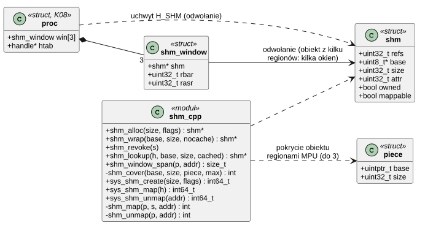
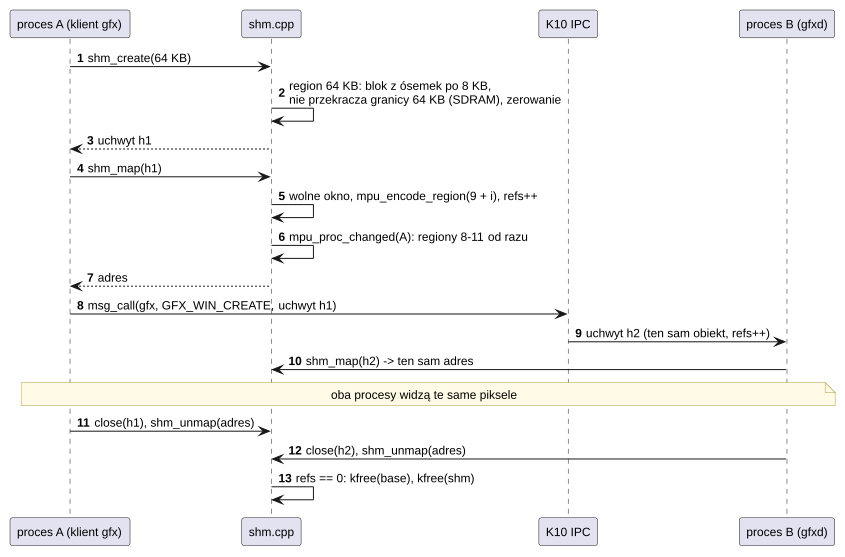
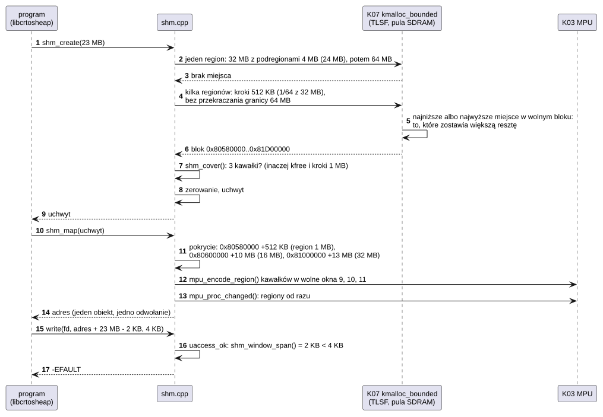

# K11 Pamięć współdzielona

## 1. Identyfikacja

| | |
|---|---|
| Identyfikator | K11 |
| Warstwa | L0 |
| Pliki | `kernel/os/shm.cpp` |
| Interfejs | wywołania `SYS_SHM_CREATE`, `SYS_SHM_MAP`, `SYS_SHM_UNMAP` (`crtos/syscall.h`), w programach `crtos_shm_*` (L01); wewnętrznie `shm_alloc`, `shm_wrap`, `shm_revoke`, `shm_lookup`, `shm_get/put`, `shm_window_span`, `shm_unmap_all` (`kernel.h`) |

## 2. Odpowiedzialność

- Obiekty pamięci współdzielonej: bloki w kształcie regionu MPU (ciąg ósemek regionu o
  rozmiarze potęgi dwójki, pozostałe ósemki wyłączone), zwykłe (z cache) albo bez cache
  (`SHM_NOCACHE`, dla DMA i ekranu).
- Mapowanie obiektu w jednym z trzech okien procesu (regiony MPU 9–11). Obiekt, którego nie
  da się opisać jednym regionem (ponad 16 MB albo brak miejsca na taki), to ciągły blok
  pokryty kilkoma regionami (do trzech), a jego mapowanie zajmuje okno na każdy z nich: program
  może mieć jeden obiekt z prawie całej wolnej pamięci (sterta kompilatora, L01
  `libcrtosheap`).
- Opakowanie pamięci sterownika (bufory ekranu) jako obiekt przekazywalny uchwytem.
- Wyszukiwanie obiektu po uchwycie dla podsystemów, które dostają powierzchnie od
  programów (akcelerator 2D, S03).

Bez MMU obiekt ma ten sam adres we wszystkich procesach: wskaźniki do jego wnętrza można
przekazywać między procesami (tak robi `libgfx` i `gfxd`).

## 3. Wymagania

| ID | Wymaganie | Weryfikacja |
|---|---|---|
| REQ-K11-01 | Nowy obiekt jest wyzerowany. | przegląd kodu |
| REQ-K11-02 | Proces ma dostęp do obiektu tylko po jego zmapowaniu, tylko do zapisu/odczytu (bez wykonywania) i tylko w granicach obiektu. | `apptest` (shm między procesami), K03 |
| REQ-K11-03 | Pamięć obiektu jest zwalniana dopiero po zamknięciu ostatniego uchwytu i odmapowaniu ze wszystkich procesów. | `apptest` (brak wycieku po zakończeniu procesów) |
| REQ-K11-04 | Proces może mieć zmapowane najwyżej 3 obiekty naraz (`-ENOSPC`); ponowne mapowanie tego samego obiektu zwraca ten sam adres. | przegląd kodu |
| REQ-K11-05 | Zmiana okien procesu jest widoczna w MPU, zanim wywołanie wróci do programu. | przegląd kodu (`mpu_proc_changed`) |
| REQ-K11-06 | Obiekt leży tak jak arena procesu: ciąg podregionów najmniejszego regionu MPU, który go pomieści, a gdy takiego miejsca nie ma – regionu dwa razy większego; każdy utworzony obiekt da się zmapować. | `heaptest` (okno 16 MB obok działającego pulpitu), `apptest`, przegląd kodu |
| REQ-K11-07 | Obiekt do 32 MB, którego nie da się opisać jednym regionem, jest ciągłym blokiem pokrytym najwyżej trzema ciągami podregionów różnych regionów; mapowanie zajmuje po jednym oknie na każdy i się nie udaje (`-ENOSPC`), gdy proces nie ma tylu wolnych okien. Cały obiekt i nic poza nim jest dostępny dla programu. | `heaptest` (obiekt 23,5 MB w trzech regionach: zapis i odczyt w całym obiekcie, `write` przez granice kawałków, `EFAULT` za końcem), przegląd kodu |
| REQ-K11-08 | Zasięg wskaźnika programu do okna (`uaccess_ok`, K08) liczy się z granic obiektu, a nie z kodowania regionu MPU. | `heaptest` (`write` do ostatniego bajtu obiektu przyjęty, o bajt dalej `EFAULT`) |
| REQ-K11-09 | Obiekt `SHM_NOCACHE`, którego nie mieści pula bez cache (2 MB, z buforami ekranu), powstaje w pamięci z cache: okna mapują go bez cache, a jego linie są czyszczone i unieważniane po wyzerowaniu. | `crtos desktop --shot` przy 800×480 (02.10.2026, ówczesny `vncd` z kopią ekranu `SHM_NOCACHE`): kopia 750 KB przy 475 KB wolnych w puli bez cache, obraz zgodny z `crtos shot`; dziś przegląd kodu (`vncd` trzyma kopię w pamięci z cache, U08) |

## 4. Interfejs udostępniany

| Funkcja | Kontekst | Opis | Wynik |
|---|---|---|---|
| `SYS_SHM_CREATE(size, flags)` | program | obiekt ≥ 256 B, ≤ 32 MB (rozmiar zaokrąglony w górę do podregionu) | uchwyt, `-ENOMEM` |
| `SYS_SHM_MAP(h)` | program | mapowanie w wolnym oknie (obiekt z kilku regionów: w kilku) | adres, `-EBADF`, `-ENOSPC`, `-EINVAL` (nie do zmapowania) |
| `SYS_SHM_UNMAP(addr)` | program | odmapowanie | 0, `-EINVAL` |
| `shm_alloc(size, flags)` | wątek | obiekt jądra z 1 odwołaniem | `shm*` / `NULL` |
| `shm_wrap(base, size, nocache)` | wątek | obiekt na pamięci sterownika (nie zwalnia jej) | `shm*` / `NULL` |
| `shm_revoke(s)` | wątek | pamięć sterownika znika: obiekt pusty | — |
| `shm_lookup(h, &base, &size, &cached)` | wątek | obiekt uchwytu wołającego z odwołaniem | `shm*` / `NULL` |
| `shm_window_span(p, addr)` | wątek | bajty od `addr` do końca obiektu zmapowanego w oknach procesu | liczba bajtów / 0 |
| `shm_unmap_all(p)` | wątek | przy zakończeniu procesu | — |
| `shm_get(s)`, `shm_put(s)` | wszędzie | liczniki odwołań | — |

## 5. Interfejsy wymagane

K03 (`mpu_encode_region`, `mpu_empty_region`, `mpu_proc_changed`), K07 (`kmalloc_bounded`
z `KM_LARGE` albo `KM_NOCACHE`), K08 (uchwyty).

## 6. Struktura statyczna

*Źródło: [K11/struktura-statyczna.puml](../diagramy/K11/struktura-statyczna.puml)*

## 7. Zachowanie dynamiczne

### 7.1 Obiekt dzielony przez dwa procesy

*Źródło: [K11/zachowanie-dynamiczne.puml](../diagramy/K11/zachowanie-dynamiczne.puml)*

### 7.2 Obiekt z kilku regionów MPU

*Źródło: [K11/obiekt-z-kilku-regionow.puml](../diagramy/K11/obiekt-z-kilku-regionow.puml)*

## 8. Implementacja

- Rozmiar i miejsce obiektu jak areny procesu (`arena_alloc`, K08): `full` = potęga dwójki
  ≥ rozmiaru, rozmiar zaokrąglony do ósemki `full`, blok wyrównany do tej ósemki i nie
  przekraczający wielokrotności `full` (`kmalloc_bounded`). Jeśli takiego miejsca nie ma,
  druga próba z regionem `2·full`: ósemki dwa razy grubsze, ale dwa razy więcej miejsc. Dzięki
  temu `mpu_encode_region` zawsze da się wykonać (ciąg włączonych podregionów), a duży obiekt
  mieści się w wolnej pamięci między innymi (wcześniej blok był wyrównany do `full`: obiekt
  12 MB tylko pod adresem podzielnym przez 16 MB).
- Obiekt z kilku regionów (`shm_alloc`, gdy jeden region zawiedzie, także ponad 16 MB): blok
  w krokach 1/64 potęgi dwójki `P` ≥ rozmiaru, nie przekraczający wielokrotności `2P`;
  jeśli trzech kawałków na pokrycie tego miejsca nie wystarczy, blok wraca i druga próba
  idzie w krokach 1/32 `P`, które trzy kawałki pokrywają zawsze (sprawdzone dla wszystkich
  położeń: pierwszy do najbliższej 1/4 `P`, środkowy z ósemek regionu `2P`, reszta).
- Pokrycie (`shm_cover`): od początku bloku każdy kawałek to ciąg podregionów regionu,
  który sięga najdalej (największy region, którego podregion dzieli bieżący adres), aż do
  końca bloku. Liczone przy mapowaniu (deterministycznie z adresu i rozmiaru), bez zapisu
  w obiekcie.
- `shm_map` zajmuje wolne okna po kolei (z pominięciem bloku szybkiego kodu), jedno
  odwołanie na całe mapowanie; `shm_unmap` zwalnia wszystkie okna obiektu.
- `shm_window_span` podaje zasięg do końca obiektu: `uaccess_ok` (K08) nie odczytuje go już
  z rejestru MPU. Wcześniejsze wyliczenie z kodowania regionu zakładało, że wyłączone
  podregiony są tylko na górze, co przestało być prawdą, gdy obiekty leżą jak areny (koniec
  wychodził za nisko, a różnica mogła się przewinąć).
- `shm_map` pod `irq_lock`: sprawdzenie, czy już zmapowany, wybór okna, kodowanie regionu,
  odwołanie; potem `mpu_proc_changed` przeładowuje regiony, jeśli proces właśnie działa.
- Okno trzyma własne odwołanie (niezależne od uchwytu): zamknięcie uchwytu nie odmapowuje.
- `shm_wrap` sprawdza, czy pamięć sterownika spełnia reguły MPU (`mappable`); jeśli nie,
  obiekt służy tylko do przekazania uchwytem (np. bufor ekranu dla akceleratora 2D).
- `SHM_NOCACHE` (`shm_alloc`): najpierw pula `ncache`; gdy jej brak miejsca, ten sam blok
  z puli z cache (`alloc_block` z `KM_LARGE`), atrybut okien nadal bez cache, a po zerowaniu
  `SCB_CleanInvalidateDCache_by_Addr`. Jądro nie czyta go więcej przez swój widok z cache,
  a akcelerator 2D czyści swoje cele w SDRAM z cache (D03).
- `shm_unshared`: czy obiekt trzyma już tylko jego twórca (licznik odwołań 1); framework
  ekranu (S03) zwalnia tak bufory, których nikt nie używa, przed zmianą trybu.
- `uaccess_ok` (K08) uwzględnia okna procesu, więc wskaźniki do zmapowanej pamięci
  współdzielonej można przekazywać w wywołaniach systemowych.

## 9. Obsługa błędów i mechanizmy bezpieczeństwa

| Sytuacja | Reakcja |
|---|---|
| rozmiar 0 albo > 32 MB, brak pamięci | `-ENOMEM` |
| wszystkie 3 okna zajęte, albo za mało wolnych na kawałki obiektu | `-ENOSPC` |
| obiekt niemapowalny albo odwołany (`shm_revoke`) | `-EINVAL` |
| odmapowanie adresu, który nie jest początkiem zmapowanego obiektu | `-EINVAL` |
| uchwyt innego typu | `-EBADF` |

## 10. Konfiguracja

`SHM_WINDOWS` (3, `kernel.h`), minimalny obiekt 256 B, maksymalny 32 MB (`SHM_MAX`).

## 11. Weryfikacja

- `crtos run apptest`: „IPC, shm, poll between processes” (serwer wypełnia wzorem 64 KB
  pamięci przekazanej w `msg_call`, klient sprawdza zawartość).
- Działanie `gfxd` i wszystkich programów z oknem (każde okno to obiekt pamięci
  współdzielonej).
- `heaptest` (L01, libcrtosheap; 30.09.2026, pulpit uruchomiony): obiekt 23,5 MB
  (`0x80580000`–`0x81D00000`, trzy regiony) w całości zapisywalny, `write` przez każdą granicę
  1 MB przyjęty, za końcem `EFAULT`; sterta programu rośnie w jedno okno 23,5 MB.
- Kompilator na płytce (T02): sterta `cc1` w jednym oknie 21,5 MB, NES zbudowany w całości.

## 12. Ograniczenia i znane problemy

- Obiekt `SHM_NOCACHE` z pamięci z cache jest spójny, dopóki jądro nie czyta go przez swój
  widok z cache (nie robi tego); spekulatywnych odczytów rdzenia nie wykluczono pomiarem.
- Tylko 3 okna na proces; `libgfx` dzieli pule pamięci między okna, żeby ten limit nie
  ograniczał liczby okien (L02). Obiekt z kilku regionów zajmuje ich kilka.
- Obiekt z kilku regionów nie daje się zmapować w procesie, który ma za mało wolnych okien
  (np. program z oknami `libgfx`); o liczbie kawałków decyduje miejsce, które dostał.
- Obiekt zajmuje blok zaokrąglony do ósemki potęgi dwójki (obiekt 65 KB zajmuje 80 KB),
  a w regionie dwa razy większym do ósemki tego regionu.
- `shm_revoke` nie odmapowuje okien, w których obiekt sterownika jest już zmapowany; dotyczy
  tylko obiektów z `shm_wrap`, które da się zmapować.
