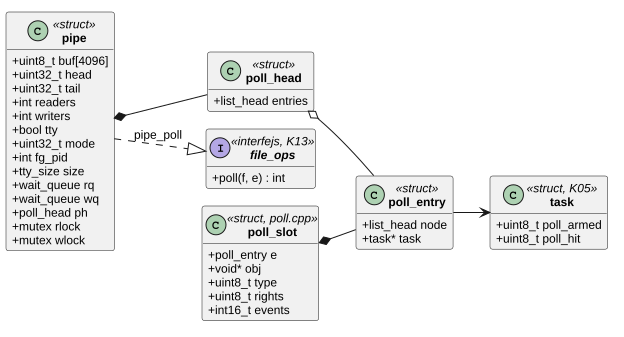
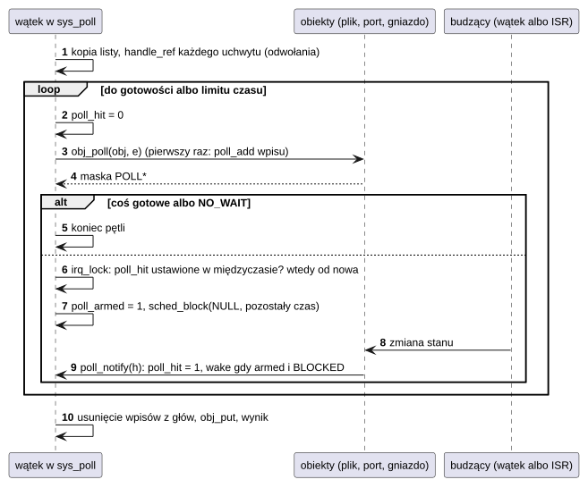
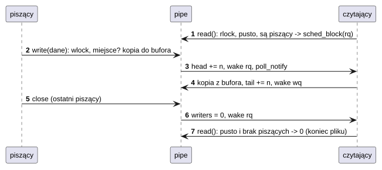

# K12 Potoki i poll

## 1. Identyfikacja

| | |
|---|---|
| Identyfikator | K12 |
| Warstwa | L0 |
| Pliki | `kernel/os/pipe.cpp`, `kernel/os/poll.cpp` |
| Interfejs | `SYS_PIPE`, `SYS_POLL` (`crtos/syscall.h`), `kernel/include/crtos/poll.h` (dla sterowników: `poll_head`, `poll_add`, `poll_notify`), `file_ops.poll` (`crtos/vfs.h`) |

## 2. Odpowiedzialność

- **Potoki**: jednokierunkowy strumień bajtów między uchwytami (bufor 4 KB), z blokowaniem,
  końcem pliku i `-EPIPE`. Potok terminalowy (`PIPE_TTY`) odpowiada też na polecenia
  terminala (`isatty`, tryb, proces pierwszoplanowy, rozmiar okna), dzięki czemu powłoka
  działa w terminalu graficznym (`term`) i na porcie USB (`getty`) jak na konsoli.
- **poll**: czekanie na gotowość wielu uchwytów naraz (pliki, urządzenia, potoki, gniazda,
  porty IPC) z limitem czasu.
- Mechanizm powiadomień dla obiektów, na które można czekać (`poll_head`/`poll_notify`).

## 3. Wymagania

| ID | Wymaganie | Weryfikacja |
|---|---|---|
| REQ-K12-01 | `read` z pustego potoku czeka na dane; zwraca 0 (koniec), gdy nie ma już piszących; `write` czeka na miejsce i zwraca `-EPIPE`, gdy nie ma czytających. | `crtos bench` (`pipe`), `term` i `getty` (ręcznie); brak testu automatycznego końca pliku i `-EPIPE` |
| REQ-K12-02 | Kilku piszących (powłoka i jej programy) nie przeplata danych w obrębie jednego `write` (piszący są szeregowani). | przegląd kodu |
| REQ-K12-03 | `poll` zwraca, gdy co najmniej jeden uchwyt jest gotowy albo minie limit czasu; powiadomienie między sprawdzeniem stanu a zaśnięciem nie ginie. | `apptest` (poll na porcie: limit czasu i odpowiedź) |
| REQ-K12-04 | `poll_notify` może być wołane z przerwania i budzi tylko wątki śpiące w `poll` (nie przerywa innych oczekiwań). | przegląd kodu |
| REQ-K12-05 | `poll` obsługuje najwyżej 32 uchwyty; uchwyt nieprawidłowy daje `POLLNVAL`, uchwyt ujemny jest pomijany. | przegląd kodu |

## 4. Interfejs udostępniany

| Funkcja | Kontekst | Opis | Wynik |
|---|---|---|---|
| `SYS_PIPE(fds[2], flags)` | program | `fds[0]` czyta, co zapisze `fds[1]`; `PIPE_TTY` | 0, `-EFAULT`, `-ENOMEM`, `-EMFILE` |
| `read`/`write`/`poll`/`ioctl` na końcach potoku | program | jw. (tabela `file_ops` potoku) | liczba bajtów, 0 (koniec), `-EPIPE`, `-EAGAIN` (`O_NONBLOCK`), `-EINTR` |
| polecenia terminala potoku `PIPE_TTY` | program | `TTY_IOC_GET/SET_MODE`, `SET/GET_FG`, `GET/SET_SIZE`, `FOCUS` (bez skutku) | 0, `-ENOTTY` (zwykły potok) |
| `SYS_POLL(fds, n, timeout)` | program | stan `revents` każdego uchwytu | liczba gotowych, 0 (limit czasu), `-EINTR`, `-EINVAL` (n > 32), `-EFAULT` |
| `poll_head_init(h)` | wszędzie | inicjalizacja głowy obiektu | — |
| `poll_add(h, e)` | wątek | dołączenie wpisu (z `file_ops.poll`, gdy `e` ≠ NULL) | — |
| `poll_notify(h)` | wątek, ISR | stan obiektu mógł się zmienić | — |

## 5. Interfejsy wymagane

K05 (`sched_block`, `sched_wake`, `poll_armed`/`poll_hit` w `struct task`), K06
(`mutex` dla czytających i piszących), K08 (uchwyty, `obj_poll`), K13 (`vfs_file_new`,
`vfs_poll`), K10 (`port_poll`).

## 6. Struktura statyczna

*Źródło: [K12/struktura-statyczna.puml](../diagramy/K12/struktura-statyczna.puml)*

## 7. Zachowanie dynamiczne

### 7.1 poll

*Źródło: [K12/poll.puml](../diagramy/K12/poll.puml)*

### 7.2 Potok

*Źródło: [K12/potok.puml](../diagramy/K12/potok.puml)*

## 8. Implementacja

- **Potok**: pierścień 4 KB z liczników `head`/`tail` (bajty zapisane/przeczytane); indeksy
  zmieniane pod `irq_lock`, kopiowanie danych poza nim. Muteksy `rlock`/`wlock`
  szeregują czytających i piszących (także z różnych procesów po `dup` i `spawn`).
  Potok znika, gdy zamknięto oba końce.
- **poll**: każdy obiekt zgłasza stan funkcją `poll`; przy pierwszym obrocie dołącza wpis
  wątku do swojej `poll_head`. `poll_notify` ustawia `poll_hit` każdemu wpisanemu wątkowi
  i budzi go, jeśli śpi w `poll` (`poll_armed`). Sprawdzenie `poll_hit` pod tą samą blokadą,
  pod którą wątek zasypia, wyklucza utratę powiadomienia.
- Obiekty z `poll`: potoki, konsola (K15), `/dev/uevent` (K17), `/dev/fb0` (koniec ramki),
  `/dev/event*`, gniazda (S05), porty IPC (K10), `/dev/ttyS*`, `/dev/ttyACM0`.

## 9. Obsługa błędów i mechanizmy bezpieczeństwa

| Sytuacja | Reakcja |
|---|---|
| zapis bez czytających | `-EPIPE` (albo liczba zapisanych bajtów, jeśli część poszła) |
| odczyt bez piszących | 0 (koniec pliku) |
| `O_NONBLOCK` bez danych / miejsca | `-EAGAIN` |
| zabicie w czasie czekania | `-EINTR` |
| za dużo uchwytów w `poll` | `-EINVAL` |
| zły uchwyt | `POLLNVAL` w `revents` |

## 10. Konfiguracja

`PIPE_SIZE` (4096), `POLL_MAX` (32).

## 11. Weryfikacja

- `crtos run apptest`: „IPC, shm, poll between processes” (`poll` na porcie: limit czasu
  bez odpowiedzi, potem `POLLIN`).
- `crtos bench`: `pipe` (dwa procesy, 1 bajt tam i z powrotem: 9,2 µs).
- `term` i `getty`: powłoka na potokach terminalowych (test ręczny, Ctrl-C).

## 12. Ograniczenia i znane problemy

- `poll` przegląda wszystkie uchwyty przy każdym obudzeniu (O(n), n ≤ 32).
- Potok terminalowy nie wykonuje edycji linii: robią to programy po drugiej stronie
  (`term`, `getty`).
