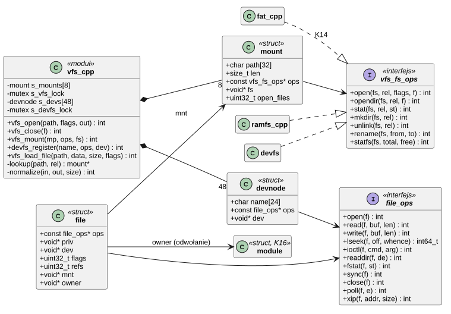
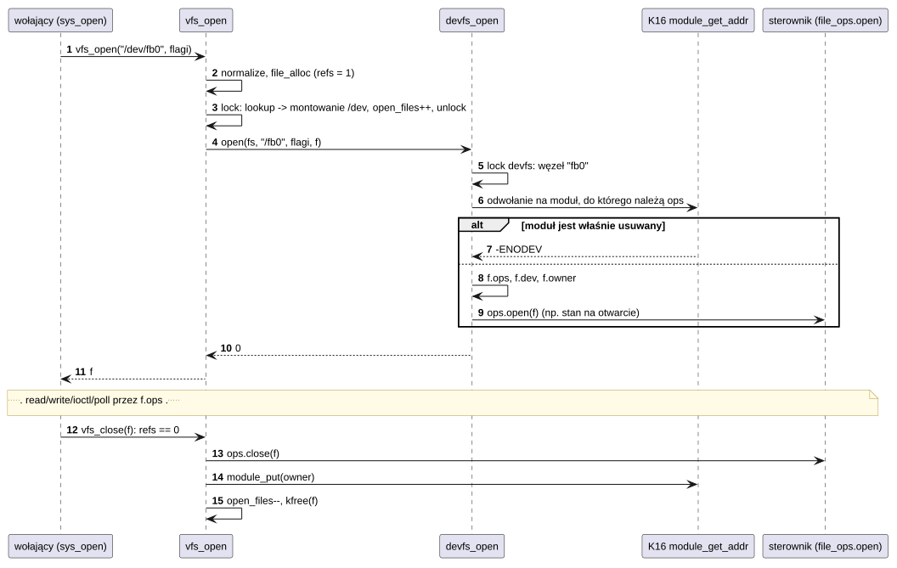
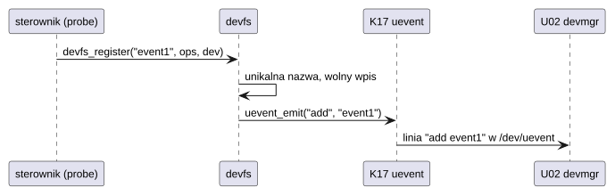

# K13 System plików (VFS)

## 1. Identyfikacja

| | |
|---|---|
| Identyfikator | K13 |
| Warstwa | L0 |
| Pliki | `kernel/os/vfs.cpp` (montowanie, ścieżki, pliki, devfs), `kernel/os/ramfs.cpp` (`/ram`) |
| Interfejs | `kernel/include/crtos/vfs.h` |

## 2. Odpowiedzialność

- Tablica montowań (do 8) w katalogach korzenia: `/sd` (K14), `/dev` (devfs), `/ram`.
- Normalizacja ścieżek (`//`, `.`, `..`, końcowy `/`).
- Obiekt otwartego pliku (`struct file`) z tablicą operacji i licznikiem odwołań; pliki bez
  systemu plików (potoki, gniazda).
- **devfs**: rejestr plików urządzeń (do 48), które sterowniki i frameworki publikują pod
  `/dev`, z powiadomieniem `uevent` (K17).
- Utrzymanie modułu sterownika w pamięci, dopóki jego plik jest otwarty.
- **ramfs**: pliki w SDRAM (scratch, testy, wgrywanie przez sondę).

## 3. Wymagania

| ID | Wymaganie | Weryfikacja |
|---|---|---|
| REQ-K13-01 | Ścieżka jest normalizowana przed wyszukaniem montowania; `..` nie wychodzi ponad korzeń. | `apptest` (pliki, katalogi) |
| REQ-K13-02 | Ścieżka trafia do montowania o najdłuższym pasującym prefiksie (na granicy `/`). | przegląd kodu |
| REQ-K13-03 | System plików nie może zostać odmontowany, gdy ma otwarte pliki (`-EBUSY`). | przegląd kodu |
| REQ-K13-04 | Plik jest zamykany (operacja `close`) dokładnie raz, po zwolnieniu ostatniego odwołania. | `apptest` (`dup`, uchwyty dziedziczone przez procesy) |
| REQ-K13-05 | Moduł, którego `file_ops` obsługują otwarty plik, nie może zostać usunięty (`rmmod` → `-EBUSY`), dopóki plik jest otwarty. | test ręczny (`rmmod` przy otwartym `/dev/*`) |
| REQ-K13-06 | Nazwa w devfs jest unikalna (`-EEXIST`); rejestracja i usunięcie wysyłają zdarzenie `add`/`remove`. | przegląd kodu, `devmgr` (U02) |
| REQ-K13-07 | Ścieżka od programu może mieć przed normalizacją do `VFS_RAW_PATH_MAX` (1024) znaków; po normalizacji najwyżej `VFS_PATH_MAX` (128), inaczej `-ENAMETOOLONG`. | apptest (ścieżka z 60 × `x/..`) |
| REQ-K13-08 | Plik w ramfs ma czas ostatniego zapisu (utworzenie, zapis, `O_TRUNC`) z zegara ściennego, w formacie FAT. | apptest (czas pliku w `/ram`) |
| REQ-K13-09 | `vfs_xip(f, &adres, &rozmiar)` podaje adres pliku w pamięci tylko wtedy, gdy system plików ma operację `xip` i plik leży w niej w całości w jednym ciągłym obszarze; w innym przypadku `-EOPNOTSUPP` (albo błąd systemu plików), a loader kopiuje program do areny. | `xiptest` z `/flash0` i z karty |

## 4. Interfejs udostępniany

| Funkcja | Kontekst | Opis | Wynik |
|---|---|---|---|
| `vfs_open(path, flags, &f)` | wątek | otwarcie (`VFS_O_*`; `VFS_O_DIRECTORY` = katalog) | 0, `-ENOENT`, `-ENOMEM`, błąd systemu plików |
| `vfs_opendir(path, &f)` | wątek | katalog (`/` pokazuje punkty montowania) | jw. |
| `vfs_file_new(ops, priv, flags)` | wątek | plik bez systemu plików (potok, gniazdo) | `file*` / `NULL` |
| `vfs_file_get(f)`, `vfs_close(f)` | wątek | odwołania; ostatnie `close` woła `ops->close` | 0 / wynik `close` |
| `vfs_read/write/lseek/ioctl/readdir/fstat/sync/poll(f, ...)` | wątek | przekazanie do `f->ops`; `read`/`write` sprawdzają tryb otwarcia (`-EBADF`) | brak operacji: `read`/`write` `-EINVAL`, `lseek` `-ESPIPE`, `ioctl` `-ENOTTY`, `readdir` `-ENOTDIR`, `poll` gotowy do odczytu i zapisu, `sync` 0 |
| `vfs_xip(f, &addr, &size)` | wątek | adres i długość pliku ciągłego w pamięci (programy XIP, K16) | 0, `-EOPNOTSUPP` (system plików bez `xip`), błąd `ops->xip` |
| `vfs_stat/mkdir/unlink/rename/statfs(path, ...)` | wątek | operacje na ścieżkach | 0, `-Exxx`; `rename` między montowaniami `-EXDEV` |
| `vfs_normalize(in, out, size)` | wszędzie | postać kanoniczna | 0, `-ENAMETOOLONG`, `-EINVAL` |
| `vfs_load_file(path, &data, &size, kmflags)` | wątek | cały plik (≤ 16 MB) do `kmalloc` | 0, `-EFBIG`, `-ENOMEM`, `-EIO` |
| `vfs_mount(mp, ops, fs)`, `vfs_umount(mp)` | wątek | montowanie w katalogu korzenia | 0, `-EBUSY`, `-ENOSPC`, `-ENOENT` |
| `devfs_register(name, ops, dev)` | wątek | `/dev/name`; `dev` trafia do `file->dev` przy każdym otwarciu | 0, `-EEXIST`, `-ENOSPC`, `-EINVAL` |
| `devfs_unregister(name)`, `devfs_foreach(fn, ctx)` | wątek | usunięcie, przegląd | 0, `-ENOENT` |
| `ramfs_mount(mp)` | wątek | ramfs pod `mp` (start: `/ram`) | 0 |

Interfejs systemu plików (`vfs_fs_ops`): `open`, `opendir`, `stat`, `mkdir`, `unlink`,
`rename`, `statfs`. Interfejs pliku (`file_ops`): `open`, `read`, `write`, `lseek`,
`ioctl`, `readdir`, `fstat`, `sync`, `close`, `poll` i opcjonalne `xip` (adres
i długość ciągłego pliku w pamięci; ma je tylko flashfs, D10). `vfs_xip(f, addr, size)`
woła tę operację dla loadera programów XIP (K16).

## 5. Interfejsy wymagane

K06 (mutex tablicy montowań i devfs), K07 (`kmalloc`), K16 (`module_get_addr`,
`module_put`), K17 (`uevent_emit`).

## 6. Struktura statyczna

*Źródło: [K13/struktura-statyczna.puml](../diagramy/K13/struktura-statyczna.puml)*

## 7. Zachowanie dynamiczne

### 7.1 Otwarcie pliku urządzenia

*Źródło: [K13/otwarcie-pliku-urzadzenia.puml](../diagramy/K13/otwarcie-pliku-urzadzenia.puml)*

### 7.2 Rejestracja urządzenia

*Źródło: [K13/rejestracja-urzadzenia.puml](../diagramy/K13/rejestracja-urzadzenia.puml)*

## 8. Implementacja

- Tablica montowań i devfs chronione muteksami (operacje mogą blokować). Otwieranie trwa
  poza blokadą: montowanie jest przypięte licznikiem `open_files`.
- `struct file` jest wspólny dla wszystkich rodzajów plików; `priv` należy do systemu
  plików lub sterownika, `dev` do urządzenia devfs.
- Licznik `refs` pliku zmieniany pod `irq_lock`; uchwyty programów (K08) i `dup`
  zwiększają go.
- `vfs_load_file` służy jądru do wczytania DTB, `modules.alias` i modułów.
- ramfs: węzły z pełną ścieżką na liście, dane pliku w jednym bloku SDRAM podwajanym przy
  wzroście, katalogi jawne (`mkdir`) albo niejawne (z prefiksów ścieżek).

## 9. Obsługa błędów i mechanizmy bezpieczeństwa

| Sytuacja | Reakcja |
|---|---|
| ścieżka dłuższa niż 128 B | `-ENAMETOOLONG` |
| brak montowania | `-ENOENT` |
| operacja, której system plików albo plik nie ma | `-ENOSYS`, `-EINVAL`, `-ESPIPE`, `-ENOTTY`, `-ENOTDIR`, `-EROFS` (zależnie od operacji) |
| odmontowanie z otwartymi plikami | `-EBUSY` |
| moduł sterownika w trakcie usuwania | otwarcie się nie uda (`-ENODEV`) |
| pełna tablica montowań / devfs | `-ENOSPC` |

## 10. Konfiguracja

`MAX_MOUNTS` (8), `DEVFS_MAX` (48), `VFS_PATH_MAX` (128), `VFS_NAME_MAX` (255); flagi
`VFS_O_*` równe newlib.

## 11. Weryfikacja

- `crtos run apptest`: „files on /ram”, „files on /sd”, „directories”, „errors and
  permissions”.
- `crtos kmon ls /dev`, `ls /`: devfs i punkty montowania.
- `rmmod` modułu z otwartym plikiem urządzenia: `-16` (`EBUSY`) – test ręczny opisany
  w [Sterowniki](../../sterowniki.md).

## 12. Ograniczenia i znane problemy

- Montowanie tylko w katalogach korzenia.
- Znormalizowana ścieżka do 128 znaków (bufory na stosach jądra); dłuższa jest dozwolona tylko
  przed normalizacją.
- `rename` między różnymi montowaniami nie jest obsługiwane (`-EXDEV`).
- Brak praw dostępu do plików (użytkownicy, tryby); dostęp do `/dev` reguluje tylko
  `CAP_DEV` (K09).
