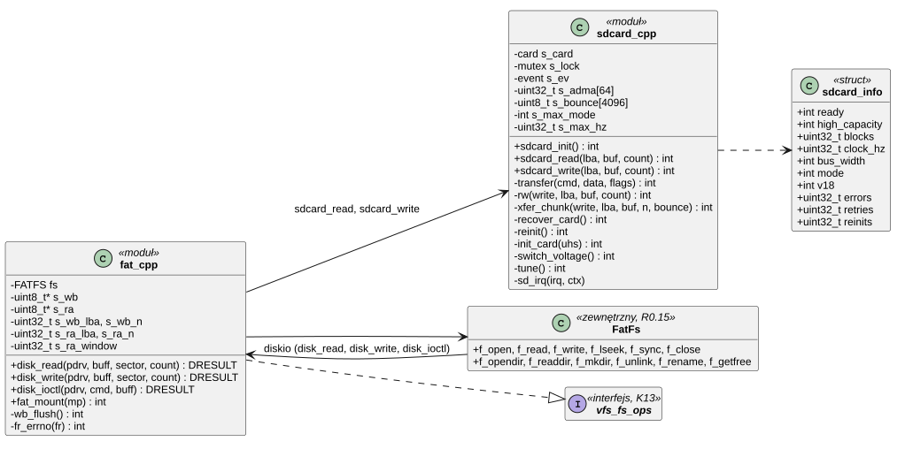
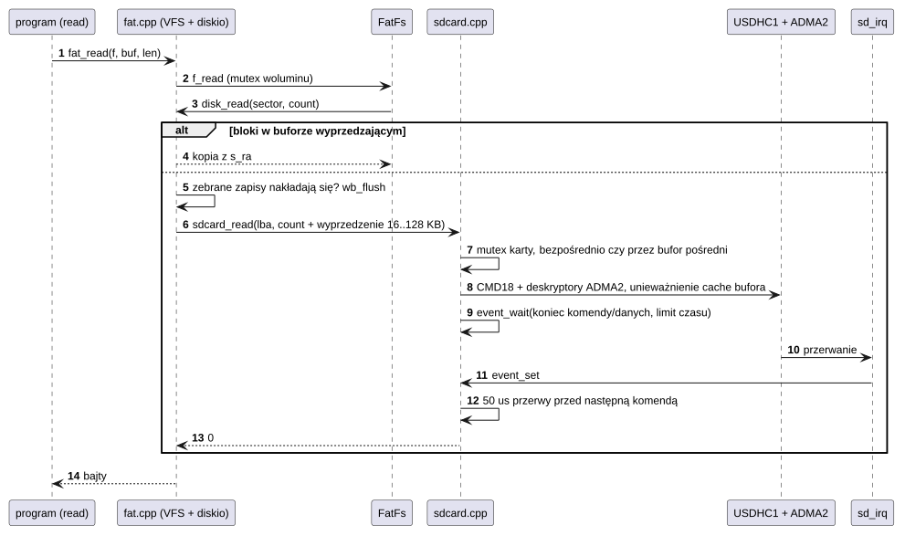
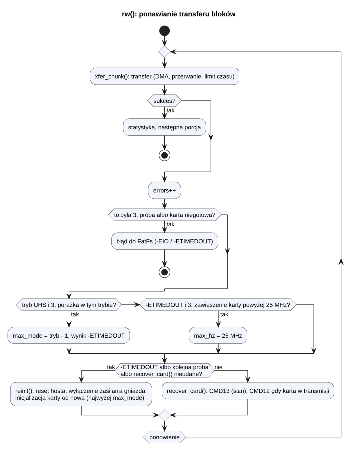
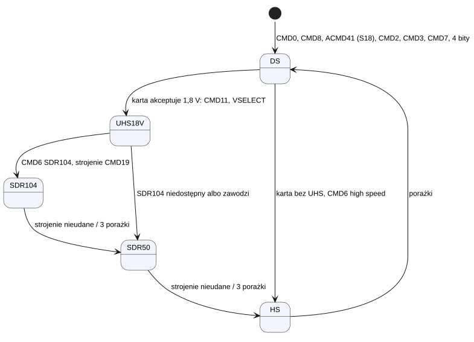

# K14 Karta SD i FAT

## 1. Identyfikacja

| | |
|---|---|
| Identyfikator | K14 |
| Warstwa | L0 (sterownik wbudowany w jądro – potrzebny, żeby wczytać wszystko inne) |
| Pliki | `kernel/os/boot/sdcard.cpp`, `sdcard.h` (USDHC1), `kernel/os/boot/fat.cpp` (FatFs + VFS), `kernel/platform/evkbimxrt1050/fatfs/` (FatFs R0.15), `kernel/ffconf.h` |
| Interfejs | `sdcard.h` (wewnętrzny), montowanie `/sd` przez `vfs_fs_ops` (K13) |

## 2. Odpowiedzialność

- Obsługa gniazda microSD (USDHC1): piny, zasilanie gniazda, wykrywanie karty, zegar,
  inicjalizacja karty, transfery bloków przez ADMA2 z przerwaniem.
- Tryby magistrali: DS 25 MHz, HS 50 MHz (3,3 V), UHS-I SDR50 99 MHz i SDR104 198 MHz
  (1,8 V, CMD11, strojenie punktu próbkowania CMD19).
- Odtwarzanie po błędach: ponowienie, stan karty (CMD13), zatrzymanie transmisji (CMD12),
  pełna ponowna inicjalizacja (wyłączenie zasilania gniazda), zejście do wolniejszego trybu.
- System plików FAT/exFAT (FatFs) z pamięcią podręczną bloków (zbieranie zapisów,
  czytanie z wyprzedzeniem), zamontowany w `/sd`.

## 3. Wymagania

| ID | Wymaganie | Weryfikacja |
|---|---|---|
| REQ-K14-01 | Transfer bloków nie zajmuje procesora w czasie przesyłania danych: wątek wołający śpi do przerwania końca transferu. | przegląd kodu, `kmon sdbench` |
| REQ-K14-02 | Nieudany transfer jest ponawiany do 3 razy z odtworzeniem stanu karty; karta, która nie odpowiada, jest inicjalizowana od nowa. | `kmon sdstress`, `kmon sd trace` |
| REQ-K14-03 | Tryb UHS, który zawodzi 3 razy, jest porzucany na rzecz wolniejszego; karta, która trzykrotnie „zawiesza się” powyżej 25 MHz, pracuje dalej z 25 MHz. | przegląd kodu, `kmon sd` |
| REQ-K14-04 | Po odczycie jest co najmniej 50 µs przerwy przed następną komendą (obejście zawieszania się części kart). | `kmon sdstress` |
| REQ-K14-05 | Bufory, których DMA nie może użyć bezpośrednio (niewyrównane, dzielące linie cache), przechodzą przez bufor pośredni; pamięć podręczna danych jest czyszczona/unieważniana wokół DMA. | przegląd kodu, `apptest` (pliki na /sd) |
| REQ-K14-06 | Dane zapisane przez `fsync`/`close` są na karcie (zebrane zapisy wysłane przed `CTRL_SYNC`). | `apptest` (pliki na /sd), `crtos deploy` (sumy CRC po zapisie) |
| REQ-K14-07 | Odczyt bloków zebranych do zapisu zwraca nowe dane (zapis przed odczytem nakładających się bloków). | przegląd kodu |
| REQ-K14-08 | Zapisywany plik dostaje czas z zegara ściennego (UTC, `get_fattime` → `fat_time_now`), a gdy data jest nieznana – 2021-01-01; `stat` i `fstat` otwartego pliku zwracają ten czas. | apptest (czas pliku na `/sd`) |

## 4. Interfejs udostępniany

| Funkcja | Kontekst | Opis | Wynik |
|---|---|---|---|
| `sdcard_init()` | wątek `boot` | piny, zasilanie, zegar, host, przerwanie; inicjalizacja karty, jeśli jest | 0, `-ENODEV` (brak karty), błąd |
| `sdcard_read(lba, buf, count)`, `sdcard_write(...)` | wątek | bloki po 512 B; do 1 MB na komendę | 0, `-EINVAL` (poza kartą), `-ENODEV`, `-EIO`, `-ETIMEDOUT` |
| `sdcard_get_info(&info)` | wątek | tryb, zegar, rozmiar, statystyka błędów | — |
| `sdcard_present()` | wątek | stan styku wykrywania karty | 0/1 |
| diagnostyka: `sdcard_reinit`, `sdcard_set_clock`, `sdcard_set_mode`, `sdcard_set_cmd23`, `sdcard_set_pads`, `sdcard_dump_trace`, `sdcard_dump_hist`, `sdcard_timing` | wątek (kmon) | | |
| `fat_mount(mp)` | wątek `boot` | FatFs `f_mount`, rejestracja w VFS | 0, błąd |
| `vfs_fs_ops` FAT | wątek | `open`, `opendir`, `stat`, `mkdir`, `unlink`, `rename`, `statfs` + `file_ops` (`read`, `write`, `lseek`, `fstat`, `sync`, `close`, `readdir`) | kody FatFs zamienione na `-errno` (`fr_errno`) |
| `fat_file_extent(f, &lba, &blocks)` | wątek | ciągły zakres bloków pliku (testy szybkości) | 0, błąd |
| `fat_swap_create(path, size, &lba)` | wątek | plik swap pamięci emulowanej (K20) w jednym kawałku: istniejący taki (exFAT) albo nowy przez `f_expand` (przydział bez zapisu, `FF_USE_EXPAND`) | 0, błąd |
| `fat_raw_io(lba, buf, count, write)` | wątek | bloki karty pod blokadą woluminu FatFs i przez pamięć podręczną bloków (spójnie z systemem plików) | 0, `-EIO`, `-ETIMEDOUT` |
| `fat_cache_invalidate()` | wątek | porzucenie czytanych z wyprzedzeniem bloków | — |

## 5. Interfejsy wymagane

K02 (`irq_request` USDHC1, priorytet 6), K06 (`event` końca komendy/danych, mutex karty,
mutex FatFs), K07 (`kmalloc` na bufory pamięci podręcznej), K13 (`vfs_mount`), NXP SDK
`fsl_usdhc` (warstwa transakcyjna), `fsl_gpio`, `fsl_iomuxc`, `fsl_clock`, `fsl_cache`.

## 6. Struktura statyczna

*Źródło: [K14/struktura-statyczna.puml](../diagramy/K14/struktura-statyczna.puml)*

## 7. Zachowanie dynamiczne

### 7.1 Odczyt pliku

*Źródło: [K14/odczyt-pliku.puml](../diagramy/K14/odczyt-pliku.puml)*

### 7.2 Odtwarzanie po błędzie transferu

*Źródło: [K14/odtwarzanie-po-bledzie-transferu.puml](../diagramy/K14/odtwarzanie-po-bledzie-transferu.puml)*

### 7.3 Wybór trybu przy inicjalizacji

*Źródło: [K14/wybor-trybu-przy-inicjalizacji.puml](../diagramy/K14/wybor-trybu-przy-inicjalizacji.puml)*

## 8. Implementacja

- **Transfer**: warstwa transakcyjna SDK (`USDHC_TransferNonBlocking`) z własnym
  oczekiwaniem na flagach zdarzeń; deskryptory ADMA2 (32) i bufor pośredni (8 bloków)
  w DTCM (brak cache, dostępne dla DMA).
- **Limity czasu**: komenda 500 ms; odczyt 500 ms + 1 ms/blok, zapis 1000 ms + 2 ms/blok;
  sprzętowy limit danych najdłuższy (> 2 s przy 198 MHz).
- **Strojenie SDR104/SDR50**: programowe – przegląd komórek opóźnienia 0–127 z CMD19,
  porównanie ze wzorcem, wybór środka najdłuższego okna, kontrola ośmioma blokami.
- **CMD23** (liczba bloków z góry) tylko dla zapisów (odczyty były z nią wolniejsze).
- **Pamięć podręczna bloków FatFs**: zbieranie do 256 KB kolejnych zapisów w jeden długi
  zapis (wysyłane przy `CTRL_SYNC`, odczycie nakładającym się i zapisie nieciągłym);
  czytanie z wyprzedzeniem od 16 KB podwajane do 128 KB przy odczytach po kolei
  (pomijane dla pojedynczych bloków). Karta ma klastry 4 KB, a długie komendy są wielokrotnie
  szybsze niż krótkie.
- FatFs: jeden wolumin, `FF_FS_REENTRANT` (mutex woluminu z K06), bufory długich nazw
  z `kmalloc`.
- Wydajność (karta użytkownika, exFAT): zapis plików 15–20 MB/s, odczyt 19–24 MB/s;
  `read` przez program 35 MB/s w `crtos bench`.

## 9. Obsługa błędów i mechanizmy bezpieczeństwa

| Sytuacja | Reakcja |
|---|---|
| brak karty przy starcie | `sd: no card`; jądro działa bez `/sd` (tylko kmon) |
| błąd CRC/limit czasu komendy lub danych | reset linii komend/danych hosta, ponowienie (do 3) |
| karta w stanie transmisji po błędzie | CMD12 |
| karta nie odpowiada | ponowna inicjalizacja z wyłączeniem zasilania gniazda |
| powtarzające się błędy w trybie UHS | zejście o jeden tryb |
| transfer wolniejszy niż 250 ms | wpis w logu (statystyka `slow`) |
| seria błędów | wypisanie śladu ostatnich transferów (`sd trace`) |

## 10. Konfiguracja

Stałe w `sdcard.cpp` (`CMD_GAP_US` 50, `RETRIES` 3, `MODE_FAILURES` 3, `MAX_LOCKUPS` 3,
`MAX_BLOCKS` 2048, `BOUNCE_BLOCKS` 8, zegar źródła 198 MHz) i `fat.cpp` (`WB_BLOCKS`
512, `RA_BLOCKS` 256, `RA_FIRST` 32); konfiguracja FatFs w `kernel/ffconf.h`. Piny,
zasilanie gniazda i wykrywanie karty są ustawiane w kodzie (sterownik działa przed drzewem
urządzeń).

## 11. Weryfikacja

- `crtos run apptest`: „files on /sd” (tworzenie, zapis, odczyt, `lseek`, usuwanie).
- `crtos kmon sdbench [MB] [KB]`, `sdstress [odczyty] [bloki] [przerwa-us]`, `sd`, `sd trace`,
  `sd hist`, `df`.
- `crtos bench`: `read`.
- `crtos deploy`: każdy plik po zapisie ma sprawdzaną sumę CRC-32 (U06).

## 12. Ograniczenia i znane problemy

- Czas pliku co 2 s (format FAT); FatFs nie zapisuje części setnych exFAT.
- Obsługiwany jest tylko USDHC1 (gniazdo płytki) i jeden wolumin.
- Zebrane zapisy (do 256 KB) giną przy odcięciu zasilania przed `fsync`/`close`.
- Karty części producentów wymagają przerwy 50 µs między odczytem a komendą (zmierzone na
  karcie MID 0x12 „SDU1”).
- Plik sterownika (ok. 1150 linii) jest największym plikiem jądra; strojenie i odtwarzanie
  stanu są złożone i testowane głównie stresowo.
- Wyjęcie karty w czasie pracy nie jest obsługiwane: odczyty kończą się błędem, a po
  ponownym włożeniu karta działa dopiero po `crtos kmon "sd reinit"` (albo restarcie) –
  jądro nie wykrywa włożenia samo (zaobserwowane 27.09.2026: `card initialisation failed
  (-116)`, po włożeniu i `sd reinit` pliki znów dostępne bez restartu).
