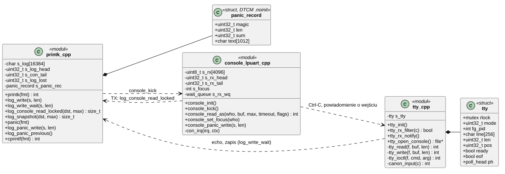
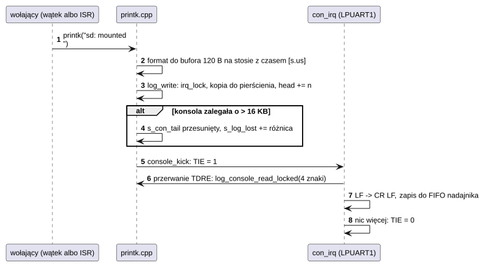
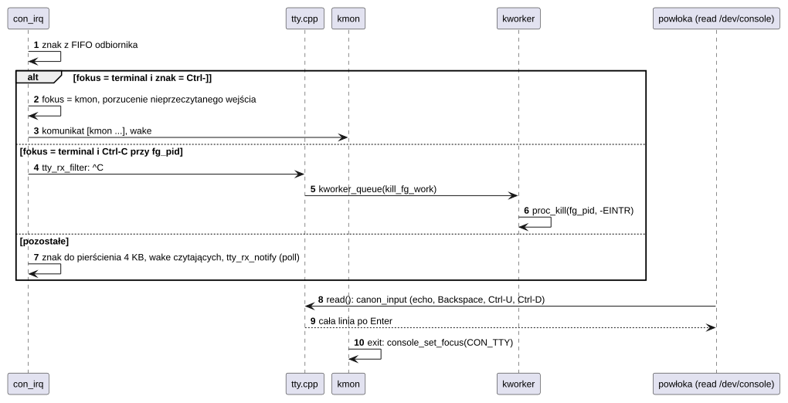
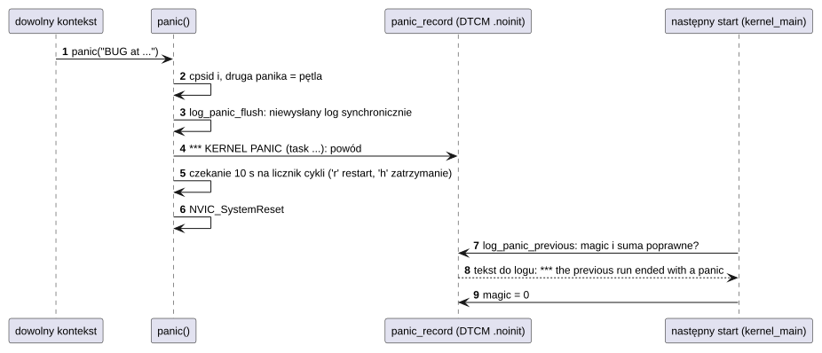

# K15 Konsola, log jądra i terminal

## 1. Identyfikacja

| | |
|---|---|
| Identyfikator | K15 |
| Warstwa | L0 (sterownik konsoli wbudowany w jądro) |
| Pliki | `kernel/rtos/console_lpuart.cpp` (LPUART1), `kernel/rtos/printk.cpp` (log, `panic`), `kernel/os/tty.cpp` (`/dev/console`, `/dev/null`, `/dev/zero`), `kernel/lib/kformat.cpp` (formatowanie) |
| Interfejs | `kernel/include/crtos/printk.h`, `kernel/include/crtos/tty.h`; wewnętrznie `console_*`, `log_*` w `kernel.h` |

## 2. Odpowiedzialność

- **Log jądra**: pierścień 16 KB w OCRAM; `printk` z czasem od startu, nigdy nie blokuje
  i działa w przerwaniach.
- **Konsola** (LPUART1, 1 Mb/s, 8N1, gniazdo J28 przez DAPLink): nadawanie logu z przerwania
  pustej kolejki FIFO, odbiór do pierścienia 4 KB, podział wejścia między monitor jądra
  (kmon) i terminal programów (fokus, Ctrl-]).
- **Terminal `/dev/console`**: tryb kanoniczny (edycja linii, echo, Ctrl-C, Ctrl-D) albo
  surowy; proces pierwszoplanowy kończony klawiszem Ctrl-C.
- **`panic`**: synchroniczny raport na konsolę, zapis rekordu w pamięci, której start nie
  czyści, restart po 10 s; przy następnym starcie raport trafia do logu.

## 3. Wymagania

| ID | Wymaganie | Weryfikacja |
|---|---|---|
| REQ-K15-01 | `printk` nie blokuje i jest bezpieczny w przerwaniach; gdy konsola nie nadąża, najstarszy niewysłany tekst jest nadpisywany i liczony jako utracony. | przegląd kodu, `kmon uptime` (`log lost`) |
| REQ-K15-02 | Wyjście programów na konsolę (`/dev/console`) czeka na miejsce w logu zamiast nadpisywać niewysłany tekst (najwyżej ok. 100 ms na porcję). | przegląd kodu |
| REQ-K15-03 | Ctrl-] odebrane, gdy fokus ma terminal, przekazuje wejście monitorowi jądra w obsłudze przerwania – także gdy żaden program nie czyta. | test ręczny (`crtos serial`, Ctrl-]) |
| REQ-K15-04 | Ctrl-C w trybie kanonicznym kończy proces pierwszoplanowy (`TTY_IOC_SET_FG`) z kodem `-EINTR`, także gdy proces nie czyta z terminala. | test ręczny (`crtos serial`, `ping`, Ctrl-C) |
| REQ-K15-05 | Raport `panic` jest wysyłany synchronicznie (przerwania wyłączone) i zachowany z sumą kontrolną w DTCM `.noinit`; następny start wypisuje go, jeśli suma się zgadza. | `kmon panic` (test ręczny), `crtos crash` |
| REQ-K15-06 | Po `panic` system restartuje się po 10 s (klawisz `r` od razu, `h` zatrzymuje). | `kmon panic` |

## 4. Interfejs udostępniany

| Funkcja | Kontekst | Opis |
|---|---|---|
| `printk(fmt, ...)`, `vprintk` | wszędzie | tekst z czasem `[s.µs]` do logu; `pr_err` (`E:`), `pr_warn` (`W:`), `pr_info`, `dev_info/warn/err` |
| `ksnprintf`, `kvsnprintf` | wszędzie | formatowanie do bufora (podzbiór `printf`) |
| `log_write(s, len)` | wszędzie | surowy tekst do logu |
| `cprintf(fmt, ...)` | wątek | tekst bez czasu na konsolę bieżącego wątku (kmon przez UART albo SWD) |
| `panic(fmt, ...)` | wszędzie | zatrzymanie systemu (nie wraca) |
| `BUG_ON(cond)` | wszędzie | `panic` z plikiem i linią, gdy warunek prawdziwy |
| `console_read_as(who, buf, max, timeout, flags)` | wątek | odczyt wejścia dla `CON_KMON` albo `CON_TTY` (czeka na fokus) |
| `console_set_focus(who)`, `console_focus()` | wątek, ISR | fokus wejścia |
| `log_snapshot(dst, max)` | wątek | koniec logu (`dmesg`) |
| `log_panic_previous()` | start | raport poprzedniego `panic` |
| `/dev/console` (`file_ops`) | program | `read` (linia w trybie kanonicznym), `write`, `poll`, `ioctl` (`TTY_IOC_GET/SET_MODE`, `SET/GET_FG`, `FOCUS` – `CAP_SYS`, `GET_SIZE`) |
| `/dev/null`, `/dev/zero` | program | jak w Uniksie |

## 5. Interfejsy wymagane

K02 (`irq_request` LPUART1, priorytet 8), K05 (`kworker_queue`, `sched_block`), K06, K08
(`proc_kill` dla Ctrl-C), K13 (`devfs_register`), NXP SDK `fsl_lpuart`, piny i zegar UART
z kodu startowego płytki.

## 6. Struktura statyczna

*Źródło: [K15/struktura-statyczna.puml](../diagramy/K15/struktura-statyczna.puml)*

## 7. Zachowanie dynamiczne

### 7.1 printk i nadawanie

*Źródło: [K15/printk-i-nadawanie.puml](../diagramy/K15/printk-i-nadawanie.puml)*

### 7.2 Wejście, fokus i Ctrl-C

*Źródło: [K15/wejscie-fokus-i-ctrl-c.puml](../diagramy/K15/wejscie-fokus-i-ctrl-c.puml)*

### 7.3 panic

*Źródło: [K15/panic.puml](../diagramy/K15/panic.puml)*

## 8. Implementacja

- Pierścień logu: `head` (liczba wszystkich zapisanych bajtów) i `con_tail` (wysłane);
  długość potęgą dwójki (maska). Log leży w OCRAM (`.bss.$SRAM_OC`), 32-bajtowo wyrównany.
- Nadawanie z przerwania FIFO (4 znaki), bez kopii na stosie wątku; `console_kick` włącza
  przerwanie TX po każdym zapisie.
- Wejście: pierścień 4 KB, licznik przepełnień (`s_rx_overrun` sprzętowe, `s_rx_dropped`
  programowe).
- Terminal: jeden czytający naraz (`rlock`); edycja linii w jądrze (256 znaków); sekwencje
  ESC (strzałki) pomijane.
- Wątek z własną konsolą (`task.con_write`, `con_getc`): druga instancja kmon przez sondę
  SWD (K19) pisze do własnego pierścienia zamiast UART.
- `panic` odmierza czas licznikiem cykli (przerwania są wyłączone), a konsolę obsługuje
  odpytywaniem (`console_panic_write/getc`).

## 9. Obsługa błędów i mechanizmy bezpieczeństwa

| Sytuacja | Reakcja |
|---|---|
| konsola nie nadąża za logiem | nadpisanie najstarszego niewysłanego tekstu, licznik utraconych bajtów |
| przepełnienie odbiornika | liczniki `overrun`/`dropped` (`kmon uptime`) |
| program zablokował terminal | Ctrl-] zawsze przełącza na kmon (w przerwaniu) |
| `panic` w `panic` | zatrzymanie w pętli |
| rekord `panic` uszkodzony | pominięty (suma kontrolna) |

## 10. Konfiguracja

`CONFIG_LOG_BUF_SIZE` (16384), `CONFIG_CONSOLE_RX_BUF` (4096), prędkość `CON_BAUD`
(1 000 000), priorytet przerwania 8, `LINE_MAX` terminala (256), klawisz kmon
`TTY_KEY_KMON` (0x1D, Ctrl-]).

## 11. Weryfikacja

- `crtos log`, `crtos serial`: log startu, powłoka, Ctrl-], Ctrl-C (ręcznie).
- `crtos kmon dmesg`, `uptime` (statystyka konsoli).
- `crtos kmon panic`: pełna ścieżka `panic` z restartem i raportem przy następnym starcie
  (ręcznie).

## 12. Ograniczenia i znane problemy

- Konsola jest wspólna dla logu jądra i programów: przy dużym ruchu log może zostać
  częściowo utracony (licznik).
- Jedna konsola sprzętowa; porty `/dev/ttyS*` obsługuje osobny sterownik (D02).
