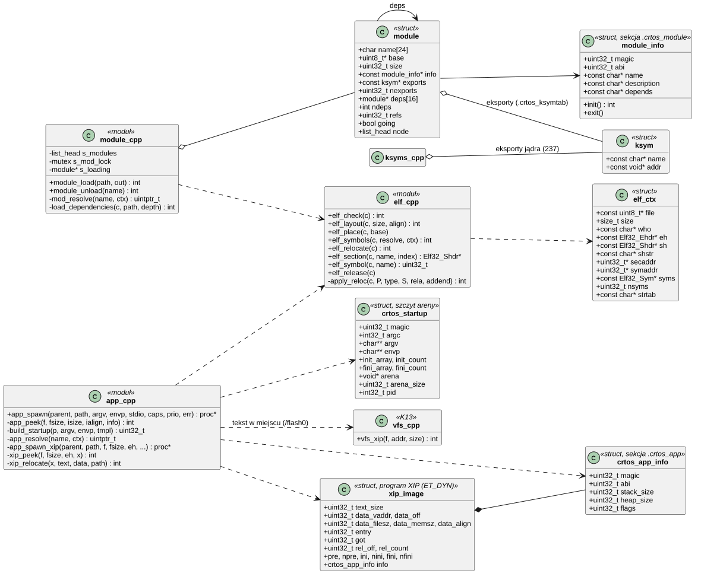
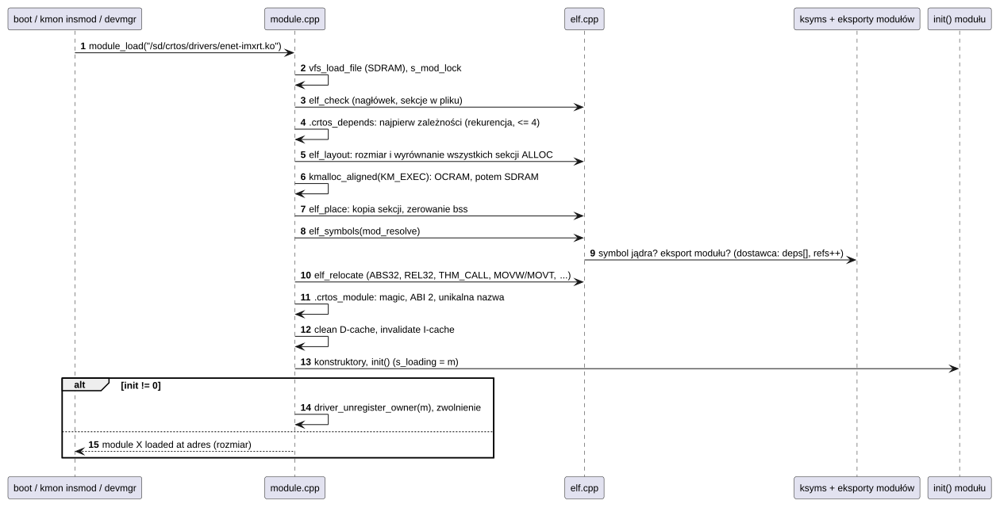
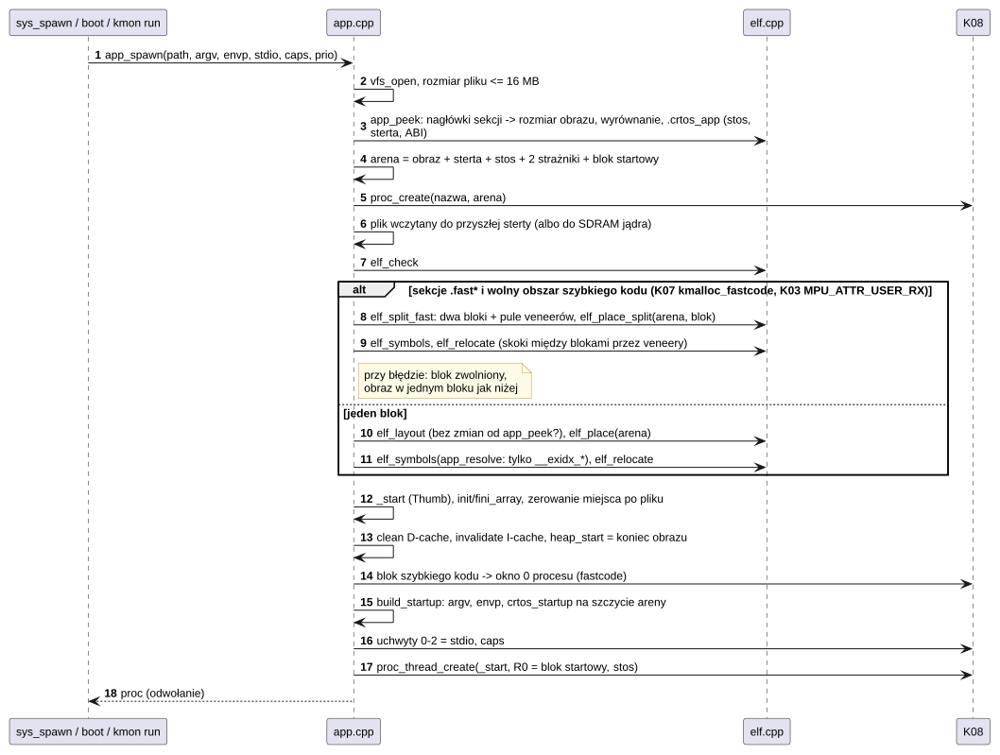
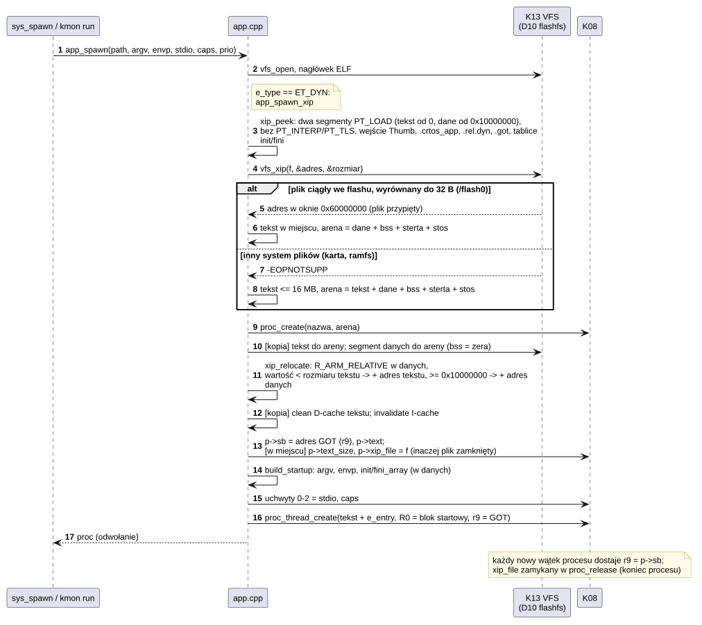
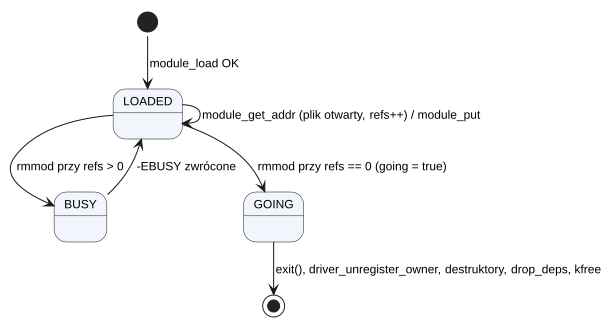

# K16 Loader: moduły i programy

## 1. Identyfikacja

| | |
|---|---|
| Identyfikator | K16 |
| Warstwa | L0 |
| Pliki | `kernel/os/elf.cpp`, `elf.h` (wspólne ładowanie relokowalnego ELF, typy ELF32 z nagłówkami programu i relokacjami dynamicznymi), `kernel/os/module.cpp` (moduły `.ko`), `kernel/os/app.cpp` (programy `.app`: relokowalne i wykonywane w miejscu), `kernel/os/ksyms.cpp` (tablica eksportów jądra) |
| Interfejs | `kernel/include/crtos/module.h` (moduły), `app_spawn()` w `kernel.h` (programy), formaty w `crtos/module.h` i `crtos/syscall.h` (`crtos_app_info`, `crtos_startup`) |

## 2. Odpowiedzialność

- Sprawdzenie, rozmieszczenie w jednym bloku i relokacja relokowalnych plików ELF32 ARM
  (`ld -r`).
- **Moduły jądra**: rozwiązywanie symboli (eksporty jądra i innych modułów), zależności
  (`MODULE_DEPENDS`), konstruktory, `init`/`exit`, eksporty modułu (`EXPORT_SYMBOL`),
  liczniki odwołań (moduły zależne, otwarte pliki, przypięcie), usuwanie.
- **Programy**: rozmiar areny z nagłówków, wczytanie pliku do przyszłej sterty, relokacja
  obrazu na dnie areny, blok startowy (argumenty, środowisko, konstruktory) na szczycie,
  pierwszy wątek w `_start`.
- **Szybki kod programu**: sekcje `.fast*` (najgorętsze funkcje wybrane przy budowaniu,
  `crtos_app FAST`) w drugim bloku w pamięci wewnętrznej układu (obszar szybkiego kodu
  w ITCM, K07), widocznym dla procesu przez jedno z jego okien MPU (K03), z veneerami dla
  skoków między blokami.
- **Programy wykonywane w miejscu (XIP)**: plik ELF `ET_DYN` (statyczny PIE z
  `arm-crtos-gcc -mxip`, T02) z segmentem tekstu od adresu 0 i segmentem danych od
  `0x10000000`. Tekst zostaje w pliku, jeśli system plików poda jego adres (`vfs_xip`,
  K13: `/flash0`, D10), a w przeciwnym razie trafia do areny. Dane są kopiowane do areny,
  relokacje `R_ARM_RELATIVE` przesuwają ich wskaźniki, a adres GOT trafia do r9 każdego wątku
  procesu (K08).
- **Tablica eksportów jądra**: lista funkcji jądra i SDK dostępnych dla modułów (API modułów).

## 3. Wymagania

| ID | Wymaganie | Weryfikacja |
|---|---|---|
| REQ-K16-01 | Plik jest odrzucany (`-ENOEXEC`), jeśli nie jest relokowalnym ELF32 ARM little-endian, ma nieobsługiwaną relokację, sekcję poza plikiem albo zły deskryptor (`MODULE_MAGIC`/`ABI` 2, `CRTOS_APP_MAGIC`/`ABI` 1). | przegląd kodu, `tools/modcheck.py` |
| REQ-K16-02 | Moduł nie ładuje się, gdy którykolwiek jego symbol jest nieznany; program nie może mieć nierozwiązanych symboli poza `__exidx_start/end`. | `tools/modcheck.py` (przy budowaniu), przegląd kodu |
| REQ-K16-03 | Moduł nie może zostać usunięty (`-EBUSY`), gdy używa go inny moduł, jest przypięty (`module_pin`) albo ma otwarte pliki. | test ręczny (`rmmod` przy otwartym `/dev/*`, `rmmod net-lwip`) |
| REQ-K16-04 | Nieudany `init` modułu wycofuje jego rejestracje sterowników i zwalnia pamięć. | przegląd kodu |
| REQ-K16-05 | Obraz programu jest w całości w arenie procesu, a pamięć poza obrazem i blokiem startowym jest wyzerowana (także miejsce po wczytanym pliku). | przegląd kodu, `apptest` |
| REQ-K16-06 | Po relokacji kod jest widoczny dla procesora (czyszczenie D-cache, unieważnienie I-cache) przed pierwszym wykonaniem. | przegląd kodu |
| REQ-K16-07 | Program z niezgodnym ABI albo za dużymi wymaganiami (stos > 1 MB, sterta > 24 MB, argumenty > 4 KB, plik > 16 MB) nie jest uruchamiany. | przegląd kodu |
| REQ-K16-08 | Sekcje `.fast*` programu trafiają do bloku szybkiego kodu tylko wtedy, gdy blok da się przydzielić i opisać jednym regionem MPU, a obraz bez nich mieści się w miejscu obrazu jednoblokowego; w każdym innym przypadku (także przy nieudanej relokacji) program ładuje się w jednym bloku, jak bez `FAST`. | przegląd kodu, `crtos run` programu z `FAST` przy zajętym obszarze |
| REQ-K16-09 | Każdy skok (`THM_CALL`, `THM_JUMP24`, `THM_JUMP19`) między blokami poza zasięgiem instrukcji idzie przez veneer z puli bloku, w którym się zaczyna, jeden na parę symbol i przesunięcie; wynik programu jest taki sam jak w jednym bloku. | `snes -b` (sumy kontrolne dźwięku i obrazu z `FAST` i bez), przegląd kodu |
| REQ-K16-10 | Blok szybkiego kodu jest dla procesu tylko do odczytu i wykonania, nie jest dostępny dla wskaźników w wywołaniach systemowych i wraca do obszaru przy zwolnieniu procesu. | przegląd kodu, `crtos kmon mem` (`fastcode`) po zakończeniu programu |
| REQ-K16-11 | Program `ET_DYN` jest uruchamiany tylko wtedy, gdy ma dokładnie segment tekstu (od przesunięcia 0 i adresu 0, bez zapisu) i segment danych (od `0x10000000`, bez wykonywania), nie ma `PT_INTERP` ani `PT_TLS`, ma punkt wejścia Thumb w tekście, sekcję `.got` w danych, poprawny nagłówek `.crtos_app` i tylko relokacje `R_ARM_RELATIVE` (albo `R_ARM_NONE`) w `.rel.dyn`, każdą w segmencie danych i wskazującą na tekst albo dane; inaczej `-ENOEXEC` z komunikatem. | przegląd kodu, `crtos-app check` (T02) |
| REQ-K16-12 | Tekst programu XIP wykonuje się w miejscu tylko wtedy, gdy system plików poda adres ciągłego pliku wyrównany do 32 B i nie krótszego niż tekst; plik pozostaje wtedy otwarty (przypięty) do końca procesu. W każdym innym przypadku tekst jest kopiowany do areny (najwyżej 16 MB), a program działa tak samo. | `xiptest` z `/flash0` i z karty (adres kodu w wyniku), `apptest_xip` |
| REQ-K16-13 | Każdy wątek procesu XIP zaczyna z r9 równym adresowi GOT procesu; wątki programów relokowalnych zaczynają z r9 = 0. | `xiptest` (wątek czyta zmienne globalne), `apptest_xip` (grupa wątków i pthread) |
| REQ-K16-14 | Dane, bss, sterta i stos programu XIP są w arenie procesu jak u programu relokowalnego (te same limity stosu, sterty i argumentów, REQ-K16-07); tekst we flashu jest dla procesu tylko do odczytu i wykonania. | przegląd kodu, `xiptest crash` (raport z adresem tekstu i GOT) |

## 4. Interfejs udostępniany

| Funkcja | Kontekst | Opis | Wynik |
|---|---|---|---|
| `module_load(path, &m)` | wątek | ładuje moduł (i jego zależności z tego samego katalogu, głębokość ≤ 4) | 0, `-EEXIST`, `-ENOEXEC`, `-ENOENT`, `-ENOMEM`, `-ELOOP`, wynik `init` |
| `module_unload(name)` | wątek | `exit`, wyrejestrowanie sterowników modułu, destruktory, zwolnienie | 0, `-ENOENT`, `-EBUSY` |
| `module_find(name)`, `module_name(m)` | wątek | wyszukanie | — |
| `module_pin()` | `init` modułu | moduł nie da się usunąć (np. uruchomił wątki, stos sieciowy) | — |
| `ksym_lookup(name)` | wątek | adres eksportu (jądro albo moduł) | adres / `NULL` |
| `module_get_addr(addr, &m)`, `module_put(m)` | wszędzie | odwołanie na moduł zawierający adres (np. `file_ops`) | 0, `-ENODEV` (moduł usuwany) |
| `app_spawn(parent, path, argv, envp, stdio, caps, prio, &err)` | wątek | nowy proces z programem, uchwyty 0–2 z `stdio`; sekcje `.fast*` w bloku szybkiego kodu, jeśli się da; plik `ET_DYN` idzie drogą XIP (`app_spawn_xip`) | `proc*` z odwołaniem / `NULL` |
| `elf_split_fast(c, ...)`, `elf_place_split()`, `elf_unsplit()` | wątek | dzielony obraz: układ dwóch bloków z pulami veneerów, rozmieszczenie, powrót do jednego bloku | 0, `-ENOENT` (brak sekcji `.fast*`), `-ENOMEM`, `-ENOEXEC` |
| makra `MODULE()`, `MODULE_DEPENDS()`, `EXPORT_SYMBOL()` | kod modułu | deskryptor, zależności, eksport | — |

## 5. Interfejsy wymagane

K13 (`vfs_load_file`, `vfs_open`, `vfs_read`, `vfs_xip`), K07 (`kmalloc` z `KM_EXEC`,
`kmalloc_fastcode`, `KM_ONCHIP`), K03 (`mpu_encode_region` z `MPU_ATTR_USER_RX`), K08
(`proc_create`, `proc_thread_create`, uchwyty, okna procesu, pola `sb`, `text`, `text_size`,
`xip_file`), K17 (`driver_unregister_owner`),
K06 (mutex listy modułów), CMSIS (`SCB_CleanDCache_by_Addr`, `SCB_InvalidateICache`).

## 6. Struktura statyczna

*Źródło: [K16/struktura-statyczna.puml](../diagramy/K16/struktura-statyczna.puml)*

## 7. Zachowanie dynamiczne

### 7.1 Ładowanie modułu

*Źródło: [K16/ladowanie-modulu.puml](../diagramy/K16/ladowanie-modulu.puml)*

### 7.2 Uruchomienie programu

*Źródło: [K16/uruchomienie-programu.puml](../diagramy/K16/uruchomienie-programu.puml)*

### 7.3 Uruchomienie programu XIP

*Źródło: [K16/uruchomienie-xip.puml](../diagramy/K16/uruchomienie-xip.puml)*

### 7.4 Usuwanie modułu

*Źródło: [K16/usuwanie-modulu.puml](../diagramy/K16/usuwanie-modulu.puml)*

## 8. Implementacja

- **Rozmieszczenie**: wszystkie sekcje `SHF_ALLOC` w jednym bloku (kod, dane, bss), więc
  wywołania wewnątrz modułu mieszczą się w zasięgu `BL`; wywołania do jądra używają adresów
  bezwzględnych (moduły kompilowane z `-mlong-calls`).
- **Relokacje**: `R_ARM_ABS32`/`TARGET1`, `REL32`, `PREL31`, `THM_CALL`, `THM_JUMP24`,
  `THM_JUMP19`, `THM_JUMP11`, `THM_MOVW_ABS_NC`, `THM_MOVT_ABS`, `V4BX`, `NONE` (REL i RELA).
- **Symbole modułu**: najpierw eksporty jądra (`ksym_kernel_lookup`, wyszukiwanie liniowe po
  237 nazwach), potem eksporty załadowanych modułów; dostawca trafia do `deps[]`
  i dostaje odwołanie.
- **Odwołania modułu** (`refs`): moduły zależne, `module_pin`, otwarte pliki (`file.owner`,
  K13). Flaga `going` blokuje nowe odwołania od chwili decyzji o usunięciu.
- **Programy** nie widzą jądra: jedynymi dozwolonymi nierozwiązanymi symbolami są
  `__exidx_start/end` (tablica rozwijania wyjątków C++, wyliczana z sekcji
  `.ARM.exidx`).
- **Plik programu** czytany jest do miejsca, gdzie powstanie sterta (bez dodatkowej pamięci),
  a po relokacji to miejsce jest zerowane; tylko jeśli się nie mieści, bufor pochodzi
  z SDRAM jądra.
- **Dzielony obraz** (programy z sekcjami `.fast*`, `elf_split_fast`):
  - Kod wykonywany z SDRAM czeka na każde chybienie pamięci podręcznej instrukcji (ok.
    350 ns na linię 32 B, pomiar w [wydajności](../../wydajnosc.md)). Dlatego build może
    przemianować sekcje najgorętszych funkcji na `.fast.<symbol>` (`tools/appfast.py`,
    `crtos_app FAST`), a loader umieszcza je w drugim bloku.
  - Układ każdego bloku jest taki jak jednego: kod, dane, bss. Po kodzie każdego bloku jest
    pula veneerów o rozmiarze policzonym z relokacji: jedna para symbol + przesunięcie na
    skok z tego bloku do drugiego.
  - Blok szybkiego kodu pochodzi z obszaru szybkiego kodu na szczycie ITCM
    (`kmalloc_fastcode`, K07), a gdy ten jest zajęty, z OCRAM (`KM_FAST | KM_EXEC |
    KM_ONCHIP`). Musi go opisywać jeden region MPU (K03, `MPU_ATTR_USER_RX`), który trafia
    do okna 0 procesu (`win[0]` bez obiektu shm).
  - Skok poza zasięgiem `BL`/`B.W` (±16 MB) albo `B<cond>.W` (±1 MB) dostaje veneer
    `ldr.w pc, [pc, #0]` + adres z puli bloku, w którym się zaczyna (tworzony przy pierwszym
    użyciu, tablica haszująca na symbolu i przesunięciu).
  - Wpisy `.ARM.exidx` (`PREL31`) funkcji z drugiego bloku nie mieszczą się w ±1 GB;
    wskazują na siebie, bo programy nie rozwijają stosu (bez wyjątków).
  - Kolejność prób: blok szybkiego kodu, a gdy relokacja z nim się nie uda (`W: plik: no fast
    code`), zwolnienie bloku, ponowny układ i relokacja w jednym bloku. Komunikat
    `nazwa: N KB of fast code at adres` pokazuje, że się udało.
- Czas uruchomienia `hello.app` (wczytanie z karty, start, koniec, `wait`): 7,2 ms.
- **Programy XIP** (`app_spawn_xip`, rozpoznawane po `e_type == ET_DYN`):
  - Format ustala `toolchain/crtos-xip.ld` (T02). Kod jest skompilowany z `-fPIC
    -msingle-pic-base -mpic-register=r9 -mno-pic-data-is-text-relative`: każdy adres danych
    i każdy wskaźnik do funkcji pochodzi z GOT, a GOT leży w danych. Tekst nie ma żadnej
    relokacji (`ld -z text`), więc może leżeć gdziekolwiek, także we flashu.
  - `xip_peek` czyta nagłówki programu (najwyżej 16) i sekcji: rozmiar tekstu, położenie
    i rozmiary segmentu danych, największe wyrównanie sekcji danych (≤ 4 KB), `.crtos_app`,
    `.rel.dyn` (w tekście), `.got` i tablice `preinit/init/fini_array` (w danych).
  - Arena: `[tekst, jeśli kopiowany] | dane | bss | sterta -> ... <- stos | blok startowy`.
    Przy tekście w miejscu arena zawiera tylko dane, więc `cc1` (kilkanaście MB kodu) zajmuje
    w SDRAM tyle, ile jego dane i sterta.
  - `xip_relocate`: każdy wpis `R_ARM_RELATIVE` wskazuje słowo w danych; wartość mniejsza
    od rozmiaru tekstu jest przesunięciem w tekście, wartość od `0x10000000` adresem
    w danych. Nic innego nie jest dozwolone.
  - Tekst w miejscu: `vfs_xip` (K13) zwraca adres pliku w oknie XIP flasha (`0x60000000 +`
    przesunięcie) i przypina plik (D10). Proces trzyma plik w `xip_file` do `proc_release`
    (K08), więc usunięcie pliku albo jego nowa wersja nie ruszają działającego kodu.
  - Tekst kopiowany: kopia z pliku do areny, czyszczenie D-cache, unieważnienie I-cache.
  - `p->sb` = adres GOT; `proc_thread_create` wpisuje go do r9 ramki startowej każdego wątku
    (K08). `p->text` i `p->text_size` pozwalają wywołaniom systemowym czytać stałe z tekstu
    we flashu (`uaccess_ok`, K08) i raportowi błędu pokazać adres tekstu (K04).
  - Region MPU 6 (flash, K03) jest dla programów tylko do odczytu i wykonania, więc do
    wykonania w miejscu nie trzeba okna procesu.

## 9. Obsługa błędów i mechanizmy bezpieczeństwa

| Sytuacja | Reakcja |
|---|---|
| zły plik ELF, nieobsługiwana relokacja, zły deskryptor/ABI | `-ENOEXEC` i komunikat `E: plik: ...` |
| nieznany symbol modułu | ładowanie przerwane, komunikat z nazwą symbolu |
| zależność nie ładuje się | `E: plik: dependency 'x' failed` |
| moduł o tej nazwie już jest | `-EEXIST` |
| `init` nieudany | wycofanie sterowników modułu, zwolnienie pamięci |
| plik zmienił się między odczytem nagłówków a treści | `-ENOEXEC` |
| brak `_start` w trybie Thumb | `-ENOEXEC` |
| szybki kod się nie mieści, obszar zajęty, obraz bez niego rośnie, relokacja z nim nieudana | `W: plik: no fast code ...` / `no room for N bytes of fast code`, program w jednym bloku |
| nieudany start programu | proces odłączony, zabity i zwolniony (nikt go nie widzi) |
| program XIP: zły układ segmentów, `PT_INTERP`/`PT_TLS`, brak GOT, wejście poza tekstem | `-ENOEXEC`, komunikat `E: no GOT in the data segment` / `E: no Thumb entry point in the text` |
| program XIP: relokacja inna niż `R_ARM_RELATIVE`, poza danymi albo wskazująca poza program | `-ENOEXEC`, `E: plik: dynamic relocation type N` / `relocation at X outside the data` / `points to Y, outside the program` |
| program XIP: tekst nie może zostać w miejscu i ma ponad 16 MB | `-EFBIG` |
| program XIP: wyrównanie danych ponad 4 KB | `-E2BIG` |

## 10. Konfiguracja

`MODULE_ABI` (2), `CRTOS_APP_ABI` (1), `MAX_DEPS` (16), głębokość zależności 4, limity
programów w `app.cpp` (`APP_STACK_DEFAULT` 16 KB, `APP_HEAP_DEFAULT` 64 KB,
`APP_STACK_MAX` 1 MB, `APP_HEAP_MAX` 24 MB (od 29.09.2026, wcześniej 16 MB: `cc1plus` na
płytce; arena ponad 16 MB składa się z podregionów po 4 MB regionu 32 MB, więc przy
działającym pulpicie realnie mieści się ok. 20 MB), `APP_ARGS_MAX` 4 KB, `APP_FILE_MAX` 16 MB,
`APP_ARGV_MAX` 64), programy XIP: `XIP_DATA_BASE` (`0x10000000`, musi się zgadzać
z `crtos-xip.ld`), `XIP_RELS_MAX` (1 Mi relokacji).

## 11. Weryfikacja

- `tools/modcheck.py` przy każdym budowaniu: symbole modułów i programów.
- Każdy start płytki ładuje 18 modułów (np. `net-lwip`, 206 KB, trafia do SDRAM, bo nie mieści
  się w OCRAM) i kilkanaście programów.
- `crtos kmon lsmod`, `insmod`, `rmmod`; moduły przykładowe `hello` i `hello_dep`
  (eksport i zależność).
- `crtos run apptest` (programy potomne), `crtos bench` (`spawn`).
- Szybki kod: `snes -b /sd/snes N gra` daje te same sumy kontrolne dźwięku i obrazu z 80 KB
  kodu w ITCM i bez niego (Zelda, DKC2, Yoshi, Mario Kart); `crtos kmon mem` pokazuje
  `fastcode` zajęty w czasie działania i wolny po końcu programu.
- Programy XIP (29.09.2026):
  - `xiptest` z `/flash0` (kod w miejscu, `0x60780651`) i z karty (kopia w arenie,
    `0x80500651`): 12 sprawdzeń, 0 błędów (konstruktory w kolejności priorytetów, tablice
    wskaźników, funkcje wirtualne, bss, sterta, `printf` z liczbami zmiennoprzecinkowymi
    i `%lld`, drugi wątek);
  - `apptest_xip` (cały `apptest` jako XIP): 1759 sprawdzeń, 0 błędów;
  - `xiptest crash`: raport w `dmesg` z adresem tekstu i GOT, `crtos crash` wskazuje
    `xiptest.cpp:80`.

## 12. Ograniczenia i znane problemy

- Wyszukiwanie symboli jest liniowe (koszt tylko przy ładowaniu).
- Moduły nie mają podpisów ani kontroli integralności poza strukturą ELF; ochronę daje
  `CAP_MODULE` i to, że pliki na karcie zapisuje tylko `deployd` z tokenem albo sonda.
- Kod modułu działa w trybie uprzywilejowanym bez izolacji (zob.
  [03 Analiza bezpieczeństwa](../03-analiza-bezpieczenstwa.md)).
- Obszar szybkiego kodu ma jednego właściciela naraz: drugi program z `FAST` ładuje się
  w jednym bloku (albo z blokiem w OCRAM, jeśli jest tam miejsce).
- Program z blokiem szybkiego kodu ma o jedno okno pamięci współdzielonej mniej (2 zamiast
  3).
- Kod w bloku szybkiego kodu nie jest dostępny dla wskaźników w wywołaniach systemowych:
  stałe i napisy muszą być poza nim (build przemianowuje tylko sekcje kodu `.text.*`).
- Programy XIP:
  - dostęp do każdej zmiennej globalnej idzie przez GOT (jedno dodatkowe `ldr`), co
    w gorących pętlach kosztuje kilka procent;
  - kod we flashu czeka na każde chybienie I-cache dłużej niż kod w SDRAM (HyperFlash);
  - `XIP` i `FAST` wykluczają się (`crtos_app`);
  - tekst ponad 16 MB działa tylko z systemu plików z XIP (`/flash0`);
  - brak zmiennych `__thread` (`PT_TLS`) i dynamicznego linkera: program jest statyczny;
  - region MPU 6 pozwala każdemu programowi czytać cały flash, także obraz jądra (zob.
    FMEA w [03 Analiza bezpieczeństwa](../03-analiza-bezpieczenstwa.md)).
