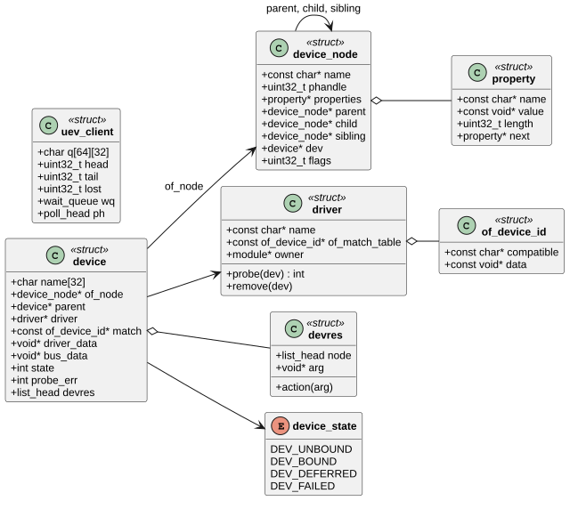
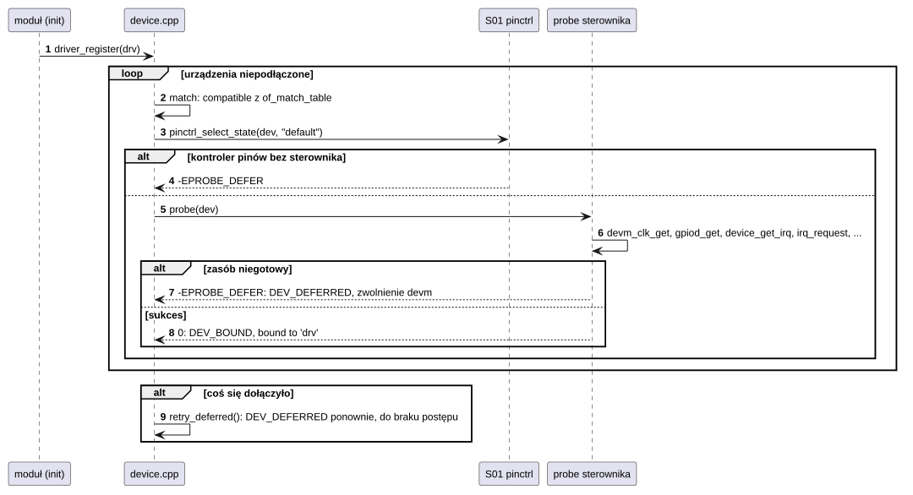
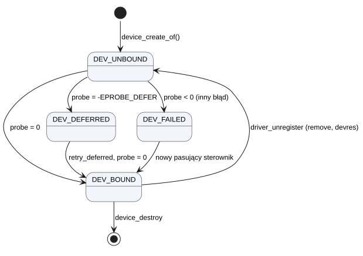

# K17 Drzewo urządzeń i model sterowników

## 1. Identyfikacja

| | |
|---|---|
| Identyfikator | K17 |
| Warstwa | L0 |
| Pliki | `kernel/os/of.cpp` (parser FDT, API `of_*`), `kernel/os/device.cpp` (urządzenia, sterowniki, `probe`, zasoby zarządzane, domeny przerwań), `kernel/os/uevent.cpp` (`/dev/uevent`) |
| Interfejs | `kernel/include/crtos/of.h`, `kernel/include/crtos/device.h` |

## 2. Odpowiedzialność

- Wczytanie spłaszczonego drzewa urządzeń (FDT v16/v17) i rozwinięcie go w drzewo
  węzłów `device_node` (wartości właściwości wskazują w oryginalny blob).
- API odczytu drzewa jak w Linuksie (`of_property_read_*`, `phandle`, `reg`,
  `interrupts`, aliasy, `/chosen/stdout-path`).
- Urządzenie dla każdego dostępnego węzła z `compatible` (korzeń i magistrale
  `simple-bus`; magistrale I2C/SPI tworzą urządzenia dla swoich dzieci).
- Dopasowanie sterowników po `compatible`, `probe` ze stanem „default” pinów, odraczanie
  (`-EPROBE_DEFER`) i ponawianie, zasoby zwalniane automatycznie przy odłączeniu (`devm_*`).
- Powiadomienia o plikach urządzeń dla programów (`/dev/uevent`: `add`/`remove`).

## 3. Wymagania

| ID | Wymaganie | Weryfikacja |
|---|---|---|
| REQ-K17-01 | Niepoprawny blob (magia, wersja < 16, przesunięcia poza rozmiarem, niezrównoważone węzły, głębokość > 16) jest odrzucany (`-EINVAL`) bez częściowego drzewa. | przegląd kodu |
| REQ-K17-02 | Urządzenie powstaje tylko dla węzła z `compatible` i `status` brak/`"okay"`. | `kmon devices`, `kmon dt` |
| REQ-K17-03 | Przed `probe` jest stosowany stan pinów `default` urządzenia (jeśli istnieje). | przegląd kodu, start płytki |
| REQ-K17-04 | `probe` zwracające `-EPROBE_DEFER` jest ponawiane po każdym udanym dołączeniu innego sterownika, aż do skutku albo końca postępu. | start płytki (kolejność modułów dowolna) |
| REQ-K17-05 | Nieudany `probe` i odłączenie sterownika zwalniają wszystkie zasoby `devm_*` w odwrotnej kolejności. | przegląd kodu, `rmmod`/`insmod` |
| REQ-K17-06 | Usunięcie modułu odłącza wszystkie jego sterowniki, także te, których moduł nie wyrejestrował sam (z ostrzeżeniem). | przegląd kodu |
| REQ-K17-07 | Nowy czytelnik `/dev/uevent` dostaje najpierw zdarzenie `add` dla każdego istniejącego pliku urządzenia (nie przegapi żadnego). | `devmgr` (U02) przy restarcie |

## 4. Interfejs udostępniany

### 4.1 Drzewo (`crtos/of.h`)

| Funkcja | Opis |
|---|---|
| `of_init(blob, size)` | rozwinięcie drzewa (jądro przejmuje blob) → 0, `-EINVAL`, `-ENOMEM` |
| `of_root()`, `of_next_node(np)`, `for_each_child_of_node` | nawigacja |
| `of_find_node_by_path(path)` (także aliasy), `of_find_node_by_phandle`, `of_find_compatible_node`, `of_get_child_by_name`, `of_get_full_name` | wyszukiwanie |
| `of_get_property`, `of_property_read_bool/u32/u32_index/u32_array/string/string_index`, `of_property_count_u32/strings`, `of_property_match_string` | właściwości (liczby w kolejności procesora) |
| `of_device_is_compatible`, `of_device_is_available` | dopasowanie, `status` |
| `of_n_addr_cells`, `of_n_size_cells`, `of_get_reg` | adresy |
| `of_parse_phandle`, `of_parse_phandle_with_args` | odwołania (`clocks`, `gpios`, `pinctrl-N`, ...) |
| `of_irq_parent`, `of_irq_parse`, `of_irq_count` | przerwania |
| `of_alias_get_id(np, stem)`, `of_stdout_node()` | aliasy (`serial3`, `spi3`), konsola |

### 4.2 Model sterowników (`crtos/device.h`)

| Funkcja | Kontekst | Opis | Wynik |
|---|---|---|---|
| `driver_register(drv)` | wątek (zwykle `init` modułu) | rejestracja i `probe` pasujących urządzeń | 0 |
| `driver_unregister(drv)` | wątek | `remove` i zwolnienie zasobów urządzeń sterownika | — |
| `device_create_of(np, parent, bus_data)` | wątek (sterowniki magistral) | urządzenie dla węzła, od razu dopasowywane | `device*` / `NULL` |
| `device_destroy(dev)` | wątek | odłączenie i usunięcie | — |
| `device_get_reg(dev, i, &addr, &size)`, `device_map(dev, i)` | wątek | adres rejestrów z `reg` | 0 / adres / `NULL` |
| `device_get_irq(dev, i)` | wątek | numer przerwania (K02) | numer, `-EPROBE_DEFER`, `-EINVAL` |
| `device_get_match_data(dev)` | wątek | `data` dopasowanego wpisu `of_device_id` | wskaźnik |
| `devm_kzalloc(dev, size, flags)`, `devm_add_action(dev, fn, arg)` | `probe` | zasoby zwalniane przy odłączeniu | wskaźnik / 0, `-ENOMEM` |
| `dev_set_drvdata`, `dev_get_drvdata` | wszędzie | dane sterownika | — |
| `device_foreach`, `driver_foreach` | wątek | przegląd (kmon `devices`, `drivers`) | — |
| `dev_info`, `dev_warn`, `dev_err` | wszędzie | `printk` z nazwą urządzenia | — |

`struct driver`: `name`, `of_match_table` (zakończona wpisem z `compatible == NULL`),
`probe(dev)` (0, `-EPROBE_DEFER`, `-ENODEV` albo błąd), `remove(dev)`.

### 4.3 Powiadomienia

| Funkcja / plik | Opis |
|---|---|
| `uevent_emit(action, name)` | linia `"<action> <name>\n"` do kolejki każdego czytelnika (woła devfs, K13) |
| `/dev/uevent` | `read` całych linii (blokuje, `O_NONBLOCK`), `poll` (`POLLIN`); kolejka 64 linie na czytelnika |

## 5. Interfejsy wymagane

K07 (węzły, właściwości, urządzenia z `kmalloc`), K06 (mutex listy urządzeń i sterowników),
K16 (`module_loading()` – właściciel sterownika), S01 (`pinctrl_select_state`), K13
(devfs dla `/dev/uevent`), K12 (`poll`).

## 6. Struktura statyczna

*Źródło: [K17/struktura-statyczna.puml](../diagramy/K17/struktura-statyczna.puml)*

## 7. Zachowanie dynamiczne

### 7.1 Dołączanie sterownika z odraczaniem

*Źródło: [K17/dolaczanie-sterownika-z-odraczaniem.puml](../diagramy/K17/dolaczanie-sterownika-z-odraczaniem.puml)*

### 7.2 Stany urządzenia

*Źródło: [K17/stany-urzadzenia.puml](../diagramy/K17/stany-urzadzenia.puml)*

## 8. Implementacja

- `of_init` przechodzi strukturę FDT jednym przebiegiem ze stosem (głębokość ≤ 16),
  tworzy `device_node` i `property` w pamięci jądra; nazwy i wartości wskazują w blob,
  który jądro zachowuje na stałe.
- `populate_bus` rekurencyjnie tworzy urządzenia dla dzieci korzenia i węzłów
  `simple-bus`. Wbudowane sterowniki K18 (`builtin-bus`, `builtin-usdhc`, `earlycon`)
  dołączają się do magistral, kontrolera karty i konsoli, żeby moduły nie były ładowane
  dla urządzeń obsługiwanych przez jądro.
- Wszystkie operacje na listach urządzeń i sterowników pod jednym mutexem; `probe`
  wykonuje się pod nim (sterownik może tworzyć urządzenia potomne – `device_create_of`
  woła `bind_device` w tym samym wątku).
- `retry_deferred` ponawia wszystkie odroczone urządzenia, dopóki któreś się dołącza.
- `devm_kzalloc` umieszcza nagłówek `devres` przed blokiem; `devm_add_action` rejestruje
  funkcję sprzątającą (np. wyłączenie zegara, zwolnienie GPIO).
- Właściciel sterownika (`owner`) to moduł, którego `init` właśnie trwa
  (`module_loading()`).

## 9. Obsługa błędów i mechanizmy bezpieczeństwa

| Sytuacja | Reakcja |
|---|---|
| niepoprawny DTB | `E: invalid device tree`, system bez sterowników (tylko kmon) |
| brak DTB | `W: no device tree, no drivers` |
| `probe` nieudany (inny niż odroczenie i `-ENODEV`) | `E: dev: probe by 'drv' failed (n)`, stan `DEV_FAILED` |
| moduł usunięty bez wyrejestrowania sterownika | `W: driver 'x' still registered at module unload`, odłączenie |
| przepełniona kolejka `uevent` | licznik `lost` |

## 10. Konfiguracja

`MAX_DEPTH` (16) w `of.cpp`, `MAX_IRQ_DOMAINS` (8) w `device.cpp`, `UEV_QUEUE` (64),
`UEV_LINE` (32). Treść: `dts/imxrt1052.dtsi`, `dts/evkbimxrt1050.dts` (T01, kompilator
`tools/dtc.py`).

## 11. Weryfikacja

- Każdy start: log `bound to ...` każdego urządzenia (`crtos kmon dmesg`).
- `crtos kmon dt`, `devices`, `drivers`; `dtload` (późne wczytanie drzewa po starcie
  w trybie awaryjnym).
- `tools/dtc.py` sprawdza składnię DTS przy budowaniu.

## 12. Ograniczenia i znane problemy

- Brak nakładek (overlays) i zmian drzewa w czasie działania.
- `retry_deferred` jest kwadratowe względem liczby odroczonych urządzeń (kilkadziesiąt
  węzłów – bez znaczenia w praktyce).
- `probe` wykonuje się pod globalnym mutexem: długi `probe` (np. czekanie na PHY) opóźnia
  dołączanie innych urządzeń.
