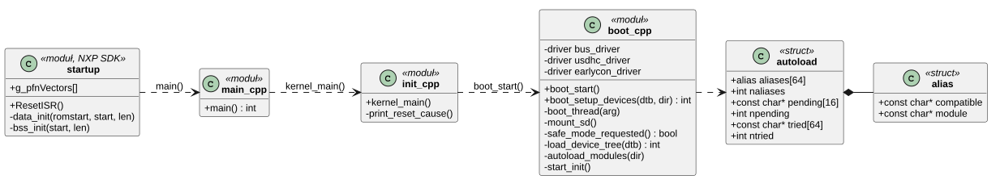
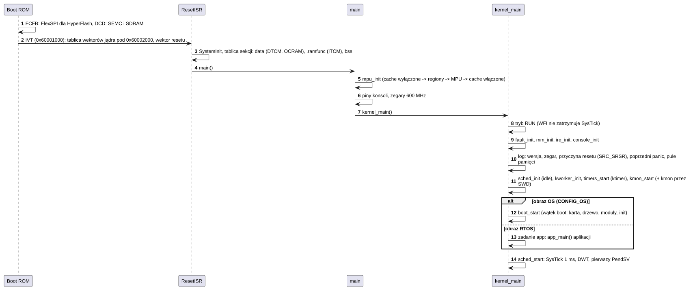
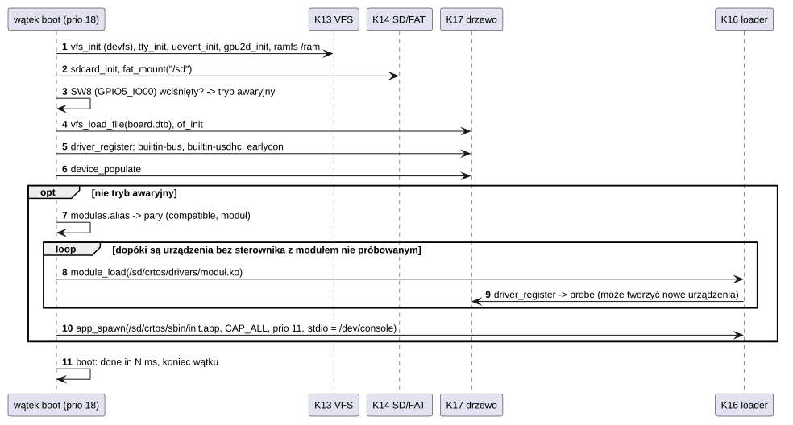

# K18 Start systemu

## 1. Identyfikacja

| | |
|---|---|
| Identyfikator | K18 |
| Warstwa | L0 |
| Pliki | `kernel/platform/evkbimxrt1050/xip/` (FCFB, IVT, DCD), `.../startup/startup_mimxrt1052.cpp` (`ResetISR`), `kernel/main.cpp`, `kernel/rtos/init.cpp` (`kernel_main`), `kernel/os/boot/boot.cpp` (wątek `boot`) |
| Interfejs | brak dla innych komponentów (punkt wejścia); stałe ścieżek `CRTOS_*` w `kernel.h` |

## 2. Odpowiedzialność

- Obraz jądra startowany przez Boot ROM z HyperFlash (XIP): blok konfiguracji FlexSPI
  (FCFB, 0x0), IVT i dane startowe (0x1000), DCD (inicjalizacja SDRAM), tablica wektorów
  i kod od 0x2000.
- `ResetISR`: kopiowanie sekcji danych i kodu do RAM (w tym gorący kod do ITCM),
  zerowanie `bss`, `SystemInit`.
- `main`: mapa MPU i pamięci podręczne, piny konsoli, zegary (600 MHz).
- `kernel_main`: kolejność inicjalizacji jądra, wypis przyczyny resetu i raportu
  poprzedniego `panic`, start schedulera.
- Wątek `boot` (obraz OS, `CONFIG_OS`): VFS, konsola, `/ram`, karta SD, tryb awaryjny, drzewo
  urządzeń, sterowniki wbudowane, automatyczne ładowanie modułów, pierwszy proces (`init`).
- Obraz RTOS (profil `rtos`, `CONFIG_OS` 0): zamiast wątku `boot` zadanie `app` z funkcją
  `app_main()` aplikacji (K21); bez karty, drzewa urządzeń i modułów.

## 3. Wymagania

| ID | Wymaganie | Weryfikacja |
|---|---|---|
| REQ-K18-01 | MPU jest skonfigurowane, zanim zostaną włączone pamięci podręczne i zanim wystartuje jakikolwiek wątek. | przegląd kodu (`main`) |
| REQ-K18-02 | Wyjątki błędów, sterty, przerwania i konsola są gotowe przed pierwszym komunikatem jądra i przed utworzeniem wątków. | przegląd kodu (`kernel_main`) |
| REQ-K18-03 | Przytrzymanie SW8 w czasie startu (tryb awaryjny) pomija ładowanie modułów i `init`; jądro, karta SD i kmon działają. | test ręczny |
| REQ-K18-04 | Moduł jest ładowany dla każdego urządzenia bez sterownika, którego `compatible` występuje w `modules.alias`; ładowanie powtarza się, dopóki pojawiają się nowe urządzenia (np. dzieci magistral). | start płytki (`kmon lsmod`, `devices`) |
| REQ-K18-05 | Brak karty, DTB, `modules.alias` albo `init.app` nie zatrzymuje jądra: działa ono dalej z monitorem jądra. | test ręczny (np. bez karty) |
| REQ-K18-06 | `init` startuje z wszystkimi uprawnieniami, konsolą jako 0–2 i priorytetem 11. | `kmon procs` |
| REQ-K18-07 | W obrazie RTOS `kernel_main` po rdzeniu (pamięć, przerwania, konsola, scheduler, `kworker`, wątek timerów, kmon) tworzy zadanie `app` (priorytet `CONFIG_APP_PRIO` 10, stos `CONFIG_APP_STACK` 8 KB), które wywołuje `app_main()`; bez aplikacji działa słaba wersja `app_main` z komunikatem, a jądro dalej z monitorem. | obraz RTOS z `examples/rtos/blinky` na płytce: `dmesg` (komunikaty aplikacji), `ps` (zadania `led`, `report`, `ktimer`; `app` po powrocie z `app_main` znika) (03.10.2026) |

## 4. Interfejs udostępniany

| Punkt | Opis |
|---|---|
| `ResetISR` | wektor resetu (tablica `g_pfnVectors`) |
| `main()` | `mpu_init`, `BOARD_InitBootPins`, `BOARD_InitBootClocks`, `kernel_main` |
| `kernel_main()` | nie wraca |
| `boot_start()` | (OS) tworzy wątek `boot` (priorytet 18, stos 4 KB) |
| `app_main()` | (RTOS) funkcja aplikacji, wywoływana w zadaniu `app` (K21, `crtos/rtos.h`) |
| `boot_setup_devices(dtb, driver_dir)` | drzewo, urządzenia i moduły (także z kmon `dtload`) → 0, `-EEXIST` (drzewo już jest), błąd |

## 5. Interfejsy wymagane

Wszystkie komponenty jądra (inicjalizacja): K03 (`mpu_init`), K04 (`fault_init`), K07
(`mm_init`), K02 (`irq_init`), K15 (`console_init`), K05 (`sched_init`, `kworker_init`,
`sched_start`), K21 (`timers_start`; w RTOS `app_main`), K19 (`kmon_start`), K13 (`vfs_init`, `ramfs_mount`), K15 (`tty_init`),
K17 (`uevent_init`, `of_init`, `device_populate`, `driver_register`), S03 (`gpu2d_init`),
K14 (`sdcard_init`, `fat_mount`), K16 (`module_load`, `app_spawn`).

## 6. Struktura statyczna

*Źródło: [K18/struktura-statyczna.puml](../diagramy/K18/struktura-statyczna.puml)*

## 7. Zachowanie dynamiczne

### 7.1 Od resetu do schedulera

*Źródło: [K18/od-resetu-do-schedulera.puml](../diagramy/K18/od-resetu-do-schedulera.puml)*

### 7.2 Wątek boot

*Źródło: [K18/watek-boot.puml](../diagramy/K18/watek-boot.puml)*

## 8. Implementacja

- **Sterowniki wbudowane** rejestrowane przed modułami: `builtin-bus` (dla `simple-bus`
  i kontrolera NVIC), `builtin-usdhc` (dołącza się tylko do USDHC1, z którego jądro
  wystartowało, gdy karta działa), `earlycon` (dołącza się do UART wskazanego w
  `/chosen/stdout-path`). Dzięki temu moduły nie przejmują urządzeń, których używa jądro.
- **Automatyczne ładowanie**: `collect` zbiera nazwy modułów dla urządzeń niepodłączonych
  (pierwsze pasujące `compatible` z listy urządzenia), każdy moduł najwyżej raz
  (`tried`); pętla kończy się, gdy nie ma nowych kandydatów.
- **Tryb awaryjny**: SW8 na padzie WAKEUP (GPIO5_IO00, aktywny niskim), odczyt po 2 ms
  z podciąganiem.
- Kolejność inicjalizacji w `kernel_main` wynika z zależności: błędy procesora przed
  czymkolwiek, sterty przed przerwaniami (tablica wektorów w RAM), przerwania przed
  konsolą (przerwanie UART), scheduler przed wątkami.
- Profil: `#if CONFIG_OS` – `boot_start()`; inaczej `kthread_create("app", app_thread, ...)`,
  a `app_thread` wywołuje `app_main()` (słaba definicja w `init.cpp` wypisuje „no application
  in this firmware”). Plik `os/boot/boot.cpp` należy tylko do obrazu OS.
- Czas: od resetu do startu `init` ok. 443 ms (`crtos bench`: `init`).

## 9. Obsługa błędów i mechanizmy bezpieczeństwa

| Sytuacja | Reakcja |
|---|---|
| brak pamięci na wątek `idle`, `kworker`, `boot`, tablicę wektorów, zajęte przerwanie konsoli | `panic` (bez nich system nie działa) |
| brak karty SD | `sd: no card`; bez drzewa i sterowników, kmon dostępny |
| błąd DTB | komunikat, brak sterowników |
| błąd modułu | `E: ścieżka: kod`, kolejne moduły ładowane dalej |
| brak `init.app` | `the console stays with kmon` |
| zły moduł psuje start | tryb awaryjny (SW8), potem naprawa plików (`crtos deploy`, `put`) |

## 10. Konfiguracja

`CRTOS_ROOT` (`/sd/crtos`), `CRTOS_DTB_PATH`, `CRTOS_DRIVER_DIR`, `CRTOS_INIT_PATH`
(`kernel.h`); `BOOT_PRIO` (18); `MAX_ALIASES` (64), `MAX_PENDING` (16); zmienne
środowiska `init`: `PATH=/flash0/bin:/sd/crtos/bin:/sd/crtos/apps`, `HOME=/sd/crtos`,
`TMPDIR=/ram`. Zegary i piny
startowe: `kernel/platform/evkbimxrt1050/board/`.

## 11. Weryfikacja

- `crtos log --reset --time 20`: pełny log startu.
- `crtos bench`: `boot` (do wczytania sterowników) i `init`.
- `crtos kmon dmesg`, `lsmod`, `devices`, `procs`.
- Tryb awaryjny i start bez karty: testy ręczne.

## 12. Ograniczenia i znane problemy

- Obraz RTOS nie ma trybu awaryjnego ani ładowania czegokolwiek z karty: zmiana aplikacji to
  nowy obraz (`crtos build --rtos`, `crtos flash --rtos`); do systemu wraca się przez
  `crtos flash` sondą.
- Sterowniki ładowane są szeregowo w jednym wątku; wolny `probe` opóźnia start `init`.
- Moduły dla urządzeń, które pojawią się po starcie, ładuje `devmgr` (U02) – obecnie tylko
  zaplanowane (hot plug nie jest zaimplementowany).
