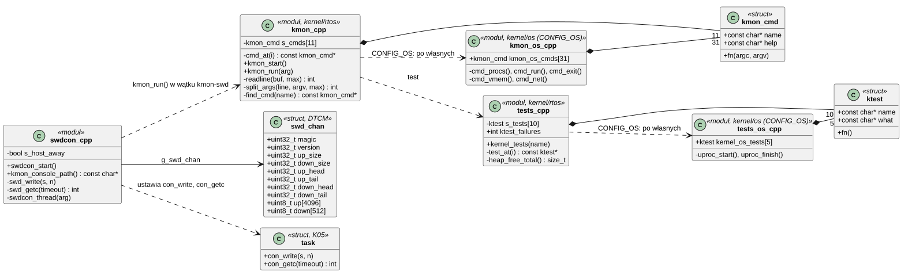
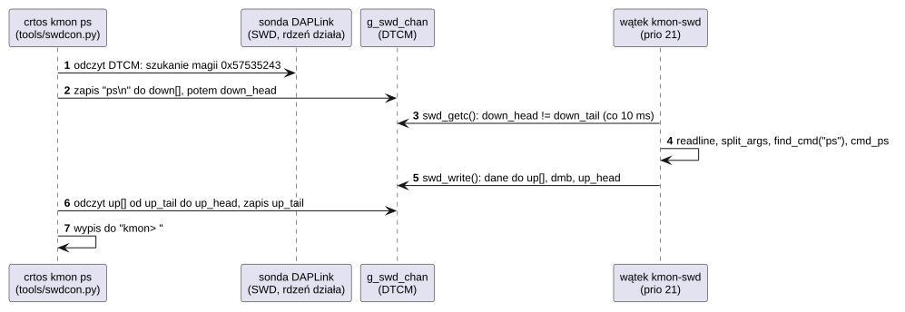
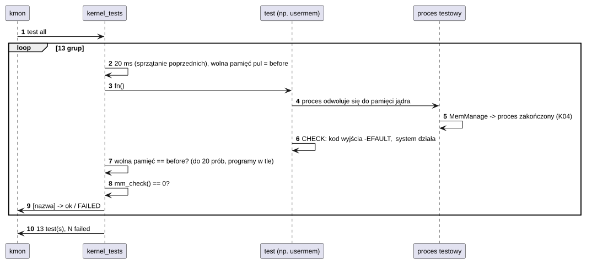

# K19 Monitor jądra i autotesty

## 1. Identyfikacja

| | |
|---|---|
| Identyfikator | K19 |
| Warstwa | L0 (diagnostyka) |
| Pliki | rdzeń: `kernel/rtos/kmon.cpp` (pętla, polecenia rdzenia), `kmon.h`, `swdcon.cpp` (kanał przez sondę SWD), `tests.cpp` (autotesty rdzenia i ich wykonywanie), `ktest.h`; część OS: `kernel/os/kmon_os.cpp` (tablica poleceń OS: procesy, `run`, pamięć emulowana, sieć), `kmon_cmds.cpp` (pliki, wgrywanie, drzewo, urządzenia, moduły, karta SD), `kmon_dev.cpp` (I2C, wejście, ekran, akcelerator 2D), `tests_os.cpp` (autotesty procesów) |
| Interfejs | polecenia tekstowe na konsoli UART (po Ctrl-]) i przez sondę SWD (`crtos kmon`); `/dev/swdcon` |

## 2. Odpowiedzialność

- Interpreter poleceń działający bez systemu plików i bez modułów: przegląd stanu (wątki,
  procesy, pamięć, MPU, przerwania, sieć, czas), log jądra, pliki, drzewo urządzeń,
  urządzenia i sterowniki, moduły, karta SD, restart, `panic`.
- Uruchamianie programów z konsolą jako wejściem/wyjściem (`run`).
- Wgrywanie plików przez konsolę (`put`) i przez sondę (`stage`, `savestage`).
- Drugi egzemplarz monitora przez sondę SWD: pierścienie w RAM czytane i zapisywane przez
  debuger, gdy rdzeń działa (niezależny od portu szeregowego).
- Autotesty jądra (`test <nazwa>|all`): 15 grup (10 rdzenia, 5 procesów) z kontrolą
  wycieków pamięci i spójności stert.
- Ten sam monitor w obrazie RTOS (profil `rtos`, `CONFIG_OS` 0): tylko polecenia i testy
  rdzenia; polecenia i testy części OS dochodzą jako druga tablica (`kmon_os_cmds`,
  `kernel_os_tests`), gdy jest `CONFIG_OS`.

## 3. Wymagania

| ID | Wymaganie | Weryfikacja |
|---|---|---|
| REQ-K19-01 | Monitor działa, gdy nie ma karty SD, drzewa urządzeń, modułów ani `init` (wątek jądra uruchamiany przed nimi). | start bez karty (test ręczny) |
| REQ-K19-02 | Monitor na UART i monitor przez SWD działają niezależnie; wyjście programu uruchomionego z monitora trafia do konsoli tego monitora. | `crtos kmon` przy otwartym `crtos serial` |
| REQ-K19-03 | Kanał SWD nie blokuje systemu, gdy komputer nie czyta: po ok. 0,5 s braku miejsca wyjście jest odrzucane, aż komputer znów zacznie czytać. | przegląd kodu |
| REQ-K19-04 | Każdy autotest kończy się kontrolą: brak wycieku pamięci jądra (suma wolnej pamięci pul przed i po) i spójność stert (`mm_check`). | `crtos kmon "test all"` |
| REQ-K19-05 | Plik wgrany przez `put`/`savestage` jest zapisywany dopiero po zgodności sumy CRC-32 z podaną. | `crtos put`, `crtos deploy --swd` |
| REQ-K19-06 | Lista poleceń i testów to tablica rdzenia, a z `CONFIG_OS` po niej tablica części OS (`help` i `test` pokazują obie, polecenie szukane jest w obu); obraz RTOS ma tylko polecenia rdzenia (`help`, `ps`, `mem`, `mpu`, `irq`, `uptime`, `kill`, `dmesg`, `test`, `reboot`, `panic`) i 10 testów rdzenia, bez odwołań do części OS. | obraz RTOS na płytce: `help` (11 poleceń), `test all` 10/10; obraz OS: 42 polecenia, `test all` 15/15 (03.10.2026); `nm` obrazu RTOS bez `proc_*`, `vfs_*` |

## 4. Interfejs udostępniany: polecenia

| Grupa | Polecenia |
|---|---|
| stan (rdzeń) | `help`, `ps`, `mem`, `mpu`, `irq`, `uptime`, `dmesg [bajty]`, `kill <id wątku>` |
| stan (OS) | `procs`, `vmem` (pamięć emulowana, K20), `net` |
| procesy (OS) | `run [-w] program [arg]`, `kill -p <pid>` (i `kill` wątku programu: cały program), `exit` (konsola dla programów) |
| pliki | `ls`, `cat`, `hexdump`, `rm`, `mkdir`, `mv`, `df`, `crc32` |
| wgrywanie | `put <ścieżka> <rozmiar> <crc32>` (UART), `stage <rozmiar>`, `savestage <ścieżka> <rozmiar> <crc32>` (SWD) |
| drzewo i sterowniki | `dt [węzeł] [głębokość]`, `dtload <dtb> [katalog]`, `devices`, `drivers`, `lsmod`, `insmod`, `rmmod` |
| karta SD | `sd [trace|reinit|mode|clock|pads|hist|cmd23]`, `sdbench`, `sdstress` |
| urządzenia | `i2cdetect`, `evtest`, `fb [WxH]` (tryb ekranu; zmiana na inny tryb panelu, gdy nikt nie używa ekranu, S03), `fbtest`, `gpu2dtest` |
| testy | rdzeń: `test <sched|mutex|sem|irq|heap|queue|timer|fpu|kstack|null>`; OS: `test <user|usermem|userstack|userregs|syscall>`; `test all` |
| system | `reboot`, `panic [tekst]` |

Kanał SWD (`struct swd_chan g_swd_chan` na początku danych w DTCM): magia `0x57535243`
(„CRSW”), wersja 1, pierścień wyjścia 4 KB (`up`) i wejścia 512 B (`down`). Zapisujący
najpierw wpisuje dane, potem (po barierze `dmb`) przesuwa swój indeks; każda strona zmienia
tylko własny indeks. Po stronie komputera obsługuje go `tools/swdcon.py` (T01).

## 5. Interfejsy wymagane

Rdzeń: K15 (`cprintf`, `con_write/con_getc` wątku, fokus konsoli, `log_snapshot`), K05, K06,
K07, K21 (testy kolejek i timerów), K02 (`irq_info`, linia testowa). Część OS: K08, K13, K14
(diagnostyka karty), K16 (`module_load/unload`, `app_spawn`), K17, K20, S02–S05 (testy
urządzeń, sieć).

## 6. Struktura statyczna

*Źródło: [K19/struktura-statyczna.puml](../diagramy/K19/struktura-statyczna.puml)*

## 7. Zachowanie dynamiczne

### 7.1 Polecenie przez sondę SWD

*Źródło: [K19/polecenie-przez-sonde-swd.puml](../diagramy/K19/polecenie-przez-sonde-swd.puml)*

### 7.2 Autotest

*Źródło: [K19/autotest.puml](../diagramy/K19/autotest.puml)*

## 8. Implementacja

- Monitor na UART to wątek `kmon` (priorytet 22, stos 3 KB), przez sondę – wątek `kmon-swd`
  (21, 3 KB). Oba wykonują tę samą funkcję `kmon_run`; kanał wybierają wskaźniki
  `con_write`/`con_getc` w strukturze wątku (NULL: UART).
- Polecenia wykonują się w wątku monitora (priorytet wyższy niż programy), dlatego długie
  operacje (np. `sdbench`) opóźniają programy; czas polecenia > 100 ms jest wypisywany.
- `run` uruchamia program ze wszystkimi uprawnieniami i konsolą monitora (`/dev/console`
  albo `/dev/swdcon`) jako 0–2; `-w` czeka na koniec (Ctrl-C kończy program).
- `i2cdetect` sonduje odczytem jednego bajtu: urządzeń tylko do zapisu (WM8960) nie widać,
  a po odpowiedzi NACK następny adres bywa przerwany przez zaległy STOP (co drugi adres
  nieparzysty, np. 0x5D, nie jest naprawdę sprawdzany); pewniejsze jest ponowne `insmod`
  sterownika.
- `stage`/`savestage`: komputer prosi o bufor w SDRAM, zapisuje do niego plik przez debuger
  (znacznie szybciej niż przez port szeregowy), a monitor sprawdza CRC-32 i zapisuje plik.
- Autotesty tworzą własne wątki i procesy (z kodu w jądrze), mierzą koszty (przełączenie,
  opóźnienie przerwania, wywołanie systemowe, sterta, kolejka) i sprawdzają ograniczanie
  skutków błędów.
- Podział rdzeń / OS: `cmd_at(i)` i `test_at(i)` zwracają kolejno pozycje tablicy rdzenia,
  potem (z `CONFIG_OS`) tablicy części OS; `kill` w rdzeniu kończy wątek, a z `CONFIG_OS`
  wątek programu kończy cały program (`proc_kill`). Wspólne części testów (makro `CHECK`,
  `ktest_failures`, `ktest_wait_task_gone`, `ktest_fpu_thread`) są w `ktest.h`.

## 9. Obsługa błędów i mechanizmy bezpieczeństwa

| Sytuacja | Reakcja |
|---|---|
| nieznane polecenie | `unknown command` |
| komputer nie czyta kanału SWD | wyjście odrzucane (flaga `s_host_away`), system działa dalej |
| błąd CRC przy wgrywaniu | plik niezapisany, komunikat |
| test nieudany | `FAILED`, licznik; kolejne testy wykonują się dalej |

Monitor ma pełne uprawnienia (wątek jądra): dostęp do niego (port szeregowy, sonda) oznacza
pełną kontrolę nad płytką. To świadoma decyzja dla płytki rozwojowej
([03 Analiza bezpieczeństwa](../03-analiza-bezpieczenstwa.md)).

## 10. Konfiguracja

`KMON_PRIO` (22), `LINE_MAX` (512), `ARGS_MAX` (16), rozmiary pierścieni SWD (`UP_SIZE`
4096, `DOWN_SIZE` 512).

## 11. Weryfikacja

- `crtos kmon "test all"`: obraz OS 15 grup, oczekiwany wynik `15 test(s), 0 failed`
  (03.10.2026: 15/15; wcześniej 13 grup, 27.09.2026: 13/13); obraz RTOS 10 grup
  (03.10.2026: 10/10).
- Użycie na co dzień: `crtos kmon ...`, `crtos run`, `crtos deploy --swd`, `crtos shot`.

## 12. Ograniczenia i znane problemy

- Brak uwierzytelnienia: każdy z dostępem do portu szeregowego albo sondy ma pełną kontrolę.
- Polecenia modyfikujące (np. `rm`, `mv`) nie są ograniczone do `/sd/crtos` – to narzędzie
  serwisowe.
