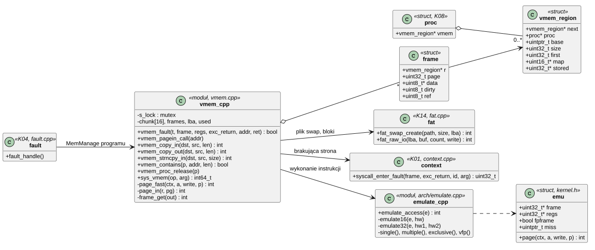
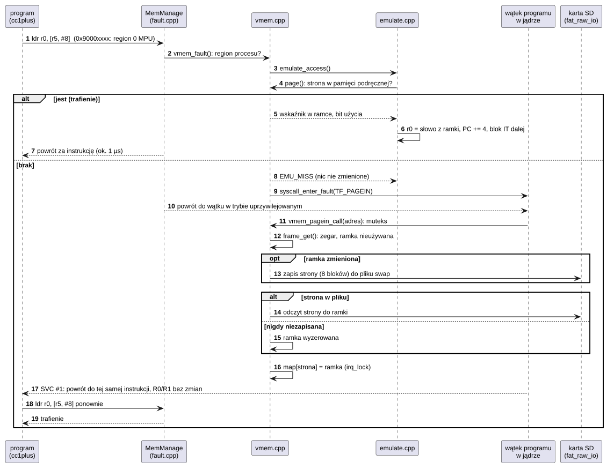

# K20 Pamięć emulowana

## 1. Identyfikacja

| | |
|---|---|
| Identyfikator | K20 |
| Warstwa | L0 |
| Pliki | `kernel/os/vmem.cpp` (regiony, pamięć podręczna stron, plik swap, wywołanie `SYS_VMEM`), `kernel/os/emulate.cpp` (wykonanie instrukcji ładowania i zapisu), włączenie w `arch/fault.cpp` i `arch/context.cpp`; plik swap przez `os/boot/fat.cpp` (`fat_swap_create`, `fat_raw_io`) |
| Interfejs | wywołanie `SYS_VMEM` (`VMEM_MAP`, `VMEM_UNMAP`, `VMEM_INFO`, `crtos/syscall.h`), w programach `crtos_vmem_map/unmap/info` (L01); dla jądra `vmem_fault`, `vmem_copy_in/out`, `vmem_strncpy_in`, `vmem_contains`, `vmem_proc_release`; polecenie kmon `vmem` |

## 2. Odpowiedzialność

- **Więcej pamięci dla programu, niż ma SDRAM**, kosztem szybkości: region pod adresem
  `CRTOS_VMEM_BASE` (`0x90000000`), za którym nie ma żadnej pamięci. Każdy dostęp programu
  do niego wywołuje błąd MemManage (region 0 MPU), a jądro wykonuje instrukcję na kopii strony
  w swojej pamięci podręcznej.
- **Bez MMU nie ma przesuwania stron**: adres programu jest adresem fizycznym, więc strony
  nie da się wyrzucić i wczytać gdzie indziej. Dlatego pamięć emulowana nie jest „zwykłą”
  pamięcią z wymianą, tylko osobnym zakresem, w którym wykonuje każdy dostęp jądro.
- **Wykonanie instrukcji** (`emulate.cpp`): wszystko, co kompilator generuje dla danych:
  - `LDR`/`STR` słów, półsłów i bajtów, także ze znakiem, we wszystkich trybach adresowania:
    przesunięcie, rejestr z przesunięciem bitowym, indeksowanie przed i po, zapis bazy;
  - `LDRD`/`STRD`, `LDM`/`STM` (IA i DB), `LDREX`/`STREX` (programowy monitor);
  - zmiennoprzecinkowe `VLDR`/`VSTR`/`VLDM`/`VSTM`;
  - ładowanie do PC (skok), instrukcje w bloku IT.
- **Pamięć podręczna stron** (4 KB): brakującą stronę wczytuje wątek programu w jądrze (jak
  wywołanie systemowe), zwalnianie ramek algorytmem zegarowym, strona zmieniona wraca do
  pliku swap przed zwolnieniem ramki, strona nigdy niezapisana wraca wyzerowana.
- **Plik swap** `/sd/crtos/var/swap` (64 MB) w jednym kawałku na karcie: strony czytane
  i zapisywane jako bloki karty, przez pamięć podręczną bloków FatFs (K14).
- **Dane programu dla wywołań systemowych**: `copy_from_user`, `copy_to_user`,
  `strncpy_from_user` (K08), `read` i `write` (K09) sięgają do pamięci emulowanej przez
  pamięć podręczną stron.

## 3. Wymagania

| ID | Wymaganie | Weryfikacja |
|---|---|---|
| REQ-K20-01 | Instrukcja programu na pamięci emulowanej daje ten sam wynik co na zwykłej pamięci: wartości rejestrów, zapisy, zapis bazy, flagi bloku IT i następna instrukcja; dotyczy `LDR`/`STR` (wszystkie szerokości, tryby adresowania, znak), `LDRD`/`STRD`, `LDM`/`STM`, `LDREX`/`STREX`, `VLDR`/`VSTR`/`VLDM`/`VSTM` i ładowania do PC. | `heaptest` (instrukcje z C i wstawki asemblera, dostęp przez granicę stron, bez wyrównania), przegląd kodu |
| REQ-K20-02 | Instrukcja, której choć jednej strony brakuje, nie zmienia niczego (rejestrów ani pamięci), dopóki obie strony nie są w pamięci podręcznej; potem wykonuje się od początku. | przegląd kodu (`span`), `heaptest` (przemiatanie większe niż pamięć podręczna) |
| REQ-K20-03 | Program ma dostęp tylko do swoich regionów. Instrukcja, której jądro nie wykonuje (`SP` albo `PC` jako baza, instrukcja spoza listy, dostęp poza region), kończy program jak zwykły błąd pamięci. | przegląd kodu, `heaptest` (regiony innych procesów niewidoczne) |
| REQ-K20-04 | Strona zmieniona trafia do pliku swap, zanim jej ramka dostanie inną stronę; strona nigdy niezapisana jest przy pierwszym dostępie wyzerowana (bez danych innych procesów). | `heaptest` (6 MB przy pamięci podręcznej 512 KB: zapis, odczyt), przegląd kodu |
| REQ-K20-05 | Obsługa błędu nie czeka: brakującą stronę wczytuje wątek programu w trybie uprzywilejowanym na swoim stosie jądra (wywłaszczalnie), po czym wraca do tej samej instrukcji z rejestrami bez zmian. | przegląd kodu (`syscall_enter_fault`), `heaptest` (dwa wątki) |
| REQ-K20-06 | Ścieżki, argumenty i wyniki wywołań systemowych oraz bufory `read`/`write` w pamięci emulowanej są obsługiwane; wywołania, które zachowują wskaźnik (IPC, `poll`, `ioctl`, futeksy, stosy wątków), dają `-EFAULT`. | `heaptest` (`open` ze ścieżką, `write`/`read` 64 KB, `pipe`, `VMEM_INFO` do pamięci emulowanej) |
| REQ-K20-07 | Regiony procesu i ich strony w pamięci podręcznej znikają przy końcu procesu; pamięć podręczna wraca do SDRAM z ostatnim regionem. | `kmon vmem` po `heaptest` (0 regionów, brak pamięci podręcznej) |
| REQ-K20-08 | Zmiana mapy stron, którą widzi obsługa błędu, jest jednym zapisem pod `irq_lock`; obsługa błędu nie bierze blokad. | przegląd kodu |

## 4. Interfejs udostępniany

| Funkcja | Kontekst | Opis | Wynik |
|---|---|---|---|
| `SYS_VMEM(VMEM_MAP, size)` | program | nowy region (strony po 4 KB), zwolniony przy końcu procesu | adres, `-ENOMEM`, błąd pliku swap |
| `SYS_VMEM(VMEM_UNMAP, addr)` | program | zwolnienie regionu (bez zapisu stron) | 0, `-EINVAL` |
| `SYS_VMEM(VMEM_INFO, vi)` | program | `struct crtos_vmeminfo`: rozmiar pliku swap, wolne, swoje, pamięć podręczna, liczniki | 0 |
| `vmem_fault(t, frame, regs, exc_return, addr, &ret)` | obsługa MemManage | wykonanie instrukcji albo przejście do jądra po stronę | obsłużone: PSP i EXC_RETURN; nie: zwykły błąd |
| `vmem_pagein_call(addr)` | wątek programu w jądrze (`TF_PAGEIN`) | wczytanie strony | — (błąd: koniec procesu) |
| `vmem_copy_in/out`, `vmem_strncpy_in` | wywołanie systemowe | kopia przez pamięć podręczną | 0 / długość, `-EFAULT` |
| `vmem_contains(p, addr, len)` | wszędzie | czy zakres leży w regionie procesu | tak/nie |
| `vmem_proc_release(p)` | `kworker` | regiony zmarłego procesu | — |
| `emulate_access(e)` | obsługa błędu | dekodowanie i wykonanie instrukcji Thumb-2 | `EMU_DONE`, `EMU_MISS`, `EMU_BAD` |
| `vmem_show(out)` | kmon | plik swap, pamięć podręczna, liczniki | — |

## 5. Interfejsy wymagane

K03 (region 0 MPU: brak dostępu), K04 (`fault_handle`, R4–R11 odtwarzane po obsłudze), K01
(`syscall_enter`, `syscall_exit`, `syscall_thread`: przejście wątku do jądra i powrót), K06
(muteks), K07 (pamięć podręczna i tablice z SDRAM), K08 (proces, `copy_*_user`), K14
(`fat_swap_create`, `fat_raw_io`: plik swap w jednym kawałku, bloki przez pamięć podręczną
FatFs).

## 6. Struktura statyczna

*Źródło: [K20/struktura-statyczna.puml](../diagramy/K20/struktura-statyczna.puml)*

## 7. Zachowanie dynamiczne

### 7.1 Dostęp do pamięci emulowanej

*Źródło: [K20/dostep.puml](../diagramy/K20/dostep.puml)*

## 8. Implementacja

- **Rejestry** w obsłudze błędu: R0–R3, R12, LR, PC i xPSR w ramce wyjątku, R4–R11 tam, gdzie
  zapisało je wejście `fault_common` (odtwarzane po powrocie, `pop` zamiast pominięcia).
  Z ramką zmiennoprzecinkową (bit 4 EXC_RETURN = 0) S0–S15 są w ramce (najpierw wymuszone
  leniwe odłożenie, `vmrs`), S16–S31 w FPU.
- **Dekodowanie**: pierwsze półsłowo instrukcji spod PC (kod programu w arenie, ITCM albo na
  flashu XIP); wszystkie bajty jednej instrukcji leżą obok siebie (najwyżej 128 B, więc
  najwyżej dwie strony), obie muszą być w pamięci podręcznej przed jakąkolwiek zmianą.
- **Po wykonaniu**: PC o 2 albo 4 bajty dalej i następny stan bloku IT (ITAdvance); ładowanie
  do PC kończy blok IT i skacze (bit Thumb musi być ustawiony).
- **`LDREX`/`STREX`**: monitor to adres i licznik przełączeń wątku (`nswitch`) przy `LDREX`;
  `STREX` po przełączeniu wątku się nie udaje, więc pętla programu powtarza operację.
- **Brakująca strona**: `vmem_fault` wywołuje `syscall_enter_fault` – to samo co wejście
  wywołania systemowego, z flagą `TF_PAGEIN`; `syscall_thread_c` zamiast rozdziału wywołań
  woła `vmem_pagein_call` i zwraca R0/R1 programu bez zmian. Wątek czeka na muteks i odczyt
  karty jak każde wywołanie; po powrocie instrukcja wykonuje się od nowa.
- **Pamięć podręczna**: ramki po 4 KB (`CONFIG_VMEM_CACHE` 1 MB albo mniej, gdy SDRAM tyle nie
  ma), złożone z najwyżej 16 kawałków SDRAM (największe dostępne, co najmniej 16 KB): gdy
  program zapełnia pamięć, reszta SDRAM jest zwykle pofragmentowana (np. 1,9 MB wolne, ale
  największy blok 512 KB), a ramki nie muszą leżeć obok siebie; każda ramka zna adres swoich
  danych. Zegar przechodzi ramki, zeruje bit użycia, zwalnia pierwszą nieużywaną;
  mapa strony → ramka (16 bitów na stronę) i mapa bitowa stron zapisanych w pliku.
- **Plik swap**: `fat_swap_create` używa pliku istniejącego w jednym kawałku (exFAT) albo
  zakłada go od nowa przez `f_expand` (przydział bez zapisu danych); adres regionu i strona
  pliku odpowiadają sobie jeden do jednego (`CRTOS_VMEM_BASE` + strona × 4 KB).
- **`read`/`write`** z buforem w pamięci emulowanej idą przez bufor jądra po stronie
  (`rw_vmem` w `sys_fs.cpp`); `wait`, `pipe`, `readdir` piszą wynik przez `copy_to_user`.

## 9. Obsługa błędów i mechanizmy bezpieczeństwa

| Sytuacja | Reakcja |
|---|---|
| dostęp poza regionem procesu albo instrukcja nieobsługiwana | zwykły błąd MemManage: raport, koniec procesu (K04) |
| błąd odczytu albo zapisu karty przy wymianie strony | komunikat `vmem: page ... not read`, koniec procesu (danych strony nie ma) |
| brak pliku swap (brak miejsca na karcie w jednym kawałku) | `VMEM_MAP`: błąd; `libcrtosheap` nie dostaje pamięci emulowanej |
| brak SDRAM na pamięć podręczną (poniżej 64 KB) | `VMEM_MAP`: `-ENOMEM` |
| jądro sięga do pamięci emulowanej wprost (błąd w kodzie) | region 0 MPU także dla trybu uprzywilejowanego: błąd MemManage w jądrze, nie odczyt przypadkowej pamięci |
| koniec procesu w czasie wczytywania strony | wątek kończy się przy powrocie z jądra (`TF_KILLED`), regiony zwalnia `kworker` |

## 10. Konfiguracja

`CONFIG_VMEM_FILE` (`/crtos/var/swap` na karcie), `CONFIG_VMEM_SIZE` (64 MB),
`CONFIG_VMEM_CACHE` (1 MB) w `crtos/config.h`; `CRTOS_VMEM_BASE`, `CRTOS_VMEM_SPAN`
w `crtos/syscall.h`. `FF_USE_EXPAND` 1 w `ffconf.h`.

## 11. Weryfikacja

- `crtos run /flash0/bin/heaptest.app` (30.09.2026): 193 348 sprawdzeń bez błędów, w tym
  instrukcje (C i asembler), wywołania systemowe, dwa wątki z atomikami, przemiatanie 6 MB
  przy pamięci podręcznej 512 KB (121 tys. zapisów w ok. 0,46 s, odczytów w ok. 0,32 s),
  `malloc` ponad RAM (od 23,5 MB bloki w pamięci emulowanej).
- Koszt dostępu do strony w pamięci podręcznej: ok. 1,0 µs (zwykły dostęp: kilka ns).
- `crtos run apptest` (1759 sprawdzeń) i `kmon "test all"` bez zmian.
- `kmon vmem`: liczniki i zwolnienie pamięci podręcznej po końcu programu.
- Kompilator na płytce (T02): `snes_core.cpp` (`-std=gnu++17`) ze szczytem sterty 24,9 MB,
  z czego 20,5 MB w oknie i reszta w pamięci emulowanej (53 mln dostępów, ok. 2,5 min); cały
  SNES (29 plików, 7 z pamięcią emulowaną, ok. 900 mln dostępów) zbudowany na płytce w ok.
  70 min, a jego `snes.app` daje te same sumy kontrolne co zbudowany na komputerze.
- Pamięć podręczna z kawałków (30.09.2026): przy SNES wolna SDRAM była pofragmentowana
  (1,9 MB wolne, największy blok 512 KB) i pamięć podręczna z jednego bloku miała 256 KB;
  z kawałków ma 1 MB (`heaptest`: 4 kawałki po zajęciu SDRAM przez okno). `smp.cpp`: 29,8 tys.
  stron czytanych z karty zamiast 48,6 tys.; czas kompilacji (8,5 min) zależy głównie od
  liczby dostępów (221 mln × ok. 1,07 µs ≈ 4 min), nie od karty.

## 12. Ograniczenia i znane problemy

- Każdy dostęp to wyjątek i dekodowanie (ok. 1 µs), brakująca strona to odczyt karty (ok.
  0,5 ms): program pracujący głównie na pamięci emulowanej działa dziesiątki razy wolniej.
- Kod nie wykonuje się z pamięci emulowanej, a stos nie może w niej leżeć (instrukcje
  względem `SP` nie są emulowane).
- Wywołania, które zachowują wskaźnik programu (IPC, `poll`, `ioctl`, futeksy, stos nowego
  wątku, `cache_sync`), nie przyjmują pamięci emulowanej (`-EFAULT`).
- Plik swap nie jest chroniony przed programami: jego zawartość (strony procesów) da się
  przeczytać przez VFS, a usunięcie pliku w trakcie pracy oddałoby jego klastry innym plikom.
- Brak odczytu z wyprzedzeniem i łączenia stron w większe transfery.
