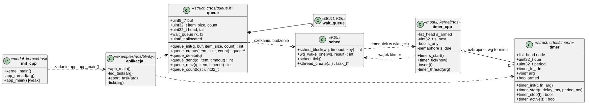
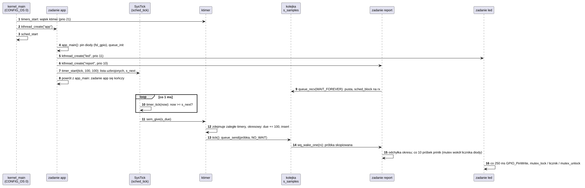

# K21 API RTOS: kolejki, timery, aplikacja

## 1. Identyfikacja

| | |
|---|---|
| Identyfikator | K21 |
| Warstwa | L0 (rdzeń, `kernel/rtos`) |
| Pliki | `kernel/rtos/queue.cpp`, `kernel/rtos/timer.cpp`, `kernel/include/crtos/queue.h`, `timer.h`, `rtos.h`; zadanie aplikacji w `kernel/rtos/init.cpp`; `crtos_rtos_app()` w `cmake/crtos.cmake`; przykład `examples/rtos/blinky/` |
| Interfejs | `crtos/rtos.h` (zbiorczy nagłówek aplikacji RTOS), `crtos/queue.h`, `crtos/timer.h`; eksport dla modułów w `kernel/os/ksyms.cpp` |

## 2. Odpowiedzialność

- **Kolejki komunikatów**: stała liczba elementów o stałym rozmiarze, kopiowanych do kolejki
  i z niej. Nadawca czeka, gdy kolejka jest pełna, a odbiorca, gdy jest pusta. Czekają zadania
  o najwyższym priorytecie najpierw. Z przerwania wolno tylko bez czekania.
- **Timery programowe**: jednorazowe i okresowe. Ich funkcje wykonuje wątek `ktimer`, nie
  przerwanie, więc mogą używać wywołań jądra.
- **Aplikacja RTOS** (profil `rtos`): rdzeń jądra z jedną aplikacją w obrazie flash, bez
  procesów, plików, modułów i karty SD. Aplikacja definiuje `app_main()`, które jądro
  wywołuje w zadaniu `app`. API aplikacji to zadania (K05), synchronizacja (K06), kolejki,
  timery, przerwania (K02), sterta (K07), `printk` (K15) oraz sterowniki NXP SDK.
- Te same kolejki i timery są dostępne w systemie OS dla modułów sterowników.

## 3. Wymagania

| ID | Wymaganie | Weryfikacja |
|---|---|---|
| REQ-K21-01 | `queue_send` dopisuje element na koniec, a `queue_recv` zwraca najstarszy (FIFO), kopiując `item_size` bajtów. Przy pełnej (pustej) kolejce czekają najwyżej `timeout` tyknięć i zwracają `-ETIMEDOUT`; `NO_WAIT` nie czeka. Obudzony, a uprzedzony przez inne zadanie, czeka dalej do własnego terminu. | `kmon test queue`: kolejność 4 elementów, `-ETIMEDOUT` bez czekania i po 20 ms (19–30 ms), 3000 elementów przez kolejkę na 4 między dwoma zadaniami w kolejności (03.10.2026) |
| REQ-K21-02 | W przerwaniu `queue_send` i `queue_recv` nigdy nie czekają: każdy czas oczekiwania działa jak `NO_WAIT`. | `kmon test queue`: wysłanie z przerwania z `WAIT_FOREVER` zwraca 0 bez blokowania |
| REQ-K21-03 | `queue_delete` budzi wszystkie zadania czekające na kolejce z wynikiem `-ECANCELED` i zwalnia kolejkę z `queue_create`. `queue_init` i `queue_create` odrzucają zerowe rozmiary i przepełnienie rozmiaru bufora. | `kmon test queue` (zadanie czekające dostaje `-ECANCELED`), przegląd kodu |
| REQ-K21-04 | Timer uzbrojony `timer_start(t, d, p)` wywołuje swoją funkcję w wątku `ktimer` po `d` ms (co najmniej 1), a przy `p` > 0 potem co `p` ms. Timer okresowy, który spóźnił się o okres albo więcej, pomija zaległe wywołania. `timer_stop` rozbraja timer i zwraca, czy był uzbrojony; po nim funkcja nie zostanie wywołana ponownie (może jeszcze trwać wywołanie rozpoczęte wcześniej). | `kmon test timer`: jednorazowy po 19,995 ms (19–22 ms), okresowy 5 ms – 20 wywołań w 102 ms, po `timer_stop` żadnego, zatrzymany przed terminem nie wywołuje się (03.10.2026) |
| REQ-K21-05 | Przerwanie tyknięcia sprawdza tylko najbliższy termin (lista uzbrojonych timerów posortowana) i budzi `ktimer`, gdy minął; tyknięcie nie wywołuje funkcji timerów. | przegląd kodu (`timer_tick`), `nm`: `timer_tick` w ITCM, zmienne w DTCM |
| REQ-K21-06 | Obraz RTOS (`crtos build --rtos KATALOG`) zawiera rdzeń (`kernel/rtos`, `lib`, BSP bez FatFs i sterownika SD) i źródła aplikacji z `crtos_rtos_app()`, bez kodu części OS (procesy, VFS, moduły, drzewo urządzeń); jądro wywołuje `app_main()` w zadaniu `app` po starcie schedulera. | `build/rtos/kernel/crtos.bin` 81 KB (OS 268 KB), `nm` bez `proc_*`, `vfs_*`, `module_*`, `of_*`; na płytce `examples/rtos/blinky`: dioda miga (odczyt `GPIO1_DR` przez SWD), raporty co sekundę, timer 100 ms z odchyłką do 2 µs, `kmon test all` 10/10 (03.10.2026) |

## 4. Interfejs udostępniany

| Funkcja | Działanie |
|---|---|
| `queue_init(q, buf, item_size, count)` | kolejka w pamięci wywołującego → 0, `-EINVAL` |
| `queue_create(item_size, count)`, `queue_delete(q)` | kolejka ze sterty jądra (`kmalloc`), koniec kolejki |
| `queue_send(q, item, timeout)`, `queue_recv(q, item, timeout)` | → 0, `-ETIMEDOUT`, `-EINTR` (zadanie kończone), `-ECANCELED` (kolejka usunięta) |
| `queue_count(q)` | elementy w kolejce |
| `timer_init(t, fn, arg)` | timer z funkcją `fn(arg)` |
| `timer_start(t, delay_ms, period_ms)` | uzbrojenie (ponowne przestawia termin); z przerwania i z funkcji timera |
| `timer_stop(t)`, `timer_active(t)` | rozbrojenie (→ czy był uzbrojony), stan |
| `app_main()` | funkcja aplikacji RTOS (wywoływana raz w zadaniu `app`) |
| `crtos_rtos_app(SOURCES ... [SDK_DRIVERS ...] [INCLUDES ...] [DEFINES ...])` | CMake: aplikacja obrazu RTOS (`CRTOS_PROFILE=rtos`) |

`crtos/rtos.h` dołącza `config.h`, `errno.h`, `arch.h` (`irq_lock`), `sched.h`, `sync.h`,
`queue.h`, `timer.h`, `irq.h`, `mm.h` i `printk.h`.

## 5. Interfejsy wymagane

K05 (`sched_block`, `sched_wake` przez `wq_wake_one/all`, `kthread_create`, `tick_get`,
`sched_tick` woła `timer_tick`), K06 (`wait_queue`, semafor wątku `ktimer`), K07 (`kmalloc`
kolejek), K02 (`in_interrupt`, `irq_lock`), K18 (start `ktimer` i zadania `app`).

## 6. Struktura statyczna

*Źródło: [K21/struktura-statyczna.puml](../diagramy/K21/struktura-statyczna.puml)*

## 7. Zachowanie dynamiczne

### 7.1 Aplikacja RTOS: timer, kolejka i zadania

*Źródło: [K21/aplikacja-rtos.puml](../diagramy/K21/aplikacja-rtos.puml)*

## 8. Implementacja

- **Kolejka**: pierścień `count` elementów, liczniki `head` (włożone) i `tail` (wyjęte)
  rosnące bez ograniczeń (zawijanie liczb 32-bitowych), dwie kolejki oczekiwania `rx` i `tx`.
  Element kopiuje `memcpy` pod `irq_lock`, po czym budzony jest jeden czekający po drugiej
  stronie (`wq_wake_one`). Czekanie: `sched_block` z pozostałym czasem do terminu liczonym
  od `tick_get()`; po obudzeniu zadanie próbuje znowu.
- **Timery**: lista uzbrojonych posortowana po terminie (`due`, tyknięcia, porównania ze
  znakiem – zawijanie po 49 dniach jest bezpieczne dla okresów do ok. 24 dni). `s_next`
  i `s_any` mówią przerwaniu tyknięcia o pierwszym terminie; `timer_tick` (ITCM) daje semafor
  wątku `ktimer`. Wątek zdejmuje wszystkie zaległe timery, okresowe wstawia z powrotem
  (`due += period`, a przy spóźnieniu o okres: `now + period`) i wywołuje funkcje poza
  `irq_lock`.
- **Aplikacja**: `init.cpp` przy `CONFIG_OS` 0 tworzy zadanie `app` (`CONFIG_APP_PRIO`,
  `CONFIG_APP_STACK`), które woła `app_main()`; powrót kończy zadanie. Słaba `app_main`
  z `init.cpp` wypisuje komunikat, gdy obraz nie ma aplikacji.
- **Budowanie**: `crtos build --rtos KATALOG` konfiguruje `build/rtos` z `CRTOS_PROFILE=rtos`
  i `CRTOS_RTOS_APP`. Główny `CMakeLists.txt` dodaje wtedy tylko `kernel/` i katalog
  aplikacji. `crtos_rtos_app` dołącza źródła do celu `kernel` (te same flagi co jądro)
  i sterowniki NXP SDK (`SDK_DRIVERS`: plik szukany w katalogach `CRTOS_SDK_DRIVER_DIRS`,
  pobranych do `third_party/nxp-sdk`).
- Kolejki i timery są w rdzeniu także w obrazie OS (testy jądra, dostępne dla modułów).

## 9. Obsługa błędów i mechanizmy bezpieczeństwa

| Sytuacja | Reakcja |
|---|---|
| złe rozmiary kolejki | `queue_init` → `-EINVAL`, `queue_create` → `NULL` |
| kolejka pełna / pusta po terminie | `-ETIMEDOUT` |
| czekanie w przerwaniu | nie czeka: `-ETIMEDOUT`, gdy brak miejsca / elementu |
| kolejka usunięta w czasie czekania | `-ECANCELED` |
| zadanie kończone w czasie czekania | `-EINTR` |
| brak pamięci na wątek `ktimer` / zadanie `app` | `panic` przy starcie |
| błąd (fault) w zadaniu aplikacji RTOS | kończy to zadanie, raport (K04); w przerwaniu albo sekcji krytycznej `panic` |

Aplikacja RTOS działa w trybie uprzywilejowanym bez izolacji MPU od jądra (jak sterownik
L1): jej błąd zapisu może zniszczyć dane jądra. To właściwość profilu RTOS (03, F-87).

## 10. Konfiguracja

`CONFIG_TIMER_PRIO` (21: nad wątkami sterowników 17–20, pod kmon 22 i `kworker` 24),
`CONFIG_TIMER_STACK` (2 KB), `CONFIG_APP_PRIO` (10), `CONFIG_APP_STACK` (8 KB),
`CONFIG_OS` (`kernel/include/crtos/config.h`); `CRTOS_PROFILE`, `CRTOS_RTOS_APP` (CMake).

## 11. Weryfikacja

- `crtos kmon "test queue"`, `"test timer"` (w `test all` obrazu OS i RTOS); 03.10.2026: OS
  15/15, RTOS 10/10; kolejka 2,0–2,7 µs na element między dwoma zadaniami.
- `examples/rtos/blinky` na płytce: `dmesg` – raport co sekundę, timer 100 ms z odchyłką
  0–2 µs, 0 utraconych; `ps` – zadania `led`, `report`, `ktimer`; pin `GPIO1_IO09`
  przełącza się co 250 ms (odczyt rejestru przez SWD).

## 12. Ograniczenia i znane problemy

- Element kolejki jest kopiowany z wyłączonymi przerwaniami: duże elementy wydłużają czas
  reakcji na przerwania (zalecane kilka słów albo wskaźnik).
- Funkcje wszystkich timerów wykonuje jeden wątek: długa funkcja opóźnia pozostałe timery.
- Aplikacja RTOS nie ma izolacji MPU ani procesów; konsola UART należy do monitora jądra
  (aplikacja pisze przez `printk`, nie czyta konsoli).
- Obraz RTOS nie ma sieci ani `deployd`: wgrywa się go i wraca do systemu przez sondę
  (`crtos flash --rtos`, `crtos flash`); `crtos crash` pokazuje linie z `build/kernel` (obraz
  OS), dla RTOS adresy trzeba podać `arm-none-eabi-addr2line -e build/rtos/kernel/crtos.axf`.
- Nie ma SDK dla aplikacji RTOS spoza drzewa: katalog aplikacji wskazuje się z drzewa
  (`crtos build --rtos KATALOG`).
