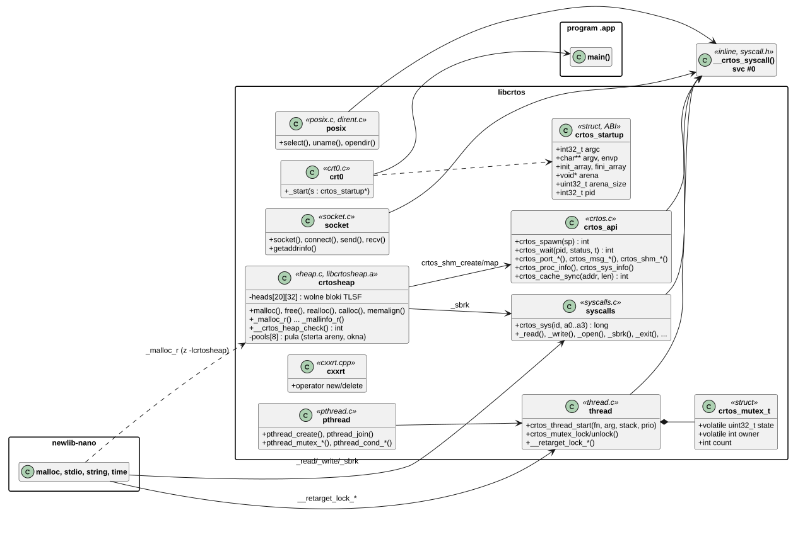
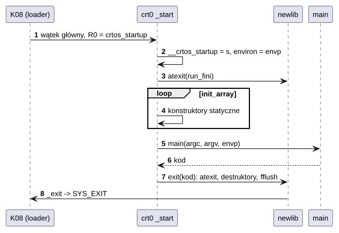
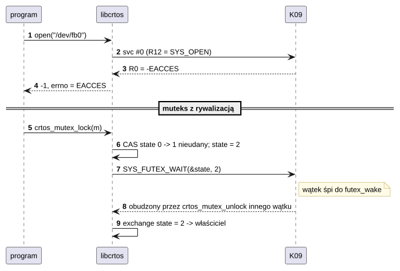
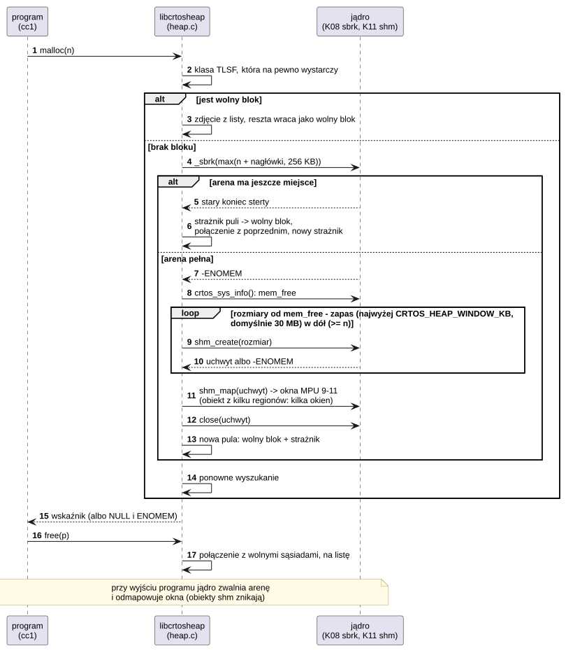

# L01 libcrtos: biblioteka programów

## 1. Identyfikacja

| | |
|---|---|
| Identyfikator | L01 |
| Warstwa | L2/L3 (łączona statycznie z każdym programem `.app`) |
| Pliki | `system/lib/libcrtos/src/*.c`, `system/lib/libcrtos/src/cxxrt.cpp`, nagłówki `system/lib/libcrtos/include/` (`crtos.h`, `pthread.h`, `poll.h`, `sys/socket.h`, `netdb.h`, `arpa/inet.h`, `dirent.h`, ...) oraz `kernel/include/crtos/*.h` (ABI) |
| Budowanie | cele CMake `crtos` (biblioteka, z domyślnym nagłówkiem programu `appinfo.c`) i obiekty startowe `crtos_crt0`, `crtos_memops` (szybkie `memcpy`/`memset`), `crtos_cxxrt` (C++); wszystkie trafiają do katalogu toolchainu (T02) jako `libcrtos.a`, `crtos-crt0.o`, `crtos-memops.o`, `crtos-cxxrt.o`; osobno `crtosheap` (`system/lib/libcrtos/src/heap.c`) → `libcrtosheap.a`, dołączana na życzenie (`-lcrtosheap`) |

## 2. Odpowiedzialność

- **Jedyna droga programu do jądra**: funkcje biblioteki wywołują `svc #0` z numerem
  w R12 i argumentami w R0–R5 (`__crtos_syscall`, `kernel/include/crtos/syscall.h`);
  wynik z zakresu `-4095..-1` staje się `errno` i wynikiem `-1`.
- **Podłączenie newlib-nano**: `_read`, `_write`, `_open`, `_close`, `_lseek`, `_fstat`,
  `_sbrk` (sterta w arenie programu), `_exit`, `_gettimeofday` itd.; funkcje POSIX, których
  newlib nie ma (`chdir`, `getcwd`, `dup`, `sleep`, `select`, `uname`, `opendir`...).
- **Start programu** (`crt0.c`): `_start(struct crtos_startup *)` – blok startowy od jądra
  (argumenty, środowisko, tablice konstruktorów, arena, pid), konstruktory, `main`, `exit`.
- **Interfejs CRTOS** (`crtos.h`): procesy (`crtos_spawn`, `crtos_wait`, `crtos_kill`),
  wątki, futeksy i muteksy, porty IPC i komunikaty, pamięć współdzielona, potoki
  terminalowe, informacje o systemie, moduły, `ioctl`.
- **Wątki POSIX** (`pthread.c`): wątki, muteksy, zmienne warunkowe, klucze; blokady newlib
  (`__retarget_lock_*`) na muteksach futeksowych – `malloc` i `stdio` są bezpieczne
  z wielu wątków.
- **Gniazda BSD** (`socket.c`): `socket`, `connect`, `bind`, `send`, `recv`, `getaddrinfo`
  (resolver jądra, `NET_IOC_RESOLVE`), `inet_pton`/`ntop`.
- **Środowisko C++** (`cxxrt.cpp`): `new`/`delete` na `malloc`, `__cxa_pure_virtual`,
  destruktory statyczne (bez wyjątków i RTTI).
- **POSIX dla przenoszonych narzędzi** (`process.c`, `unix.c`, `fnmatch.c`, `glob.c`,
  `libgen.c`): `posix_spawn(p)` z akcjami plików, `waitpid` z kodowaniem `W*`, `system`,
  `popen`/`pclose`, `realpath`, `sysconf`, `pathconf`/`fpathconf`, `getpagesize`,
  `getrusage`, `getppid`, pliki tymczasowe w `$TMPDIR` (`tmpfile`, `tmpnam`), czas pliku
  „teraz” (`utime`, `utimes`, `utimensat`), `sigaction`, `glob`/`globfree`, `fnmatch`,
  `basename`/`dirname`, `getcwd(NULL, …)`, `statvfs` i `crtos_statfs` (`SYS_STATFS`); funkcje
  trybów, właścicieli i dowiązań (`chmod`, `umask`, `chown`, `readlink`, `lstat`) bez skutku
  (FAT i ramfs ich nie mają). `fnmatch`, `glob` i `basename`/`dirname` są w osobnych
  obiektach, więc program z własną wersją jednej z nich (libiberty w GCC i binutils) linkuje
  się bez konfliktu.
- **Nakładki nagłówków newlib** (katalog nagłówków libcrtos jest przed newlib, a nakładka
  dołącza oryginał przez `#include_next`): `sys/stat.h` (`UTIME_NOW`, deklaracja `lstat`,
  którą newlib ma tylko dla Cygwin i RTEMS), `utime.h`, `fcntl.h` (`O_BINARY` i `O_TEXT`
  równe 0: newlib daje im bity Cygwin, przez co przenośny kod, np. `binary-io.h` z gnulib,
  uznałby CRTOS za system z trybem tekstowym).
- **Programy XIP** (`-mxip`, T02): cała biblioteka jest też budowana jako kod niezależny od
  położenia z danymi przez r9 (`libcrtos.a` itd. w `lib/xip`). `crt0.c` ma słabe `_init`
  i `_fini`, które woła pełna newlib programów XIP (w zwykłym programie robią to `crti.o`
  i `crtn.o`, tu zastępuje je blok startowy jądra).
- **Sterta ponad arenę** (`heap.c`, osobna biblioteka `libcrtosheap.a`, dla programów, które
  jej potrzebują – kompilator na płytce, T02): cała rodzina `malloc` zastąpiona alokatorem
  TLSF z kilkoma pulami. Pierwsza to sterta areny, powiększana `_sbrk` w miarę potrzeby; gdy
  się skończy, program tworzy własne obiekty pamięci współdzielonej (K11) i mapuje je w swoich
  oknach MPU (najwyżej 3, `CRTOS_HEAP_WINDOWS`), każdy możliwie największy: od wolnej pamięci
  systemu bez zapasu (`CRTOS_HEAP_RESERVE`, domyślnie 1 MB) w dół. Jądro robi obiekt większy
  niż region MPU z kilku regionów, więc pierwszy obiekt to zwykle prawie cała wolna pamięć
  w jednym kawałku. Gdy i SDRAM się skończy, ostatnią pulą jest pamięć emulowana (K20, plik
  wymiany na karcie, najwyżej `CRTOS_HEAP_SWAP` MB): wolna, ale kompilacja dużego pliku
  kończy się zamiast `out of memory`.
  Wolne bloki łączą się od razu, a żądanie dostaje blok z najmniejszej klasy, która na pewno
  wystarczy, więc sterta fragmentuje się dużo mniej niż newlib pod GCC.
  Program ustawia własne wartości domyślne, definiując `const int crtos_heap_windows`
  i `crtos_heap_swap` (`crtos.h`; `heap.c` odwołuje się do nich przez `#pragma weak`), a zmienne
  środowiska `CRTOS_HEAP_WINDOWS` i `CRTOS_HEAP_SWAP` nadal je zastępują. Przeglądarka NetSurf
  (A02) ma obie równe 0: jej sterta zostaje w arenie (okna MPU są na powierzchnię okna, która
  po zmianie rozmiaru powstaje od nowa, i na schowek), a TLSF zastępuje listę wolnych bloków
  newlib, w której skrypty spędzały większość czasu.
- **Nagłówek programu**: makro `CRTOS_APP(stos, sterta)` w `crtos.h` i domyślny nagłówek
  (16 KB stosu, 64 KB sterty) w `appinfo.c`, dołączany tylko wtedy, gdy program nie ma
  własnego.

## 3. Wymagania

| ID | Wymaganie | Weryfikacja |
|---|---|---|
| REQ-L01-01 | Każdy błąd wywołania systemowego (`-errno` z jądra) jest zamieniany na wynik `-1` i `errno` (poza funkcjami opisanymi inaczej w `crtos.h`). | przegląd kodu, apptest „errors and permissions” |
| REQ-L01-02 | Program nie ma symboli niezdefiniowanych: wszystko z biblioteki jest wlinkowane (`ld -r`), jądro nie udostępnia programom symboli. | `modcheck.py --apps` przy każdym budowaniu |
| REQ-L01-03 | Blokady newlib działają między wątkami programu (sterta, `stdio`, strefa czasowa). | apptest „threads and mutexes”, „POSIX threads” |
| REQ-L01-04 | Stos wątku ma rozmiar zaokrąglony do 256 B i dodatkowe 256 B na strażnika MPU na dnie (K03). | przegląd kodu, apptest `crash-stack` |
| REQ-L01-05 | Konstruktory statyczne wykonują się przed `main`, destruktory i `atexit` przy `exit`. | przegląd kodu, programy C++ z obiektami globalnymi (tftdemo: `TFTLIB_8BIT tft`) |
| REQ-L01-06 | `posix_spawn` stosuje akcje plików (`adddup2`, `addopen`, `addclose`, `addchdir`) do deskryptorów 0–2 dziecka; zwraca numer błędu (nie `-1`); `posix_spawnp` szuka w `$PATH` także nazwy z `.app`. | apptest „POSIX processes” (plik, potok, `PATH`) |
| REQ-L01-07 | `waitpid`/`wait` zwracają status w kodowaniu POSIX: zwykły koniec `(kod & 0xff) << 8`; koniec przez jądro jako sygnał (błąd pamięci – `SIGSEGV`, Ctrl-C – `SIGINT`, inne – `SIGKILL`); `WNOHANG` zwraca 0 dla działającego dziecka. | apptest „POSIX processes” |
| REQ-L01-08 | Pliki tymczasowe (`tmpfile`, `tmpnam`) powstają w `$TMPDIR` (domyślnie `/ram`); plik `tmpfile` jest usuwany przy wyjściu z programu. | apptest (`tmpfile`, `tmpnam`), przegląd kodu (usuwanie) |
| REQ-L01-09 | Program z `-lcrtosheap` nie zawiera żadnego obiektu `malloc` newlib: `libcrtosheap` definiuje wszystkie wejścia `_*_r` i funkcje zwykłe w grupach obiektów newlib. Bloki są wyrównane do 8 B, `realloc` zachowuje zawartość, a po dowolnym ciągu operacji sterta jest spójna (sąsiednie wolne bloki połączone, listy zgodne z blokami). | `heaptest` (72 216 sprawdzeń, 60 000 losowych operacji z weryfikacją wzorców i `__crtos_heap_check`), `nm` programów etapu B (brak `__malloc_av_`) |
| REQ-L01-10 | Gdy w stercie brak bloku, `libcrtosheap` najpierw powiększa stertę areny (`_sbrk`), potem bierze okno pamięci współdzielonej (najwyżej `CRTOS_HEAP_WINDOWS` ≤ 3); dopiero gdy obie drogi zawiodą, `malloc` zwraca `NULL` z `ENOMEM`. | `heaptest` (8 MB z programu o stercie 1 MB), przegląd kodu |
| REQ-L01-12 | Gdy w pamięci (sterta areny, okna) nie ma bloku, a więcej jej nie da się wziąć, `libcrtosheap` bierze pamięć emulowaną (`crtos_vmem_map`, najwyżej `CRTOS_HEAP_SWAP` MB, 0: wcale) z osobnymi listami wolnych bloków; żądanie korzysta z niej dopiero, gdy w pamięci nie ma bloku. | `heaptest` (bloki 512 KB: od 23,5 MB w pamięci emulowanej, sterta spójna), kompilacja `snes_core.cpp` na płytce |
| REQ-L01-11 | Okno `libcrtosheap` nie jest większe niż wolna pamięć SDRAM systemu (`crtos_sys_info`) pomniejszona o zapas `CRTOS_HEAP_RESERVE` (domyślnie 1 MB). | przegląd kodu, kompilacja NES na płytce (inne programy działają dalej) |
| REQ-L01-13 | Program może zdefiniować własne wartości domyślne `libcrtosheap`: `crtos_heap_windows` (liczba okien MPU, 0–3), `crtos_heap_window_kb` (największe okno w KB) i `crtos_heap_swap` (MB pamięci emulowanej); zmienne środowiska `CRTOS_HEAP_WINDOWS`, `CRTOS_HEAP_WINDOW_KB` i `CRTOS_HEAP_SWAP` mają pierwszeństwo, a program bez tych symboli zachowuje dotychczasowe wartości (3 okna, każde możliwie największe, cała pamięć emulowana). | `heaptest` bez tych symboli (193 351 sprawdzeń, 01.10.2026: okno 22 528 KB), `netsurf` z `crtos_heap_windows = 1`, `crtos_heap_window_kb = 8192`, `crtos_heap_swap = 0` (01.10.2026: blok 10 MB w oknie 8 MB, zmiana rozmiaru okna programu przy zajętym oknie sterty; wcześniej z 0 okien: 41 przeładowań stron w arenie 12 MB) |
| REQ-L01-14 | `free`/`realloc` wskaźnika, który nie jest zajętym blokiem sterty (podwójne zwolnienie, adres spoza sterty, nadpisany nagłówek), kończy program przez `abort()` (kod 134) z komunikatem na `stderr`, który podaje wskaźnik, adres wywołującego (adres powrotu z `free`/`realloc`) i adres areny programu. | `heaptest` („block freed twice”: proces potomny kończy się kodem 134, komunikat z trzema adresami), `appsym.py` przypisuje adres wywołującego do `heaptest.c` (01.10.2026) |

## 4. Interfejs udostępniany

Pełny opis dla programistów: [API programów](../../api.md). Grupy:

| Grupa | Funkcje | Wywołania jądra (K09) |
|---|---|---|
| procesy | `crtos_spawn`, `crtos_spawnv`, `crtos_wait`, `crtos_kill`, `getpid` | `SYS_SPAWN`, `SYS_WAIT`, `SYS_KILL`, `SYS_GETPID` |
| wątki | `crtos_thread_start/join/id/done`, `pthread_*` | `SYS_THREAD_CREATE`, `SYS_THREAD_EXIT`, `SYS_GETTID` |
| synchronizacja | `crtos_futex_wait/wake`, `crtos_mutex_*`, `pthread_mutex_*`, `pthread_cond_*` | `SYS_FUTEX_WAIT`, `SYS_FUTEX_WAKE` |
| czas | `crtos_time_us`, `crtos_wall_us`, `crtos_sleep_ms`, `crtos_yield`, `gettimeofday`, `settimeofday`, `clock_gettime` | `SYS_TIME_US`, `SYS_TIME_GET`, `SYS_TIME_SET`, `SYS_SLEEP_MS`, `SYS_YIELD` |
| pliki | `open`, `read`, `write`, `lseek`, `close`, `stat`, `mkdir`, `unlink`, `rename`, `chdir`, `dup`, `opendir`, `ioctl`, `poll`, `crtos_pipe` | `SYS_OPEN` ... `SYS_FSYNC` (9–23), `SYS_POLL`, `SYS_PIPE` |
| IPC | `crtos_port_create/connect`, `crtos_msg_send/call/call2/recv/reply` | `SYS_PORT_*`, `SYS_MSG_*` |
| pamięć | `malloc` (newlib) → `_sbrk`, `crtos_shm_create/map/unmap`, `crtos_vmem_map/unmap/info` (pamięć emulowana, K20); z `libcrtosheap`: `malloc` ponad arenę i ponad SDRAM, `__crtos_heap_check` | `SYS_SBRK`, `SYS_SHM_*`, `SYS_VMEM` |
| sieć | gniazda BSD, `getaddrinfo` | `SYS_SOCKET` ... `SYS_GETPEERNAME` (50–61, S05) |
| system | `crtos_proc_info`, `crtos_task_info`, `crtos_sys_info`, `crtos_module_load/unload`, `crtos_reboot`, `crtos_sys` | `SYS_PROC_INFO`, `SYS_TASK_INFO`, `SYS_SYS_INFO`, `SYS_MODULE_LOAD/UNLOAD`, `SYS_REBOOT` |
| kod generowany | `crtos_cache_sync` | `SYS_CACHE_SYNC` |
| POSIX (narzędzia) | `posix_spawn(p)`, `waitpid`, `system`, `popen`, `realpath`, `sysconf`, `getrusage`, `tmpfile`, `utime(NULL)`, `sigaction`, `glob`, `fnmatch`, `basename`, `dirname`, `statvfs` | `SYS_SPAWN`, `SYS_WAIT`, `SYS_PIPE`, `SYS_PROC_INFO`, `SYS_SYS_INFO`, `SYS_STATFS`, pliki |

## 5. Interfejsy wymagane

K09 (ABI wywołań systemowych, `kernel/include/crtos/syscall.h`), K08 (blok startowy),
newlib-nano i libgcc (Arm GNU Toolchain 14.3.Rel1).

## 6. Struktura statyczna

*Źródło: [L01/struktura-statyczna.puml](../diagramy/L01/struktura-statyczna.puml)*

## 7. Zachowanie dynamiczne

### 7.1 Start programu

*Źródło: [L01/start-programu.puml](../diagramy/L01/start-programu.puml)*

### 7.2 Wywołanie z błędem i blokada muteksu

*Źródło: [L01/wywolanie-i-mutex.puml](../diagramy/L01/wywolanie-i-mutex.puml)*

### 7.3 libcrtosheap: sterta ponad arenę

*Źródło: [L01/sterta-ponad-arene.puml](../diagramy/L01/sterta-ponad-arene.puml)*

## 8. Implementacja

- Wywołania bez przełączania procesu obsługuje szybka ścieżka jądra (K09); biblioteka nie
  buforuje wyników (poza `stdio` newlib).
- Muteks: stany 0 (wolny), 1 (zajęty), 2 (zajęty, ktoś może czekać); rekurencyjny dla
  właściciela; futeks tylko przy rywalizacji.
- Wątek: blok sterujący i stos z `memalign(256)` na stercie programu; koniec wątku
  sygnalizuje jądro (pole `done` + `futex_wake`), `join` zwalnia stos.
- `pthread_exit` wraca do funkcji startowej przez `longjmp`; zakończone wątki odłączone są
  sprzątane przy następnym `pthread_create`/`pthread_detach`.
- Program jest linkowany `ld -r` według `crtos.specs` (T02): obiekty startowe
  `crtos-crt0.o`, `crtos-memops.o`, `crtos-cxxrt.o` (zawsze, więc `operator new` z libcrtos
  wygrywa z libstdc++), potem `libcrtos`, `libc_nano`, `libm`, `libgcc`. Sekcja
  `.crtos_app` opisuje stos (domyślnie 16 KB) i stertę (64 KB) dla loadera (K16).
- Programy kompilują się z nagłówkami newlib-nano (`nano.specs`), zgodnymi z `libc_nano`;
  np. `ferror` i `clearerr` są funkcjami, a nie makrami.
- `libcrtosheap` (`heap.c`):
  - TLSF jak w jądrze (K07): nagłówek bloku 8 B (poprzedni blok fizyczny, rozmiar z bitem
    „wolny”), 32 klasy na potęgę dwójki (ok. 3% zapasu), mapy bitowe klas, więc `malloc`
    i `free` są O(1); wszystkie struktury sterujące w `.bss` (ok. 2,7 KB).
  - Dwa zestawy list wolnych bloków: szybki (sterta areny i okna, najwyżej 8 pul razem
    z emulowaną) i wolny (pamięć emulowana); zestaw bloku wynika z jego adresu
    (`CRTOS_IN_VMEM`). Żądanie szuka najpierw w szybkim, więc pamięć emulowana dostaje tylko
    to, co się w SDRAM nie mieści. Pula kończy się blokiem-strażnikiem o rozmiarze 0, więc
    bloki łączą się tylko w obrębie puli.
  - Pula sterty areny rośnie w miejscu: `_sbrk` o co najmniej 256 KB, stary strażnik staje
    się wolnym blokiem połączonym z poprzednim. `realloc` ostatniego bloku tej puli (wektory
    GCC rosnące o kolejne kawałki) też rośnie w miejscu.
  - Okno: `crtos_shm_create` z drabiną rozmiarów od `min(największe okno, mem_free − zapas)`
    w dół (największe okno: `CRTOS_HEAP_WINDOW_KB`, domyślnie 30 MB),
    krokami 1/64 potęgi dwójki (najdrobniejszy krok, w którym jądro przydziela obiekt z kilku
    regionów bez zaokrąglania), `crtos_shm_map`, zamknięcie uchwytu (odwzorowanie trzyma
    obiekt). `ENOSPC` przy mapowaniu (kawałki obiektu potrzebują więcej wolnych okien, niż ma
    proces) – próba o połowę mniejszego; inny błąd mapowania wyłącza dalsze próby.
  - Pamięć emulowana: gdy ani `_sbrk`, ani nowe okno nie dają pamięci, sterta raz bierze
    region `crtos_vmem_map` wielkości wolnej części pliku wymiany (najwyżej `CRTOS_HEAP_SWAP`
    MB; przy braku miejsca o połowę mniejszy) i odtąd nie próbuje już brać SDRAM (`ram_full`),
    żeby nie wołać jądra przy każdym żądaniu. Okno zostawia wtedy w zapasie także pamięć, którą
    zajmie pamięć podręczna stron jądra (`crtos_vmeminfo.cache`), bo jądro bierze ją dopiero
    przy pierwszym `crtos_vmem_map`.
  - Gdy klasa „na pewno wystarczającego” bloku jest pusta, przeszukiwana jest lista klasy
    samego żądania (żądanie bliskie największemu wolnemu blokowi).
  - Zwykłe funkcje (`malloc`/`free`, `calloc`, `realloc`, `memalign`, `valloc`/`pvalloc`,
    `malloc_usable_size`, `malloc_trim`, `cfree`) zdefiniowane w grupach, w jakich definiują
    je obiekty newlib, więc żaden z nich nie jest dołączany z libc (`mallinfo`,
    `malloc_stats` i `mallopt` zostają z newlib i wołają wejścia `_r` stąd). Program, w którym
    `malloc` wołają dopiero biblioteki (GCC: libiberty), linkuje z `-Wl,-u,malloc
    -lcrtosheap`.
  - Blokada: `__malloc_lock`/`__malloc_unlock` newlib (muteks rekurencyjny, `thread.c`).
  - Kontrola `free`/`realloc`: wyrównanie wskaźnika, bit „wolny” bloku i zgodność wskaźnika
    „poprzedni fizyczny” następnego bloku; błąd (`corrupt`) wypisuje wskaźnik, adres powrotu
    (`__builtin_return_address(0)` w `_free_r`/`_realloc_r`, które `free` i `realloc` wołają
    skokiem albo mają wstawione) i arenę z bloku startowego (`__crtos_startup->arena`), bo
    `abort()` kończy program przez `kill` bez raportu błędu z rejestrami.

## 9. Obsługa błędów i mechanizmy bezpieczeństwa

| Sytuacja | Reakcja |
|---|---|
| wynik jądra `-errno` | `-1` i `errno` |
| brak pamięci (`_sbrk`) | `ENOMEM`, `malloc` zwraca `NULL` |
| `libcrtosheap`: `free`/`realloc` wskaźnika, który nie jest zajętym blokiem (podwójne zwolnienie, nadpisany nagłówek) | komunikat `heap: bad pointer P freed or reallocated, called from C (arena A)` i `abort()` (kod 134); `C` i `A` wskazują miejsce przez `tools/appsym.py` (REQ-L01-14) |
| `libcrtosheap`: brak pamięci także w oknach i w pamięci emulowanej | `ENOMEM`; z `CRTOS_HEAP_STATS` komunikat z rozmiarem żądania i stanem sterty |
| funkcja nieobsługiwana (np. `fork`, `link`) | `ENOSYS` / `EMLINK` |
| błędny wskaźnik przekazany do jądra | `EFAULT` z jądra (K09 sprawdza zakresy) – program nie może uszkodzić jądra przez bibliotekę |

Biblioteka działa w trybie nieuprzywilejowanym w arenie programu – jej błąd dotyczy tylko
tego programu (K03, K04).

## 10. Konfiguracja

`CRTOS_USER=1` (kompilacja programów), rozmiary stosu i sterty (`crtos_app(... STACK HEAP)`),
flagi `-mcpu=cortex-m7 -mfpu=fpv5-d16 -mfloat-abi=hard`, bez wyjątków i RTTI w C++.
`libcrtosheap` czyta ze środowiska `CRTOS_HEAP_WINDOWS` (0–3 okna, domyślnie 3),
`CRTOS_HEAP_WINDOW_KB` (największe okno w KB, domyślnie 30 MB, czyli bez ograniczenia),
`CRTOS_HEAP_RESERVE` (KB wolnej pamięci zostawiane systemowi przy tworzeniu okna, domyślnie
1024), `CRTOS_HEAP_SWAP` (MB pamięci emulowanej, domyślnie cały wolny plik wymiany, 0: wcale)
i `CRTOS_HEAP_STATS` (raport sterty z listą pul i liczbą dostępów emulowanych na `stderr`
przy wyjściu i przy braku pamięci). Trzy pierwsze program może ustawić sobie sam jako
wartości domyślne (`crtos_heap_windows`, `crtos_heap_window_kb`, `crtos_heap_swap`,
REQ-L01-13).

## 11. Weryfikacja

- `crtos run apptest` (1720 sprawdzeń całego interfejsu), `crtos run bench` (koszt
  wywołań), `modcheck.py --apps` przy budowaniu.
- `crtos run /flash0/bin/heaptest.app` (`libcrtosheap`, program XIP jak kompilator; 30.09.2026:
  72 216 sprawdzeń bez błędów, 8 MB bloków przy stercie areny 1 MB, jedno okno 23,5 MB; po
  dodaniu pamięci emulowanej 193 348 sprawdzeń, bloki 512 KB od 23,5 MB w pamięci emulowanej,
  sterta spójna; 01.10.2026: 193 351 sprawdzeń z podwójnym zwolnieniem w procesie potomnym).
- Kompilator na płytce (T02) z `libcrtosheap`: `nes_fast.c` z `-O3` (szczyt 17,8 MB w jednym
  oknie 21,5 MB), cały NES zbudowany; wcześniej z `malloc` newlib w stercie 17 MB brakowało
  bloku 1,2 MB przy 16,7 MB zajętych (fragmentacja).

## 12. Ograniczenia i znane problemy

- Brak `fork`/`exec` (tylko `crtos_spawn` i `posix_spawn`), sygnałów między procesami
  (`sigaction` i `signal` działają tylko w obrębie procesu) i dynamicznego łączenia.
- `posix_spawn` przekazuje dziecku tylko deskryptory 0–2; akcje na innych są pomijane.
- Czasu pliku nie da się ustawić na dowolną wartość (tylko „teraz”); `getrusage` nie zna
  czasów dzieci.
- Plik z `tmpfile` zostaje w `$TMPDIR`, gdy program zakończy jądro (błąd pamięci,
  `kill`), bo nie wykonuje się wtedy `atexit`.
- Muteksy `crtos_mutex_t` nie dziedziczą priorytetu (w przeciwieństwie do muteksów jądra,
  K06).
- `libcrtosheap` używa okien MPU, w które `libgfx` mapuje powierzchnie okien: program z oknami
  musi ograniczyć jej okna (`CRTOS_HEAP_WINDOWS`). Pamięci nie oddaje przed końcem programu,
  a okno bierze możliwie największe (poza zapasem; mniejsze tylko z `CRTOS_HEAP_WINDOW_KB`) –
  na czas działania programu inne programy dostaną najwyżej zapas, np. nowe okno pulpitu może
  się nie otworzyć.
- Kontrola przy `free` wykrywa podwójne zwolnienie i nadpisany nagłówek następnego bloku, ale
  nie zapis poza blok, który nagłówka nie zmienił, ani użycie bloku po zwolnieniu.
- Blok w pamięci emulowanej jest dziesiątki razy wolniejszy (ok. 1 µs na dostęp, K20).
  Sterta nie przenosi bloków między pulami: dane, które trafiły do pamięci emulowanej, zostają
  tam, także gdy później zwolni się SDRAM. `libcrtosheap` nie wie, do czego służy blok: stos
  wątku (`crtos_thread_start`, `pthread_create`) przydzielony w pamięci emulowanej jądro
  odrzuca (`EFAULT`), a danych IPC, `poll` i futeksów tam nie obsługuje (K20). Program, który
  po zapełnieniu SDRAM tworzy wątki albo używa takich danych, ustawia `CRTOS_HEAP_SWAP=0`.
