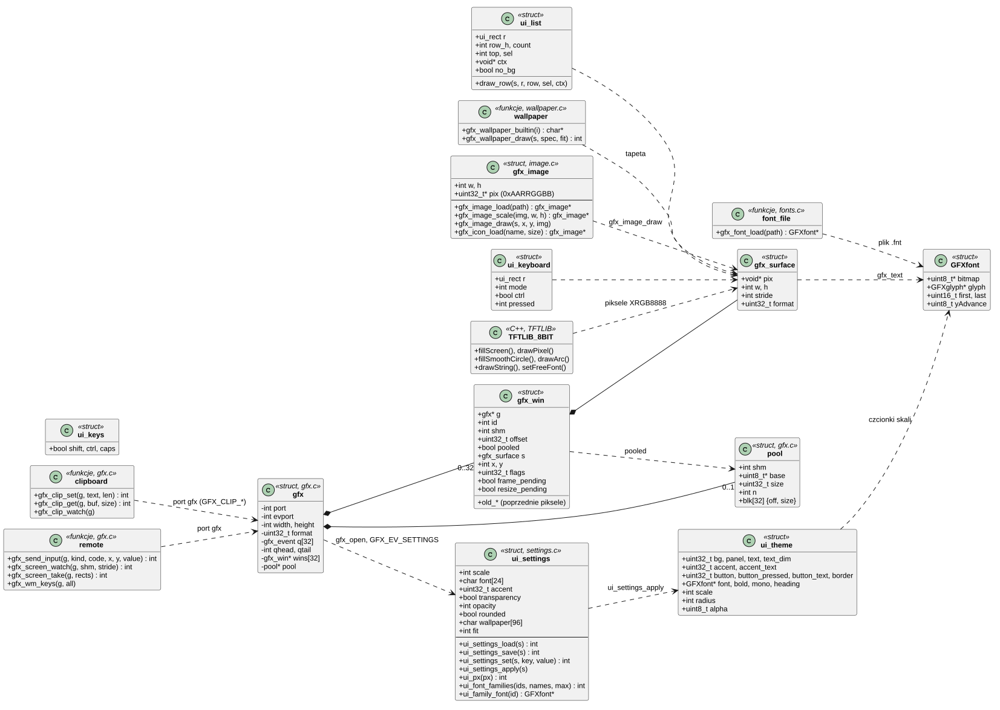
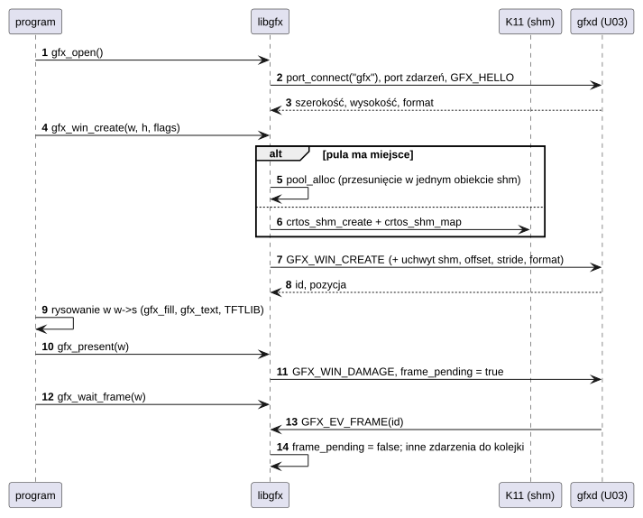
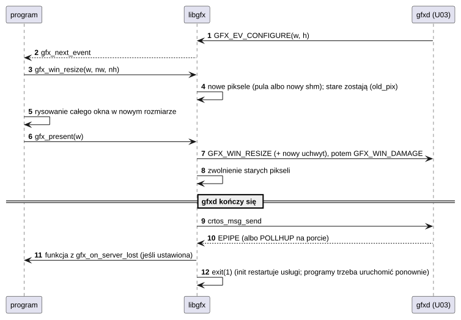
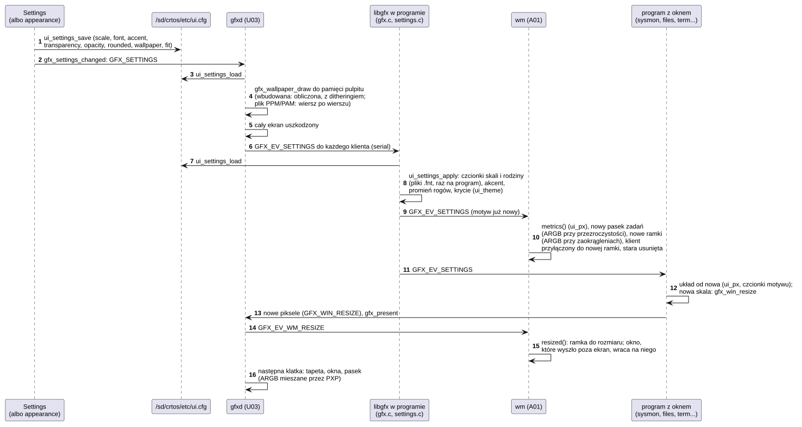

# L02 libgfx i TFTLIB

## 1. Identyfikacja

| | |
|---|---|
| Identyfikator | L02 |
| Warstwa | L2/L3 (biblioteki statyczne programów: `crtos_app(... LIBS gfx)`, `LIBS tftlib`) |
| Pliki | `system/lib/libgfx/src/{gfx,draw,image,fonts,ui,keys,settings,wallpaper}.c`, `gfx_internal.h`, nagłówki `system/lib/libgfx/include/{gfx,gfx_ui,gfx_proto,osk_proto}.h`; `system/lib/tftlib/` (TFTLIB_8BIT, Print, WString, czcionki GFXFF, `tftlib_glue.c`) |

## 2. Odpowiedzialność

- **Klient serwera grafiki** (`gfx.c`): połączenie z portem `gfx` (U03), port zdarzeń,
  okna z pikselami w pamięci współdzielonej, zgłaszanie zmian, zdarzenia (kolejka),
  czekanie na klatkę, zmiana rozmiaru bez pokazania niepełnego obrazu, funkcje menedżera
  okien (także przejmowanie klawiszy na czas menu), pula pamięci na piksele wielu okien;
  schowek systemu (tekst kawałkami przez komunikaty); sterowanie zdalne (wejście jak z
  urządzenia, kopia ekranu dla zdalnego pulpitu).
- **Rysowanie programowe** (`draw.c`): prostokąty, linie, okręgi, zaokrąglone prostokąty
  (także z wygładzonymi rogami i wybranymi rogami: `gfx_round_rect_aa`), mieszanie piksela,
  tekst czcionkami Adafruit GFX na powierzchniach RGB565, ARGB8888 i XRGB8888, z
  przycinaniem do powierzchni.
- **Obrazy i ikony** (`image.c`): pliki netpbm (PAM z kanałem alfa, PPM), zmniejszanie
  średnią z obszaru, rysowanie z przezroczystością na każdej powierzchni; ikony programów
  z `/sd/crtos/share/icons` (`gfx_icon_load`).
- **Czcionki** (`fonts.c`): wbudowane FreeSans, FreeMono, TomThumb i DejaVu 10/11 px
  (dopasowane do siatki pikseli, `tools/fontconv.py`); pliki `.fnt` wczytywane w czasie
  działania (`gfx_font_load`: rodziny interfejsu w rozmiarach skal, `tools/fonts.py`).
- **Wygląd** (`settings.c`): ustawienia z `/sd/crtos/etc/ui.cfg` (skala interfejsu
  100–200%, rodzina czcionek, kolor akcentu, przezroczystość i krycie, zaokrąglenia,
  tapeta) i motyw `ui_theme`, który za nimi idzie: czcionki skali i rodziny, akcent, promień
  rogów, krycie. Wczytuje je `gfx_open` i znowu zdarzenie `GFX_EV_SETTINGS`, zanim program je
  dostanie; `ui_px` przelicza wymiary ze 100% na skalę.
- **Tapety** (`wallpaper.c`): wbudowane obrazy liczone dla dowolnego rozmiaru (gradienty
  z poświatami, dithering do RGB565), kolor, plik PPM/PAM skalowany w 5 trybach; rysuje je
  `gfxd` (pulpit) i Settings (miniatury).
- **Widżety** (`ui.c`): motyw, przyciski, przyciski wyboru, panele, przełączniki, suwaki
  (rogi i kolory z motywu), przewijana lista (palcem i kółkiem myszy; mysz bez przycisku
  zaznacza wiersz pod kursorem), klawiatura ekranowa.
- **Klawisze** (`keys.c`): zdarzenia klawiszy → znaki (układ US, Shift, Caps Lock, Ctrl)
  i odwrotnie (dla klawiatur ekranowych).
- **TFTLIB**: biblioteka rysowania starego firmware (C++, styl Adafruit/TFT_eSPI:
  wygładzane okręgi i łuki, gradienty, czcionki FreeFont) na powierzchni XRGB8888 okna
  (`GFX_WIN_XRGB`); `tftlib_glue.c` daje jej opóźnienia i zegar CRTOS.

## 3. Wymagania

| ID | Wymaganie | Weryfikacja |
|---|---|---|
| REQ-L02-01 | Funkcje rysowania nigdy nie piszą poza powierzchnią (przycinanie każdej operacji). | przegląd kodu; błąd kończyłby tylko program (arena, K03) |
| REQ-L02-02 | Po końcu `gfxd` (rozłączony port, `EPIPE`/`POLLHUP`) program kończy się z kodem 1 (po własnej funkcji z `gfx_on_server_lost`). | restart `gfxd` (ręcznie) |
| REQ-L02-03 | `gfx_win_resize` nie pokazuje niepełnego obrazu: `gfxd` przełącza na nowe piksele dopiero z następnym `gfx_damage`/`gfx_present`. | test ręczny (zmiana rozmiaru) |
| REQ-L02-04 | Zdarzenia inne niż `GFX_EV_FRAME` odebrane podczas `gfx_wait_frame` nie giną (kolejka 32). | przegląd kodu |
| REQ-L02-05 | Wymiary okna 1..4096, wiersz wyrównany do 4 B; błędne parametry → `NULL`, `errno = EINVAL`. | przegląd kodu |
| REQ-L02-06 | `ui_key_char` zamienia klawisze Home, End, PgUp, PgDn, Delete i Insert na `UI_KEY_HOME` … `UI_KEY_DELETE` i `UI_KEY_INSERT`, a `ui_char_key` z powrotem. | przegląd kodu, `edit` w `term` (klawiatura USB), Insert w wierszu poleceń (`gfxtap key 110`, zrzut z kursorem blokowym) |
| REQ-L02-07 | `gfx_clip_set` zmienia schowek tylko w całości (kawałki po 480 B, każdy potwierdzony; tekst ponad `GFX_CLIP_MAX` → `EFBIG`); `gfx_clip_get` zwraca długość całego tekstu, kopiuje najwyżej `size − 1` bajtów z zerem na końcu i zaczyna od nowa (do 4 razy), gdy w trakcie odczytu pojawił się nowy tekst. | `term` Ctrl+C/Ctrl+V, `cliptest` (program testowy spoza drzewa) z klientem VNC: tekst w obie strony (30.09.2026) |
| REQ-L02-08 | `gfx_image_load` przyjmuje tylko poprawny PAM (P7) albo PPM (P6) z 8 bitami na kanał (`MAXVAL 255`, 1–4 kanały) i najwyżej 1 048 576 pikselami. Plik obcięty, o innym nagłówku albo za duży daje `NULL` (`errno` `EINVAL`, brak pliku: `ENOENT`) i nie zostawia przydzielonej pamięci. `gfx_icon_load` przyjmuje tylko nazwę bez `/`, niezaczynającą się od kropki, najwyżej 32 znaki. | ten sam kod na komputerze (MinGW): plik obcięty, 99999 × 2, śmieci, brak pliku – `NULL`; PPM i PAM wczytane; piksele PAM równe PNG źródła (30.09.2026) |
| REQ-L02-09 | `gfx_image_scale` daje piksel będący średnią obszaru źródła, który pokrywa (z ułamkami pikseli na brzegach), z kolorami ważonymi przez alfa. `gfx_image_draw` łączy piksele z tłem według alfa (ARGB8888: także alfa wyniku) i przycina do powierzchni. | na komputerze: skala 64 → 16/18/20 różni się od dokładnej średniej o ≤ 0,61 (wartości przemnożone przez alfa); rysowanie na RGB565 zgodne z Pillow co do dokładności RGB565; rysowanie częściowo poza powierzchnią (30.09.2026) |
| REQ-L02-10 | Ustawienia wyglądu: brak pliku albo klucza daje wartości domyślne, nieznane klucze są pomijane, wartości spoza zakresu są przycinane (skala do najbliższej z 100/125/150/175/200, krycie do 30–100). `gfx_open` stosuje ustawienia przed pierwszym oknem programu, a po `GFX_EV_SETTINGS` – zanim program dostanie to zdarzenie. | `appearance` na płytce: 100% Noto bez rogów i przezroczystości, 200% Liberation 60%, powrót 150% – pasek zadań, ramki, Settings, sysmon, files, term zmienione bez restartu (03.10.2026) |
| REQ-L02-11 | `gfx_font_load` przyjmuje tylko plik `CRF1` o zgodnej liczbie glifów, z bitmapami do 64 KB i każdym glifem w ich granicach; inaczej `NULL` (`EINVAL`) bez przydzielonej pamięci. Motyw bierze czcionkę rodziny w rozmiarze skali, a gdy jej brak – DejaVu w tym rozmiarze, potem wbudowaną DejaVu 11 px; wczytana czcionka zostaje do końca programu (okno narysowane nią przed zmianą nie traci jej). | przegląd kodu; cztery rodziny × pięć skal na płytce (zrzuty, 03.10.2026) |
| REQ-L02-12 | `gfx_wallpaper_draw` rysuje każdą wbudowaną tapetę w dowolnym rozmiarze, kolor (`color:RRGGBB`) i plik PPM/PAM w trybach fill, fit, stretch, center i tile; plik jest czytany wiersz po wierszu (pamięć: wiersz źródła, najwyżej 4096 pikseli, i sumy wiersza wyniku), kafelki najwyżej 65 536 pikseli; plik, którego nie da się odczytać, daje pierwszą wbudowaną tapetę i `-1` (`errno`). | ten sam kod na komputerze (MinGW): 6 tapet RGB565 bez pasm, obraz 1024×640 w trybach fill/fit/center (proporcje zachowane); na płytce tapeta 800×500 z pliku w 101 ms (03.10.2026) |
| REQ-L02-13 | `gfx_round_rect_aa` wygładza rogi (pokrycie piksela z odległości od łuku) i zaokrągla tylko wybrane rogi; na ARGB8888 miesza także alfa, więc rogi na przezroczystym tle są miękkie. `ui_px` zaokrągla do najbliższej liczby, a dodatniej nie zmniejsza do 0. | zrzuty ekranu: przyciski, menu, paski tytułu, przełączniki (03.10.2026); przegląd kodu |

## 4. Interfejs udostępniany

Pełny opis dla programistów: [API programów – Grafika](../../api.md#grafika-gfxh)
i [TFTLIB](../../api.md#tftlib).

| Grupa | Funkcje |
|---|---|
| połączenie | `gfx_open`, `gfx_close`, `gfx_on_server_lost`, `gfx_screen_width/height`, `gfx_event_handle`, `gfx_pool_reserve` |
| okna | `gfx_win_create`, `gfx_win_destroy`, `gfx_win_by_id`, `gfx_win_set_title`, `gfx_win_resize`, `gfx_win_move`, `gfx_win_raise`, `gfx_win_show` |
| klatki | `gfx_damage`, `gfx_present`, `gfx_wait_frame`, `gfx_next_event`, `gfx_stats` |
| menedżer okien | `gfx_wm_register`, `gfx_wm_attach`, `gfx_wm_close`, `gfx_wm_focus`, `gfx_wm_configure`, `gfx_wm_keys` |
| schowek | `gfx_clip_set`, `gfx_clip_get`, `gfx_clip_watch` (`GFX_EV_CLIP`) |
| sterowanie zdalne | `gfx_send_input`, `gfx_screen_watch` (`CAP_SYS`), `gfx_screen_take` |
| rysowanie | `gfx_fill`, `gfx_pixel`, `gfx_hline`, `gfx_vline`, `gfx_rect`, `gfx_line`, `gfx_circle`, `gfx_fill_circle`, `gfx_round_rect`, `gfx_round_rect_aa` (`GFX_CORNER_*`), `gfx_blend_pixel`, `gfx_text`, `gfx_text_width`, `gfx_font_ascent`, `gfx_font_load` |
| wygląd | `struct ui_settings`, `ui_settings` (bieżące), `ui_settings_default/load/save/set/apply`, `ui_px`, `ui_scales`, `ui_font_families`, `ui_family_font`, `gfx_settings_changed` (→ `GFX_SETTINGS`), zdarzenie `GFX_EV_SETTINGS`; `UI_CFG`, `UI_FONT_DIR` |
| tapety | `gfx_wallpaper_builtin`, `gfx_wallpaper_draw` (`GFX_FIT_*`), `GFX_WALLPAPER_DIR` |
| obrazy i ikony | `struct gfx_image` (w × h pikseli 0xAARRGGBB), `gfx_image_load`, `gfx_image_scale`, `gfx_image_draw`, `gfx_icon_load` (`GFX_ICON_DIR`, `GFX_ICON_DEFAULT`) |
| widżety | `ui_button`, `ui_choice`, `ui_panel`, `ui_switch` (`ui_switch_width`), `ui_slider` (`ui_slider_value`), `ui_text_center`, `ui_text_fit`, `ui_list_*` (także `ui_list_wheel`, `no_bg`; `ui_list_pointer` z `GFX_PTR_HOVER` zaznacza wiersz), `ui_keyboard_*`, `ui_inside`, motyw `ui_theme` (`heading`, `scale`, `radius`, `alpha`) |
| klawisze | `ui_key_char`, `ui_char_key` |
| TFTLIB | klasa `TFTLIB_8BIT` (rysowanie, tekst, `Print`), `WString` |

Protokół z serwerem: `gfx_proto.h` (U03), klawiatura ekranowa: `osk_proto.h` (U04).

## 5. Interfejsy wymagane

L01 (`crtos_port_*`, `crtos_msg_*`, `crtos_shm_*`, `poll`, `malloc`), U03 (port `gfx`),
S03 (formaty `GPU2D_FMT_*` z `crtos/gpu2d.h`), `crtos/keys.h` (kody klawiszy Linuksa).

## 6. Struktura statyczna

*Źródło: [L02/struktura-statyczna.puml](../diagramy/L02/struktura-statyczna.puml)*

## 7. Zachowanie dynamiczne

### 7.1 Okno i klatka

*Źródło: [L02/okno-i-klatka.puml](../diagramy/L02/okno-i-klatka.puml)*

### 7.2 Zmiana rozmiaru i utrata serwera

*Źródło: [L02/zmiana-rozmiaru-i-utrata-serwera.puml](../diagramy/L02/zmiana-rozmiaru-i-utrata-serwera.puml)*

### 7.3 Zmiana wyglądu

*Źródło: [L02/zmiana-wygladu.puml](../diagramy/L02/zmiana-wygladu.puml)*

## 8. Implementacja

- Pula (`gfx_pool_reserve`): proces może mieć zmapowane najwyżej 3 obiekty pamięci
  współdzielonej (okna MPU 9–11, K03/K11), więc program z wieloma oknami (np. `wm`)
  wycina ich piksele z jednego obiektu (wyrównanie 64 B); co się nie zmieści, dostaje
  własny obiekt.
- Odbiór zdarzeń w kawałkach po 1 s z szybkim sprawdzeniem, czy port serwera nie jest
  rozłączony.
- `gfx_damage` przycina prostokąt do okna i wysyła go bez czekania (limit 1 s na miejsce
  w kolejce portu).
- Schowek: `gfx_clip_set` wysyła kolejne kawałki `GFX_CLIP_PUT` jako wywołania (limit 3 s
  każde); `gfx_clip_get` pyta o kolejne `offset` i porównuje `serial` i `total` każdego
  kawałka z pierwszym.
- `ui_list_wheel` przesuwa `top` o 3 wiersze na ząbek w granicach listy.
- Obrazy (`image.c`): jeden blok pamięci na nagłówek i piksele. `gfx_image_load` czyta
  nagłówek z pierwszych 512 B, a piksele wprost do końca bloku obrazu. Zamiana na 0xAARRGGBB
  idzie od początku, a każdy wynik trafia tam, gdzie bajty przed nim są już przeczytane
  (bez drugiego bufora). Skalowanie liczy dla każdego piksela wyniku sumę ważoną
  pokryciem pikseli źródła (liczby zmiennoprzecinkowe, FPU). Rysowanie na RGB565 rozwija
  tło do 8 bitów, miesza je i zaokrągla z powrotem.
- Ikony: `gfx_icon_load(nazwa, rozmiar)` czyta `GFX_ICON_DIR/nazwa.pam` (tworzy je
  `tools/icon.py` przy budowaniu, T01) i zmniejsza do rozmiaru; pamięć zwalnia `free()`.
- Rysowanie: prostokąt przycięty do powierzchni, potem wypełnianie wiersz po wierszu;
  tekst glif po glifie z przycinaniem; bez akceleratora (akcelerator 2D używa tylko
  `gfxd`).
- TFTLIB: kod starego firmware bez zmian w rysowaniu; zamiast wyświetlacza pisze do
  bufora o szerokości wiersza równej szerokości obrazu (okno XRGB8888).
- **Wygląd** (`settings.c`): plik `klucz = wartość` (`ui_settings_set` dla każdego wiersza).
  Rozmiary czcionek skal: tekst 11/14/16/19/22 px, nagłówki (pogrubione) 15/19/22/26/30,
  `mono` 10/12/15/17/20 – takie same jak w `tools/fonts.py`. Plik czcionki:
  `UI_FONT_DIR/<rodzina>-{regular,bold}-<px>.fnt`, `mono-<px>.fnt`; DejaVu 100% jest
  wbudowana. Pamięć podręczna 24 czcionek na program (przy 200% ok. 20 KB sterty);
  `ui_settings_apply` kopiuje `ui_theme_dark` i podmienia czcionki, akcent
  (`accent`, `button_pressed`), `radius` (`ui_px(6)` albo 0), `alpha` (krycie × 255 / 100
  albo 255) i `scale`.
- **Czcionka z pliku** (`gfx_font_load`): jeden blok – `GFXfont`, glify, bitmapy; rekordy
  glifów (8 B) czytane za bitmapy i przepisywane do `GFXglyph`, każdy sprawdzany.
- **Tapety** (`wallpaper.c`): wbudowane – kolor liczony dla środka każdego piksela (u od 0
  do proporcji ekranu, v od 0 do 1): gradient i poświaty `(1 − q)²` w elipsach, sinus
  z przybliżenia paraboli (bez `libm` na piksel); RGB565 przez dithering Bayera 4×4 (próg
  dodany przed obcięciem bitów). Plik: nagłówek z pierwszego 1 KB (parser `image.c`),
  potem czytnik z buforem 1 KB; dla każdego wiersza wyniku suma kolumn źródła (granice kolumn
  policzone raz), średnia, zapis; przy powiększaniu najbliższy wiersz i kolumna.
- **Rogi wygładzone** (`gfx_round_rect_aa`): część bez rogów wypełniana, potem dla każdego
  piksela kwadratu rogu pokrycie `r − d + 0,5` (d – odległość środka piksela od środka
  łuku; obrys: różnica dwóch takich pokryć) i `gfx_blend_pixel`.

## 9. Obsługa błędów i mechanizmy bezpieczeństwa

| Sytuacja | Reakcja |
|---|---|
| `gfxd` nie odpowiada przy `gfx_open` (5 s na połączenie, 3 s na `HELLO`) | `NULL`, `errno` (`EPROTO`) |
| brak pamięci / miejsca na okno (32 na program) | `NULL`, `errno` |
| odmowa `gfxd` przy tworzeniu okna | pamięć zwolniona, `NULL`, `EPROTO` |
| odmowa `GFX_WIN_RESIZE` | powrót do starych pikseli i rozmiaru (okno bez zmian) |
| rozłączony serwer | koniec programu (kod 1) |
| pełna kolejka zdarzeń podczas `gfx_wait_frame` | nadmiarowe zdarzenia są pomijane |
| schowek: odmowa kawałka / za długi tekst | `-1`, `errno` (np. `EINVAL`, `EFBIG`); schowek bez zmian |
| schowek zmienia się ciągle w trakcie odczytu | `-1`, `EAGAIN` po 4 próbach |
| obraz: brak pliku, zły nagłówek, obcięte piksele, ponad 1 M pikseli, zła nazwa ikony | `NULL`, `errno` (`ENOENT`, `EINVAL`); pamięć zwolniona |
| obraz: brak pamięci | `NULL`, `ENOMEM` |
| brak `ui.cfg`, nieznany klucz, wartość spoza zakresu | wartości domyślne, klucz pominięty, wartość przycięta |
| brak pliku czcionki / zły plik / brak pamięci | DejaVu tego rozmiaru, potem wbudowana DejaVu 11 px (układ w skali, tekst mniejszy) |
| tapeta: brak pliku, zły nagłówek, szerokość ponad 4096, obcięty plik | pierwsza wbudowana tapeta, `-1`, `errno` |

## 10. Konfiguracja

`QMAX` (32 zdarzenia), `WMAX` (32 okna), `PALIGN` (64 B) w `gfx.c`; kolory motywu
`ui_theme_dark`; `UI_CFG` (`/sd/crtos/etc/ui.cfg`), `UI_FONT_DIR`
(`/sd/crtos/share/fonts`), tablice rozmiarów czcionek i `FONTS_KEPT` (24) w `settings.c`;
`GFX_WALLPAPER_DIR` (`/sd/crtos/share/wallpapers`), `SOURCE_MAX_W` (4096),
`TILE_MAX_PIXELS` (65 536) w `wallpaper.c`. Wartości domyślne wyglądu: 100%, DejaVu Sans,
akcent 3478DC, przezroczystość włączona (80%), zaokrąglenia włączone, tapeta Aurora (fill).

## 11. Weryfikacja

- Wszystkie programy z oknem (A01, A02), `gfxinfo -w/-b`, `crtos bench` (`fps`),
  `crtos shot`.
- Schowek i kółko (30.09.2026): `term` (kopiowanie, wklejanie, przewijanie), listy `sysmon`
  i menu `wm`, `vncd` (kopia ekranu, schowek w obie strony).
- Obrazy (30.09.2026): `image.c` skompilowany na komputerze (MinGW) z testem porównującym
  z Pillow i z dokładną średnią (REQ-L02-08, REQ-L02-09); na płytce ikony `wm` w menu, na
  pasku zadań i w paskach tytułu (zrzuty).
- Wygląd (03.10.2026): `wallpaper.c`, `draw.c`, `image.c` i `fonts.c` na komputerze (MinGW,
  `-Wall -Wextra` bez ostrzeżeń): sześć tapet wbudowanych, plik w trzech trybach; `tools/fontconv.py`
  daje bajt w bajt ten sam DejaVu 11 px co nagłówek w drzewie. Na płytce przez `appearance`
  i Settings: skale 100–200%, cztery rodziny, akcent, przezroczystość, zaokrąglenia, tapety
  wbudowane i z pliku – zrzuty `crtos desktop --shot`.

## 12. Ograniczenia i znane problemy

- Tekst bez antyaliasingu (czcionki 1-bitowe; wygładzane są tylko rogi) i bez znaków
  spoza ASCII.
- Skala działa w programach, które liczą wymiary przez `ui_px` i rysują czcionkami motywu
  (wm, Settings, files, sysmon, term, osk, szablon `crtos new`). Gry, NetSurf, Paint
  i dema mają własne, stałe rozmiary.
- Tapeta z dużego pliku blokuje `gfxd` na czas czytania (ok. 1 s na 6 MB z karty); `crtos
  wallpaper` zapisuje obrazy w rozmiarze ekranu (ok. 0,1 s).
- Obrazy tylko w netpbm 8-bitowym (PNG zamienia `tools/icon.py` przy budowaniu); skalowanie
  w obie strony liczy średnią obszaru, więc powiększanie daje piksele w blokach (bez
  wygładzania).
- Po restarcie `gfxd` programy z oknami kończą się (brak odtwarzania okien).
