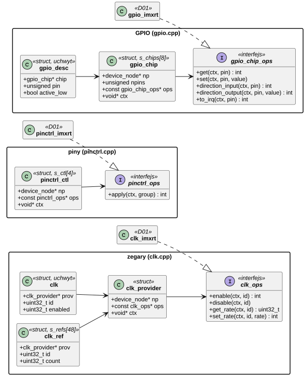
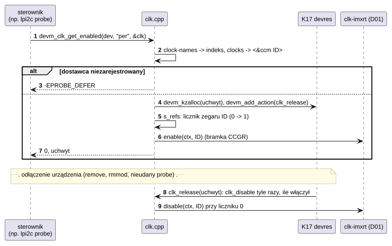
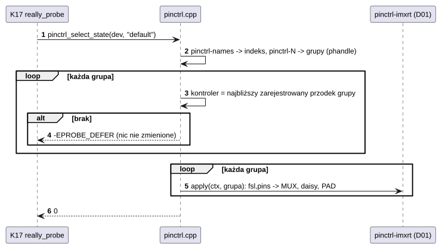

# S01 Zegary, piny i GPIO

## 1. Identyfikacja

| | |
|---|---|
| Identyfikator | S01 |
| Warstwa | L0, framework podsystemu (interfejs dla sterowników L1) |
| Pliki | `kernel/subsys/clk.cpp`, `kernel/subsys/pinctrl.cpp`, `kernel/subsys/gpio.cpp` |
| Interfejs | `kernel/include/crtos/clk.h`, `pinctrl.h`, `gpio.h` |
| Implementacje sprzętowe | D01: `clk-imxrt` (CCM), `pinctrl-imxrt` (IOMUXC), `gpio-imxrt` (GPIO1–5) |

## 2. Odpowiedzialność

- **Zegary**: rejestr dostawców zegarów (węzeł DT + `clk_ops`), uchwyty odbiorców
  z `clocks`/`clock-names`, liczniki włączeń na zegar (wspólne dla wszystkich uchwytów),
  automatyczne wyłączenie przy odłączeniu urządzenia.
- **Piny**: rejestr kontrolerów pinów, zastosowanie stanu (`pinctrl-names`,
  `pinctrl-N`) urządzenia; stan `default` stosuje model sterowników (K17) przed `probe`.
- **GPIO**: rejestr kontrolerów GPIO, deskryptory pinów z właściwości `*-gpios`
  (z polaryzacją „aktywny niskim”), kierunek, wartość logiczna, numer przerwania pinu.

## 3. Wymagania

| ID | Wymaganie | Weryfikacja |
|---|---|---|
| REQ-S01-01 | Odbiorca, którego dostawca (zegar, kontroler pinów, kontroler GPIO) nie jest jeszcze zarejestrowany, dostaje `-EPROBE_DEFER`. | start płytki (kolejność modułów) |
| REQ-S01-02 | Zegar jest włączany sprzętowo przy pierwszym włączeniu i wyłączany przy ostatnim wyłączeniu (licznik na zegar). | przegląd kodu |
| REQ-S01-03 | Włączenia zegara trzymane przez uchwyt są cofane przy odłączeniu urządzenia (`devm`). | przegląd kodu, `rmmod`/`insmod` sterownika |
| REQ-S01-04 | Stan pinów jest stosowany dopiero, gdy wszystkie potrzebne kontrolery są gotowe (nic nie zmienia się częściowo). | przegląd kodu |
| REQ-S01-05 | Wartości GPIO są logiczne: 1 = stan aktywny, z uwzględnieniem flagi aktywności niskim z DT. | przegląd kodu, działanie ekranu i PHY |

## 4. Interfejs udostępniany

### 4.1 Zegary (`crtos/clk.h`)

| Funkcja | Kontekst | Opis | Wynik |
|---|---|---|---|
| `clk_provider_register(np, ops, ctx)` | wątek | dostawca dla węzła | 0, `-ENOSPC` (4 dostawców) |
| `clk_provider_unregister(np)` | wątek | usunięcie dostawcy | — |
| `devm_clk_get(dev, name, &clk)` | `probe` | uchwyt zegara (`name` z `clock-names`, NULL = pierwszy) | 0, `-ENOENT`, `-EPROBE_DEFER`, `-ENOMEM` |
| `devm_clk_get_enabled(dev, name, &clk)` | `probe` | jw. + włączenie | jw. |
| `clk_enable(clk)`, `clk_disable(clk)` | wątek | licznik włączeń | 0, `-ENOSPC` (48 zegarów), błąd dostawcy |
| `clk_get_rate(clk)`, `clk_set_rate(clk, hz)` | wątek | częstotliwość | Hz / 0, `-ENOTSUP` |

`struct clk_ops` (dostawca): `enable(ctx, id)`, `disable(ctx, id)`, `get_rate(ctx, id)`,
`set_rate(ctx, id, rate)` (opcjonalne).

### 4.2 Piny (`crtos/pinctrl.h`)

| Funkcja | Kontekst | Opis | Wynik |
|---|---|---|---|
| `pinctrl_register(np, ops, ctx)` | wątek | kontroler dla węzła | 0, `-ENOSPC` (4) |
| `pinctrl_unregister(np)` | wątek | usunięcie | — |
| `pinctrl_select_state(dev, state)` | wątek | zastosowanie wszystkich grup stanu | 0, `-ENOENT`, `-EPROBE_DEFER`, `-EINVAL`, błąd `apply` |

`struct pinctrl_ops`: `apply(ctx, group)` – skonfiguruj wszystkie piny grupy (węzeł DT).

### 4.3 GPIO (`crtos/gpio.h`)

| Funkcja | Kontekst | Opis | Wynik |
|---|---|---|---|
| `gpiochip_register(np, npins, ops, ctx)`, `gpiochip_unregister(np)` | wątek | kontroler | 0, `-ENOSPC` (8) |
| `gpiod_get(dev, con_id, flags, &d)` | `probe` | pin z `<con_id>-gpios` (albo `gpios`), `GPIOD_ASIS/IN/OUT_LOW/OUT_HIGH` | 0, `-ENOENT`, `-EPROBE_DEFER`, `-EINVAL` |
| `gpiod_get_index(dev, np, prop, index, flags, &d)` | `probe` | dowolna właściwość i węzeł (np. panel) | jw. |
| `gpiod_get_value(d)`, `gpiod_set_value(d, v)` | wątek, ISR | wartość logiczna | 0/1 |
| `gpiod_direction_input(d)`, `gpiod_direction_output(d, v)` | wątek | kierunek | 0 / błąd |
| `gpiod_to_irq(d)` | wątek | numer przerwania wirtualnego (K02) | numer, `-ENXIO` |

`struct gpio_chip_ops`: `get`, `set`, `direction_input`, `direction_output`, `to_irq`.

## 5. Interfejsy wymagane

K17 (`of_parse_phandle_with_args`, `of_property_match_string`, `devm_kzalloc`,
`devm_add_action`), K06 (mutex zegarów), `irq_lock` (rejestry pinów i GPIO).

## 6. Struktura statyczna

*Źródło: [S01/struktura-statyczna.puml](../diagramy/S01/struktura-statyczna.puml)*

## 7. Zachowanie dynamiczne

### 7.1 Zegar w `probe` sterownika

*Źródło: [S01/zegar-w-probe-sterownika.puml](../diagramy/S01/zegar-w-probe-sterownika.puml)*

### 7.2 Stan pinów przed `probe`

*Źródło: [S01/stan-pinow-przed-probe.puml](../diagramy/S01/stan-pinow-przed-probe.puml)*

## 8. Implementacja

- Tablice o stałym rozmiarze (dostawcy zegarów 4, liczniki 48, kontrolery pinów 4, GPIO 8);
  brak alokacji poza uchwytami (`devm_kzalloc`).
- Zegary: mutex; piny i GPIO: `irq_lock` przy rejestracji (krótkie).
- `gpiod_*` nie zajmują pinu na wyłączność: dwa sterowniki mogą dostać ten sam pin.
- Numer zegara (`id`) jest przekazywany dostawcy bez interpretacji (dla `clk-imxrt`:
  bramki CCGR poniżej 0x1000, korzenie zegarów od 0x1000, zob. D01).

## 9. Obsługa błędów i mechanizmy bezpieczeństwa

| Sytuacja | Reakcja |
|---|---|
| brak właściwości `clocks`, `*-gpios`, stanu pinów | `-ENOENT` (sterownik decyduje, czy to błąd) |
| dostawca jeszcze niezarejestrowany | `-EPROBE_DEFER` (K17 ponowi `probe`) |
| pin spoza zakresu kontrolera | `-EINVAL` |
| przepełnienie tablic | `-ENOSPC` |

## 10. Konfiguracja

`MAX_PROVIDERS` (4), `MAX_REFS` (48) w `clk.cpp`; `MAX_CONTROLLERS` (4) w `pinctrl.cpp`;
`MAX_CHIPS` (8) w `gpio.cpp`. Powiązania w DT: `clocks`, `clock-names`, `#clock-cells`,
`pinctrl-names`, `pinctrl-N`, `*-gpios`, `#gpio-cells`.

## 11. Weryfikacja

- Każdy start płytki: wszystkie sterowniki z zegarami, pinami i GPIO dołączają się
  (`crtos kmon devices`), niezależnie od kolejności ładowania modułów.
- Działanie ekranu (GPIO włączenia i podświetlenia), dotyku (przerwanie GPIO), PHY
  (reset GPIO), SW8 (`crtos run evtest`).

## 12. Ograniczenia i znane problemy

- **Brak liczenia odwołań na dostawców.** Moduły `clk-imxrt`, `pinctrl-imxrt` i `gpio-imxrt`
  mają licznik odwołań 0 (`lsmod`), więc `rmmod` na nich się udaje, choć inne sterowniki
  trzymają uchwyty zegarów i pinów GPIO. Uchwyty wskazują wtedy na tablice operacji
  usuniętego modułu; kolejne `clk_disable` albo `gpiod_set_value` wywołałyby kod spod
  zwolnionego adresu. Dopóki tego nie naprawiono (np. odwołanie na moduł dostawcy
  w `devm_clk_get`/`gpiod_get`), nie wolno usuwać tych modułów w działającym systemie.
  Zobacz [03 Analiza bezpieczeństwa](../03-analiza-bezpieczenstwa.md).
- Brak wyłączności pinów GPIO i kontroli konfliktów grup pinów (dwa urządzenia z tym samym
  padem – przykład: SPI i ekran na EVKB, zob. [Sterowniki](../../sterowniki.md#spi-j24)).
