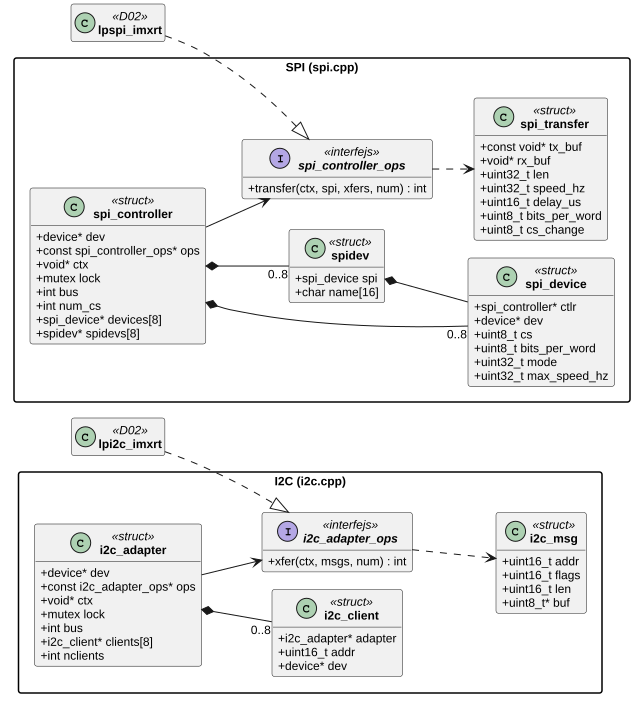
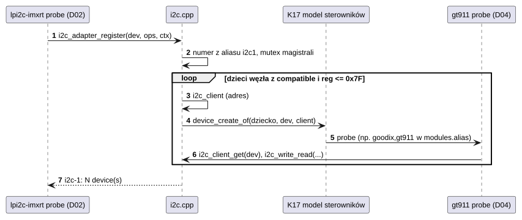
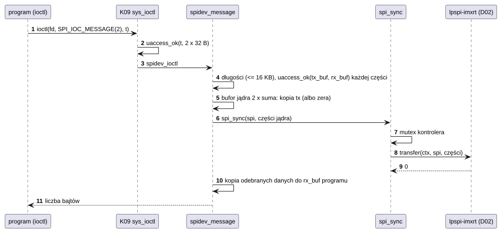

# S02 Magistrale I2C i SPI

## 1. Identyfikacja

| | |
|---|---|
| Identyfikator | S02 |
| Warstwa | L0, framework podsystemu |
| Pliki | `kernel/subsys/i2c.cpp`, `kernel/subsys/spi.cpp` |
| Interfejs | `kernel/include/crtos/i2c.h`, `kernel/include/crtos/spi.h` (także ioctl `/dev/spidev` dla programów) |
| Implementacje sprzętowe | D02: `lpi2c-imxrt`, `lpspi-imxrt` |

## 2. Odpowiedzialność

- **Adaptery I2C i kontrolery SPI**: rejestracja sterownika magistrali; numer magistrali
  z aliasu DT (`i2c1`, `spi3`) albo kolejny.
- **Urządzenia na magistrali**: dla każdego dostępnego węzła-dziecka z `compatible`
  framework tworzy urządzenie (K17) z danymi magistrali (`i2c_client`: adres 7-bitowy,
  `spi_device`: chip select, tryb, zegar), więc sterowniki urządzeń (np. dotyk GT911)
  dołączają się jak każde inne.
- **Szeregowanie**: transfery jednej magistrali są wykonywane po kolei (mutex magistrali).
- **`/dev/spidevB.C`** dla programów (węzły `crtos,spidev`): ioctl jak w Linuksie
  (`SPI_IOC_MESSAGE`, tryb, zegar, słowo), dane przez bufory jądra.

## 3. Wymagania

| ID | Wymaganie | Weryfikacja |
|---|---|---|
| REQ-S02-01 | Transfery na jednej magistrali nie przeplatają się (sterowniki i programy naraz). | przegląd kodu |
| REQ-S02-02 | Sterownik magistrali (kontroler SPI, jego przerwanie) nigdy nie dotyka pamięci programu: dane `/dev/spidev` przechodzą przez bufory jądra kopiowane po sprawdzeniu wskaźników. | przegląd kodu, `spi` (A03) |
| REQ-S02-03 | Komunikat `/dev/spidev` ma najwyżej 16 KB; każda część ma długość > 0 (`-EMSGSIZE`, `-EINVAL`). | `crtos run spi` (A03) |
| REQ-S02-04 | Urządzenie dla dziecka magistrali powstaje tylko przy poprawnym adresie (`reg` ≤ 0x7F dla I2C, < liczby chip select dla SPI). | przegląd kodu |
| REQ-S02-05 | Ustawienia `/dev/spidev` (tryb, zegar, słowo) zostają do następnej zmiany, także po zamknięciu pliku. | `crtos run spi -s ...` |

## 4. Interfejs udostępniany

### 4.1 I2C (`crtos/i2c.h`)

| Funkcja | Kontekst | Opis | Wynik |
|---|---|---|---|
| `i2c_adapter_register(dev, ops, ctx, &adap)` | `probe` | adapter + urządzenia potomne (`reg` = adres) | 0, `-ENOMEM` |
| `i2c_adapter_unregister(adap)` | `remove` | usunięcie urządzeń potomnych i adaptera | — |
| `i2c_adapter_get(bus)` | wątek | adapter po numerze (narzędzia, `i2cdetect`) | wskaźnik / `NULL` |
| `i2c_client_get(dev)` | `probe` sterownika urządzenia | klient (adapter + adres) | wskaźnik |
| `i2c_transfer(adap, msgs, num)` | wątek | komunikaty z powtórzonym startem, pod mutexem adaptera | liczba wykonanych komunikatów, `-errno` |
| `i2c_write(c, buf, len)`, `i2c_read(c, buf, len)`, `i2c_write_read(c, w, wl, r, rl)` | wątek | skróty | 0, `-EIO`, `-errno` |

`struct i2c_adapter_ops`: `xfer(ctx, msgs, num)`; `struct i2c_msg`: `addr`, `flags`
(`I2C_M_RD`), `len`, `buf`.

### 4.2 SPI (`crtos/spi.h`)

| Funkcja | Kontekst | Opis | Wynik |
|---|---|---|---|
| `spi_controller_register(dev, ops, ctx, num_cs, &c)` | `probe` | kontroler; dzieci: urządzenia (sterownik) albo `crtos,spidev` (plik dla programów) | 0, `-ENOMEM` |
| `spi_controller_unregister(c)`, `spi_controller_bus(c)` | `remove` / wątek | | |
| `spi_device_get(dev)` | `probe` | urządzenie SPI (cs, tryb, zegar, słowo 8 bitów) | wskaźnik |
| `spi_sync(spi, xfers, num)` | wątek | komunikat: części po kolei, chip select aktywny od pierwszej do ostatniej (chyba że `cs_change`) | 0, `-EINVAL` (część o długości 0), błąd kontrolera |
| `spi_write`, `spi_read`, `spi_write_then_read` | wątek | skróty | jw. |
| `/dev/spidevB.C`: `SPI_IOC_MESSAGE(n)`, `SPI_IOC_RD/WR_MODE(32)`, `RD/WR_LSB_FIRST`, `RD/WR_BITS_PER_WORD`, `RD/WR_MAX_SPEED_HZ`, `read`, `write` | program (`CAP_DEV`) | jak Linux spidev | liczba bajtów komunikatu, `-EMSGSIZE`, `-EFAULT`, `-EINVAL`, `-ENOTTY` |

`struct spi_controller_ops`: `transfer(ctx, spi, xfers, num)`.

## 5. Interfejsy wymagane

K17 (`device_create_of`, `device_destroy`, `of_alias_get_id`, `of_property_read_*`), K06
(mutex magistrali), K07, K08 (`uaccess_ok`), K13 (`devfs_register`), K16
(`module_get_addr` – `/dev/spidev` trzyma odwołanie na moduł kontrolera, dopóki plik jest
otwarty).

## 6. Struktura statyczna

*Źródło: [S02/struktura-statyczna.puml](../diagramy/S02/struktura-statyczna.puml)*

## 7. Zachowanie dynamiczne

### 7.1 Rejestracja magistrali i urządzeń potomnych

*Źródło: [S02/rejestracja-magistrali.puml](../diagramy/S02/rejestracja-magistrali.puml)*

### 7.2 Komunikat programu przez `/dev/spidev`

*Źródło: [S02/komunikat-programu-przez-spidev.puml](../diagramy/S02/komunikat-programu-przez-spidev.puml)*

## 8. Implementacja

- Adapter/kontroler to struktura w pamięci jądra z mutexem; urządzenia potomne mają
  wskaźnik na nią w `device.bus_data`.
- `/dev/spidev` jest tworzony przez `devfs_register` dla każdego dziecka `crtos,spidev`;
  ustawienia z DT: `spi-max-frequency`, `spi-cpol`, `spi-cpha`, `spi-cs-high`,
  `spi-lsb-first`.
- `spidev` wymaga niezerowego zegara (`SPI_IOC_WR_MAX_SPEED_HZ` 0 → `-EINVAL`); słowa
  4–32 bitów są przyjmowane przez framework, ale `lpspi-imxrt` obsługuje tylko 8 (D02).
- Żadna część nie ma limitu czasu na poziomie frameworka: limity czasu mają sterowniki
  magistral (D02).

## 9. Obsługa błędów i mechanizmy bezpieczeństwa

| Sytuacja | Reakcja |
|---|---|
| zły wskaźnik części komunikatu programu | `-EFAULT` przed jakimkolwiek transferem |
| komunikat za długi / część pusta | `-EMSGSIZE` / `-EINVAL` |
| brak pamięci na bufory | `-ENOMEM` |
| wątek zabity podczas czekania na mutex | `-EINTR` (SPI) |
| błąd sprzętu | kod sterownika (`-EIO`, `-ETIMEDOUT`, `-ENOTSUP`) |

## 10. Konfiguracja

`MAX_CLIENTS` (8, I2C), `MAX_DEVICES` (8, SPI), `SPIDEV_MAX` (16384). Drzewo urządzeń:
dzieci węzłów `&lpi2c1`, `&lpspi3` (zob. [Sterowniki](../../sterowniki.md#spi-j24)).

## 11. Weryfikacja

- Dotyk GT911 na I2C (D04) działa przy każdym starcie; `crtos kmon i2cdetect 1`.
- `crtos run spi ...` (A03): komunikaty jedno- i dwuczęściowe do 16 KB, 100 kHz–20 MHz
  (test na płytce 27.09.2026).

## 12. Ograniczenia i znane problemy

- Brak limitu czasu na poziomie frameworka; zawieszony sterownik magistrali blokuje
  wszystkich jej użytkowników (mutex).
- `i2c_adapter_get` zwraca adapter bez odwołania (tylko dla narzędzi diagnostycznych).
