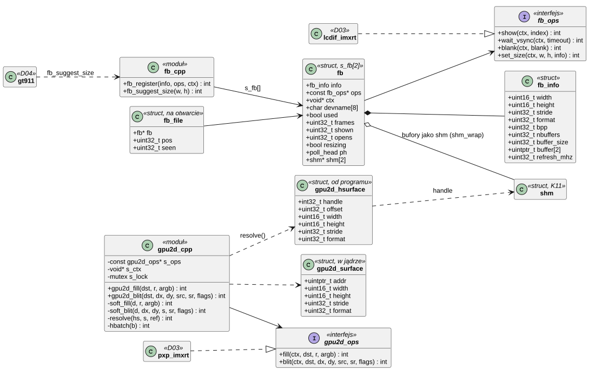
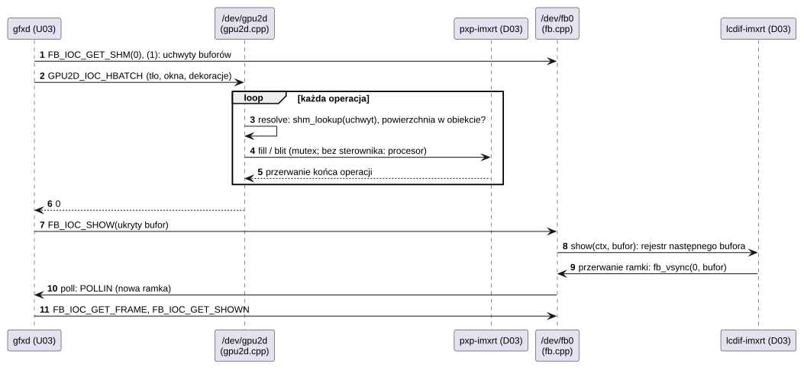

# S03 Ekran i akcelerator 2D

## 1. Identyfikacja

| | |
|---|---|
| Identyfikator | S03 |
| Warstwa | L0, framework podsystemu |
| Pliki | `kernel/subsys/fb.cpp` (`/dev/fbN`), `kernel/subsys/gpu2d.cpp` (`/dev/gpu2d`) |
| Interfejs | `kernel/include/crtos/fb.h`, `kernel/include/crtos/gpu2d.h` |
| Implementacje sprzętowe | D03: `lcdif-imxrt` (ekran), `pxp-imxrt` (akcelerator) |

## 2. Odpowiedzialność

- **Bufory ramki** (`/dev/fb0`): rejestr wyświetlaczy (do 2), informacje (rozmiar, format,
  bufory), przełączanie buforów w następnej ramce, licznik ramek i `poll` na początek
  ramki, wygaszanie, udostępnienie buforów jako pamięci współdzielonej dla akceleratora.
- **Wybór trybu panelu** (`fb_suggest_size`): sterownik, który zna rozmiar zamontowanego
  panelu (dotyk GT911, D04), prosi o ten tryb; framework zmienia tryb `/dev/fb0` przez
  `set_size` sterownika (D03) tylko wtedy, gdy nikt nie używa ekranu (przy starcie, przed
  `gfxd`).
- **Akcelerator 2D** (`/dev/gpu2d`): wypełnianie prostokątów, kopiowanie z konwersją
  formatu, mieszanie ARGB; jeden sterownik sprzętowy (PXP) obsługuje wszystkich, a bez
  niego te same operacje wykonuje procesor.
- **Bezpieczeństwo DMA**: programy wskazują powierzchnie uchwytem pamięci współdzielonej
  i przesunięciem; jądro sprawdza, że cała powierzchnia leży w obiekcie, zanim akcelerator
  (urządzenie z własnym dostępem do pamięci) jej dotknie.

## 3. Wymagania

| ID | Wymaganie | Weryfikacja |
|---|---|---|
| REQ-S03-01 | Przełączenie bufora (`FB_IOC_SHOW`) działa od następnego początku ramki (bez rozrywania obrazu). | `kmon fbtest`, obserwacja ekranu |
| REQ-S03-02 | `poll` na `/dev/fb0` zgłasza `POLLIN`, gdy od ostatniego `FB_IOC_GET_FRAME` zaczęła się nowa ramka. | `gfxinfo` (U03, 58 fps) |
| REQ-S03-03 | Akcelerator wykonuje operację programu tylko na powierzchniach, które w całości leżą w obiektach pamięci współdzielonej, do których program ma uchwyt (`-EBADF`, `-EINVAL` inaczej). | przegląd kodu, `kmon gpu2dtest` |
| REQ-S03-04 | Operacje z adresami surowymi (`GPU2D_IOC_FILL/BLIT`) są dostępne tylko dla wątków jądra (`-EPERM`). | przegląd kodu |
| REQ-S03-05 | Po wyrejestrowaniu ekranu jego bufory przestają być osiągalne przez wcześniej wydane uchwyty (`shm_revoke`). | przegląd kodu |
| REQ-S03-06 | Bez sterownika akceleratora `/dev/gpu2d` działa na procesorze (te same wyniki). | `kmon gpu2dtest` |
| REQ-S03-07 | `fb_suggest_size` zmienia tryb `/dev/fb0` tylko wtedy, gdy żaden plik ekranu nie jest otwarty i żaden program nie trzyma jego bufora jako pamięci współdzielonej; inaczej zwraca `-EBUSY`, a tryb się nie zmienia. Otwarcie ekranu w trakcie zmiany kończy się `-EAGAIN`. | przegląd kodu; `kmon fb 480x272` przy działającym `gfxd`: odmowa, po zakończeniu `gfxd`: zmiana (02.10.2026) |

## 4. Interfejs udostępniany

### 4.1 Ekran (`crtos/fb.h`)

| Funkcja / ioctl | Kontekst | Opis |
|---|---|---|
| `fb_register(info, ops, ctx)` | `probe` | `/dev/fbN`, zwraca indeks albo `-ENOSPC` |
| `fb_unregister(index)` | `remove` | usunięcie, odwołanie buforów |
| `fb_vsync(index, shown)` | ISR sterownika | początek ramki: licznik, bufor na ekranie, `poll_notify` |
| `fb_show`, `fb_wait_vsync`, `fb_blank`, `fb_get_info` | wątek | dla jądra |
| `fb_suggest_size(w, h)` | wątek (`probe` sterownika) | zamontowany panel ma ten rozmiar: zmiana trybu `/dev/fb0`; 0, `-ENOENT` (brak trybu), `-EBUSY` (ekran w użyciu), `-ENODEV` |
| `FB_IOC_GET_INFO` | program | `struct fb_info` (np. 800×480 albo 480×272, RGB565, 2 bufory, ok. 59 Hz) |
| `FB_IOC_SHOW` (arg: bufor) | program | pokaż od następnej ramki |
| `FB_IOC_GET_FRAME`, `FB_IOC_GET_SHOWN` | program | licznik ramek (i zapamiętanie dla `poll`), bufor na ekranie |
| `FB_IOC_WAIT_VSYNC`, `FB_IOC_BLANK` | program | czekanie na ramkę (100 ms), wygaszenie |
| `FB_IOC_GET_SHM` | program | uchwyt pamięci współdzielonej bufora (dla `/dev/gpu2d`) |
| `read`, `write`, `lseek` | program | dostęp do bufora 0 |

`struct fb_ops`: `show(ctx, index)`, `wait_vsync(ctx, timeout)`, `blank(ctx, on)`
i opcjonalnie `set_size(ctx, w, h, info)`: zmiana na tryb panelu o tym rozmiarze, opis nowych
buforów w `info`.

### 4.2 Akcelerator (`crtos/gpu2d.h`)

| Funkcja / ioctl | Kontekst | Opis | Wynik |
|---|---|---|---|
| `gpu2d_register(ops, ctx)`, `gpu2d_unregister()` | `probe`/`remove` | jeden sterownik | 0, `-EBUSY` |
| `gpu2d_fill(dst, rect, argb)`, `gpu2d_blit(dst, dx, dy, src, sr, flags)` | wątek jądra | adresy surowe, szeregowane | 0 / błąd |
| `GPU2D_IOC_HFILL`, `GPU2D_IOC_HBLIT` | program | powierzchnie jako (uchwyt shm, przesunięcie, wymiary, format) | 0, `-EBADF`, `-EINVAL` |
| `GPU2D_IOC_HBATCH` | program | do 64 operacji w jednym wywołaniu (cała klatka) | 0, pierwszy błąd, `-EFAULT` |
| `GPU2D_IOC_FILL`, `GPU2D_IOC_BLIT` | wątek jądra | adresy surowe | `-EPERM` dla programów |

Formaty: `GPU2D_FMT_RGB565`, `XRGB8888`, `ARGB8888`; `GPU2D_BLEND` = mieszanie z kanałem
alfa źródła. `struct gpu2d_ops`: `fill`, `blit`.

## 5. Interfejsy wymagane

K11 (`shm_wrap`, `shm_revoke`, `shm_lookup`), K08 (uchwyty, `uaccess_ok`), K12 (`poll`),
K13 (`devfs_register`), K06 (mutex akceleratora).

## 6. Struktura statyczna

*Źródło: [S03/struktura-statyczna.puml](../diagramy/S03/struktura-statyczna.puml)*

## 7. Zachowanie dynamiczne

### 7.1 Klatka kompozytora

*Źródło: [S03/klatka-kompozytora.puml](../diagramy/S03/klatka-kompozytora.puml)*

## 8. Implementacja

- Bufory ekranu leżą w SDRAM bez pamięci podręcznej (sterownik), więc zapis procesora
  i odczyt LCDIF nie wymagają operacji na cache.
- `buffer_shm` tworzy obiekt pamięci współdzielonej bufora przy pierwszym użyciu
  (`shm_wrap`) i trzyma jedno odwołanie; bufor ekranu (480×272: 255 KB, 800×480: 750 KB)
  nie spełnia reguł regionów MPU, więc programy nie mogą go zmapować, a jedynie przekazać
  uchwyt akceleratorowi.
- `fb_suggest_size`: pod `irq_lock` sprawdza licznik otwarć (`opens`, zmieniany w `open`
  i `close`), flagę `resizing` i obiekty buforów. Obiekt, który poza frameworkiem nikt już
  nie trzyma (`shm_unshared`, K11: programy go zamknęły), jest odbierany (`shm_revoke`)
  i zwalniany. Potem ustawia `resizing`, poza blokadą woła `set_size` sterownika i podmienia
  `info`. Wynik trafia do logu jądra (`fb0: now WxH`, `fb0: stays ...`).
- `resolve` sprawdza format, wymiary, parzystość przesunięcia i kroku oraz
  `offset + stride × (h − 1) + szerokość × bpp ≤ rozmiar obiektu` (arytmetyka 64-bitowa).
- Programowe zastępstwo (`soft_fill`, `soft_blit`) obsługuje te same formaty i mieszanie
  (piksel po pikselu).
- Czas złożenia klatki przez `gfxd` z PXP: ok. 1,7 ms (ekran 58,7 Hz).

## 9. Obsługa błędów i mechanizmy bezpieczeństwa

| Sytuacja | Reakcja |
|---|---|
| powierzchnia wychodzi poza obiekt shm | `-EINVAL`, akcelerator nie startuje |
| uchwyt nie jest pamięcią współdzieloną / odwołaną | `-EBADF` |
| za duża paczka | `-EINVAL` (> 64) |
| operacja surowa z programu | `-EPERM` |
| bufor spoza zakresu | `-EINVAL` |
| brak operacji w sterowniku | `-ENOTSUP` |
| zmiana trybu, gdy ekran jest otwarty albo bufory są u programów | `-EBUSY`, tryb bez zmian, wpis w logu |
| otwarcie ekranu w trakcie zmiany trybu | `-EAGAIN` |
| panel bez trybu tego rozmiaru, sterownik bez `set_size` | `-ENOENT`, tryb bez zmian |

## 10. Konfiguracja

`MAX_FB` (2), `FB_MAX_BUFFERS` (2), `GPU2D_BATCH_MAX` (64).

## 11. Weryfikacja

- `crtos kmon fbtest` (wzór testowy, częstotliwość odświeżania, wypełnienie
  akceleratorem), `crtos kmon gpu2dtest` (operacje na buforach w RAM, porównanie
  z wynikiem oczekiwanym).
- `crtos run gfxinfo -b` (U03): czasy faz składania, liczba klatek.
- `crtos shot`: zrzut ekranu przez sondę (odczyt bufora pokazywanego przez LCDIF).
- `crtos kmon fb [WxH]` (K19): bieżący tryb i ręczna zmiana; 02.10.2026: odmowa przy
  działającym `gfxd`, po jego zakończeniu 10 zmian 480×272 ↔ 800×480 (D03).

## 12. Ograniczenia i znane problemy

- Jeden akcelerator dla wszystkich; operacje są szeregowane.
- Tryb ekranu zmienia się tylko, gdy nikt go nie używa: przy działającym `gfxd` (zawsze, poza
  chwilą startu) nie da się go zmienić bez zatrzymania serwera grafiki.
- Paczka `HBATCH` jest czytana z pamięci programu w trakcie przetwarzania (każda operacja
  jest sprawdzana osobno, więc zmiana paczki przez inny wątek programu nie omija kontroli).
