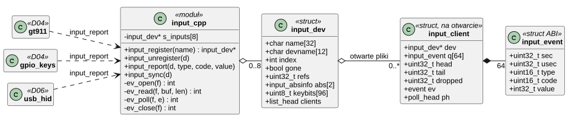
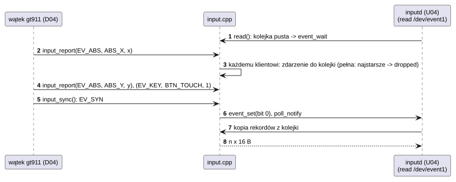

# S04 Urządzenia wejścia

## 1. Identyfikacja

| | |
|---|---|
| Identyfikator | S04 |
| Warstwa | L0, framework podsystemu |
| Pliki | `kernel/subsys/input.cpp` |
| Interfejs | `kernel/include/crtos/input.h`, kody klawiszy `kernel/include/crtos/keys.h` (wartości Linuksa) |
| Implementacje | D04 (`gt911`, `ft5406`, `gpio-keys`, `esp32-pad`), D06 (klawiatury i myszy USB) |

## 2. Odpowiedzialność

- Rejestr urządzeń wejścia (do 8) publikowanych jako `/dev/eventN`.
- Zdarzenia zgodne z Linuksem (`struct input_event`: czas, typ, kod, wartość): `EV_KEY`,
  `EV_REL` (`REL_X`, `REL_Y`, `REL_WHEEL` – kółko, w górę dodatnio, `REL_HWHEEL` – kółko
  poziome, w prawo dodatnio), `EV_ABS`, `EV_SYN`.
- Osobna kolejka (64 zdarzenia) dla każdego otwartego pliku; odczyt całych rekordów,
  czekanie, `poll`.
- Opis urządzenia: nazwa, zakresy osi `ABS_X` … `ABS_RZ` (ekran dotykowy: `ABS_X`/`ABS_Y`;
  pad: gałki `ABS_X/Y`, `ABS_RX/RY` i spusty `ABS_Z/RZ`), mapa klawiszy, które urządzenie
  potrafi wysłać (klawiatura = urządzenie z klawiszami liter, pad = urządzenie z
  `BTN_SOUTH`; od tego zależą klawiatura ekranowa i obsługa pada w U04).

## 3. Wymagania

| ID | Wymaganie | Weryfikacja |
|---|---|---|
| REQ-S04-01 | `input_report` jest bezpieczne w przerwaniu i nigdy nie blokuje. | przegląd kodu |
| REQ-S04-02 | Każdy otwarty plik dostaje każde zdarzenie; przy pełnej kolejce ginie najstarsze (liczone). | przegląd kodu |
| REQ-S04-03 | Czytelnik jest budzony dopiero po `EV_SYN` (zakończony pakiet zdarzeń). | `crtos run evtest` |
| REQ-S04-04 | Po wyrejestrowaniu urządzenia otwarte pliki dostają `-ENODEV`/`POLLHUP`, a struktura urządzenia żyje do zamknięcia ostatniego pliku. | przegląd kodu, odłączenie myszy USB |
| REQ-S04-05 | Klawisz wysłany przez urządzenie jest dopisywany do jego mapy klawiszy. | przegląd kodu |
| REQ-S04-06 | Zakres i ostatnia wartość każdej osi `ABS_X` … `ABS_RZ` (`INPUT_ABS_AXES` = 6) są dostępne przez `INPUT_IOC_GET_ABS(oś)`; oś bez zakresu (maksimum ≤ minimum) oznacza, że urządzenie jej nie ma. | przegląd kodu, `inputd` („event1 (…), gamepad”) |

## 4. Interfejs udostępniany

| Funkcja / ioctl | Kontekst | Opis | Wynik |
|---|---|---|---|
| `input_register(name)` | `probe` | nowe urządzenie, `/dev/eventN` | wskaźnik / `NULL` (brak miejsca lub pamięci) |
| `input_unregister(d)` | `remove` | usunięcie (czytelnicy dostają `-ENODEV`) | — |
| `input_set_abs(d, axis, min, max)` | `probe` | zakres osi `ABS_X` … `ABS_RZ` | — |
| `input_set_key(d, code)` | `probe`, ISR | klawisz, który urządzenie potrafi wysłać | — |
| `input_report(d, type, code, value)` | wątek, ISR | zdarzenie do kolejek wszystkich otwartych plików | — |
| `input_sync(d)` | wątek, ISR | `EV_SYN/SYN_REPORT`: koniec pakietu, budzenie czytelników | — |
| `input_devname(d)` | wszędzie | `"eventN"` | — |
| `read` na `/dev/eventN` | program | całe `struct input_event` (16 B); czeka, chyba że `O_NONBLOCK` | bajty, `-EINVAL` (bufor < 16 B), `-EAGAIN`, `-ENODEV` |
| `INPUT_IOC_GET_NAME`, `GET_ABS_X`, `GET_ABS_Y`, `GET_KEYBITS` | program | opis urządzenia | 0 |
| `INPUT_IOC_GET_ABS(axis)` | program | `struct input_absinfo` osi `axis` < `INPUT_ABS_AXES` (jak `EVIOCGABS` Linuksa) | 0, `-ENOTTY` (inna oś) |
| `poll` | program | `POLLIN` (zdarzenia), `POLLHUP` (urządzenie znikło) | |

## 5. Interfejsy wymagane

K06 (`event_*`), K12 (`poll`), K13 (`devfs_register`, `devfs_unregister`), K05 (`time_us`
– znacznik czasu zdarzenia).

## 6. Struktura statyczna

*Źródło: [S04/struktura-statyczna.puml](../diagramy/S04/struktura-statyczna.puml)*

## 7. Zachowanie dynamiczne

*Źródło: [S04/zdarzenie-dotyku.puml](../diagramy/S04/zdarzenie-dotyku.puml)*

## 8. Implementacja

- Zdarzenia są kopiowane do kolejek wszystkich klientów pod `irq_lock` (krótko, bez
  alokacji), dlatego sterowniki mogą je zgłaszać z przerwań.
- Licznik odwołań urządzenia: 1 za rejestrację + 1 za każdy otwarty plik; `input_unregister`
  ustawia `gone`, budzi klientów (bit 1 zdarzenia) i oddaje odwołanie rejestracji.
- Znacznik czasu: `time_us()` w chwili `input_report` (sekundy + mikrosekundy od startu).

## 9. Obsługa błędów i mechanizmy bezpieczeństwa

| Sytuacja | Reakcja |
|---|---|
| przepełnienie kolejki klienta | najstarsze zdarzenie usunięte, licznik `dropped` |
| urządzenie usunięte | `-ENODEV`, `POLLHUP`; otwarcie usuniętego: `-ENODEV` |
| bufor odczytu mniejszy niż rekord | `-EINVAL` |
| więcej niż 8 urządzeń | `input_register` zwraca `NULL` |

## 10. Konfiguracja

`MAX_INPUTS` (8), `QUEUE_LEN` (64), `INPUT_KEYBITS_SIZE` (96 B = `KEY_MAX`+1 bitów),
`INPUT_ABS_AXES` (6).

## 11. Weryfikacja

- `crtos run evtest` / `crtos kmon evtest`: zdarzenia dotyku, SW8, klawiatury i myszy USB
  (test ręczny).
- Codzienna obsługa interfejsu dotykowego (U04, U03).

## 12. Ograniczenia i znane problemy

- Tylko osie `ABS_X` … `ABS_RZ` mają opis zakresu; osie wielodotyku (`ABS_MT_*`) są
  przekazywane bez opisu, a ich zakres jest ten sam co `ABS_X`/`ABS_Y` (tak zgłaszają je
  sterowniki D04 i tak skaluje je `inputd`).
- Brak wyłącznego dostępu (`EVIOCGRAB`): każdy otwarty plik dostaje wszystkie zdarzenia.
