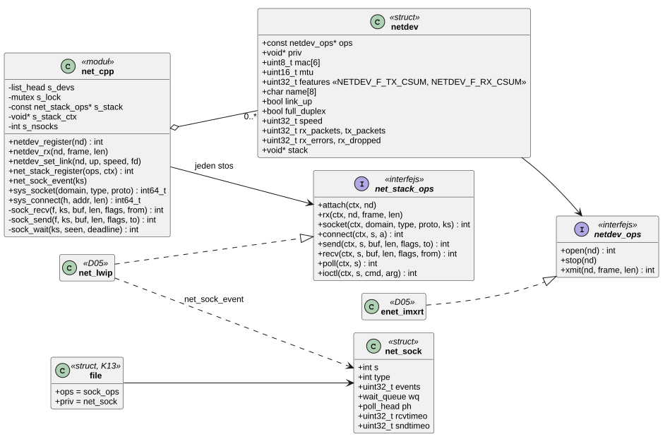
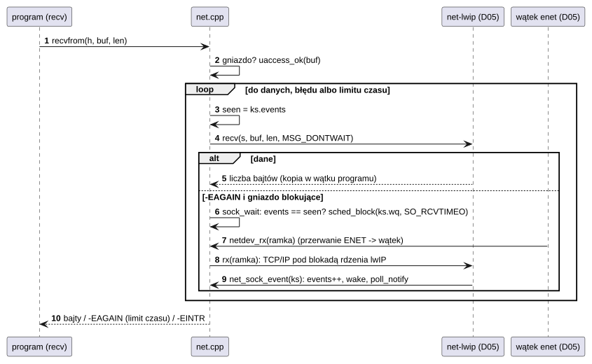
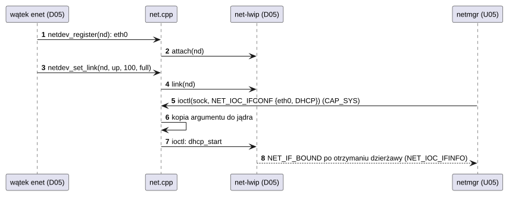

# S05 Sieć i gniazda

## 1. Identyfikacja

| | |
|---|---|
| Identyfikator | S05 |
| Warstwa | L0, framework podsystemu (granica: sterowniki kart sieciowych ↔ stos TCP/IP ↔ programy) |
| Pliki | `kernel/subsys/net.cpp` |
| Interfejs | `kernel/include/crtos/net.h` (sterowniki i stos), `kernel/include/crtos/socket.h` (ABI gniazd), wywołania `SYS_SOCKET`..`SYS_GETPEERNAME` (50–61) |
| Implementacje | D05: `enet-imxrt` (karta), `net-lwip` (stos lwIP 2.2.1) |

## 2. Odpowiedzialność

- Rejestr interfejsów sieciowych (`struct netdev`, nazwy `ethN`), liczniki, stan łącza.
- Jeden stos protokołów (moduł) z interfejsem `net_stack_ops`: dołączanie interfejsów,
  odebrane ramki, gniazda.
- **Gniazda jako pliki**: `read`, `write`, `poll`, `close`, `dup` działają na nich jak na
  plikach; wywołania BSD (`socket`, `bind`, `connect`, `listen`, `accept`, `sendto`,
  `recvfrom`, `shutdown`, `set/getsockopt`, `getsockname`, `getpeername`).
- **Czekanie w jądrze**: stos nigdy nie blokuje (odpowiada `-EAGAIN`/`-EINPROGRESS`);
  czeka framework – z przerwaniem przy kończeniu procesu i z limitami `SO_RCVTIMEO`/
  `SO_SNDTIMEO`.
- Konfiguracja interfejsów, DNS i rozwiązywanie nazw przez ioctl na gnieździe
  (`NET_IOC_*`); zmiany konfiguracji wymagają `CAP_SYS`.

## 3. Wymagania

| ID | Wymaganie | Weryfikacja |
|---|---|---|
| REQ-S05-01 | Stos protokołów nigdy nie blokuje w operacjach gniazd; oczekiwanie na dane, miejsce albo połączenie odbywa się w frameworku i jest przerywane przy kończeniu procesu (`-EINTR`). | przegląd kodu, `apptest`/`nc` (zabicie w trakcie) |
| REQ-S05-02 | Stos używa pamięci programu tylko w czasie trwania wywołania (w wątku wołającym), po sprawdzeniu bufora przez jądro; argumenty ioctl dostaje jako kopię w jądrze. | przegląd kodu |
| REQ-S05-03 | `NET_IOC_IFCONF` i `NET_IOC_DNS_SET` wymagają `CAP_SYS` (`-EPERM`). | przegląd kodu |
| REQ-S05-04 | Operacja gniazda na uchwycie, który nie jest gniazdem, daje `-ENOTSOCK`. | przegląd kodu |
| REQ-S05-05 | Limit czasu odbioru/wysyłania (`SO_RCVTIMEO`/`SO_SNDTIMEO`) kończy czekanie wynikiem `-EAGAIN`; `connect` z limitem – `-ETIMEDOUT`. | przegląd kodu |
| REQ-S05-06 | Bez zarejestrowanego stosu wywołania gniazd zwracają `-EAFNOSUPPORT`/`-ENETDOWN`, a ramki odebrane przez kartę są liczone jako odrzucone. | przegląd kodu |
| REQ-S05-07 | Sterownik ogłasza w `struct netdev.features`, co robi sprzęt (`NETDEV_F_TX_CSUM`: wstawia sumy kontrolne wysyłanych ramek; `NETDEV_F_RX_CSUM`: odrzuca odebrane ze złą sumą); stos dostaje te informacje przy `attach` i nie powtarza tej pracy. | `crtos netbench`, ping i echo UDP (D05, 02.10.2026) |
| REQ-S05-08 | Ścieżka danych gniazd (`sendto`/`write`, `recvfrom`/`read`, czekanie, `net_sock_event`, `netdev_rx`, `poll` gniazda) wykonuje się z ITCM (`KERNEL_FAST`), a czekanie z limitem czasu nie dzieli liczb 64-bitowych (poza limitem ponad 71 minut). | profil PC przez DWT_PCSR (D05): przed zmianą 11% próbek w tych funkcjach z flasha, po zmianie (TCP z płytki, 93,7 Mbit/s) 0,1% próbek we flashu (02.10.2026) |

## 4. Interfejs udostępniany

### 4.1 Dla sterowników kart (`crtos/net.h`)

| Funkcja | Kontekst | Opis |
|---|---|---|
| `netdev_register(nd)`, `netdev_unregister(nd)` | wątek | interfejs `ethN`, dołączenie do stosu |
| `netdev_rx(nd, frame, len)` | wątek sterownika (nie ISR) | odebrana ramka (może być buforem DMA sterownika); stos kopiuje ją przed powrotem |
| `netdev_set_link(nd, up, speed, full_duplex)` | wątek | zmiana łącza (log, powiadomienie stosu) |
| `netdev_count()`, `netdev_get(i)`, `netdev_by_name(name)`, `net_lock()`, `net_unlock()` | wątek | przegląd (pod blokadą) |

`struct netdev_ops` (sterownik): `open`, `stop`, `xmit(nd, frame, len)` (0 albo `-EAGAIN`,
wołane przez wiele wątków). `struct netdev.features` (sterownik): `NETDEV_F_TX_CSUM`,
`NETDEV_F_RX_CSUM` – sumy kontrolne IPv4/TCP/UDP/ICMP liczone przez sprzęt.

### 4.2 Dla stosu (`crtos/net.h`)

| Funkcja | Opis |
|---|---|
| `net_stack_register(ops, ctx)`, `net_stack_unregister()` | jeden stos (`-EBUSY`) |
| `net_sock_event(ks)` | stan gniazda mógł się zmienić: budzenie czekających i `poll` (także z wątku stosu); stos woła ją tylko przy zmianach, które mogą kogoś odblokować (koszt przy każdym segmencie był znaczny) |

`struct net_stack_ops`: `attach`, `detach`, `rx`, `link`, `socket`, `close`, `bind`,
`connect`, `listen`, `accept`, `send`, `recv`, `shutdown`, `setsockopt`, `getsockopt`,
`getname`, `poll`, `ioctl` – wszystkie nieblokujące.

### 4.3 Dla programów (ABI)

| Wywołanie | Uwagi | Błędy |
|---|---|---|
| `socket(AF_INET, SOCK_STREAM/DGRAM/RAW [| SOCK_NONBLOCK], proto)` | uchwyt pliku | `-EAFNOSUPPORT`, `-EPROTOTYPE`, `-ENOMEM` |
| `bind`, `listen`, `getsockname`, `getpeername`, `shutdown` | adresy `struct crtos_sockaddr_in` (16 B, jak Linux) | `-EINVAL`, `-EFAULT`, `-ENOTSOCK`, `-EBADF` |
| `connect` | blokujące: czeka na zakończenie uzgadniania (`SO_SNDTIMEO`) | `-ETIMEDOUT`, `-ECONNREFUSED`, … |
| `accept` | blokujące: czeka na połączenie (`SO_RCVTIMEO`) | `-EAGAIN`, `-EINTR` |
| `sendto`/`write`, `recvfrom`/`read` | TCP: wysyła całość (chyba że nieblokujące), UDP: cały datagram | `-EAGAIN`, `-EINTR`, `-EPIPE`, … |
| `setsockopt`/`getsockopt` | `SO_RCVTIMEO`, `SO_SNDTIMEO` obsługuje framework, resztę stos | `-ENOPROTOOPT` |
| `ioctl`: `NET_IOC_IFCOUNT`, `IFINFO`, `IFCONF` (`sys`), `DNS_GET`, `DNS_SET` (`sys`), `RESOLVE`, `FIONREAD` | konfiguracja i nazwy | `-EPERM`, `-ENOTTY` |

## 5. Interfejsy wymagane

K13 (`vfs_file_new`, pliki), K08 (uchwyty, `uaccess_ok`, `copy_*_user`), K05/K06
(czekanie, mutex listy interfejsów), K12 (`poll`), K16 (moduł stosu).

## 6. Struktura statyczna

*Źródło: [S05/struktura-statyczna.puml](../diagramy/S05/struktura-statyczna.puml)*

## 7. Zachowanie dynamiczne

### 7.1 Odbiór danych przez program

*Źródło: [S05/odbior-danych-przez-program.puml](../diagramy/S05/odbior-danych-przez-program.puml)*

### 7.2 Łącze i konfiguracja adresu

*Źródło: [S05/lacze-i-konfiguracja-adresu.puml](../diagramy/S05/lacze-i-konfiguracja-adresu.puml)*

## 8. Implementacja

- `net_sock.events` to licznik zmian: wołający zapamiętuje go przed operacją stosu
  i zasypia tylko wtedy, gdy się nie zmienił (nie gubi zdarzenia między `-EAGAIN`
  a zaśnięciem).
- `SO_RCVTIMEO`/`SO_SNDTIMEO` są przechowywane w `net_sock`, nie w stosie.
- Wysyłanie TCP w pętli do wysłania całości (chyba że gniazdo nieblokujące); UDP i RAW:
  jeden datagram.
- Stos jest przypięty (`module_pin`): lwIP nie da się zatrzymać, więc `net-lwip` nie może
  zostać usunięty.
- Ścieżka danych (`sys_sendto`, `sys_recvfrom`, `sock_send`, `sock_recv`, `sock_read`,
  `sock_write`, `sock_wait`, `sock_poll`, `sock_file`, `net_sock_event`, `netdev_rx`) jest
  w ITCM (`KERNEL_FAST`, ok. 1,9 KB; obszar szybkiego kodu programów zaczyna się nadal od
  0xE000). Z flasha, przez pamięć podręczną instrukcji dzieloną ze stosem (kod lwIP w SDRAM)
  i z programem, zajmowała przy pełnej prędkości ok. 11% procesora (profil w D05).
- `sock_wait` liczy limit w milisekundach 32-bitowo, gdy zostało mniej niż ok. 71 minut;
  wcześniej dzielenie 64-bitowe (`__udivmoddi4` z flasha) przy każdym zaśnięciu kosztowało
  ok. 4% procesora przy wysyłaniu.

## 9. Obsługa błędów i mechanizmy bezpieczeństwa

| Sytuacja | Reakcja |
|---|---|
| brak stosu | `-EAFNOSUPPORT` (`socket`), `-ENETDOWN` (pozostałe), ramki odrzucane |
| zły adres (rodzina, długość) | `-EAFNOSUPPORT`, `-EINVAL` |
| zły wskaźnik | `-EFAULT` |
| brak uprawnień do konfiguracji | `-EPERM` |
| zabicie procesu w trakcie czekania | `-EINTR`, wątek kończy się przy wyjściu z wywołania |

## 10. Konfiguracja

`NET_IFNAMSIZ` (8). Parametry stosu (bufory, liczba gniazd, wątki) w
`drivers/net/lwip/lwipopts.h` (D05).

## 11. Weryfikacja

- `crtos run ping 192.168.100.1`, `ifconfig`, `nc` (A03); `crtos kmon net`.
- Wgrywanie przez sieć (`crtos deploy`, U06) i serwer WWW (`/status`) przy każdym użyciu.
- 02.10.2026: `crtos netbench` (T01) – TCP 93,7 Mbit/s do płytki i 89,9–94,7 z płytki,
  UDP ok. 95 Mbit/s; `crtos scp` 8 MB na `/ram` 9,4–9,7 MB/s; `crtos run apptest` (1762/0).

## 12. Ograniczenia i znane problemy

- Tylko IPv4 i jeden stos protokołów.
- Kod ścieżki danych w ITCM zmniejsza zapas do granicy obszaru szybkiego kodu programów do
  ok. 1,5 KB: dalszy wzrost kodu jądra w ITCM przesunie ten obszar o 8 KB.
