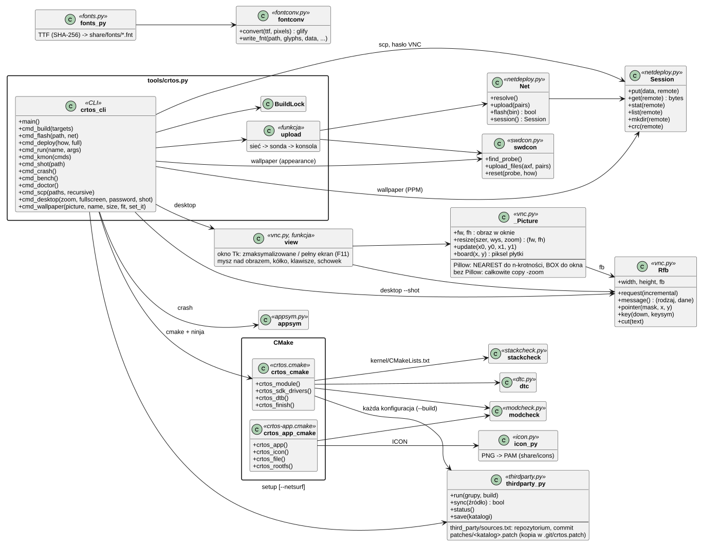
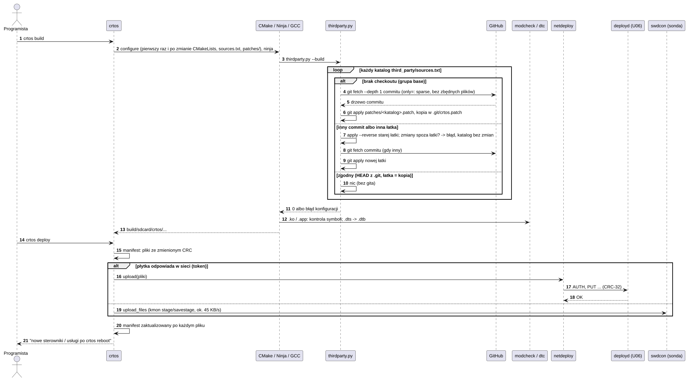
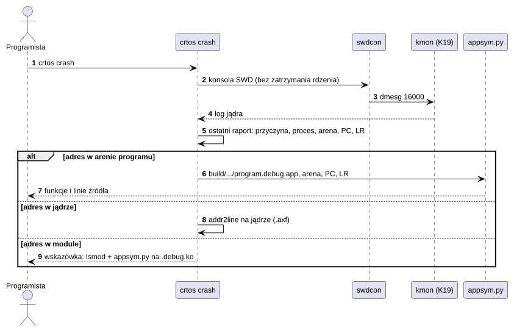

# T01 Narzędzia i budowanie

## 1. Identyfikacja

| | |
|---|---|
| Identyfikator | T01 |
| Warstwa | komputer (nie działa na płytce) |
| Pliki | `crtos`, `crtos.cmd` (uruchamiacze), `tools/*.py`, `cmake/*.cmake`, `CMakeLists.txt`, `dts/` (źródła drzewa urządzeń), `sdk/` (szablony i SDK programów), `third_party/sources.txt` (kod z zewnątrz), `patches/` (zmiany CRTOS w nim) |
| Wymaga | Python 3.8+ (z Tk dla `crtos desktop`), CMake 3.20+, Ninja, Arm GNU Toolchain 14.3.Rel1, Git i sieć (pierwsze pobranie kodu z zewnątrz), pyOCD (sonda), Pillow (zrzuty ekranu, skalowanie obrazu `crtos desktop`), opcjonalnie LinkServer, Java 11+ (diagramy) |

| Narzędzie | Rola |
|---|---|
| `tools/crtos.py` (`crtos`) | jedno polecenie do budowania, wgrywania, uruchamiania i diagnostyki ([Polecenie crtos](../../polecenie-crtos.md)) |
| `cmake/crtos.cmake`, `cmake/crtos-app.cmake`, `cmake/toolchain-arm-none-eabi.cmake` | funkcje `crtos_module`, `crtos_dtb`, `crtos_toolchain`, `crtos_finish`, `crtos_app` (także `ICON`), `crtos_icon`, `crtos_file`, `crtos_rootfs`; programy według `toolchain/crtos.specs` (T02) |
| `tools/dtc.py` | kompilator drzewa urządzeń DTS → DTB (FDT v17) i podgląd DTB |
| `tools/gen_pinfunc.py` | `dts/include/imxrt1050-pinfunc.h` z `fsl_iomuxc.h` SDK |
| `tools/modcheck.py` | kontrola symboli i relokacji modułów `.ko` i programów `.app` |
| `tools/stackcheck.py` | ostrzeżenia o ramkach stosu jądra większych niż strażnik MPU (256 B) |
| `tools/swdcon.py` | monitor jądra i szybkie wgrywanie przez sondę SWD (bez zatrzymywania rdzenia) |
| `tools/netdeploy.py` | klient `deployd` (U06): wykrywanie płytek, wgrywanie, `FLASH`, pobieranie plików i list katalogów (`crtos scp`) |
| `tools/vnc.py` | klient VNC (RFB 3.8) zdalnego pulpitu (`crtos desktop`, U08): uwierzytelnianie DES, dekodowanie Zlib, Raw i Hextile (RGB565), okno Tk (zmaksymalizowane albo pełny ekran, obraz skalowany do okna) z myszą, kółkiem, klawiaturą i schowkiem, jeden obraz do PNG |
| `tools/netbench.py` | klient testów przepustowości sieci (`crtos netbench`, D05): TCP i UDP w obie strony z programem `nettest` na płytce (A03), pomiar u odbiorcy |
| `tools/boardsrc.py` | źródła programów z plikami `Makefile` dla kompilatora na płytce (`build/src`, `crtos src`) |
| `tools/appsym.py` | adresy z raportu awarii → funkcje i linie programu albo modułu (także w bloku szybkiego kodu, `--fast`) |
| `tools/icon.py` | ikona programu: PNG → PAM RGBA do `share/icons/<nazwa>.pam` karty (sam Python z `zlib`, bez Pillow; `crtos_app(... ICON)`, `crtos_icon`) |
| `tools/appfast.py` | najgorętsze funkcje programu z listy (`crtos_app FAST`) → sekcje `.fast.*`, które loader umieszcza w ITCM (K16) |
| `tools/rescue.py` | odzyskanie dostępu debugera do płytki, której firmware go blokuje |
| `tools/fontconv.py` | czcionka TrueType → nagłówek Adafruit GFX albo plik `.fnt` wczytywany w czasie działania (L02) |
| `tools/fonts.py` | czcionki systemu: rodziny DejaVu Sans, Noto Sans, Liberation Sans, DejaVu Serif i DejaVu Sans Mono w rozmiarach skal interfejsu → `rootfs/share/fonts` (pliki `.fnt`, `families.txt`, licencje); źródła pobierane raz, przypięte SHA-256 |
| `tools/thirdparty.py` | kod z zewnątrz: płytkie checkouty gita commitów z `third_party/sources.txt` (grupa `base` przy każdej konfiguracji CMake, `netsurf` na życzenie), łatki z `patches/` (zdejmowane i nakładane przy zmianie commitu albo łatki), `--status`, `--save` |
| `tools/netsurf_prepare.py`, `nsmake.py` | przygotowanie budowania NetSurf (A02; źródła i łatki z `thirdparty.py netsurf`): nsgenbind budowany kompilatorem komputera i nim wiązania DOM z `.bnd` i Web IDL, skrypty przygotowujące strony jako osobne tablice w `polyfill.js.inc` (`page_scripts`) |
| `tools/diagrams.py` | rysowanie diagramów PlantUML tej dokumentacji (lokalnie) |

## 2. Odpowiedzialność

- Zbudowanie całego systemu jednym poleceniem: jądro (`.axf`/`.bin`), moduły `.ko`, drzewo
  urządzeń `.dtb`, usługi, programy, pliki `rootfs/` → `build/sdcard/crtos/`.
- Kontrole przy budowaniu: symbole modułów i programów (`modcheck.py`), ramki stosu jądra
  (`stackcheck.py`), plik `modules.alias` (`compatible` → moduł).
- Kod z zewnątrz (lwIP, TinyUSB, pdpmake, sterowniki NXP SDK; NetSurf): nie jest
  w repozytorium; przy każdej konfiguracji budowania pobranie brakujących checkoutów
  przypiętych commitów (`third_party/sources.txt`) i nałożenie zmian CRTOS (`patches/`).
- Wgranie jądra do flash (sonda: pyOCD, awaryjnie LinkServer; sieć: `flash --net`).
- Wgranie plików na kartę SD płytki: tylko zmienione (manifest CRC), przez sieć (`deployd`)
  albo przez sondę; alternatywnie na kartę włożoną do komputera (`crtos sdcard`).
- Diagnostyka: monitor jądra (`kmon`), log, zrzut ekranu, raport awarii z liniami kodu,
  uruchamianie programów z wyjściem na komputerze, pomiary (`crtos bench`), `doctor`.
- Praca z płytką przez sieć: kopiowanie plików w obie strony (`crtos scp`) i zdalny pulpit
  (`crtos desktop`, hasło VNC instalowane na płytce przez `deployd`).
- Tapeta z obrazu komputera (`crtos wallpaper`): zmniejszenie, zapis w formacie, który
  czyta płytka, wysłanie i ustawienie.

## 3. Wymagania

| ID | Wymaganie | Weryfikacja |
|---|---|---|
| REQ-T01-01 | Budowanie kończy się błędem, gdy moduł ma symbol nieeksportowany przez jądro ani inne moduły albo nieobsługiwany typ relokacji, oraz gdy program ma jakikolwiek niezdefiniowany symbol. | `modcheck.py` w każdym budowaniu |
| REQ-T01-02 | `crtos deploy` wysyła pliki, których CRC różni się od zapisanego w manifeście po ostatnim udanym wysłaniu; manifest jest aktualizowany po każdym potwierdzonym pliku. | użycie codzienne |
| REQ-T01-03 | `crtos deploy` pisze tylko pod `/sd/crtos/` na karcie (reszta karty nie jest zmieniana) i pod `/flash0/` (pliki z `build/flash0/`). | przegląd kodu (`deploy_files`: tylko `build/sdcard/crtos/` i `build/flash0/`), `deployd` REQ-U06-03 |
| REQ-T01-04 | Nie więcej niż jedno budowanie naraz w katalogu `build/` (blokada). | przegląd kodu (`BuildLock`) |
| REQ-T01-05 | Wszystkie narzędzia działają lokalnie – nie wysyłają kodu ani plików poza komputer i płytkę (PlantUML bez serwera; pobierają tylko `setup`, konfiguracja budowania – kod z zewnątrz z `third_party/sources.txt` – i `fonts.py`). | przegląd kodu |
| REQ-T01-06 | `crtos flash` przez sondę kasuje tylko sektory obrazu jądra (pyOCD `-e sector`): system plików `/flash0` zostaje. | `crtos flash` przy zapisanym `/flash0` (29.09.2026: pliki i dziennik bez zmian) |
| REQ-T01-07 | `crtos src` zapisuje tylko pod `/sd/crtos/src/`, a `Makefile` każdego programu kompiluje każdy plik z flagami, z jakimi kompiluje go `crtos build` (z `compile_commands.json`), poza `-g`, opcjami procesora i specs (je ma kompilator płytki) i `-O3` → `-O2` dla C++; stos i sterta programu są te same. | `crtos src --check` (każdy plik 40 programów się kompiluje), `paint` zbudowany na płytce: kod i dane tej samej wielkości co z komputera; przegląd kodu |
| REQ-T01-08 | `crtos scp` kopiuje tylko między komputerem a płytką (jedna strona to `board:ŚCIEŻKA`, `:ŚCIEŻKA` albo `IP:ŚCIEŻKA`; `C:/x` i `C:\x` są lokalne), przez `deployd` z tokenem i kontrolą CRC w obie strony; zapisuje na płytce tylko tam, gdzie pozwala `deployd` (REQ-U06-03), a katalogi wymagają `-r`. | `crtos scp -r` tam i z powrotem (identyczne pliki, nazwy ze spacjami, pusty katalog), odmowy (`/sd/snes`, `..`, `/dev`) (30.09.2026) |
| REQ-T01-09 | `crtos desktop` tworzy hasło VNC (8 losowych znaków, `secrets`) w `~/.crtos/vnc.passwd` i przed połączeniem sprawdza (CRC przez `deployd`), czy płytka ma to samo w `/sd/crtos/etc/vnc.passwd`, a jeśli nie – wysyła je; hasło nie jest wypisywane bez `--password`. | `crtos desktop --password` (instalacja), `crtos desktop --shot` (obraz jak `crtos shot`) |
| REQ-T01-10 | Bez `--zoom` obraz `crtos desktop` zajmuje największy wyśrodkowany prostokąt okna o proporcjach ekranu płytki, także po każdej zmianie wielkości okna i w pełnym ekranie (z Pillow w dowolnej skali, bez niego w największej całkowitej, która się mieści). Punkt okna trafia do płytki jako piksel widoczny pod nim. Naciśnięcie przycisku i kółko poza obrazem nie są wysyłane, a przeciągnięcie wychodzące poza obraz kończy się na jego brzegu. | `crtos desktop` na ekranie 1920×1080 (30.09.2026): okno zmaksymalizowane – obraz 1780×1009, pełny ekran – 1905×1080, bez Pillow – 1440×816 (3×), `--zoom 2` – 960×544; kliknięcie przez przeskalowany obraz otwiera i zamyka menu przyciskiem Apps płytki, kliknięcie i kółko na czarnym pasie – 0 komunikatów |
| REQ-T01-11 | `tools/icon.py` zapisuje PAM (`RGB_ALPHA`, 8 bitów) o boku najwyżej 64 px (`--size`): obraz niekwadratowy dostaje przezroczyste marginesy, a większy jest zmniejszany średnią z obszaru (kolory ważone przez alfa). Czyta PNG (8 i 16 bitów; szarość, RGB, paleta z `tRNS`, z alfą albo bez, bez przeplotu), PAM i PPM. Na inny plik kończy się błędem z komunikatem, a budowanie się przerywa. | ikony 13 programów zbudowane z PNG 64 × 64 (piksele PAM równe PNG, porównanie z Pillow), program z SDK z `ICON icon.png` z szablonu `crtos new` (30.09.2026) |
| REQ-T01-12 | `crtos desktop` prosi o obraz w formacie ekranu płytki (RGB565 little endian) i kodowaniach Zlib, Raw, Hextile (w tej kolejności); o następną aktualizację prosi zaraz po nagłówku poprzedniej (jedno żądanie naprzód), a okno przerysowuje zmiany najpóźniej co 5 ms, tylko w obszarach, które się zmieniły (bliskie prostokąty łączone). `--stats` wypisuje co sekundę liczbę aktualizacji i narysowanych klatek, czas rysowania jednej i przepływ danych. | `crtos desktop --stats` (02.10.2026, 800×480: animacja 59–60 aktualizacji/s i tyle samo klatek, ok. 1,3 ms na klatkę; przesuwanie okna 57–60 kl./s) |
| REQ-T01-13 | `crtos netbench` uruchamia na płytce `nettest` z liczbą testów i limitem 30 s bez klienta (program kończy się sam), mierzy przepustowość u odbiorcy, wysyła UDP do płytki w zadanym tempie i podaje straty datagramów, obciążenie procesora z drugiego z dwóch `kmon ps` w trakcie testu oraz przyrost liczników `eth0`. | `crtos netbench` (02.10.2026, wyniki w D05) |
| REQ-T01-14 | `crtos wallpaper OBRAZ` zmniejsza obraz (Pillow, proporcje zachowane) tak, żeby pokrywał `--size` (domyślnie 800×480) i nigdy go nie powiększa, zapisuje PPM w `build/wallpaper/`, wysyła go przez `deployd` tylko do `/sd/crtos/share/wallpapers/NAZWA.ppm` (nazwa z liter, cyfr, `-` i `_`, do 40 znaków) i – bez `--no-set` – ustawia przez `appearance` na płytce; gdy ustawienie się nie uda, mówi, że plik jest już na karcie. | na płytce 03.10.2026: obraz testowy 1024×640 → 800×500 PPM, tapeta w 101 ms (zrzut); plik testowy usunięty |
| REQ-T01-15 | `tools/fonts.py` przerywa pracę, gdy pobrany plik ma inną sumę SHA-256 niż przypięta; `tools/fontconv.py` zapisuje `.fnt` w formacie, który sprawdza `gfx_font_load` (REQ-L02-11), a dla tej samej czcionki i rozmiaru te same glify co nagłówek `.h`. | DejaVu 11 px: glify i bitmapy bajt w bajt jak `system/lib/libgfx` (03.10.2026); 57 plików, 119 KB; podgląd `--preview` |
| REQ-T01-16 | `crtos build --base` buduje tylko system bazowy (`kernel/`, `drivers/`, `system/`, `rootfs/`): konfiguracja z `CRTOS_BUILD_APPS`, `CRTOS_BUILD_TESTS`, `CRTOS_BUILD_EXAMPLES` = OFF, a zwykłe `crtos build` przywraca ON (konfiguracja ponawiana tylko przy zmianie wartości w `CMakeCache.txt`). `crtos build --rtos [KATALOG]` konfiguruje osobny `build/rtos` (`CRTOS_PROFILE=rtos`, `CRTOS_RTOS_APP`) i buduje sam obraz RTOS; `crtos flash --rtos` wgrywa go sondą (z `--net` odmawia: obraz nie ma sieci). | 03.10.2026: `--base` – 5 programów z oknem, 16 poleceń, 20 modułów; pełne budowanie – te same 167 plików karty i `/flash0` co przed przebudową katalogów; `--rtos` – `build/rtos/kernel/crtos.bin` 81 KB, wgrany sondą i uruchomiony |
| REQ-T01-17 | Budowanie używa kodu z zewnątrz wyłącznie z repozytoriów i commitów `third_party/sources.txt` ze zmianami wyłącznie z `patches/`: każda konfiguracja CMake uruchamia `thirdparty.py --build`, które pobiera brakujące katalogi grupy `base`, a katalog z innym commitem albo inną łatką przełącza (stara łatka zdjęta, nowy commit, nowa łatka); katalogu ze zmianami spoza łatki nie zmienia i kończy konfigurację błędem, tak samo przy łatce, która się nie nakłada. | 03.10.2026: pobranie wszystkich 29 katalogów, pełne budowanie z pobranych źródeł – 73 z 74 plików wynikowych (jądro, `.ko`, programy, NetSurf) identycznych bajt w bajt z budowaniem z kopii w repozytorium, obraz RTOS różni się tylko datą budowania; zmiana commitu pdpmake i powrót, usunięcie i przywrócenie łatki, odmowa przy własnej zmianie; przegląd kodu |

## 4. Interfejs udostępniany

Polecenia `crtos` (pełna lista: `crtos --help`, [Polecenie crtos](../../polecenie-crtos.md)):
`doctor`, `setup`, `build [--base] [--rtos [KATALOG]]`, `flash [--net] [--rtos]`, `sdcard`, `deploy`, `put`, `run`, `new`, `kmon`,
`serial`, `log`, `shot`, `reboot`, `scp [-r]`, `desktop [--fullscreen] [--zoom N] [--password] [--stats] [--shot PLIK]`,
`netbench [--time S] [--only TESTY] [--rate MBIT]`,
`wallpaper OBRAZ [--name N] [--size SZERxWYS] [--fit fill|fit|stretch|center|tile] [--no-set]`,
`find`, `crash`, `bench`, `sdk`, `src`, `toolchain` (T02), `clean`, `kbuild`.

Zmienne środowiska: `CRTOS_PROBE`, `CRTOS_PORT`, `CRTOS_HOST`, `CRTOS_GCC_BIN`,
`CRTOS_BUILD`, `CRTOS_DEVICE`, `CRTOS_PLANTUML`. Pliki użytkownika: `~/.crtos/deploy.token`,
`~/.crtos/board.host`, `~/.crtos/vnc.passwd`, `~/.crtos/tools/`.

Funkcje CMake – [Struktura projektu, rozdz. 3](../01-struktura-projektu.md#3-budowanie).

## 5. Interfejsy wymagane

U06 (`deployd`, TCP/UDP 5555), U08 (`vncd`, TCP 5900), A03 (`appearance` dla `crtos
wallpaper`), K19 (monitor jądra przez UART i przez kanał SWD
`g_swd_chan`), D07 (`MTD_IOC_KERNEL_UPDATE` przez `deployd`), sonda CMSIS-DAP (pyOCD),
Arm GNU Toolchain (gcc, ld, strip, readelf, nm, addr2line).

## 6. Struktura statyczna

*Źródło: [T01/struktura-statyczna.puml](../diagramy/T01/struktura-statyczna.puml)*

## 7. Zachowanie dynamiczne

### 7.1 Budowanie i wdrożenie

*Źródło: [T01/budowanie-i-wdrozenie.puml](../diagramy/T01/budowanie-i-wdrozenie.puml)*

### 7.2 Analiza awarii programu

*Źródło: [T01/analiza-awarii.puml](../diagramy/T01/analiza-awarii.puml)*

## 8. Implementacja

- `crtos.py` zawiera całą logikę poleceń; `swdcon.py` i `netdeploy.py` są ładowane dopiero
  przy potrzebie (brak pyOCD nie blokuje budowania).
- `thirdparty.py`: każdy wiersz `third_party/sources.txt` to katalog, repozytorium, commit
  i opcje (`only=` – sparse checkout tylko tych ścieżek z `--filter=blob:none`, `skip=` –
  katalogi pominięte, bo ich nazw nie dopuszcza Windows, `group=`). Pobranie to `git init`,
  `fetch --depth 1` commitu i `checkout FETCH_HEAD`, z `core.autocrlf=false` i `core.eol=lf`
  (pliki z końcami linii jak w repozytorium, niezależnie od ustawień gita komputera: `git
  apply` bez `--index` nie widzi atrybutów z indeksu, a sparse checkout pomija główny
  `.gitattributes`, więc pliki „text” z CRLF nie pasowałyby do łatek; starszy checkout, do
  którego łatka nie pasuje, jest raz zapisywany od nowa: `ls-files`, usunięcie,
  `checkout-index -a -u`). Łatka `patches/<katalog>.patch` jest
  nakładana przez `git apply`, a jej kopia trafia do `.git/crtos.patch` checkoutu. Kopia
  pozwala ją później zdjąć (`apply --reverse`), zanim katalog przejdzie na inny commit albo
  łatkę. Gdy commit (czytany wprost z `.git/HEAD`) i łatka się zgadzają, narzędzie nie woła
  gita i nic nie wypisuje (ok. 0,3 s na konfigurację). `--save` zapisuje `git diff
  --binary` commitu jako łatkę; `--status` pokazuje własne zmiany jako różnicę zmienionych
  linii względem nałożonej łatki. Sterowniki `fsl_*` są w katalogach bloków repozytoriów SDK;
  `CRTOS_SDK_DRIVER_DIRS` (`cmake/crtos.cmake`) wymienia wersje bloków i.MX RT1052, a
  `SDK_DRIVERS` szuka w nich pliku (`crtos_sdk_drivers`).
- Sonda: kanał `g_swd_chan` w pamięci jądra (bufory wejścia i wyjścia) obsługuje druga
  instancja monitora; pliki trafiają do bufora w RAM (`stage`), potem na kartę (`savestage`).
- Wgrywanie jądra przez sondę: pyOCD (12 MHz) + reset sprzętowy; przy błędzie LinkServer.
- `netdeploy.py` wysyła plik kawałkami po 64 KB: od Pythona 3.5 limit czasu jednego
  `sendall` obejmuje całe wysyłanie, a duży plik na `/flash0` (ok. 300 KB/s z kasowaniem)
  trwa dłużej. Na odpowiedź `OK` czeka 15 s plus 1 s na każde 100 KB, bo bufor nadawczy
  komputera mieści megabajty, które płytka zapisuje już po wysłaniu ostatniego bajtu.
- `boardsrc.py` (`crtos src`) składa w `build/src` katalog każdego programu drzewa: jego pliki,
  źródła spoza katalogu w podkatalogu nazwanym od ich katalogu (`make`: `pdpmake/`) i `Makefile`
  z flagami każdego pliku z `compile_commands.json`, bibliotekami, `-mxip` i miejscem
  docelowym z linii linkowania (`build.ninja`, a długich poleceń – `CMakeFiles/*.app-*.bat`)
  oraz stosem i stertą z `<nazwa>_appinfo.c` (na płytce `crtos-app set`). Katalogi nagłówków
  libcrtos, jądra i libgfx to na płytce `/sd/crtos/usr/include`, szukane po wszystkich `-I`;
  nagłówek z imiennikiem w katalogu projektu (np. `gfx.h` libgfx obok `gfx.h` emulatorów) jest
  kopiowany do podkatalogu projektu z `-I` w tym samym miejscu, więc kolejność wyszukiwania
  zostaje jak w drzewie. NetSurf jest pominięty; NES i SNES (od 30.09.2026, SNES z pamięcią
  emulowaną K20) budują się na płytce.
- `crtos toolchain native [kroki]` uruchamia `toolchain/native/build.sh` w Linuksie (WSL:
  `wsl --exec`, bez ponownego parsowania argumentów przez powłokę), a `crtos toolchain
  install` wysyła `build/toolchain/native/` jak `deploy` (manifest, tylko sieć) (T02).
- `appsym.py` odtwarza rozmieszczenie sekcji tak jak loader jądra (`elf_layout()`: kod,
  dane, bss w kolejności nagłówków) i podaje symbole z pliku `.debug`. Dla programu
  z sekcjami `.fast*` liczy oba bloki dzielonego obrazu i ich pule veneerów tak jak
  `elf_split_fast()`; adres bloku szybkiego kodu podaje raport awarii (`fast`), który
  `crtos crash` przekazuje dalej.
- `appfast.py` przemianowuje sekcje `.text.<symbol>` z listy (kolejno, do limitu `FAST_KB`)
  na `.fast.<symbol>` w pliku po `ld -r` (objcopy); symbole, których program nie ma, pomija
  z uwagą.
- `dtc.py` przepuszcza źródło przez preprocesor GCC (jak Linux), obsługuje etykiety,
  phandle, wyrażenia, `/delete-node/`.
- `crtos build`: opcje części drzewa (`OPTIONAL_PARTS`) i profilu są podawane CMake przy każdej
  konfiguracji (`-D...`); `configure()` porównuje je z `CMakeCache.txt` (`cache_value`) i
  konfiguruje ponownie tylko przy różnicy. Profil RTOS ma osobny katalog (`build/rtos`), więc
  budowanie systemu i RTOS nie przeszkadza sobie nawzajem; `kernel_file(ext, rtos)` wskazuje
  obraz.
- Katalogi programów (`PROGRAM_DIRS`): `system/apps`, `system/commands`, `system/services`,
  `apps`, `tests`, `examples` – szukanie celu po nazwie (`crtos build NAZWA`) i ścieżki na
  karcie (`crtos run NAZWA`). `crtos new` tworzy program zawsze w `apps/NAZWA` (miejsce na karcie
  z `DEST` szablonu: `apps`, `bin`, `sbin`).
- `crtos_app()` kompiluje i linkuje program z `-specs=toolchain/crtos.specs` oraz
  `-B`/`-L build/toolchain/arm-crtos/lib`. Biblioteki programów trafiają do tego katalogu
  (`crtos_toolchain()`), więc drzewo, SDK i `arm-crtos-gcc` budują programy tak samo (T02).
- `crtos_app(... ICON plik.png)` woła `crtos_icon(plik.png nazwa)`: reguła `tools/icon.py` →
  `<karta>/share/icons/<nazwa>.pam` (cel `icon_<nazwa>`). Ikonę `application` (programy bez
  własnej) daje `system/apps/wm/application.png`. Źródła ikon programów drzewa to `apps/*/icon.png`
  (64 × 64). Szablon `gui` (`crtos new`) ma własny `icon.png`, który `crtos new` kopiuje bez
  zmian (pozostałe pliki szablonu są tekstem z podstawieniami).
- `crtos sdk` instaluje katalog toolchainu razem z CMake, szablonami i narzędziami (także
  `icon.py` i `vnc.py`, więc `ICON` i `crtos desktop` działają poza drzewem); gdy jest
  kompilator C komputera, także `arm-crtos-gcc` i `crtos-app`.
- `crtos wallpaper`: Pillow otwiera dowolny obraz (JPEG, PNG...), zmniejsza go `LANCZOS`
  ze współczynnikiem `max(szer/W, wys/H)` (pokrycie, bez powiększania) i zapisuje PPM (P6),
  który `wallpaper.c` czyta wiersz po wierszu; resztę dopasowania robi płytka (`fit`).
  Wysyłanie przez `cmd_scp`, ustawienie przez konsolę SWD monitora (`run -w
  /sd/crtos/bin/appearance.app wallpaper … fit …`).
- `fonts.py`: dla każdej rodziny i skali `fontconv.convert` (zwykła i pogrubiona; rozmiary
  jak w `settings.c`: tekst 11/14/16/19/22 px, nagłówki 15/19/22/26/30, `mono` 10/12/15/17/20)
  i `write_fnt`. Format `.fnt`: `CRF1`, pierwszy i ostatni znak, wysokość linii, liczba glifów,
  rozmiar bitmap, rekordy glifów po 8 B (przesunięcie, szerokość, wysokość, przesunięcie
  kursora, xo, yo), bitmapy. Z archiwów (tar.bz2, tar.gz) brane są tylko potrzebne pliki TTF.
- `crtos netbench` (`netbench.py`): uruchamia `nettest` przez monitor jądra na konsoli SWD
  (`run … -n LICZBA_TESTÓW -t 30`), czeka, aż przyjmuje połączenia, i po kolei wykonuje testy
  `tcp-rx`, `tcp-tx`, `udp-rx`, `udp-tx` (`--only`). Mbit/s mierzy odbiorca: płytka przy
  `-rx`, komputer przy `-tx`. UDP do płytki idzie w zadanym tempie (`--rate`, domyślnie
  95 Mbit/s), bo szybciej i tak zgubiłby je przełącznik. W trakcie testu dwa razy `kmon ps`:
  pierwsze zeruje okno pomiaru CPU, drugie pokazuje wątki, które zajęły procesor. Na koniec
  różnica liczników `eth0` (`kmon net`).
- `crtos scp`: ścieżka płytki rozpoznawana wyrażeniem `^(board|IP)?:(.*)$` (litera dysku
  nie pasuje); ścieżki idą do `deployd` zakodowane `%XX` (`netdeploy.quote`); wysyłanie
  katalogu to `os.walk` z `MKDIR` każdego katalogu (także pustego) i `PUT` plików, pobieranie –
  `STAT`, rekurencyjne `LIST` i `GET` z kontrolą CRC.
- `crtos desktop` (`vnc.py`): klient RFB z DES w Pythonie (sprawdzony wektorem FIPS i
  OpenSSL), format pikseli ekranu płytki (RGB565 little endian: `vncd` wysyła piksele bez
  przeliczania, połowa danych 32 bitów), kodowania Zlib, Raw i Hextile.
  - Wątek sieci: pierwsze żądanie pełne, potem każde następne (przyrostowe) zaraz po
    nagłówku `FramebufferUpdate` – płytka koduje następną klatkę, gdy ta jeszcze płynie
    i jest rozpakowywana. Zlib: jeden `zlib.decompressobj` na połączenie; dane Zlib i Raw
    są czytane z sieci poza blokadą obrazu, a do bufora RGB565 trafiają pod nią (całe wiersze
    jednym przypisaniem wycinka).
  - Pętla Tk co 5 ms zbiera zmienione prostokąty i łączy te, które są do 16 px od siebie
    (`_regions`; ponad 12 obszarów – jeden wspólny), zamiast jednego prostokąta wokół
    wszystkich (wskaźnik w jednym rogu i zegar w drugim to cały ekran). Obszar trafia do
    Pillow jako `frombuffer('RGB', …, 'raw', 'BGR;16')` (RGB565 bez pętli w Pythonie).
    W Windows `timeBeginPeriod(1)` na czas okna: bez niego czekanie Tk 5 ms trwa 15,6 ms.
  - `--stats` wypisuje co sekundę: aktualizacje/s, narysowane klatki/s, ms na klatkę, KB/s.
  - Okno otwiera się zmaksymalizowane (`--fullscreen` albo F11: pełny ekran; F11 nie idzie do
    płytki). Obraz jest przeliczany przy każdej zmianie wielkości okna; zdarzenia `<Configure>`
    z 60 ms są zbierane w jedno. Proces jest świadomy DPI (Windows), więc piksele okna to
    piksele ekranu.
  - Skalowanie „ostre” (klasa `_Picture`, Pillow): obraz płytki powiększony powtórzeniem
    pikseli (`NEAREST`) do najbliższej całkowitej wielokrotności wielkości okna, a potem
    uśredniony w dół (`BOX`). Krawędzie zostają ostre przy dowolnej skali, bez nierównych
    pikseli samego `NEAREST`. Tk `copy -zoom/-subsample` nie nadaje się do skali ułamkowej
    (`-subsample` pomija piksele).
  - Zmieniony prostokąt jest skalowany osobno: `resize` z argumentem `box` daje te same piksele
    co skalowanie całego obrazu. Łata z marginesem 1 piksela (zasięg filtra) trafia do obrazu
    Tk przez `copy -to`.
  - Bez Pillow obraz ma największe całkowite powiększenie, które się mieści (PPM przez
    `PhotoImage.put` i `copy -zoom`).
  - Mysz: punkt okna minus przesunięcie obrazu, podzielony przez skalę, daje piksel płytki.
    Naciśnięcie i kółko liczą się tylko nad obrazem. Lewy przycisk działa jak palec, kółko
    idzie jako przyciski 4/5 (po 120 jednostek delty Windows). Ruch jest wysyłany tylko wtedy,
    gdy wskaźnik trafia na inny piksel płytki; bez przycisku tylko nad obrazem (`vncd` robi
    z niego `GFX_PTR_HOVER`: podpowiedzi paska zadań).
  - Klawisze idą jako keysym X11 (klawisze Windows jako Super). Przy utracie fokusu okna
    wszystkie trzymane klawisze są puszczane.
  - Schowek komputera jest wysyłany po powrocie fokusu, a schowek płytki trafia do schowka
    komputera.

## 9. Obsługa błędów i mechanizmy bezpieczeństwa

| Sytuacja | Reakcja |
|---|---|
| brak narzędzia (CMake, GCC, pyOCD) | komunikat z poleceniem instalacji (`crtos doctor`, `crtos setup`) |
| sieć nie działa / zły token | przejście na sondę; sonda instaluje nowy token |
| błąd wgrywania pliku | plik nie trafia do manifestu (zostanie wysłany ponownie) |
| płytka nie wróciła po `flash --net` (30 s) | komunikat: naprawa przez `crtos flash` (sonda) |
| pyOCD nie wgrał jądra | próba LinkServerem, potem błąd |
| błąd symboli / relokacji | błąd budowania (plik nie trafia na kartę) |
| `thirdparty.py`: brak gita albo sieci przy brakującym katalogu, łatka się nie nakłada | błąd konfiguracji CMake („third_party: the sources are not complete”), komunikat przy katalogu |
| `thirdparty.py`: katalog ze zmianami spoza łatki, a commit albo łatka się zmieniły | katalog zostaje bez zmian (łatka z powrotem nałożona), błąd konfiguracji: zapisać (`--save`) albo odrzucić |
| `thirdparty.py`: katalog istnieje, ale nie jest checkoutem gita | zostaje bez zmian, błąd konfiguracji |
| `crtos scp`: plik zmieniony w drodze / odmowa `deployd` | błąd z komunikatem płytki (CRC, `path not allowed`), plik lokalny nie jest zapisywany |
| `crtos desktop`: płytka bez hasła, złe hasło | hasło instalowane przez `deployd`; komunikat z powodem odmowy `vncd` |
| `crtos wallpaper`: brak Pillow, obraz nieczytelny, zła `--size` | komunikat, nic nie jest wysyłane |
| `crtos wallpaper`: `appearance` się nie uruchomił (brak na karcie) | komunikat: plik jest na karcie, wybór w Settings albo po `crtos deploy` |
| `fonts.py`: inna suma SHA-256 pobranego pliku | koniec z błędem, nic nie jest zapisywane |

## 10. Konfiguracja

Zmienne środowiska (rozdz. 4), `CMakeLists.txt` (lista modułów, programów, `crtos_dtb`),
`third_party/sources.txt` (repozytoria i commity kodu z zewnątrz, grupy `base` – także newlib
i źródła GCC bibliotek XIP (T02) – i `netsurf`; wpis może ciągnąć się przez linie zakończone `\`),
`patches/` (zmiany CRTOS w nim), `CRTOS_SDK_DRIVER_DIRS` w `cmake/crtos.cmake` (katalogi
sterowników NXP SDK układu), `tools/requirements.txt` (pakiety Pythona).

## 11. Weryfikacja

- Używane przy każdej zmianie systemu (budowanie, `deploy`, `run apptest`, `bench`,
  `crash`); `crtos doctor` sprawdza środowisko.
- Klasyfikacja narzędzi wg ISO 26262-8 rozdz. 11: [04 Weryfikacja](../04-weryfikacja.md).

## 12. Ograniczenia i znane problemy

- Brak testów automatycznych samych narzędzi (sprawdzane przez użycie).
- Token `deployd` jest przechowywany jawnym tekstem w `~/.crtos/deploy.token`, hasło VNC –
  w `~/.crtos/vnc.passwd`.
- `crtos desktop` przerysowuje okno do ok. 60 razy na sekundę (mały obszar ok. 1,3 ms);
  zmiana całego ekranu 800×480 kosztuje w oknie 1920×1080 ok. 33 ms (rozpakowanie,
  przeliczenie i przeskalowanie, Pillow), więc obraz całego ekranu (gra) to w przeglądarce
  najwyżej ok. 30 kl./s także wtedy, gdy płytka nadąża.
- Bez Pillow obraz `crtos desktop` rośnie tylko o całkowitą wielokrotność (na ekranie
  1920×1080: 3×, 1440×816).
- Kompilator i pyOCD nie są kwalifikowane (zob. klasyfikacja w 04).
- Pierwsze budowanie potrzebuje gita i dostępu do GitHuba (około 60 MB; NetSurf około
  110 MB). Później budowanie działa bez sieci, dopóki commity i łatki się nie zmienią.
- Zmiana `only=` albo `skip=` przy tym samym commicie nie przebudowuje checkoutu: wtedy usuń
  katalog, a następne budowanie pobierze go od nowa.
- BSP płytki z MCUXpresso IDE (`kernel/platform/evkbimxrt1050`: startup, CMSIS, część
  sterowników `fsl_*`, FatFs) zostaje w repozytorium, bo z niego buduje projekt IDE
  (`crtos kbuild`).
- `crtos wallpaper` ustawia tapetę przez sondę SWD (monitor jądra); bez sondy obraz trafia na
  kartę, a wybiera się go w Settings.
