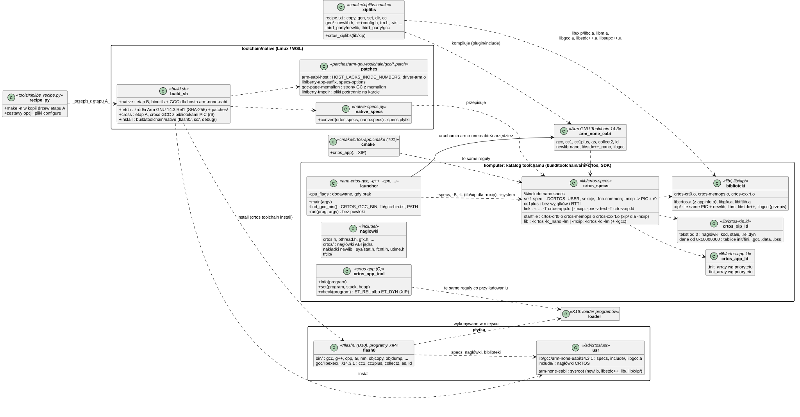
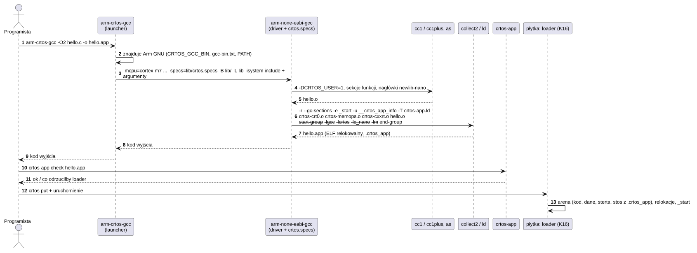
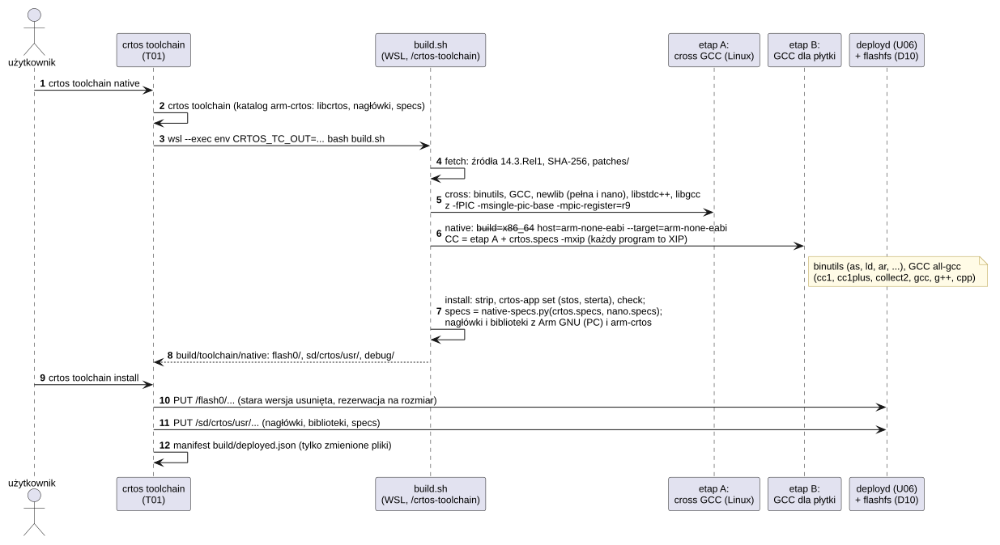
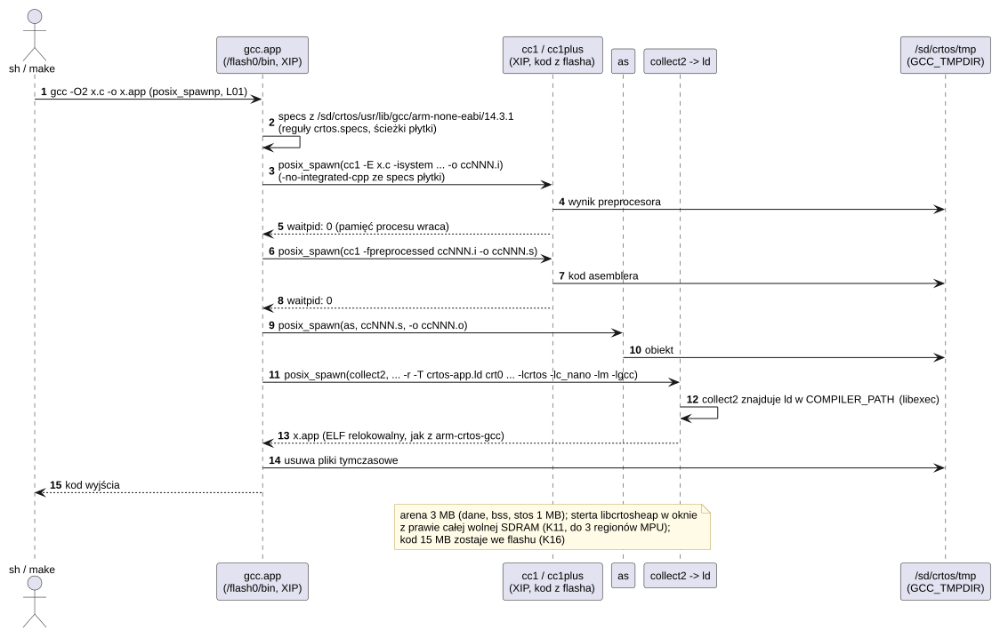
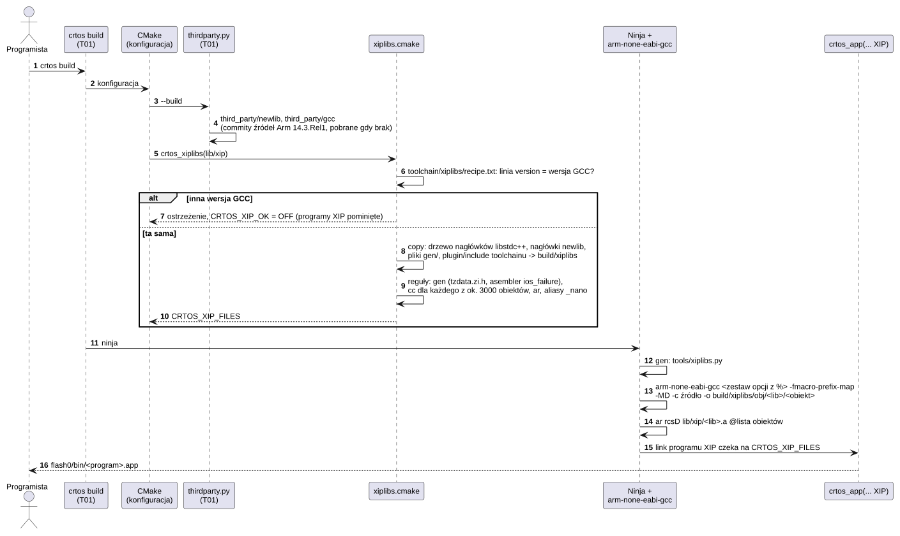

# T02 Toolchain CRTOS

## 1. Identyfikacja

| | |
|---|---|
| Identyfikator | T02 |
| Warstwa | komputer (toolchain krzyżowy); na płytce (L3): `crtos-app` i kompilator natywny (GCC i binutils jako programy XIP) |
| Pliki | `toolchain/crtos.specs`, `toolchain/crtos-app.ld`, `toolchain/crtos-xip.ld`, `toolchain/launcher.c`, `toolchain/crtos-app.c`, `system/lib/libcrtos/src/appinfo.c`; kompilator natywny: `toolchain/native/build.sh`, `toolchain/native/native-specs.py`, `patches/arm-gnu-toolchain/`; biblioteki XIP: `toolchain/xiplibs/` (`recipe.txt`, `gen/`), `cmake/xiplibs.cmake`, `tools/xiplibs.py`, `tools/xiplibs_recipe.py`; budowanie: `crtos_toolchain()` w `cmake/crtos.cmake`, `crtos toolchain [native\|install]` w `tools/crtos.py`; na płytce `system/commands/crtos-app` |
| Wynik | `build/toolchain/arm-crtos/{bin,lib,lib/xip,include}` (w SDK ten sam układ); `build/toolchain/native/{flash0,sd,debug}` |
| Wymaga | Arm GNU Toolchain 14.3.Rel1 (`arm-none-eabi-gcc`, newlib-nano, libstdc++_nano, libgcc); kompilator C komputera (tylko do zbudowania launcherów); `lib/xip`: źródła newlib i GCC z `third_party/` oraz `plugin/include` Arm GNU Toolchain 14.3.Rel1; dla kompilatora natywnego (i nowego przepisu `lib/xip`): Linux albo WSL z `build-essential`, `texinfo`, `bison`, `flex`, `python3`, ok. 10 GB miejsca |

Instrukcja dla użytkownika: [Toolchain](../../toolchain.md).

## 2. Odpowiedzialność

- **Jedna definicja programu CRTOS** (`crtos.specs`): opcje kompilacji, nagłówki newlib-nano,
  linkowanie częściowe (`ld -r`), obiekty startowe, biblioteki. Używają jej budowanie drzewa
  (T01, `crtos_app`), SDK i `arm-crtos-gcc`.
- **`arm-crtos-<narzędzie>`**: uruchamia `arm-none-eabi-<narzędzie>`. Kompilatorom (`gcc`, `g++`,
  `c++`, `cpp`) dokłada opcje procesora i katalog toolchainu.
- **Katalog toolchainu**:
  - biblioteki programów (L01, L02);
  - obiekty startowe;
  - nagłówki interfejsu dla programów: bez wewnętrznych nagłówków jądra.
- **Nagłówek programu** (`.crtos_app`):
  - domyślny w libcrtos;
  - makro `CRTOS_APP(stos, sterta)`;
  - zmiana w gotowym pliku (`crtos-app set`).
- **Kolejność konstruktorów**: `crtos-app.ld` łączy `.init_array.NNNNN` z `.init_array`
  według priorytetu. Loader K16 uruchamia tylko sekcję `.init_array`.
- **Kontrola programu przed wgraniem** (`crtos-app check`): te same reguły co loader K16,
  dla programów relokowalnych i XIP.
- **Programy wykonywane w miejscu** (`-mxip`, `crtos_app(... XIP)`): kod niezależny od
  położenia z danymi przez GOT w r9, `crtos-xip.ld` (tekst od 0, dane od `0x10000000`),
  biblioteki PIC w `lib/xip` (K16 ładuje ten format). Biblioteki C i C++ (newlib, libm,
  libgcc, libstdc++, libsupc++) buduje `crtos build` z przepisu `toolchain/xiplibs`, bez WSL.
- **Kompilator natywny** (`toolchain/native`): GCC 14.3 (C, C++) i binutils 2.44, które
  działają na płytce jako programy XIP z `/flash0` i budują programy według tych samych
  reguł co `arm-crtos-gcc`:
  - etap A: GCC krzyżowy dla Linuksa, którego newlib, libstdc++ i libgcc są PIC (r9);
  - etap B: binutils i GCC dla hosta `arm-none-eabi` zbudowane etapem A z `crtos.specs
    -mxip` (każdy program to program XIP);
  - instalacja: programy (strip, stos i sterta w nagłówku), `specs` płytki
    (`native-specs.py`), nagłówki i biblioteki (te same co `arm-crtos-gcc`) jako drzewo
    plików płytki, wysyłane przez `deployd`.
- **Pamięć kompilatora na płytce**: każdy program etapu B linkuje `libcrtosheap` (L01): sterta
  rośnie ponad małą arenę w jedno okno pamięci współdzielonej z prawie całej wolnej SDRAM
  (K11: obiekt z kilku regionów MPU). Kompilacja idzie w osobnych procesach, każdy zwalnia
  pamięć przed następnym: preprocesor (`cc1 -E`, `-no-integrated-cpp` w specs płytki),
  kompilacja pliku po preprocesorze, asembler, linker; ich pliki pośrednie leżą na karcie
  (`/sd/crtos/tmp`), a nie na RAM-dysku, który zabierałby tę samą SDRAM. Garbage collector GCC
  bierze strony przez `memalign` (bez strony straconej na wyrównanie w każdej grupie).

## 3. Wymagania

| ID | Wymaganie | Weryfikacja |
|---|---|---|
| REQ-T02-01 | Program zbudowany przez `arm-crtos-gcc`/`arm-crtos-g++`, przez `crtos_app()` w drzewie albo przez SDK powstaje według tych samych reguł (`crtos.specs`): ELF relokowalny ze wszystkim wlinkowanym, wejściem `_start` i nagłówkiem `.crtos_app`. | test na płytce: `hello.c` i `hello.cpp` z `arm-crtos-gcc`/`g++`; budowa całego drzewa, apptest, sumy kontrolne programów |
| REQ-T02-02 | Konstruktory z priorytetem wykonują się przed `main` w kolejności priorytetów, przed konstruktorami bez priorytetu. | test na płytce (`hello.cpp`: `init_priority(200)` przed domyślnym) |
| REQ-T02-03 | Programy kompilują się z nagłówkami newlib-nano zgodnymi z linkowaną `libc_nano` (`nano.specs`). | przegląd kodu (`crtos.specs`), apptest (1720 sprawdzeń) |
| REQ-T02-04 | Launcher dodaje każdą opcję procesora tylko wtedy, gdy użytkownik jej nie podał, i przekazuje argumenty bez zmian, bez powłoki ani `cmd.exe`. | przegląd kodu, test z argumentem zawierającym `>` i `&` (PowerShell) |
| REQ-T02-05 | `crtos-app check` kończy się kodem różnym od zera, gdy program ma symbol niezdefiniowany (poza `__exidx_start/end`) albo COMMON, nieobsługiwany typ relokacji, brak `_start` w trybie Thumb, wyrównanie sekcji ponad 4 KB albo nagłówek poza limitami loadera. | test: wszystkie programy drzewa (ok), program bez biblioteki (błąd), na komputerze i na płytce |
| REQ-T02-06 | Katalog `include/` toolchainu zawiera z `kernel/include/crtos` tylko nagłówki interfejsu programów (`CRTOS_ABI_HEADERS`). | przegląd kodu (`cmake/crtos.cmake`) |
| REQ-T02-07 | Program zbudowany z `-mxip` (albo `crtos_app(... XIP)`) jest statycznym PIE z dwoma segmentami `crtos-xip.ld`, bez relokacji w tekście (`-z text`) i z relokacjami dynamicznymi tylko `R_ARM_RELATIVE`; wszystkie jego obiekty, także biblioteki z `lib/xip`, adresują dane przez GOT w r9. | `crtos-app check` (XIP), `xiptest` i `apptest_xip` z `/flash0` i z karty, wszystkie programy kompilatora natywnego |
| REQ-T02-08 | Kompilator natywny powstaje wyłącznie ze źródeł Arm GNU Toolchain 14.3.Rel1 o sprawdzonej sumie SHA-256 i z poprawek z `patches/arm-gnu-toolchain/` (`crtos toolchain native`). | przegląd kodu (`build.sh fetch`) |
| REQ-T02-09 | `gcc`/`g++` na płytce budują program według reguł `crtos.specs` (te same opcje, obiekty startowe, biblioteki, skrypty linkera, `-mxip`), z nagłówkami i bibliotekami tymi samymi co `arm-crtos-gcc`; jedyna różnica to domyślny standard C++ (`gnu++14`). | test na płytce (29.09.2026): `hello.c`, program C++, `sh.c`, projekt `make`, `-mxip`; `crtos-app check` wyników; przegląd kodu (`native-specs.py`) |
| REQ-T02-11 | Żaden program etapu B nie zawiera `malloc` newlib: wszystkie linkują `libcrtosheap` (`-Wl,-u,malloc -lcrtosheap` w `LDFLAGS` etapu B). | `nm` `cc1`, `cc1plus`, `xgcc`, `collect2`, `as`, `ld` (brak `__malloc_av_`, jest `grow_brk_by`) |
| REQ-T02-12 | Kompilator na płytce zapisuje pliki pośrednie (wynik preprocesora, asemblera, pliki `collect2`) w `$GCC_TMPDIR`, a bez niej w `/sd/crtos/tmp`; `TMPDIR` (RAM-dysk) dopiero, gdy żadnego z nich nie ma. | kompilacja na płytce (`cc*.ii` w `/sd/crtos/tmp`), przegląd poprawki `libiberty-tmpdir.patch` |
| REQ-T02-13 | Na płytce preprocesor jest osobnym przebiegiem (`-no-integrated-cpp` w `self_spec` specs płytki), a wynik kompilacji jest taki sam jak z jednym przebiegiem. | `paint` zbudowany na płytce po zmianie: kod i dane jak z komputera; `cc1plus -E` 4,6 MB szczytu dla `snes_core.cpp` |
| REQ-T02-14 | Kompilator na płytce kończy kompilację pliku, którego sterta nie mieści się w wolnej SDRAM: reszta sterty trafia do pamięci emulowanej (`libcrtosheap`, L01; K20), a program zbudowany w ten sposób działa tak samo jak zbudowany na komputerze. | cały SNES zbudowany na płytce (29 plików, 7 z pamięcią emulowaną, szczyt 25 MB): sumy kontrolne obrazu i dźwięku jak z komputera (Zelda, Yoshi) |
| REQ-T02-10 | Każdy plik instalacji kompilatora natywnego ma na płytce ścieżkę mieszczącą się w limicie VFS (najwyżej 122 znaki z przyrostkiem `.part`); inaczej instalacja się nie kończy. | `build.sh install` (kontrola długości) |
| REQ-T02-15 | Biblioteki C i C++ programów XIP (`lib/xip/libc.a`, `libm.a`, `libgcc.a`, `libstdc++.a`, `libsupc++.a`) buduje `crtos build` kompilatorem Arm GNU Toolchain z komputera, bez WSL. Każdy obiekt powstaje ze źródeł newlib i GCC z commitów źródeł tego toolchainu (`third_party/sources.txt`) z opcjami przepisu `toolchain/xiplibs/recipe.txt`. Gdy wersja GCC różni się od wersji przepisu, programy XIP są pomijane z ostrzeżeniem. | porównanie z bibliotekami etapu A (04.10.2026: 3050 z 3057 obiektów identycznych, pozostałe – ścieżki `assert` i nieaktualny obiekt etapu A); `.text` programów XIP bez zmian |

## 4. Interfejs udostępniany

| Element | Opis |
|---|---|
| `arm-crtos-gcc`, `arm-crtos-g++`, `arm-crtos-c++`, `arm-crtos-cpp` | kompilatory programów CRTOS (wszystkie opcje GCC) |
| `arm-crtos-{as,ld,ar,nm,ranlib,objcopy,objdump,readelf,size,strip,strings,addr2line,gdb}` | narzędzia binutils i gdb bez zmian argumentów |
| `crtos-app info/set/check` | nagłówek, pamięć, kontrola programu (komputer i płytka) |
| `CRTOS_APP(stos, sterta)` | makro nagłówka programu (`crtos.h`, L01) |
| `crtos toolchain` | budowa katalogu toolchainu i launcherów (T01) |
| `-mxip` | opcja `arm-crtos-gcc` i `gcc` na płytce: program XIP |
| `crtos toolchain native [fetch\|cross\|native\|install]` | kompilator natywny (w WSL/Linuksie) |
| `crtos toolchain install [--full] [--dry-run]` | kompilator natywny na płytkę (sieć, `deployd`) |
| na płytce: `gcc`, `g++`, `cpp`, `ar`, `ranlib`, `nm`, `objcopy`, `objdump`, `strip`, `size`, `readelf`, `addr2line`, `strings` | `/flash0/bin` |
| `CRTOS_GCC_BIN` | katalog Arm GNU Toolchain (zmienna środowiska) |

## 5. Interfejsy wymagane

- Arm GNU Toolchain 14.3.Rel1:
  - driver GCC z plikami specs (`self_spec`, `%include`, `%s`, `%:replace-outfile` z `nano.specs`);
  - multilib `thumb/v7e-m+dp/hard`.
- L01 (libcrtos, crt0, memops, cxxrt) i L02 (libgfx, TFTLIB).
- K16: format programu (relokowalny i XIP) i reguły loadera, które `crtos-app check`
  powtarza.
- T01: `crtos`, CMake; U06 i D10: instalacja kompilatora natywnego na `/flash0`
  i `/sd/crtos/usr`.
- L01 na płytce: `posix_spawn`, `waitpid`, `pathconf`, `realpath`, pliki tymczasowe
  w `$TMPDIR` (sterownik GCC uruchamia `cc1`, `as` i `collect2` przez libiberty `pex`).

## 6. Struktura statyczna

*Źródło: [T02/struktura-statyczna.puml](../diagramy/T02/struktura-statyczna.puml)*

## 7. Zachowanie dynamiczne

### 7.1 Kompilacja programu

*Źródło: [T02/kompilacja-programu.puml](../diagramy/T02/kompilacja-programu.puml)*

### 7.2 Budowa i instalacja kompilatora natywnego

*Źródło: [T02/budowa-kompilatora-plytki.puml](../diagramy/T02/budowa-kompilatora-plytki.puml)*

### 7.3 Kompilacja na płytce

*Źródło: [T02/kompilacja-na-plytce.puml](../diagramy/T02/kompilacja-na-plytce.puml)*

### 7.4 Budowanie bibliotek XIP

*Źródło: [T02/biblioteki-xip.puml](../diagramy/T02/biblioteki-xip.puml)*

## 8. Implementacja

- **Opcje procesora** podaje launcher (i CMake) w linii poleceń. `self_spec` z pliku
  użytkownika działa dopiero po domyślnych opcjach sterownika (`-mcpu=arm7tdmi -marm
  -mfloat-abi=soft`), więc nie wybrałby właściwego multilibu.
- **Link**: `crtos.specs` dodaje `-r` w specyfikacji `link`, a nie jako opcję sterownika. Dlatego
  sterownik dalej dołącza obiekty startowe (`%S`) i biblioteki (`link_gcc_c_sequence`).
  Opcja `-r` podana przez użytkownika daje zwykły obiekt częściowy.
- **`crtos-cxxrt.o` jest zawsze linkowany**, więc `operator new` z libcrtos wygrywa
  z libstdc++_nano (bez wyjątków). Dla programów w C `--gc-sections` usuwa niepotrzebne
  części.
- **Domyślny nagłówek** (`appinfo.c`) jest osobnym członem `libcrtos.a`. Linker dołącza go przez
  `-u __crtos_app_info` tylko wtedy, gdy program nie ma własnego. `CRTOS_APP()` w C++
  deklaruje symbol z `extern "C"`, bo stała globalna w C++ nie miałaby wiązania
  zewnętrznego.
- **`crtos-app`** czyta plik kawałkami: nagłówki, symbole i po jednej tablicy relokacji.
  Relokacje sekcji niealokowanych (debug) pomija, tak jak loader.
- **Launcher** to jeden program pod wieloma nazwami. Nazwę narzędzia bierze z własnej nazwy,
  a katalog toolchainu z własnej ścieżki (`<root>/bin`).
  - Windows: `CreateProcess` z cytowaniem argumentów według reguł biblioteki C.
  - Linux i macOS: `execv`.
- **`-mxip`** w `self_spec` zamienia się na `-fPIC -msingle-pic-base -mpic-register=r9
  -mno-pic-data-is-text-relative -D__CRTOS_XIP__=1` i znika (`%<mxip`); dalej specs
  rozpoznają tryb po `-msingle-pic-base`: `-pie --no-dynamic-linker -z text -z
  max-page-size=4096 -T crtos-xip.ld`, obiekty startowe z `xip/`, pełna newlib (`%lld`).
  Launcher (i CMake) dodają wtedy `-L<root>/lib/xip` przed `-L<root>/lib`.
- **Etap A** (`build.sh cross`): binutils, GCC, newlib pełna (wejście/wyjście `long long`
  i C99, `register-fini`) i nano, libstdc++ i libgcc dla jednego wariantu (Cortex-M7, FPU
  podwójnej precyzji, hard float, Thumb), wszystkie biblioteki z flagami PIC-r9. Etap B
  linkuje swoje programy z nimi.
- **Biblioteki XIP drzewa** (`cmake/xiplibs.cmake`): `lib/xip/libc.a`, `libm.a`, `libgcc.a`,
  `libstdc++.a`, `libsupc++.a` (i `_nano` C++ jako kopie). Powstają kompilatorem Arm GNU
  Toolchain z komputera, każdy z ok. 3000 obiektów osobną regułą Ninja (z plikiem
  zależności), ze źródeł `third_party/newlib` i `third_party/gcc`. Te źródła to commity
  pakietu źródeł Arm 14.3.Rel1 (newlib `364226a`, GCC `b588d02`; w `libgcc`, `libstdc++-v3`
  i `include` identyczne z pakietem plik po pliku). Przepis `toolchain/xiplibs/recipe.txt`
  podaje dla każdego obiektu źródło i opcje w postaci zestawów (`set ... %`, `cc`), pliki
  kopiowane przed kompilacją (drzewo nagłówków libstdc++, nagłówki newlib) i dwa pliki
  generowane przez `tools/xiplibs.py` (`tzdata.zi.h`, asembler `cxx11-ios_failure`
  z przemianowaną tablicą `type_info`). Nagłówki GCC takie same jak w instalacji bierze
  z `plugin/include` toolchainu, a `__FILE__` jest względne wobec repozytorium
  (`-fmacro-prefix-map`).
- **Przepis** tworzy `tools/xiplibs_recipe.py` z etapu A. Polecenia pochodzą z `make -n`
  w kopii jego drzew budowania, a obiekty o tej samej nazwie rozstrzyga porównanie bajtów
  z archiwum. Z opcji usuwa `-g` i ostrzeżenia oprócz `-Wabi=2`, które zmienia aliasy
  zgodności nazw C++. Ścieżki zamienia na `@N`/`@G`/`@B`/`@T`/`@X`, a pliki wygenerowane
  przez `configure` zapisuje w `gen/`, z dołączeniami po ścieżce bezwzględnej zamienionymi
  na względne.
- **Etap B** (`build.sh native`): „crossed native” `--build=x86_64-pc-linux-gnu
  --host=arm-none-eabi --target=arm-none-eabi`. Kompilatory hosta to skrypty wołające etap A
  z `crtos.specs -mxip`. Ścieżki na płytce: `--prefix=/sd/crtos/usr --bindir=/flash0/bin
  --libexecdir=/flash0/gcc/libexec --with-sysroot=/sd/crtos/usr/arm-none-eabi` (binutils też
  z tym sysrootem, bo sterownik przekazuje `--sysroot` do `ld`). `bindir` równe katalogowi
  sterownika sprawia, że prefiksy wyliczane z `argv[0]` (`make_relative_prefix`) prowadzą
  w te same miejsca. Wyłączone: LTO, pluginy, NLS, ISL, `fixincludes` (nagłówki GCC są
  z pakietu Arm), `gcov` (potrzebuje `ftw`).
- **Poprawki źródeł** (`patches/arm-gnu-toolchain/gcc/*.patch`, nakładane w `fetch`, znacznik
  `.patched-*`). `arm-eabi-host.patch`: host `arm*-*-eabi*` w `config.host` z `HOST_LACKS_INODE_NUMBERS`
  (systemy plików CRTOS nie mają numerów i-węzłów, więc katalogi nagłówków porównuje się po
  nazwie kanonicznej) i `driver-arm.o` (`-mcpu=native`, którego sterownik ARM wymaga na
  hoście ARM).
- **Co etap B wymusił w libcrtos** (L01): `lstat` w nakładce `sys/stat.h`, `pathconf`,
  `O_BINARY` = 0 (nakładka `fcntl.h`), `fnmatch`/`glob`/`basename` w osobnych obiektach
  (libiberty ma własne).
- **Specs płytki** (`native-specs.py`): GCC nie przyjmuje `%include` ani `%rename` w swoim
  głównym pliku `specs`, więc skrypt rozwija `crtos.specs` i potrzebne części `nano.specs`:
  spec zbudowany na wbudowanym dostaje postać `+ ...` (dopisanie). Dochodzą `-isystem
  /sd/crtos/usr/include`, `-L%R/lib/xip` dla `-mxip`, domyślne `-std=gnu++14` dla C++
  i parametry odśmiecania GCC dla małej pamięci (`ggc-min-expand=30`,
  `ggc-min-heapsize=4096`).
- **Pozostałe poprawki GCC**: `libiberty-app-suffix.patch` (sterownik szuka siebie w `PATH`
  także jako `NAZWA.app`, jak `.exe` na Windows; bez tego wywołany jako `gcc` liczył prefiksy
  względem bieżącego katalogu), `specs-options.patch` (opcje obsłużone w głównym pliku
  `specs` są poprawne jak z pliku `-specs=`; bez tego `-mxip` było odrzucane),
  `ggc-page-memalign.patch` (strony garbage collectora z `memalign`, nagłówek grupy za
  stronami: każda z 16 stron grupy użyteczna, zamiast 15; duży obiekt bez dodatkowej strony)
  i `libiberty-tmpdir.patch` (`choose_tmpdir`: `GCC_TMPDIR`, `/sd/crtos/tmp`, dopiero potem
  `TMPDIR`).
- **Pamięć** (`build.sh`): `LDFLAGS="-Wl,-u,malloc -lcrtosheap"` etapu B (`-u` wciąga
  `libcrtosheap`, zanim cokolwiek poprosi libc o `malloc`; libiberty jest w linii linkowania
  za `LIBS`); specs płytki: `-no-integrated-cpp` w `self_spec`. Zmierzone w WSL (etap A,
  x86-64, biblioteka `LD_PRELOAD` śledząca `malloc` i `mmap`): osobny preprocesor oszczędza
  w plikach C++ z nagłówkami biblioteki ok. 1,3 MB `malloc` i 1,4 MB sterty GC, w C ok.
  0,3 MB; parametry GC, GCSE (`max-gcse-memory`) i VRP szczytu nie zmieniają.
- **Nagłówki libstdc++** leżą w `/sd/crtos/usr/include/c++/14.3.1`, bo GCC z host = target
  szuka ich pod prefiksem, a nie w sysroot.
- **Instalacja** (`build.sh install`): składana w `~/crtos-toolchain/install` (na `/mnt/c`
  nie działa zmiana nazwy katalogów skopiowanych z `Program Files`), potem kopiowana do
  `build/toolchain/native`. Programy: `strip --strip-all`, stos i sterta przez `crtos-app
  set` (`cc1` i `cc1plus` 1 MB i 64 KB: arena 3 MB z danymi i bss, podregiony 512 KB, więc
  jądro stawia ją na końcu wolnej pamięci i jej nie dzieli; sterta to okno `libcrtosheap`;
  `ld` 128 KB i 6 MB, `as` i binutils 64 KB i 4 MB, `collect2` 64 KB i 1 MB, sterowniki
  `gcc`/`g++`/`cpp` 64 KB i 256 KB), `crtos-app check`; kopie z symbolami
  w `debug/`. Nagłówki libstdc++ jednego wariantu trafiają tam, gdzie szuka ich GCC bez
  wariantów (`c++/14.3.1/arm-none-eabi/bits`). Bez duplikatów bibliotek (`libg*`,
  `libstdc++.a` obok `_nano`). Archiwa przez `strip -D`, więc powtórna instalacja daje te
  same pliki.

## 9. Obsługa błędów i mechanizmy bezpieczeństwa

| Sytuacja | Reakcja |
|---|---|
| brak Arm GNU Toolchain | komunikat z trzema sposobami wskazania, kod 127 |
| launcher o obcej nazwie | komunikat, kod 127 |
| symbol niezdefiniowany w programie | `crtos-app check` / `modcheck.py` (błąd budowania w drzewie); loader odrzuca program (K16) |
| nagłówek poza limitami | `crtos-app set` odmawia zapisu; `check` zgłasza |
| brak kompilatora C komputera | `crtos toolchain` kończy się komunikatem; `crtos sdk` tworzy SDK bez `bin/` (CMake działa dalej) |
| program XIP z relokacją w tekście albo innym typem relokacji dynamicznej | błąd linkera (`-z text`); `crtos-app check` i loader K16 odrzucają plik |
| brak WSL (Windows) | `crtos toolchain native`: komunikat z poleceniem instalacji |
| kompilator w innej wersji niż przepis `lib/xip` (linia `version`) | ostrzeżenie CMake, programy XIP pominięte (`CRTOS_XIP_OK` = OFF), reszta drzewa buduje się |
| obiekt biblioteki XIP się nie kompiluje | błąd budowania z poleceniem kompilatora (reguła Ninja tego obiektu) |
| błąd kroku `build.sh` | koniec z kodem 1 i końcówką logu kroku (`configure.log`, `make*.log` w katalogu budowania) |
| ścieżka pliku instalacji za długa dla płytki | `build.sh install` kończy się listą takich plików |
| brak miejsca na `/flash0` (plik większy niż najdłuższy wolny ciąg) | `deployd`: `ERR No space left on device` przed zapisem danych (D10 REQ-D10-09); `crtos toolchain install` przerywa, manifest ma już wysłane pliki |

## 10. Konfiguracja

- **Zmienne środowiska**:
  - `CRTOS_GCC_BIN`: katalog Arm GNU Toolchain;
  - `CC`: kompilator C komputera dla `crtos toolchain`;
  - `CRTOS_SYSROOT`: ustawia ją launcher, dla `crtos.specs`;
  - `CRTOS_WSL` (dystrybucja WSL), `CRTOS_TC_WORK` (katalog pracy, domyślnie
    `~/crtos-toolchain`), `CRTOS_TC_JOBS` (równoległość), `CRTOS_TC_OUT`,
    `CRTOS_NATIVE_OUT` (ustawia `crtos toolchain native`).
- **Wersja źródeł**: `RELEASE` i `SRC_SHA256` w `build.sh`.
- **Pamięć programów kompilatora**: argumenty `put_prog` w `build.sh install`; na płytce
  `CRTOS_HEAP_RESERVE`, `CRTOS_HEAP_STATS`, `CRTOS_HEAP_WINDOWS` (L01) i `GCC_TMPDIR`
  (katalog plików pośrednich, domyślnie `/sd/crtos/tmp`).
- **Plik `lib/gcc-bin.txt`**: zapisuje go `crtos toolchain`.
- **Lista nagłówków ABI**: `CRTOS_ABI_HEADERS` w `cmake/crtos.cmake`.
- **Biblioteki XIP**: `toolchain/xiplibs/recipe.txt` (wersja GCC w linii `version`), pliki
  `toolchain/xiplibs/gen/`, commity `newlib` i `gcc` w `third_party/sources.txt`.

## 11. Weryfikacja

- **Biblioteki XIP z przepisu** (04.10.2026):
  - porównane z bibliotekami etapu A obiekt po obiekcie (sekcje bez informacji dla debugera,
    relokacje, symbole): 3050 z 3057 identycznych;
  - 6 różni się tylko ścieżką w komunikatach `assert` (skompilowane na ścieżkach etapu A
    identyczne);
  - `codecvt_members.o` w archiwum etapu A jest nieaktualny: dzisiejsze polecenie etapu A daje
    to samo co przepis;
  - `apptest_xip`, `heaptest`, `xiptest`: `.text` identyczny jak z bibliotekami etapu A
    (różnią się tylko te napisy);
  - pierwsze budowanie bibliotek ok. 60 s.
- **Budowa całego drzewa po przejściu na `crtos.specs`** (29.09.2026):
  - rozmiary programów zmieniły się o kilka bajtów;
  - `ferror` i `clearerr` z nagłówków nano są funkcjami;
  - `crtos run apptest`: 1720 sprawdzeń, 0 błędów;
  - sumy kontrolne SNES (Zelda, Yoshi) bez zmian.
- **`arm-crtos-gcc` i `g++` z konsoli Windows**:
  - `hello.c` (z `CRTOS_APP`) i `hello.cpp` (`std::vector<std::string>`, `init_priority`)
    działają na płytce;
  - `paint` (`-lgfx`) i `tftdemo` (`-ltftlib`) spoza drzewa przechodzą `crtos-app check`.
- **`crtos-app check`** na wszystkich programach drzewa daje wynik „ok”, także na płytce (NetSurf,
  4,4 MB).
- **Eksport SDK** (`crtos sdk`) i `crtos new` z budową programu spoza drzewa.
- **Programy XIP** (29.09.2026): `xiptest` i `apptest_xip` (1759 sprawdzeń, 0 błędów)
  z `/flash0` i z karty; `crtos-app check` programów XIP na komputerze i na płytce.
- **Kompilator natywny na płytce** (29.09.2026, pulpit uruchomiony):
  - `gcc -O2 hello.c` (argumenty, `printf` z `%f`) i program działa; `-O0 -c` ok. 2,5 s,
    `-O2 -c` ok. 6 s, linkowanie ok. 1 s;
  - `gcc -O2 -Wall sh.c` (1872 linie): ok. 60 s, bez ostrzeżeń; nowa powłoka wykonuje
    polecenia, `;` i `$?`; `cc1` miał wtedy arenę 16 MB, sterta doszła do ok. 10 MB;
  - `g++ -O2` programu z klasami, funkcjami wirtualnymi, szablonem i `std::vector`: ok. 20 s,
    wynik poprawny;
  - `make` projektu z dwóch plików `.c` (`CC = gcc`): budowa od zera ok. 5 s, po `touch`
    nagłówka przebudowa obu plików;
  - `gcc -mxip`: program XIP skopiowany na `/flash0` wykonuje się w miejscu;
  - plik asemblera (`as`, `collect2`, `ld`) i `crtos-app check` wyników: „ok”;
  - `crtos toolchain install` po ponownym `crtos toolchain native install` nie wysyła nic
    (pakiet powtarzalny: `strip -D` archiwów).
- **Programy drzewa zbudowane na płytce** (`crtos src`, `make`, 29.09.2026, jeszcze z `malloc` newlib
  i areną 20 MB): `paint` ok. 7 s
  (kod i dane jak z komputera), `make` (pdpmake, 9 plików) 107 s, `tftdemo` (C++, TFTLIB) 26 s,
  `voxel` (7 plików C++) 262 s. Za duże: `nes` (`nes_fast.c` z `-O2`/`-O3`: funkcja
  `compile()` rekompilatora, 1,2 MB w pofragmentowanej stercie; `-O1` się mieści), `snes`
  (C++17 z nagłówkami libstdc++). `-O3` w C++ (`voxel_world.cpp`) przekraczało 17 MB,
  z `-O2` 7 MB. Pod `make` łańcuch `make` → `sh` → `g++` zajmował tyle, że arena 20 MB
  `cc1plus` nie miała miejsca; po zmniejszeniu stert sterowników (256 KB) i `make` (512 KB)
  działa.
- **Kompilator z `libcrtosheap`** (30.09.2026, pulpit uruchomiony, `CRTOS_HEAP_STATS=1`):
  - `nes_fast.c` z `-O3`: z `malloc` newlib (sterta 17 MB) brakowało bloku 1,2 MB przy 16,7 MB
    zajętych; z TLSF i oknami okna brały 16–19 MB, gdy arena 5–12 MB dzieliła wolną pamięć;
    z małą areną i obiektem z kilku regionów jedno okno 21,5 MB, szczyt 18,5 MB, a po
    poprawce GC 17,8 MB; kompilacja ok. 4 min; plik `.s` wcześniej na RAM-dysku nie mieścił
    się obok okna;
  - cały NES (`make`, 21 plików, `-O3`): ok. 7,5 min, `nes -t 100` programu zbudowanego na
    płytce: 15 000 przypadków JIT bez różnic, jak zbudowanego na komputerze;
  - `paint` po włączeniu osobnego preprocesora: kod i dane jak z komputera, ok. 11 s (wcześniej
    ok. 7 s);
  - SNES (przed pamięcią emulowaną i usunięciem biblioteki C++ z SNES): `snes_core.cpp` (także
    jako C++14) przekracza 20 MB w parsowaniu; na komputerze
    samo parsowanie każdego pliku alokuje 32–53 MB (64 bity, `-fmem-report -fsyntax-only`),
    bo wspólne nagłówki Snes9x wciągają `<string>` i `<vector>`; `smp.cpp` ma do tego jedną
    ogromną funkcję (`SMP::op_step`, ok. 2600 linii przypadków), której przebiegi (ranger
    VRP, LRA) biorą na x86-64 ponad 30 MB także z `-O1`; `voxel_world.cpp` z `-O3` 20,4 MB
    bez końca (z `-O2` mieści się).
- **SNES zbudowany na płytce z pamięcią emulowaną** (30.09.2026, `make` w
  `/sd/crtos/src/apps/snes`, `CRTOS_HEAP_STATS=1`, po usunięciu biblioteki C++ z SNES i podziale
  `SMP::op_step` na funkcje):
  - 29 plików i linkowanie w ok. 70 min (pamięć podręczna stron miała wtedy 256 KB, bo wolna
    SDRAM była pofragmentowana); 22 pliki zmieściły się w oknie ok. 20 MB, 7 potrzebowało
    19–25 MB (`cpuops`, `dma`, `tileimpl-n2x1`, `tileimpl-h2x1`, `smp`, `sdsp`, `fxinst`);
    razem ok. 900 mln dostępów emulowanych;
  - `snes.app` z płytki: Zelda 900 klatek `2f7616bc/6943fdc7`, Yoshi `f09447fb/ad5c685c`
    (jak z komputera), 13,4 ms na klatkę wobec 11,7 ms (`-O2` zamiast `-O3`, bez `FAST`);
  - `smp.cpp` osobno po zmianie pamięci podręcznej na kawałki (1 MB): 8,5 min, szczyt 25 MB,
    221 mln dostępów emulowanych, 29,8 tys. stron z karty (z pamięcią 256 KB: 48,6 tys.).
- **Pamięć C++ zmierzona** (`-fmem-report`, GGC na płytce ok. 0,6 wartości z komputera
  64-bitowego, do tego ok. 5 MB poza GGC): `<cstdio>` 2,5 MB, `<vector>` 9 MB; program
  z `<cstdio>` i `<vector>` w C++17 przekracza 17 MB sterty (w C++14: 8,5 MB żywych danych),
  zestaw `<algorithm>`, `<map>`, `<memory>`, `<string>`, `<vector>` nie mieści się nawet
  w C++11.

## 12. Ograniczenia i znane problemy

- **Launcher trzeba zbudować** kompilatorem C komputera. SDK zawiera gotowe pliki dla systemu,
  na którym powstało.
- **Wyjątki C++** (`-fexceptions`) są możliwe, ale niesprawdzone. Rozwijanie stosu korzysta
  z `__exidx_start/end`, które daje loader.
- **Flagi CPU w CMake i w launcherze** (`CRTOS_CPU_FLAGS`, tablica `cpu_flags`) są zdublowane:
  zmiana procesora wymaga poprawki w obu miejscach.
- **Toolchain pasuje do jądra z tych samych źródeł**. Zmiana numerów wywołań systemowych
  wymaga przebudowy programów, a ABI w nagłówku (1) tego nie wykrywa. Dotyczy też
  kompilatora natywnego (każdy jego program jest programem CRTOS).
- **Budowa kompilatora natywnego** trwa: etap A ok. 1 h, etap B ok. 10 min (16 rdzeni).
- **Przepis `lib/xip` jest dla jednej wersji GCC** (14.3.1). Inny Arm GNU Toolchain wymaga
  nowego przepisu: etapu A tej wersji (Linux albo WSL) i `tools/xiplibs_recipe.py`.
- **Pierwsze budowanie** kompiluje ok. 3000 obiektów bibliotek XIP (ok. 1 min) i pobiera
  newlib oraz źródła GCC (ok. 30 MB).
  Pakiety `apt` w WSL instaluje użytkownik.
- **Kompilator natywny zajmuje** 43 MB na `/flash0` (`cc1` 15 MB, `cc1plus` 16 MB) i 33 MB
  na karcie. Aktualizacja `cc1`/`cc1plus` potrzebuje ciągłego wolnego miejsca na nową
  wersję (stara jest usuwana przed zapisem, U06).
- **Bez LTO, pluginów, `gcov` i `-mcpu=native`** (brak `/proc/cpuinfo`).
- **Pamięć kompilatora**: sterta `cc1`/`cc1plus` to prawie cała wolna SDRAM (ok. 21 MB przy
  działającym pulpicie; zostaje 1 MB zapasu). Na czas kompilacji inne programy dostaną
  najwyżej ten zapas (np. nowe okno pulpitu może się nie otworzyć). Front end C++ nie zbiera
  śmieci w trakcie parsowania, więc liczy się wszystko, co nagłówki zaalokują: na płytce
  C++ jest domyślnie C++14 (`-std=gnu++14` w specs płytki, na komputerze C++17). Plik, który
  potrzebuje więcej, dostaje resztę sterty z pamięci emulowanej (K20, najwyżej 64 MB pliku
  wymiany) i kompiluje się kilka razy dłużej: każdy dostęp tam to ok. 1 µs (`smp.cpp` SNES:
  ok. 4 z 8,5 min). Jednej jednostki kompilacji nie da się podzielić na przebiegi:
  parsowanie i optymalizacja pliku to jeden proces `cc1`.
- **Pliki pośrednie na karcie**: osobny preprocesor i pliki na karcie wydłużają małe
  kompilacje o kilka sekund (`paint` 7 → 11 s).
- **Wynik linkowania nie może iść wprost na `/flash0`**: `ld` pisze plik z przesunięciami,
  a flashfs przyjmuje zapis tylko po kolei (`Illegal seek`); buduje się na karcie (albo
  w `/ram`) i kopiuje.
- **`-time` sterownika nic nie mierzy**: libiberty `pex` nie dostaje czasów procesów potomnych
  (`wait4`).
- **Licencja**: GCC i binutils to GPLv3. Rozpowszechniając binaria kompilatora natywnego
  trzeba udostępnić ich źródła; `build.sh` i `patches/arm-gnu-toolchain/` odtwarzają je z oficjalnego
  pakietu Arm.
