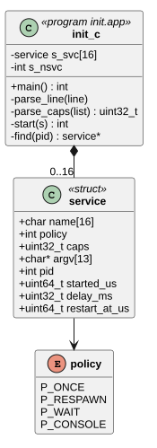
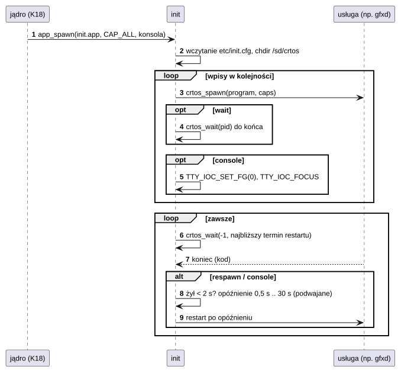

# U01 init

## 1. Identyfikacja

| | |
|---|---|
| Identyfikator | U01 |
| Warstwa | L2 (usługa, proces nieuprzywilejowany; pierwszy proces, uprawnienia `all`) |
| Pliki | `system/services/init/init.c`; konfiguracja `rootfs/etc/init.cfg` → `/sd/crtos/etc/init.cfg` |
| Program | `/sd/crtos/sbin/init.app` (uruchamiany przez jądro, K18) |

## 2. Odpowiedzialność

- Uruchomienie usług i programów z `init.cfg` w podanej kolejności, z podanymi
  uprawnieniami.
- Nadzór: ponowne uruchamianie usług `respawn` i programu konsoli po ich zakończeniu,
  z rosnącym opóźnieniem dla usług, które kończą się zaraz po starcie.
- Przekazanie konsoli szeregowej programowi `console` (fokus wejścia od kmon).
- Tryb zapasowy: bez `init.cfg` – tylko powłoka na konsoli.

## 3. Wymagania

| ID | Wymaganie | Weryfikacja |
|---|---|---|
| REQ-U01-01 | Usługa dostaje dokładnie uprawnienia z `caps=` (domyślnie żadnych). | `crtos kmon procs` |
| REQ-U01-02 | Usługa `respawn` i program `console` są uruchamiane ponownie po zakończeniu; jeśli żyły krócej niż 2 s, opóźnienie rośnie (0,5 s, podwajane, do 30 s). | test ręczny (`kill -p`), log `restarting later` |
| REQ-U01-03 | `wait` blokuje kolejne wpisy do zakończenia programu. | przegląd kodu |
| REQ-U01-04 | Błąd w linii konfiguracji jest zgłaszany i pomijany, pozostałe wpisy działają. | przegląd kodu |

## 4. Interfejs udostępniany

Format `init.cfg`:

```
# komentarz
service <nazwa> <respawn|once|wait> [caps=spawn,kill,module,sys,dev|all] <program> [arg...]
console [caps=...] <program> [arg...]
```

Stan na 30.09.2026: `devmgr` (module, dev), `gfxd` (dev), `inputd` (dev), `osk` (dev),
`netmgr` (sys), `httpd` (brak), `deployd` (sys, dev), `vncd` (sys), `getty` (all), `wm`
(spawn, kill, sys), programy startowe `demo` i `paint` (`once`, wyłączone), konsola `sh`
(all).

## 5. Interfejsy wymagane

L01 (`crtos_spawn`, `crtos_wait`, `ioctl`), K09 (`SYS_SPAWN`, `SYS_WAIT`), K15
(`TTY_IOC_SET_FG`, `TTY_IOC_FOCUS`).

## 6. Struktura statyczna



*Źródło: [U01/struktura-statyczna.puml](../diagramy/U01/struktura-statyczna.puml)*

## 7. Zachowanie dynamiczne



*Źródło: [U01/nadzor-uslug.puml](../diagramy/U01/nadzor-uslug.puml)*

## 8. Implementacja

- Jeden wątek; czeka na zakończenie dowolnego dziecka z limitem czasu równym
  najbliższemu zaplanowanemu restartowi.
- Środowisko dzieci = środowisko `init` (od jądra: `PATH=/flash0/bin:/sd/crtos/bin:/sd/crtos/apps`,
  `HOME=/sd/crtos`, `TMPDIR=/ram`), wejście/wyjście = konsola.

## 9. Obsługa błędów i mechanizmy bezpieczeństwa

| Sytuacja | Reakcja |
|---|---|
| brak `init.cfg` | tylko powłoka na konsoli |
| nieznana wartość `caps` | komunikat, wartość pominięta |
| program nie startuje | `init: cannot start ...`, dalsze wpisy |
| usługa pada w kółko | rosnące opóźnienie (do 30 s) |

## 10. Konfiguracja

`MAX_SVC` (16), `MAX_ARGS` (12); plik `init.cfg`.

## 11. Weryfikacja

- Start płytki: wszystkie usługi w `crtos kmon procs`.
- Restart menedżera okien z programu Settings (A02) i `kill -p` usług (ręcznie).

## 12. Ograniczenia i znane problemy

- Jeśli zakończy się sam `init`, nikt nie restartuje usług (jądro nie uruchamia go
  ponownie).
- Brak zależności między usługami: kolejność wynika z pliku, a usługi czekają na siebie
  same (np. `port_connect` z limitem czasu).
