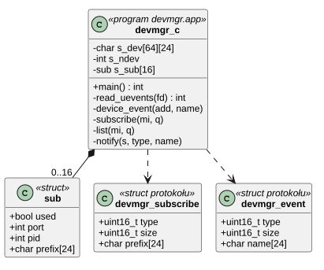
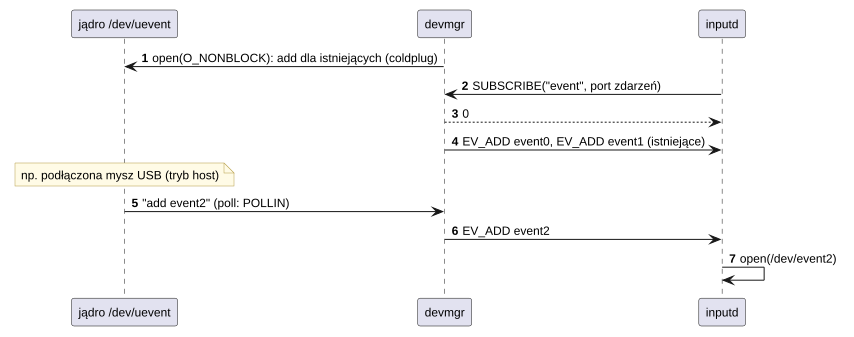

# U02 devmgr

## 1. Identyfikacja

| | |
|---|---|
| Identyfikator | U02 |
| Warstwa | L2 (usługa, uprawnienia `module`, `dev`) |
| Pliki | `system/services/devmgr/devmgr.c`; protokół `system/lib/libcrtos/include/devmgr_proto.h` |
| Port IPC | `devmgr` |

## 2. Odpowiedzialność

- Śledzenie plików urządzeń na podstawie powiadomień jądra (`/dev/uevent`, K17).
- Subskrypcje: usługa podaje przedrostek nazwy (np. `event`) i port; dostaje zdarzenia
  `ADD` dla istniejących i nowych urządzeń oraz `REMOVE` dla usuniętych.
- Lista urządzeń na żądanie (`DEVMGR_LIST`, np. `gfxinfo`).
- (Planowane) ładowanie modułów dla urządzeń podłączanych w czasie pracy – moduły dla
  urządzeń z drzewa ładuje jądro przy starcie (K18).

## 3. Wymagania

| ID | Wymaganie | Weryfikacja |
|---|---|---|
| REQ-U02-01 | Nowy subskrybent dostaje `ADD` dla każdego pasującego urządzenia, które już istnieje. | `inputd` po restarcie (ręcznie) |
| REQ-U02-02 | Subskrypcja jest usuwana, gdy port subskrybenta się rozłączy (`POLLHUP`, `EPIPE`). | przegląd kodu |
| REQ-U02-03 | Wysłanie zdarzenia do subskrybenta czeka najwyżej 500 ms (zablokowany subskrybent nie zatrzymuje devmgr na stałe). | przegląd kodu |

## 4. Interfejs udostępniany (`devmgr_proto.h`)

| Komunikat | Rodzaj | Treść | Odpowiedź |
|---|---|---|---|
| `DEVMGR_SUBSCRIBE` | `msg_call` + uchwyt portu zdarzeń | `struct devmgr_subscribe {type, size, prefix[24]}` | `int32` 0 albo `-ENOSPC` |
| `DEVMGR_LIST` | `msg_call` | przedrostek | nazwy rozdzielone `\n` |
| `DEVMGR_EV_ADD`, `DEVMGR_EV_REMOVE` | `msg_send` do subskrybenta | `struct devmgr_event {type, size, name[24]}` | — |

## 5. Interfejsy wymagane

L01 (porty IPC, `poll`, `read`), K17 (`/dev/uevent`), K10.

## 6. Struktura statyczna

*Źródło: [U02/struktura-statyczna.puml](../diagramy/U02/struktura-statyczna.puml)*

## 7. Zachowanie dynamiczne

*Źródło: [U02/subskrypcja-i-nowe-urzadzenie.puml](../diagramy/U02/subskrypcja-i-nowe-urzadzenie.puml)*

## 8. Implementacja

- Jedna pętla `poll`: port `devmgr`, `/dev/uevent` i porty subskrybentów (tylko do
  wykrycia rozłączenia).
- Tablice o stałym rozmiarze (64 urządzenia, 16 subskrybentów).

## 9. Obsługa błędów i mechanizmy bezpieczeństwa

| Sytuacja | Reakcja |
|---|---|
| brak `/dev/uevent` albo portu | komunikat, koniec (init restartuje) |
| brak miejsca na subskrypcję | `-ENOSPC`, uchwyt zamknięty |
| martwy subskrybent | subskrypcja usunięta |

## 10. Konfiguracja

`MAX_DEV` (64), `MAX_SUBS` (16).

## 11. Weryfikacja

- `crtos run gfxinfo` (lista urządzeń z devmgr), działanie `inputd` i `gfxd` po starcie
  i po ich restarcie.

## 12. Ograniczenia i znane problemy

- Ładowanie modułów dla nowych urządzeń (hot plug) nie jest zaimplementowane.
- Brak kontroli, kto subskrybuje (dowolny proces może poznać listę urządzeń).
