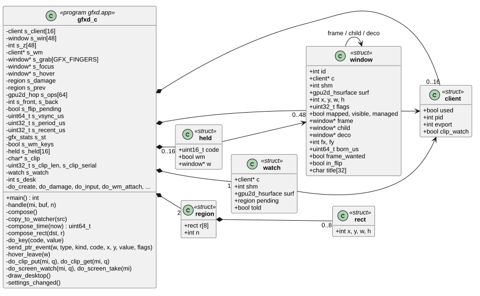
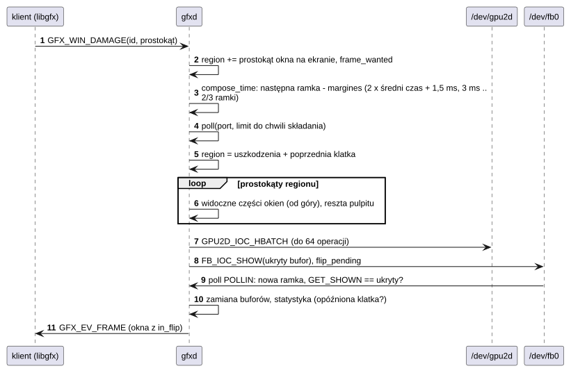
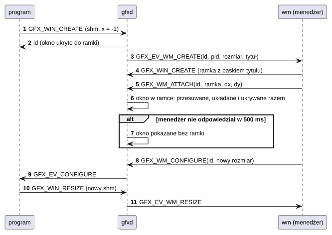
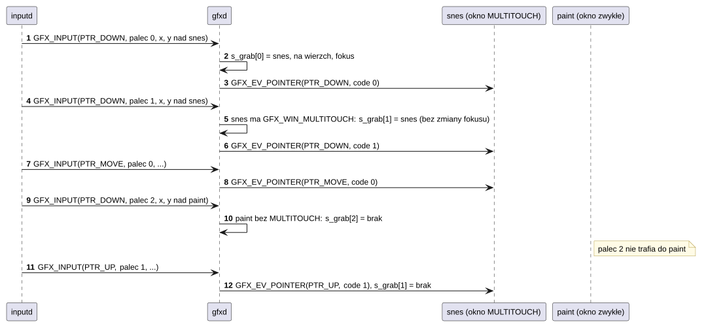
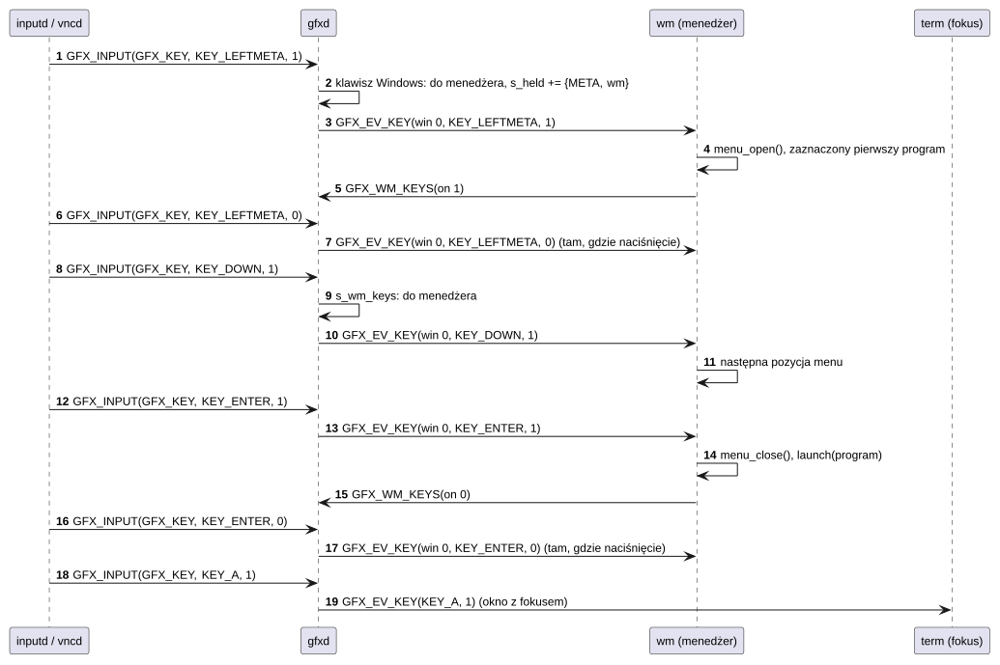

# U03 gfxd: serwer grafiki

## 1. Identyfikacja

| | |
|---|---|
| Identyfikator | U03 |
| Warstwa | L2 (usługa, uprawnienie `dev`) |
| Pliki | `system/services/gfxd/gfxd.c`; protokół `system/lib/libgfx/include/gfx_proto.h` |
| Port IPC | `gfx` |
| Urządzenia | `/dev/fb0`, `/dev/gpu2d` (S03) |

## 2. Odpowiedzialność

- **Właściciel ekranu**: składa pulpit i okna klientów w ukrytym buforze ramki
  akceleratorem 2D (jedna paczka operacji na klatkę) i pokazuje go od następnej ramki
  (bez rozrywania obrazu).
- **Tylko zmiany**: składanie obejmuje listę prostokątów – uszkodzenia tej klatki
  i poprzedniej (której ukryty bufor jeszcze nie widział); zasłonięte części okien są
  pomijane.
- **Rytm klatek**: składanie zaczyna się tuż przed następną ramką (margines z zmierzonego
  czasu składania), a klienci dostają `GFX_EV_FRAME`, gdy ich zmiany są na ekranie.
- **Okna**: tworzenie (piksele w pamięci współdzielonej klienta), przesuwanie, kolejność,
  pokazywanie, tytuły, zmiana rozmiaru; okna `TOPMOST`, `NOFRAME`, `NOFOCUS`, `NOINPUT`,
  `MULTITOUCH`.
- **Wejście**: wskaźnik (od `inputd`) do okna pod palcem (okno idzie na wierzch i dostaje
  fokus, przytrzymanie trzyma okno do podniesienia palca); przy wielodotyku każdy palec
  ma swoje okno, a palce poza pierwszym trafiają tylko do okien `MULTITOUCH`; klawisze
  i gałki pada do okna z fokusem (okno, które dostaje fokus, dostaje też gałki wychylone
  w tej chwili).
- **Menedżer okien**: jeden klient może być menedżerem (U04/A01 `wm`); dostaje zdarzenia
  o oknach innych klientów, dołącza je do ramek (dekoracji); przy jego końcu okna zostają,
  a nowy menedżer je przejmuje.
- **Mysz i klawisze systemu**: zdarzenia wskaźnika niosą flagę `GFX_PTR_MOUSE` (mysz, nie
  palec); obroty kółka (`GFX_WHEEL`) idą do okna pod kursorem jako `GFX_EV_WHEEL`; ruch myszy
  bez przycisku (`GFX_PTR_HOVER`) dostaje okno pod kursorem, jeśli o to prosi
  (`GFX_WIN_HOVER`: podpowiedzi, podświetlenie), z `GFX_PTR_LEAVE`, gdy kursor je opuści; klawisze
  Windows idą do menedżera okien, a na czas jego menu (`GFX_WM_KEYS`) wszystkie klawisze;
  puszczenie (i powtórzenia) klawisza idą tam, gdzie jego naciśnięcie.
- **Schowek**: jeden tekst dla wszystkich programów (do 64 KB), przyjmowany i oddawany
  kawałkami, z powiadomieniem obserwatorów (`GFX_EV_CLIP`).
- **Kopia ekranu** dla zdalnego pulpitu (U08): zmiany każdej klatki trafiają akceleratorem do
  pamięci współdzielonej klienta z `CAP_SYS`, a on dowiaduje się, gdzie się zmieniło.
- **Tapeta i wygląd**: pulpit pod oknami to tapeta z ustawień wyglądu (`/sd/crtos/etc/ui.cfg`,
  L02), rysowana raz do pamięci pulpitu. Po `GFX_SETTINGS` (ustawienia zmienione) gfxd rysuje
  ją od nowa, odświeża cały ekran i wysyła `GFX_EV_SETTINGS` wszystkim klientom, żeby
  dopasowali skalę, czcionki i kolory.

## 3. Wymagania

| ID | Wymaganie | Weryfikacja |
|---|---|---|
| REQ-U03-01 | Na ekranie nigdy nie jest widoczny częściowo złożony obraz (składanie w ukrytym buforze, przełączenie na granicy ramek). | obserwacja, `gfxinfo` |
| REQ-U03-02 | Klient dostaje `GFX_EV_FRAME` dopiero, gdy klatka z jego zmianami jest na ekranie. | `gfxdemo` (płynna animacja 58 fps) |
| REQ-U03-03 | Klient może zmieniać tylko swoje okna (identyfikator + pid nadawcy); operacje menedżera okien są przyjmowane tylko od zarejestrowanego menedżera. | przegląd kodu |
| REQ-U03-04 | Okna klienta, którego port zdarzeń się rozłączył (koniec procesu), są usuwane. | zabicie programu z oknem (`sysmon`) |
| REQ-U03-05 | Nowe okno czeka najwyżej 500 ms na ramkę menedżera, potem pojawia się bez ramki. | przegląd kodu, restart `wm` |
| REQ-U03-06 | Piksele okien są czytane przez akcelerator tylko przez uchwyt pamięci współdzielonej (jądro sprawdza granice, S03). | przegląd kodu |
| REQ-U03-07 | Gałki pada (`GFX_STICK`) trafiają tylko do okna z fokusem jako `GFX_EV_STICK`; okno, które dostaje fokus, dostaje zaraz po `GFX_EV_FOCUS` gałki, które nie są w spoczynku. | przegląd kodu, `gfxtap stick`, gra `voxel` |
| REQ-U03-08 | Każdy palec (numer w `code` wskaźnika, 0…`GFX_FINGERS − 1`) ma od naciśnięcia do podniesienia własne okno. Palec 0 podnosi okno i daje mu fokus (jak dotąd) i trafia do każdego okna; pozostałe palce trafiają tylko do okna z `GFX_WIN_MULTITOUCH`, bez zmiany kolejności okien i fokusu, a inne okna ich nie dostają. Zdarzenie `GFX_EV_POINTER` niesie numer palca w `code`. | przegląd kodu, `gfxtap hold` z oknem `snes` (zrzut: dwa przyciski wciśnięte) |
| REQ-U03-09 | Klawisze `KEY_LEFTMETA` i `KEY_RIGHTMETA` trafiają (gdy działa menedżer okien) tylko do menedżera jako `GFX_EV_KEY` z `win` 0, a gdy menedżer włączył `GFX_WM_KEYS` – wszystkie klawisze. Puszczenie i powtórzenia klawisza trafiają tam, gdzie jego naciśnięcie (do 16 klawiszy naraz), także po zmianie fokusu; po zniknięciu okna nigdzie. | `gfxtap key 125` (menu otwarte, zrzut), strzałki i Enter w menu uruchamiają program, Super_L i Esc przez VNC (30.09.2026) |
| REQ-U03-10 | Obrót kółka (`GFX_WHEEL`) trafia do widocznego okna pod kursorem (nie `GFX_WIN_NOINPUT`) jako `GFX_EV_WHEEL` (`code` oś, `value` ząbki, `x`/`y` względem okna); zdarzenia wskaźnika i kółka mają długość `GFX_EVENT_PTR` i w `flags` niosą `GFX_PTR_MOUSE` od myszy, 0 od palca. | `gfxtap wheel` nad menu, listą `sysmon` i terminalem, `gfxtap mdrag` w terminalu (zaznaczenie) – zrzuty |
| REQ-U03-11 | Schowek zmienia się dopiero po ostatnim kawałku tekstu (`GFX_CLIP_PUT` od `offset` 0 do `total` ≤ `GFX_CLIP_MAX`, kolejne kawałki tylko od tego samego nadawcy i po kolei); każda zmiana zwiększa numer (`serial`) i wysyła `GFX_EV_CLIP` klientom po `GFX_CLIP_WATCH`; niedokończony tekst znika z końcem nadawcy. | `term` Ctrl+C/Ctrl+V, VNC w obie strony (`vnc_clip`: tekst płytki u przeglądarki, tekst przeglądarki na płytce) |
| REQ-U03-12 | Kopię ekranu (`GFX_SCREEN_WATCH`) dostaje tylko klient z `CAP_SYS`, jeden naraz; zmiany klatki są do niej kopiowane osobną paczką po przełączeniu bufora (błąd tej paczki kończy kopię, nie składanie ekranu); `GFX_EV_SCREEN` idzie raz, aż klient odbierze zebrane zmiany (`GFX_SCREEN_TAKE`); kopia kończy się z końcem klienta. | `crtos desktop --shot` = `crtos shot` (poza kursorem myszy), przegląd kodu |
| REQ-U03-13 | Ruch myszy bez przycisku (`GFX_INPUT` rodzaju `GFX_PTR_HOVER`) trafia jako `GFX_EV_POINTER` rodzaju `GFX_PTR_HOVER` (`x`/`y` względem okna, `flags` `GFX_PTR_MOUSE`) tylko do widocznego okna pod kursorem z `GFX_WIN_HOVER`; nie podnosi okna i nie zmienia fokusu. Okno, nad którym był kursor, dostaje jeden `GFX_PTR_LEAVE`, gdy kolejny ruch trafia nad inne okno (albo nad pulpit) albo gdy samo zostaje schowane. Po usunięciu okna nie dostaje go nikt. Okna bez tej flagi nie dostają żadnego z tych zdarzeń. | `gfxtap hover` nad paskiem zadań i menu `wm` (podpowiedź, zaznaczenie, zniknięcie podpowiedzi po zejściu kursora), ruch przez VNC (30.09.2026), przegląd kodu |
| REQ-U03-14 | Pulpit pokazuje tapetę z `ui.cfg` od startu gfxd (bez pliku: domyślna). Po `GFX_SETTINGS` (od dowolnego klienta) gfxd wczytuje plik ponownie, rysuje tapetę, uszkadza cały ekran i wysyła każdemu klientowi z portem zdarzeń jedno `GFX_EV_SETTINGS` (`value`: kolejny numer zmiany). Tapeta, której nie da się narysować, daje wbudowaną i komunikat w logu; ekran nie zostaje pusty. | `appearance wallpaper …` i Settings na płytce: Aurora 321 ms przy starcie, plik 800×500 101 ms, `color:`, zmiana skali przestawia `wm` i programy (03.10.2026) |

## 4. Interfejs udostępniany (`gfx_proto.h`)

| Komunikat | Rodzaj | Opis |
|---|---|---|
| `GFX_HELLO` | call + uchwyt portu zdarzeń | rejestracja klienta → rozmiar i format ekranu |
| `GFX_WIN_CREATE` | call + uchwyt shm | nowe okno (`x, y, w, h, stride, format, offset, flags, title`) → `id`, pozycja; `flags` `GFX_WIN_MULTITOUCH`: okno dostaje wszystkie palce, `GFX_WIN_HOVER`: ruch myszy bez przycisku nad nim |
| `GFX_WIN_DESTROY`, `RAISE`, `MOVE`, `SHOW`, `TITLE` | send | operacje na własnym oknie |
| `GFX_WIN_DAMAGE` | send | zmieniony prostokąt (współrzędne okna) |
| `GFX_WIN_RESIZE` | call + nowy uchwyt shm | nowe piksele i rozmiar (odpowiedź na `GFX_EV_CONFIGURE`) |
| `GFX_INPUT` | send | zdarzenie wejścia (`inputd`, `vncd`, `osk`, `gfxtap`): wskaźnik we współrzędnych ekranu (`code` = numer palca; `GFX_PTR_HOVER`: mysz bez przycisku), klawisz albo gałka pada (`GFX_STICK`, `code` = `GFX_STICK_LEFT/RIGHT/TRIGGERS`, `x`/`y` ±32767) |
| `GFX_STATS` | call | `struct gfx_stats` (klatki, czasy składania, opóźnienia) |
| `GFX_WM_REGISTER` | call | zostań menedżerem okien (`-EBUSY`, gdy jest inny) |
| `GFX_WM_ATTACH`, `WM_CLOSE`, `WM_FOCUS`, `WM_CONFIGURE` | send (menedżer) | ramki, zamykanie, fokus, prośba o rozmiar |
| `GFX_WM_KEYS` | send (menedżer) | `on` 1: wszystkie klawisze do menedżera (jego menu), 0: do okna z fokusem |
| `GFX_CLIP_PUT` | call | kawałek nowego tekstu schowka (`total`, `offset`, `len`, do 480 B) → `struct gfx_status` |
| `GFX_CLIP_GET` | call | kawałek schowka od `offset` → `total`, `serial`, `len`, dane |
| `GFX_CLIP_WATCH` | send | odtąd `GFX_EV_CLIP` przy nowym tekście |
| `GFX_SCREEN_WATCH` | call + uchwyt shm (`CAP_SYS`) | kopia ekranu RGB565 w pamięci klienta (`stride`) |
| `GFX_SCREEN_TAKE` | call | prostokąty zmienione od poprzedniego razu (do 16) |
| `GFX_SETTINGS` | send | ustawienia wyglądu w `ui.cfg` zmienione: nowa tapeta, `GFX_EV_SETTINGS` do wszystkich |

Zdarzenia do klienta (`struct gfx_event`): `GFX_EV_POINTER` (`kind`: `GFX_PTR_DOWN/MOVE/UP`,
dla okien z `GFX_WIN_HOVER` także `GFX_PTR_HOVER` i `GFX_PTR_LEAVE`; `code`: palec, `flags`:
`GFX_PTR_MOUSE`), `KEY`, `FRAME`, `FOCUS`, `CLOSE`, `CONFIGURE`, `STICK` (gałka pada: `code`,
`x`, `y`), `WHEEL` (kółko: `code` oś, `value` ząbki), `CLIP` (nowy tekst schowka), `SCREEN`
(zmiana ekranu dla kopii), `SETTINGS` (zmiana wyglądu, `value` numer); do menedżera: `GFX_EV_WM_CREATE`, `DESTROY`, `TITLE`, `MAP`,
`FOCUS`, `RESIZE` i `GFX_EV_KEY` z `win` 0 (klawisze Windows, klawisze jego menu). Wejście
`GFX_INPUT` ma też rodzaj `GFX_WHEEL` (`code` oś, `value` ząbki, `x`/`y` kursor), a `value`
wskaźnika niesie `GFX_PTR_MOUSE`.

## 5. Interfejsy wymagane

S03 (`/dev/fb0`: `GET_INFO`, `GET_SHM`, `SHOW`, `GET_FRAME`, `GET_SHOWN`, `poll`;
`/dev/gpu2d`: `HBATCH`), K10 (port `gfx`, wiadomości, uchwyty), K11 (pamięć
współdzielona okien i pulpitu), K12 (`poll`), L01, L02 (`ui_settings_load`,
`gfx_wallpaper_draw`), K13 (`ui.cfg`, pliki tapet).

## 6. Struktura statyczna

*Źródło: [U03/struktura-statyczna.puml](../diagramy/U03/struktura-statyczna.puml)*

## 7. Zachowanie dynamiczne

### 7.1 Klatka

*Źródło: [U03/klatka.puml](../diagramy/U03/klatka.puml)*

### 7.2 Okno pod menedżerem

*Źródło: [U03/okno-pod-menedzerem.puml](../diagramy/U03/okno-pod-menedzerem.puml)*

### 7.3 Dwa palce

*Źródło: [U03/dwa-palce.puml](../diagramy/U03/dwa-palce.puml)*

### 7.4 Klawisz Windows i menu programów

*Źródło: [U03/klawisz-windows.puml](../diagramy/U03/klawisz-windows.puml)*

Kopię ekranu dla zdalnego pulpitu pokazuje diagram sekwencji U08, a zmianę wyglądu (tapeta,
`GFX_EV_SETTINGS`) diagram L02 „Zmiana wyglądu”.

## 8. Implementacja

- Jeden wątek, pętla `poll`: port `gfx`, `/dev/fb0` (tylko w oczekiwaniu na przełączenie),
  porty zdarzeń klientów (wykrycie rozłączenia).
- Region: do 8 prostokątów, łączonych, gdy to się opłaca (`mergeable`); widoczność okna
  liczona odejmowaniem prostokątów okien wyżej (do 16 części na okno).
- Pulpit: obraz RGB565 w pamięci współdzielonej gfxd (tworzonej raz, przy zmianie tapety
  rysowanej w tym samym miejscu: `draw_desktop`); okna w pamięci klientów (uchwyty
  przekazane przy tworzeniu).
- Wygląd: `settings_changed()` – `draw_desktop()` (`ui_settings_load`,
  `gfx_wallpaper_draw`, czas w logu), `damage` całego ekranu, licznik zmian i
  `GFX_EV_SETTINGS` (krótkie zdarzenie, bez czekania) do każdego klienta.
- Wejście: `s_grab[GFX_FINGERS]` – okno każdego palca, ustawiane przy `PTR_DOWN` (palec 0:
  okno pod palcem, podniesienie, fokus, pulpit do menedżera; inne palce: okno pod palcem
  tylko z `GFX_WIN_MULTITOUCH`, inaczej żadne), używane przy `PTR_MOVE`/`PTR_UP` i
  czyszczone przy `PTR_UP` oraz schowaniu lub usunięciu okna.
- Klawisze: `s_held[16]` pamięta dla każdego trzymanego klawisza, dokąd poszło naciśnięcie
  (menedżer albo okno); puszczenie i powtórzenie idą tam, wpis znika przy puszczeniu, a przy
  usunięciu okna jego wpisy tracą adresata. Nowe naciśnięcie idzie do menedżera, gdy to
  klawisz Windows albo `s_wm_keys`, inaczej do okna z fokusem.
- Kółko: `window_at(x, y)` jak dla palca, bez podnoszenia okna i fokusu; `send_ptr_event`
  wysyła zdarzenia wskaźnika i kółka w długości `GFX_EVENT_PTR` (z `flags`).
- Ruch myszy bez przycisku: `s_hover` to okno z `GFX_WIN_HOVER`, nad którym jest kursor.
  `GFX_PTR_HOVER` szuka okna pod kursorem (`window_at`, więc kursor i podpowiedzi
  z `GFX_WIN_NOINPUT` są pomijane). Okno bez flagi liczy się jak brak okna.
  `hover_leave()` wysyła poprzedniemu `GFX_PTR_LEAVE`. Schowanie okna (`update_visible`)
  wysyła `LEAVE`, a usunięcie tylko czyści `s_hover`.
- Schowek: tekst w stercie gfxd (do 64 KB) i nowy tekst w budowie (nadawca, `offset`); po
  ostatnim kawałku zamiana, `s_clip_serial++`, `GFX_EV_CLIP` do obserwatorów. Odpowiedź
  `GFX_CLIP_GET` ma długość nagłówka i danych (≤ 500 B).
- Kopia ekranu: `s_watch` (klient, uchwyt shm, powierzchnia, zebrane prostokąty, czy
  powiadomiony). Po `FB_IOC_SHOW` `copy_to_watcher` kopiuje prostokąty `s_damage` z bufora
  właśnie złożonego do kopii osobnym `GPU2D_IOC_HBATCH` i dodaje je do zebranych; start kopii
  uszkadza cały ekran, więc pierwsza klatka kopiuje wszystko. Uprawnienie klienta:
  `crtos_proc_info` jego pid.
- Statystyka (`GFX_STATS`): klatki pokazane i złożone, czas składania (ostatni,
  maksymalny, średni), klatki spóźnione, opóźnienie od początku ramki; `gfxinfo -b`
  pokazuje czasy faz.
- Wynik (EVKB): złożenie klatki ok. 1,7 ms, animacja 58 fps (ekran 58,7 Hz).

## 9. Obsługa błędów i mechanizmy bezpieczeństwa

| Sytuacja | Reakcja |
|---|---|
| zły format, zerowy rozmiar okna, brak uchwytu | `-EINVAL` w odpowiedzi |
| brak miejsca na okno (48) / klienta (16) | `-ENOSPC` |
| cudze okno | komunikat ignorowany |
| koniec procesu klienta | jego okna usunięte, fokus przeniesiony |
| koniec menedżera okien | ramki znikają, okna zostają, nowy menedżer je przejmuje |
| błąd powierzchni w paczce | jądro odrzuca operację (S03) |
| kopia ekranu bez `CAP_SYS` / gdy ma ją inny klient / za mały `stride` | `-EPERM` / `-EBUSY` / `-EINVAL` |
| paczka kopii ekranu odrzucona (np. za mała pamięć klienta) | kopia zatrzymana, komunikat; ekran składa się dalej |
| kawałek schowka nie po kolei, od innego nadawcy, ponad 64 KB | `-EINVAL`, schowek bez zmian |
| tapeta: brak pliku, zły format | wbudowana tapeta, komunikat `gfxd: wallpaper …` |
| brak pamięci na pulpit | pulpit bez obrazu (czarny), okna dalej działają |
| brak pamięci na tekst schowka | `-ENOMEM`, schowek bez zmian |

## 10. Konfiguracja

`MAX_CLIENTS` (16), `MAX_WINDOWS` (48), `MAX_RECTS` (8), `MAX_PARTS` (16),
`GFX_WM_WAIT_MS` (500), `KEYS_HELD` (16), `GFX_CLIP_MAX` (64 KB), `GFX_CLIP_PIECE` (480 B),
`GFX_SCREEN_RECTS` (16); sterta 256 KB (dwa teksty schowka naraz).

## 11. Weryfikacja

- `crtos run gfxinfo -b` (czas faz, 58 fps), `crtos run gfxtap tap X Y` (wejście
  syntetyczne), `gfxtap hold X0 Y0 X1 Y1 [MS]` (dwa palce naraz), `crtos shot`.
- `crtos bench` (`fps`, `compose`).
- Restart `wm` z programu Settings bez zamykania programów (ręcznie).
- 30.09.2026: `gfxtap key 125` otwiera menu programów z zaznaczonym pierwszym, `gfxtap wheel`
  przewija menu, listę `sysmon` i terminal, strzałki i Enter uruchamiają `term`; w `term`
  `gfxtap mdrag` zaznacza, Ctrl+C / Ctrl+V kopiują i wklejają (zrzuty); przez VNC: obraz
  identyczny ze zrzutem (poza kursorem myszy), klawisz Super_L otwiera menu, schowek w obie
  strony.
- 30.09.2026: `gfxtap hover` (i ruch myszy przez VNC) nad paskiem zadań: podpowiedź `wm`,
  przejście nad inną pozycję i zejście z paska (`GFX_PTR_LEAVE`: podpowiedź znika); nad
  menu: zaznaczenie pozycji pod kursorem.
- 03.10.2026: `appearance` przez kmon i Settings: sześć tapet wbudowanych, kolor, plik PPM
  (`crtos wallpaper`), zmiana skali 100–200%; `gfxinfo`: ostatnia klatka 6,5 ms, średnia
  11,8 ms (wliczone pełne przerysowania po zmianach wyglądu).

## 12. Ograniczenia i znane problemy

- `GFX_INPUT` jest przyjmowany od każdego procesu (tak działa `gfxtap`): dowolny program
  może wstrzykiwać dotyk, klawisze, kółko, ruch myszy i gałki pada.
- `GFX_PTR_HOVER` jest liczony tylko przy ruchu myszy: okno, które przesunie się pod
  nieruchomy kursor (albo spod niego), dowie się o tym dopiero przy następnym ruchu.
  Przeciąganie z wciśniętym przyciskiem nie aktualizuje `s_hover`.
- Schowek czyta i zmienia każdy klient (jak w innych systemach okien); nie przechowuje
  niczego poza tekstem i znika z restartem gfxd.
- `GFX_SETTINGS` wysyła każdy klient (bez uprawnień, jak zmiana ustawień w Settings); każde
  oznacza przerysowanie tapety, całego ekranu i okien wszystkich programów.
- Tapetę rysuje wątek gfxd: wbudowana trwa ok. 0,3 s, a duży plik z karty do ok. 1 s na
  6 MB. W tym czasie ekran się nie zmienia, a wejście czeka w kolejce.
- Kopia ekranu zajmuje akcelerator na czas kopiowania zmian (cały ekran: ok. 2–3 ms) w każdej
  klatce, dopóki klient jej używa.
- Operacja z błędną powierzchnią przerywa resztę paczki danej klatki (wynik `HBATCH` to
  pierwszy błąd), więc wadliwy klient może zaburzyć jedną klatkę innych okien.
- Duży plik (ok. 1300 linii) – kandydat do podziału (kompozycja / okna / wejście).
